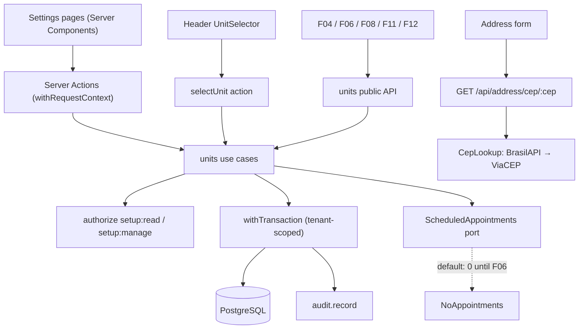

# Technical Specification: F02. Units and Rooms

**Complexity:** medium

## 1. Technical Overview

**What.** A new `units` module that manages the organization's units (identification, address with CEP lookup, time zone, weekly business hours, closures) and the rooms of each unit, plus the unit selector in the application header. Units and rooms are never deleted, only deactivated; closures can be deleted while they are still in the future.

**Why.** Scheduling (F06), professionals' working hours (F04), documents (F08) and the daily cash register (F11) all need a stable definition of where and when the clinic operates. F02 makes that data available through a small public API, so later features never read the `units` tables directly.

**How it fits the codebase.** F02 follows every pattern established by F01: a module under `src/modules/units` with a public `index.ts`, use cases that call `authorize` → `parseInput` → `withTransaction` with auditing, `Result` with stable error codes and pt-BR messages, Server Actions wrapped in `withRequestContext`, forms with react-hook-form + `HydratedFieldset` + `useFormDraft`, the tenant-scoped Prisma client, migrations with CHECK constraints, and integration tests on Testcontainers.

### Scope

**Included (full scope; the PRD has no Core/Full split for F02):**
- Units: create, edit, deactivate, reactivate; name, CNPJ, address (CEP lookup), phone, email, time zone.
- Business hours per weekday: closed, or up to 2 intervals, 5-minute granularity.
- Closures: date or date range with reason; list, create (with overlap confirmation), delete future closures.
- Rooms: create, edit, deactivate, reactivate, within each unit.
- Unit selector in the header, remembered per user in the database.
- CEP lookup service (shared, also used by F05).
- `ScheduledAppointments` port with a zero default, replaced by F06.
- Integrated cross-cutting concerns: authorization (`setup:read`, `setup:manage`), audit of every change, tenant scoping of the new tables.

**Input contracts (Consumes):** none from other features. Authorization and organization context come from F01.

**Output contracts (Provides):**
- `units.listUnits(ctx, { activeOnly })` and `units.getUnitSchedule(ctx, unitId)`: units with time zone, business hours and closures, and rooms with active status. Used by F04 and F06.
- `units.getUnitContact(ctx, unitId)`: unit name, address and phone. Used by F08.
- `units.listUnits(ctx)`: unit list for per-unit cash registers. Used by F11.
- `units.getSelectedUnit(ctx)`: the unit chosen in the header. Used by F06, F11 and F12 to pre-filter.
- `units.registerScheduledAppointments(impl)`: extension point that F06 implements.

### Traceability to the PRD

| PRD block (F02) | Where it is specified |
|---|---|
| Provides | Scope → output contracts; Section 5 (public API) |
| Capabilities | Sections 3, 5 and 6 (limits, validation, constraints) |
| Experience | Section 2 (pages), Section 5 (actions) |
| Error Handling | Section 5 (error codes and messages) |
| Acceptance criteria (Section 9, F02) | Section 7, acceptance tests |
| Cross-Feature Integration (F02 as provider) | Section 7, provider-side contract tests |

## 2. Architecture Impact

### Affected components

| Area | Path | Role |
|---|---|---|
| Module | `src/modules/units/` | Domain rules, use cases, repository access, UI, public API |
| Shared kernel | `src/shared/kernel/cnpj.ts` (moved from identity), `errors.ts`, `action-result.ts` | CNPJ reuse; error parameters for messages with counts |
| Shared address | `src/shared/address/cep-lookup.ts` | CEP lookup port and BrasilAPI/ViaCEP adapter |
| Routes | `src/app/(app)/settings/units/**`, `src/app/api/address/cep/[cep]/route.ts` | Pages, Server Actions, CEP route |
| Shell | `src/app/(app)/layout.tsx`, `src/shared/ui/app-shell/navigation.ts` | Unit selector in the header; "Unidades" menu item |
| Tenancy | `src/shared/db/tenant.ts` | Registers the new tenant models |
| Database | `prisma/schema.prisma`, `prisma/migrations/0003_units/` | Units, business hours, closures, rooms, unit selection |

### Data flow



## 3. Technical Decisions

| Decision | Chosen Approach | Alternative Considered | Trade-off |
|---|---|---|---|
| Time zone | Per unit, defaulting to the organization's time zone when the unit is created. Recorded as ADR-019 | Organization time zone only | Correct for clinics with units in different time zones (for example São Paulo and Manaus). Later features read the unit's zone for calendar logic. |
| CEP lookup | Server-side route `/api/address/cep/:cep` (session required, 30 lookups per minute per user) calling BrasilAPI v2, falling back to ViaCEP, total timeout 3 s | Browser calls to a public API | The CSP only allows same-origin requests, and the route shields users from provider outages. If both providers fail, the address is typed manually. |
| Selected unit storage | Table `unit_selection` (user ID → unit ID) owned by the units module | Column on `app_user`; cookie | Follows the user across devices without the units module writing to identity's table. |
| Appointment-dependent rules | Port `ScheduledAppointments` (`countFutureInRoom`, `countFutureInUnit`, `countInRange`, `countOutsideHours`) with a default that returns 0; F06 registers the real implementation | Implement the rules in F06 | Rules, messages and tests exist now; the default makes them inert until appointments exist (dependency inversion, ADR-007). |
| Business hours storage | One row per interval in `unit_business_hours` (ISO weekday 1–7, start and end in minutes) | JSON column | Constraints enforce ranges and granularity in the database; F04 and F06 can query intervals with SQL. |
| Business hours validation | Pure functions in `units/domain/business-hours.ts` | Zod refinements only | Reused by F04 (working hours must fall within business hours) and unit-tested without a database. |
| Closure overlap confirmation | Two-step: without `confirmOverlap` the action returns `UNITS_CLOSURE_CONFIRMATION_REQUIRED` with the count; the UI confirms and resends with `confirmOverlap: true` | Always save and only warn | Matches the PRD ("requiring confirmation") without client-side appointment queries. |
| Messages with counts | `DomainError` gains optional `params`; `toActionResult` replaces `{name}` placeholders in the pt-BR message | Building the message in the use case | Messages stay in `messages.ts`; use cases stay free of UI text. |
| CNPJ validation | Moved from `identity/domain` to `shared/kernel/cnpj.ts` | Duplicate the function | Two modules now need it; the kernel is the shared home for pure value rules. |
| Uniqueness | Case-insensitive unique indexes: `(organization_id, lower(name))` for units and `(unit_id, lower(name))` for rooms | Application-only checks | Concurrent creation cannot produce duplicates. The use case checks first for a friendly message; the index is the guarantee. |

### Assumptions

These were decided during this spec, not by the PRD, and can be overridden:
- The limits of 20 units and 30 rooms per unit count **active** records; reactivating an item also checks the limit.
- Deactivating a unit follows the room rule (blocked while it has future appointments) and hides its rooms from booking forms.
- A closure is a whole-day range (`starts_on`–`ends_on`, inclusive) in the unit's time zone. Future closures can be deleted; past closures are kept as history.
- The "100 future closures per unit" limit counts closures whose end date is today or later.
- Closure reason is required (2–120 characters).
- Weekdays use ISO numbering (1 = Monday … 7 = Sunday); the UI lists Monday first, as the PRD shows ("Seg–Dom").
- An interval can end at 24:00 (1440 minutes); overnight intervals are not supported.
- The unit selector shows only active units. When the stored unit is inactive or missing, the first active unit by name is used. With no units, the selector shows "Nenhuma unidade" and a link to create one (for users with `setup:manage`).
- Front Desk and Professional users can view the units pages read-only (`setup:read`); only Administrator and Manager can change them (`setup:manage`), per the F01 permission matrix.
- The address state is a Brazilian UF (2 letters). The CEP is stored with 8 digits.

## 4. Component Overview

### Frontend

| File Path | New/Modified | Purpose | Key Responsibilities |
|---|---|---|---|
| `src/app/(app)/settings/units/page.tsx` | New | Units list | Cards with name, city, active rooms count and status; "Nova unidade" button for `setup:manage`; filter active/inactive |
| `src/app/(app)/settings/units/new/page.tsx` | New | Create unit | Data form only; after creation, redirects to the unit page on the "Horário de funcionamento" tab |
| `src/app/(app)/settings/units/[unitId]/page.tsx` | New | Unit details | Tabs Dados, Horário de funcionamento, Salas, Fechamentos (`?tab=`); read-only without `setup:manage` |
| `src/app/(app)/settings/units/actions.ts` | New | Server Actions | One action per use case, wrapped in `withRequestContext` |
| `src/modules/units/ui/unit-form.tsx` | New | Unit data form | Fields, CNPJ mask, CEP lookup that fills the address, time zone select, draft persistence |
| `src/modules/units/ui/business-hours-form.tsx` | New | Weekly hours | 7 rows with "Aberto" switch and up to 2 intervals; "Copiar para todos os dias úteis"; warning toast with affected appointments |
| `src/modules/units/ui/rooms-panel.tsx` | New | Rooms | Inline list with add, rename, description, deactivate/reactivate |
| `src/modules/units/ui/closures-panel.tsx` | New | Closures | Upcoming closures list, create form with overlap confirmation dialog, delete |
| `src/modules/units/ui/unit-selector.tsx` | New | Header selector | Select of active units; calls `selectUnitAction` and refreshes |
| `src/app/(app)/layout.tsx` | Modified | Shell | Renders `UnitSelector` in the header slot |
| `src/shared/ui/app-shell/navigation.ts` | Modified | Menu | "Unidades" under Configurações (`setup:read`) |
| `src/shared/ui/components/{tabs,switch,textarea,alert-dialog}.tsx` | New | Design system | shadcn/ui components added with the CLI |

### Backend

| File Path | New/Modified | Purpose | Key Responsibilities |
|---|---|---|---|
| `src/modules/units/domain/business-hours.ts` | New | Hours rules | Validate intervals (granularity, order, overlap, 0–1440); "is open at"; count of intervals outside new hours |
| `src/modules/units/domain/limits.ts` | New | Constants | 20 units, 30 rooms, 100 future closures, name lengths |
| `src/modules/units/application/ports.ts` | New | Ports | `ScheduledAppointments`, `CepLookup`, `UnitsDeps` |
| `src/modules/units/application/schemas.ts` | New | Validation | Zod schemas for unit, hours, room, closure, selection |
| `src/modules/units/application/units.ts` | New | Unit use cases | `listUnits`, `getUnit`, `createUnit`, `updateUnit`, `setUnitActive` |
| `src/modules/units/application/business-hours.ts` | New | Hours use cases | `getBusinessHours`, `replaceBusinessHours` (returns affected appointments) |
| `src/modules/units/application/rooms.ts` | New | Room use cases | `listRooms`, `createRoom`, `updateRoom`, `setRoomActive` |
| `src/modules/units/application/closures.ts` | New | Closure use cases | `listClosures`, `createClosure` (two-step confirmation), `deleteClosure` |
| `src/modules/units/application/selection.ts` | New | Header selection | `getSelectedUnit`, `selectUnit` |
| `src/modules/units/application/provided.ts` | New | Public read API | `getUnitSchedule`, `getUnitContact` |
| `src/modules/units/application/errors.ts` | New | Error codes | Units error factories |
| `src/modules/units/messages.ts` | New | pt-BR messages | Every units error code, with `{count}` placeholders |
| `src/modules/units/infrastructure/no-appointments.ts` | New | Default port | `ScheduledAppointments` that returns 0 |
| `src/modules/units/index.ts` | New | Public API | Use cases bound to deps, UI exports, `registerScheduledAppointments` |
| `src/shared/address/cep-lookup.ts` | New | CEP adapter | BrasilAPI v2 then ViaCEP, 3 s total timeout, normalized result |
| `src/app/api/address/cep/[cep]/route.ts` | New | CEP route | Session check, per-user rate limit, 400 for invalid CEP, 404 when not found |
| `src/shared/kernel/cnpj.ts` | Moved | CNPJ rules | From `identity/domain/cnpj.ts`; identity imports updated |
| `src/shared/kernel/errors.ts`, `action-result.ts` | Modified | Errors with params | `params` on `DomainError`; `{name}` interpolation in `toActionResult` |
| `src/shared/db/tenant.ts` | Modified | Tenancy | Adds `Unit`, `UnitBusinessHours`, `UnitClosure`, `Room`, `UnitSelection` |

### Database

| Migration File | Tables Affected | Operation | Notes |
|---|---|---|---|
| `prisma/migrations/0003_units/migration.sql` | `unit`, `unit_business_hours`, `unit_closure`, `room`, `unit_selection` | CREATE | Generated by Prisma plus hand-written CHECK constraints and case-insensitive unique indexes |

## 5. API Contracts

All actions return the F01 `ActionResult` envelope. `setup:read` covers reads (all roles); `setup:manage` covers changes (Administrator, Manager).

### Error codes

| Code | HTTP Status | pt-BR message |
|---|---|---|
| `UNITS_NOT_FOUND` | 404 | "Unidade não encontrada." |
| `UNITS_NAME_TAKEN` | 409 | "Já existe uma unidade com este nome." (field `name`) |
| `UNITS_ROOM_NAME_TAKEN` | 409 | "Já existe uma sala com este nome." (field `name`) |
| `UNITS_UNIT_LIMIT` | 422 | "Limite de 20 unidades ativas atingido." |
| `UNITS_ROOM_LIMIT` | 422 | "Limite de 30 salas ativas nesta unidade atingido." |
| `UNITS_CLOSURE_LIMIT` | 422 | "Limite de 100 fechamentos futuros nesta unidade atingido." |
| `UNITS_INVALID_CNPJ` | 400 | "CNPJ inválido." (field `cnpj`) |
| `UNITS_INVALID_HOURS` | 400 | Field messages per day, e.g. "O segundo intervalo deve começar depois do fim do primeiro." |
| `UNITS_ROOM_HAS_APPOINTMENTS` | 409 | "Esta sala possui {count} agendamentos futuros. Reatribua-os antes de desativar." |
| `UNITS_UNIT_HAS_APPOINTMENTS` | 409 | "Esta unidade possui {count} agendamentos futuros. Reatribua-os ou cancele-os antes de desativar." |
| `UNITS_CLOSURE_CONFIRMATION_REQUIRED` | 409 | "Existem {count} agendamentos neste período. Eles não serão cancelados automaticamente." |
| `UNITS_CLOSURE_IN_PAST` | 400 | "Fechamentos passados não podem ser removidos." |
| `AUTHZ_FORBIDDEN`, `VALIDATION_FAILED`, `CONFLICT_STALE_VERSION`, `AUTH_UNAUTHENTICATED` | — | As in F01 |

### Action: Create unit / Update unit
- **Actions:** `createUnitAction`, `updateUnitAction` → `createUnit`, `updateUnit`
- **Permission:** `setup:manage`

| Field | Type | Required | Validation | Description |
|---|---|---|---|---|
| `unitId` | `uuid` | Update only | UUID | Unit being edited |
| `version` | `number` | Update only | integer | Optimistic lock |
| `name` | `string` | Yes | 2–80 chars, trimmed; unique per organization (case-insensitive) | Unit name |
| `cnpj` | `string` | No | numeric or alphanumeric CNPJ with valid check digits | Unit CNPJ |
| `timeZone` | `string` | Yes | Brazilian IANA zone | Default: organization time zone |
| `phone` | `string` | No | 10–11 digits after removing mask | Phone with area code |
| `email` | `string` | No | email, ≤ 254 | Contact email |
| `address.cep` | `string` | No | 8 digits after removing mask | CEP |
| `address.street` | `string` | No | ≤ 150 | Street |
| `address.number` | `string` | No | ≤ 20 | Number |
| `address.complement` | `string` | No | ≤ 80 | Complement |
| `address.district` | `string` | No | ≤ 80 | District |
| `address.city` | `string` | No | ≤ 80 | City |
| `address.state` | `string` | No | valid UF | State |

```json
{
  "name": "Unidade Centro",
  "cnpj": "12.ABC.345/01DE-35",
  "timeZone": "America/Sao_Paulo",
  "phone": "(11) 3333-4444",
  "email": "centro@clinicaexemplo.com.br",
  "address": { "cep": "01310-100", "street": "Avenida Paulista", "number": "1000", "complement": "Sala 12", "district": "Bela Vista", "city": "São Paulo", "state": "SP" }
}
```

```json
{ "ok": true, "data": { "unitId": "01927a10-2c3d-7e4f-8a5b-6c7d8e9f0a1b", "version": 1 } }
```

Errors: `VALIDATION_FAILED`, `AUTHZ_FORBIDDEN`, `UNITS_NAME_TAKEN`, `UNITS_INVALID_CNPJ`, `UNITS_UNIT_LIMIT` (create), `UNITS_NOT_FOUND` and `CONFLICT_STALE_VERSION` (update).

### Action: Activate / deactivate unit
- **Action:** `setUnitActiveAction` → `setUnitActive`
- **Permission:** `setup:manage`

Request `{ "unitId": "<uuid>", "active": false }`, response `{ "ok": true, "data": { "active": false } }`. Errors: `UNITS_NOT_FOUND`, `UNITS_UNIT_HAS_APPOINTMENTS` (deactivate, with `count`), `UNITS_UNIT_LIMIT` (activate).

### Action: Replace business hours
- **Action:** `replaceBusinessHoursAction` → `replaceBusinessHours`
- **Permission:** `setup:manage`

| Field | Type | Required | Validation | Description |
|---|---|---|---|---|
| `unitId` | `uuid` | Yes | UUID | Unit |
| `days` | `array` | Yes | exactly 7 items, weekdays 1–7 once each | Weekly schedule |
| `days[].weekday` | `number` | Yes | 1 (Monday) … 7 (Sunday) | ISO weekday |
| `days[].open` | `boolean` | Yes | — | Closed days have no intervals |
| `days[].intervals` | `array` | If open | 1–2 items; `start < end`; multiples of 5; 0–1440; second starts after first ends | Minutes from midnight |

```json
{
  "unitId": "01927a10-2c3d-7e4f-8a5b-6c7d8e9f0a1b",
  "days": [
    { "weekday": 1, "open": true, "intervals": [{ "start": 420, "end": 720 }, { "start": 780, "end": 1200 }] },
    { "weekday": 6, "open": true, "intervals": [{ "start": 480, "end": 720 }] },
    { "weekday": 7, "open": false, "intervals": [] }
  ]
}
```

```json
{ "ok": true, "data": { "affectedAppointments": 0 } }
```

The example above is shortened; a real request has all 7 days. `affectedAppointments` counts future appointments that fall outside the new hours (warning only; the save succeeds, as the PRD requires). Errors: `UNITS_INVALID_HOURS` (fields `days.<index>`), `UNITS_NOT_FOUND`.

### Actions: Rooms
- **Actions:** `createRoomAction`, `updateRoomAction`, `setRoomActiveAction`
- **Permission:** `setup:manage`

| Field | Type | Required | Validation | Description |
|---|---|---|---|---|
| `unitId` | `uuid` | Create | UUID of an active unit | Owning unit |
| `roomId` | `uuid` | Update / activate | UUID | Room |
| `name` | `string` | Create / update | 1–50 chars; unique within the unit (case-insensitive) | Room name |
| `description` | `string` | No | ≤ 200 | Description |
| `active` | `boolean` | Activate | — | Target state |

```json
{ "unitId": "01927a10-2c3d-7e4f-8a5b-6c7d8e9f0a1b", "name": "Sala 2", "description": "Maca e pia" }
```

```json
{ "ok": true, "data": { "roomId": "01927a11-9b8c-7d6e-8f5a-4b3c2d1e0f9a" } }
```

Errors: `UNITS_ROOM_NAME_TAKEN`, `UNITS_ROOM_LIMIT` (create, activate), `UNITS_ROOM_HAS_APPOINTMENTS` (deactivate, with `count`), `UNITS_NOT_FOUND`.

### Actions: Closures
- **Actions:** `createClosureAction`, `deleteClosureAction`
- **Permission:** `setup:manage`

| Field | Type | Required | Validation | Description |
|---|---|---|---|---|
| `unitId` | `uuid` | Create | UUID | Unit |
| `startsOn` | `string` (YYYY-MM-DD) | Create | today or later in the unit's time zone | First closed day |
| `endsOn` | `string` (YYYY-MM-DD) | Create | ≥ `startsOn`, at most 366 days after it | Last closed day (inclusive) |
| `reason` | `string` | Create | 2–120 chars | e.g. "Feriado municipal" |
| `confirmOverlap` | `boolean` | No | — | Required to save when appointments fall in the range |
| `closureId` | `uuid` | Delete | future closure | Closure to remove |

```json
{ "unitId": "01927a10-2c3d-7e4f-8a5b-6c7d8e9f0a1b", "startsOn": "2026-11-20", "endsOn": "2026-11-20", "reason": "Feriado municipal" }
```

First response when appointments overlap:

```json
{ "ok": false, "error": { "code": "UNITS_CLOSURE_CONFIRMATION_REQUIRED", "message": "Existem 8 agendamentos neste período. Eles não serão cancelados automaticamente." } }
```

After resending with `"confirmOverlap": true`:

```json
{ "ok": true, "data": { "closureId": "01927a12-0a1b-7c2d-9e3f-4a5b6c7d8e9f", "overlappingAppointments": 8 } }
```

Errors: `VALIDATION_FAILED`, `UNITS_CLOSURE_LIMIT`, `UNITS_CLOSURE_IN_PAST` (delete), `UNITS_NOT_FOUND`.

### Action: Select unit (header)
- **Action:** `selectUnitAction` → `selectUnit`
- **Permission:** `setup:read`

Request `{ "unitId": "<uuid>" }` (an active unit), response `{ "ok": true, "data": { "unitId": "<uuid>" } }`. Stored in `unit_selection`; not audited (it is a preference, not a business change).

### Route: GET `/api/address/cep/:cep`
- **Authentication:** session (any role); 30 requests per minute per user.
- **200:** `{ "cep": "01310100", "street": "Avenida Paulista", "district": "Bela Vista", "city": "São Paulo", "state": "SP" }`
- **400** invalid CEP format; **404** not found; **503** both providers failed or timed out; **429** rate limited.

### Public module API (Provides)

| Function | Consumers | Returns |
|---|---|---|
| `units.listUnits(ctx, { activeOnly? })` | F04, F06, F11 | `[{ id, name, city, timeZone, active, activeRoomCount }]` |
| `units.getUnitSchedule(ctx, unitId)` | F04, F06 | `{ unitId, timeZone, active, businessHours: [{ weekday, intervals }], closures: [{ startsOn, endsOn, reason }], rooms: [{ id, name, active }] }` |
| `units.getUnitContact(ctx, unitId)` | F08 | `{ name, phone, email, address: { street, number, complement, district, city, state, cep }, formattedAddress }` |
| `units.getSelectedUnit(ctx)` | F06, F11, F12 | `{ id, name, timeZone } \| null` |
| `units.registerScheduledAppointments(impl)` | F06 | Replaces the zero default |

## 6. Data Model

All tables have `id uuid` (UUIDv7 from the application), `organization_id uuid NOT NULL` (tenant), and `created_at`/`updated_at timestamptz`. The five tables are added to the tenant model registry.

### Table: `unit`

| Column | Type | Nullable | Default | Description |
|---|---|---|---|---|
| `name` | `varchar(80)` | No | — | Unit name |
| `cnpj` | `char(14)` | Yes | — | Uppercase, no mask |
| `time_zone` | `varchar(64)` | No | — | IANA zone, defaults to the organization's |
| `phone` | `varchar(11)` | Yes | — | Digits only |
| `email` | `varchar(254)` | Yes | — | Contact email |
| `cep` | `char(8)` | Yes | — | Digits only |
| `street`, `number`, `complement`, `district`, `city` | `varchar(150/20/80/80/80)` | Yes | — | Address |
| `state` | `char(2)` | Yes | — | UF |
| `active` | `boolean` | No | `true` | Deactivated units are hidden from booking |
| `version` | `integer` | No | `1` | Optimistic lock |
| `created_by_id`, `updated_by_id` | `uuid` | Yes | — | Authors |

Constraints and indexes: `uq_unit_org_name` UNIQUE (`organization_id`, `lower(name)`); `ck_unit_cnpj` (`cnpj ~ '^[0-9A-Z]{12}[0-9]{2}$'`); `ck_unit_cep` (`cep ~ '^[0-9]{8}$'`); `ck_unit_phone` (`phone ~ '^[0-9]{10,11}$'`); `ck_unit_state` (`state ~ '^[A-Z]{2}$'`); `ix_unit_org_active` (`organization_id`, `active`).

### Table: `unit_business_hours`

| Column | Type | Nullable | Default | Description |
|---|---|---|---|---|
| `unit_id` | `uuid` | No | — | FK `unit(id)` ON DELETE CASCADE |
| `weekday` | `smallint` | No | — | ISO 1–7 |
| `start_minute` | `smallint` | No | — | 0–1435 |
| `end_minute` | `smallint` | No | — | 5–1440 |

Constraints: `ck_ubh_weekday` (1–7); `ck_ubh_range` (`start_minute >= 0 AND end_minute <= 1440 AND start_minute < end_minute`); `ck_ubh_granularity` (`start_minute % 5 = 0 AND end_minute % 5 = 0`); `ix_ubh_unit_weekday` (`unit_id`, `weekday`). The two-interval limit and non-overlap are enforced by the domain rules; replacing hours deletes and reinserts the unit's rows in one transaction.

### Table: `unit_closure`

| Column | Type | Nullable | Default | Description |
|---|---|---|---|---|
| `unit_id` | `uuid` | No | — | FK `unit(id)` |
| `starts_on` | `date` | No | — | First closed day |
| `ends_on` | `date` | No | — | Last closed day (inclusive) |
| `reason` | `varchar(120)` | No | — | Reason |
| `created_by_id` | `uuid` | Yes | — | Author |

Constraints: `ck_closure_range` (`ends_on >= starts_on AND ends_on <= starts_on + 366`); `ix_closure_unit_period` (`unit_id`, `ends_on`, `starts_on`).

### Table: `room`

| Column | Type | Nullable | Default | Description |
|---|---|---|---|---|
| `unit_id` | `uuid` | No | — | FK `unit(id)` |
| `name` | `varchar(50)` | No | — | Room name |
| `description` | `varchar(200)` | Yes | — | Description |
| `active` | `boolean` | No | `true` | Deactivated rooms are hidden from booking |
| `version` | `integer` | No | `1` | Optimistic lock |

Constraints and indexes: `uq_room_unit_name` UNIQUE (`unit_id`, `lower(name)`); `ix_room_unit_active` (`unit_id`, `active`).

### Table: `unit_selection`

| Column | Type | Nullable | Default | Description |
|---|---|---|---|---|
| `user_id` | `uuid` | No | — | PK; FK `app_user(id)` ON DELETE CASCADE |
| `unit_id` | `uuid` | No | — | FK `unit(id)` |

This table has no `id`; its primary key is `user_id`.

### Migration excerpt (hand-written parts)

```sql
CREATE UNIQUE INDEX uq_unit_org_name ON unit (organization_id, lower(name));
CREATE UNIQUE INDEX uq_room_unit_name ON room (unit_id, lower(name));

ALTER TABLE unit ADD CONSTRAINT ck_unit_cnpj CHECK (cnpj ~ '^[0-9A-Z]{12}[0-9]{2}$');
ALTER TABLE unit ADD CONSTRAINT ck_unit_cep CHECK (cep ~ '^[0-9]{8}$');
ALTER TABLE unit_business_hours ADD CONSTRAINT ck_ubh_range
  CHECK (start_minute >= 0 AND end_minute <= 1440 AND start_minute < end_minute);
ALTER TABLE unit_business_hours ADD CONSTRAINT ck_ubh_granularity
  CHECK (start_minute % 5 = 0 AND end_minute % 5 = 0);
ALTER TABLE unit_closure ADD CONSTRAINT ck_closure_range
  CHECK (ends_on >= starts_on AND ends_on <= starts_on + 366);
```

## 7. Testing Strategy

### Test files

| Test File | Test Type | Target | Coverage Goal |
|---|---|---|---|
| `src/modules/units/domain/business-hours.test.ts` | Unit | Hours rules | 100% |
| `src/shared/address/cep-lookup.test.ts` | Unit | Provider fallback and normalization (HTTP mocked) | 100% |
| `src/shared/kernel/action-result.test.ts` | Unit | `{name}` interpolation | 100% |
| `tests/integration/units/units.test.ts` | Integration | Unit use cases, limits, uniqueness, deactivation | All F02 unit criteria |
| `tests/integration/units/rooms-and-closures.test.ts` | Integration | Rooms and closures, appointment port | All F02 room/closure criteria |
| `tests/integration/units/provided.test.ts` | Integration | Public API contracts | Provider-side criteria |
| `tests/e2e/f02-units.spec.ts` | E2E | Create unit with hours and rooms; front desk read-only | Critical journey |

### Unit tests

| Test Function | Description | Assertions |
|---|---|---|
| `F02: business hours accept up to two ordered intervals per day` | Valid shapes | Closed day, one interval, two intervals all valid |
| `F02: overlapping, reversed, or off-grid intervals are rejected` | Invalid shapes | Messages for overlap, start ≥ end, minutes not multiple of 5, a third interval |
| `F02: counts intervals no longer covered by new hours` | Reduction check input | Correct weekday/minute ranges passed to the port |
| `F02: CEP lookup falls back to ViaCEP when BrasilAPI fails` | Adapter | Second provider used; normalized fields |
| `F02: CEP lookup times out after 3 seconds` | Adapter | Returns unavailable, no exception |
| `toActionResult replaces message parameters` | Kernel | "Esta sala possui 12 agendamentos..." |

### Acceptance tests (PRD Section 9, F02)

| Test Function | PRD criterion | Assertions |
|---|---|---|
| `F02: administrator creates a unit with business hours and rooms` | Create unit | Unit, 7-day hours (up to 2 intervals), rooms stored; CREATE audits |
| `F02: unit and room names are unique (rooms within the unit)` | Uniqueness | `UNITS_NAME_TAKEN` (case-insensitive); same room name allowed in another unit; `UNITS_ROOM_NAME_TAKEN` in the same unit |
| `F02: a room with future appointments cannot be deactivated` | Room deactivation | With a fake port returning 12: `UNITS_ROOM_HAS_APPOINTMENTS`, message contains "12"; room still active |
| `F02: a closure over appointments warns with the count and saves after confirmation` | Closure overlap | First call: `UNITS_CLOSURE_CONFIRMATION_REQUIRED` with 8, nothing saved; second call with confirmation: saved, CREATE audit |
| `F02: deactivated units and rooms are hidden from booking lists but remain readable` | Deactivation | `listUnits({ activeOnly: true })` and schedule rooms exclude them; `getUnit` still returns them |
| `F02: the 21st active unit and the 31st active room are rejected` | Limits | `UNITS_UNIT_LIMIT`, `UNITS_ROOM_LIMIT` |
| `F02: reducing business hours reports affected appointments but saves` | Error handling | Fake port returns 3 → `affectedAppointments: 3`, hours replaced |
| `F02: front desk can read units but not change them` | Authorization | Reads ok; writes `AUTHZ_FORBIDDEN` |
| `F02: invalid unit CNPJ is rejected` | Validation | `UNITS_INVALID_CNPJ` |
| `F02: selected unit is remembered per user and falls back when deactivated` | Selector | Stored per user; inactive selection → first active unit |
| `F02: units are isolated per organization` | Tenancy | Other organization's units never listed or updatable |

### Cross-Feature Integration (F02 as provider)

The consumer side of these criteria is tested in F04, F06, F08 and F11.

| Test Function | PRD criterion | Assertions |
|---|---|---|
| `F02→F04/F06: getUnitSchedule returns hours, closures, rooms and time zone` | Units and rooms appear in working hours and booking; hours and closures block bookings | Shape and values match what was saved; only future closures |
| `F02→F08: getUnitContact returns name, address and phone` | Unit data substituted into document templates | Formatted address "Avenida Paulista, 1000 - Sala 12 - Bela Vista, São Paulo/SP - CEP 01310-100" |
| `F02→F11: listUnits provides the units for cash registers` | Unit list determines cash registers | Active units in name order with IDs |

### E2E journey

| Test Function | Journey |
|---|---|
| `F02: administrator creates a unit with hours, rooms and a closure` | Settings → Unidades → Nova unidade → CEP fills address → save → hours → room → closure → selector shows the unit |
