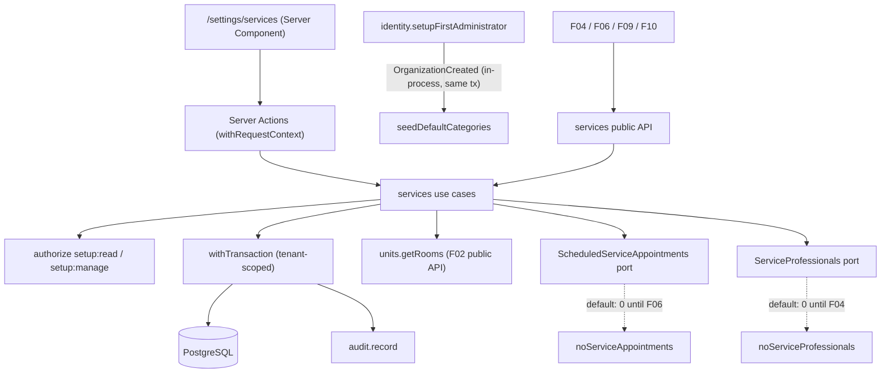

# Technical Specification: F03. Service Catalog

**Complexity:** medium

## 1. Technical Overview

**What.** A new `services` module that manages the organization's service catalog. It covers:
- Service categories.
- Services with a name, category, description, duration, price, color, a "requires room" flag, allowed rooms and an active flag.
- An immutable price history that records the author of every change.
- The `/settings/services` screen: a list grouped by category, with a side panel for editing and a "Histórico de preços" tab.

Services and categories are never hard-deleted while referenced. Services are only deactivated. A category can be deleted only when no service uses it.

**Why.** Four later features need stable service data through a small public API, so they never read the `services` tables directly:
- F04 enables professionals per service.
- F06 books appointments and takes a snapshot of the price.
- F09 charges for services.
- F10 builds package templates from services.

F03 also introduces the `Money` value object that ADR-010 and architecture section 5.8 require for every monetary amount.

**How it fits the codebase.** F03 follows the patterns established by F01 and F02:
- A simple module (Prisma used directly in `application/`) with a public `index.ts`.
- Use cases that call `authorize`, then `parseInput`, then `withTransaction` with auditing.
- `Result` with stable error codes and pt-BR messages that can take parameters (`{count}`).
- Optimistic locking with `version`, and case-insensitive unique indexes.
- Ports with a zero default that later features replace.
- Server Actions wrapped in `withRequestContext`.
- Forms built with react-hook-form, `HydratedFieldset` and `useFormDraft`.
- Integration tests on Testcontainers.

### Scope

**Included (full scope; the PRD has no Core/Full split for F03):**
- Categories: create, rename, reorder and delete when empty. At most 50 per organization. New organizations start with "Consultas", "Procedimentos" and "Terapias".
- Services: create, edit, deactivate and reactivate. At most 500 active services. Every PRD field is included.
- Allowed rooms, restricted per unit. Allowed rooms apply only when "requires room" is on.
- Price history: an entry on creation and on every price change, with the author and a timestamp. The history is shown in a tab.
- `Money` value object in the shared kernel and a reusable BRL money input.
- Two ports with a zero default: future appointments per service (replaced by F06) and enabled professionals per service (replaced by F04).
- Integrated cross-cutting concerns: authorization (`setup:read`, `setup:manage`), auditing of every change, and tenant scoping of the new tables.

**Input contracts (Consumes):** none from other features. The organization context and authorization come from F01. Room data comes from the public API of the F02 `units` module.

**Output contracts (Provides):**
- `services.listActiveServices(ctx)`: active services with name, category, duration, current price, color and the "requires room" flag. Used by F04, F06, F09 and F10.
- `services.getService(ctx, serviceId)`: a single service, active or inactive, so history screens can show inactive services. Used by F06, F09 and F10.
- `services.getAllowedRooms(ctx, serviceId, unitId)`: the rooms where the service can be booked in a unit. Used by F06.
- `services.registerScheduledServiceAppointments(impl)` and `services.registerServiceProfessionals(impl)`: extension points implemented by F06 and F04.

### Traceability to the PRD

| PRD block (F03) | Where it is specified |
|---|---|
| Provides | Scope → output contracts; Section 5 (public module API) |
| Capabilities | Sections 3, 5 and 6 (limits, validation, constraints, price history) |
| Experience | Section 4 (screens), Section 5 (actions, confirmation text) |
| Error Handling | Section 5 (error codes, pt-BR messages, deactivation warning) |
| Acceptance criteria (Section 9, F03) | Section 7, acceptance tests |
| Cross-Feature Integration (F03 as provider) | Section 7, provider-side contract tests |

## 2. Architecture Impact

### Affected components

| Area | Path | Role |
|---|---|---|
| Module | `src/modules/services/` | Rules, use cases, UI and public API |
| Shared kernel | `src/shared/kernel/money.ts` | `Money` value object (integer cents, BRL formatting and parsing) |
| Shared UI | `src/shared/ui/forms/money-input.tsx` | BRL-masked input, reused by F09, F10 and F11 |
| Units module | `src/modules/units/application/rooms.ts`, `index.ts` | New read function `getRooms` (rooms with their unit, filtered by ID and active status) |
| Identity module | `src/modules/identity/application/organization.ts` | Publishes `identity.OrganizationCreated` in the transaction that creates the first organization |
| Composition root | `src/composition.ts`, `src/instrumentation.ts`, `src/worker/index.ts`, `tests/integration/setup-env.ts` | Registers cross-module event subscriptions once per process |
| Routes | `src/app/(app)/settings/services/**` | Page and Server Actions |
| Shell | `src/shared/ui/app-shell/navigation.ts`, `app-sidebar.tsx` | "Serviços" menu item with the `stethoscope` icon |
| Tenancy | `src/shared/db/tenant.ts` | Registers the new tenant models |
| Database | `prisma/schema.prisma`, `prisma/migrations/0004_services/` | Categories, services, allowed rooms and price history, plus default categories for existing organizations |

### Data flow



## 3. Technical Decisions

| Decision | Chosen Approach | Alternative Considered | Trade-off |
|---|---|---|---|
| Categories | Separate table `service_category` with a case-insensitive unique name and a `sort_order`; at most 50 per organization | Free-text column on the service | Avoids near-duplicate groups ("Consulta" and "Consultas"), and renaming a category updates a single row. The cost is one more table and a small management UI. |
| Default categories | `identity` publishes `identity.OrganizationCreated` inside the organization's creation transaction. `services` subscribes and inserts the 3 defaults. Migration 0004 inserts the defaults for organizations that already exist | Creating the defaults on the first page load; `identity` calling `services` directly | No writes happen during reads, and the foundation module does not depend on a feature module (ADR-007 in-process events). This requires a small composition root. |
| Composition root | `src/composition.ts` exports an idempotent `registerModules()` that holds the event subscriptions and, later, the port registrations. It is called by `instrumentation.ts` (Node.js runtime), the worker and the integration test setup | Subscribing as an import side effect of the module | Registration is explicit and happens once per process, whichever route loads first. F04 and F06 register their port implementations in the same place. |
| Allowed rooms | Table `service_allowed_room (service_id, room_id)`. The restriction is **per unit**: in a unit where no room is selected, any active room of that unit is allowed; in a unit with selected rooms, only those are allowed | Global subset (selecting any room restricts every unit) | Matches clinics whose special rooms differ between units. The F06 query is per unit. |
| Rooms that become inactive | Kept in `service_allowed_room` and ignored when read. If every selected room of a unit is inactive, `getAllowedRooms` returns an empty "only" list, and F06 reports that the service has no bookable room there | Removing the link when F02 deactivates a room | F02 does not need to know about services, and reactivating a room restores the restriction. |
| Price changes | Immediate. `service.price_cents` holds the current price. Every change inserts a row in `service_price_change` in the same transaction as the service update | Future-dated price changes | This is enough for the PRD criteria and needs no job or "price as of" lookup. F06 snapshots `priceCents` when it books. Future-dated changes can be added later without a destructive migration. |
| Price history integrity | `service_price_change` is append-only: `gcli_app` gets INSERT and SELECT only, as for `audit_event` | Application-only discipline | The price history is a financial record, and the database enforces that it cannot be changed. |
| Money | `Money` value object in `shared/kernel/money.ts`: integer cents, `format()` in pt-BR BRL, and `parseBRL("1.234,56")`. The database stores `integer` cents | Plain numbers with helpers | Satisfies ADR-010 and section 5.8, and is reused by F09, F10 and F11. The maximum of R$ 99.999,99 fits in `integer`. |
| Color | A stable key stored in `varchar(16)` with a CHECK constraint listing 16 Tailwind hues. The UI maps each key to classes (100 background, 500 accent, 900 text) and to a pt-BR label | Hex values | Colors can be restyled without a migration, and contrast is controlled centrally. |
| Deletion | No service deletion; deactivate and reactivate only. A category can be deleted only when it has no services, active or inactive | Delete services that have no references | A service is always referenced by its price history. Checking references in F04, F06, F09 and F10 through ports would add risk for little value. |
| Deactivation warning | Deactivation always succeeds. The result carries `futureAppointments` from the `ScheduledServiceAppointments` port, and the UI shows the PRD warning when the count is above zero | Blocking deactivation (as F02 does for rooms) | The PRD says future appointments are kept and only new bookings are blocked. |
| Price-change confirmation | Client-side confirmation dialog shown before saving when the price differs from the loaded value | A two-step server confirmation as used for F02 closures | Price changes are always allowed, so the dialog is informational. A server round trip would add nothing. |
| Enabled professionals count | Port `ServiceProfessionals.countByService(ctx, serviceIds)` that returns an empty map by default; F04 replaces it | Leaving the column for F04 to add | The list matches the PRD now and only its data source changes later. |
| Room data | New `units.getRooms(ctx, { roomIds?, activeOnly? })` returning `{ id, name, active, unitId, unitName }` | Reading the `room` table from `services` | Respects module boundaries (ADR-018). One query serves both the form and the validation. |

### Assumptions

These were decided during this spec rather than by the PRD, and can be overridden:
- The 500-service limit counts **active** services, and reactivation checks it again. The 50-category limit counts all categories, because categories have no active flag.
- Service names are unique across active **and** inactive services (case-insensitive), so reactivation never creates duplicates.
- Category names have 1–50 characters. Service names have 2–100 characters, and descriptions up to 500.
- When "requires room" is off, the server stores an empty allowed-room list, whatever the request contains.
- Allowed rooms must be active rooms of the organization when the service is saved.
- A new service gets the first palette color that no active service uses. When all 16 colors are in use, it gets `blue`.
- Price history timestamps are stored in UTC and shown in the organization's time zone. The catalog belongs to the organization, not to a unit (ADR-019 applies to calendar logic only).
- Searching by name is case-insensitive but accent-sensitive. The list defaults to "Ativos".
- Front Desk and Professional users see the catalog read-only (`setup:read`). Only Administrators and Managers change it (`setup:manage`), per the F01 permission matrix.
- The list renders every service matching the filters, without pagination (at most 500). Categories are shown in `sort_order`, and services within a category in name order.

## 4. Component Overview

### Frontend

| File Path | New/Modified | Purpose | Key Responsibilities |
|---|---|---|---|
| `src/app/(app)/settings/services/page.tsx` | New | Services list | Filters in the URL (`?q=`, `?category=`, `?status=active\|inactive\|all`); groups by category; columns Nome (color swatch), Duração, Preço, Profissionais, Status; "Novo serviço" and "Categorias" buttons for `setup:manage`; the `?service=<id>\|new` query opens the side panel |
| `src/app/(app)/settings/services/actions.ts` | New | Server Actions | One action per use case, wrapped in `withRequestContext` |
| `src/modules/services/ui/services-filters.tsx` | New | Filters | Name search (debounced, 300 ms), category select and status select that update the URL |
| `src/modules/services/ui/services-table.tsx` | New | Grouped table | One section per category with its count; the row opens the panel; empty state "Nenhum serviço encontrado." |
| `src/modules/services/ui/service-sheet.tsx` | New | Side panel | `Sheet` with the tabs "Dados" and "Histórico de preços" (edit only); read-only without `setup:manage`; "Desativar/Reativar serviço" button |
| `src/modules/services/ui/service-form.tsx` | New | Service form | Name, category (select plus "Nova categoria"), description, duration select (5–480 in steps of 5, shown as "1h 30min"), `MoneyInput`, color picker, "Exige sala" switch, allowed rooms grouped by unit; price-change confirmation dialog; draft persistence |
| `src/modules/services/ui/color-picker.tsx` | New | Palette | Radio group of 16 swatches with pt-BR `aria-label`s, keyboard-navigable |
| `src/modules/services/ui/price-history.tsx` | New | History tab | Date and time, previous price → new price, author; most recent first |
| `src/modules/services/ui/categories-dialog.tsx` | New | Category management | List with rename, move up and down, delete (disabled with a hint when in use), create |
| `src/modules/services/ui/palette.ts` | New | Color mapping | Key → Tailwind classes and pt-BR label (e.g. `emerald` → "Verde-esmeralda") |
| `src/shared/ui/forms/money-input.tsx` | New | BRL input | Masks as the user types ("R$ 1.234,56"), emits integer cents, `defaultValue` for server-rendered HTML |
| `src/shared/ui/app-shell/navigation.ts`, `app-sidebar.tsx` | Modified | Menu | "Serviços" under Configurações (`setup:read`); `stethoscope` icon |

### Backend

| File Path | New/Modified | Purpose | Key Responsibilities |
|---|---|---|---|
| `src/shared/kernel/money.ts` | New | Money | `Money.fromCents`, `cents`, `format()`, `Money.parseBRL()` returning `Result`, `equals` |
| `src/modules/services/domain/limits.ts` | New | Constants | 500 active services, 50 categories, name, description and category lengths, duration 5–480 in steps of 5, maximum price 9 999 999 cents (with PRD references) |
| `src/modules/services/domain/palette.ts` | New | Palette rules | `SERVICE_COLORS` (16 keys), `nextDefaultColor(usedColors)` |
| `src/modules/services/domain/service-rules.ts` | New | Pure rules | `isValidDuration`, `isValidPriceCents`, `formatDuration`, `resolveAllowedRooms(selected, unitRooms)` |
| `src/modules/services/application/ports.ts` | New | Ports | `ScheduledServiceAppointments.countFuture(ctx, serviceId)`, `ServiceProfessionals.countByService(ctx, serviceIds)`, `ServicesDeps` |
| `src/modules/services/application/schemas.ts` | New | Validation | Zod schemas for service, category, activation, filters and reordering, with PRD messages |
| `src/modules/services/application/services.ts` | New | Service use cases | `listServices`, `getService`, `createService`, `updateService`, `setServiceActive`, `listPriceHistory` |
| `src/modules/services/application/categories.ts` | New | Category use cases | `listCategories`, `createCategory`, `renameCategory`, `moveCategory`, `deleteCategory`, `seedDefaultCategories` |
| `src/modules/services/application/provided.ts` | New | Public read API | `listActiveServices`, `getAllowedRooms` |
| `src/modules/services/application/errors.ts` | New | Error codes | Error factories for the services module |
| `src/modules/services/messages.ts` | New | pt-BR messages | Error messages, the deactivation warning and the price-change confirmation text |
| `src/modules/services/infrastructure/no-usage.ts` | New | Default ports | `noServiceAppointments` (0) and `noServiceProfessionals` (empty map) |
| `src/modules/services/events.ts` | New | Subscriptions | `subscribeServicesEvents(bus)`: `identity.OrganizationCreated` → `seedDefaultCategories` |
| `src/modules/services/index.ts` | New | Public API | Use cases bound to deps, register functions, UI exports, messages, types |
| `src/modules/units/application/rooms.ts`, `index.ts` | Modified | Room read | `getRooms(ctx, { roomIds?, activeOnly? })` |
| `src/modules/identity/application/organization.ts` | Modified | Event | Publishes `identity.OrganizationCreated { organizationId }` with `uow.publish` |
| `src/composition.ts` | New | Composition root | Idempotent `registerModules()` |
| `src/instrumentation.ts`, `src/worker/index.ts`, `tests/integration/setup-env.ts` | Modified | Bootstrap | Call `registerModules()` |
| `src/shared/db/tenant.ts` | Modified | Tenancy | Adds `ServiceCategory`, `Service`, `ServiceAllowedRoom`, `ServicePriceChange` |
| `tests/integration/helpers.ts` | Modified | Test reset | Truncates the four new tables |

### Database

| Migration File | Tables Affected | Operation | Notes |
|---|---|---|---|
| `prisma/migrations/0004_services/migration.sql` | `service_category`, `service`, `service_allowed_room`, `service_price_change` | CREATE, INSERT, GRANT | Generated by Prisma, plus hand-written CHECK constraints, case-insensitive unique indexes, append-only grants and default categories for existing organizations |

## 5. API Contracts

All actions return the F01 `ActionResult` envelope. `setup:read` covers reads (every role), and `setup:manage` covers changes (Administrators and Managers).

### Error codes

| Code | HTTP Status | pt-BR message |
|---|---|---|
| `SERVICES_NOT_FOUND` | 404 | "Serviço não encontrado." |
| `SERVICES_NAME_TAKEN` | 409 | "Já existe um serviço com este nome." (field `name`) |
| `SERVICES_SERVICE_LIMIT` | 422 | "Limite de 500 serviços ativos atingido." |
| `SERVICES_INVALID_ROOMS` | 400 | "Selecione apenas salas ativas." (field `allowedRoomIds`) |
| `SERVICES_CATEGORY_NOT_FOUND` | 404 | "Categoria não encontrada." (field `categoryId` on service forms) |
| `SERVICES_CATEGORY_NAME_TAKEN` | 409 | "Já existe uma categoria com este nome." (field `name`) |
| `SERVICES_CATEGORY_LIMIT` | 422 | "Limite de 50 categorias atingido." |
| `SERVICES_CATEGORY_IN_USE` | 409 | "Esta categoria possui {count} serviços. Mova-os para outra categoria antes de excluí-la." |
| `VALIDATION_FAILED` | 400 | Field messages, including `durationMinutes`: "A duração deve ser entre 5 e 480 minutos, em múltiplos de 5." and `priceCents`: "O preço deve ser entre R$ 0,00 e R$ 99.999,99." |
| `AUTHZ_FORBIDDEN`, `CONFLICT_STALE_VERSION`, `AUTH_UNAUTHENTICATED` | — | As in F01 |

Other texts in `messages.ts` (not errors):
- `SERVICES_DEACTIVATED_WITH_APPOINTMENTS`: "{count} agendamentos futuros deste serviço foram mantidos."
- `SERVICES_PRICE_CHANGE_CONFIRMATION`: "O novo preço valerá para novos agendamentos. Agendamentos existentes mantêm o preço original."

### Action: List services
- **Action:** read inside the page (Server Component) → `listServices`
- **Permission:** `setup:read`

| Field | Type | Required | Validation | Description |
|---|---|---|---|---|
| `search` | `string` | No | ≤ 100, trimmed | Case-insensitive "contains" on the name |
| `categoryId` | `uuid` | No | UUID | Category filter |
| `status` | `"active" \| "inactive" \| "all"` | No | enum, default `active` | Status filter |

```json
{
  "ok": true,
  "data": {
    "groups": [
      {
        "category": { "id": "0192b0a1-1111-7aaa-8bbb-0c0d0e0f1a1b", "name": "Consultas" },
        "services": [
          {
            "id": "0192b0a2-2222-7ccc-8ddd-1e1f2a2b3c3d",
            "name": "Consulta dermatológica",
            "durationMinutes": 30,
            "priceCents": 25000,
            "color": "blue",
            "requiresRoom": true,
            "enabledProfessionals": 0,
            "active": true
          }
        ]
      }
    ]
  }
}
```

Categories with no matching service are left out of `groups`, except when no filter is applied, so an empty category remains visible to managers.

### Action: Create service / Update service
- **Actions:** `createServiceAction`, `updateServiceAction` → `createService`, `updateService`
- **Permission:** `setup:manage`

| Field | Type | Required | Validation | Description |
|---|---|---|---|---|
| `serviceId` | `uuid` | Update only | UUID | Service being edited |
| `version` | `number` | Update only | integer | Optimistic lock |
| `name` | `string` | Yes | 2–100 chars, trimmed; unique per organization (case-insensitive, including inactive services) | Service name |
| `categoryId` | `uuid` | Yes | existing category of the organization | Category |
| `description` | `string` | No | ≤ 500 | Description |
| `durationMinutes` | `number` | Yes | integer, 5–480, multiple of 5 | Default duration |
| `priceCents` | `number` | Yes | integer, 0–9 999 999 | Current price (R$ 0,00–99.999,99) |
| `color` | `string` | Yes | one of the 16 palette keys | Agenda color |
| `requiresRoom` | `boolean` | Yes | — | Booking must choose a room |
| `allowedRoomIds` | `uuid[]` | No | ≤ 600 unique IDs of active rooms of the organization; ignored when `requiresRoom` is false | Allowed rooms (per-unit restriction) |

```json
{
  "name": "Limpeza de pele",
  "categoryId": "0192b0a1-3333-7aaa-8bbb-0c0d0e0f1a1b",
  "description": "Limpeza profunda com extração",
  "durationMinutes": 90,
  "priceCents": 18000,
  "color": "emerald",
  "requiresRoom": true,
  "allowedRoomIds": ["01927a11-9b8c-7d6e-8f5a-4b3c2d1e0f9a"]
}
```

```json
{ "ok": true, "data": { "serviceId": "0192b0a2-4444-7ccc-8ddd-1e1f2a2b3c3d", "version": 1, "priceChanged": true } }
```

Creation always records the first price-history entry (`previousPriceCents: null`) and returns `priceChanged: true`. An update records a history entry and returns `priceChanged: true` only when `priceCents` differs from the stored value. Before submitting a changed price, the form shows the confirmation dialog with `SERVICES_PRICE_CHANGE_CONFIRMATION` (buttons "Cancelar" and "Salvar novo preço").

Errors: `VALIDATION_FAILED`, `AUTHZ_FORBIDDEN`, `SERVICES_NAME_TAKEN`, `SERVICES_CATEGORY_NOT_FOUND`, `SERVICES_INVALID_ROOMS`, `SERVICES_SERVICE_LIMIT` (create), and `SERVICES_NOT_FOUND` and `CONFLICT_STALE_VERSION` (update).

### Action: Activate / deactivate service
- **Action:** `setServiceActiveAction` → `setServiceActive`
- **Permission:** `setup:manage`

Request `{ "serviceId": "<uuid>", "active": false }`, response `{ "ok": true, "data": { "active": false, "futureAppointments": 12 } }`. When `futureAppointments > 0`, the UI shows a warning toast: "12 agendamentos futuros deste serviço foram mantidos." Activation checks `SERVICES_SERVICE_LIMIT` and `SERVICES_NAME_TAKEN` again. Errors: `SERVICES_NOT_FOUND`, `SERVICES_SERVICE_LIMIT`.

### Action: Price history
- **Action:** read by the panel → `listPriceHistory`
- **Permission:** `setup:read`

```json
{
  "ok": true,
  "data": [
    { "changedAt": "2026-10-05T13:20:00.000Z", "previousPriceCents": 18000, "priceCents": 20000, "changedBy": { "id": "0192...", "name": "Ana Souza" } },
    { "changedAt": "2026-09-30T12:00:00.000Z", "previousPriceCents": null, "priceCents": 18000, "changedBy": { "id": "0192...", "name": "Ana Souza" } }
  ]
}
```

The author's name comes from identity's public API. The author can be `null` for system-created entries.

### Actions: Categories
- **Actions:** `createCategoryAction`, `renameCategoryAction`, `moveCategoryAction`, `deleteCategoryAction`
- **Permission:** `setup:manage` (the category list for the filters uses `setup:read`)

| Field | Type | Required | Validation | Description |
|---|---|---|---|---|
| `categoryId` | `uuid` | Rename / move / delete | UUID | Category |
| `name` | `string` | Create / rename | 1–50 chars, trimmed; unique per organization (case-insensitive) | Category name |
| `direction` | `"up" \| "down"` | Move | enum | Swaps `sort_order` with the neighboring category |

```json
{ "name": "Estética" }
```

```json
{ "ok": true, "data": { "categoryId": "0192b0a1-5555-7aaa-8bbb-0c0d0e0f1a1b" } }
```

New categories are added at the end (`max(sort_order) + 1`). Errors: `SERVICES_CATEGORY_NAME_TAKEN`, `SERVICES_CATEGORY_LIMIT` (create), `SERVICES_CATEGORY_IN_USE` (delete, with `count` covering active and inactive services), and `SERVICES_CATEGORY_NOT_FOUND`.

### Public module API (Provides)

| Function | Consumers | Returns |
|---|---|---|
| `services.listActiveServices(ctx)` | F04, F06, F09, F10 | `[{ id, name, categoryId, categoryName, durationMinutes, priceCents, color, requiresRoom }]` ordered by category `sort_order`, then name |
| `services.getService(ctx, serviceId)` | F06, F09, F10 | `{ id, name, categoryId, categoryName, description, durationMinutes, priceCents, color, requiresRoom, active, version, allowedRoomIds }` (active or inactive) |
| `services.getAllowedRooms(ctx, serviceId, unitId)` | F06 | `{ requiresRoom: false }` \| `{ requiresRoom: true, rooms: "any" }` \| `{ requiresRoom: true, rooms: [{ id, name }] }` (only active rooms of that unit; an empty array means no bookable room in the unit) |
| `services.registerScheduledServiceAppointments(impl)` | F06 | Replaces the zero default used by the deactivation warning |
| `services.registerServiceProfessionals(impl)` | F04 | Replaces the default used by the "Profissionais" column |
| `units.getRooms(ctx, { roomIds?, activeOnly? })` (F02 module, new) | F03, later F06 | `[{ id, name, active, unitId, unitName }]` |

## 6. Data Model

All tables have `id uuid` (UUIDv7 generated by the application), `organization_id uuid NOT NULL` (tenant) and `created_at`/`updated_at timestamptz`. The exceptions are that `service_allowed_room` has a composite key and `service_price_change` has no `updated_at`. The four models are added to the tenant model registry.

### Table: `service_category`

| Column | Type | Nullable | Default | Description |
|---|---|---|---|---|
| `name` | `varchar(50)` | No | — | Category name |
| `sort_order` | `smallint` | No | — | Display order within the organization |
| `version` | `integer` | No | `1` | Optimistic lock |
| `created_by_id`, `updated_by_id` | `uuid` | Yes | — | Authors |

Constraints and indexes: `uq_service_category_org_name` UNIQUE (`organization_id`, `lower(name)`); `ix_service_category_org_order` (`organization_id`, `sort_order`). `sort_order` is not unique, so a swap does not need deferred constraints.

### Table: `service`

| Column | Type | Nullable | Default | Description |
|---|---|---|---|---|
| `category_id` | `uuid` | No | — | FK `service_category(id)` ON DELETE RESTRICT |
| `name` | `varchar(100)` | No | — | Service name |
| `description` | `varchar(500)` | Yes | — | Description |
| `duration_minutes` | `smallint` | No | — | 5–480, multiple of 5 |
| `price_cents` | `integer` | No | — | 0–9 999 999 |
| `color` | `varchar(16)` | No | — | Palette key |
| `requires_room` | `boolean` | No | `false` | Booking requires a room |
| `active` | `boolean` | No | `true` | Inactive services are hidden from booking |
| `version` | `integer` | No | `1` | Optimistic lock |
| `created_by_id`, `updated_by_id` | `uuid` | Yes | — | Authors |

Constraints and indexes:
- `uq_service_org_name` UNIQUE (`organization_id`, `lower(name)`).
- `ck_service_duration` (`duration_minutes BETWEEN 5 AND 480 AND duration_minutes % 5 = 0`).
- `ck_service_price` (`price_cents BETWEEN 0 AND 9999999`).
- `ck_service_color` (the 16 keys).
- `ix_service_org_active` (`organization_id`, `active`).
- `ix_service_category` (`category_id`).

### Table: `service_allowed_room`

| Column | Type | Nullable | Default | Description |
|---|---|---|---|---|
| `service_id` | `uuid` | No | — | FK `service(id)` ON DELETE CASCADE |
| `room_id` | `uuid` | No | — | FK `room(id)` ON DELETE RESTRICT |

The primary key is (`service_id`, `room_id`), and `ix_service_allowed_room_room` is on (`room_id`). Updating a service replaces its rows within the same transaction.

### Table: `service_price_change`

| Column | Type | Nullable | Default | Description |
|---|---|---|---|---|
| `service_id` | `uuid` | No | — | FK `service(id)` ON DELETE RESTRICT |
| `previous_price_cents` | `integer` | Yes | — | `null` for the entry created with the service |
| `price_cents` | `integer` | No | — | New price |
| `changed_at` | `timestamptz` | No | `now()` | Effective immediately |
| `changed_by_id` | `uuid` | Yes | — | Author (user ID) |

Constraints and indexes: `ck_price_change_range` (both prices within 0–9 999 999); `ix_price_change_service_time` (`service_id`, `changed_at DESC`). Grants: `gcli_app` has INSERT and SELECT only.

### Migration excerpt (hand-written parts)

```sql
CREATE UNIQUE INDEX uq_service_category_org_name ON service_category (organization_id, lower(name));
CREATE UNIQUE INDEX uq_service_org_name ON service (organization_id, lower(name));

ALTER TABLE service ADD CONSTRAINT ck_service_duration
  CHECK (duration_minutes BETWEEN 5 AND 480 AND duration_minutes % 5 = 0);
ALTER TABLE service ADD CONSTRAINT ck_service_price CHECK (price_cents BETWEEN 0 AND 9999999);
ALTER TABLE service ADD CONSTRAINT ck_service_color CHECK (color IN (
  'slate','red','orange','amber','yellow','lime','green','emerald',
  'teal','cyan','sky','blue','indigo','violet','purple','pink'));
ALTER TABLE service_price_change ADD CONSTRAINT ck_price_change_range CHECK (
  price_cents BETWEEN 0 AND 9999999
  AND (previous_price_cents IS NULL OR previous_price_cents BETWEEN 0 AND 9999999));

-- The price history is a financial record: the runtime role may only append to it.
REVOKE UPDATE, DELETE ON service_price_change FROM gcli_app;

-- Default categories for organizations created before F03 (PostgreSQL 18 uuidv7()).
INSERT INTO service_category (id, organization_id, name, sort_order, version, created_at, updated_at)
SELECT uuidv7(), o.id, d.name, d.sort_order, 1, now(), now()
FROM organization o
CROSS JOIN (VALUES ('Consultas', 1), ('Procedimentos', 2), ('Terapias', 3)) AS d(name, sort_order);
```

The grant statements must follow the pattern used for `audit_event` in `0002_audit_event`: default privileges from 0001 grant the runtime role full DML, so the revoke must be explicit.

## 7. Testing Strategy

### Test files

| Test File | Test Type | Target | Coverage Goal |
|---|---|---|---|
| `src/shared/kernel/money.test.ts` | Unit | `Money` formatting and parsing | 100% |
| `src/modules/services/domain/service-rules.test.ts` | Unit | Duration, price, duration formatting, allowed-room resolution | 100% |
| `src/modules/services/domain/palette.test.ts` | Unit | Palette and default color | 100% |
| `tests/integration/services/support.ts` | Helper | Contexts, category and service factories, fake ports | — |
| `tests/integration/services/services.test.ts` | Integration | Service use cases, limits, uniqueness, price history, deactivation | All F03 service criteria |
| `tests/integration/services/categories.test.ts` | Integration | Categories, default categories, in-use deletion | Category rules |
| `tests/integration/services/provided.test.ts` | Integration | Public API contracts | Provider-side criteria |
| `tests/e2e/f03-services.spec.ts` | E2E | Create a service, change its price, view the history, deactivate it | Critical journey |

### Unit tests

| Test Function | Description | Assertions |
|---|---|---|
| `F03: Money formats cents as BRL` | Formatting | 0 → "R$ 0,00"; 123456 → "R$ 1.234,56"; 9999999 → "R$ 99.999,99" |
| `F03: Money parses masked BRL input` | Parsing | "1.234,56" → 123456; "R$ 0,00" → 0; "12,3" → 1230; "abc" → error |
| `F03: duration must be 5–480 in multiples of 5` | Domain | 5, 480, 95 valid; 0, 3, 7, 485 invalid |
| `F03: price must be between 0 and 9 999 999 cents` | Domain | 0 and 9999999 valid; -1, 10000000 and 1.5 invalid |
| `F03: durations are formatted for display` | Domain | 30 → "30 min"; 90 → "1h 30min"; 120 → "2h" |
| `F03: allowed rooms are restricted per unit` | Domain | No selection in the unit → "any"; selection → only the active selected rooms; all selected rooms inactive → empty list |
| `F03: new services get the first unused palette color` | Palette | Returns the first unused key; `blue` when all 16 are used |

### Acceptance tests (PRD Section 9, F03)

| Test Function | PRD criterion | Assertions |
|---|---|---|
| `F03: a service is saved only with a valid duration and price` | Duration and price validation | Boundaries 5, 480, 0 and 9999999 saved; 3, 485, 7, -1 and 10000000 → `VALIDATION_FAILED` with the PRD duration message or the price message; nothing saved |
| `F03: a price change creates a history entry and keeps earlier prices` | Price history | Creation → 1 entry (`previous: null`); change 18000 → 20000 → 2nd entry with author; saving the same price adds no entry; earlier entries unchanged; UPDATE audit with a `priceCents` diff |
| `F03: price history cannot be changed by the application role` | Price history integrity | Raw UPDATE and DELETE as `gcli_app` fail with a permission error |
| `F03: a deactivated service is not offered for booking but stays readable` | Deactivation | `listActiveServices` excludes it; `getService` returns it with `active: false`; the list with `status: inactive` shows it |
| `F03: deactivating reports the future appointments that were kept` | Error Handling | Fake port returns 12 → `futureAppointments: 12`; the interpolated message reads "12 agendamentos futuros deste serviço foram mantidos."; the service is inactive |
| `F03: requires-room services expose their allowed rooms; others need no room` | Room rule | `requiresRoom: false` → `{ requiresRoom: false }` and the stored rooms are cleared; `requiresRoom: true` with no selection → `"any"`; with a selection in unit A → only those rooms in A and `"any"` in unit B |
| `F03: allowed rooms must be active rooms of the organization` | Validation | Inactive room or another organization's room → `SERVICES_INVALID_ROOMS` |
| `F03: service names are unique regardless of case and status` | Uniqueness | "consulta" when "Consulta" exists (even inactive) → `SERVICES_NAME_TAKEN` |
| `F03: the 501st active service and the 51st category are rejected` | Limits | `SERVICES_SERVICE_LIMIT` on create and on reactivation; `SERVICES_CATEGORY_LIMIT` |
| `F03: a category with services cannot be deleted` | Categories | `SERVICES_CATEGORY_IN_USE` with the count (including inactive services); an empty category is deleted with a DELETE audit |
| `F03: categories can be renamed and reordered` | Categories | Rename keeps the services; moving up swaps `sort_order`; the list follows the new order |
| `F03: new organizations start with the default categories` | Defaults | `setupFirstAdministrator` → "Consultas", "Procedimentos", "Terapias" in order; the event handler runs in the same transaction |
| `F03: services list filters by name, category and status and shows enabled professionals` | Experience | Search "derma" matches "Consulta Dermatológica"; category and status filters; a fake `ServiceProfessionals` port value appears in `enabledProfessionals` |
| `F03: concurrent edits are rejected with a stale version` | Concurrency | Second update with the old `version` → `CONFLICT_STALE_VERSION`; no second price entry |
| `F03: front desk can read services but not change them` | Authorization | Reads ok; every write → `AUTHZ_FORBIDDEN` |
| `F03: services are isolated per organization` | Tenancy | Another organization's services and categories are never listed, read or updated |

### Cross-Feature Integration (F03 as provider)

The consumer side of these criteria is tested in F04, F06, F09 and F10.

| Test Function | PRD criterion | Assertions |
|---|---|---|
| `F03→F04/F06/F09/F10: listActiveServices returns only active services with booking fields` | Only active services appear in enablement, booking, manual charges and package templates | Inactive services are excluded; duration, price, color, `requiresRoom` and category values are correct; ordered by category, then name |
| `F03→F06: a price change affects only the price read for new bookings` | A price change affects only new appointments | `getService` returns the new `priceCents` right after the change, and the history keeps the old value for appointments that snapshotted it (the snapshot itself is asserted in F06) |
| `F03→F06: getAllowedRooms resolves rooms per unit` | Requires-room enforcement in booking | Shapes for no room, "any" and a restricted list; rooms that became inactive are excluded |

### E2E journey

| Test Function | Journey |
|---|---|
| `F03: administrator creates a service, changes its price and deactivates it` | Configurações → Serviços → Novo serviço → fill in the fields, with the price mask showing "R$ 180,00" → save → the service appears under "Procedimentos" → edit the price to 200,00 → the confirmation dialog shows the PRD text → save → the "Histórico de preços" tab shows 2 entries → deactivate → the service disappears from the default "Ativos" filter |
