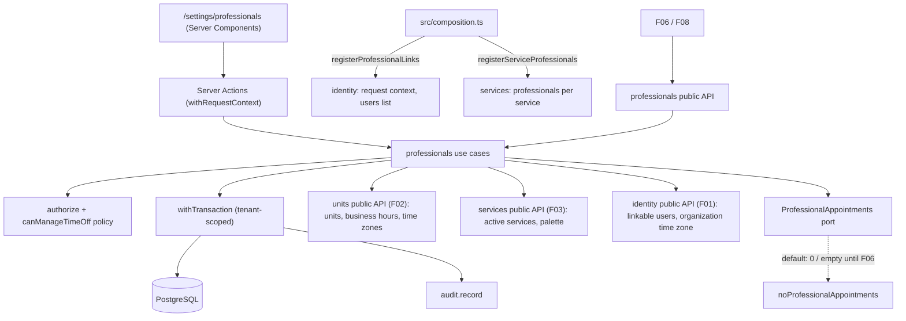

# Technical Specification: F04. Professionals and Working Hours

**Complexity:** medium

## 1. Technical Overview

**What.** A new `professionals` module (simple tier, architecture section 3) that manages the clinic's professionals. It covers:
- The professional profile: identification, specialty, council registration ("CRM 123456/SP"), CPF, contact, agenda color, an optional linked user and an active flag.
- Enabled services: the active services each professional performs.
- Working hours: weekly intervals per unit and weekday, grouped into **schedules** with a validity period, so a future change never alters past or current weeks.
- Time-offs: vacation, conferences, personal blocks and other absences, which professionals can manage for themselves.
- The `/settings/professionals` screens: a list, and a professional page with the tabs Dados, Serviços, Horários and Ausências.

Professionals are never deleted, only deactivated. Deactivation is blocked while future, non-cancelled appointments exist.

**Why.** Scheduling (F06) needs to know who can be booked for a service, where and when each professional works, and when they are away. Documents (F08) need the professional's name and council registration. F04 provides both through a small public API, so later features never read the `professionals` tables directly. F04 also fills two gaps left open by F01 and F03:
- The request context's `linkedProfessionalId`, which grants clinical and own-agenda permissions to linked users (PRD F01).
- The "Profissionais" count in the services list, through F03's `ServiceProfessionals` port.

**How it fits the codebase.** F04 follows the patterns established by F01–F03:
- A simple module (Prisma used directly in `application/`, pure rules in `domain/`) with a public `index.ts`.
- Use cases that call `authorize`, then `parseInput`, then `withTransaction` with auditing.
- `Result` with stable error codes and pt-BR messages with `{placeholders}`.
- Optimistic locking with `version`. Uniqueness and range invariants also enforced by the database.
- Ports with inert defaults that F06 replaces, and implementations of other modules' ports registered in `src/composition.ts`.
- Server Actions wrapped in `withRequestContext`, and forms built with react-hook-form, `HydratedFieldset` and `useFormDraft`.
- Screens that follow the "Ink and Paper" design system (ADR-020).
- Integration tests on Testcontainers.

### Scope

**Included (full scope; the PRD has no Core/Full split for F04):**
- Professionals: create, edit, deactivate and reactivate, with every PRD field. At most 100 active professionals.
- Council registration rules: number and state required unless the type is "Nenhum"; a council name is required for "Outro".
- Linking to a user: an active user with the Professional, Manager or Administrator role, one professional per user.
- Enabled services: multi-select of active services grouped by category, with "Selecionar todos da categoria". Removing a service warns about kept future appointments.
- Working-hour schedules: validity start and optional end; per unit and weekday, up to 4 intervals in 5-minute steps. Rules: no overlap across units on the same weekday, and intervals must lie within the unit's business hours. "Copiar semana" starts a new schedule from an existing one.
- Time-offs: date and time range up to 1 year ahead, with type and an optional note. A professional manages their own; Administrators and Managers manage everyone's. Appointments affected by a new time-off are listed after saving.
- Professional role view: a linked professional sees only their own profile, read-only, and manages their own time-offs.
- `Cpf` value object in the shared kernel and a reusable CPF input, both reused by F05.
- Integrated cross-cutting concerns:
  - Authorization (`professional:read`, the new `professional:read-all`, `professional:manage`, `professional:manage-own-time-off`).
  - Auditing of every change.
  - Tenant scoping of the new tables.
  - The linked professional in the request context.

**Deferred / not included:**
- Photo upload. The PRD asks for a "photo placeholder/initials", so the list shows initials.
- Restricting professionals or users to specific units. The PRD lists this as out of scope for V1.
- Recomputing working hours when a unit's business hours shrink later (F02). F06 checks business hours at booking time, and the Horários tab highlights intervals that are now outside the unit's hours.

**Input contracts (Consumes):**
- F01: `identity.listLinkableUsers(ctx)` returns active users with the Professional, Manager or Administrator role. The organization time zone comes from `identity.getOrganizationProfile`, and the request context and permission matrix come from F01.
- F02: `units.listUnits(ctx, { activeOnly: true })` lists the units in the working-hours grid. `units.getUnitSchedule(ctx, unitId)` provides business hours and the unit's time zone. `isWithinHours` checks that an interval lies inside the unit's hours.
- F03: `services.listActiveServices(ctx)` lists the services for enablement. `SERVICE_COLORS` is the agenda color palette.

**Output contracts (Provides):**
- To F06: `professionals.listBookableProfessionals`, `isServiceEnabled`, `getWorkingCalendar` and `getProfessionals`. These cover active professionals with enabled services, working intervals per unit and date (validity applied), time-offs and active status.
- To F08: `professionals.getProfessionalCredentials`, which returns the name, specialty, council type, number and state, and the formatted registration.
- To F01 (identity): the `ProfessionalLinks` port implementation, which supplies `linkedProfessionalId` for the request context and the "Profissional vinculado" column on the Users screen.
- To F03 (services): the `ServiceProfessionals` port implementation, which counts active professionals per service.
- `professionals.registerProfessionalAppointments(impl)`: an extension point that F06 implements.

### Traceability to the PRD

| PRD block (F04) | Where it is specified |
|---|---|
| Consumes | Scope → input contracts; Section 2 (data flow) |
| Provides | Scope → output contracts; Section 5 (public module API) |
| Capabilities | Sections 3, 5 and 6 (limits, validation, validity, constraints, permissions) |
| Experience | Section 4 (screens), Section 5 (actions and warnings) |
| Error Handling | Section 5 (error codes and pt-BR messages) |
| Acceptance criteria (Section 9, F04) | Section 7, acceptance tests |
| Cross-Feature Integration (F01→F04, F02→F04, F03→F04 as consumer; F04→F06, F04→F08 as provider) | Section 7, cross-feature tests |
| F01 capability "linked professional grants Professional permissions" | Section 3 (linked professional), Section 7 |

## 2. Architecture Impact

### Affected components

| Area | Path | Role |
|---|---|---|
| Module | `src/modules/professionals/` | Rules, use cases, UI and public API |
| Shared kernel | `src/shared/kernel/cpf.ts` | `Cpf` value object (check digits, normalization, mask) |
| Shared UI | `src/shared/ui/forms/cpf-input.tsx`, `src/shared/ui/components/avatar.tsx` (existing), `checkbox.tsx` (new, shadcn/ui) | CPF mask; initials avatar; service checkboxes |
| Authorization | `src/shared/authz/permissions.ts` | New action `professional:read-all` |
| Identity module | `src/modules/identity/application/ports.ts`, `session.ts`, `users.ts`, `index.ts`, `ui/users.tsx` | `ProfessionalLinks` port with a null default; `linkedProfessionalId` in the context; linked professional column |
| Composition root | `src/composition.ts` | Registers the `ProfessionalLinks` and `ServiceProfessionals` implementations |
| Routes | `src/app/(app)/settings/professionals/**` | Pages and Server Actions |
| Shell | `src/shared/ui/app-shell/navigation.ts`, `app-sidebar.tsx` | "Profissionais" menu item with the `contact` icon |
| Tenancy | `src/shared/db/tenant.ts`, `tests/integration/helpers.ts` | Registers and truncates the new tenant models |
| Database | `prisma/schema.prisma`, `prisma/migrations/0005_professionals/` | Professionals, enabled services, schedules, working intervals, time-offs |
| Documentation | `docs/design-system.{en,pt-BR}.md`, `docs/architecture.{en,pt-BR}.md` | Professional color and weekly-hours grid patterns; ADR-021 |

### Data flow



## 3. Technical Decisions

| Decision | Chosen Approach | Alternative Considered | Trade-off |
|---|---|---|---|
| Validity periods | A **schedule** (`professional_schedule`) belongs to the professional and holds the intervals of **all** units, with `valid_from` and an optional `valid_until` (inclusive calendar dates). A professional's schedules never overlap in time. This is enforced by a `btree_gist` exclusion constraint on `daterange(valid_from, valid_until, '[]')` | One validity per unit grid | Each date has exactly one schedule, so the cross-unit rule is checked inside one schedule by a pure function. Changing hours in one unit means creating a new schedule that copies the others ("Copiar semana"). |
| Creating a future schedule | Saving a schedule whose `valid_from` falls inside an open-ended or longer schedule that started earlier closes that schedule on `valid_from − 1`, in the same transaction. A schedule that starts on or after the new `valid_from` makes the save fail with `PROFESSIONALS_SCHEDULE_OVERLAP` | Requiring users to set the end date first | This matches the PRD's "future schedule change" in one step. The exclusion constraint still guards concurrent saves. |
| Editing and deleting schedules | Current and future schedules can be edited. Ended schedules are read-only. Only schedules that have not started can be deleted, and deleting one restores the end date of the schedule it had closed | Freely editable history | Past weeks never change, as the PRD requires, while mistakes in the current schedule can still be fixed. |
| Interval storage | One row per interval in `professional_working_interval` (unit, ISO weekday 1–7, start and end in minutes from midnight, local to the unit), as F02 does for business hours | JSON column | CHECK constraints enforce range and granularity, and F06 can query intervals with SQL. |
| Cross-unit overlap across time zones | The domain converts each interval to minutes of the week in UTC using the unit's fixed UTC offset before comparing. Brazil has had no daylight saving time since 2019, so offsets are constant. Recorded as **ADR-021** (refines ADR-019) | Comparing local minutes | A professional working in São Paulo and Manaus on the same day is checked against real time. If daylight saving time returns, the offset helper changes in one place. |
| Overlap invariant in the database | Not enforced by a database constraint. Schedule saves lock the professional row (`version` increment) and replace the intervals in one transaction | Exclusion constraint on `int4range(start, end)` | A constraint on local minutes would wrongly reject valid intervals in units with different time zones. The professional row lock serializes concurrent edits. |
| Business-hours rule | Pure check per interval with F02's `isWithinHours`. A violation returns `PROFESSIONALS_OUTSIDE_BUSINESS_HOURS` with the unit's hours for that weekday in the message. The UI runs the same function to show the red highlight before saving | Server-only check | The same rule runs on the client for instant feedback and on the server as the guarantee. |
| Linked professional in the request context | Identity declares a `ProfessionalLinks` port with a null default. `professionals` implements it, and the composition root registers it. `resolveRequestContext` sets `linkedProfessionalId` only when the user's role is linkable and the professional is active | Identity reading the `professional` table | This avoids a module cycle, because `professionals` already depends on `identity` (ADR-007 dependency inversion). It costs one indexed lookup per request. |
| One user per professional | Partial unique index on `linked_user_id`. The use case checks first so it can return the PRD message, and the index is the guarantee | Application check only | Two concurrent saves cannot link the same user twice. |
| Professional-role visibility | New permission `professional:read-all` for Administrator, Manager and Front Desk. Users with only `professional:read` (the Professional role) can read just their linked profile. Provided read APIs keep `professional:read` | Reusing `professional:read` for screens | This follows the F01 matrix, where the Professional role gets "Own time-offs only", while F06 and F08 can still read professional names for every role. |
| Time-off permission | Policy `canManageTimeOff(ctx, professionalId)`: `professional:manage`, or `professional:manage-own-time-off` together with `ctx.linkedProfessionalId === professionalId`. Denials are audited with `recordDenial` | Permission check only | A professional cannot create or delete another professional's time-offs, which is a PRD acceptance criterion. |
| Time-off time zone | Users enter and see time-offs in the organization's time zone; the database stores `timestamptz` instants. "Dia inteiro" covers 00:00 of the first day to 24:00 of the last day | Per-unit time zone | A time-off belongs to the person, not to a unit. F06 compares instants, so the zone affects only display. |
| Appointment-dependent rules | Port `ProfessionalAppointments` (`countFuture`, `countFutureByService`, `listInPeriod`) with a default that returns 0 or an empty list. F06 registers the real implementation | Implementing the rules in F06 | Rules, messages and tests exist now; the default makes them inert until appointments exist, as in F02 and F03. |
| Removing an enabled service | Always allowed. The result carries the count of kept future appointments for the removed services, and the UI shows the warning | Blocking the removal | The PRD says the removal applies to new bookings only. |
| Agenda color | Reuses the 16 keys of F03's `SERVICE_COLORS` (imported from the services public API). A new professional gets the first color no active professional uses | A separate palette | One palette, already contrast-checked. The design system gains a rule for professional colors (a dot before the name, never a background). |
| CPF | `Cpf` value object in `shared/kernel/cpf.ts`, stored as 11 digits. It is optional and unique per organization among professionals (partial unique index) | Validation inside the module | F05 needs the same rules. Uniqueness prevents duplicate profiles of one person. |
| Council registration uniqueness | Partial unique index on (organization, council type, council name, state, number) when the type is not "Nenhum" | No uniqueness | A council registration identifies one person, so a duplicate is always a data-entry mistake. |
| Interval input shape | A flat list `{ unitId, weekday, start, end }` for the whole schedule, saved atomically | Nested per unit and day | One validation pass covers every unit, and field paths (`intervals.<index>`) map directly to the grid cells. |

### Assumptions

These were decided during this spec rather than by the PRD, and can be overridden:
- The 100-professional limit counts **active** professionals, and reactivation checks it again.
- Field lengths are as follows:
  - Full name: 3–150 characters.
  - Display name: up to 60 characters. When empty, the agenda uses the full name.
  - Specialty: up to 100 characters.
  - Council number: 1–15 characters from `[0-9A-Za-z.-]`, stored uppercase.
  - Council name for "Outro": 2–20 characters.
  - Email: up to 254 characters.
- The phone is a Brazilian number with area code, 10–11 digits after removing the mask.
- Council types are `CRM, CRO, CREFITO, CRP, CRN, COREN, CRBM, CRF, OTHER, NONE`. The PRD's "other/none" is read as two options: "Outro" (requires a council name, number and state) and "Nenhum" (no registration). The formatted registration is "CRM 123456/SP", and for "Outro" it uses the council name ("CRFa 1234/SP").
- Linkable users are those that `identity.listLinkableUsers` returns: active users with the Professional, Manager or Administrator role. A link to a user who was later deactivated, or whose role became Front Desk, is kept for history. While that is true, the link grants nothing, and the form shows it with "(usuário inativo)" or "(perfil não vinculável)".
- Deactivating a professional keeps the user link, but an inactive professional grants no linked permissions.
- Up to 4 intervals per **unit** per weekday, as the PRD says ("per unit and weekday, up to 4 intervals per day"). Intervals may end at 24:00. Overnight intervals are not supported, as in F02.
- Only active units appear in the grid and can receive intervals. Intervals in a unit that is deactivated later are kept but ignored by `getWorkingCalendar`.
- `valid_from` of a new schedule must be today or later in the organization's time zone. The first schedule of a professional may start today. `valid_until`, when set, is on or after both `valid_from` and today.
- A schedule with no intervals is valid. It means the professional does not work in that period.
- "Copiar semana" creates a new schedule pre-filled with all intervals of the selected schedule, with `valid_from` set to next Monday. Each weekday row also has "Copiar para os dias úteis", as in F02.
- Time-offs cannot end in the past, and they must end at most 365 days from now (PRD: "up to 1 year ahead"). A time-off lasts at least 5 minutes. Time-offs that have not ended can be deleted (hard delete with an audit entry, as F02 does for future closures). Ended time-offs are kept as history.
- Time-offs of the same professional may overlap; F06 uses their union. The note has at most 200 characters.
- A new time-off is saved even when it overlaps appointments, as the PRD requires. The result lists the affected appointments. The PRD asks for no confirmation step, unlike F02 closures.
- The list shows every professional matching the filters, without pagination (at most 100 active). It is sorted by display name, searched by name accent-insensitively (as in F01's users list), and filtered by status, with "Ativos" as the default.
- The list's "Unidades" column shows the units of the schedule in effect today.
- A Professional-role user without a linked profile who opens `/settings/professionals` sees "Seu usuário não está vinculado a um profissional. Fale com o administrador da clínica." and no data.
- Front Desk users see every profile, schedule and time-off read-only.

## 4. Component Overview

### Frontend

| File Path | New/Modified | Purpose | Key Responsibilities |
|---|---|---|---|
| `src/app/(app)/settings/professionals/page.tsx` | New | Professionals list | Filters in the URL (`?q=`, `?status=active\|inactive\|all`). Table columns: initials avatar with color dot and name, Especialidade, Unidades, Serviços (count), Status stamp. "Novo profissional" (primary, `professional:manage`). Professional-role users are redirected to their own profile |
| `src/app/(app)/settings/professionals/new/page.tsx` | New | Create professional | Dados form only; after saving, redirects to the professional page on the Serviços tab |
| `src/app/(app)/settings/professionals/[professionalId]/page.tsx` | New | Professional page | Record header (name, specialty, registration, status stamp). Tabs Dados, Serviços, Horários, Ausências (`?tab=data\|services\|schedule\|time-offs`). Read-only without `professional:manage`; the Ausências tab is editable when `canManageTimeOff` allows it. Breadcrumb "Profissionais / Dra. Ana Lima" |
| `src/app/(app)/settings/professionals/actions.ts` | New | Server Actions | One action per use case, wrapped in `withRequestContext` |
| `src/modules/professionals/ui/professionals-filters.tsx` | New | Filters | Name search (debounced, 300 ms) and status select that update the URL |
| `src/modules/professionals/ui/professionals-table.tsx` | New | List table | Fine-rule table (design system 5.4); two-line list below 768 px; empty states "Nenhum profissional cadastrado ainda. Os profissionais definem quem pode ser agendado." and "Nenhum profissional encontrado para "{q}"." |
| `src/modules/professionals/ui/professional-avatar.tsx` | New | Initials | Circle avatar with up to 2 initials (`paper-2`, `ink-1`); the agenda color is a 12 px dot next to the name, never a background |
| `src/modules/professionals/ui/professional-form.tsx` | New | Dados tab | Full name, display name, specialty, council type select (number, state and name shown and required by type), CPF input, phone, email, color picker (F03's palette component), linked user select (linkable users plus the current link with its status note), draft persistence, "Desativar/Reativar profissional" secondary button with a confirmation dialog |
| `src/modules/professionals/ui/services-checklist.tsx` | New | Serviços tab | Checkboxes grouped by category with "Selecionar todos da categoria", service color dot, duration and price in `meta`; enabled services that are now inactive are listed as "Serviço desativado" and dropped on save; toast with the kept-appointments warning |
| `src/modules/professionals/ui/schedule-editor.tsx` | New | Horários tab | Schedule selector ("Vigente desde 01/09/2026", "A partir de 02/11/2026", "Encerrado em …"), validity date fields, "Novo horário", "Copiar semana", "Excluir horário" (future schedules), unit tabs (active units) with the interval count per unit |
| `src/modules/professionals/ui/week-grid.tsx` | New | Weekly grid per unit | 7 rows (Segunda–Domingo), each with the unit's business hours in `meta` ("Funcionamento: 08:00–18:00" or "Unidade fechada") and up to 4 interval rows (start and end time selects in 5-minute steps), "Adicionar intervalo", "Copiar para os dias úteis". An interval outside business hours gets the danger border and the text "Fora do funcionamento da unidade (08:00–18:00)" before saving; a cross-unit conflict found on the client shows the PRD message under the row |
| `src/modules/professionals/ui/time-offs-panel.tsx` | New | Ausências tab | Table of current and upcoming time-offs (period, type, note, author) with "Excluir" (ghost icon button plus confirmation); "Mostrar anteriores" link for ended ones; "Nova ausência" button |
| `src/modules/professionals/ui/time-off-dialog.tsx` | New | New time-off | Dialog with type, "Dia inteiro" switch, start and end date (and times), note; after saving with affected appointments, shows the list ("22/12 às 14:30 · Maria O. · Consulta") with a "Reagendar" link per appointment |
| `src/modules/identity/ui/users.tsx` | Modified | Users screen | Fills the "Profissional vinculado" column with the professional's name, linking to their page |
| `src/shared/ui/forms/cpf-input.tsx` | New | CPF input | Masks "000.000.000-00" while typing, emits digits, inline "CPF inválido." on blur |
| `src/shared/ui/components/checkbox.tsx` | New | Design system | shadcn/ui checkbox (16 px, `rule-strong` border, `ink-blue` when checked) |
| `src/shared/ui/app-shell/navigation.ts`, `app-sidebar.tsx` | Modified | Menu | "Profissionais" under Configurações (`professional:read`), icon `contact` |

### Backend

| File Path | New/Modified | Purpose | Key Responsibilities |
|---|---|---|---|
| `src/shared/kernel/cpf.ts` | New | CPF | `Cpf.parse(input)` returning `Result` (digits, check digits, rejects repeated digits), `format()` |
| `src/shared/authz/permissions.ts` | Modified | Permissions | Adds `professional:read-all` (Administrator, Manager, Front Desk) |
| `src/modules/professionals/domain/limits.ts` | New | Constants | 100 active professionals, 4 intervals per unit per weekday, 365 days for time-offs, 5-minute granularity, minimum time-off of 5 minutes, field lengths (with PRD references) |
| `src/modules/professionals/domain/council.ts` | New | Council rules | `COUNCIL_TYPES`, `requiresRegistration(type)`, `formatRegistration({ type, otherName, number, state })` |
| `src/modules/professionals/domain/working-hours.ts` | New | Hours rules | `validateIntervals(intervals)`: granularity, order, at most 4 per unit and weekday, no overlap within a unit. `findCrossUnitConflict(intervals, unitOffsets)`: weekly UTC minutes, wrapping at the end of the week. `findOutsideBusinessHours(intervals, unitWeeks)`. `formatWeekdayHours(day)` |
| `src/modules/professionals/domain/validity.ts` | New | Schedule periods | `scheduleOn(schedules, date)`, `planNewSchedule(existing, validFrom, validUntil)` (which schedule to close, or a conflict), `isEditable(schedule, today)`, `isDeletable(schedule, today)` |
| `src/modules/professionals/domain/time-offs.ts` | New | Time-off rules | All-day range expansion, minimum length, 365-day horizon, `isDeletable(timeOff, now)` |
| `src/modules/professionals/domain/policies.ts` | New | Resource policies | `canViewProfessional(ctx, id)` and `canManageTimeOff(ctx, id)`, pure functions over the context and `can` |
| `src/modules/professionals/domain/time-zone-offsets.ts` | New | Offsets | `utcOffsetMinutes(timeZone, date)` through `Intl` (ADR-021) |
| `src/modules/professionals/application/ports.ts` | New | Ports | `ProfessionalAppointments`, `UnitDirectory`, `ServiceDirectory`, `UserDirectory`, `ProfessionalsDeps` |
| `src/modules/professionals/application/schemas.ts` | New | Validation | Zod schemas for the profile, services, schedule, time-off, activation and list filters, with PRD messages |
| `src/modules/professionals/application/professionals.ts` | New | Profile use cases | `listProfessionals`, `getProfessional`, `createProfessional`, `updateProfessional`, `setProfessionalActive`, `suggestProfessionalColor` |
| `src/modules/professionals/application/enabled-services.ts` | New | Services use cases | `getEnabledServices`, `replaceEnabledServices` (returns the kept appointments count) |
| `src/modules/professionals/application/schedules.ts` | New | Schedule use cases | `listSchedules`, `saveSchedule` (create or update, closes the previous schedule), `deleteSchedule` |
| `src/modules/professionals/application/time-offs.ts` | New | Time-off use cases | `listTimeOffs`, `createTimeOff` (returns affected appointments), `deleteTimeOff` |
| `src/modules/professionals/application/provided.ts` | New | Public read API | `listBookableProfessionals`, `isServiceEnabled`, `getWorkingCalendar`, `getProfessionals`, `getProfessionalCredentials` |
| `src/modules/professionals/application/links.ts` | New | Port implementations | `ProfessionalLinks` for identity (`findLinkedProfessionalId`, `linkedProfessionals`) and `ServiceProfessionals` for services (`countByService`) |
| `src/modules/professionals/application/errors.ts` | New | Error codes | Error factories |
| `src/modules/professionals/messages.ts` | New | pt-BR messages | Error messages, warnings, plural weekday labels ("terças") |
| `src/modules/professionals/infrastructure/no-appointments.ts` | New | Default port | `noProfessionalAppointments` (0, empty map, empty list) |
| `src/modules/professionals/index.ts` | New | Public API | Use cases bound to deps, provided API, port implementations, `registerProfessionalAppointments`, UI exports, messages, types |
| `src/modules/identity/application/ports.ts`, `session.ts`, `users.ts`, `index.ts` | Modified | Linked professional | `ProfessionalLinks` port and `registerProfessionalLinks`; the context and the users list use it |
| `src/composition.ts` | Modified | Composition root | `identity.registerProfessionalLinks(professionalLinks)`, `services.registerServiceProfessionals(serviceProfessionals)` |
| `src/shared/db/tenant.ts` | Modified | Tenancy | Adds `Professional`, `ProfessionalService`, `ProfessionalSchedule`, `ProfessionalWorkingInterval`, `ProfessionalTimeOff` |
| `tests/integration/helpers.ts` | Modified | Test reset | Truncates the five new tables |

### Database

| Migration File | Tables Affected | Operation | Notes |
|---|---|---|---|
| `prisma/migrations/0005_professionals/migration.sql` | `professional`, `professional_service`, `professional_schedule`, `professional_working_interval`, `professional_time_off` | CREATE, CREATE EXTENSION | Generated by Prisma, plus hand-written `btree_gist`, CHECK constraints, partial unique indexes and the validity exclusion constraint |

## 5. API Contracts

All actions return the F01 `ActionResult` envelope. Reads happen in Server Components through the module's public API. Permissions:
- `professional:read-all` (Administrator, Manager, Front Desk): every profile.
- `professional:read` (all roles): the user's own profile for Professional-role users, and the provided APIs.
- `professional:manage` (Administrator, Manager): every change.
- `canManageTimeOff`: time-off changes.

### Error codes

| Code | HTTP Status | pt-BR message |
|---|---|---|
| `PROFESSIONALS_NOT_FOUND` | 404 | "Profissional não encontrado." |
| `PROFESSIONALS_LIMIT` | 422 | "Limite de 100 profissionais ativos atingido." |
| `PROFESSIONALS_INACTIVE` | 409 | "Este profissional está desativado. Reative-o antes de alterá-lo." |
| `PROFESSIONALS_INVALID_CPF` | 400 | "CPF inválido." (field `cpf`) |
| `PROFESSIONALS_CPF_TAKEN` | 409 | "Este CPF já está cadastrado para outro profissional." (field `cpf`) |
| `PROFESSIONALS_COUNCIL_TAKEN` | 409 | "Este registro de conselho já está cadastrado para outro profissional." (field `councilNumber`) |
| `PROFESSIONALS_USER_ALREADY_LINKED` | 409 | "Este usuário já está vinculado a outro profissional." (field `linkedUserId`) |
| `PROFESSIONALS_USER_NOT_LINKABLE` | 400 | "Selecione um usuário ativo com perfil Profissional, Gerente ou Administrador." (field `linkedUserId`) |
| `PROFESSIONALS_HAS_FUTURE_APPOINTMENTS` | 409 | "Existem {count} agendamentos futuros. Reagende ou cancele antes de desativar." |
| `PROFESSIONALS_INVALID_SERVICES` | 400 | "Selecione apenas serviços ativos." (field `serviceIds`) |
| `PROFESSIONALS_INVALID_UNITS` | 400 | "Selecione apenas unidades ativas." (field `intervals.<index>`) |
| `PROFESSIONALS_CROSS_UNIT_CONFLICT` | 409 | "Conflito de horário: este profissional já atende na unidade {unit} às {weekdays}, {interval}." (field `intervals.<index>`) |
| `PROFESSIONALS_OUTSIDE_BUSINESS_HOURS` | 400 | "O horário informado está fora do funcionamento da unidade ({hours})." (field `intervals.<index>`) |
| `PROFESSIONALS_INVALID_INTERVALS` | 400 | Field messages, for example "No máximo 4 intervalos por dia em cada unidade." and "Os intervalos de um mesmo dia não podem se sobrepor." |
| `PROFESSIONALS_SCHEDULE_OVERLAP` | 409 | "Já existe um horário com vigência a partir de {date}. Edite-o ou escolha outra data." (field `validFrom`) |
| `PROFESSIONALS_SCHEDULE_ENDED` | 409 | "Horários encerrados não podem ser alterados." |
| `PROFESSIONALS_SCHEDULE_STARTED` | 409 | "Horários já vigentes não podem ser excluídos. Defina uma data de término." |
| `PROFESSIONALS_TIME_OFF_TOO_FAR` | 400 | "A ausência deve terminar em até 1 ano a partir de hoje." (field `endsAt`) |
| `PROFESSIONALS_TIME_OFF_ENDED` | 409 | "Ausências encerradas não podem ser excluídas." |
| `VALIDATION_FAILED` | 400 | Field messages, including `councilNumber`: "Informe o número do conselho.", `councilState`: "Informe a UF do conselho." and `councilOtherName`: "Informe o nome do conselho." |
| `AUTHZ_FORBIDDEN`, `CONFLICT_STALE_VERSION`, `AUTH_UNAUTHENTICATED` | — | As in F01 |

Placeholders:
- `{hours}` lists the unit's intervals for that weekday ("08:00–12:00, 13:00–18:00"), or reads "fechada às {weekdays}" when the unit is closed that day.
- `{weekdays}` uses plural labels ("segundas", "terças" … "domingos").
- `{interval}` is "08:00–12:00", in the conflicting unit's local time.

Other texts in `messages.ts` (not errors):
- `PROFESSIONALS_SERVICES_REMOVED_WITH_APPOINTMENTS`: "{count} agendamentos futuros dos serviços removidos foram mantidos."
- `PROFESSIONALS_TIME_OFF_AFFECTED_APPOINTMENTS`: "Existem {count} agendamentos neste período. Eles não foram cancelados. Reagende cada um:"
- `PROFESSIONALS_SCHEDULE_PREVIOUS_CLOSED`: "O horário anterior passa a valer até {date}."
- Toasts: "Profissional salvo.", "Serviços atualizados.", "Horário salvo.", "Ausência registrada.", "Ausência excluída."

### Action: Create professional / Update professional
- **Actions:** `createProfessionalAction`, `updateProfessionalAction` → `createProfessional`, `updateProfessional`
- **Permission:** `professional:manage`

| Field | Type | Required | Validation | Description |
|---|---|---|---|---|
| `professionalId` | `uuid` | Update only | UUID | Professional being edited |
| `version` | `number` | Update only | integer | Optimistic lock |
| `fullName` | `string` | Yes | 3–150, trimmed | Used in documents (F08) |
| `displayName` | `string` | No | ≤ 60 | Used in the agenda; defaults to `fullName` |
| `specialty` | `string` | No | ≤ 100 | For example "Fisioterapia ortopédica" |
| `councilType` | `enum` | Yes | `CRM, CRO, CREFITO, CRP, CRN, COREN, CRBM, CRF, OTHER, NONE` | Council |
| `councilOtherName` | `string` | If `OTHER` | 2–20 | For example "CRFa" |
| `councilNumber` | `string` | Unless `NONE` | 1–15, `[0-9A-Za-z.-]`, uppercased | Registration number |
| `councilState` | `string` | Unless `NONE` | valid UF | Registration state |
| `cpf` | `string` | No | valid check digits; unique among professionals | Masked or digits |
| `phone` | `string` | No | 10–11 digits after removing the mask | Phone |
| `email` | `string` | No | email, ≤ 254 | Contact email |
| `color` | `string` | Yes | one of the 16 palette keys | Agenda color |
| `linkedUserId` | `uuid \| null` | No | linkable user, not linked to another professional | Linked user |

```json
{
  "fullName": "Ana Paula Lima",
  "displayName": "Dra. Ana Lima",
  "specialty": "Dermatologia",
  "councilType": "CRM",
  "councilNumber": "123456",
  "councilState": "SP",
  "cpf": "529.982.247-25",
  "phone": "(11) 98888-7777",
  "email": "ana.lima@clinicaexemplo.com.br",
  "color": "teal",
  "linkedUserId": "0192c1a0-5d4e-7f3a-9b2c-1d0e9f8a7b6c"
}
```

```json
{ "ok": true, "data": { "professionalId": "0192c1b2-7e6f-7a1b-8c2d-3e4f5a6b7c8d", "version": 1 } }
```

Errors:
- Always: `VALIDATION_FAILED`, `AUTHZ_FORBIDDEN`, `PROFESSIONALS_INVALID_CPF`, `PROFESSIONALS_CPF_TAKEN`, `PROFESSIONALS_COUNCIL_TAKEN`, `PROFESSIONALS_USER_ALREADY_LINKED`, `PROFESSIONALS_USER_NOT_LINKABLE`.
- Create only: `PROFESSIONALS_LIMIT`.
- Update only: `PROFESSIONALS_NOT_FOUND`, `PROFESSIONALS_INACTIVE`, `CONFLICT_STALE_VERSION`.

Audit: `CREATE` or `UPDATE` on `professional` with field changes. A link change is recorded as `linkedUserId` before and after.

### Action: Activate / deactivate professional
- **Action:** `setProfessionalActiveAction` → `setProfessionalActive`
- **Permission:** `professional:manage`

Request `{ "professionalId": "<uuid>", "active": false }`, response `{ "ok": true, "data": { "active": false } }`.

Errors:
- `PROFESSIONALS_HAS_FUTURE_APPOINTMENTS` (deactivate). The count comes from `ProfessionalAppointments.countFuture`. The UI adds the link "Ver agendamentos" to `/schedule?view=list&professional=<id>&from=<today>`, a URL contract that F06 implements.
- `PROFESSIONALS_LIMIT` (activate).
- `PROFESSIONALS_NOT_FOUND`.

Audit: `UPDATE` on `professional` with `active` before and after.

### Action: Replace enabled services
- **Action:** `replaceEnabledServicesAction` → `replaceEnabledServices`
- **Permission:** `professional:manage`

| Field | Type | Required | Validation | Description |
|---|---|---|---|---|
| `professionalId` | `uuid` | Yes | active professional | Professional |
| `version` | `number` | Yes | integer | Optimistic lock on the professional |
| `serviceIds` | `uuid[]` | Yes | ≤ 500, unique, every ID an active service | Full set of enabled services |

```json
{ "professionalId": "0192c1b2-7e6f-7a1b-8c2d-3e4f5a6b7c8d", "version": 2, "serviceIds": ["0192b0a2-2222-7ccc-8ddd-1e1f2a2b3c3d"] }
```

```json
{ "ok": true, "data": { "version": 3, "added": 1, "removed": 1, "keptAppointments": 4 } }
```

`keptAppointments` is the number of future appointments of this professional for the removed services (`ProfessionalAppointments.countFutureByService`). When it is above zero, the UI shows the warning toast. Audit: `UPDATE` on `professional` with `serviceIds` before and after.

### Action: Save schedule (create or update)
- **Action:** `saveScheduleAction` → `saveSchedule`
- **Permission:** `professional:manage`

| Field | Type | Required | Validation | Description |
|---|---|---|---|---|
| `professionalId` | `uuid` | Yes | active professional | Professional |
| `scheduleId` | `uuid` | Update only | not ended | Schedule being edited |
| `version` | `number` | Update only | integer | Optimistic lock on the schedule |
| `validFrom` | `string` (YYYY-MM-DD) | Yes | today or later (organization time zone); unchanged for a schedule already in effect | First valid day |
| `validUntil` | `string \| null` | No | ≥ `validFrom` and ≥ today | Last valid day (inclusive) |
| `intervals` | `array` | Yes | ≤ 7 × 4 × number of active units | Every interval of the schedule |
| `intervals[].unitId` | `uuid` | Yes | active unit | Unit |
| `intervals[].weekday` | `number` | Yes | 1 (Monday) … 7 (Sunday) | ISO weekday |
| `intervals[].start`, `end` | `number` | Yes | 0–1440, multiples of 5, `start < end`; ≤ 4 per unit and weekday; no overlap; within business hours; no cross-unit conflict | Minutes from midnight, unit local time |

```json
{
  "professionalId": "0192c1b2-7e6f-7a1b-8c2d-3e4f5a6b7c8d",
  "validFrom": "2026-11-02",
  "validUntil": null,
  "intervals": [
    { "unitId": "01927a10-2c3d-7e4f-8a5b-6c7d8e9f0a1b", "weekday": 2, "start": 480, "end": 720 },
    { "unitId": "01927a15-4d5e-7f6a-8b7c-9d0e1f2a3b4c", "weekday": 2, "start": 840, "end": 1080 }
  ]
}
```

```json
{
  "ok": true,
  "data": {
    "scheduleId": "0192c1c3-8f7a-7b2c-9d3e-4f5a6b7c8d9e",
    "version": 1,
    "closedPrevious": { "scheduleId": "0192c1c0-1a2b-7c3d-8e4f-5a6b7c8d9e0f", "validUntil": "2026-11-01" }
  }
}
```

Conflict example. Tuesday 08:00–12:00 is already in Unidade Centro, and the new interval is 10:00–14:00 in Unidade Sul:

```json
{
  "ok": false,
  "error": {
    "code": "PROFESSIONALS_CROSS_UNIT_CONFLICT",
    "message": "Conflito de horário: este profissional já atende na unidade Centro às terças, 08:00–12:00.",
    "fields": { "intervals.1": "Conflito de horário: este profissional já atende na unidade Centro às terças, 08:00–12:00." }
  }
}
```

Errors: `PROFESSIONALS_INVALID_INTERVALS`, `PROFESSIONALS_INVALID_UNITS`, `PROFESSIONALS_CROSS_UNIT_CONFLICT`, `PROFESSIONALS_OUTSIDE_BUSINESS_HOURS`, `PROFESSIONALS_SCHEDULE_OVERLAP`, `PROFESSIONALS_SCHEDULE_ENDED`, `PROFESSIONALS_INACTIVE`, `CONFLICT_STALE_VERSION`, `VALIDATION_FAILED`. An exclusion constraint violation (SQLSTATE `23P01`) maps to `PROFESSIONALS_SCHEDULE_OVERLAP`.

Audit: `CREATE` or `UPDATE` on `professional_schedule`, with the validity and an interval summary per unit. A closed previous schedule gets its own `UPDATE`.

### Action: Delete schedule
- **Action:** `deleteScheduleAction` → `deleteSchedule`
- **Permission:** `professional:manage`

Request `{ "scheduleId": "<uuid>" }`, response `{ "ok": true, "data": { "restoredPrevious": { "scheduleId": "<uuid>", "validUntil": null } } }`. Errors: `PROFESSIONALS_SCHEDULE_STARTED`, `PROFESSIONALS_NOT_FOUND`. Audit: `DELETE` on `professional_schedule` with its previous values.

### Action: Create time-off
- **Action:** `createTimeOffAction` → `createTimeOff`
- **Permission:** `canManageTimeOff(ctx, professionalId)`

| Field | Type | Required | Validation | Description |
|---|---|---|---|---|
| `professionalId` | `uuid` | Yes | active professional | Professional |
| `type` | `enum` | Yes | `VACATION, CONFERENCE, PERSONAL, OTHER` | "Férias", "Congresso", "Pessoal", "Outro" |
| `allDay` | `boolean` | Yes | — | Whole days in the organization's time zone |
| `startsAt` | `string` | Yes | `YYYY-MM-DD` when `allDay`, otherwise `YYYY-MM-DDTHH:mm` in 5-minute steps | Local start |
| `endsAt` | `string` | Yes | same format; at least 5 min after `startsAt`; not in the past; ≤ 365 days from now | Local end (last day inclusive when `allDay`) |
| `note` | `string` | No | ≤ 200 | For example "Congresso Brasileiro de Dermatologia" |

```json
{ "professionalId": "0192c1b2-7e6f-7a1b-8c2d-3e4f5a6b7c8d", "type": "VACATION", "allDay": true, "startsAt": "2026-12-21", "endsAt": "2027-01-04", "note": null }
```

```json
{
  "ok": true,
  "data": {
    "timeOffId": "0192c1d4-9a8b-7c3d-8e4f-5a6b7c8d9e0f",
    "affectedAppointments": [
      {
        "appointmentId": "0192d000-0000-7000-8000-000000000001",
        "startsAt": "2026-12-22T17:30:00.000Z",
        "unitName": "Unidade Centro",
        "serviceName": "Consulta dermatológica",
        "patientName": "Maria O."
      }
    ]
  }
}
```

`affectedAppointments` comes from `ProfessionalAppointments.listInPeriod`, and the list stays empty until F06 exists. Each item links to `/schedule?appointment=<id>&action=reschedule`, a URL contract that F06 implements.

Errors: `VALIDATION_FAILED`, `PROFESSIONALS_TIME_OFF_TOO_FAR`, `PROFESSIONALS_INACTIVE`, `PROFESSIONALS_NOT_FOUND`, and `AUTHZ_FORBIDDEN` for another professional's time-off (audited as `PERMISSION_DENIED`).

Audit: `CREATE` on `professional_time_off`. The note is stored in the audit entry, but logs carry IDs only.

### Action: Delete time-off
- **Action:** `deleteTimeOffAction` → `deleteTimeOff`
- **Permission:** `canManageTimeOff(ctx, timeOff.professionalId)`

Request `{ "timeOffId": "<uuid>" }`, response `{ "ok": true, "data": { "deleted": true } }`. Errors: `PROFESSIONALS_TIME_OFF_ENDED`, `PROFESSIONALS_NOT_FOUND`, `AUTHZ_FORBIDDEN`. Audit: `DELETE` on `professional_time_off` with its previous values.

### Reads used by the screens

| Function | Permission | Returns |
|---|---|---|
| `listProfessionals(ctx, { search?, status? })` | `professional:read-all` | `[{ id, fullName, displayName, initials, color, specialty, unitNames, enabledServices, active }]` |
| `getProfessional(ctx, id)` | `canViewProfessional` | Profile with `version`, the formatted registration, and the linked user `{ id, name, status, linkable }` |
| `getEnabledServices(ctx, id)` | `canViewProfessional` | `{ serviceIds, inactiveServiceIds }` |
| `listSchedules(ctx, id)` | `canViewProfessional` | `[{ id, version, validFrom, validUntil, state: "ended" \| "current" \| "future", intervals }]`, plus the active units with business hours and time zones |
| `listTimeOffs(ctx, id, { includeEnded? })` | `canViewProfessional` | `[{ id, type, startsAt, endsAt, allDay, note, createdByName, deletable }]` |
| `suggestProfessionalColor(ctx)` | `professional:manage` | The first palette key not used by an active professional |

### Public module API (Provides)

All provided read functions authorize with `professional:read`.

| Function | Consumers | Returns |
|---|---|---|
| `professionals.listBookableProfessionals(ctx, { serviceId?, unitId? })` | F06 | Active professionals, enabled for `serviceId` when given, with intervals in `unitId` in the current or a future schedule when given: `[{ id, displayName, color, specialty }]` |
| `professionals.isServiceEnabled(ctx, professionalId, serviceId)` | F06 | `boolean`; false for inactive professionals |
| `professionals.getWorkingCalendar(ctx, professionalId, { from, to })` | F06 | `{ professionalId, active, days: [{ date, weekday, units: [{ unitId, timeZone, intervals: [{ start, end }] }] }], timeOffs: [{ startsAt, endsAt, type }] }` for at most 62 days. Validity is applied per date, inactive units are skipped, and time-offs overlapping the range are included |
| `professionals.getProfessionals(ctx, { ids?, activeOnly? })` | F06 (agenda headers, history) | `[{ id, displayName, fullName, color, active }]` |
| `professionals.getProfessionalCredentials(ctx, professionalId)` | F08 | `{ fullName, displayName, specialty, councilType, councilLabel, councilNumber, councilState, formattedRegistration }`, also for inactive professionals |
| `professionals.registerProfessionalAppointments(impl \| null)` | F06 | Replaces the inert default |
| `professionalLinks` (registered into identity) | F01 | `findLinkedProfessionalId(organizationId, userId)` and `linkedProfessionals(organizationId, userIds)` |
| `serviceProfessionals` (registered into services) | F03 | `countByService(organizationId, serviceIds)`: active professionals per service |

## 6. Data Model

All tables have `id uuid` (UUIDv7 from the application), `organization_id uuid NOT NULL` (tenant, FK `organization`) and `created_at`/`updated_at timestamptz`, except where noted. The five tables are added to the tenant model registry and to the integration-test reset helper.

### Table: `professional`

| Column | Type | Nullable | Default | Description |
|---|---|---|---|---|
| `full_name` | `varchar(150)` | No | — | Full name |
| `display_name` | `varchar(60)` | Yes | — | Agenda name |
| `specialty` | `varchar(100)` | Yes | — | Free text |
| `council_type` | `varchar(10)` | No | `'NONE'` | Council key |
| `council_other_name` | `varchar(20)` | Yes | — | Only for `OTHER` |
| `council_number` | `varchar(15)` | Yes | — | Uppercase |
| `council_state` | `char(2)` | Yes | — | UF |
| `cpf` | `char(11)` | Yes | — | Digits only |
| `phone` | `varchar(11)` | Yes | — | Digits only |
| `email` | `varchar(254)` | Yes | — | Contact email |
| `color` | `varchar(16)` | No | — | Palette key |
| `linked_user_id` | `uuid` | Yes | — | FK `app_user(id)` |
| `active` | `boolean` | No | `true` | Inactive professionals cannot be booked |
| `deactivated_at` | `timestamptz` | Yes | — | When deactivated |
| `version` | `integer` | No | `1` | Optimistic lock; also bumped by service and schedule changes |
| `created_by_id`, `updated_by_id` | `uuid` | Yes | — | Authors |

**Indexes and constraints:**

| Name | Type | Definition | Purpose |
|---|---|---|---|
| `uq_professional_linked_user` | UNIQUE (partial) | `(linked_user_id) WHERE linked_user_id IS NOT NULL` | A user is linked to at most one professional |
| `uq_professional_org_cpf` | UNIQUE (partial) | `(organization_id, cpf) WHERE cpf IS NOT NULL` | One profile per person |
| `uq_professional_org_council` | UNIQUE (partial) | `(organization_id, council_type, coalesce(council_other_name, ''), council_state, council_number) WHERE council_type <> 'NONE'` | One profile per registration |
| `ix_professional_org_active` | btree | `(organization_id, active)` | Lists and the limit count |
| `ck_professional_council_type` | CHECK | `council_type IN ('CRM','CRO','CREFITO','CRP','CRN','COREN','CRBM','CRF','OTHER','NONE')` | Valid council |
| `ck_professional_council` | CHECK | For `NONE`, number, state and other name are null. Otherwise number and state are not null, and the other name is set exactly when the type is `OTHER` | PRD: number and state required when the type is not "none" |
| `ck_professional_cpf`, `ck_professional_phone`, `ck_professional_state` | CHECK | `^[0-9]{11}$`, `^[0-9]{10,11}$`, `^[A-Z]{2}$` | Normalized values |
| `ck_professional_color` | CHECK | Same 16 keys as `ck_service_color` | Valid palette key |
| `fk_professional_linked_user` | FOREIGN KEY | `linked_user_id REFERENCES app_user(id) ON DELETE RESTRICT` | Users are never hard-deleted |

### Table: `professional_service`

| Column | Type | Nullable | Default | Description |
|---|---|---|---|---|
| `professional_id` | `uuid` | No | — | FK `professional(id)` ON DELETE RESTRICT |
| `service_id` | `uuid` | No | — | FK `service(id)` ON DELETE RESTRICT |
| `created_at` | `timestamptz` | No | `now()` | When enabled |

This table has no `id` column; its primary key is `(professional_id, service_id)`. The index `ix_professional_service_service` (`service_id`) serves the F03 count and F06's "professionals for this service". Rows for services deactivated later are kept and ignored on read.

### Table: `professional_schedule`

| Column | Type | Nullable | Default | Description |
|---|---|---|---|---|
| `professional_id` | `uuid` | No | — | FK `professional(id)` |
| `valid_from` | `date` | No | — | First valid day |
| `valid_until` | `date` | Yes | — | Last valid day (inclusive); null means open-ended |
| `version` | `integer` | No | `1` | Optimistic lock |
| `created_by_id`, `updated_by_id` | `uuid` | Yes | — | Authors |

Constraints:
- `ck_schedule_range`: `valid_until IS NULL OR valid_until >= valid_from`.
- `ex_schedule_no_overlap`: `EXCLUDE USING gist (professional_id WITH =, daterange(valid_from, valid_until, '[]') WITH &&)`.

Index: `ix_schedule_professional_period` (`professional_id`, `valid_from`).

### Table: `professional_working_interval`

| Column | Type | Nullable | Default | Description |
|---|---|---|---|---|
| `schedule_id` | `uuid` | No | — | FK `professional_schedule(id)` ON DELETE CASCADE |
| `unit_id` | `uuid` | No | — | FK `unit(id)` ON DELETE RESTRICT |
| `weekday` | `smallint` | No | — | ISO 1–7 |
| `start_minute` | `smallint` | No | — | 0–1435, unit local time |
| `end_minute` | `smallint` | No | — | 5–1440 |

Constraints:
- `ck_pwi_weekday`: 1–7.
- `ck_pwi_range`: `start_minute >= 0 AND end_minute <= 1440 AND start_minute < end_minute`.
- `ck_pwi_granularity`: both values are multiples of 5.

Indexes: `ix_pwi_schedule_weekday` (`schedule_id`, `weekday`) and `ix_pwi_unit` (`unit_id`). Saving a schedule deletes and reinserts its intervals in one transaction. The 4-per-day limit, non-overlap and the cross-unit rule are domain rules (Section 3).

### Table: `professional_time_off`

| Column | Type | Nullable | Default | Description |
|---|---|---|---|---|
| `professional_id` | `uuid` | No | — | FK `professional(id)` |
| `type` | `varchar(12)` | No | — | `VACATION`, `CONFERENCE`, `PERSONAL`, `OTHER` |
| `starts_at` | `timestamptz` | No | — | Start (UTC) |
| `ends_at` | `timestamptz` | No | — | End, exclusive (UTC) |
| `all_day` | `boolean` | No | `false` | Entered as whole days |
| `note` | `varchar(200)` | Yes | — | Optional note |
| `created_by_id` | `uuid` | Yes | — | Author |

Constraints:
- `ck_time_off_type`: the four keys.
- `ck_time_off_range`: `ends_at >= starts_at + interval '5 minutes'`.

Index: `ix_time_off_professional_period` (`professional_id`, `ends_at`, `starts_at`). It serves "upcoming time-offs" and F06's range queries.

### Migration excerpt (hand-written parts)

```sql
CREATE EXTENSION IF NOT EXISTS btree_gist;

CREATE UNIQUE INDEX uq_professional_linked_user ON professional (linked_user_id)
  WHERE linked_user_id IS NOT NULL;
CREATE UNIQUE INDEX uq_professional_org_cpf ON professional (organization_id, cpf)
  WHERE cpf IS NOT NULL;
CREATE UNIQUE INDEX uq_professional_org_council ON professional
  (organization_id, council_type, coalesce(council_other_name, ''), council_state, council_number)
  WHERE council_type <> 'NONE';

ALTER TABLE professional ADD CONSTRAINT ck_professional_council CHECK (
  (council_type = 'NONE' AND council_number IS NULL AND council_state IS NULL AND council_other_name IS NULL)
  OR (council_type <> 'NONE' AND council_number IS NOT NULL AND council_state IS NOT NULL
      AND ((council_type = 'OTHER') = (council_other_name IS NOT NULL))));

ALTER TABLE professional_schedule ADD CONSTRAINT ex_schedule_no_overlap
  EXCLUDE USING gist (professional_id WITH =, daterange(valid_from, valid_until, '[]') WITH &&);

ALTER TABLE professional_working_interval ADD CONSTRAINT ck_pwi_range
  CHECK (start_minute >= 0 AND end_minute <= 1440 AND start_minute < end_minute);
ALTER TABLE professional_working_interval ADD CONSTRAINT ck_pwi_granularity
  CHECK (start_minute % 5 = 0 AND end_minute % 5 = 0);

ALTER TABLE professional_time_off ADD CONSTRAINT ck_time_off_range
  CHECK (ends_at >= starts_at + interval '5 minutes');
```

## 7. Testing Strategy

### Test files

| Test File | Test Type | Target | Coverage Goal |
|---|---|---|---|
| `src/shared/kernel/cpf.test.ts` | Unit | `Cpf` | 100% |
| `src/modules/professionals/domain/council.test.ts` | Unit | Council rules and formatting | 100% |
| `src/modules/professionals/domain/working-hours.test.ts` | Unit | Interval validation, business hours, cross-unit conflicts | 100% |
| `src/modules/professionals/domain/validity.test.ts` | Unit | Schedule resolution and planning | 100% |
| `src/modules/professionals/domain/time-offs.test.ts` | Unit | Ranges and horizon | 100% |
| `src/modules/professionals/domain/policies.test.ts` | Unit | View and time-off policies | 100% |
| `src/shared/authz/permissions.test.ts` | Unit (modified) | `professional:read-all` row | Matrix row |
| `tests/integration/professionals/support.ts` | Helper | Organization, units with hours, services, professionals | — |
| `tests/integration/professionals/professionals.test.ts` | Integration | Profile, council, CPF, link, limits, deactivation | All F04 profile criteria |
| `tests/integration/professionals/schedules.test.ts` | Integration | Schedules, validity, cross-unit and business-hours rules | All F04 working-hours criteria |
| `tests/integration/professionals/time-offs.test.ts` | Integration | Time-offs and permissions | F04 time-off criterion |
| `tests/integration/professionals/provided.test.ts` | Integration | Public API and port implementations | Cross-feature criteria |
| `tests/integration/identity/linked-professional.test.ts` | Integration | Request context and users list | F01 linked-professional rule |
| `tests/e2e/f04-professionals.spec.ts` | E2E | Administrator and professional journeys | Critical journeys |

### Unit tests

| Test Function | Description | Assertions |
|---|---|---|
| `F04: CPF accepts valid numbers with or without mask` | `Cpf.parse` | "529.982.247-25" and "52998224725" give the same digits; `format()` restores the mask |
| `F04: CPF rejects wrong check digits and repeated digits` | `Cpf.parse` | "111.111.111-11" and "529.982.247-24" fail |
| `F04: council registration is required unless the type is none` | `requiresRegistration` | `NONE` false; others true; `OTHER` also requires the name |
| `F04: registration is formatted as CRM 123456/SP` | `formatRegistration` | "CRM 123456/SP", "CRFa 1234/SP", empty for `NONE` |
| `F04: at most 4 intervals per unit and weekday, ordered, without overlap` | `validateIntervals` | 4 accepted; a 5th rejected; overlapping and reversed intervals rejected; off-grid minutes rejected |
| `F04: intervals in different units on the same weekday cannot overlap` | `findCrossUnitConflict` | Centro Tue 08:00–12:00 vs Sul Tue 10:00–14:00 is a conflict naming Centro, "terças" and "08:00–12:00"; Sul Wed 10:00–14:00 is not; intervals touching at 12:00 are not |
| `F04: cross-unit comparison uses each unit's UTC offset` | Time zones | São Paulo 08:00–12:00 vs Manaus 07:00–09:00 (08:00–10:00 São Paulo time) is a conflict; Manaus 11:00–12:00 is not |
| `F04: intervals outside the unit's business hours are reported with the unit's hours` | `findOutsideBusinessHours` | 07:00–09:00 in a unit open 08:00–18:00 reports "08:00–18:00"; a closed day reports "fechada às segundas" |
| `F04: the schedule in effect is chosen by date` | `scheduleOn` | Before the future schedule starts, the current one applies; from its start date, the future one applies |
| `F04: planning a future schedule closes the open schedule on the previous day` | `planNewSchedule` | An open schedule from 01/09 plus a new one from 02/11 closes the first on 01/11; a date where a later schedule already starts is a conflict |
| `F04: ended schedules are read-only and started schedules cannot be deleted` | `isEditable`, `isDeletable` | Flags by date |
| `F04: all-day time-offs cover whole days in the organization's time zone` | Range expansion | 21/12–04/01 becomes 21/12 00:00 to 05/01 00:00 local time, as UTC instants |
| `F04: time-offs must end within one year` | Horizon | 365 days accepted; 366 rejected |
| `F04: a professional may manage only their own time-offs` | `canManageTimeOff` | Linked professional: own true, other false; manager: any true; front desk: false |
| `F04: professional-role users can view only their own profile` | `canViewProfessional` | As above; administrator, manager and front desk see every profile through `professional:read-all` |

### Acceptance tests (PRD Section 9, F04)

| Test Function | PRD criterion | Assertions |
|---|---|---|
| `F04: professional with a council type other than none cannot be saved without number and state` | Council fields | `CRM` without a number fails with `VALIDATION_FAILED` on `councilNumber`, and without a state on `councilState`; `NONE` saves; a direct insert violating `ck_professional_council` fails |
| `F04: working hours overlapping another unit on the same weekday are rejected` | Cross-unit overlap | `PROFESSIONALS_CROSS_UNIT_CONFLICT` with the PRD message; nothing saved |
| `F04: working hours outside the unit's business hours are rejected with the unit's hours` | Business hours | `PROFESSIONALS_OUTSIDE_BUSINESS_HOURS`; the message contains "(08:00–18:00)" |
| `F04: a future-dated schedule does not change availability before its start date` | Validity | `getWorkingCalendar` returns the old intervals before `validFrom` and the new ones from `validFrom`; the previous schedule is closed on the day before |
| `F04: a professional can create and delete their own time-offs but not others'` | Time-off permissions | Own create and delete succeed with audits; another professional's fails with `AUTHZ_FORBIDDEN` and a `PERMISSION_DENIED` audit; front desk fails with `AUTHZ_FORBIDDEN` |
| `F04: deactivation is blocked while future non-cancelled appointments exist` | Deactivation | With a fake port returning 23: `PROFESSIONALS_HAS_FUTURE_APPOINTMENTS`, message "Existem 23 agendamentos futuros…", still active. With 0: deactivated and audited |
| `F04: a user cannot be linked to two professionals` | Unique link | The second link fails with `PROFESSIONALS_USER_ALREADY_LINKED`; with concurrent saves, exactly one succeeds (unique index) |

### Other integration tests

| Test Function | Covers | Assertions |
|---|---|---|
| `F04: administrator creates a professional with registration, services, hours and a time-off` | Happy path | Every record stored; `CREATE` and `UPDATE` audits with the author |
| `F04: the 101st active professional is rejected` | Limit | `PROFESSIONALS_LIMIT` on create and on reactivation |
| `F04: duplicate CPF or council registration is rejected` | Uniqueness | `PROFESSIONALS_CPF_TAKEN`, `PROFESSIONALS_COUNCIL_TAKEN` |
| `F04: removing an enabled service keeps future appointments and reports the count` | Error handling | With a fake port returning 4: `keptAppointments: 4`, and the service is removed |
| `F04: only active services can be enabled` | Validation | An inactive service ID fails with `PROFESSIONALS_INVALID_SERVICES` |
| `F04: overlapping schedules are rejected even under concurrent saves` | Exclusion constraint | Two parallel saves with overlapping validity: one fails with `PROFESSIONALS_SCHEDULE_OVERLAP` |
| `F04: deleting a future schedule restores the previous end date` | Validity | The previous `validUntil` returns to null |
| `F04: a time-off overlapping appointments is saved and lists them` | Experience | With a fake port returning 2 appointments: saved, and both returned |
| `F04: stale versions are rejected` | Optimistic locking | Two updates from version 1: the second fails with `CONFLICT_STALE_VERSION` |
| `F04: front desk can read professionals but not change them` | Authorization | Reads succeed; writes fail with `AUTHZ_FORBIDDEN` |
| `F04: professionals are isolated per organization` | Tenancy | Another organization's professionals are never listed, linked or updated |
| `F01/F04: a linked user's request context carries the professional ID` | Linked professional | A linked Manager gets `linkedProfessionalId` and `can(ctx, "clinical:read")` is true; with an inactive professional or the Front Desk role, it is null |
| `F01/F04: the users list shows the linked professional` | Users screen | `linkedProfessional: { id, name }` |

### Cross-Feature Integration

| Test Function | PRD criterion | Assertions |
|---|---|---|
| `F01→F04: only active users can be linked to a professional` | Active user accounts from F01 are available for linking, and deactivated users are not listed | A deactivated user is absent from the linkable list; linking them fails with `PROFESSIONALS_USER_NOT_LINKABLE` |
| `F02→F04: active units appear in the working-hours grid with their business hours` | Units from F02 appear in the working-hours grid | `listSchedules` returns active units with hours and time zone; an inactive unit fails with `PROFESSIONALS_INVALID_UNITS` |
| `F03→F04: only active services can be enabled for a professional` | Only active services from F03 appear in professional enablement | A deactivated service is absent from the checklist data and rejected on save |
| `F04→F03: the services list counts active professionals per service` | Provider side of the F03 "Profissionais" column | `services.listServices` shows the count after enabling; inactive professionals are excluded |
| `F04→F06: working hours and time-offs define the working calendar` | Working hours and time-offs from F04 define bookable slots in F06 | `getWorkingCalendar` returns intervals per unit and date with validity applied, skips inactive units and includes time-offs |
| `F04→F06: a professional without the service enabled cannot be selected for it` | A professional without the service enabled cannot be selected | `listBookableProfessionals({ serviceId })` excludes them; `isServiceEnabled` is false; inactive professionals are excluded |
| `F04→F08: name and council registration are provided for documents` | Professional name and council registration are substituted into generated documents | `getProfessionalCredentials` returns "Ana Paula Lima" and "CRM 123456/SP" |

### E2E journeys

| Test Function | Journey |
|---|---|
| `F04: administrator registers a professional and sets services and working hours` | Profissionais → Novo profissional → CRM without a number shows the field error → save → Serviços: "Selecionar todos da categoria" → Horários: an interval before the unit opens shows "Fora do funcionamento da unidade (08:00–18:00)" → fix → save → Ausências: new vacation appears in the list |
| `F04: professional manages only their own time-offs` | A linked professional logs in → Profissionais opens their own profile read-only → creates and deletes a time-off → opening another professional's URL shows the 403 page |
