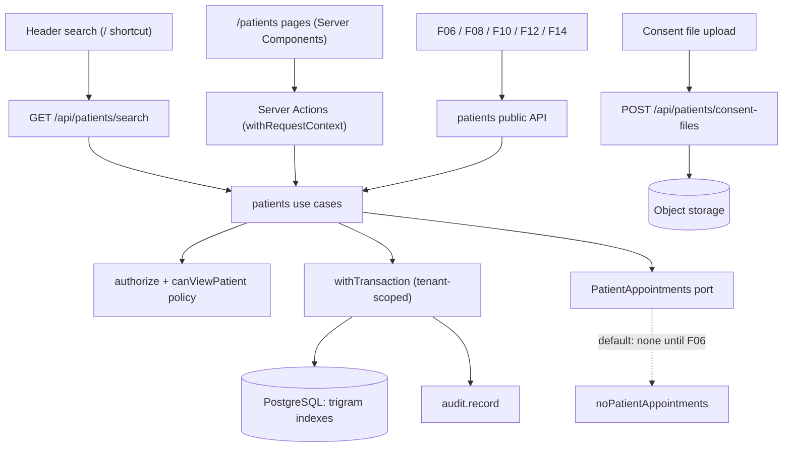

# Technical Specification: F05. Patient Registry

**Complexity:** complex

## 1. Technical Overview

**What.** A new `patients` module (simple tier, architecture section 3) that manages the clinic's patient registry. It covers:
- The patient record: identity (full name, social name, birth date, sex, CPF, RG), contact (mobile and secondary phone, email, address with CEP lookup), occupation, referral source, administrative observations and tags.
- A guardian for patients under 18.
- Duplicate detection on save: an exact CPF match blocks the save; the same normalized name and birth date warns and lets the user confirm.
- Privacy consent: versioned terms maintained by the Administrator, consent records per patient with an optional signed file, and the "consentimento pendente" status when a new terms version is published.
- Fast search by name, CPF or phone over 100,000 patients, from a global field in the header (shortcut "/") and from the patients page.
- Deactivation (deceased, moved, other) that hides the patient from booking searches and keeps the record.
- Configurable lists of referral sources and tags.
- Screens: the patients page with search, the full registration form, a quick registration form that F06 embeds in the booking modal, the patient page, and two settings pages.

**Why.** Scheduling (F06), documents (F08), packages (F10), the dashboard (F12) and the patient timeline (F14) all need one consistent patient identity. F05 provides it through a small public API, so later features never read the `patients` tables directly, except the read-only `analytics` and `privacy` modules, which the architecture allows to query across modules. F05 is also where the clinic records LGPD consent, which F14 later exports.

**How it fits the codebase.** F05 follows the patterns established by F01–F04:
- A simple module (Prisma in `application/`, pure rules in `domain/`) with a public `index.ts`.
- Use cases that call `authorize`, then `parseInput`, then `withTransaction` with auditing.
- `Result` with stable error codes and pt-BR messages with `{placeholders}`.
- Optimistic locking with `version`. Uniqueness enforced by partial unique indexes as well as by the use cases.
- Ports with inert defaults that F06 replaces, registered through `definePort` (ADR-022).
- Server Actions wrapped in `withRequestContext`; forms with react-hook-form, `HydratedFieldset` and `useFormDraft`.
- Shared pieces already in place: `Cpf` and `CpfInput` (F04), the CEP lookup route (F02), object storage (F01), the "Ink and Paper" design system (ADR-020).
- Integration tests on Testcontainers and Playwright E2E journeys.

### Scope

**Included (full scope; the PRD has no Core/Full split for F05):**
- Patients: create (full and quick forms), edit, deactivate with a reason, reactivate. Every PRD field.
- Guardian for minors: required when the patient is under 18 on the registration date.
- Duplicate detection: CPF match blocks with a link to the existing record; name and birth date match shows the candidates side by side with "Abrir cadastro existente" and "Criar mesmo assim".
- Concurrent edit detection with the author, time and changed fields.
- Search by name, CPF or phone, 20 per page, with CPF masked for Front Desk, and the global header search with the "/" shortcut.
- Referral sources and tags: configurable lists; up to 10 tags per patient.
- Privacy terms: versioned text published by the Administrator; consent records with method, staff user and optional signed file (PDF, JPG or PNG up to 10 MB); consent status badge.
- "Cadastro incompleto" banner while CPF or a current consent is missing.
- Patient page with the header and the Dados tab; the other tabs appear when the features that fill them exist.
- `PhoneNumber` value object and a shared address schema and form fields, extracted from F02 and reused here.
- Integrated cross-cutting concerns:
  - Authorization (`patient:read`, `patient:manage`, `setup:manage` for the lists, `lgpd:manage` for the terms) plus the Professional visibility policy.
  - Auditing of every change.
  - Tenant scoping of the new tables, including the raw SQL search query.

**Deferred / not included:**
- The Agendamentos, Documentos, Financeiro, Linha do tempo and Clínico tabs: F06, F08, F09, F14 and F07 add them.
- Consent withdrawal and LGPD export or anonymization: F14.
- Patient photos.

**Input contracts (Consumes):** none from other features in the PRD. F05 uses F01's organization profile (time zone, for ages and dates), user names (consent author, concurrent-edit author), the permission matrix and the request context, and F02's CEP lookup route.

**Output contracts (Provides):**
- To F06, F08 and F10: `patients.getPatientIdentity` (full name, social name, display name, CPF, birth date, age, phones, email, address, guardian, active status) and `patients.searchPatients` (booking search, active patients only by default).
- To F06: the `QuickPatientForm` component and `createPatient` with `mode: "quick"`.
- To F12 and F14: `patients.getPatientRecord` (the complete record with consent records, observations, tags and creation date). F12's counts may also read the `patient` table directly through `analytics`.
- `patients.registerPatientAppointments(impl)`: the extension point that F06 implements.

### Traceability to the PRD

| PRD block (F05) | Where it is specified |
|---|---|
| Provides | Scope → output contracts; Section 5 (public module API) |
| Capabilities | Sections 3, 5 and 6 (fields, limits, guardian, duplicates, consent, search, deactivation) |
| Experience | Section 4 (screens), Section 5 (actions) |
| Error Handling | Section 5 (error codes and pt-BR messages) |
| Acceptance criteria (Section 9, F05) | Section 7, acceptance tests |
| Cross-Feature Integration (F05 as provider for F06, F08, F10, F12, F14) | Section 7, provider-side tests |
| F01 matrix "Professional: view patients with an appointment with them" | Section 3 (visibility policy), Section 7 |

## 2. Architecture Impact

### Affected components

| Area | Path | Role |
|---|---|---|
| Module | `src/modules/patients/` | Rules, use cases, UI and public API |
| Shared kernel | `src/shared/kernel/phone.ts`, `src/shared/kernel/address.ts` | `PhoneNumber` value object; address schema moved from `units` |
| Shared UI | `src/shared/ui/forms/address-fields.tsx`, `phone-input.tsx` | Address fields with CEP lookup (extracted from the F02 unit form); masked phone input |
| Units module | `src/modules/units/application/schemas.ts`, `ui/unit-form.tsx` | Use the shared address schema and fields; no behavior change |
| Storage | `src/shared/storage/object-storage.ts` | New `head(key)` to confirm uploads |
| Routes | `src/app/(app)/patients/**`, `src/app/(app)/settings/patients/**`, `src/app/(app)/settings/privacy-terms/**`, `src/app/api/patients/search/route.ts`, `src/app/api/patients/consent-files/route.ts` | Pages, Server Actions, header search and consent file upload |
| Shell | `src/app/(app)/layout.tsx`, `src/shared/ui/app-shell/app-header.tsx`, `navigation.ts`, `app-sidebar.tsx` | Header search slot; "Pacientes" menu item; settings items |
| Tenancy | `src/shared/db/tenant.ts`, `tests/integration/helpers.ts` | Registers and truncates the new tables |
| Database | `prisma/schema.prisma`, `prisma/migrations/0006_patients/` | Patients, tags, referral sources, privacy terms, consent records |
| Documentation | `docs/architecture.{en,pt-BR}.md`, `docs/design-system.{en,pt-BR}.md` | ADR-023 (consent uploads through the server); global search pattern |

### Data flow



## 3. Technical Decisions

| Decision | Chosen Approach | Alternative Considered | Trade-off |
|---|---|---|---|
| Search index | The application stores `normalized_name` (accents removed, lower case, single spaces) and `phone_digits` (mobile and secondary phone digits). Both have `gin_trgm_ops` GIN indexes. CPF uses the partial unique index | `unaccent()` in an expression index | `unaccent` is not immutable, so it cannot back an index directly. Normalizing in TypeScript keeps one function for saving and searching. |
| Search query | One raw SQL query (`$queryRaw`) that filters by `organization_id` explicitly, classifies the term (name, CPF or phone) and orders prefix matches first, then by name | Prisma `contains` | Control over the plan and ordering for the p95 ≤ 1 s target. The tenant extension does not scope raw SQL, so the query adds the filter itself and a tenancy test covers it. |
| Search term rules | Letters → name contains the normalized term. Exactly 11 digits → CPF exact or phone contains. 8–10 digits → phone contains. Fewer than 3 characters → `PATIENTS_SEARCH_TOO_SHORT` | Searching every field for every term | Matches the PRD ("CPF with or without mask, or phone with the last 8+ digits") and keeps each query on one index. |
| Duplicate warning | `createPatient` returns `{ kind: "possible-duplicates", candidates }` without saving when the name and birth date match; resending with `confirmDuplicate: true` saves. A CPF match is an error | Duplicate check as a separate action | One round trip in the common case, and the save and the check can never disagree. |
| CPF message | "Este CPF já está cadastrado para Maria S. Oliveira." uses an abbreviated name (first name, middle initials, last name) and links to the record | Full name | Matches the PRD example and exposes less personal data in a blocking message. |
| Concurrent edit | `version` optimistic lock. On a stale version the error carries the author's name and the time; the form then reloads the current record and lists the fields that differ from what it had loaded | Last write wins | The PRD forbids silent overwrites and asks for the differing fields. No kernel change is needed: the diff is computed in the form. |
| Guardian | Columns on `patient` (`guardian_name`, `guardian_cpf`, `guardian_relationship`, `guardian_phone`). Required when the patient is under 18 on the registration date, in the organization's time zone | Separate guardian table | The PRD asks for one guardian. Columns keep reads simple; a table can come later without a destructive change. |
| Consent and terms | `privacy_terms_version` (sequential version per organization, text, publication author and time) and `consent_record` (patient, terms version, time, method, staff user, optional file). Both are append-only for the runtime role, like `audit_event` | Status columns on `patient` | Consent is legal evidence under LGPD and must never be rewritten. The status ("OK", "PENDENTE", "SEM CONSENTIMENTO") is computed from the latest record and the current version. |
| Consent file upload | `POST /api/patients/consent-files` receives the file (PDF, JPG or PNG, up to 10 MB), checks type by magic bytes and size, stores it at `org/{orgId}/patients/{uuid}` and returns an upload token that the consent action consumes. Recorded as **ADR-023** (refines ADR-009) | Presigned direct upload | The strict CSP allows `connect-src 'self'` only, and the storage bucket has no CORS setup. Signed terms are small. F07 and F08 can still adopt presigned uploads with CSP and CORS changes. |
| Consent file download | A Server Action authorizes, audits the access and returns a 5-minute presigned GET URL, which the browser opens as a navigation | Streaming through the app | Same as architecture 5.6; navigations are not limited by `connect-src`. |
| Professional visibility | Policy `canViewPatient(ctx, patientId)`: `patient:manage` sees every patient; otherwise a linked professional sees a patient only when `PatientAppointments.hasAppointmentWith(professionalId, patientId)` is true. Search for professionals is limited to `PatientAppointments.patientIdsFor(professionalId)` | Showing every patient to professionals | Follows the F01 matrix. Until F06 exists the default answers "no appointments", so professionals see no patients. |
| Appointment-dependent data | Port `PatientAppointments` (`countFuture`, `lastAppointmentDates`, `hasAppointmentWith`, `patientIdsFor`) with an inert default, registered with `definePort` (ADR-022) | Implementing in F06 | Rules, messages and tests exist now, as in F02–F04. |
| Configurable lists | Tables `referral_source` and `tag`, managed on `/settings/patients` with `setup:manage`. Items are deactivated, never deleted once used | Hard-coded options | The PRD says configurable. Deactivated items stay on existing patients and leave the selects. |
| Terms permission | `lgpd:manage` (Administrator) publishes terms versions | `organization:update` | The PRD says the Administrator maintains the terms; LGPD actions already map to `lgpd:manage`. |
| Header search | A client component in the header calls `GET /api/patients/search?q=` (debounced 250 ms, aborted when the text changes) and shows up to 8 results with "Ver todos os resultados" → `/patients?q=` | A Server Action | GET requests can be cancelled and cached per request, and Server Actions run one at a time per client. |
| Address and phone | The F02 address schema and fields move to `shared/kernel/address.ts` and `shared/ui/forms/address-fields.tsx`; a `PhoneNumber` value object joins the kernel | Copying the F02 code | The architecture lists `PhoneNumber` as a value object; two modules now need the same address form. |
| Patient page tabs | Only implemented tabs are rendered (Dados in F05). Later features add theirs | Empty placeholder tabs | The design system asks for no empty decoration; each feature adds its own tab. |

### Assumptions

These were decided during this spec rather than by the PRD, and can be overridden:
- **Limits.** 100,000 is a performance target, not a hard limit, so no patient count limit is enforced. Lists: up to 30 active referral sources and 50 active tags per organization; up to 10 tags per patient (PRD).
- **Field rules.**
  - Full name: 3–150 characters, with at least two words.
  - Social name: up to 150 characters.
  - Birth date: not in the future and at most 130 years ago.
  - RG: up to 20 characters, free format.
  - Occupation: up to 80 characters.
  - Email: up to 254 characters.
  - Observations: up to 2,000 characters (PRD).
- **Phones.** The mobile phone has 11 digits with area code and a 9 after it. The secondary phone has 10 or 11 digits.
- **Sex.** The options are `FEMALE`, `MALE`, `OTHER` and `NOT_INFORMED`, and the default is `NOT_INFORMED`.
- **Guardian.** Name, relationship and phone are required; the guardian's CPF is optional but validated. Relationships: "Mãe", "Pai", "Avó/Avô", "Tutor legal", "Outro". The guardian stays on the record after the patient turns 18.
- **Duplicates.**
  - The name and birth date check compares the normalized full name.
  - Candidates include inactive patients and are shown with masked CPF and the last 4 phone digits.
  - "Criar mesmo assim" is recorded in the audit metadata.
- **Quick registration.**
  - Requires full name, birth date and mobile phone. For a minor, the guardian fields appear and are required.
  - The "Cadastro incompleto" banner shows while the CPF is empty or there is no consent for the current terms version.
- **Search.**
  - Results show name (social name first), age, CPF, mobile phone and last appointment date.
  - Inactive patients appear on the patients page only with the "Inativos" filter. Booking search (F06) excludes them.
  - Masking (`***.***.247-25`) applies to Front Desk in search results only. On the patient page, Front Desk sees the full CPF because it edits the record (PRD matrix: Full).
- **Consent.**
  - The consent time is the moment it is recorded. The terms version is always the current one.
  - "Digital" means accepted in an external tool and recorded by staff.
  - A patient with no consent shows "SEM CONSENTIMENTO"; one whose latest consent is for an older version shows "CONSENTIMENTO PENDENTE".
  - Recording consent needs a published terms version.
- **Privacy terms.** Up to 20,000 characters of plain text. Versions are numbered 1, 2, 3… and cannot be edited after publishing.
- **Deactivation.** Reasons are `DECEASED`, `MOVED` and `OTHER`, with an optional note of up to 200 characters. It is blocked by future appointments (PRD), and reactivation is always allowed.
- **Ages and minors.** Ages and the under-18 rule use the organization's time zone (patients belong to the organization, not to a unit).
- **Upload tokens.** Files uploaded but never attached to a consent are deleted by a daily cleanup job after 24 hours.

## 4. Component Overview

### Frontend

| File Path | New/Modified | Purpose | Key Responsibilities |
|---|---|---|---|
| `src/app/(app)/patients/page.tsx` | New | Patients page | Search field with URL `?q=`, status filter, 20 per page with pagination; columns Nome (social name first), Idade, CPF (masked for Front Desk), Celular, Último agendamento, Status; "Novo paciente" (primary, `patient:manage`); empty states |
| `src/app/(app)/patients/new/page.tsx` | New | Full registration | `PatientForm` in create mode; after saving, redirects to the patient page |
| `src/app/(app)/patients/[patientId]/page.tsx` | New | Patient page | Header with name, age, phone, tags, consent stamp and "Cadastro incompleto" alert; Dados tab with the form (read-only without `patient:manage`), consent section and deactivation; 403 for professionals without an appointment |
| `src/app/(app)/patients/actions.ts` | New | Server Actions | Save (create or update), deactivate/reactivate, record consent, open consent file |
| `src/app/(app)/settings/patients/page.tsx`, `actions.ts` | New | Lists | Referral sources and tags: add, rename, deactivate/reactivate (`setup:manage`) |
| `src/app/(app)/settings/privacy-terms/page.tsx`, `actions.ts` | New | Terms | Version history and "Publicar nova versão" with a confirmation that explains the pending status (`lgpd:manage`) |
| `src/app/api/patients/search/route.ts` | New | Header search | `GET ?q=&limit=` with session; returns compact results; 400 for terms under 3 characters |
| `src/app/api/patients/consent-files/route.ts` | New | File upload | `POST` multipart with session and `patient:manage`; returns `{ uploadToken, fileName, size }` |
| `src/modules/patients/ui/patient-form.tsx` | New | Full form | Sections Identificação, Contato, Endereço, Responsável (shown for minors), Outras informações; CPF and phone masks; tags multi-select; duplicate dialog; concurrent-edit alert with changed fields; draft persistence |
| `src/modules/patients/ui/quick-patient-form.tsx` | New | Quick form (F06) | Full name, birth date, mobile phone, guardian when minor; same duplicate handling; `onCreated(patient)` callback |
| `src/modules/patients/ui/duplicate-dialog.tsx` | New | Duplicate warning | Candidates side by side with name, birth date, masked CPF and phone end; "Abrir cadastro existente" and "Criar mesmo assim" |
| `src/modules/patients/ui/patient-header.tsx` | New | Record header | Display name, age, phone, tags, consent stamp, "Cadastro incompleto" page alert |
| `src/modules/patients/ui/consent-section.tsx` | New | Consent | History table (version, date, method, staff, file link); "Registrar consentimento" dialog with terms version, method and optional file |
| `src/modules/patients/ui/patients-table.tsx`, `patient-search-field.tsx` | New | Search UI | Results table and URL-bound search with debounce |
| `src/modules/patients/ui/global-patient-search.tsx` | New | Header search | Combobox with "/" shortcut (ignored inside fields), arrow keys, `Enter` opens the patient, "Ver todos os resultados" |
| `src/modules/patients/ui/lists-panel.tsx`, `terms-panel.tsx` | New | Settings | Inline lists and terms history |
| `src/shared/ui/forms/address-fields.tsx`, `phone-input.tsx` | New | Shared fields | Address with CEP lookup (moved from F02); phone mask "(11) 98888-7777" |
| `src/shared/ui/app-shell/app-header.tsx`, `src/app/(app)/layout.tsx` | Modified | Header | New `search` slot rendered for users with `patient:read` |
| `src/shared/ui/app-shell/navigation.ts`, `app-sidebar.tsx` | Modified | Menu | "Pacientes" under Operação (`patient:read`, icon `users-round`); "Listas de pacientes" (`setup:manage`) and "Termos de privacidade" (`lgpd:manage`) under Configurações |

### Backend

| File Path | New/Modified | Purpose | Key Responsibilities |
|---|---|---|---|
| `src/shared/kernel/phone.ts` | New | Phone | `PhoneNumber.parse(input, { mobile })` returning `Result`; `format()`; `lastDigits(n)` |
| `src/shared/kernel/address.ts` | New (moved) | Address | Address Zod schema and UF list moved from `units/application/schemas.ts` |
| `src/shared/storage/object-storage.ts` | Modified | Storage | `head(key)` returning size and content type, or null |
| `src/modules/patients/domain/limits.ts` | New | Constants | 10 tags per patient, 30 referral sources, 50 tags, 2,000-character observations, 10 MB files, 20 per page, 3-character minimum search, 18-year majority (with PRD references) |
| `src/modules/patients/domain/names.ts` | New | Names | `normalizeName`, `displayName(full, social)`, `abbreviateName("Maria Silva Oliveira") → "Maria S. Oliveira"` |
| `src/modules/patients/domain/age.ts` | New | Age | `ageOn(birthDate, today)`, `isMinor(birthDate, today)` |
| `src/modules/patients/domain/search-term.ts` | New | Search terms | `classifySearchTerm(text)` → `{ kind: "name" \| "cpf-or-phone" \| "phone", value }` or too short |
| `src/modules/patients/domain/duplicates.ts` | New | Specification | `sameIdentity(a, b)` (normalized name and birth date), used by the use case and its tests |
| `src/modules/patients/domain/consent.ts` | New | Consent status | `consentStatus(latestVersion, currentVersion)`, `isRecordComplete(patient, status)` |
| `src/modules/patients/domain/masking.ts` | New | Masking | `maskCpf("52998224725") → "***.***.247-25"` |
| `src/modules/patients/application/ports.ts` | New | Ports | `PatientAppointments`, `UserNames`, `FileStore`, `PatientsDeps` |
| `src/modules/patients/application/schemas.ts` | New | Validation | Zod schemas for the full and quick forms, deactivation, consent, lists, terms and search, with PRD messages |
| `src/modules/patients/application/patients.ts` | New | Patient use cases | `getPatient`, `createPatient` (full or quick, duplicates), `updatePatient` (version check), `setPatientActive` |
| `src/modules/patients/application/search.ts` | New | Search | `searchPatients` (raw SQL, tenancy filter, Professional restriction, masking, last appointment dates) |
| `src/modules/patients/application/consents.ts` | New | Consent use cases | `listConsents`, `recordConsent`, `getConsentFileUrl` (audited), `storeConsentFile`, `deleteOrphanFiles` |
| `src/modules/patients/application/terms.ts` | New | Terms use cases | `listTermsVersions`, `getCurrentTerms`, `publishTermsVersion` |
| `src/modules/patients/application/lists.ts` | New | List use cases | `listReferralSources`, `listTags`, create, rename and activation for both |
| `src/modules/patients/application/policies.ts` | New | Policy | `canViewPatient(ctx, patientId, deps)` |
| `src/modules/patients/application/provided.ts` | New | Public read API | `getPatientIdentity`, `getPatientRecord` |
| `src/modules/patients/application/errors.ts`, `src/modules/patients/messages.ts` | New | Errors | Error factories and pt-BR messages |
| `src/modules/patients/infrastructure/no-appointments.ts`, `object-file-store.ts` | New | Adapters | Inert appointments port; `FileStore` on object storage |
| `src/modules/patients/index.ts` | New | Public API | Use cases bound to deps, provided API, `registerPatientAppointments`, UI exports, messages |
| `src/worker/jobs/patients-cleanup.ts`, `src/shared/jobs/queues.ts`, `src/worker/index.ts` | New/Modified | Job | Daily deletion of orphan consent files older than 24 hours |
| `src/modules/units/application/schemas.ts`, `ui/unit-form.tsx` | Modified | Refactor | Import the shared address schema and fields |
| `src/shared/db/tenant.ts`, `tests/integration/helpers.ts` | Modified | Tenancy | Register and truncate the new tables |

### Database

| Migration File | Tables Affected | Operation | Notes |
|---|---|---|---|
| `prisma/migrations/0006_patients/migration.sql` | `patient`, `referral_source`, `tag`, `patient_tag`, `privacy_terms_version`, `consent_record`, `consent_upload` | CREATE, GRANT | Generated by Prisma, plus hand-written trigram GIN indexes, partial unique CPF index, CHECK constraints and append-only grants |

## 5. API Contracts

All actions return the F01 `ActionResult` envelope. Permissions: `patient:read` (all roles; the Professional role only for patients with an appointment with them), `patient:manage` (Administrator, Manager, Front Desk), `setup:manage` for the lists, `lgpd:manage` for the terms.

### Error codes

| Code | HTTP Status | pt-BR message |
|---|---|---|
| `PATIENTS_NOT_FOUND` | 404 | "Paciente não encontrado." |
| `PATIENTS_INVALID_CPF` | 400 | "CPF inválido." (field `cpf` or `guardian.cpf`) |
| `PATIENTS_CPF_TAKEN` | 409 | "Este CPF já está cadastrado para {name}." (field `cpf`; `existingPatientId` in the fields for the link) |
| `PATIENTS_GUARDIAN_REQUIRED` | 400 | "Pacientes menores de 18 anos precisam de um responsável cadastrado." (field `guardian.name`) |
| `PATIENTS_STALE_VERSION` | 409 | "Este cadastro foi alterado por {author} às {time}. Revise as alterações antes de salvar." |
| `PATIENTS_HAS_FUTURE_APPOINTMENTS` | 409 | "O paciente possui {count} agendamentos futuros. Cancele-os antes de inativar." |
| `PATIENTS_INACTIVE` | 409 | "Este paciente está inativo. Reative o cadastro antes de alterá-lo." |
| `PATIENTS_SEARCH_TOO_SHORT` | 400 | "Digite pelo menos 3 caracteres para buscar." |
| `PATIENTS_TAG_LIMIT` | 400 | "Use no máximo 10 etiquetas por paciente." (field `tagIds`) |
| `PATIENTS_INVALID_OPTION` | 400 | "Selecione uma opção ativa da lista." (field `referralSourceId` or `tagIds`) |
| `PATIENTS_LIST_NAME_TAKEN` | 409 | "Já existe um item com este nome." (field `name`) |
| `PATIENTS_LIST_LIMIT` | 422 | "Limite de {max} itens ativos atingido." |
| `PATIENTS_NO_TERMS` | 409 | "Publique os termos de privacidade antes de registrar consentimentos." |
| `PATIENTS_INVALID_FILE` | 400 | "Envie um arquivo PDF, JPG ou PNG de até 10 MB." |
| `PATIENTS_UPLOAD_NOT_FOUND` | 404 | "O arquivo enviado expirou. Envie-o novamente." |
| `VALIDATION_FAILED` | 400 | Field messages, e.g. `mobilePhone`: "Informe um celular com DDD.", `birthDate`: "Informe uma data de nascimento válida." |
| `AUTHZ_FORBIDDEN`, `CONFLICT_STALE_VERSION`, `AUTH_UNAUTHENTICATED` | — | As in F01 |

Other texts in `messages.ts` (not errors): "Cadastro incompleto. Informe o CPF e registre o consentimento.", "Encontramos um cadastro com o mesmo nome e data de nascimento.", toasts "Paciente cadastrado.", "Cadastro salvo.", "Consentimento registrado.", "Paciente inativado.", "Paciente reativado.", "Nova versão dos termos publicada. Os pacientes passam a ter consentimento pendente."

### Action: Create patient
- **Action:** `savePatientAction` → `createPatient`
- **Permission:** `patient:manage`

| Field | Type | Required | Validation | Description |
|---|---|---|---|---|
| `mode` | `"full" \| "quick"` | Yes | enum | Quick: only name, birth date, mobile and (for minors) guardian are required |
| `fullName` | `string` | Yes | 3–150, two words | Legal name |
| `socialName` | `string` | No | ≤ 150 | Shown instead of the full name |
| `birthDate` | `string` (YYYY-MM-DD) | Yes | not future, ≤ 130 years | Birth date |
| `sex` | `enum` | No | `FEMALE, MALE, OTHER, NOT_INFORMED` | Default `NOT_INFORMED` |
| `cpf` | `string` | No | check digits; unique in the organization | Masked or digits |
| `rg` | `string` | No | ≤ 20 | RG |
| `mobilePhone` | `string` | Yes | 11 digits, mobile | "(11) 98888-7777" |
| `secondaryPhone` | `string` | No | 10–11 digits | Secondary phone |
| `email` | `string` | No | email, ≤ 254 | Email |
| `address` | `object` | No | shared address schema | CEP, street, number, complement, district, city, state |
| `occupation` | `string` | No | ≤ 80 | Occupation |
| `referralSourceId` | `uuid` | No | active referral source | Origin |
| `observations` | `string` | No | ≤ 2,000 | Administrative observations |
| `tagIds` | `uuid[]` | No | ≤ 10, active tags | Tags |
| `guardian` | `object` | If minor | `name` 3–150, `relationship` enum, `phone` 10–11 digits, `cpf` optional valid | Guardian |
| `confirmDuplicate` | `boolean` | No | — | Saves despite a name and birth date match |

```json
{
  "mode": "full",
  "fullName": "Maria Silva Oliveira",
  "socialName": null,
  "birthDate": "1988-04-12",
  "sex": "FEMALE",
  "cpf": "529.982.247-25",
  "mobilePhone": "(11) 98888-7777",
  "email": "maria@exemplo.com.br",
  "address": { "cep": "01310-100", "street": "Avenida Paulista", "number": "1000", "complement": null, "district": "Bela Vista", "city": "São Paulo", "state": "SP" },
  "referralSourceId": "0192e1a0-1111-7aaa-8bbb-0c0d0e0f1a1b",
  "observations": "Prefere manhãs.",
  "tagIds": ["0192e1a1-2222-7ccc-8ddd-1e1f2a2b3c3d"]
}
```

Response when saved:

```json
{ "ok": true, "data": { "kind": "created", "patientId": "0192e1b2-7e6f-7a1b-8c2d-3e4f5a6b7c8d", "version": 1 } }
```

Response when the name and birth date match an existing record (nothing saved):

```json
{
  "ok": true,
  "data": {
    "kind": "possible-duplicates",
    "candidates": [
      { "patientId": "0192e0ff-0000-7000-8000-000000000001", "displayName": "Maria Silva Oliveira", "birthDate": "1988-04-12", "maskedCpf": "***.***.247-25", "phoneEnd": "7777", "active": true }
    ]
  }
}
```

CPF conflict:

```json
{ "ok": false, "error": { "code": "PATIENTS_CPF_TAKEN", "message": "Este CPF já está cadastrado para Maria S. Oliveira.", "fields": { "cpf": "Este CPF já está cadastrado para Maria S. Oliveira.", "existingPatientId": "0192e0ff-0000-7000-8000-000000000001" } } }
```

The error's `fields` also carry `existingPatientId`, the ID of the record that already has the CPF, so the UI can link to it ("Abrir cadastro"). Audit: `CREATE` on `patient` with field changes; metadata `{ duplicateConfirmed: true }` when applicable.

### Action: Update patient
- **Action:** `savePatientAction` → `updatePatient`
- **Permission:** `patient:manage`

Same fields as the full mode plus `patientId` and `version`. A stale version returns `PATIENTS_STALE_VERSION` with `{author}` (user name) and `{time}` ("14:32", organization time zone); the form then calls `getPatient` and lists the differing fields. Errors: as create, plus `PATIENTS_NOT_FOUND`, `PATIENTS_INACTIVE`. Audit: `UPDATE` with field changes.

### Action: Deactivate / reactivate
- **Action:** `setPatientActiveAction` → `setPatientActive`
- **Permission:** `patient:manage`

Request `{ "patientId": "<uuid>", "active": false, "reason": "MOVED", "note": "Mudou-se para Curitiba" }`, response `{ "ok": true, "data": { "active": false } }`. Errors: `PATIENTS_HAS_FUTURE_APPOINTMENTS` (count from the port), `PATIENTS_NOT_FOUND`. Audit: `UPDATE` with `active`, `inactiveReason`.

### Route: GET `/api/patients/search`
- **Authentication:** session, `patient:read`.
- **Query:** `q` (≥ 3 characters), `page` (default 1), `status` (`active` default, `inactive`, `all`), `limit` (header search: 8; page: 20).

```json
{
  "items": [
    { "id": "0192e1b2-7e6f-7a1b-8c2d-3e4f5a6b7c8d", "displayName": "Maria Silva Oliveira", "age": 38, "cpf": "***.***.247-25", "mobilePhone": "(11) 98888-7777", "lastAppointmentAt": null, "active": true }
  ],
  "page": 1,
  "pageSize": 20,
  "total": 1
}
```

`cpf` is masked for Front Desk and complete for other roles. **400** short term; **401** no session; **403** no permission.

### Route: POST `/api/patients/consent-files`
- **Authentication:** session, `patient:manage`. Multipart field `file`.
- **200:** `{ "uploadToken": "0192e1c0-...", "fileName": "termo-assinado.pdf", "size": 284113 }`.
- **400** `PATIENTS_INVALID_FILE` (type checked by magic bytes, size ≤ 10 MB).

### Action: Record consent
- **Action:** `recordConsentAction` → `recordConsent`
- **Permission:** `patient:manage`

| Field | Type | Required | Validation | Description |
|---|---|---|---|---|
| `patientId` | `uuid` | Yes | active patient | Patient |
| `method` | `enum` | Yes | `PAPER_UPLOADED, VERBAL, DIGITAL` | "Assinado em papel", "Verbal, confirmado pela equipe", "Digital" |
| `uploadToken` | `uuid` | No | unused token of this organization | Signed term file |

The consent is recorded for the current terms version at the current time by the signed-in user. Errors: `PATIENTS_NO_TERMS`, `PATIENTS_UPLOAD_NOT_FOUND`, `PATIENTS_NOT_FOUND`. Audit: `CREATE` on `consent_record`.

Opening a file: `openConsentFileAction({ consentId })` → `{ url }` (presigned GET, 5 minutes), audited as `READ_SENSITIVE`.

### Actions: Privacy terms
- `publishTermsVersionAction({ text })` → `{ version: 3 }`. Permission `lgpd:manage`. Text 50–20,000 characters. Audit `CREATE` on `privacy_terms_version`.

### Actions: Lists
- `createListItemAction({ list: "referral-source" | "tag", name })`, `renameListItemAction({ list, id, name })`, `setListItemActiveAction({ list, id, active })`. Permission `setup:manage`. Names 1–40 characters, unique per list (case-insensitive). Errors: `PATIENTS_LIST_NAME_TAKEN`, `PATIENTS_LIST_LIMIT`.

### Public module API (Provides)

| Function | Consumers | Returns |
|---|---|---|
| `patients.searchPatients(ctx, { q, page?, status?, limit? })` | F06 booking modal, header | As the search route |
| `patients.getPatientIdentity(ctx, patientId)` | F06, F08, F10 | `{ id, fullName, socialName, displayName, cpf, birthDate, age, mobilePhone, secondaryPhone, email, address, formattedAddress, guardian, active }` |
| `patients.getPatientRecord(ctx, patientId)` | F12, F14 | Identity plus `sex, rg, occupation, referralSource, observations, tags, consents: [{ termsVersion, consentedAt, method, recordedByName, hasFile }], consentStatus, createdAt, createdByName` |
| `patients.createPatient(ctx, input)` with `mode: "quick"` and `QuickPatientForm` | F06 | As the create action |
| `patients.registerPatientAppointments(impl \| null)` | F06 | Replaces the inert default |

All provided reads apply `canViewPatient`.

## 6. Data Model

All tables have `id uuid` (UUIDv7 from the application), `organization_id uuid NOT NULL` (FK `organization`) and `created_at`/`updated_at timestamptz`, except where noted. The tables are registered in the tenant model registry and the test reset helper.

### Table: `patient`

| Column | Type | Nullable | Default | Description |
|---|---|---|---|---|
| `full_name` | `varchar(150)` | No | — | Legal name |
| `social_name` | `varchar(150)` | Yes | — | Displayed instead of the full name |
| `normalized_name` | `varchar(150)` | No | — | Lower case, no accents, single spaces; search and duplicates |
| `birth_date` | `date` | No | — | Birth date |
| `sex` | `varchar(12)` | No | `'NOT_INFORMED'` | `FEMALE, MALE, OTHER, NOT_INFORMED` |
| `cpf` | `char(11)` | Yes | — | Digits only |
| `rg` | `varchar(20)` | Yes | — | RG |
| `mobile_phone` | `varchar(11)` | No | — | Digits only |
| `secondary_phone` | `varchar(11)` | Yes | — | Digits only |
| `phone_digits` | `varchar(23)` | No | — | Mobile and secondary digits separated by a space; phone search |
| `email` | `varchar(254)` | Yes | — | Email |
| `cep`, `street`, `number`, `complement`, `district`, `city`, `state` | as `unit` | Yes | — | Address |
| `occupation` | `varchar(80)` | Yes | — | Occupation |
| `referral_source_id` | `uuid` | Yes | — | FK `referral_source(id)` |
| `observations` | `varchar(2000)` | Yes | — | Administrative observations |
| `guardian_name` | `varchar(150)` | Yes | — | Guardian |
| `guardian_cpf` | `char(11)` | Yes | — | Guardian CPF |
| `guardian_relationship` | `varchar(20)` | Yes | — | `MOTHER, FATHER, GRANDPARENT, LEGAL_GUARDIAN, OTHER` |
| `guardian_phone` | `varchar(11)` | Yes | — | Guardian phone |
| `active` | `boolean` | No | `true` | Inactive patients leave booking searches |
| `inactive_reason` | `varchar(12)` | Yes | — | `DECEASED, MOVED, OTHER` |
| `inactive_note` | `varchar(200)` | Yes | — | Note |
| `deactivated_at` | `timestamptz` | Yes | — | When deactivated |
| `version` | `integer` | No | `1` | Optimistic lock |
| `created_by_id`, `updated_by_id` | `uuid` | Yes | — | Authors |

**Indexes and constraints:**

| Name | Type | Definition | Purpose |
|---|---|---|---|
| `uq_patient_org_cpf` | UNIQUE (partial) | `(organization_id, cpf) WHERE cpf IS NOT NULL` | PRD: CPF unique within the organization |
| `ix_patient_org_identity` | btree | `(organization_id, normalized_name, birth_date)` | Duplicate warning |
| `ix_patient_name_trgm` | GIN | `normalized_name gin_trgm_ops` | Partial name search |
| `ix_patient_phone_trgm` | GIN | `phone_digits gin_trgm_ops` | Phone search by last digits |
| `ix_patient_org_active_name` | btree | `(organization_id, active, normalized_name)` | Ordered listing and filters |
| `ck_patient_sex`, `ck_patient_guardian_relationship`, `ck_patient_inactive_reason` | CHECK | value lists | Valid keys |
| `ck_patient_cpf`, `ck_patient_guardian_cpf` | CHECK | `^[0-9]{11}$` | Digits only |
| `ck_patient_mobile` | CHECK | `^[0-9]{2}9[0-9]{8}$` | Mobile with area code |
| `ck_patient_guardian_complete` | CHECK | guardian name, relationship and phone all null or all set | Consistent guardian |
| `ck_patient_inactive` | CHECK | `active OR inactive_reason IS NOT NULL` | A reason for every deactivation |

The minor-needs-guardian rule depends on "today", so it is a use-case rule, not a CHECK.

### Table: `referral_source` and `tag`

| Column | Type | Nullable | Default | Description |
|---|---|---|---|---|
| `name` | `varchar(40)` | No | — | Item name |
| `active` | `boolean` | No | `true` | Inactive items leave the selects |
| `sort_order` | `smallint` | No | — | Display order (creation order) |

Constraints: `uq_referral_source_org_name` and `uq_tag_org_name` UNIQUE (`organization_id`, `lower(name)`).

### Table: `patient_tag`

| Column | Type | Nullable | Default | Description |
|---|---|---|---|---|
| `patient_id` | `uuid` | No | — | FK `patient(id)` ON DELETE RESTRICT |
| `tag_id` | `uuid` | No | — | FK `tag(id)` ON DELETE RESTRICT |

Primary key `(patient_id, tag_id)`; index `ix_patient_tag_tag` (`tag_id`).

### Table: `privacy_terms_version` (append-only)

| Column | Type | Nullable | Default | Description |
|---|---|---|---|---|
| `version` | `integer` | No | — | 1, 2, 3… per organization |
| `text` | `text` | No | — | Terms text (≤ 20,000 characters, checked by the use case) |
| `published_at` | `timestamptz` | No | `now()` | Publication time |
| `published_by_id` | `uuid` | Yes | — | Author |

Constraint `uq_terms_org_version` UNIQUE (`organization_id`, `version`). The runtime role gets `SELECT, INSERT` only.

### Table: `consent_record` (append-only)

| Column | Type | Nullable | Default | Description |
|---|---|---|---|---|
| `patient_id` | `uuid` | No | — | FK `patient(id)` |
| `terms_version_id` | `uuid` | No | — | FK `privacy_terms_version(id)` |
| `consented_at` | `timestamptz` | No | `now()` | Time recorded |
| `method` | `varchar(16)` | No | — | `PAPER_UPLOADED, VERBAL, DIGITAL` |
| `recorded_by_id` | `uuid` | No | — | Staff user |
| `file_object_key` | `varchar(255)` | Yes | — | `org/{orgId}/patients/{uuid}` |
| `file_name` | `varchar(150)` | Yes | — | Original name, for display |
| `file_size` | `integer` | Yes | — | Bytes |

Index `ix_consent_patient_time` (`patient_id`, `consented_at DESC`). CHECK on `method`. The runtime role gets `SELECT, INSERT` only.

### Table: `consent_upload`

Pending uploads before a consent consumes them: `id` (the upload token), `organization_id`, `object_key`, `file_name`, `file_size`, `content_type`, `uploaded_by_id`, `created_at`, `consumed_at`. Index `(created_at) WHERE consumed_at IS NULL` for the cleanup job.

### Migration excerpt (hand-written parts)

```sql
CREATE UNIQUE INDEX uq_patient_org_cpf ON patient (organization_id, cpf) WHERE cpf IS NOT NULL;
CREATE INDEX ix_patient_name_trgm ON patient USING gin (normalized_name gin_trgm_ops);
CREATE INDEX ix_patient_phone_trgm ON patient USING gin (phone_digits gin_trgm_ops);
CREATE UNIQUE INDEX uq_tag_org_name ON tag (organization_id, lower(name));
CREATE UNIQUE INDEX uq_referral_source_org_name ON referral_source (organization_id, lower(name));

ALTER TABLE patient ADD CONSTRAINT ck_patient_mobile CHECK (mobile_phone ~ '^[0-9]{2}9[0-9]{8}$');
ALTER TABLE patient ADD CONSTRAINT ck_patient_guardian_complete CHECK (
  (guardian_name IS NULL AND guardian_relationship IS NULL AND guardian_phone IS NULL)
  OR (guardian_name IS NOT NULL AND guardian_relationship IS NOT NULL AND guardian_phone IS NOT NULL));
ALTER TABLE patient ADD CONSTRAINT ck_patient_inactive CHECK (active OR inactive_reason IS NOT NULL);

-- Consent and terms are legal evidence (LGPD): the runtime role may only append and read.
REVOKE ALL ON privacy_terms_version, consent_record FROM gcli_app;
GRANT SELECT, INSERT ON privacy_terms_version, consent_record TO gcli_app;
```

### Search query (shape)

```sql
SELECT id, full_name, social_name, birth_date, cpf, mobile_phone, active, count(*) OVER () AS total
FROM patient
WHERE organization_id = $org                      -- raw SQL: the tenant extension does not apply
  AND ($status = 'all' OR active = ($status = 'active'))
  AND normalized_name LIKE '%' || $term || '%'     -- or cpf = $digits, or phone_digits LIKE '%' || $digits || '%'
  AND ($restrictIds IS NULL OR id = ANY($restrictIds))
ORDER BY (normalized_name LIKE $term || '%') DESC, normalized_name
LIMIT $limit OFFSET $offset;
```

`EXPLAIN ANALYZE` with 100,000 rows is attached to the PR (architecture section 8).

## 7. Testing Strategy

### Test files

| Test File | Test Type | Target | Coverage Goal |
|---|---|---|---|
| `src/shared/kernel/phone.test.ts` | Unit | `PhoneNumber` | 100% |
| `src/modules/patients/domain/names.test.ts` | Unit | Normalization, display and abbreviation | 100% |
| `src/modules/patients/domain/age.test.ts` | Unit | Age and minors | 100% |
| `src/modules/patients/domain/search-term.test.ts` | Unit | Term classification | 100% |
| `src/modules/patients/domain/consent.test.ts` | Unit | Consent status, completeness, masking | 100% |
| `tests/integration/patients/support.ts` | Helper | Organizations, patients, terms | — |
| `tests/integration/patients/patients.test.ts` | Integration | Registration, guardian, duplicates, concurrent edits, deactivation | All F05 registration criteria |
| `tests/integration/patients/search.test.ts` | Integration | Search, masking, tenancy, performance | Search criteria |
| `tests/integration/patients/consents.test.ts` | Integration | Terms, consents, files, append-only | Consent criterion |
| `tests/integration/patients/provided.test.ts` | Integration | Public API | Provider-side criteria |
| `tests/e2e/f05-patients.spec.ts` | E2E | Registration and search journeys | Critical journeys |

### Unit tests

| Test Function | Description | Assertions |
|---|---|---|
| `F05: phone numbers accept Brazilian formats with area code` | `PhoneNumber.parse` | "(11) 98888-7777" mobile ok; "(11) 3333-4444" not mobile; formats back |
| `F05: names are normalized without accents and case` | `normalizeName` | "  JOSÉ  da Silva " → "jose da silva" |
| `F05: the CPF message abbreviates the existing patient's name` | `abbreviateName` | "Maria Silva Oliveira" → "Maria S. Oliveira" |
| `F05: social name is displayed instead of the full name` | `displayName` | Social name when filled |
| `F05: age and minority use the organization's today` | `ageOn`, `isMinor` | Birthday today counts; 17 years 364 days is a minor |
| `F05: search terms are classified as name, CPF or phone` | `classifySearchTerm` | "mar" name; "529.982.247-25" cpf-or-phone; "98887777" phone; "ab" too short |
| `F05: consent status follows the current terms version` | `consentStatus` | OK, PENDENTE, SEM CONSENTIMENTO |
| `F05: CPF is masked except the last 5 digits` | `maskCpf` | "***.***.247-25" |

### Acceptance tests (PRD Section 9, F05)

| Test Function | PRD criterion | Assertions |
|---|---|---|
| `F05: a patient cannot be saved without full name, birth date and mobile phone` | Required fields | `VALIDATION_FAILED` with each field; quick mode saves with only these |
| `F05: an invalid CPF is rejected and an existing CPF blocks the save with a link` | CPF rules | `PATIENTS_INVALID_CPF`; `PATIENTS_CPF_TAKEN` message "…para Maria S. Oliveira." and `existingPatientId`; concurrent inserts settle on the unique index |
| `F05: the same name and birth date warns and allows creating anyway` | Duplicate warning | First call returns `possible-duplicates` and saves nothing; with `confirmDuplicate` it saves and audits `duplicateConfirmed` |
| `F05: a patient under 18 cannot be saved without a guardian` | Guardian | `PATIENTS_GUARDIAN_REQUIRED`; saves with guardian; 18 today needs none |
| `F05: search by partial name, CPF or phone returns the patient within 1 second at p95 with 100,000 records` | Search performance | 100,000 rows inserted with `generate_series`; 50 searches of each kind; p95 < 1,000 ms; accent-insensitive ("joao" finds "João"); CPF with and without mask; last 8 phone digits |
| `F05: front desk sees CPF masked except the last 5 digits in search results` | Masking | Front Desk "***.***.247-25"; Manager full CPF |
| `F05: consent stores terms version, time, method and user, and a new version makes it pending` | Consent | Record has all fields; status OK; publishing version 2 → PENDENTE; direct UPDATE on `consent_record` by the runtime role fails |
| `F05: a concurrent edit is detected and the second save does not overwrite the first` | Concurrent edit | Second save with the old version → `PATIENTS_STALE_VERSION` with author and time; first values kept |
| `F05: social name is displayed instead of the full name` | Social name | `displayName` in search results, identity and patient header data |

### Other integration tests

| Test Function | Covers | Assertions |
|---|---|---|
| `F05: deactivation is blocked by future appointments and hides the patient from booking search` | Deactivation | Fake port 3 → message "O paciente possui 3 agendamentos futuros…"; with 0 → inactive, excluded from `status: active`, readable by ID |
| `F05: a professional only sees patients with an appointment with them` | Visibility | Fake port lists one patient: search and `getPatient` return only it; others `AUTHZ_FORBIDDEN` |
| `F05: search ignores other organizations even in raw SQL` | Tenancy | Same name in two organizations → only own results |
| `F05: tags are limited to 10 active items per patient` | Tags | 11 tags → `PATIENTS_TAG_LIMIT`; inactive tag → `PATIENTS_INVALID_OPTION` |
| `F05: consent files are validated, stored privately and opened through audited short links` | Files | Text file rejected; PDF stored under `org/{org}/patients/`; open → URL valid for 5 minutes and `READ_SENSITIVE` audit; token reused → `PATIENTS_UPLOAD_NOT_FOUND` |
| `F05: terms can only be published by the administrator` | Permissions | Manager → `AUTHZ_FORBIDDEN` |

### Cross-Feature Integration (F05 as provider)

| Test Function | PRD criterion | Assertions |
|---|---|---|
| `F05→F06/F08/F10: patient identity uses the social name where filled` | Patient identity in booking, documents and package sales | `getPatientIdentity` returns `displayName` = social name, CPF, birth date, address formatted |
| `F05→F12: patients carry their creation date` | New patient counts in the dashboard | `getPatientRecord.createdAt` matches; patients created in a period are countable by `created_at` |
| `F05→F14: the record includes consent records and registration data` | Timeline shows consent and registration events | `getPatientRecord` lists consents with version, method, author; audit has the `CREATE` event |

### E2E journeys

| Test Function | Journey |
|---|---|
| `F05: front desk registers a patient, sees the duplicate warning and finds the patient from the header` | Publish terms (admin) → Pacientes → Novo paciente → full form with CPF and CEP → save → "Cadastro incompleto" until consent → register consent → banner gone → new patient with same name and birth date → duplicate dialog → "Abrir cadastro existente" → press "/" → type 3 letters → result opens the patient |
| `F05: a minor needs a guardian` | Quick-style form with a 10-year-old → guardian error → fill guardian → saved |
