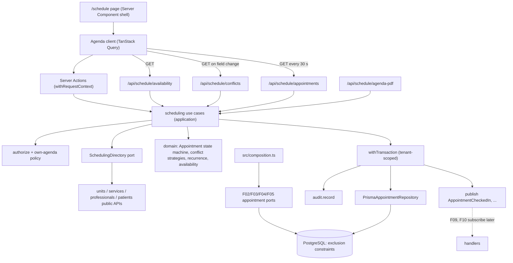

# Technical Specification: F06. Scheduling and Agenda

**Complexity:** complex

## 1. Technical Overview

**What.** A new `scheduling` module, the first **rich** business module (architecture section 3): a pure domain with the `Appointment` entity and its state machine, conflict rules as strategies, recurrence and availability as pure functions, and repositories as ports. It covers:
- Booking a single appointment, with server-side conflict validation backed by PostgreSQL exclusion constraints, the "Encaixe" override, and justified exceptions for Manager and Administrator.
- The status lifecycle with history, including the reversal of Concluído requested for F10.
- Editing an appointment before check-in, and rescheduling with history (from the form or by drag-and-drop and resizing).
- Recurring series: creation, editing and cancellation with "Somente este", "Este e os seguintes" or "Todos os futuros".
- The agenda screen: Day view (per professional or per room), Week view (one professional or one room) and List view, with filters, 30-second polling, and "Próximo horário livre".
- A printable daily agenda per professional, as a PDF generated on the server.
- The configurable list of cancellation reasons.
- An Agendamentos tab on the patient page.
- The implementations of the appointment ports that F02, F03, F04 and F05 left with inert defaults.

**Why.** F06 is the center of the product. Clinical notes (F07), charges (F09), packages (F10), the dashboard (F12), reports (F13) and the patient timeline (F14) all start from an appointment. The PRD's hardest invariant, "two simultaneous saves produce exactly one appointment", can only be guaranteed by the database, so the conflict model is designed around exclusion constraints, and the domain mirrors them so that users get a precise message before saving. Rules that the earlier features already wrote, such as deactivation blocked by future appointments, closure warnings and professional visibility of patients, start to apply once F06 registers its ports.

**How it fits the codebase.** F06 follows the patterns established by F01–F05:
- Use cases call `authorize`, then `parseInput`, then `withTransaction` with `audit.record()` and `publish()`.
- `Result` with stable codes and pt-BR messages with `{placeholders}` in `messages.ts`.
- Optimistic locking with `version`.
- Ports registered through `definePort` and `src/composition.ts` (ADR-022).
- Server Actions wrapped in `withRequestContext`, forms with react-hook-form, and the design system "Ink and Paper" (ADR-020).
- Integration tests on Testcontainers and Playwright journeys.

New in this feature:
- The rich-module layering (`domain/` entity, repository port, Prisma repository in `infrastructure/`).
- Three dependencies: `@tanstack/react-query` (already decided in ADR-011), `@dnd-kit/core`, and `@react-pdf/renderer`, which becomes the shared PDF base for F08, F09 and F13.

### Scope

**Included (Core + Full Scope, by decision of the interview):**
- Core Scope:
  - Booking a single appointment with every PRD field.
  - Conflict validation at save time, plus a preview in the booking panel.
  - The status lifecycle with history.
  - Rescheduling from the form, with history.
  - Editing service, duration, room and notes before check-in.
  - Day, Week and List views with filters.
  - Encaixe with confirmation and justified exceptions.
  - "Próximo horário livre".
  - 30-second polling.
  - A Professional sees only their own appointments.
  - Cancellation reasons list.
- Full Scope additions:
  - Recurring series booking, editing and cancellation.
  - Drag-and-drop rescheduling and resizing.
  - Room-based Day view.
  - Printable daily agenda per professional (PDF).
- Integrated from cross-cutting concerns:
  - Authorization through the `schedule:*` matrix, a new `schedule:override-availability` and a new `schedule:revert-completion`, and the own-agenda policy.
  - Auditing of every mutation and of the PDF export.
  - Tenant scoping of the new tables, including the raw SQL used by the ports.
  - Domain events published inside the transaction, for F09 and F10.
- Implementation of the ports declared by F02 (`ScheduledAppointments`), F03 (`ScheduledServiceAppointments`), F04 (`ProfessionalAppointments`) and F05 (`PatientAppointments`).
- URL contracts promised by F04: `/schedule?view=list&professional=<id>&from=<date>` and `/schedule?appointment=<id>&action=reschedule`.
- Agendamentos tab on the patient page (deferred to F06 by the F05 spec).
- Documentation:
  - PRD F06 updated in both languages with the Concluído reversal rule.
  - ADR-024, ADR-025 and ADR-026 added in both languages.
  - The design system extended with the agenda patterns, in both languages.

**Deferred / not included:**
- The link to the clinical note in the appointment panel: F07 adds it.
- Creating a charge on check-in: F06 publishes `AppointmentCheckedIn`, and F09 subscribes to it.
- Package linking and debit on completion: F10 subscribes to `AppointmentCompleted` and `AppointmentCompletionReverted`.
- Reminders to patients (SMS, WhatsApp) are out of scope for V1 in the PRD.

**Input contracts (Consumes):**
- F02, through `units.getUnitSchedule` and `units.listUnits`: business hours per weekday, closures, rooms with active status, and the unit time zone (ADR-019). Also `units.getSelectedUnit` for the default unit.
- F03, through `services.listActiveServices`, `services.getService` and `services.getAllowedRooms`: duration, current price (the snapshot is taken at booking), color, the requires-room flag, and allowed rooms per unit.
- F04, through `professionals.listBookableProfessionals`, `isServiceEnabled`, `getWorkingCalendar` and `getProfessionals`: enabled services, working intervals per unit and date, time-offs, active status and color.
- F05, through `patients.searchPatients`, `patients.getPatientIdentity`, `QuickPatientForm` and `createPatient` (quick mode): the display name (social name first), phone and birth date.
- F01: the slot granularity and time zone from the organization profile, user names, the permission matrix and the request context.

**Output contracts (Provides):**
- Appointment records for F07, F09, F10, F12, F13 and F14 through `scheduling.getAppointment` and `scheduling.listAppointments`:
  - patient, professional, service, unit and room;
  - start and end instants, duration, status and status history;
  - price snapshot;
  - cancellation origin, reason and note;
  - series;
  - author;
  - the Encaixe flag and any exception.

  The read-only `analytics` and `privacy` modules may also query the `appointment` tables directly (architecture section 3).
- Domain events, published inside the transaction:
  - `AppointmentBooked`, `AppointmentRescheduled`, `AppointmentConfirmed`, `AppointmentCheckedIn`, `AppointmentCheckInUndone`, `AppointmentStarted`, `AppointmentCompleted`, `AppointmentCompletionReverted`, `AppointmentMarkedNoShow`, `AppointmentCancelled`, `AppointmentUpdated`.
  - Payload: appointment ID, status, professional, service, unit, patient, price snapshot, instants and author.
- Port implementations registered in `src/composition.ts` for units, services, professionals and patients.

### Traceability to the PRD

| PRD block (F06) | Where it is specified |
|---|---|
| Consumes | Scope → input contracts; Section 4 (directory adapter) |
| Provides | Scope → output contracts; Section 5 (public module API and events) |
| Core Scope | Scope → Included |
| Full Scope additions | Scope → Included (Core + Full chosen) |
| Capabilities | Sections 3, 5 and 6 (fields, lifecycle, conflict rules, recurrence, views, availability, polling, visibility) |
| Experience | Section 4 (screens and components), Section 5 (actions) |
| Error Handling | Section 5 (error codes and pt-BR messages) |
| Acceptance criteria (Section 9, F06) | Section 7, acceptance tests |
| Cross-Feature Integration (F02, F03, F04 and F05 → F06 as consumer; F06 → F07, F09 and F10 as provider) | Section 7, cross-feature tests |
| F10 Capabilities "Reverting Concluído restores the session" | Section 3 (completion reversal); PRD F06 updated |

## 2. Architecture Impact

### Affected components

| Area | Path | Role |
|---|---|---|
| Module | `src/modules/scheduling/` | Domain, use cases, infrastructure, UI and public API (rich tier) |
| Shared kernel | `src/shared/kernel/date-time-range.ts`, `src/shared/kernel/zoned-time.ts` | `DateTimeRange` value object (architecture 5.8); zoned-time helpers moved from `professionals/domain/time-zone-offsets.ts` |
| Shared PDF | `src/shared/pdf/` | `@react-pdf/renderer` base: fonts, page template (header, footer, page numbers), render to buffer (ADR-024) |
| Shared UI | `src/shared/ui/query/query-provider.tsx` | TanStack Query client provider for the authenticated layout (ADR-025) |
| Authorization | `src/shared/authz/permissions.ts` | `schedule:override-availability` and `schedule:revert-completion` (Administrator, Manager) |
| Professionals module | `src/modules/professionals/domain/time-zone-offsets.ts` and its importers | Re-exports from the shared kernel; no behavior change |
| Patients module | `src/app/(app)/patients/[patientId]/page.tsx` | Agendamentos tab |
| Routes | `src/app/(app)/schedule/**`, `src/app/(app)/settings/schedule/**`, `src/app/api/schedule/**` | Agenda page, Server Actions, polling, conflict preview, availability and PDF routes, settings |
| Shell | `src/app/(app)/layout.tsx`, `src/shared/ui/app-shell/navigation.ts` | Query provider; "Agenda" settings item |
| Composition | `src/composition.ts` | `registerSchedulingPorts()` |
| Tenancy | `src/shared/db/tenant.ts`, `tests/integration/helpers.ts` | Register and truncate the new tables |
| Database | `prisma/schema.prisma`, `prisma/migrations/0007_scheduling/` | Appointments, status changes, reschedules, series, cancellation reasons, exclusion constraints |
| Documentation | `docs/prd.{en,pt-BR}.md`, `docs/architecture.{en,pt-BR}.md`, `docs/design-system.{en,pt-BR}.md` | Completion reversal rule; ADR-024/025/026; agenda patterns |

### Data flow



## 3. Technical Decisions

| Decision | Chosen Approach | Alternative Considered | Trade-off |
|---|---|---|---|
| Module tier | Rich: `domain/appointment.ts` (entity with transition methods), conflict strategies, `AppointmentRepository` and `SeriesRepository` ports, Prisma repositories in `infrastructure/` | Simple module with Prisma in `application/` | The architecture names scheduling as rich. The state machine and conflict rules are unit-tested without a database. |
| Double booking | Two exclusion constraints with `btree_gist`. The professional constraint is `(professional_id, tstzrange(starts_at, ends_at, '[)'))` where the status occupies the slot and `is_overbooking = false`. The room constraint is `(room_id, tstzrange(...))` where the status occupies the slot and `room_id IS NOT NULL`. A violation (SQLSTATE `23P01`) is mapped to `SCHEDULING_SLOT_TAKEN` | Application check with `SELECT ... FOR UPDATE` | The database guarantees the PRD criterion "exactly one appointment". The application checks first so users get the specific message; the constraint covers the race between two saves. |
| Slot-occupying statuses | Every status except `CANCELLED` and `NO_SHOW` (interview) | Only `CANCELLED` frees the slot | After a no-show the slot can be reused without an Encaixe. |
| Encaixe | `is_overbooking = true` excludes the row from the professional constraint only. It is set when the user confirms a professional conflict and recomputed on every reschedule. Rooms never accept an override | Separate table for overbookings | Matches the architecture text (section 6). A regular booking that overlaps an existing Encaixe is still detected by the application check, so it also needs confirmation. |
| Conflict rules | One strategy per rule in `domain/conflicts/`: professional overlap, room overlap, working hours, time-off, unit hours, unit closure, patient overlap. Each returns findings with a severity: `BLOCKING`, `OVERBOOKABLE` or `EXCEPTION` (Manager/Admin with justification), or `WARNING`. `checkConflicts` composes them | One function with branches | Architecture 11.2 names Strategy for these rules. The same composition serves saving, the preview, recurrence validation and availability search. |
| Conflict data | Before checking, the use case loads a `ConflictContext` through the directory and repository: overlapping appointments of the professional, room and patient, the working calendar, the unit schedule, and the time zone | Each strategy queries what it needs | The strategies stay pure. For a series, one load covers the whole period (at most 12 months, read in 62-day windows of `getWorkingCalendar`). |
| Overrides | The save input carries `confirmOverbooking: boolean` and `exceptionJustification?: string` (10–500 characters). Without them a non-blocking finding returns `SCHEDULING_CONFLICTS` with the findings; the client shows them and resends | A separate "check" round trip that is mandatory | One round trip in the common case, and the server rechecks everything on each save. The preview route is advisory only. |
| Exception permission | New action `schedule:override-availability` (Administrator, Manager). Front Desk gets the findings as `BLOCKING` | Role checks inside the domain | Keeps the PRD matrix in `permissions.ts`. The domain receives `canOverrideAvailability` as a flag. |
| Status machine | A transition table in `domain/status.ts`: `SCHEDULED → CONFIRMED → CHECKED_IN → IN_PROGRESS → COMPLETED`; `NO_SHOW` and `CANCELLED` from `SCHEDULED` or `CONFIRMED` (`NO_SHOW` also from `CHECKED_IN` is **not** allowed); back transitions `CONFIRMED → SCHEDULED`, `CHECKED_IN → CONFIRMED` (30 minutes after check-in), `COMPLETED → IN_PROGRESS` (see next row). Each transition writes `appointment_status_change` | Free status field | Invalid transitions are impossible, and the history holds who and when for every change (PRD). |
| Completion reversal (interview; changes the PRD) | `COMPLETED → IN_PROGRESS`. The professional of the appointment may do it within 30 minutes of completion, with no justification. Administrator and Manager may do it at any time with a justification (10–500 characters). Publishes `AppointmentCompletionReverted`. PRD F06 Capabilities is updated in both languages, and ADR-026 records it | Terminal `COMPLETED` | Solves the F10 rule "reverting Concluído restores the session" and click mistakes. The justification and the history keep it traceable. |
| Undo of check-in | `CHECKED_IN → CONFIRMED` is allowed within 30 minutes of the check-in transition (`appointment_status_change.changed_at`). It publishes `AppointmentCheckInUndone` so F09 can void the pending charge | No undo | PRD rule. The event lets F09 react without F06 knowing about charges. |
| Editing before check-in (interview) | Service, duration, room and notes can be edited while the status is `SCHEDULED` or `CONFIRMED`. Changing the service takes a new price snapshot and revalidates enablement and room; changing only the duration keeps the price. After check-in these fields are read-only (`SCHEDULING_NOT_EDITABLE`) | Never change the service | Avoids artificial cancellations in the indicators. F09 charges are created only at check-in, so the snapshot is still free to change before it. |
| Rescheduling | `RescheduleAppointment` changes start, end, professional and room on the same record. It writes `appointment_reschedule` with the previous values and status, resets the status to `SCHEDULED` (PRD), recomputes `is_overbooking`, and publishes `AppointmentRescheduled`. Allowed from `SCHEDULED` and `CONFIRMED` only | New appointment and cancellation of the old one | PRD: same record, history kept. |
| Recurrence storage | `appointment_series` holds the rule (frequency, weekdays, local start time, end condition) and the shared fields. Occurrences are **materialized** as `appointment` rows with `series_id` and `series_index` | Virtual occurrences expanded on read | The constraints, the status lifecycle and F09 charges all work per row. At most 52 rows per series. |
| Series creation | `previewSeries` expands the rule (pure `domain/recurrence.ts`, in the unit time zone) and checks every occurrence, without saving. `bookSeries` receives the occurrences that the user resolved (`skip` or a new start per occurrence) and saves them all in one transaction, or nothing on any conflict. "4 de 20 sessões possuem conflito." is returned until every conflict is resolved | Save the free ones and report the rest | PRD: "nothing is saved until the user resolves or skips all conflicts". |
| Series editing (interview) | "Somente este" edits one occurrence (normal edit or reschedule; it stays in the series). "Este e os seguintes" **splits**: the old series gets `ends_after_index`, and a new series (with `previous_series_id`) takes this and the later occurrences with the new values. "Todos os futuros" applies the same split from the first future occurrence. Only future occurrences in `SCHEDULED` or `CONFIRMED` change. Each changed occurrence is revalidated with the same per-occurrence conflict resolution | Edit occurrences in place without splitting | The rule of each series keeps describing its real sessions. |
| Series cancellation | Same three scopes. "Este e os seguintes" cancels the selected occurrence and the later ones in `SCHEDULED` or `CONFIRMED`. One origin and reason apply to all, and one audit entry is written per appointment | Cancel the whole series only | PRD criterion. Past and checked-in occurrences are never touched. |
| Availability search | Pure `domain/availability.ts` (Specification): candidate starts at the organization granularity inside working intervals, from now, day by day, up to 60 days. A candidate is accepted only when `checkConflicts` returns no finding other than `WARNING` (no Encaixe, no exceptions). Without a professional, the bookable professionals for the service in the unit are tried and the earliest slots win. With a required room, the first free allowed room is proposed. Stops at 10 slots | SQL generating series of slots | One rule set for saving and searching (PRD: "respecting all conflict rules"). The data is loaded once per 62-day window. |
| Time zone | The agenda, granularity alignment, recurrence and availability use the **unit** time zone (ADR-019). `zonedTimeToUtc` and `utcToZonedParts` move to `src/shared/kernel/zoned-time.ts` (ADR-021's helper; `professionals` re-exports it), so the scheduling domain can use them | Copy the helper into scheduling | One implementation of local time. Brazil has no DST, but the helper is already date-aware. |
| Agenda data on the client | The page is a Server Component shell that reads the context (unit, date, view, filters from the URL) and renders a Client Component. The client uses TanStack Query against `GET /api/schedule/appointments` with `refetchInterval: 30_000`, and invalidates after each of its own actions (ADR-025, which records the new dependency planned in ADR-011) | `router.refresh()` polling | Keeps drag state, panel and selection while refreshing. GET routes can be cancelled and run in parallel, while Server Actions run one at a time. |
| Polling payload | First request: every appointment in the visible range. Later requests send `since` (the `serverTime` of the previous response). The response returns rows with `updated_at > since` in the range, including cancelled ones so the client removes them | Full range every 30 s | Small responses at 500 appointments a day. A full reload happens on range or filter change. |
| Drag-and-drop | `@dnd-kit/core` with pointer, touch and keyboard sensors (ADR-025). Dropping snaps to the granularity and opens the confirmation "Reagendar para qui, 14:30 com Dra. Ana?". Resizing changes the duration (an edit, not a reschedule) in 5-minute steps. Only `SCHEDULED` and `CONFIRMED` blocks can be dragged | Native pointer events | Accessible dragging (WCAG 2.5.7) without writing sensors by hand. "Reagendar" in the panel remains the non-drag alternative. |
| Booking surface | A side panel (sheet), as in design system 10.2 | Centered modal (PRD wording "booking modal") | The design system is the source of truth for how it looks. The flow and fields are those of the PRD. |
| Printable agenda | `GET /api/schedule/agenda-pdf?unitId&date&professionalId` renders a PDF on demand with `@react-pdf/renderer` through `src/shared/pdf/` (ADR-024). The PDF is not stored, and every download is audited as `EXPORT` | CSS print page | Interview decision. The shared base (fonts, header with the clinic's name and logo, footer with page numbers) is reused by F08, F09 and F13. |
| Cancellation reasons | Table `cancellation_reason` in scheduling, managed on `/settings/schedule` with `setup:manage`. Four defaults are created on the first read for an organization (interview). Items are deactivated, never deleted | Fixed list | PRD "configurable list", following the F05 list pattern. |
| Professional visibility | Users without `schedule:read-all` and with `schedule:read-own` (Professional role or linked users) get every query filtered by `professional_id = ctx.linkedProfessionalId`, across all units. A Professional-role user without a link sees nothing | Filter in the UI | PRD: hiding in the UI is not protection. |
| Status permissions | `schedule:manage` (Administrator, Manager, Front Desk) for every transition. `schedule:update-own-status` for `IN_PROGRESS`, `COMPLETED` and the 30-minute completion reversal, on the user's own appointments | Professionals change any status | PRD matrix: "Own agenda; status in progress/completed". |
| Patient overlap | `WARNING` only, shown in yellow without blocking or override | Block | PRD. |
| Domain events | Published with `uow.publish` inside the transaction. No subscriber yet; F09 and F10 subscribe in their own features | Outbox | Architecture 5.4: charge creation and package debit must commit with the status change. |

### Assumptions

These were decided during this spec rather than by the PRD, and can be overridden:
- **Granularity.**
  - The start time must align to the organization's slot granularity (F01: 5, 10, 15 or 30 minutes) in the unit's local time.
  - The duration only needs to be a multiple of 5 (PRD), so an appointment may end between slots.
  - Drag and drop snap to the granularity; resizing snaps to 5 minutes.
- **Past bookings.**
  - Booking or rescheduling into the past is blocked for Front Desk: `SCHEDULING_PAST_START`, measured against the current time in the unit.
  - Manager and Administrator may do it with an exception justification, to register appointments after the fact.
- **Inactive resources.**
  - Patients, professionals, services, units and rooms that are inactive cannot be chosen for new bookings, edits or reschedules.
  - Existing appointments keep their references.
- **No-show.** It can be set from `SCHEDULED` or `CONFIRMED` once `now ≥ starts_at` (PRD). It cannot be set after check-in.
- **Cancellation.**
  - Allowed from `SCHEDULED` or `CONFIRMED`.
  - Origins: `PATIENT` ("Paciente"), `CLINIC` ("Clínica") and `PROFESSIONAL` ("Profissional").
  - The optional note has up to 500 characters.
  - Default reasons: "Imprevisto pessoal", "Problema de saúde", "Remarcação solicitada pela clínica" and "Outro". Names have 1–60 characters, and there are at most 30 active reasons.
- **Lateness.** "atrasado N min" is shown when the status is `SCHEDULED` or `CONFIRMED` and `now > starts_at + 10 min` (design system 10.1).
- **Day view.**
  - Columns are the professionals with working hours in the unit on that day, plus any professional with an appointment there that day. The professionals filter narrows them.
  - At most 20 columns are visible at once, with horizontal scroll (PRD). The room view shows the unit's active rooms.
- **Week view.** Monday to Sunday, for one professional or one room. A Professional user defaults to their own Week view.
- **List view.**
  - 50 per page (PRD), ordered by start time.
  - Columns: Data e hora, Paciente, Serviço, Profissional, Sala, Status and Unidade.
  - Filters: unit, period (`from` and `to`, default today to today + 30 days), professionals, services and statuses.
- **Professional across units.**
  - A Professional user can choose "Todas as unidades".
  - Times are shown in each appointment's unit time zone.
  - When the units have different zones, the zone abbreviation is shown next to the time.
- **Availability search.**
  - Starts at the next aligned slot after now.
  - Considers only professionals bookable for the service in the unit.
  - The duration is the service default, unless the booking panel has a different duration.
- **Recurrence.**
  - Weekdays are ISO 1–7, and the start time is the same for every occurrence.
  - "Every 2 weeks" counts from the week of the first date.
  - "Ends on a date" is inclusive and at most 12 months after the first occurrence.
  - The occurrence count is 2–52.
  - Every occurrence gets the same professional, room, service, duration, price snapshot and notes.
- **Series edits.** "Este e os seguintes" and "Todos os futuros" can change start time, professional, room, duration and notes. Changing the service or the weekdays requires cancelling and creating a new series.
- **Completion reversal.** The professional's 30-minute window is measured from the `COMPLETED` transition. Front Desk cannot revert a completion.
- **Patient visibility port.** `hasAppointmentWith` and `patientIdsFor` count appointments in any status except `CANCELLED`.
- **"Future" in the ports.** It means `starts_at > now` and a status in `SCHEDULED` or `CONFIRMED`, as F02–F05 defined.
- **PDF.**
  - A4 portrait.
  - Columns: Horário, Paciente (display name), Telefone, Serviço, Sala, Status and Observações. Cancelled appointments are excluded.
  - The header has the clinic's trade name and logo, the unit, the professional and the date. The footer has "Gerado em {data hora} por {usuário}" and the page number.
  - Static Source Sans 3 and Source Serif 4 TTF files (OFL) are added under `src/shared/pdf/fonts/`, because `@react-pdf/renderer` does not read the variable woff2 files served to the browser.
- **Messages not given by the PRD.** pt-BR texts were written in the PRD's tone for working hours, time-offs, unit hours, closures, the patient warning and transitions (Section 5). They can be reviewed.

### Open points
- **PRD update.** The Concluído reversal changes PRD F06 Capabilities. The PRD is updated in both languages in the first stage of the plan, with the rule as decided here.

## 4. Component Overview

### Frontend

| File Path | New/Modified | Purpose | Key Responsibilities |
|---|---|---|---|
| `src/app/(app)/schedule/page.tsx` | Modified | Agenda page | Reads `unit`, `date`, `view` (`day`, `week` or `list`), `by` (`professional` or `room`), `professional`, `room`, `services`, `statuses`, `from`, `to`, `appointment` and `action` from the URL; resolves the default unit (`getSelectedUnit`, else the first active unit) and the Professional default; renders the record header ("Agenda", unit · date · count) and `AgendaView` |
| `src/app/(app)/schedule/actions.ts` | New | Server Actions | Book, preview and book a series, update, reschedule, transition status, cancel, edit and cancel a series |
| `src/app/(app)/settings/schedule/page.tsx`, `actions.ts` | New | Cancellation reasons | List with add, rename and deactivate/reactivate (`setup:manage`) |
| `src/app/api/schedule/appointments/route.ts` | New | Polling | `GET` agenda range with `since`; session and read permission |
| `src/app/api/schedule/conflicts/route.ts` | New | Conflict preview | `GET` findings for a draft booking (advisory) |
| `src/app/api/schedule/availability/route.ts` | New | Próximo horário livre | `GET` up to 10 slots |
| `src/app/api/schedule/agenda-pdf/route.ts` | New | Printable agenda | `GET` returns `application/pdf` with `Content-Disposition: inline` |
| `src/app/(app)/patients/[patientId]/page.tsx` | Modified | Patient page | Agendamentos tab: the patient's appointments (past and future) with status and a link to `/schedule?appointment=<id>` |
| `src/app/(app)/layout.tsx` | Modified | Shell | Wraps children with `QueryProvider` |
| `src/shared/ui/query/query-provider.tsx` | New | TanStack Query | One `QueryClient` per browser session; no retries for 4xx |
| `src/shared/ui/app-shell/navigation.ts` | Modified | Menu | "Agenda" under Configurações (`setup:manage`, icon `list`) → `/settings/schedule` |
| `src/modules/scheduling/ui/agenda-view.tsx` | New | Agenda client root | Toolbar, view switch, query hooks, panel state, URL sync, keyboard shortcuts (arrows, `Enter`, `N`) |
| `src/modules/scheduling/ui/agenda-toolbar.tsx` | New | Toolbar | ‹ Hoje ›, date picker, Dia/Semana/Lista, Profissionais/Salas, filters, "Próximo horário livre", "Imprimir agenda", "Agendar consulta" (single primary) |
| `src/modules/scheduling/ui/use-agenda.ts` | New | Data hook | `useQuery` with 30-second polling and the `since` merge; `invalidate()` after actions |
| `src/modules/scheduling/ui/day-grid.tsx` | New | Day view | Time ruler, columns per professional or room (max 20 visible, horizontal scroll), hours outside business hours in `paper-1`, closures hatched with reason, now line, empty-slot click and `N` |
| `src/modules/scheduling/ui/week-grid.tsx` | New | Week view | Seven day columns for one professional or room, same rules as the day grid |
| `src/modules/scheduling/ui/appointment-block.tsx` | New | Agenda block | Paper card with a 4 px service-color stripe; name (social first), service · room, status stamp, "ENCAIXE" stamp, lateness text; drag handle and resize handle |
| `src/modules/scheduling/ui/agenda-dnd.tsx` | New | Drag-and-drop | `@dnd-kit/core` context, sensors, snapping to granularity, drop confirmation dialog, resize |
| `src/modules/scheduling/ui/appointment-list.tsx` | New | List view | Table with 50 per page, filters, pagination; the first column opens the panel |
| `src/modules/scheduling/ui/booking-panel.tsx` | New | Booking sheet | Patient search with "Novo paciente" (`QuickPatientForm`), service, professional filtered by service, room filtered and auto-selected, date and time, duration, notes, optional recurrence; shows end time and price; inline findings; "Agendar" |
| `src/modules/scheduling/ui/conflict-findings.tsx` | New | Findings | Danger alerts (blocking), warning alerts with "Confirmar encaixe" or a "Justificar exceção" textarea, info for the patient warning |
| `src/modules/scheduling/ui/recurrence-fields.tsx` | New | Recurrence | Frequency, weekdays, ends after N or on a date; occurrence count preview |
| `src/modules/scheduling/ui/series-conflicts.tsx` | New | Series conflicts | "4 de 20 sessões possuem conflito." with a per-occurrence table: date, time, finding, "Pular" or "Escolher outro horário" (time input plus up to 3 suggestions) |
| `src/modules/scheduling/ui/appointment-panel.tsx` | New | Details sheet | Details, status and history, status buttons allowed for the user, "Reagendar", "Editar", "Cancelar", series scope choice, link to the patient record |
| `src/modules/scheduling/ui/cancel-dialog.tsx` | New | Cancellation | Origin, reason, note; series scope when applicable |
| `src/modules/scheduling/ui/series-scope-dialog.tsx` | New | Series scope | "Somente este", "Este e os seguintes", "Todos os futuros" |
| `src/modules/scheduling/ui/revert-completion-dialog.tsx` | New | Reversal | Justification when required |
| `src/modules/scheduling/ui/availability-dialog.tsx` | New | Próximo horário livre | Service (required), professional (optional); up to 10 slots as rows with "Agendar" (opens the booking panel prefilled) |
| `src/modules/scheduling/ui/patient-appointments-table.tsx` | New | Patient tab | Table of a patient's appointments |
| `src/modules/scheduling/ui/cancellation-reasons-panel.tsx` | New | Settings | Inline list |
| `src/modules/scheduling/ui/status-labels.ts` | New | Labels | Status → stamp text and variant (design system 5.5) |

### Backend

| File Path | New/Modified | Purpose | Key Responsibilities |
|---|---|---|---|
| `src/shared/kernel/date-time-range.ts` | New | Value object | `DateTimeRange.of(start, end)` returning `Result`; `overlaps`, `contains`, `minutes`, `shift` |
| `src/shared/kernel/zoned-time.ts` | New (moved) | Local time | `zonedTimeToUtc`, `utcToZonedParts`, `utcOffsetMinutes` from `professionals/domain/time-zone-offsets.ts` |
| `src/shared/pdf/document.tsx`, `fonts.ts`, `render.ts` | New | PDF base | Font registration, `PdfPage` template (header, footer, page numbers), `renderToBuffer` |
| `src/shared/authz/permissions.ts` | Modified | Matrix | `schedule:override-availability` and `schedule:revert-completion` for `ADMINISTRATOR` and `MANAGER` |
| `src/modules/scheduling/domain/limits.ts` | New | Constants | Duration 5–480 in steps of 5, notes 500, 52 occurrences, 12 months, 1–6 weekdays, 60 days and 10 slots for availability, 20 visible columns, 50 per page, 30-minute undo, 10-minute lateness, justification 10–500, 30 reasons (with PRD references) |
| `src/modules/scheduling/domain/status.ts` | New | State machine | Status enum, the transition table, the guards (time windows, no-show after start) |
| `src/modules/scheduling/domain/appointment.ts` | New | Entity | `Appointment.book(...)`, `confirm`, `unconfirm`, `checkIn`, `undoCheckIn`, `start`, `complete`, `revertCompletion`, `markNoShow`, `cancel`, `reschedule`, `edit`; each returns `Result` and the pending status change |
| `src/modules/scheduling/domain/conflicts/*.ts` | New | Strategies | `professionalOverlap`, `roomOverlap`, `workingHours`, `timeOff`, `unitHours`, `unitClosure`, `patientOverlap`, and `checkConflicts(draft, context, options)` |
| `src/modules/scheduling/domain/recurrence.ts` | New | Recurrence | `expandSeries(rule, timeZone)` returning local and UTC starts; validation of the rule limits |
| `src/modules/scheduling/domain/availability.ts` | New | Specification | `findAvailableSlots(request, contexts, now)` |
| `src/modules/scheduling/domain/agenda-time.ts` | New | Alignment | Granularity alignment in the unit time zone; lateness; undo windows |
| `src/modules/scheduling/domain/events.ts` | New | Events | Event names and payload builders |
| `src/modules/scheduling/application/ports.ts` | New | Ports | `AppointmentRepository`, `SeriesRepository`, `AppointmentReader`, `SchedulingDirectory` (units, services, professionals, patients, organization settings, user names), `SchedulingDeps` |
| `src/modules/scheduling/application/schemas.ts` | New | Validation | Zod schemas for every action and route |
| `src/modules/scheduling/application/policies.ts` | New | Policy | `agendaScope(ctx)` (all or own professional), `canChangeStatus(ctx, appointment, transition)` |
| `src/modules/scheduling/application/conflict-context.ts` | New | Loader | Builds the `ConflictContext` for a draft or a series window |
| `src/modules/scheduling/application/book-appointment.ts` | New | Use case | `BookAppointment` |
| `src/modules/scheduling/application/update-appointment.ts` | New | Use case | `UpdateAppointment` (service, duration, room, notes; resizing) |
| `src/modules/scheduling/application/reschedule-appointment.ts` | New | Use case | `RescheduleAppointment` |
| `src/modules/scheduling/application/change-status.ts` | New | Use cases | `ConfirmAppointment`, `UnconfirmAppointment`, `CheckInAppointment`, `UndoCheckIn`, `StartAppointment`, `CompleteAppointment`, `RevertCompletion`, `MarkNoShow` through one `transitionAppointment` |
| `src/modules/scheduling/application/cancel-appointment.ts` | New | Use case | `CancelAppointment` (single or series scope) |
| `src/modules/scheduling/application/series.ts` | New | Use cases | `PreviewSeries`, `BookSeries`, `PreviewSeriesEdit`, `EditSeries` |
| `src/modules/scheduling/application/queries.ts` | New | Reads | `getAgenda` (range plus `since`), `getAppointment` (with history), `listAppointments` (list view and provided API), `listPatientAppointments` |
| `src/modules/scheduling/application/check-conflicts.ts` | New | Preview | `previewConflicts` for the route |
| `src/modules/scheduling/application/find-available-slots.ts` | New | Use case | `FindAvailableSlots` |
| `src/modules/scheduling/application/agenda-pdf.ts` | New | Use case | `ExportDailyAgenda`: authorizes, loads, audits `EXPORT`, returns the document model |
| `src/modules/scheduling/application/cancellation-reasons.ts` | New | Use cases | List (seeding defaults), create, rename, set active |
| `src/modules/scheduling/application/provided.ts` | New | Port implementations | Implementations for `units.ScheduledAppointments`, `services.ScheduledServiceAppointments`, `professionals.ProfessionalAppointments` and `patients.PatientAppointments` |
| `src/modules/scheduling/application/errors.ts`, `src/modules/scheduling/messages.ts` | New | Errors | Error factories and pt-BR messages |
| `src/modules/scheduling/infrastructure/prisma-appointment-repository.ts` | New | Repository | Load and save the aggregate (row, status change, reschedule) with the version check; overlap queries; maps `23P01` to `SCHEDULING_SLOT_TAKEN` |
| `src/modules/scheduling/infrastructure/prisma-series-repository.ts` | New | Repository | Series rows, split |
| `src/modules/scheduling/infrastructure/directory.ts` | New | Adapter | `SchedulingDirectory` through the public APIs of identity, units, services, professionals and patients |
| `src/modules/scheduling/infrastructure/agenda-pdf.tsx` | New | PDF | Daily agenda document on `src/shared/pdf` |
| `src/modules/scheduling/index.ts` | New | Public API | Use cases bound to deps, provided reads, `registerSchedulingPorts`, UI exports, messages, event names |
| `src/composition.ts` | Modified | Wiring | Calls `registerSchedulingPorts()` |
| `src/modules/professionals/domain/time-zone-offsets.ts` | Modified | Re-export | Re-exports the shared helpers |
| `src/shared/db/tenant.ts`, `tests/integration/helpers.ts` | Modified | Tenancy | Register and truncate the new tables |

### Database

| Migration File | Tables Affected | Operation | Notes |
|---|---|---|---|
| `prisma/migrations/0007_scheduling/migration.sql` | `appointment`, `appointment_status_change`, `appointment_reschedule`, `appointment_series`, `cancellation_reason` | CREATE, GRANT | Generated by Prisma, plus hand-written exclusion constraints, CHECKs, partial indexes, and append-only grants on the history tables |

## 5. API Contracts

All actions return the F01 `ActionResult` envelope. Routes return JSON with HTTP status codes.

Permissions:
- `schedule:read-all`: Administrator, Manager and Front Desk.
- `schedule:read-own`: Professional and linked users; reads are filtered to their own appointments.
- `schedule:manage`: book, edit, reschedule, cancel, confirm, check in and no-show.
- `schedule:update-own-status`: start, complete and the 30-minute completion reversal, on the user's own appointments.
- `schedule:override-availability` and `schedule:revert-completion`: Administrator and Manager.
- `setup:manage`: cancellation reasons.

### Error codes

| Code | HTTP Status | pt-BR message |
|---|---|---|
| `SCHEDULING_NOT_FOUND` | 404 | "Agendamento não encontrado." |
| `SCHEDULING_CONFLICTS` | 409 | "Revise os conflitos antes de salvar." (with `findings`) |
| `SCHEDULING_PROFESSIONAL_CONFLICT` (finding) | — | "{professional} já possui atendimento das {start} às {end}. Deseja registrar como encaixe?" |
| `SCHEDULING_ROOM_CONFLICT` (finding) | — | "A {room} está ocupada das {start} às {end}. Escolha outra sala ou horário." |
| `SCHEDULING_OUTSIDE_WORKING_HOURS` (finding) | — | "Fora do horário de atendimento de {professional} neste dia ({hours})." |
| `SCHEDULING_TIME_OFF` (finding) | — | "{professional} está de {type} das {start} às {end}." |
| `SCHEDULING_OUTSIDE_UNIT_HOURS` (finding) | — | "Fora do funcionamento da unidade ({hours})." |
| `SCHEDULING_UNIT_CLOSED` (finding) | — | "A unidade está fechada nesta data: {reason}." |
| `SCHEDULING_PAST_START` (finding) | — | "Este horário já passou." |
| `SCHEDULING_PATIENT_OVERLAP` (warning) | — | "O paciente já tem agendamento das {start} às {end} com {professional}." |
| `SCHEDULING_JUSTIFICATION_REQUIRED` | 400 | "Justifique a exceção para salvar." (field `exceptionJustification`) |
| `SCHEDULING_SLOT_TAKEN` | 409 | "Este horário acabou de ser ocupado por outro agendamento. Atualize a agenda e escolha outro horário." |
| `SCHEDULING_SERVICE_NOT_ENABLED` | 400 | "Este profissional não realiza o serviço escolhido." (field `professionalId`) |
| `SCHEDULING_ROOM_REQUIRED` | 400 | "Este serviço exige uma sala." (field `roomId`) |
| `SCHEDULING_ROOM_NOT_ALLOWED` | 400 | "Esta sala não está liberada para o serviço nesta unidade." (field `roomId`) |
| `SCHEDULING_NO_ROOM_AVAILABLE` | 409 | "Nenhuma sala desta unidade está liberada para este serviço." |
| `SCHEDULING_INACTIVE_RESOURCE` | 409 | "{resource} está inativo e não pode ser agendado." |
| `SCHEDULING_INVALID_START` | 400 | "Escolha um horário múltiplo de {granularity} minutos." (field `startTime`) |
| `SCHEDULING_INVALID_TRANSITION` | 409 | "Não é possível mudar de {from} para {to}." |
| `SCHEDULING_NO_SHOW_TOO_EARLY` | 409 | "Só é possível marcar falta após o horário de início do agendamento." |
| `SCHEDULING_UNDO_EXPIRED` | 409 | "O prazo de 30 minutos para desfazer terminou." |
| `SCHEDULING_CANCELLATION_INCOMPLETE` | 400 | "Informe a origem e o motivo do cancelamento." (fields `origin`, `reasonId`) |
| `SCHEDULING_NOT_EDITABLE` | 409 | "Agendamentos com chegada registrada não podem ser alterados." |
| `SCHEDULING_SERIES_CONFLICTS` | 409 | "{conflicts} de {total} sessões possuem conflito." (with `occurrences`) |
| `SCHEDULING_SERIES_RULE_INVALID` | 400 | Field messages, e.g. "Escolha de 1 a 6 dias da semana.", "Use no máximo 52 sessões.", "A data final deve estar em até 12 meses." |
| `SCHEDULING_STALE_VERSION` | 409 | "Este agendamento foi alterado por {author} às {time}. Atualize a agenda." |
| `SCHEDULING_LIST_NAME_TAKEN` | 409 | "Já existe um motivo com este nome." |
| `SCHEDULING_LIST_LIMIT` | 422 | "Limite de 30 motivos ativos atingido." |
| `VALIDATION_FAILED`, `AUTHZ_FORBIDDEN`, `AUTH_UNAUTHENTICATED` | — | As in F01 |

Other texts in `messages.ts`:
- Toasts: "Agendamento criado", "Status alterado para {status}", "Agendamento reagendado", "Agendamento cancelado", "{count} sessões agendadas", "Alterações salvas".
- Drop confirmation: "Reagendar para {weekday}, {time} com {professional}?".
- Labels: "Encaixe", "Confirmar encaixe", "Justificar exceção", "Próximo horário livre", "Somente este", "Este e os seguintes", "Todos os futuros", "Pular", "Escolher outro horário".
- Lateness: "atrasado {minutes} min".

### Finding shape

```json
{
  "code": "SCHEDULING_PROFESSIONAL_CONFLICT",
  "severity": "OVERBOOKABLE",
  "message": "Dra. Ana já possui atendimento das 14:00 às 14:50. Deseja registrar como encaixe?",
  "range": { "startsAt": "2026-10-06T17:00:00.000Z", "endsAt": "2026-10-06T17:50:00.000Z" },
  "appointmentId": "0192f0a1-0000-7000-8000-000000000001"
}
```

Severities:
- `BLOCKING`: red, cannot be overridden.
- `OVERBOOKABLE`: yellow, "Confirmar encaixe".
- `EXCEPTION`: yellow for Manager and Administrator, with "Justificar exceção"; Front Desk receives the same finding as `BLOCKING`.
- `WARNING`: information only.

### Action: Book appointment
- **Action:** `bookAppointmentAction` → `BookAppointment`
- **Permission:** `schedule:manage` (overrides of type `EXCEPTION` also need `schedule:override-availability`)

| Field | Type | Required | Validation | Description |
|---|---|---|---|---|
| `patientId` | `uuid` | Yes | active, visible patient | Patient |
| `serviceId` | `uuid` | Yes | active service | Service |
| `professionalId` | `uuid` | Yes | active, service enabled | Professional |
| `unitId` | `uuid` | Yes | active unit | Unit |
| `roomId` | `uuid` | If the service requires a room | active, allowed for the service in the unit | Room |
| `date` | `string` (YYYY-MM-DD) | Yes | valid date | Local date in the unit |
| `startTime` | `string` (HH:MM) | Yes | aligned to the granularity | Local start time |
| `durationMinutes` | `integer` | No | 5–480, multiple of 5; default is the service duration | Duration |
| `notes` | `string` | No | ≤ 500 | Notes for the front desk |
| `confirmOverbooking` | `boolean` | No | — | Accepts `OVERBOOKABLE` findings |
| `exceptionJustification` | `string` | No | 10–500 | Accepts `EXCEPTION` findings |

```json
{
  "patientId": "0192e1b2-7e6f-7a1b-8c2d-3e4f5a6b7c8d",
  "serviceId": "0192d0aa-1111-7aaa-8bbb-0c0d0e0f1a1b",
  "professionalId": "0192d1bb-2222-7ccc-8ddd-1e1f2a2b3c3d",
  "unitId": "0192c0cc-3333-7eee-8fff-2a2b3c3d4e4f",
  "roomId": "0192c1dd-4444-7aaa-8bbb-3b3c4d4e5f5a",
  "date": "2026-10-06",
  "startTime": "14:30",
  "durationMinutes": 50,
  "notes": "Primeira consulta."
}
```

Response when saved:

```json
{
  "ok": true,
  "data": {
    "appointmentId": "0192f0b2-0000-7000-8000-000000000010",
    "startsAt": "2026-10-06T17:30:00.000Z",
    "endsAt": "2026-10-06T18:20:00.000Z",
    "priceCents": 25000,
    "isOverbooking": false,
    "warnings": [],
    "version": 1
  }
}
```

Response when a finding needs confirmation (nothing saved):

```json
{
  "ok": false,
  "error": {
    "code": "SCHEDULING_CONFLICTS",
    "message": "Revise os conflitos antes de salvar.",
    "findings": [
      { "code": "SCHEDULING_PROFESSIONAL_CONFLICT", "severity": "OVERBOOKABLE", "message": "Dra. Ana já possui atendimento das 14:00 às 14:50. Deseja registrar como encaixe?", "range": { "startsAt": "2026-10-06T17:00:00.000Z", "endsAt": "2026-10-06T17:50:00.000Z" } }
    ]
  }
}
```

The kernel's `DomainError` gains an optional `details` field so that `findings` and `occurrences` can travel in the envelope. This is a backward-compatible change to `src/shared/kernel/errors.ts` and `action-result.ts`.

A concurrent save that loses the race returns `SCHEDULING_SLOT_TAKEN`.

Audit: `CREATE` on `appointment`, with metadata `{ isOverbooking, exceptionJustification, exceptionCodes }`.

Event: `AppointmentBooked`.

### Action: Update appointment (edit or resize)
- **Action:** `updateAppointmentAction` → `UpdateAppointment`
- **Permission:** `schedule:manage`
- **Fields:** `appointmentId`, `version`, `serviceId?`, `durationMinutes?`, `roomId?`, `notes?`, plus the override fields.
- **Behavior:** a changed service re-snapshots `priceCents` and revalidates enablement and room. Other changes are rechecked for conflicts.
- **Errors:** `SCHEDULING_NOT_EDITABLE`, `SCHEDULING_STALE_VERSION`, plus the booking errors.
- **Audit:** `UPDATE` with field changes.
- **Event:** `AppointmentUpdated`.

### Action: Reschedule
- **Action:** `rescheduleAppointmentAction` → `RescheduleAppointment`
- **Permission:** `schedule:manage`

```json
{ "appointmentId": "0192f0b2-0000-7000-8000-000000000010", "version": 3, "date": "2026-10-08", "startTime": "14:30", "professionalId": "0192d1bb-2222-7ccc-8ddd-1e1f2a2b3c3d", "roomId": "0192c1dd-4444-7aaa-8bbb-3b3c4d4e5f5a", "source": "DRAG" }
```

Response:

```json
{ "ok": true, "data": { "appointmentId": "0192f0b2-0000-7000-8000-000000000010", "status": "SCHEDULED", "startsAt": "2026-10-08T17:30:00.000Z", "version": 4 } }
```

- **History:** a row in `appointment_reschedule` with the previous start, end, professional, room and status.
- **Audit:** `UPDATE`, with metadata `{ source: "FORM" | "DRAG" }`.
- **Event:** `AppointmentRescheduled`.

### Action: Change status
- **Action:** `changeAppointmentStatusAction`
- **Request:** `{ "appointmentId": "<uuid>", "version": 4, "to": "CHECKED_IN", "justification": null }`
- **`to` values:** `CONFIRMED`, `SCHEDULED` (unconfirm), `CHECKED_IN`, `CONFIRMED` from `CHECKED_IN` (undo), `IN_PROGRESS`, `COMPLETED`, `IN_PROGRESS` from `COMPLETED` (revert), and `NO_SHOW`. Cancellation uses its own action.
- **Response:** `{ "ok": true, "data": { "status": "CHECKED_IN", "statusChangedAt": "2026-10-06T17:28:11.000Z", "version": 5 } }`.
- **Errors:** `SCHEDULING_INVALID_TRANSITION`, `SCHEDULING_NO_SHOW_TOO_EARLY`, `SCHEDULING_UNDO_EXPIRED`, `SCHEDULING_JUSTIFICATION_REQUIRED` (revert by Manager or Administrator), and `AUTHZ_FORBIDDEN`.
- **Audit:** `UPDATE` with the `status` change and the justification in metadata.
- **History:** a row in `appointment_status_change`.
- **Events:** as listed in Scope.

### Action: Cancel
- **Action:** `cancelAppointmentAction` → `CancelAppointment`
- **Permission:** `schedule:manage`

```json
{ "appointmentId": "0192f0b2-0000-7000-8000-000000000010", "version": 5, "origin": "PATIENT", "reasonId": "0192a0aa-5555-7000-8000-000000000001", "note": "Viagem a trabalho.", "scope": "THIS_AND_FOLLOWING" }
```

- **`scope` values:** `THIS` (default), `THIS_AND_FOLLOWING`, `ALL_FUTURE`. Values other than `THIS` are only valid for series occurrences.
- **Response:** `{ "ok": true, "data": { "cancelledIds": ["…"], "skipped": 2 } }`. `skipped` counts later occurrences that are no longer in `SCHEDULED` or `CONFIRMED`.
- **Errors:** `SCHEDULING_CANCELLATION_INCOMPLETE`, `SCHEDULING_INVALID_TRANSITION`.
- **Audit and event:** one `UPDATE` audit entry and one `AppointmentCancelled` event per appointment.

### Actions: Series
- **`previewSeriesAction`**
  - Input: the booking fields plus `recurrence: { frequency: "WEEKLY" | "BIWEEKLY", weekdays: [2, 4], endsAfter?: 20, endsOn?: "2026-12-15" }`. Exactly one of `endsAfter` and `endsOn` is required.
  - Response:

```json
{
  "ok": true,
  "data": {
    "total": 20,
    "conflicts": 4,
    "occurrences": [
      { "index": 1, "date": "2026-10-06", "startTime": "10:00", "startsAt": "2026-10-06T13:00:00.000Z", "findings": [] },
      { "index": 5, "date": "2026-10-20", "startTime": "10:00", "startsAt": "2026-10-20T13:00:00.000Z", "findings": [ { "code": "SCHEDULING_ROOM_CONFLICT", "severity": "BLOCKING", "message": "A Sala 2 está ocupada das 10:00 às 11:00. Escolha outra sala ou horário." } ], "suggestions": ["11:00", "14:00", "15:00"] }
    ]
  }
}
```

- **`bookSeriesAction`**
  - Input: the same fields plus `resolutions: [{ index: 5, action: "SKIP" }, { index: 9, action: "RETIME", startTime: "11:00" }]`.
  - Every occurrence is rechecked. Any unresolved conflict returns `SCHEDULING_SERIES_CONFLICTS` with "4 de 20 sessões possuem conflito." and the occurrence list, and nothing is saved.
  - Response: `{ "seriesId", "appointmentIds", "skipped" }`.
  - Audit: `CREATE` on `appointment_series`, plus one `CREATE` per appointment.
- **`previewSeriesEditAction` and `editSeriesAction`**
  - Input: `appointmentId`, `scope` (`THIS_AND_FOLLOWING` or `ALL_FUTURE`), and `changes: { startTime?, professionalId?, roomId?, durationMinutes?, notes? }`, plus `resolutions`.
  - Response: `{ newSeriesId, updatedIds, skipped }`.
  - The old series records `ends_after_index`. Each changed occurrence gets a reschedule history row when its time, professional or room changes.

### Route: GET `/api/schedule/appointments`
- **Authentication:** session, `schedule:read-all` or `schedule:read-own`.
- **Query:**
  - `unitId` (required, except `all` for read-own users) and `from`, `to` (local dates, at most 62 days).
  - Optional: `professionalIds`, `roomIds`, `serviceIds`, `statuses`, `since` (ISO instant) and `page` (list view).
- **Response:**

```json
{
  "serverTime": "2026-10-06T12:12:30.481Z",
  "timeZone": "America/Sao_Paulo",
  "items": [
    {
      "id": "0192f0b2-0000-7000-8000-000000000010",
      "startsAt": "2026-10-06T11:00:00.000Z",
      "endsAt": "2026-10-06T11:50:00.000Z",
      "status": "CONFIRMED",
      "isOverbooking": false,
      "patient": { "id": "0192e1b2-7e6f-7a1b-8c2d-3e4f5a6b7c8d", "displayName": "Maria Oliveira" },
      "service": { "id": "0192d0aa-1111-7aaa-8bbb-0c0d0e0f1a1b", "name": "Consulta", "color": "blue" },
      "professional": { "id": "0192d1bb-2222-7ccc-8ddd-1e1f2a2b3c3d", "displayName": "Dra. Ana Lima" },
      "room": { "id": "0192c1dd-4444-7aaa-8bbb-3b3c4d4e5f5a", "name": "Sala 1" },
      "unitId": "0192c0cc-3333-7eee-8fff-2a2b3c3d4e4f",
      "seriesId": null,
      "updatedAt": "2026-10-06T12:01:02.000Z",
      "version": 2
    }
  ],
  "columns": [ { "id": "0192d1bb-2222-7ccc-8ddd-1e1f2a2b3c3d", "label": "Dra. Ana Lima", "color": "violet", "workingIntervals": [ { "date": "2026-10-06", "start": 480, "end": 720 } ] } ],
  "unitHours": [ { "date": "2026-10-06", "intervals": [ { "start": 420, "end": 1200 } ], "closure": null } ]
}
```

- With `since`, only `items` changed after that instant are returned; `columns` and `unitHours` are omitted.
- Errors: **400** invalid range, **401**, **403**.

### Route: GET `/api/schedule/conflicts`
- **Query:** the booking draft fields, plus an optional `appointmentId` that excludes that appointment (edits and drags).
- **Response:** `{ "findings": [...], "endsAt": "…", "priceCents": 25000 }`.
- **Permission:** `schedule:manage`. Advisory only; saving rechecks everything.

### Route: GET `/api/schedule/availability`
- **Query:** `unitId`, `serviceId`, optional `professionalId` and `durationMinutes`.
- **Permission:** `schedule:manage`.
- **Response:**

```json
{
  "slots": [
    { "date": "2026-10-06", "startTime": "15:30", "startsAt": "2026-10-06T18:30:00.000Z", "professionalId": "0192d1bb-2222-7ccc-8ddd-1e1f2a2b3c3d", "professionalName": "Dra. Ana Lima", "roomId": "0192c1dd-4444-7aaa-8bbb-3b3c4d4e5f5a", "roomName": "Sala 1" }
  ],
  "searchedUntil": "2026-12-05"
}
```

### Route: GET `/api/schedule/agenda-pdf`
- **Query:** `unitId`, `date`, `professionalId`.
- **Permission:** `schedule:read-all`, or `schedule:read-own` for the user's own professional.
- **Response:** `application/pdf`, file name `agenda-{yyyy-mm-dd}-{professional-slug}.pdf`.
- **Audit:** `EXPORT` with entity `professional` and metadata `{ unitId, date, count }`.

### Actions: Cancellation reasons
- **Actions:** `createCancellationReasonAction({ name })`, `renameCancellationReasonAction({ id, name })` and `setCancellationReasonActiveAction({ id, active })`.
- **Permission:** `setup:manage`.
- **Rules:** names have 1–60 characters and are unique (case-insensitive).
- **Audit:** `CREATE` or `UPDATE` on `cancellation_reason`.

### Public module API (Provides)

| Function | Consumers | Returns |
|---|---|---|
| `scheduling.getAppointment(ctx, id)` | F07, F09, F10, F14 | Appointment with patient, professional, service, unit, room, instants, duration, status, `statusHistory`, `reschedules`, `priceCents`, cancellation data, `seriesId`, `isOverbooking`, `createdById` (own-agenda policy applied) |
| `scheduling.listAppointments(ctx, filters)` | F13, F14, patient tab | Paginated list with the same fields, filtered by period, unit, professional, patient, service and status |
| `SCHEDULING_EVENTS` | F09, F10 | Event names; payload `{ appointmentId, status, previousStatus, patientId, professionalId, serviceId, unitId, roomId, startsAt, endsAt, priceCents, actorUserId }` |
| `registerSchedulingPorts()` | `src/composition.ts` | Registers the four port implementations |
| `AgendaView`, `PatientAppointmentsTable`, `CancellationReasonsPanel` | Routes | UI |

## 6. Data Model

All tables have:
- `id uuid` (UUIDv7 from the application);
- `organization_id uuid NOT NULL` (FK `organization`);
- `created_at` and `updated_at` as `timestamptz`.

The exceptions are noted per table. The tables are registered in the tenant model registry and in the test reset helper.

### Table: `appointment`

| Column | Type | Nullable | Default | Description |
|---|---|---|---|---|
| `unit_id` | `uuid` | No | — | FK `unit(id)` |
| `professional_id` | `uuid` | No | — | FK `professional(id)` |
| `service_id` | `uuid` | No | — | FK `service(id)` |
| `patient_id` | `uuid` | No | — | FK `patient(id)` |
| `room_id` | `uuid` | Yes | — | FK `room(id)` |
| `starts_at` | `timestamptz` | No | — | Start (UTC) |
| `ends_at` | `timestamptz` | No | — | End (UTC) = start + duration |
| `duration_minutes` | `smallint` | No | — | 5–480, multiple of 5 |
| `price_cents` | `integer` | No | — | Price snapshot |
| `status` | `varchar(12)` | No | `'SCHEDULED'` | `SCHEDULED, CONFIRMED, CHECKED_IN, IN_PROGRESS, COMPLETED, NO_SHOW, CANCELLED` |
| `status_changed_at` | `timestamptz` | No | `now()` | Last transition |
| `is_overbooking` | `boolean` | No | `false` | Encaixe |
| `exception_justification` | `varchar(500)` | Yes | — | Justified exception (Manager or Administrator) |
| `exception_codes` | `varchar(40)[]` | Yes | — | Overridden finding codes |
| `notes` | `varchar(500)` | Yes | — | Notes for the front desk |
| `series_id` | `uuid` | Yes | — | FK `appointment_series(id)` |
| `series_index` | `smallint` | Yes | — | 1-based position |
| `cancellation_origin` | `varchar(12)` | Yes | — | `PATIENT, CLINIC, PROFESSIONAL` |
| `cancellation_reason_id` | `uuid` | Yes | — | FK `cancellation_reason(id)` |
| `cancellation_note` | `varchar(500)` | Yes | — | Optional text |
| `cancelled_at` | `timestamptz` | Yes | — | Cancellation time |
| `version` | `integer` | No | `1` | Optimistic lock |
| `created_by_id`, `updated_by_id` | `uuid` | Yes | — | Authors |

**Indexes and constraints:**

| Name | Type | Definition | Purpose |
|---|---|---|---|
| `ex_appointment_professional` | EXCLUDE (gist) | `professional_id WITH =, tstzrange(starts_at, ends_at, '[)') WITH &&` WHERE `status NOT IN ('CANCELLED','NO_SHOW') AND NOT is_overbooking` | PRD: no professional double booking under concurrency |
| `ex_appointment_room` | EXCLUDE (gist) | `room_id WITH =, tstzrange(starts_at, ends_at, '[)') WITH &&` WHERE `room_id IS NOT NULL AND status NOT IN ('CANCELLED','NO_SHOW')` | PRD: room conflicts are always blocked |
| `ix_appointment_org_unit_start` | btree | `(organization_id, unit_id, starts_at)` | Day and week views |
| `ix_appointment_org_professional_start` | btree | `(organization_id, professional_id, starts_at)` | Own agenda, conflicts, F04 port |
| `ix_appointment_org_patient_start` | btree | `(organization_id, patient_id, starts_at DESC)` | Patient tab, F05 port, patient overlap |
| `ix_appointment_org_service_start` | btree | `(organization_id, service_id, starts_at)` | F03 port, list filter |
| `ix_appointment_org_updated` | btree | `(organization_id, updated_at)` | Polling with `since` |
| `ix_appointment_series` | btree | `(series_id, series_index)` WHERE `series_id IS NOT NULL` | Series scopes |
| `ck_appointment_status` | CHECK | value list | Valid status |
| `ck_appointment_duration` | CHECK | `duration_minutes BETWEEN 5 AND 480 AND duration_minutes % 5 = 0` | PRD |
| `ck_appointment_end` | CHECK | `ends_at = starts_at + make_interval(mins => duration_minutes)` | Consistent range |
| `ck_appointment_price` | CHECK | `price_cents >= 0` | Money |
| `ck_appointment_cancellation` | CHECK | `(status = 'CANCELLED') = (cancellation_origin IS NOT NULL AND cancellation_reason_id IS NOT NULL AND cancelled_at IS NOT NULL)` | PRD: cancellation needs origin and reason |
| `ck_appointment_origin` | CHECK | value list | Valid origin |
| `ck_appointment_series` | CHECK | `(series_id IS NULL) = (series_index IS NULL)` | Consistent series |

### Table: `appointment_status_change` (append-only)

| Column | Type | Nullable | Default | Description |
|---|---|---|---|---|
| `appointment_id` | `uuid` | No | — | FK `appointment(id)` |
| `from_status` | `varchar(12)` | Yes | — | Null for the creation row |
| `to_status` | `varchar(12)` | No | — | New status |
| `changed_at` | `timestamptz` | No | `now()` | When |
| `changed_by_id` | `uuid` | No | — | Who |
| `justification` | `varchar(500)` | Yes | — | Completion reversal by Manager or Administrator |

There is no `updated_at` column. Index `ix_status_change_appointment` on `(appointment_id, changed_at)`. The runtime role gets `SELECT, INSERT` only.

### Table: `appointment_reschedule` (append-only)

| Column | Type | Nullable | Default | Description |
|---|---|---|---|---|
| `appointment_id` | `uuid` | No | — | FK `appointment(id)` |
| `previous_starts_at`, `previous_ends_at` | `timestamptz` | No | — | Previous range |
| `previous_professional_id` | `uuid` | No | — | Previous professional |
| `previous_room_id` | `uuid` | Yes | — | Previous room |
| `previous_status` | `varchar(12)` | No | — | Status before the reset to `SCHEDULED` |
| `source` | `varchar(10)` | No | — | `FORM, DRAG, SERIES` |
| `rescheduled_at` | `timestamptz` | No | `now()` | When |
| `rescheduled_by_id` | `uuid` | No | — | Who |

Index `ix_reschedule_appointment` on `(appointment_id, rescheduled_at)`. The runtime role gets `SELECT, INSERT` only.

### Table: `appointment_series`

| Column | Type | Nullable | Default | Description |
|---|---|---|---|---|
| `unit_id`, `professional_id`, `service_id`, `patient_id` | `uuid` | No | — | Shared fields |
| `room_id` | `uuid` | Yes | — | Shared room |
| `frequency` | `varchar(10)` | No | — | `WEEKLY, BIWEEKLY` |
| `weekdays` | `smallint[]` | No | — | ISO weekdays, 1–6 items |
| `start_minute` | `smallint` | No | — | Local start, minutes from midnight |
| `duration_minutes` | `smallint` | No | — | Duration |
| `first_date` | `date` | No | — | First occurrence (local) |
| `ends_on` | `date` | Yes | — | End date (inclusive) |
| `occurrence_count` | `smallint` | Yes | — | 2–52 |
| `ends_after_index` | `smallint` | Yes | — | Set when the series is split |
| `previous_series_id` | `uuid` | Yes | — | FK `appointment_series(id)` when created by a split |
| `created_by_id` | `uuid` | Yes | — | Author |
| `version` | `integer` | No | `1` | Optimistic lock |

CHECKs:
- `ck_series_end`: exactly one of `ends_on` and `occurrence_count` is set.
- `ck_series_frequency`: valid frequency.
- `ck_series_weekdays`: `cardinality(weekdays) BETWEEN 1 AND 6`.
- `ck_series_count`: `occurrence_count BETWEEN 2 AND 52`.

### Table: `cancellation_reason`

| Column | Type | Nullable | Default | Description |
|---|---|---|---|---|
| `name` | `varchar(60)` | No | — | Reason |
| `active` | `boolean` | No | `true` | Inactive reasons leave the select |
| `sort_order` | `smallint` | No | — | Display order |

Constraint `uq_cancellation_reason_org_name`: UNIQUE `(organization_id, lower(name))`.

### Migration excerpt (hand-written parts)

```sql
-- btree_gist was created in 0005_professionals.
ALTER TABLE appointment ADD CONSTRAINT ex_appointment_professional
  EXCLUDE USING gist (professional_id WITH =, tstzrange(starts_at, ends_at, '[)') WITH &&)
  WHERE (status NOT IN ('CANCELLED', 'NO_SHOW') AND NOT is_overbooking);

ALTER TABLE appointment ADD CONSTRAINT ex_appointment_room
  EXCLUDE USING gist (room_id WITH =, tstzrange(starts_at, ends_at, '[)') WITH &&)
  WHERE (room_id IS NOT NULL AND status NOT IN ('CANCELLED', 'NO_SHOW'));

ALTER TABLE appointment ADD CONSTRAINT ck_appointment_end
  CHECK (ends_at = starts_at + make_interval(mins => duration_minutes));
ALTER TABLE appointment ADD CONSTRAINT ck_appointment_cancellation CHECK (
  (status = 'CANCELLED') = (cancellation_origin IS NOT NULL AND cancellation_reason_id IS NOT NULL AND cancelled_at IS NOT NULL));

CREATE INDEX ix_appointment_series ON appointment (series_id, series_index) WHERE series_id IS NOT NULL;
CREATE UNIQUE INDEX uq_cancellation_reason_org_name ON cancellation_reason (organization_id, lower(name));

-- Status and reschedule history is evidence of who changed what: append and read only.
REVOKE ALL ON appointment_status_change, appointment_reschedule FROM gcli_app;
GRANT SELECT, INSERT ON appointment_status_change, appointment_reschedule TO gcli_app;
```

The port implementations that use raw SQL (for example `countFutureOutsideHours`, which compares local times per unit) filter by `organization_id` explicitly, as the F05 search does, and a tenancy test covers them. `EXPLAIN ANALYZE` for the agenda range query and the polling query, with 200,000 appointments, is attached to the PR (architecture section 8).

## 7. Testing Strategy

### Test files

| Test File | Test Type | Target | Coverage Goal |
|---|---|---|---|
| `src/shared/kernel/date-time-range.test.ts` | Unit | `DateTimeRange` | 100% |
| `src/shared/kernel/zoned-time.test.ts` | Unit | Local time helpers (moved tests) | 100% |
| `src/modules/scheduling/domain/status.test.ts` | Unit | Transition table and guards | 100% |
| `src/modules/scheduling/domain/appointment.test.ts` | Unit | Entity behavior | ≥ 95% |
| `src/modules/scheduling/domain/conflicts/conflicts.test.ts` | Unit | Every strategy and the composition | ≥ 95% |
| `src/modules/scheduling/domain/recurrence.test.ts` | Unit | Series expansion | 100% |
| `src/modules/scheduling/domain/availability.test.ts` | Unit | Slot search | ≥ 95% |
| `src/modules/scheduling/domain/agenda-time.test.ts` | Unit | Alignment, lateness, windows | 100% |
| `tests/integration/scheduling/support.ts` | Helper | Organization with unit, rooms, services, professionals with hours, patients | — |
| `tests/integration/scheduling/booking.test.ts` | Integration | Booking, conflicts, overrides, concurrency | Booking criteria |
| `tests/integration/scheduling/lifecycle.test.ts` | Integration | Status, cancellation, reschedule, edit | Lifecycle criteria |
| `tests/integration/scheduling/series.test.ts` | Integration | Recurrence | Series criteria |
| `tests/integration/scheduling/agenda.test.ts` | Integration | Queries, polling, visibility, availability, PDF | View and availability criteria |
| `tests/integration/scheduling/ports.test.ts` | Integration | Port implementations and cross-feature rules | Cross-feature criteria |
| `tests/e2e/f06-scheduling.spec.ts` | E2E | Booking and agenda journeys | Critical journeys |

### Unit tests

| Test Function | Description | Assertions |
|---|---|---|
| `F06: date-time ranges overlap only when they share time` | `DateTimeRange` | 14:00–14:50 and 14:50–15:00 do not overlap; 14:00–15:00 and 14:30–14:40 do |
| `F06: status transitions follow the lifecycle` | Transition table | Every allowed pair succeeds; every other pair returns `SCHEDULING_INVALID_TRANSITION` |
| `F06: check-in can be undone only within 30 minutes` | Undo window | 29 minutes allowed; 31 minutes returns `SCHEDULING_UNDO_EXPIRED` |
| `F06: completion can be reverted by the professional within 30 minutes or by a manager with justification` | Reversal | Professional at 31 minutes is refused; manager without justification is refused; manager with justification is allowed at any time |
| `F06: no-show cannot be set before the start time` | Guard | One minute before the start is refused; at the start it is allowed |
| `F06: rescheduling resets the status and records the previous values` | Entity | `CONFIRMED` becomes `SCHEDULED`; the pending history has the previous start, professional and room |
| `F06: editing service or duration is refused after check-in` | Entity | `SCHEDULING_NOT_EDITABLE` |
| `F06: a professional overlap is overbookable and a room overlap is blocking` | Strategies | Severities `OVERBOOKABLE` and `BLOCKING`; messages with times in the unit zone |
| `F06: outside working hours, time-off, unit hours and closures are exceptions only for managers` | Strategies | `EXCEPTION` when the override flag is set; `BLOCKING` otherwise |
| `F06: a patient overlap is only a warning` | Strategy | `WARNING` |
| `F06: cancelled and no-show appointments do not occupy the slot` | Composition | No finding against them |
| `F06: a weekly series on Tuesdays and Thursdays for 10 weeks has 20 occurrences` | Recurrence | Dates and UTC instants in America/Sao_Paulo and America/Manaus |
| `F06: series limits are enforced` | Recurrence | 53 occurrences, 7 weekdays and an end date 13 months away are rejected |
| `F06: biweekly series skip alternate weeks` | Recurrence | Weeks 1, 3 and 5 |
| `F06: availability returns at most 10 slots within 60 days respecting every rule` | Availability | Skips time-offs, closures, occupied rooms and busy professionals; aligned to the granularity; stops at 10 |
| `F06: start times align to the organization granularity in the unit time zone` | Alignment | 14:10 is refused with 15-minute slots and accepted with 5-minute slots |

### Acceptance tests (PRD Section 9, F06)

| Test Function | PRD criterion | Assertions |
|---|---|---|
| `F06: booking fills duration and price from the service and lists only enabled professionals` | Booking defaults | Saved duration and `price_cents` equal the service values; a non-enabled professional returns `SCHEDULING_SERVICE_NOT_ENABLED`; the bookable list excludes them |
| `F06: booking the same professional in an overlapping time is blocked unless confirmed as encaixe` | Professional conflict | First save returns `SCHEDULING_CONFLICTS` with the PRD message; with `confirmOverbooking` it is saved, `is_overbooking = true`, and the agenda item carries the flag |
| `F06: booking a room already occupied in an overlapping time is always blocked` | Room conflict | `BLOCKING` finding even with overrides; a direct insert violates `ex_appointment_room` |
| `F06: booking outside working hours, time-off, unit hours or closure is blocked for front desk and allowed for managers with justification` | Exceptions | Front Desk cannot save; Manager without justification gets `SCHEDULING_JUSTIFICATION_REQUIRED`; with justification it is saved and audited with the codes |
| `F06: two simultaneous saves for the same professional slot result in exactly one appointment` | Concurrency | Two transactions in parallel (`Promise.all` on separate connections); one succeeds, the other gets `SCHEDULING_SLOT_TAKEN` with the PRD message; one row exists |
| `F06: status transitions follow the lifecycle and record user and timestamp, and no-show waits for the start time` | Lifecycle | History rows with `changed_by_id` and `changed_at`; early no-show returns the PRD message |
| `F06: cancellation cannot be saved without origin and reason` | Cancellation | `SCHEDULING_CANCELLATION_INCOMPLETE`; a direct update violates `ck_appointment_cancellation` |
| `F06: rescheduling keeps the same appointment, stores the previous values and resets status` | Reschedule | Same ID; `appointment_reschedule` has the previous start, professional and room; status `SCHEDULED` |
| `F06: a recurring series of up to 52 occurrences is created in one action after conflicts are skipped or re-timed` | Series | Preview lists 4 of 20 conflicts; `bookSeries` without resolutions saves nothing and returns "4 de 20 sessões possuem conflito."; with skips and retimes 20 − skipped rows exist in one series; 52 is accepted |
| `F06: cancelling this and following cancels only the selected and later occurrences` | Series cancellation | Earlier occurrences unchanged; selected and later ones `CANCELLED` with origin and reason; checked-in later ones skipped |
| `F06: next free slot returns up to 10 slots respecting all conflict rules within 60 days` | Availability | Up to 10 slots; none overlaps an appointment, a time-off, a closure or an occupied required room; none is beyond 60 days |
| `F06: a professional user sees only their own appointments` | Visibility | The agenda route, `listAppointments` and `getAppointment` for another professional's appointment return only their own rows or `AUTHZ_FORBIDDEN`; works across two units |
| `F06: a change made by one user appears in another user's agenda within 30 seconds` | Freshness | Polling with `since` returns the changed and the cancelled rows; E2E with two browser contexts sees the new block within 30 seconds |

### Other integration tests

| Test Function | Covers | Assertions |
|---|---|---|
| `F06: changing the service before check-in takes a new price snapshot` | Edit | New `price_cents`; duration-only edit keeps it; after check-in `SCHEDULING_NOT_EDITABLE` |
| `F06: editing this and following splits the series and revalidates each occurrence` | Series edit | Old series `ends_after_index`; new series with `previous_series_id`; conflicts reported per occurrence |
| `F06: status and reschedule history cannot be changed by the application role` | Append-only | `UPDATE` on `appointment_status_change` fails for `gcli_app` |
| `F06: concurrent edits of the same appointment are detected` | Version | Stale version returns `SCHEDULING_STALE_VERSION` |
| `F06: every mutation is audited and publishes its event` | Audit and events | A test subscriber receives `AppointmentCheckedIn` inside the transaction; a throwing subscriber rolls back the status change |
| `F06: the daily agenda PDF lists the professional's appointments and is audited` | PDF | Response is a PDF with the patient count; `EXPORT` audit; another professional's PDF is forbidden for the Professional role |
| `F06: cancellation reasons are seeded, renamed and deactivated` | Lists | Four defaults on first read; duplicate name rejected; inactive reason not accepted by `CancelAppointment` |
| `F06: agenda queries ignore other organizations` | Tenancy | Two organizations with overlapping data; queries and raw-SQL ports return only their own |

### Cross-Feature Integration

| Test Function | PRD criterion | Assertions |
|---|---|---|
| `F02→F06: unit business hours and closures block bookings` | Units and rooms in booking; hours and closures block | Booking on a closure and outside hours returns the findings; rooms of another unit are rejected |
| `F02←F06: closure and room rules count real appointments` | F02 rules that depend on appointments | `countInDateRange`, `countFutureInRoom`, `countFutureInUnit` and `countFutureOutsideHours` match the seeded appointments |
| `F03→F06: only active services can be booked and a price change affects only new appointments` | Active services; price change | Inactive service rejected; after a price change the old appointment keeps its snapshot and a new one takes the new price |
| `F03←F06: service deactivation counts future appointments` | Deactivation warning | `countFuture` per service |
| `F04→F06: working hours and time-offs define bookable slots and enablement limits professionals` | Working hours and enablement | Findings for hours and time-off; availability skips them |
| `F04←F06: professional deactivation and time-offs see real appointments` | F04 rules | `countFuture`, `countFutureForServices`, `listInPeriod` with patient and service names |
| `F05→F06: the booking shows the social name and quick registration creates a bookable patient` | Patient identity in booking | Agenda items carry `displayName`; a patient created with `mode: "quick"` can be booked immediately; inactive patients cannot |
| `F05←F06: patient deactivation and professional visibility use real appointments` | F05 rules | `countFuture` blocks deactivation; `hasAppointmentWith` and `patientIdsFor` exclude cancelled appointments |
| `F06→F07: appointments expose status, professional and patient for clinical notes` | Notes only from valid appointments | `getAppointment` returns the fields F07 needs; status values match the PRD |
| `F06→F09: check-in publishes the event with the price snapshot, professional, service and unit` | Check-in creates a charge | A test subscriber receives the payload with `priceCents` and IDs inside the transaction; undoing the check-in publishes `AppointmentCheckInUndone` |
| `F06→F10: completing and reverting publish events for the package debit` | Completion debits the package | `AppointmentCompleted` and `AppointmentCompletionReverted` are published with the appointment and patient |

### E2E journeys

| Test Function | Journey |
|---|---|
| `F06: front desk books from an empty slot, checks the patient in and sees the stamp` | Day view → click a slot → panel prefilled → search patient → service → room auto-selected → "Agendar" → toast "Agendamento criado" → block with AGENDADO → panel → "Chegou" → toast "Status alterado para Chegou" |
| `F06: front desk confirms an encaixe and cannot override a room conflict` | Book over an occupied professional → yellow finding → "Confirmar encaixe" → ENCAIXE stamp; another booking over an occupied room → red finding with no override |
| `F06: front desk books a recurring series and resolves conflicts` | Recurrence Tuesday and Thursday × 10 weeks → "N de 20 sessões possuem conflito." → "Pular" one, "Escolher outro horário" another → saved → cancel "Este e os seguintes" |
| `F06: front desk drags an appointment to reschedule it` | Drag a block to another slot → confirmation "Reagendar para …" → moved with AGENDADO; keyboard drag works too |
| `F06: a professional sees only their own agenda and completes an appointment` | Professional login → own Week view across units → "Em atendimento" → "Concluído" → undo within 30 minutes |
| `F06: two users see each other's changes within 30 seconds` | Two contexts; one books; the other sees the block appear without reloading |
