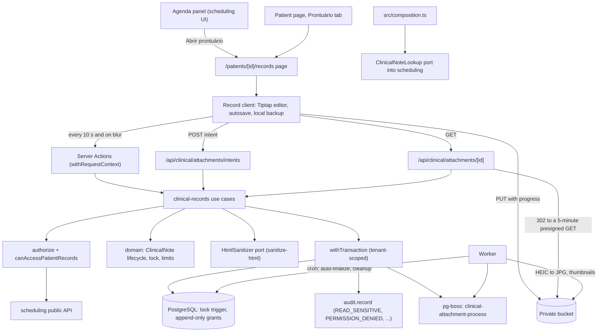

# Technical Specification: F07. Clinical Encounter Records

**Complexity:** complex

## 1. Technical Overview

**What.** A new `clinical-records` module, in the **rich** tier as the architecture defines it (section 3). It has a pure domain with the `ClinicalNote` entity and its lifecycle (draft → finalized → locked), repositories as ports, and Prisma repositories in `infrastructure/`. It covers:
- One clinical note per appointment, written by the appointment's professional when the status is Chegou, Em atendimento or Concluído. It also covers standalone notes ("Registro avulso") for patients the professional has already seen.
- A Tiptap rich text editor (bold, italic, lists, headings). Content is stored as sanitized HTML plus a derived plain text.
- Draft autosave every 10 seconds and on blur, with a browser backup and a 15-second retry when the network fails.
- Finalization. The author can edit for 24 hours from the note's creation through an edit draft. Publishing an edit stores the previous content as a version. After 24 hours the note is locked for good, and a draft that was never finalized is finalized automatically.
- Immutable addenda on locked notes.
- Clinical attachments (PDF, JPG, PNG, HEIC) uploaded straight from the browser to the private bucket through presigned PUT URLs. The worker converts HEIC files to JPG and creates thumbnails. Downloads use 5-minute presigned GET URLs. An attachment can be marked "Anexado por engano".
- Clinical alerts per patient (for example "Alergia a dipirona"), shown as a stamp in the record header.
- The split-screen record page, a "Prontuário" tab on the patient page, "Abrir prontuário" in the agenda panel, and the reminder "Você ainda não finalizou o registro deste atendimento." after Concluído.
- Access limited to professionals who have an appointment with the patient. Every read is audited, and every denial is audited.

**Why.** Clinical notes are the most sensitive data in the product. They must be confidential, they cannot be changed after the fact, and they are kept for 20 years (Law 13.787/2018). Several of the PRD's rules can only be guaranteed in the database, because the application could have a bug:
- the 24-hour lock;
- one note per appointment;
- append-only versions and addenda;
- no deleted files.

So they are enforced by a trigger, a unique index and grants, as well as by the domain. F14 (timeline and LGPD export) reads these tables later.

**How it fits the codebase.** F07 follows the patterns of F01–F06 and F16:
- Use cases call `authorize`, then `parseInput`, then `withTransaction` with `audit.record()` and `publish()`.
- `Result` errors carry stable codes and message keys. The module has catalogs in pt-BR, en and es (ADR-028).
- Optimistic locking uses `version`.
- Ports are registered through `definePort` and `src/composition.ts` (ADR-022).
- pg-boss jobs run in the worker, and uploads that are never used are cleaned up daily (ADR-023 pattern).
- The UI follows the design system "Ink and Paper" (ADR-020).
- Integration tests run on Testcontainers, and journeys run on Playwright.

New in this feature:
- Direct browser uploads to the bucket (ADR-031: CSP `connect-src` and `img-src`, a bucket CORS rule, and `S3_PUBLIC_ENDPOINT`).
- A database trigger that enforces the lock.
- New dependencies: `@tiptap/react`, `@tiptap/pm`, `@tiptap/starter-kit`, `sanitize-html` and `heic-convert`.

### Scope

**Included (whole feature; the PRD has no Core/Full split for F07):**
- Notes linked to an appointment, and standalone notes ("Registro avulso").
- Rich text editor with a limit of 50,000 characters.
- Autosave every 10 seconds and on blur. The draft is visible only to its author. Browser backup and 15-second retry.
- Finalization, the 24-hour edit window with versions, the permanent lock, and auto-finalization of drafts that have expired.
- Addenda of up to 10,000 characters, which cannot be changed.
- Clinical attachments: up to 20 MB each and up to 10 per note, while the note is editable. HEIC is converted to JPG, images get thumbnails, URLs are signed for 5 minutes, and an attachment can be marked "Anexado por engano" within 24 hours.
- Clinical alerts per patient (interview decision; the PRD Experience mentions them, but no feature provided them).
- The record page `/patients/[patientId]/records`, the "Prontuário" tab on the patient page, and the entry points from the agenda panel and the patient page.
- The completion reminder in the agenda panel.
- Integrated from cross-cutting concerns:
  - Authorization through `clinical:read` and `clinical:write` (already in the matrix: Professional and users linked to a professional) and the resource policy `canAccessPatientRecords`.
  - The 403 page and a `PERMISSION_DENIED` audit event for unauthorized access, including URL manipulation.
  - A `READ_SENSITIVE` audit event for every read of a note and for every attachment opened. Clinical text appears in the audit only as "changed" plus character counts.
  - Tenant scoping of every new table.
  - Domain events published inside the transaction.
  - Interface text in the pt-BR, en and es catalogs. Dates go through the formatters, in the time zone of the appointment's unit.
- Documentation:
  - PRD F07 updated in both languages: auto-finalization, clinical alerts, and attachments only while editable.
  - ADR-031 and ADR-032 in both languages.
  - Design system patterns for the record page, the editor, the save status, the attachment area and addenda, in both languages.

**Deferred / not included:**
- Timeline and LGPD export of notes: F14 reads the `clinical_*` tables directly (architecture section 3: `privacy` reads across modules).
- Attachments after the lock. Files that arrive later go to the patient's Documents with a clinical category (F08).
- Note templates, clinical forms, digital signature (ICP-Brasil) and printing a note: not in the PRD.

**Input contracts (Consumes):**
- F06, through new public functions of `scheduling` that do not apply the own-agenda filter, because the clinical policy decides access:
  - `scheduling.getAppointmentForRecord(organizationId, appointmentId)`: patient, professional, service (ID and name), unit (ID and time zone), start instant and status.
  - `scheduling.professionalPatientRelation(organizationId, professionalId, patientId)`: `{ hasAnyAppointment, hasAttendedPastAppointment }`.
  - `scheduling.appointmentsForRecords(organizationId, appointmentIds)`: date, service and professional for the list of notes.
  - `scheduling.registerClinicalNoteLookup(...)`: the port that lets the agenda show the note state.
- F05, through `patients.getPatientIdentity`: display name (social name first) and birth date for the age.
- F04, through `professionals.getProfessionals`: professional display names.
- F01: the request context (`linkedProfessionalId`, locale), user names and the permission matrix.
- F16: locale and formatters.

**Output contracts (Provides):**
- Clinical notes for F14, in the tables `clinical_note`, `clinical_note_version`, `clinical_note_addendum` and `clinical_attachment`:
  - author (user and professional), appointment or standalone flag;
  - creation, finalization and lock instants, and the auto-finalized flag;
  - current sanitized HTML and plain text;
  - versions, addenda, and attachments with their status and the in-error flag.
- Domain events, published inside the transaction: `ClinicalNoteFinalized`, `ClinicalNoteEdited`, `ClinicalNoteAddendumAdded`, `ClinicalAttachmentAdded` and `ClinicalAttachmentMarkedInError`. Payload: note ID, patient ID, appointment ID, professional ID and actor. There are no subscribers yet.
- An implementation of the new scheduling port `ClinicalNoteLookup`, registered in `src/composition.ts`.

### Traceability to the PRD

| PRD block (F07) | Where it is specified |
|---|---|
| Consumes | Scope → input contracts; Section 4 (`directory.ts`) |
| Provides | Scope → output contracts; Section 6 (data model) |
| Capabilities | Section 3 (lifecycle, lock, versions, addenda, attachments, access), Section 5 (actions and routes), Section 6 |
| Experience | Section 4 (record page, editor, attachments, addenda, reminder), Section 5 (UI texts) |
| Error Handling | Section 5 (error codes and pt-BR messages), Section 3 (backup and retry, concurrent tabs) |
| Acceptance criteria (Section 9, F07) | Section 7, acceptance tests |
| Cross-Feature Integration (F06 → F07; F07 → F14) | Section 7, cross-feature tests |

## 2. Architecture Impact

### Affected components

| Area | Path | Role |
|---|---|---|
| Module | `src/modules/clinical-records/` | Domain, use cases, infrastructure, UI, messages and public API (rich tier) |
| Scheduling module | `src/modules/scheduling/index.ts`, `application/provided.ts`, `application/queries.ts`, `application/ports.ts`, `ui/appointment-panel.tsx` | Read functions for F07; `ClinicalNoteLookup` port with an inert default; note state in `AppointmentDetails`; "Abrir prontuário" and the completion reminder |
| Storage | `src/shared/storage/object-storage.ts` | `getRange` (magic bytes), `presignPut` with a signed `Content-Length`, a browser-facing signer that uses `S3_PUBLIC_ENDPOINT` |
| Config | `src/shared/config/env.ts`, `.env.example`, `docker-compose.yml` | Optional `S3_PUBLIC_ENDPOINT` |
| Security headers | `src/proxy.ts` | Storage origin in `connect-src` and `img-src` (ADR-031) |
| Local storage | `docker/seaweedfs/` | CORS rule that allows `PUT` and `GET` from the app origin |
| Jobs | `src/shared/jobs/queues.ts`, `src/worker/index.ts`, `src/worker/jobs/clinical-*.ts` | Attachment processing, auto-finalization, upload cleanup |
| Patients page | `src/app/(app)/patients/[patientId]/page.tsx` | "Prontuário" tab and the "Abrir prontuário" header action, for authorized users only |
| Routes | `src/app/(app)/patients/[patientId]/records/**`, `src/app/api/clinical/**` | Record page, Server Actions, upload intent and attachment download routes |
| Agenda page | `src/app/(app)/schedule/page.tsx` | Passes the record link and the note state to the panel |
| Composition | `src/composition.ts` | `registerCatalog("clinicalRecords", ...)`, `registerClinicalRecordsPorts()` |
| Tenancy | `src/shared/db/tenant.ts`, `tests/integration/helpers.ts` | Register and truncate the new tables |
| Database | `prisma/schema.prisma`, `prisma/migrations/0009_clinical_records/` | Notes, versions, addenda, attachments, upload intents, alerts; lock trigger; grants |
| Documentation | `docs/prd.{en,pt-BR}.md`, `docs/architecture.{en,pt-BR}.md`, `docs/design-system.{en,pt-BR}.md` | PRD clarifications; ADR-031 and ADR-032; record page patterns |

### Data flow



## 3. Technical Decisions

| Decision | Chosen Approach | Alternative Considered | Trade-off |
|---|---|---|---|
| Module tier | Rich. `domain/clinical-note.ts` holds the entity with `saveDraft`, `finalize`, `startEdit`, `saveEditDraft`, `publishEdit`, `discardEdit`, `autoFinalize` and `effectiveState(now)`. Addenda and attachments have their own small domain functions. There are `NoteRepository` and `AttachmentRepository` ports | Simple module with Prisma in `application/` | The architecture names it rich. The lifecycle and time windows are tested without a database. |
| Content format (interview) | Tiptap in the browser. The server sanitizes the HTML with `sanitize-html` against a strict allowlist: `p`, `br`, `strong`, `em`, `h2`, `h3`, `ul`, `ol` and `li`, with no attributes, no styles and no links. A plain text version is derived from the same HTML. The text drives the character count, the 150-character preview and F14. HTML is sanitized again on read before it is rendered | ProseMirror JSON | HTML is simple to show and export. Sanitizing at write and at read keeps stored HTML safe even if the allowlist changes. Sanitizing happens behind an `HtmlSanitizer` port, so the domain stays pure. |
| Length limits | 50,000 characters of plain text per note and 10,000 per addendum (PRD). HTML is also capped at 4× the text limit (200,000 and 40,000 bytes) to block markup inflation | Count HTML characters | The user sees the limit as text length. The byte cap protects the server. |
| One note per appointment | `UNIQUE (appointment_id) WHERE appointment_id IS NOT NULL`. Opening the record for an appointment that already has a note returns that note. A concurrent first save that loses the race (`P2002`) is reloaded and returns `CLINICAL_NOTE_STALE` | Application check only | The PRD invariant holds when two tabs save at the same time. |
| Draft creation | No row exists until the first autosave that has text. The first save creates the note in `DRAFT`, and `created_at` starts the 24-hour clock (interview) | Create on opening the record | Opening and reading does not start the clock or create empty notes. |
| Lock (interview) | `locks_at = created_at + 24 h` is stored. The effective state is `locked` when `now >= locks_at`. A `BEFORE UPDATE` trigger raises `CLINICAL_NOTE_LOCKED` (SQLSTATE `P0001`) when `content_html`, `content_text` or the edit-draft columns change after `locks_at`, or when `locks_at` itself changes | Application check only | The PRD says "locked permanently". The database refuses late edits even if the application has a bug. The job only changes status columns, which the trigger allows. |
| Auto-finalization (interview; changes the PRD) | A pg-boss cron runs every 5 minutes. A `DRAFT` past `locks_at` becomes `FINALIZED` with `auto_finalized = true`. The audit actor is `SYSTEM`, and `ClinicalNoteFinalized` is published. Reads already apply `effectiveState(now)`, so other professionals see the note at 24 hours even before the job runs | The expired draft stays visible only to its author | The encounter record does not stay hidden or editable forever. The flag keeps it clear that the author never clicked "Finalizar registro". |
| Editing a finalized note (interview) | "Editar" copies the current content into an edit draft (`edit_draft_*` columns) that only the author sees, with the same autosave. "Salvar alterações" inserts the replaced content into `clinical_note_version`, makes the draft current, and increments `version`. "Descartar alterações" clears the draft. At the lock, the job clears any pending edit draft and audits that it was discarded | Every autosave writes over the published text | One version per real edit (PRD). Colleagues never see half-written text. |
| Concurrent tabs | Every save sends `version`. A mismatch returns `CLINICAL_NOTE_STALE` with the PRD message, and the server content is not overwritten. The client keeps the text in the local backup so the user can copy it | Last write wins | PRD Error Handling. |
| Autosave transport | A Server Action `saveDraftAction` runs on a 10-second interval when the content changed, on blur, and on `visibilitychange` to hidden. Saves for the same note are queued on the client, one at a time | A Route Handler with `sendBeacon` | It matches the F06 mutation style. Saves one at a time keep `version` consistent. The local backup covers a tab closed in the middle of a save. |
| Browser backup (interview) | A `localStorage` key `gcli.clinical.backup.{userId}.{noteKey}` holds `{ html, savedAt, baseVersion }`. It is written only when a save fails or on `pagehide` with unsaved changes. It is removed when the server confirms the save, on logout (the sign-out flow clears the `gcli.clinical.` prefix), and when the note locks. A failed save shows the PRD banner and retries every 15 seconds and on the `online` event. On opening, a backup newer than the server copy offers "Recuperar texto não enviado" | Mirror every keystroke | Satisfies "kept locally and sent automatically" and keeps as little clinical text as possible on shared computers. |
| Who writes | Creating a note needs `clinical:write` and `ctx.linkedProfessionalId === appointment.professionalId`, with the status in `CHECKED_IN`, `IN_PROGRESS` or `COMPLETED`. Drafts, finalization and edits are only for `author_user_id` | Any professional of the patient | PRD: "created by the appointment's professional (or a user linked to that professional profile)". |
| Standalone notes | `kind = STANDALONE` and `appointment_id` is null. Allowed when the professional has an appointment with the patient in the past (`starts_at < now`) with status `CHECKED_IN`, `IN_PROGRESS` or `COMPLETED`. Labeled "Registro avulso" | Any appointment status | "Past appointment" means one the patient attended. A no-show or a cancellation is not a clinical relationship. |
| Read access | `canAccessPatientRecords(ctx, patientId)`: `clinical:read`, plus a linked professional, plus at least one appointment of that professional with the patient in any status except `CANCELLED` (the same rule as F05 visibility). Readers see every finalized note of the patient, from any professional, and only their own drafts and edit drafts | Only notes written by the same professional | PRD: "visible to other authorized professionals". |
| Denials | A failed policy records `PERMISSION_DENIED` with `entityType` `patient` or `clinical_note` and the route path, then returns `AUTHZ_FORBIDDEN`. Pages call `forbidden()` and routes return 403 | Return 404 | PRD criterion: 403 plus an audit event. |
| Read audit | `READ_SENSITIVE` is recorded for: opening a note (`clinical_note`, ID); the list of previews on the record page (`patient`, metadata `{ noteIds }`); opening a version; and opening an attachment (`clinical_attachment`). Thumbnails are covered by the audited note read that issued their URLs | One event per thumbnail | PRD "every read of a note is audited", without ten events for one screen. |
| Upload (interview; ADR-031) | 1) `POST /api/clinical/attachments/intents` checks the declared type and size, the per-note count and that the note is editable. It creates a `clinical_attachment_upload` row and returns a presigned PUT URL (5 minutes) with signed `Content-Type` and `Content-Length`. 2) The browser sends the `PUT` through `XMLHttpRequest`, which reports progress per file. 3) `confirmAttachmentAction` runs `HEAD` (size ≤ 20 MB), reads the first 16 bytes and checks the magic bytes (`%PDF`, `FF D8 FF`, `89 50 4E 47`, ISO-BMFF `ftyp` with `heic`, `heix`, `mif1` or `msf1`), then creates the attachment and enqueues processing. A mismatch deletes the object and returns `CLINICAL_ATTACHMENT_UNSUPPORTED` | Upload through the app server (ADR-023) | Twenty megabyte files stay out of the web process (architecture 5.6). The cost is the CSP, CORS and public endpoint changes recorded in ADR-031. |
| Object keys | `org/{orgId}/clinical-records/{uuid}`, and `…/{uuid}-thumb.jpg` for the thumbnail. A converted HEIC gets a new JPG key, and the original HEIC is kept in `source_object_key` | Keep only the JPG | Keys have no personal data (architecture 5.6). Files are never deleted (PRD), and the original is evidence. |
| Processing | The `clinical-attachment-process` job is idempotent: it does nothing when the status is not `PROCESSING`. HEIC goes through `heic-convert` (libheif in WASM) to JPG at quality 0.9. Images get a 320-pixel JPG thumbnail through `sharp`. PDFs have no thumbnail and use an icon. After 3 failed attempts the status becomes `FAILED`, and the original stays downloadable | Convert in the request | Architecture 5.5 lists this job. The prebuilt `sharp` binaries cannot decode HEVC. |
| Attachment window (interview) | Attachments can be added only while the note is editable (a draft, or the author within 24 hours). The limit is 10 attachments that are not marked in error. "Anexado por engano" is allowed for the uploader within 24 hours of upload. It sets `marked_in_error_at` and `marked_in_error_by_id`, hides the attachment from the default view ("Mostrar anexos ocultos" shows it), and frees one place in the limit | Attachments on addenda | The note stays faithful to the encounter. Later files belong to F08 Documents. |
| Downloads | `GET /api/clinical/attachments/[id]?variant=original|converted` authorizes, records `READ_SENSITIVE` and redirects (302) to a presigned GET URL valid for 5 minutes, signed with `S3_PUBLIC_ENDPOINT`, with `response-content-disposition` set to `inline` for images and PDFs. Thumbnail URLs are issued inside the note read | Stream through the app | Matches ADR-009. URLs expire in 5 minutes (PRD criterion). |
| Clinical alerts (interview) | One `clinical_alert` row per patient: text of up to 500 characters, edited by any user who passes `canAccessPatientRecords` and has `clinical:write`. Each change appends the previous text to `clinical_alert_change` and is audited (text as counts). The record header shows it as a danger stamp with the text. Alerts are not shown outside the clinical screens | Reuse the F05 tags | Clinical data stays behind the clinical policy, away from Front Desk. |
| Agenda integration | Scheduling declares the port `ClinicalNoteLookup.noteStates(organizationId, appointmentIds) → Map<id, "DRAFT" | "FINALIZED">`. The inert default returns an empty map. `AppointmentDetails` gains `clinicalNote: { state: "NONE" | "DRAFT" | "FINALIZED" } | null`, filled only when `can(ctx, "clinical:read")`. After a `COMPLETED` transition, the panel shows the reminder as a warning alert when the state is not `FINALIZED`. It does not block | Scheduling imports clinical-records | Keeps the module graph acyclic (`scheduling → clinical-records`, ADR-007/022). The note's state, never its content, crosses the boundary. |
| Lock display time zone | Lock and save times are shown in the time zone of the appointment's unit. Standalone notes use the organization time zone | Browser time zone | ADR-019. |
| Domain events | `ClinicalNoteFinalized` (manual or automatic), `ClinicalNoteEdited`, `ClinicalNoteAddendumAdded`, `ClinicalAttachmentAdded` and `ClinicalAttachmentMarkedInError`, published with `uow.publish` | No events | F14 and notifications can subscribe later without changes here. |

### Assumptions

These were decided during this spec rather than by the PRD, and can be overridden:
- **Status of the appointment after the note exists.** If an appointment goes back from `CHECKED_IN` to `CONFIRMED` (undo check-in), an existing note stays and can be finalized. No new note can be created until the status is valid again.
- **Visibility of drafts.** A draft is never shown in another user's list. The author's own draft appears in the list labeled "Rascunho".
- **List of previous notes.** Newest first, 30 per page, with "Carregar mais". The columns are date (the appointment start, or the creation date for standalone notes), professional, service ("Registro avulso" for standalone notes) and the first 150 characters of the plain text. Locked notes show "Bloqueado", and notes with addenda show the addendum count.
- **Versions.** Authorized readers can open "Versões anteriores" on a note, a list of replaced contents with date and author. Each opening is audited. Versions never appear in the main list.
- **Addenda.** Allowed only when the note is locked, by the author or any reader who has `clinical:write`. They are plain rich text with the same allowlist, shown in order of creation below the note.
- **Attachment file names.** The original name is kept, up to 255 characters, cleaned of control characters. It is stored in the database and never used in object keys or logs.
- **Thumbnail size.** 320 pixels on the longest side, JPG, without EXIF metadata.
- **Upload intents.** Intents expire after 24 hours. The daily cleanup job deletes intents that were never confirmed, and their objects. Confirming an intent twice returns the same attachment.
- **Retry of processing.** pg-boss retries 3 times with a 30-second backoff.
- **Auto-finalization cadence.** The cron runs every 5 minutes. Reads apply the effective state, so the delay is never visible.
- **Sign-out cleanup.** The client sign-out handler removes every `localStorage` key with the `gcli.clinical.` prefix.
- **Patient header age.** Computed in the organization time zone, as in F05.
- **Alert editing.** The alert is optional, and an empty text removes it, which is recorded as a change.
- **Messages not given by the PRD.** The pt-BR texts for the attachment limit, standalone note rules, addendum before the lock, version list and alert changes were written in the PRD's tone (Section 5) and can be reviewed.

### Open points
- **PRD update.** Auto-finalization, clinical alerts as an F07 record, and "attachments only while the note is editable" clarify PRD F07. The PRD is updated in both languages in the first stage of the plan.

## 4. Component Overview

### Frontend

| File Path | New/Modified | Purpose | Key Responsibilities |
|---|---|---|---|
| `src/app/(app)/patients/[patientId]/records/page.tsx` | New | Record page | Reads `appointment`, `note` and `standalone` from the URL; calls `getClinicalRecord` and, when needed, `openForAppointment`; `forbidden()` on `AUTHZ_FORBIDDEN`; renders `ClinicalRecordView` |
| `src/app/(app)/patients/[patientId]/records/actions.ts` | New | Server Actions | Save draft, finalize, start, save, publish and discard an edit, add an addendum, confirm and mark attachments, update the alert, load more notes, open a note and its versions |
| `src/app/api/clinical/attachments/intents/route.ts` | New | Upload intent | `POST`; session; returns the presigned PUT |
| `src/app/api/clinical/attachments/[attachmentId]/route.ts` | New | Download | `GET`; authorizes, audits, 302 to the presigned GET |
| `src/app/(app)/patients/[patientId]/page.tsx` | Modified | Patient page | "Prontuário" tab (`ClinicalNotesTable`) and an "Abrir prontuário" header action, only when `canAccessPatientRecords` |
| `src/app/(app)/schedule/page.tsx` | Modified | Agenda | Passes `recordHref(appointment)` and the clinical permission to `AgendaView` |
| `src/modules/scheduling/ui/appointment-panel.tsx` | Modified | Agenda panel | "Abrir prontuário" link for statuses `CHECKED_IN`, `IN_PROGRESS` and `COMPLETED`, or when a note exists; completion reminder alert |
| `src/modules/clinical-records/ui/clinical-record-view.tsx` | New | Split screen | Left column: `RecordHeader` and `NotesList`. Right column: `NoteEditor` or `NoteReader`. Stacks on narrow screens with the editor first |
| `src/modules/clinical-records/ui/record-header.tsx` | New | Patient header | Name (social first), age, alert stamp, "Editar alertas" |
| `src/modules/clinical-records/ui/alert-dialog-form.tsx` | New | Alerts | Textarea of up to 500 characters with a counter |
| `src/modules/clinical-records/ui/notes-list.tsx` | New | Previous notes | Table rows: date, professional, service or "Registro avulso", 150-character preview, stamps (Rascunho, Bloqueado, N adendos); "Carregar mais"; selecting a row opens it on the right |
| `src/modules/clinical-records/ui/note-editor.tsx` | New | Editor | Tiptap with `StarterKit` limited to bold, italic, H2/H3, bullet and ordered lists, history; toolbar with labels and shortcuts; character counter (warning at 90%); "Finalizar registro" (the single primary button) or "Salvar alterações" and "Descartar alterações" in edit mode |
| `src/modules/clinical-records/ui/use-autosave.ts` | New | Autosave hook | 10-second interval, blur, `visibilitychange`, a one-at-a-time queue, retry every 15 seconds and on `online`, the backup in `localStorage`, recovery prompt |
| `src/modules/clinical-records/ui/local-backup.ts` | New | Backup | Read, write and clear keyed entries; `clearClinicalBackups()` for sign-out |
| `src/modules/clinical-records/ui/save-status.tsx` | New | Status line | "Rascunho salvo às 14:32", "Finalizado — editável até 29/09 14:10", "Bloqueado", plus the offline banner and the stale banner |
| `src/modules/clinical-records/ui/note-reader.tsx` | New | Read-only view | Sanitized HTML in the reading column (72 characters), lock message, addenda, "Adicionar adendo", "Versões anteriores" |
| `src/modules/clinical-records/ui/addendum-form.tsx` | New | Addendum | Small editor of up to 10,000 characters; "Adicionar adendo" |
| `src/modules/clinical-records/ui/versions-dialog.tsx` | New | Versions | List of versions; selecting one shows its content |
| `src/modules/clinical-records/ui/attachments-area.tsx` | New | Attachments | Drop zone plus a file button, client checks (type, 20 MB, the 10-file limit) with the PRD message, per-file progress through XHR, thumbnails, "Processando", "Anexado por engano", "Mostrar anexos ocultos" |
| `src/modules/clinical-records/ui/clinical-notes-table.tsx` | New | Patient tab | Paginated notes with links to the record page |
| `src/app/(app)/actions.ts` or the sign-out client | Modified | Sign-out | Calls `clearClinicalBackups()` before signing out |

### Backend

| File Path | New/Modified | Purpose | Key Responsibilities |
|---|---|---|---|
| `src/modules/clinical-records/domain/limits.ts` | New | Constants | 50,000 and 10,000 characters, HTML byte caps, 24-hour lock, 10-second autosave, 15-second retry, 20 MB, 10 attachments, 300-second URLs, 24-hour in-error window, 150-character preview, 500-character alert, 30 per page (PRD references) |
| `src/modules/clinical-records/domain/clinical-note.ts` | New | Entity | Lifecycle methods returning `Result` and pending version rows; `effectiveState(now)`; `canEdit(userId, now)` |
| `src/modules/clinical-records/domain/addendum.ts` | New | Addendum rules | Allowed only when locked; length |
| `src/modules/clinical-records/domain/attachment.ts` | New | Attachment rules | Allowed types, magic-byte detection, the count limit, the in-error window, status transitions |
| `src/modules/clinical-records/domain/eligibility.ts` | New | Note creation rules | Valid appointment statuses; professional match; standalone eligibility |
| `src/modules/clinical-records/domain/errors.ts`, `events.ts` | New | Errors and events | Error factories with message keys; event names and payloads |
| `src/modules/clinical-records/application/ports.ts` | New | Ports | `NoteRepository`, `AttachmentRepository`, `AlertRepository`, `HtmlSanitizer`, `AttachmentStorage`, `JobQueue`, `ClinicalDirectory` (scheduling, patients, professionals, user names, time zones), `ClinicalRecordsDeps` |
| `src/modules/clinical-records/application/schemas.ts` | New | Validation | Zod schemas for every action and route |
| `src/modules/clinical-records/application/policies.ts` | New | Policy | `canAccessPatientRecords`, `requireRecordAccess` (records the denial), `canWriteForAppointment` |
| `src/modules/clinical-records/application/notes.ts` | New | Use cases | `OpenForAppointment`, `SaveDraft`, `FinalizeNote`, `StartEdit`, `SaveEditDraft`, `PublishEdit`, `DiscardEdit` |
| `src/modules/clinical-records/application/addenda.ts` | New | Use case | `AddAddendum` |
| `src/modules/clinical-records/application/attachments.ts` | New | Use cases | `CreateUploadIntent`, `ConfirmAttachment`, `MarkAttachmentInError`, `OpenAttachment`; `ProcessAttachment` for the worker |
| `src/modules/clinical-records/application/alerts.ts` | New | Use case | `UpdateClinicalAlert` |
| `src/modules/clinical-records/application/queries.ts` | New | Reads | `getClinicalRecord` (header and first page of notes, audited), `listNotes` (pages), `getNote` (content, addenda, attachments with thumbnail URLs, audited), `listVersions` and `getVersion` (audited), `listPatientNotes` (patient tab) |
| `src/modules/clinical-records/application/maintenance.ts` | New | System use cases | `AutoFinalizeExpiredDrafts`, `CleanupUploadIntents` |
| `src/modules/clinical-records/application/provided.ts` | New | Port implementation | `ClinicalNoteLookup` for scheduling |
| `src/modules/clinical-records/infrastructure/prisma-note-repository.ts` | New | Repository | Load and save with the version check; map `P0001 CLINICAL_NOTE_LOCKED` and `P2002` |
| `src/modules/clinical-records/infrastructure/prisma-attachment-repository.ts`, `prisma-alert-repository.ts` | New | Repositories | Attachments, intents, alerts and their history |
| `src/modules/clinical-records/infrastructure/html-sanitizer.ts` | New | Adapter | `sanitize-html` allowlist; HTML to plain text |
| `src/modules/clinical-records/infrastructure/attachment-storage.ts` | New | Adapter | Presigned PUT and GET (public endpoint), `head`, `getRange`, `put`, `get` |
| `src/modules/clinical-records/infrastructure/image-processor.ts` | New | Adapter | `heic-convert` for HEIC to JPG; `sharp` thumbnails without EXIF |
| `src/modules/clinical-records/infrastructure/directory.ts` | New | Adapter | `ClinicalDirectory` over the public APIs of scheduling, patients, professionals and identity |
| `src/modules/clinical-records/messages/{pt-BR,en,es}.json`, `catalog.ts` | New | Catalogs | Every error and UI text in three languages |
| `src/modules/clinical-records/index.ts` | New | Public API | Use cases bound to deps, `registerClinicalRecordsPorts`, `clinicalRecordsCatalog`, UI exports, event names |
| `src/modules/clinical-records/client.ts` | New | Client entry (ADR-027) | `clearClinicalBackups` and client components without server imports |
| `src/modules/scheduling/application/provided.ts`, `index.ts` | Modified | F07 reads and port | `getAppointmentForRecord`, `professionalPatientRelation`, `appointmentsForRecords`, `registerClinicalNoteLookup` |
| `src/modules/scheduling/application/queries.ts` | Modified | Details | `clinicalNote` state in `AppointmentDetails` |
| `src/shared/storage/object-storage.ts` | Modified | Storage | `getRange(key, bytes)`; `presignPut(key, contentType, contentLength, ttl)`; `presignGet` options (`publicEndpoint`, `contentDisposition`) |
| `src/shared/config/env.ts` | Modified | Config | Optional `S3_PUBLIC_ENDPOINT`, defaulting to `S3_ENDPOINT` |
| `src/proxy.ts` | Modified | CSP | Storage origin added to `connect-src` and `img-src` |
| `src/shared/jobs/queues.ts`, `src/worker/index.ts` | Modified | Jobs | `clinical-attachment-process`, `clinical-notes-auto-finalize` (every 5 minutes), `clinical-uploads-cleanup` (daily at 04:00) |
| `src/worker/jobs/clinical-records.ts` | New | Job handlers | Thin handlers that call the maintenance and processing use cases with a `SystemContext` |
| `src/composition.ts` | Modified | Wiring | Catalog and ports |
| `src/shared/db/tenant.ts`, `tests/integration/helpers.ts` | Modified | Tenancy | Register and truncate the new tables |
| `docker/seaweedfs/` and `docker-compose.yml` | Modified | Local storage | CORS configuration; `S3_PUBLIC_ENDPOINT=http://localhost:8333` for the app container |

### Database

| Migration File | Tables Affected | Operation | Notes |
|---|---|---|---|
| `prisma/migrations/0009_clinical_records/migration.sql` | `clinical_note`, `clinical_note_version`, `clinical_note_addendum`, `clinical_attachment`, `clinical_attachment_upload`, `clinical_alert`, `clinical_alert_change` | CREATE, TRIGGER, GRANT | Generated by Prisma, plus hand-written CHECKs, the partial unique index, the lock trigger and the grants (no `DELETE` on clinical data; append-only history) |

## 5. API Contracts

All actions return the F01 `ActionResult` envelope. Routes return JSON with HTTP status codes, except the download route, which redirects.

Permissions:
- `clinical:read`: Professional, and any user linked to a professional profile. Every read also passes `canAccessPatientRecords`.
- `clinical:write`: the same roles. Writing also passes the per-action rules in Section 3.
- Front Desk, and Administrator or Manager users without a link, have neither permission. They get 403, and a `PERMISSION_DENIED` event is recorded.

### Error codes

| Code | HTTP Status | pt-BR message |
|---|---|---|
| `CLINICAL_NOTE_NOT_FOUND` | 404 | "Registro clínico não encontrado." |
| `CLINICAL_APPOINTMENT_STATUS_INVALID` | 409 | "O registro só pode ser criado quando o paciente chegou, está em atendimento ou o atendimento foi concluído." |
| `CLINICAL_NOT_APPOINTMENT_PROFESSIONAL` | 403 | "Somente o profissional do atendimento pode escrever este registro." |
| `CLINICAL_STANDALONE_NOT_ALLOWED` | 409 | "Registros avulsos são permitidos apenas para pacientes que você já atendeu." |
| `CLINICAL_NOT_AUTHOR` | 403 | "Somente o autor pode alterar este registro." |
| `CLINICAL_NOTE_TOO_LONG` | 400 | "O registro pode ter no máximo 50.000 caracteres." |
| `CLINICAL_NOTE_EMPTY` | 400 | "Escreva o registro antes de finalizar." |
| `CLINICAL_NOTE_LOCKED` | 409 | "Este registro foi bloqueado em {date} às {time}. Utilize um adendo para complementar." |
| `CLINICAL_NOTE_STALE` | 409 | "Este registro foi alterado em outra janela. Recarregue para ver a versão mais recente." |
| `CLINICAL_NOTE_NOT_FINALIZED` | 409 | "Finalize o registro antes de editá-lo." |
| `CLINICAL_NO_EDIT_IN_PROGRESS` | 409 | "Não há alterações em andamento neste registro." |
| `CLINICAL_ADDENDUM_BEFORE_LOCK` | 409 | "Adendos podem ser adicionados após o bloqueio do registro." |
| `CLINICAL_ADDENDUM_TOO_LONG` | 400 | "O adendo pode ter no máximo 10.000 caracteres." |
| `CLINICAL_ATTACHMENT_UNSUPPORTED` | 400 | "Arquivo não suportado. Envie PDF, JPG, PNG ou HEIC de até 20 MB." |
| `CLINICAL_ATTACHMENT_LIMIT` | 409 | "Este registro já tem 10 anexos. Marque um anexo como enviado por engano para liberar espaço." |
| `CLINICAL_ATTACHMENTS_CLOSED` | 409 | "Anexos só podem ser adicionados enquanto o registro pode ser editado." |
| `CLINICAL_UPLOAD_NOT_FOUND` | 404 | "O envio do arquivo não foi concluído. Tente enviar novamente." |
| `CLINICAL_ATTACHMENT_ERROR_WINDOW_EXPIRED` | 409 | "O prazo de 24 horas para marcar este anexo como enviado por engano terminou." |
| `CLINICAL_ALERT_TOO_LONG` | 400 | "Os alertas podem ter no máximo 500 caracteres." |
| `VALIDATION_FAILED`, `AUTHZ_FORBIDDEN`, `AUTH_UNAUTHENTICATED` | — | As in F01 |

Other texts in the catalogs:
- Status line: "Rascunho salvo às {time}", "Salvando…", "Finalizado — editável até {date} {time}", "Bloqueado", "Finalizado automaticamente".
- Autosave failure banner (PRD): "Não foi possível salvar o rascunho. Suas alterações estão guardadas neste navegador e serão enviadas quando a conexão voltar."
- Recovery prompt: "Há um texto deste registro que não foi enviado. Recuperar texto não enviado?"
- Reminder (PRD): "Você ainda não finalizou o registro deste atendimento."
- Labels: "Abrir prontuário", "Prontuário", "Registro avulso", "Novo registro avulso", "Finalizar registro", "Editar", "Salvar alterações", "Descartar alterações", "Adicionar adendo", "Adendo de {author} em {date} {time}", "Versões anteriores", "Anexos", "Arraste arquivos ou escolha", "Processando", "Anexado por engano", "Mostrar anexos ocultos", "Alertas clínicos", "Editar alertas", "Rascunho", "{count} adendos", "Carregar mais".
- Toasts: "Registro finalizado", "Alterações salvas", "Adendo adicionado", "Anexo marcado como enviado por engano", "Alertas atualizados".

### Action: Save draft (autosave)
- **Action:** `saveDraftAction` → `SaveDraft`
- **Permission:** `clinical:write`. To create a note, the user must be the appointment's professional with a valid status, or meet the standalone rule. Later saves are for the author only.

| Field | Type | Required | Validation | Description |
|---|---|---|---|---|
| `noteId` | `uuid` | No | the author's own `DRAFT` note | Absent on the first save |
| `appointmentId` | `uuid` | First save of an encounter note | valid status, professional match | Appointment |
| `patientId` | `uuid` | First save of a standalone note | standalone rule | Patient |
| `html` | `string` | Yes | ≤ 200,000 bytes; ≤ 50,000 text characters after sanitizing | Editor HTML |
| `version` | `integer` | When `noteId` is set | current version | Optimistic lock |

```json
{
  "noteId": "0193a1b2-0000-7000-8000-00000000c001",
  "html": "<h2>Queixa principal</h2><p>Dor lombar há <strong>3 semanas</strong>.</p><ul><li>Piora ao sentar</li></ul>",
  "version": 4
}
```

Response:

```json
{
  "ok": true,
  "data": {
    "noteId": "0193a1b2-0000-7000-8000-00000000c001",
    "version": 5,
    "savedAt": "2026-10-06T17:32:10.000Z",
    "locksAt": "2026-10-07T17:10:00.000Z",
    "characters": 58
  }
}
```

- **Errors:** `CLINICAL_NOTE_STALE` (a version mismatch, or a race on the first save of the appointment), `CLINICAL_NOTE_LOCKED`, `CLINICAL_NOTE_TOO_LONG`, `CLINICAL_APPOINTMENT_STATUS_INVALID`, `CLINICAL_NOT_APPOINTMENT_PROFESSIONAL`, `CLINICAL_STANDALONE_NOT_ALLOWED` and `CLINICAL_NOT_AUTHOR`.
- **Audit:** `CREATE` on `clinical_note` for the first save. Later saves record `UPDATE` with `changes: { content: { changed: true, beforeLength, afterLength } }`, at most once per minute for each note and author. The audit row carries `metadata.autosaveCount`, so the log does not get one row every 10 seconds.
- **Events:** none (drafts are private).

### Action: Finalize note
- **Action:** `finalizeNoteAction` → `FinalizeNote`
- **Request:** `{ "noteId": "<uuid>", "version": 5, "html": "<p>…</p>" }`. The final content is saved and finalized in one step.
- **Response:** `{ "ok": true, "data": { "status": "FINALIZED", "finalizedAt": "2026-10-06T17:40:00.000Z", "locksAt": "2026-10-07T17:10:00.000Z", "version": 6 } }`
- **Errors:** `CLINICAL_NOTE_EMPTY`, `CLINICAL_NOTE_LOCKED`, `CLINICAL_NOTE_STALE` and `CLINICAL_NOT_AUTHOR`.
- **Audit:** `UPDATE` with the status change.
- **Event:** `ClinicalNoteFinalized` with `{ automatic: false }`.

### Actions: Edit a finalized note
- **`startEditAction({ noteId, version })`:** copies the current content into the edit draft. It returns the draft and `version`. Errors: `CLINICAL_NOTE_NOT_FINALIZED`, `CLINICAL_NOTE_LOCKED` and `CLINICAL_NOT_AUTHOR`. An existing edit draft is returned unchanged, so the action is idempotent.
- **`saveEditDraftAction({ noteId, version, html })`:** autosaves the edit draft. It has the same limits and errors as `SaveDraft`, plus `CLINICAL_NO_EDIT_IN_PROGRESS`.
- **`publishEditAction({ noteId, version, html })`:**
  - Inserts `clinical_note_version` with the replaced content, makes the draft current and clears the edit draft.
  - Response: `{ "version": 9, "versionNumber": 2, "publishedAt": "…" }`.
  - Audit: `UPDATE` with the content counts.
  - Event: `ClinicalNoteEdited`.
- **`discardEditAction({ noteId, version })`:** clears the edit draft. Audit: `UPDATE` with metadata `{ editDiscarded: true }`.

### Action: Add addendum
- **Action:** `addAddendumAction` → `AddAddendum`
- **Request:** `{ "noteId": "<uuid>", "html": "<p>Resultado do raio-X recebido: sem alterações.</p>" }`
- **Response:** `{ "ok": true, "data": { "addendumId": "<uuid>", "createdAt": "2026-10-09T13:05:00.000Z", "authorName": "Dra. Ana Lima" } }`
- **Errors:** `CLINICAL_ADDENDUM_BEFORE_LOCK`, `CLINICAL_ADDENDUM_TOO_LONG` and `AUTHZ_FORBIDDEN`.
- **Audit:** `CREATE` on `clinical_note_addendum` (length only).
- **Event:** `ClinicalNoteAddendumAdded`.

### Route: POST `/api/clinical/attachments/intents`
- **Authentication:** session; `clinical:write`; the user is the author and the note is editable.

| Field | Type | Required | Validation | Description |
|---|---|---|---|---|
| `noteId` | `uuid` | Yes | the author's editable note | Note |
| `fileName` | `string` | Yes | 1–255 characters | Original name |
| `contentType` | `string` | Yes | `application/pdf`, `image/jpeg`, `image/png`, `image/heic` or `image/heif` | Declared type |
| `size` | `integer` | Yes | 1 – 20,971,520 | Bytes |

```json
{ "noteId": "0193a1b2-0000-7000-8000-00000000c001", "fileName": "raio-x-lombar.heic", "contentType": "image/heic", "size": 3481220 }
```

Response **201**:

```json
{
  "uploadId": "0193a1b2-0000-7000-8000-00000000u001",
  "url": "http://localhost:8333/gcli-local/org/…/clinical-records/0193a1b2-…?X-Amz-Signature=…",
  "method": "PUT",
  "headers": { "Content-Type": "image/heic" },
  "expiresAt": "2026-10-06T17:37:10.000Z"
}
```

- **Errors:**
  - **400** `CLINICAL_ATTACHMENT_UNSUPPORTED`.
  - **409** `CLINICAL_ATTACHMENT_LIMIT` or `CLINICAL_ATTACHMENTS_CLOSED`.
  - **401** without a session.
  - **403** `AUTHZ_FORBIDDEN`, which is audited.
- The intent alone is not audited, because nothing clinical is stored yet.

### Action: Confirm attachment
- **Action:** `confirmAttachmentAction({ uploadId })` → `ConfirmAttachment`
- **Behavior:**
  - Runs `HEAD` and checks that the size is at most 20 MB.
  - Reads 16 bytes and detects the type from them. A mismatch with the allowlist deletes the object and returns `CLINICAL_ATTACHMENT_UNSUPPORTED`.
  - Checks the count again inside the transaction.
  - Creates `clinical_attachment`: `READY` for a PDF, `PROCESSING` for an image.
  - Marks the intent as consumed and enqueues `clinical-attachment-process` in the same transaction.
- **Response:** `{ "attachmentId": "<uuid>", "status": "PROCESSING", "fileName": "raio-x-lombar.heic", "contentType": "image/heic", "size": 3481220 }`
- **Errors:** `CLINICAL_UPLOAD_NOT_FOUND` (missing object or expired intent), `CLINICAL_ATTACHMENT_UNSUPPORTED`, `CLINICAL_ATTACHMENT_LIMIT` and `CLINICAL_ATTACHMENTS_CLOSED`.
- **Audit:** `CREATE` on `clinical_attachment`, with metadata `{ contentType, size }` and no file name.
- **Event:** `ClinicalAttachmentAdded`.

### Action: Mark attachment in error
- **Action:** `markAttachmentInErrorAction({ attachmentId })`
- **Rules:** only the uploader, and only within 24 hours of `created_at`.
- **Errors:** `CLINICAL_ATTACHMENT_ERROR_WINDOW_EXPIRED` and `CLINICAL_NOT_AUTHOR`.
- **Audit:** `UPDATE`.
- **Event:** `ClinicalAttachmentMarkedInError`.

### Route: GET `/api/clinical/attachments/[attachmentId]`
- **Query:** `variant` = `original` or `converted` (the default is the converted JPG when it exists).
- **Authentication:** session; `clinical:read` plus `canAccessPatientRecords` for the attachment's patient. An attachment of another user's draft is refused.
- **Response:** **302** `Location` to a presigned GET that expires in 300 seconds, with `Cache-Control: no-store`.
- **Errors:**
  - **401** without a session.
  - **403**, with `PERMISSION_DENIED` audited (Front Desk, or a professional without an appointment with the patient).
  - **404** when the attachment does not exist.
- **Audit:** `READ_SENSITIVE` on `clinical_attachment`, with metadata `{ variant }`.

### Action: Update clinical alert
- **Action:** `updateClinicalAlertAction({ patientId, text, version })`
- **Validation:** `text` has 0–500 characters, and an empty text clears the alert.
- **Errors:** `CLINICAL_ALERT_TOO_LONG` and `CLINICAL_NOTE_STALE` (an alert version mismatch reuses the same message).
- **Audit:** `UPDATE` (or `CREATE`) on `clinical_alert`, with counts. The previous text is kept in `clinical_alert_change`.

### Reads (Server Components and actions)

**`getClinicalRecord(ctx, patientId, { appointmentId?, noteId? })`**
- Returns the header `{ displayName, age, alert: { text, version } | null }`.
- Returns the first page of `notes`: `{ id, kind, date, professionalName, serviceName, preview, state, addendaCount, isOwnDraft }`.
- Returns `current`, the note to open: the appointment's note, the note requested by `noteId`, or `{ kind: "NEW", appointmentId }` / `{ kind: "NEW_STANDALONE" }`.
- Returns `permissions`: `canWriteHere`, `canAddStandalone` and `canEditAlert`.
- Audit: one `READ_SENSITIVE` for the patient, with the IDs of the listed notes, plus one for `current` when it is an existing note.

**`getNote(ctx, noteId)`**

```json
{
  "id": "0193a1b2-0000-7000-8000-00000000c001",
  "kind": "ENCOUNTER",
  "appointment": { "id": "0192f0b2-…", "startsAt": "2026-10-06T17:00:00.000Z", "serviceName": "Fisioterapia", "unitTimeZone": "America/Sao_Paulo" },
  "author": { "userId": "…", "professionalName": "Dra. Ana Lima" },
  "state": "FINALIZED",
  "autoFinalized": false,
  "html": "<h2>Queixa principal</h2><p>…</p>",
  "editDraft": null,
  "createdAt": "2026-10-06T17:10:00.000Z",
  "finalizedAt": "2026-10-06T17:40:00.000Z",
  "locksAt": "2026-10-07T17:10:00.000Z",
  "versionCount": 1,
  "addenda": [ { "id": "…", "authorName": "Dr. Paulo Reis", "createdAt": "2026-10-09T13:05:00.000Z", "html": "<p>…</p>" } ],
  "attachments": [ { "id": "…", "fileName": "raio-x-lombar.heic", "contentType": "image/jpeg", "status": "READY", "thumbnailUrl": "http://localhost:8333/…?X-Amz-Expires=300…", "inError": false, "createdAt": "…", "canMarkInError": true } ],
  "version": 6
}
```

- `state` takes one of these values: `DRAFT`, `FINALIZED` (editable) or `LOCKED`.
- `editDraft` is returned only to the author.

**`listVersions(ctx, noteId)` and `getVersion(ctx, versionId)`**
- The versions list contains `{ versionNumber, replacedAt, replacedByName, characters }`, and `getVersion` returns the content.
- `getVersion` is audited.

**`listPatientNotes(ctx, patientId, page)`**
- Data for the patient tab: the same list as the record page.
- Audited as one patient read.

### Public module API (Provides)

| Function | Consumers | Returns |
|---|---|---|
| `clinicalRecords.getClinicalRecord`, `getNote`, `listPatientNotes`, `canAccessPatientRecords` | Routes | As above |
| `clinicalRecords.saveDraft`, `finalizeNote`, `startEdit`, `saveEditDraft`, `publishEdit`, `discardEdit`, `addAddendum`, `createUploadIntent`, `confirmAttachment`, `markAttachmentInError`, `openAttachment`, `updateClinicalAlert`, `listVersions`, `getVersion` | Routes | `Result` |
| `clinicalRecords.processAttachment`, `autoFinalizeExpiredDrafts`, `cleanupUploadIntents` | Worker | Counts |
| `registerClinicalRecordsPorts()` | `src/composition.ts` | Registers `ClinicalNoteLookup` in scheduling |
| `CLINICAL_RECORDS_EVENTS` | F14 later | Event names and payload type |
| `ClinicalRecordView`, `ClinicalNotesTable`, `clinicalRecordsCatalog` | Routes, composition | UI and messages |

New scheduling functions (Consumes):

| Function | Returns |
|---|---|
| `scheduling.getAppointmentForRecord(organizationId, appointmentId)` | `{ id, patientId, professionalId, serviceId, serviceName, unitId, unitTimeZone, startsAt, status } \| null` |
| `scheduling.professionalPatientRelation(organizationId, professionalId, patientId, now)` | `{ hasAnyAppointment, hasAttendedPastAppointment }` |
| `scheduling.appointmentsForRecords(organizationId, appointmentIds)` | `Map<id, { startsAt, serviceName, professionalId, unitTimeZone }>` |
| `scheduling.registerClinicalNoteLookup(impl \| null)` | Registers the port (ADR-022) |

These functions take `organizationId` instead of `ctx` and are not filtered by the own-agenda policy. They are meant for module policies, like the F02–F05 ports. They select by `organization_id` explicitly.

## 6. Data Model

All tables have:
- `id uuid` (UUIDv7 from the application);
- `organization_id uuid NOT NULL` (FK `organization`);
- `created_at timestamptz`.

The exceptions are noted per table. Every table is registered in the tenant model registry and in the test reset helper. No table in this migration grants `DELETE` to `gcli_app`.

### Table: `clinical_note`

| Column | Type | Nullable | Default | Description |
|---|---|---|---|---|
| `patient_id` | `uuid` | No | — | FK `patient(id)` |
| `appointment_id` | `uuid` | Yes | — | FK `appointment(id)`; null for standalone notes |
| `kind` | `varchar(12)` | No | — | `ENCOUNTER`, `STANDALONE` |
| `professional_id` | `uuid` | No | — | FK `professional(id)`, the author's professional profile |
| `author_user_id` | `uuid` | No | — | FK `user(id)` |
| `status` | `varchar(10)` | No | `'DRAFT'` | `DRAFT`, `FINALIZED` (locked is derived from `locks_at`) |
| `content_html` | `text` | No | — | Sanitized HTML |
| `content_text` | `text` | No | — | Derived plain text |
| `characters` | `integer` | No | — | Length of `content_text` |
| `draft_saved_at` | `timestamptz` | No | `now()` | Last autosave of the draft or the edit draft |
| `locks_at` | `timestamptz` | No | — | `created_at + 24 h` |
| `finalized_at` | `timestamptz` | Yes | — | Finalization instant |
| `finalized_by_id` | `uuid` | Yes | — | The author, or null when automatic |
| `auto_finalized` | `boolean` | No | `false` | Finalized by the job |
| `edit_draft_html`, `edit_draft_text` | `text` | Yes | — | Pending edit of a finalized note |
| `edit_draft_characters` | `integer` | Yes | — | Length of the edit draft |
| `edit_started_at` | `timestamptz` | Yes | — | When "Editar" was used |
| `version` | `integer` | No | `1` | Optimistic lock |
| `updated_at` | `timestamptz` | No | `now()` | Last change |

**Indexes and constraints:**

| Name | Type | Definition | Purpose |
|---|---|---|---|
| `uq_clinical_note_appointment` | UNIQUE (partial) | `(appointment_id)` WHERE `appointment_id IS NOT NULL` | PRD: one note per appointment |
| `ix_clinical_note_org_patient_created` | btree | `(organization_id, patient_id, created_at DESC)` | Notes list |
| `ix_clinical_note_drafts_lock` | btree (partial) | `(locks_at)` WHERE `status = 'DRAFT' OR edit_draft_html IS NOT NULL` | Auto-finalization job |
| `ck_clinical_note_kind` | CHECK | `(kind = 'ENCOUNTER') = (appointment_id IS NOT NULL)` | Consistent link |
| `ck_clinical_note_status` | CHECK | value list | Valid status |
| `ck_clinical_note_lock` | CHECK | `locks_at = created_at + interval '24 hours'` | PRD: 24 hours after creation |
| `ck_clinical_note_length` | CHECK | `characters <= 50000 AND (edit_draft_characters IS NULL OR edit_draft_characters <= 50000)` | PRD limit |
| `ck_clinical_note_finalized` | CHECK | `(status = 'FINALIZED') = (finalized_at IS NOT NULL)` | Consistent finalization |
| `ck_clinical_note_edit_draft` | CHECK | `edit_draft_html IS NULL OR status = 'FINALIZED'` | Edit drafts only exist on finalized notes |
| `trg_clinical_note_lock` | TRIGGER | `BEFORE UPDATE`, see the excerpt below | PRD: locked permanently after 24 hours |

### Table: `clinical_note_version` (append-only)

| Column | Type | Nullable | Default | Description |
|---|---|---|---|---|
| `note_id` | `uuid` | No | — | FK `clinical_note(id)` |
| `version_number` | `smallint` | No | — | 1, 2, … per note |
| `content_html`, `content_text` | `text` | No | — | Content that was replaced |
| `characters` | `integer` | No | — | Length |
| `replaced_at` | `timestamptz` | No | `now()` | When the edit was published |
| `replaced_by_id` | `uuid` | No | — | Author of the edit |

The table has no `created_at`, because `replaced_at` serves that purpose. It has `UNIQUE (note_id, version_number)`. The runtime role gets `SELECT, INSERT` only.

### Table: `clinical_note_addendum` (append-only)

| Column | Type | Nullable | Default | Description |
|---|---|---|---|---|
| `note_id` | `uuid` | No | — | FK `clinical_note(id)` |
| `author_user_id` | `uuid` | No | — | Author |
| `professional_id` | `uuid` | No | — | Author's professional profile |
| `content_html`, `content_text` | `text` | No | — | Sanitized content |
| `characters` | `integer` | No | — | ≤ 10,000 (`ck_addendum_length`) |

Index `ix_addendum_note` on `(note_id, created_at)`. The runtime role gets `SELECT, INSERT` only.

### Table: `clinical_attachment`

| Column | Type | Nullable | Default | Description |
|---|---|---|---|---|
| `note_id` | `uuid` | No | — | FK `clinical_note(id)` |
| `uploaded_by_id` | `uuid` | No | — | Uploader |
| `file_name` | `varchar(255)` | No | — | Original name |
| `source_content_type` | `varchar(20)` | No | — | Detected type of the upload |
| `source_object_key` | `varchar(200)` | No | — | Uploaded object (kept, including the HEIC original) |
| `object_key` | `varchar(200)` | Yes | — | Served object (the JPG for HEIC; equal to the source for the others) |
| `content_type` | `varchar(20)` | Yes | — | Served type |
| `thumbnail_key` | `varchar(200)` | Yes | — | Image thumbnail |
| `size_bytes` | `integer` | No | — | ≤ 20,971,520 |
| `status` | `varchar(10)` | No | — | `PROCESSING`, `READY`, `FAILED` |
| `marked_in_error_at` | `timestamptz` | Yes | — | "Anexado por engano" |
| `marked_in_error_by_id` | `uuid` | Yes | — | Who marked it |
| `updated_at` | `timestamptz` | No | `now()` | Processing updates |

Indexes and constraints:
- `ix_attachment_note`: `(note_id, created_at)`.
- `ck_attachment_size`: `size_bytes BETWEEN 1 AND 20971520`.
- `ck_attachment_status`: value list.
- `ck_attachment_in_error`: `(marked_in_error_at IS NULL) = (marked_in_error_by_id IS NULL)`.

The runtime role gets `SELECT, INSERT, UPDATE` only. The PRD limit of 10 attachments that are not in error is checked inside the transaction after `SELECT … FOR UPDATE` on the note row, so two parallel confirmations cannot both pass.

### Table: `clinical_attachment_upload`

| Column | Type | Nullable | Default | Description |
|---|---|---|---|---|
| `note_id` | `uuid` | No | — | Target note |
| `user_id` | `uuid` | No | — | Uploader |
| `object_key` | `varchar(200)` | No | — | Presigned key |
| `file_name` | `varchar(255)` | No | — | Declared name |
| `declared_content_type` | `varchar(20)` | No | — | Declared type |
| `declared_size` | `integer` | No | — | Declared size |
| `expires_at` | `timestamptz` | No | — | Creation + 24 h |
| `consumed_at` | `timestamptz` | Yes | — | Confirmation |
| `attachment_id` | `uuid` | Yes | — | Resulting attachment (idempotent confirmation) |

This table holds technical rows, not clinical records. The cleanup job deletes rows where `consumed_at IS NULL AND expires_at < now()`, so it is the only table in this migration that keeps `DELETE` for `gcli_app`. Consumed intents are never deleted. Index `ix_upload_cleanup` on `(expires_at)` WHERE `consumed_at IS NULL`.

### Table: `clinical_alert`

| Column | Type | Nullable | Default | Description |
|---|---|---|---|---|
| `patient_id` | `uuid` | No | — | FK `patient(id)`, `UNIQUE (organization_id, patient_id)` |
| `text` | `varchar(500)` | No | — | Alert text (an empty text is stored as `''`) |
| `version` | `integer` | No | `1` | Optimistic lock |
| `updated_at` | `timestamptz` | No | `now()` | Last change |
| `updated_by_id` | `uuid` | No | — | Last editor |

### Table: `clinical_alert_change` (append-only)

| Column | Type | Nullable | Default | Description |
|---|---|---|---|---|
| `alert_id` | `uuid` | No | — | FK `clinical_alert(id)` |
| `previous_text` | `varchar(500)` | No | — | Text before the change |
| `changed_by_id` | `uuid` | No | — | Editor |

### Migration excerpt (hand-written parts)

```sql
CREATE UNIQUE INDEX uq_clinical_note_appointment ON clinical_note (appointment_id)
  WHERE appointment_id IS NOT NULL;
ALTER TABLE clinical_note ADD CONSTRAINT ck_clinical_note_lock
  CHECK (locks_at = created_at + interval '24 hours');
ALTER TABLE clinical_note ADD CONSTRAINT ck_clinical_note_kind
  CHECK ((kind = 'ENCOUNTER') = (appointment_id IS NOT NULL));

-- PRD F07: after 24 hours the note is locked permanently. Status columns may still change
-- (auto-finalization, discarding a pending edit), content may not.
CREATE FUNCTION clinical_note_enforce_lock() RETURNS trigger AS $$
BEGIN
  IF NEW.locks_at IS DISTINCT FROM OLD.locks_at OR NEW.created_at IS DISTINCT FROM OLD.created_at THEN
    RAISE EXCEPTION 'CLINICAL_NOTE_LOCKED' USING ERRCODE = 'P0001';
  END IF;
  IF now() >= OLD.locks_at AND (
       NEW.content_html IS DISTINCT FROM OLD.content_html
    OR NEW.content_text IS DISTINCT FROM OLD.content_text
    OR (NEW.edit_draft_html IS NOT NULL AND NEW.edit_draft_html IS DISTINCT FROM OLD.edit_draft_html)
  ) THEN
    RAISE EXCEPTION 'CLINICAL_NOTE_LOCKED' USING ERRCODE = 'P0001';
  END IF;
  IF OLD.status = 'FINALIZED' AND NEW.status <> 'FINALIZED' THEN
    RAISE EXCEPTION 'CLINICAL_NOTE_LOCKED' USING ERRCODE = 'P0001';
  END IF;
  RETURN NEW;
END $$ LANGUAGE plpgsql;

CREATE TRIGGER trg_clinical_note_lock BEFORE UPDATE ON clinical_note
  FOR EACH ROW EXECUTE FUNCTION clinical_note_enforce_lock();

-- Clinical records are kept for 20 years (Law 13.787/2018): never deleted by the application.
REVOKE DELETE ON clinical_note, clinical_attachment, clinical_alert FROM gcli_app;
REVOKE ALL ON clinical_note_version, clinical_note_addendum, clinical_alert_change FROM gcli_app;
GRANT SELECT, INSERT ON clinical_note_version, clinical_note_addendum, clinical_alert_change TO gcli_app;
```

`now()` in the trigger is the transaction start time, and the application compares against its own clock (`deps.clock`). A save that starts a few milliseconds before `locks_at` may still commit. This is accepted, because the boundary is the instant the transaction starts. The repository maps the trigger error (`P0001`, message `CLINICAL_NOTE_LOCKED`) to `CLINICAL_NOTE_LOCKED`.

## 7. Testing Strategy

### Test files

| Test File | Test Type | Target | Coverage Goal |
|---|---|---|---|
| `src/modules/clinical-records/domain/clinical-note.test.ts` | Unit | Lifecycle, lock, edit drafts, effective state | 100% |
| `src/modules/clinical-records/domain/attachment.test.ts` | Unit | Types, magic bytes, limits, in-error window | 100% |
| `src/modules/clinical-records/domain/eligibility.test.ts` | Unit | Appointment status, professional match, standalone rule | 100% |
| `src/modules/clinical-records/infrastructure/html-sanitizer.test.ts` | Unit | Allowlist, text extraction | 100% |
| `src/modules/clinical-records/ui/use-autosave.test.ts` | Unit (jsdom) | Interval, queue, backup, retry | ≥ 90% |
| `tests/integration/clinical-records/support.ts` | Helper | Organization with professionals, patients, appointments in each status, storage on SeaweedFS | — |
| `tests/integration/clinical-records/notes.test.ts` | Integration | Creation, drafts, finalization, edits, lock, auto-finalization | Note criteria |
| `tests/integration/clinical-records/access.test.ts` | Integration | Policy, denials, read audit, tenancy | Access criteria |
| `tests/integration/clinical-records/attachments.test.ts` | Integration | Intents, confirmation, limits, processing, URLs | Attachment criteria |
| `tests/integration/clinical-records/integration.test.ts` | Integration | Scheduling functions and ports | Cross-feature criteria |
| `tests/e2e/f07-clinical-records.spec.ts` | E2E | Record journeys | Critical journeys |

### Unit tests

| Test Function | Description | Assertions |
|---|---|---|
| `F07: a note can be created only for Chegou, Em atendimento or Concluído by the appointment's professional` | Eligibility | `SCHEDULED`, `CONFIRMED`, `NO_SHOW` and `CANCELLED` are refused with `CLINICAL_APPOINTMENT_STATUS_INVALID`; another professional gets `CLINICAL_NOT_APPOINTMENT_PROFESSIONAL` |
| `F07: standalone notes need a past attended appointment with the professional` | Eligibility | Future-only, no-show-only or cancelled-only relations are refused |
| `F07: the note locks 24 hours after creation` | Entity | `effectiveState` is `FINALIZED` at 23:59:59 and `LOCKED` at 24:00:00; `saveEditDraft` returns `CLINICAL_NOTE_LOCKED` with the lock time |
| `F07: an expired draft is auto-finalized` | Entity | `autoFinalize` sets the status and the flag; a pending edit draft is discarded |
| `F07: publishing an edit returns the replaced content as a version` | Entity | Pending version row with the previous HTML and text; version number increments |
| `F07: only the author edits, and only after finalization` | Entity | `CLINICAL_NOT_AUTHOR`, `CLINICAL_NOTE_NOT_FINALIZED` |
| `F07: addenda are allowed only after the lock and up to 10,000 characters` | Addendum | `CLINICAL_ADDENDUM_BEFORE_LOCK`; 10,001 characters refused |
| `F07: note length is limited to 50,000 characters of text` | Limits | 50,000 accepted; 50,001 refused; markup does not count |
| `F07: attachment types are detected by magic bytes` | Attachment | PDF, JPEG, PNG and HEIC brands accepted; a PDF renamed `.png` with PNG declared is detected as PDF and its type corrected; an executable is refused |
| `F07: the 11th attachment is refused and in-error attachments free a place` | Attachment | Count rules |
| `F07: an attachment can be marked in error only within 24 hours` | Attachment | Window boundary |
| `F07: the sanitizer keeps only the allowed formatting` | Sanitizer | `script`, `img`, `a`, `style`, event attributes and `h1` are removed or converted; text extraction keeps the list items and the line breaks |
| `F07: autosave runs every 10 seconds and on blur, one save at a time` | Hook | Fake timers; no save without changes; a second save waits for the first |
| `F07: a failed save keeps the text locally and retries every 15 seconds` | Hook | `localStorage` entry written; retry at 15 seconds and on `online`; entry removed after success |

### Acceptance tests (PRD Section 9, F07)

| Test Function | PRD criterion | Assertions |
|---|---|---|
| `F07: professional can create a note only for an appointment with status Chegou, Em atendimento or Concluído where they are the professional` | Creation | Valid statuses create a row with `kind = ENCOUNTER`; invalid statuses and other professionals are refused; a second note for the same appointment is impossible (parallel first saves leave one row) |
| `F07: draft autosaves and reopening shows the latest draft` | Autosave | Server: successive `saveDraft` calls keep the latest content and version. E2E: type, wait 10 seconds, close the page, reopen, the latest text is shown |
| `F07: after a network failure the draft is kept locally and sent when the connection returns` | Offline | E2E with `context.setOffline(true)`: the PRD banner appears and the backup exists; back online, the save happens within 15 seconds and the banner disappears |
| `F07: a finalized note is editable by its author until 24 hours after creation and then only addenda are allowed` | Lock | With a controlled clock: an edit at 23 hours succeeds; at 24 hours `CLINICAL_NOTE_LOCKED` with the PRD message; a direct SQL update of `content_html` fails through the trigger; an addendum succeeds |
| `F07: each edit within 24 hours stores a previous version` | Versions | Two published edits create versions 1 and 2 with the replaced contents; autosaves of the edit draft create none; `UPDATE` on `clinical_note_version` fails for `gcli_app` |
| `F07: attachments over 20 MB, unsupported formats or an 11th file are rejected with the specific message` | Attachments | The intent with 20 MB + 1 byte and the intent with `text/plain` return the PRD message; an object whose magic bytes do not match is refused at confirmation and deleted; the 11th intent returns `CLINICAL_ATTACHMENT_LIMIT` |
| `F07: front desk and professionals without an appointment with the patient receive 403 on note and attachment URLs, and a denial is audited` | Access | Front Desk and an unrelated professional on the record page, `getNote` and the attachment route get 403 or `AUTHZ_FORBIDDEN`; a `PERMISSION_DENIED` event exists for each attempt |
| `F07: every note read produces an audit event` | Read audit | Opening the record, opening a note, opening a version and opening an attachment each add `READ_SENSITIVE` with the right entity |
| `F07: attachment URLs expire 5 minutes after being issued` | URL expiry | The presigned URL has `X-Amz-Expires=300`; a request against SeaweedFS with the clock 301 seconds later (signature date in the past) returns 403 |

### Other integration tests

| Test Function | Covers | Assertions |
|---|---|---|
| `F07: drafts are visible only to their author` | Visibility | Another authorized professional does not see the draft in the list or through `getNote` until it is finalized |
| `F07: an expired draft is auto-finalized by the job and visible to colleagues` | Job | `autoFinalizeExpiredDrafts` finalizes it with `auto_finalized`; the audit actor is `SYSTEM`; a second run changes nothing |
| `F07: concurrent saves from two tabs do not overwrite each other` | Stale | The second save with the old version returns `CLINICAL_NOTE_STALE` with the PRD message; the content is unchanged |
| `F07: HEIC uploads are converted to JPG with a thumbnail and the original is kept` | Processing | After the job, the status is `READY`, the served type is `image/jpeg`, the thumbnail exists, and the HEIC source object still exists; re-running the job is a no-op |
| `F07: unconfirmed uploads are cleaned up after 24 hours` | Cleanup | Expired unconsumed intents and their objects are removed; consumed ones remain |
| `F07: clinical records cannot be deleted by the application role` | Retention | `DELETE` on `clinical_note`, `clinical_attachment` and the history tables fails for `gcli_app` |
| `F07: clinical alerts keep their history and are hidden from front desk` | Alerts | Change rows; Front Desk gets 403 |
| `F07: audit entries never contain clinical text` | Audit | `changes` and `metadata` of every clinical event hold only counts and IDs |
| `F07: clinical queries ignore other organizations` | Tenancy | Two organizations with notes; every query and the scheduling functions return only their own |

### Cross-Feature Integration

| Test Function | PRD criterion | Assertions |
|---|---|---|
| `F06→F07: clinical notes can only be created from appointments with valid status and show the appointment's date, service and professional` | Section 9 F06/F07 | The notes list and `getNote` show the appointment start, the service name and the professional name from scheduling; invalid statuses are refused |
| `F06←F07: the appointment panel shows the note state and reminds the professional after Concluído` | Experience reminder | With the port registered, `getAppointment` returns `clinicalNote.state`; without a finalized note the panel shows the reminder (E2E); without the port the state is `NONE` |
| `F07→F14: notes expose author, timestamps, addenda and attachments for the timeline` | F14 consumes F07 | Rows contain `author_user_id`, `created_at`, `finalized_at`, `locks_at`, addenda and attachments with the in-error flag (read through the tables, as F14 will) |
| `F16→F07: record texts and dates follow the user language` | F16 | With `en` and `es`, the status line and errors come from the catalogs; dates are formatted in the unit time zone |

### E2E journeys

| Test Function | Journey |
|---|---|
| `F07: a professional writes, attaches and finalizes a clinical note` | Professional login → agenda → own appointment → "Em atendimento" → "Abrir prontuário" → type with bold and a list → "Rascunho salvo às …" → drop a PNG and a HEIC → progress, then thumbnails → "Finalizar registro" → "Finalizado — editável até …" → back to the agenda → "Concluído" without a reminder |
| `F07: the completion reminder appears when the note is not finalized` | Complete an appointment without a note → the reminder text is shown, and completion is not blocked |
| `F07: a locked note accepts only addenda` | Seeded note older than 24 hours → read-only with the lock message → "Adicionar adendo" → addendum shown below with author and time |
| `F07: front desk cannot open a clinical note` | Front Desk opens `/patients/{id}/records` and the attachment URL → 403 page; no "Prontuário" tab on the patient page |
| `F07: an offline draft is sent when the connection returns` | Offline → banner → online → saved |
