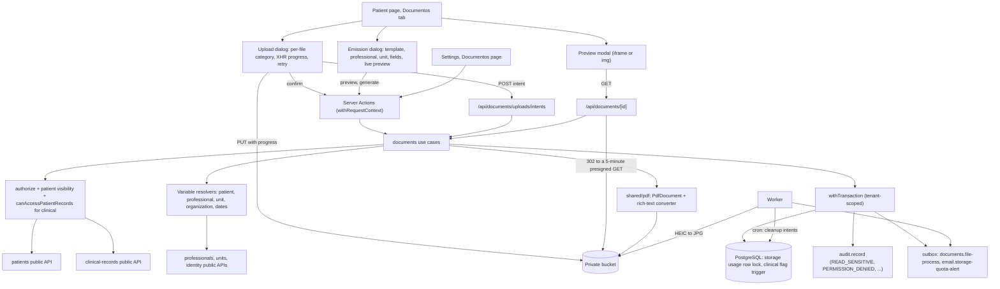

# Technical Specification: F08. Patient Documents

**Complexity:** complex

## 1. Technical Overview

**What.** A new `documents` module, in the **simple** tier as the architecture defines it (section 3): use cases call Prisma directly from `application/`, and a few pure helpers (template variables, quota arithmetic, the clinical flag rule) live in `domain/` with unit tests. It covers:
- A "Documentos" tab on the patient page. It lists the patient's documents with date, title, category, author and size, has filters by category and type, opens PDFs and images in a preview modal, and offers downloads.
- "Enviar arquivos": a drop zone for up to 20 files per action (PDF, JPG, PNG, HEIC, DOCX, up to 20 MB each). Each file gets its own category, title and progress bar. The browser uploads straight to the private bucket through presigned PUT URLs (ADR-031). A failed file shows "Falha no envio" with "Tentar novamente" and the rest of the batch is kept. The worker converts HEIC to JPG.
- Configurable categories, each with a "clínico" flag. Clinical documents are visible only to users who pass the F07 records policy. The flag of a document can be turned on but never off.
- A storage quota of 50 GB per organization for F08 files. Uploads are blocked at the limit. At 80%, a notice appears in the upload dialog, the settings page shows the usage, and the administrators get one email.
- Archiving with a reason (Manager/Administrator), "Mostrar arquivados", restoring, and correcting the title and category of uploaded documents.
- Document templates (up to 50 active) with a rich text body, variables inserted from a menu, and free-text fields filled at generation time. Three templates are created by default: Atestado, Declaração de comparecimento and Receituário simples.
- "Emitir documento": choose a template, a professional and a unit, fill the free fields, see a live preview with empty variables highlighted, and "Gerar PDF". The A4 PDF is rendered on the server with the shared PDF base (ADR-024), stored, opened in a new tab and listed as a document in the "Documento emitido" category.
- A "Documentos" settings page for categories, templates and storage usage.

**Why.** Documents are personal data and sometimes health data, so they need the same access discipline as F07: the server decides visibility, every opening is audited, and nothing is deleted. Two rules are guaranteed by the database because an application bug must not break them: the clinical flag of a document never goes from on to off (trigger), and the quota counter is updated under a row lock, so two uploads that finish at the same time cannot both pass the limit. F14 (timeline and LGPD export) reads these tables later.

**How it fits the codebase.** F08 follows the patterns of F01–F07 and F16:
- Use cases call `authorize` or a policy, then `parseInput`, then `withTransaction` with `audit.record()` and `uow.publish()`.
- `Result` errors carry stable codes and message keys, and the module has catalogs in pt-BR, en and es (ADR-028).
- Optimistic locking uses `version`.
- Uploads reuse the F07 direct-upload flow (ADR-031): an intent table, a presigned PUT with signed type and size, confirmation by `HEAD` and magic bytes, a pg-boss job for HEIC, and a daily cleanup of unused intents.
- PDF generation reuses `src/shared/pdf` (ADR-024).
- Data from other modules comes through their public APIs, which already exist for F08: `getOrganizationProfile` (identity), `getUnitContact` and `getSelectedUnit` (units), `getProfessionalCredentials` (professionals) and `getPatientIdentity` (patients). The clinical rule comes from `clinicalRecords.canAccessPatientRecords`.
- Default data per organization follows the `ensureDefaults` pattern of the scheduling cancellation reasons: it is created on first use, in the organization's default language, guarded by a unique key.
- The UI follows the design system "Ink and Paper" (ADR-020). Integration tests run on Testcontainers, and journeys run on Playwright.

New in this feature:
- Code that F07 and F08 share moves to `src/shared`: magic-byte detection (now with DOCX), the image processor (HEIC to JPG), the HTML sanitizer and the Tiptap editor.
- A small converter from the sanitized HTML subset to `@react-pdf/renderer` elements.
- The storage origin is added to the CSP `frame-src`, so the preview modal can show a PDF from a presigned URL.
- ADR-033 records these decisions. No new npm dependency is needed.

### Scope

**Included (Core + Full Scope, interview decision):**
- Core: upload, categorize, view, preview and download files in the patient's record. Also limits, the quota with the 80% alert, configurable categories with the clinical flag, archiving, restoring and correcting.
- Full: document templates with variables and free fields, the three default templates, PDF generation with live preview and the missing-value confirmation, and the generated PDF saved as a patient document.
- Integrated from cross-cutting concerns:
  - New permissions in the matrix: `document:read`, `document:upload`, `document:generate`, `document:archive`. Templates and categories use `setup:manage`.
  - Patient visibility through `patients.getPatientIdentity` (professionals see only patients they have an appointment with, F05). The clinical rule comes through `clinicalRecords.canAccessPatientRecords` (F07).
  - A 403 response and a `PERMISSION_DENIED` audit event for every denial, including URL manipulation.
  - A `READ_SENSITIVE` audit event for every document opened and for every list that includes clinical documents.
  - Tenant scoping of every new table.
  - Domain events published inside the transaction.
  - Interface text in the pt-BR, en and es catalogs. Dates go through the formatters. The generated PDF uses the language of the user who generates it (F16).
- Documentation:
  - PRD F08 clarified in both languages: what the quota counts, the default clinical categories, the one-way clinical flag, restoring and correcting, the 80% alert, and the signer of clinical templates.
  - ADR-033 in both languages, and the module dependency graph updated (`documents → clinical-records`, `documents → units`, `documents → identity`).
  - Design system patterns for the Documents tab, the upload dialog, the emission dialog and the template editor, in both languages.

**Deferred / not included:**
- Timeline and LGPD export of documents: F14 reads the `patient_document` tables directly (architecture section 3).
- Default template bodies that are legally reviewed outside Brazil (PRD Section 7). The default templates are created in the organization's language, but their text is only validated for Brazil.
- Digital signature (ICP-Brasil), sending documents by email or WhatsApp, a preview of DOCX files (they are download-only), and templates with images: none are in the PRD.
- Clinical attachments of a note stay in F07. Files that arrive after a note is locked are uploaded here, in a clinical category.

**Input contracts (Consumes):**
- F01, through `identity`: `getOrganizationProfile` (legal name, trade name, tax ID, country, logo key) and the logo bytes for the PDF header. The request context provides `linkedProfessionalId` and the locale. A new provided function, `identity.listAdministratorContacts(organizationId)`, gives names, emails and locales for the quota email.
- F02, through `units`: `getUnitContact(ctx, unitId)` (name, formatted address, phone, country, time zone) and `getSelectedUnit(ctx)` for the default unit.
- F04, through `professionals`: `getProfessionalCredentials(ctx, professionalId, country)` (display name, specialty, the council registration of the unit's country) and the list of active professionals for the selector.
- F05, through `patients`: `getPatientIdentity(ctx, patientId)` (display name with the social name first, full name, identity document, birth date, formatted address). This call also applies the patient visibility policy.
- F07, through `clinicalRecords.canAccessPatientRecords(ctx, patientId)`: the clinical access rule.
- F16: locale, formatters, country profiles (tax ID and document labels) and long date names.

**Output contracts (Provides):**
- Patient document records for F14, in `patient_document`: kind (`UPLOADED` or `GENERATED`), category, title, creation date, author, file reference (object key, content type, size), clinical flag, archive state and reason, and, for generated documents, the template, the professional and the unit.
- Domain events published inside the transaction: `PatientDocumentAdded`, `PatientDocumentUpdated`, `PatientDocumentArchived` and `PatientDocumentRestored`. The payload holds the document ID, patient ID, kind, clinical flag and actor. There are no subscribers yet.

### Traceability to the PRD

| PRD block (F08) | Where it is specified |
|---|---|
| Consumes | Scope → input contracts; Section 4 (`application/directory.ts`, `variables.ts`) |
| Provides | Scope → output contracts; Section 6 (data model) |
| Core Scope | Scope → Included; Section 3 (uploads, categories, quota, archive); Section 5 (upload routes and actions) |
| Full Scope additions | Scope → Included; Section 3 (templates, variables, generation); Section 5 (template and generation actions) |
| Capabilities | Section 3, Section 5, Section 6 |
| Experience | Section 4 (Documents tab, upload dialog, emission dialog, settings); Section 5 (UI texts) |
| Error Handling | Section 5 (error codes and pt-BR messages); Section 3 (retry, quota, missing values, no partial document) |
| Acceptance criteria (Section 9, F08) | Section 7, acceptance tests |
| Cross-Feature Integration (F01, F02, F04, F05, F16 → F08; F08 → F14) | Section 7, cross-feature tests |

## 2. Architecture Impact

### Affected components

| Area | Path | Role |
|---|---|---|
| Module | `src/modules/documents/` | Use cases, pure helpers, infrastructure (PDF layout, storage, directory), UI, messages and public API (simple tier) |
| Clinical records | `src/modules/clinical-records/` | Imports the extracted shared pieces (file types, image processor, sanitizer, editor) instead of its own copies; behavior does not change |
| Identity | `src/modules/identity/index.ts`, `application/provided.ts` | `listAdministratorContacts(organizationId)` for the quota email |
| Shared storage | `src/shared/storage/object-storage.ts`, `file-types.ts`, `image-processor.ts` | `getRange` with an offset or a suffix; magic bytes for PDF, JPG, PNG, HEIC and DOCX; HEIC to JPG and thumbnails |
| Shared rich text | `src/shared/rich-text/sanitizer.ts`, `src/shared/ui/rich-text/rich-text-editor.tsx` | Sanitizer allowlist (ADR-032) and the Tiptap editor, with a toolbar slot and an `insertText` handle |
| Shared PDF | `src/shared/pdf/rich-text.tsx` | Converts the allowlisted HTML subset to react-pdf elements |
| Authorization | `src/shared/authz/permissions.ts` | `document:read`, `document:upload`, `document:generate`, `document:archive` |
| Security headers | `src/proxy.ts` | Storage origin in `frame-src` (PDF preview) |
| Outbox and jobs | `src/shared/events/outbox.ts`, `src/shared/jobs/queues.ts`, `src/worker/index.ts`, `src/worker/outbox-dispatcher.ts`, `src/worker/jobs/documents.ts` | `documents.file-process`, `email.storage-quota-alert`; queues `documents-file-process` and `documents-uploads-cleanup` |
| Email | `src/shared/email/templates.ts` | `storageQuotaAlertEmail` in the recipient's language |
| Patient page | `src/app/(app)/patients/[patientId]/page.tsx` | "Documentos" tab for users with `document:read` |
| Routes | `src/app/(app)/patients/[patientId]/documents/actions.ts`, `src/app/api/documents/**`, `src/app/(app)/settings/documents/**` | Server Actions, upload intent and download routes, settings pages |
| Settings navigation | `src/shared/ui/app-shell/` (settings menu) | "Documentos" entry for `setup:manage` |
| Composition | `src/composition.ts` | `registerCatalog("documents", ...)` |
| Tenancy | `src/shared/db/tenant.ts`, `tests/integration/helpers.ts` | Register and truncate the new tables |
| Database | `prisma/schema.prisma`, `prisma/migrations/0010_patient_documents/` | Categories, documents, upload intents, templates, storage usage; clinical-flag trigger; grants |
| Documentation | `docs/prd.{en,pt-BR}.md`, `docs/architecture.{en,pt-BR}.md`, `docs/design-system.{en,pt-BR}.md` | PRD clarifications, ADR-033 and the module graph, the Documents patterns |

### Data flow



## 3. Technical Decisions

| Decision | Chosen Approach | Alternative Considered | Trade-off |
|---|---|---|---|
| Scope (interview) | Core + Full Scope: uploads, categories, quota, archive, templates, default templates and PDF generation | Core only | Every F08 acceptance criterion is covered in one delivery. |
| Module tier | Simple, as the architecture says. Use cases use Prisma through `uow.tx`. Pure functions go in `domain/` (variables, quota, flag rule) for unit tests | Rich tier with repositories | The invariants that matter under concurrency (quota and the clinical flag) are enforced by the database, so a domain layer would only add ceremony. |
| Upload transport | The ADR-031 flow, as in F07. 1) `POST /api/documents/uploads/intents` checks the permission, patient visibility, category, declared type and size, and the quota. It creates a `patient_document_upload` row and returns a presigned PUT (5 minutes) with signed `Content-Type` and `Content-Length`. 2) The browser sends the `PUT` through `XMLHttpRequest` with progress. 3) `confirmDocumentUploadAction` runs `HEAD`, checks the real type, takes the quota under lock and creates the document | Upload through the app server (ADR-023) | Twenty megabyte files stay out of the web process. The CSP, CORS and public endpoint already exist from F07. |
| Batch of 20 | Each file is independent: its own intent, its own `PUT` and its own confirmation. The dialog refuses more than 20 files per action before any request (`MAX_FILES_PER_UPLOAD`). Up to 3 files upload at the same time. A failed step marks only that row "Falha no envio" with "Tentar novamente", which starts again from a new intent | One multi-file request | PRD: "successfully uploaded files of the same batch are kept". The server does not need to know the batch, so retrying is the same as a first try. |
| Real type check (DOCX) | `detectFileType` in `src/shared/storage/file-types.ts` reads the first 16 bytes: `%PDF`, `FF D8 FF`, PNG, or ISO-BMFF `ftyp` with a HEIC brand. A file that starts with `PK\x03\x04` is a ZIP. For a ZIP, the confirmation reads the last 64 KB (end of central directory), then the central directory (at most 1 MB). The file is DOCX only when it has `[Content_Types].xml` and `word/document.xml` and has no `word/vbaProject.bin` (macros). Anything else, such as `exame.zip`, is refused | Trust the extension and the declared type | A ZIP renamed to `.docx` and macro-enabled files are refused, and the server never reads the whole file. |
| HEIC | Converted to JPG by the worker through the shared image processor (moved from F07), as in F07: status `PROCESSING` → `READY`, or `FAILED` after 3 attempts, and the original stays downloadable. No thumbnails, because the PRD list has none | Thumbnails in the list | The preview modal shows the converted JPG. |
| Quota scope (interview) | The quota counts F08 files only: uploaded files (the original and the converted JPG) and generated PDFs. F05 consent files and F07 attachments are not counted and never blocked. `QUOTA_BYTES = 50 GiB` (`50 × 1024³`) | All files of the organization | Matches the interview answer. The counter lives in the documents module. |
| Quota enforcement | `document_storage_usage` holds one row per organization with `used_bytes`. The intent does a soft check (`used + declared size > quota` → `DOCUMENT_QUOTA_EXCEEDED`). The confirmation locks the row with `SELECT … FOR UPDATE`, checks `used + real size` again, increments it in the same transaction as the document insert, and deletes the object when the check fails. The worker adds the converted JPG size without blocking. Generated PDFs are counted but never blocked (PRD: "upload blocked") | Sum file sizes on every request | Two confirmations that finish together cannot both pass the limit. Reading usage is one row. |
| 80% alert (interview) | `usagePercent ≥ 80` shows a warning in the upload dialog to everyone who can upload: "O espaço de armazenamento está em {percent}% de 50 GB." "Configurações → Documentos" shows the usage to Administrator and Manager. When a confirmation moves usage from below 80% to 80% or more and `alert_sent_at` is null, an `email.storage-quota-alert` outbox message goes to every active Administrator, in their language. The flag clears if usage goes back under 80% | No email | Admins learn early. One email per crossing, never one per upload. |
| Default categories (interview) | Created on first use by `ensureDefaultCategories`, in the organization's default language: Exame (clinical), Termo assinado, Documento pessoal, Laudo externo (clinical), Outro, plus the system category "Documento emitido" (`system_key = 'ISSUED'`). The issued category cannot be renamed, deactivated or chosen for uploads. A unique `(organization_id, system_key)` makes concurrent first uses safe | Seed in the migration | Existing and new organizations get the defaults in their language without SQL translations. |
| Clinical visibility | A document is clinical when `patient_document.is_clinical` is true. Uploads copy the category flag. Generated documents copy the template flag. Clinical documents are listed, opened, edited and archived only by users who pass `clinicalRecords.canAccessPatientRecords` (F07: a linked professional with an appointment with the patient). Everyone else does not see them in lists. Opening one by URL gives 403 and `PERMISSION_DENIED` | Filter in the UI | PRD: "clinical categories are visible only to authorized professionals (same rule as F07)". |
| Clinical flag change (interview) | One-way. Turning a category's flag on updates `is_clinical = true` on all its documents in the same transaction (audited with the count). Turning it off affects only new uploads. A `BEFORE UPDATE` trigger refuses `is_clinical` going from true to false. Moving a document to a non-clinical category keeps it clinical | The flag follows the category in both directions | Health data that was protected never becomes visible to Front Desk by an admin click. |
| Front Desk and clinical uploads (interview) | Front Desk can choose a clinical category when uploading. The row shows "Visível apenas para profissionais autorizados" before sending. After confirmation the document leaves their list, and they cannot open, edit or archive it | Hide clinical categories from Front Desk | PRD story: "front desk uploads exams". Upload is write-only for them. |
| Corrections (interview) | `updateDocument` changes the title and the category of an `UPLOADED` document. It is allowed for the uploader, or for Manager/Administrator (`document:archive`), and clinical documents also need clinical access. Generated documents cannot be edited. `restoreDocument` (Manager/Administrator) clears the archive fields. Everything is audited with before/after values | Archive and upload again | Mistakes are fixed without losing history. |
| Archive | `archiveDocument` needs `document:archive` and a reason of 3–500 characters, and sets `archived_at`, `archived_by_id` and `archive_reason`. Default lists exclude archived documents, and "Mostrar arquivados" includes them with an "Arquivado" stamp and the reason. No `DELETE` grant on the table | Soft-delete flag | PRD: no hard deletes. The archive is reversible and traceable. |
| Downloads and preview | `GET /api/documents/[id]?variant=original|converted&disposition=inline|attachment` authorizes, records `READ_SENSITIVE` and redirects (302) to a presigned GET valid for 5 minutes, signed with `S3_PUBLIC_ENDPOINT`. Images show in an ``. PDFs show in an `<iframe>`, which needs the storage origin in `frame-src` (ADR-033). DOCX is download-only | Stream bytes through the app | Same model as F07 (ADR-009). Every opening, clinical or not, is audited, because documents hold personal data (ID copies). |
| List audit | Listing records `READ_SENSITIVE` (`entityType` `patient`, metadata `{ documentIds }`) only when the page includes clinical documents. Other lists are not audited | Audit every list | Clinical titles ("Exame de HIV") are health data. Non-clinical lists show metadata only. |
| Template body | Tiptap (the shared editor) with the ADR-032 allowlist (`p`, `br`, `strong`, `em`, `h2`, `h3`, `ul`, `ol`, `li`). Variables are plain-text tokens such as `{{paciente.nome}}` and `{{campo:dias_afastamento}}`, inserted by an "Inserir variável" menu. The editor only highlights them visually. On save, the server sanitizes the body, extracts the tokens, refuses unknown variables and invalid field names (`[a-z0-9_]{1,40}`), and stores the list of free fields in order of first use | A custom Tiptap node for variables | Tokens survive the sanitizer and are portable. The menu prevents typos, and the server check catches the rest. |
| Variable resolution | A registry of resolvers (architecture 11.1, Open/Closed): `paciente.*` (patients), `profissional.*` (professionals, with the registration of the unit's country, for example "CRM 123456/SP"), `unidade.*` (units), `clinica.*` (identity), `data_hoje` and `data_extenso` (generation instant in the unit's time zone and the user's locale), and `campo:*` (user input). `paciente.nome` is the display name (social name first, F05). `paciente.cpf` is the patient's identity document formatted by the country profile (CPF in Brazil). `clinica.nome` is the trade name, else the legal name. `clinica.cnpj` is the organization's tax ID, formatted. Values are HTML-escaped when substituted | A fixed `switch` | New variables are one resolver each. |
| Missing values | A variable without a value, or an empty free field, is "missing". The preview wraps it in `<mark data-missing>` with its label, and the dialog lists one message per missing item, for example "O CPF do paciente não está cadastrado. Deseja gerar mesmo assim?". `generateDocument` without `confirmMissing: true` returns `DOCUMENT_MISSING_VALUES` with the list. A confirmed generation prints the missing value as an empty line (`________`) | Block generation | PRD Error Handling: highlight and ask. Printed documents keep a space to fill by hand. |
| Live preview | `previewDocumentAction` returns the resolved, sanitized HTML (values escaped, missing items marked) and the free-field list. The client calls it on open and 400 ms after the last change. The preview is HTML that looks like an A4 page (`document-sheet` class), not a rendered PDF | Render a PDF on every keystroke | It is fast, and the PDF uses the same resolved content. |
| Signer (interview) | Clinical templates: the professional is always the user's own `linkedProfessionalId` (the field is locked), and the user must pass `canAccessPatientRecords` for the patient. Front Desk, and users without a linked professional, cannot generate them (`DOCUMENT_TEMPLATE_CLINICAL_ONLY`, 403, audited). Non-clinical templates: any active professional, pre-filled with the linked one, else empty and required | Any professional for any template | Nobody issues a prescription in another professional's name. |
| PDF generation | Synchronous in the Server Action, with the shared `PdfDocument`: A4, header with logo and clinic name, the template name as the title, the body converted from HTML by `src/shared/pdf/rich-text.tsx`, a signature line with the professional's name and registration, and a footer with the unit address and phone and the page number. Labels use the user's locale (F16). The PDF is stored under `org/{orgId}/documents/{uuid}.pdf`, then the document row and the usage are written in one transaction. If the render, the upload or the transaction fails, the object is deleted and `DOCUMENT_GENERATION_FAILED` is returned, so no partial document exists. A 15-second hard timeout guards the render. The target is ≤ 5 s, asserted by a test | Generate in the worker | PRD: "≤ 5 seconds" and "no partial document is saved". The F06 agenda PDF already renders in the request. |
| Opening the generated PDF | The client opens a blank tab on the "Gerar PDF" click, before the request, and points it to `/api/documents/{id}?disposition=inline` when the action returns. On failure, the tab is closed | `window.open` after the await | Popup blockers allow a tab opened by the click. |
| Generated document data | `kind = GENERATED`, category "Documento emitido", title = template name, `template_id`, `template_version`, `professional_id`, `unit_id` and `field_values` (JSON of the free fields), so the document can be traced. The PDF is the record, and it is never rendered again | Store only the PDF | F14 and audits can say which template and signer produced it. |
| Template limits | Up to 50 active templates per organization (PRD), checked under a row lock on the organization's usage row. A body has at most 20,000 text characters. Templates are never deleted: "Desativar" hides them from the emission list. Editing increments `version`, and documents keep the version they used | Hard delete | Generated documents reference their template. |
| Default templates | `ensureDefaultTemplates` creates Atestado (`CERTIFICATE`, clinical), Declaração de comparecimento (`ATTENDANCE_DECLARATION`, non-clinical) and Receituário simples (`PRESCRIPTION`, clinical) in the organization's default language. The bodies are TypeScript constants per locale in `application/default-templates.ts`, not catalog messages, because ICU would read `{{…}}` as arguments. A unit test checks that they use only known variables | Catalog messages | Front Desk can issue the attendance declaration on day one. Professionals issue the clinical ones. |
| Shared code extraction | Magic bytes, the image processor, the sanitizer and the Tiptap editor move from `clinical-records` to `src/shared` (storage, rich-text, ui). `clinical-records` imports them, and its tests keep passing unchanged | `documents` imports from `clinical-records` | Modules import each other only for business APIs. Technical helpers belong to `shared`. |
| Domain events | `PatientDocumentAdded`, `PatientDocumentUpdated`, `PatientDocumentArchived` and `PatientDocumentRestored`, published with `uow.publish` | No events | F14 and notifications can subscribe later without changes here. |

### Assumptions

These were decided during this spec rather than by the PRD, and can be overridden:
- **Permissions.** `document:read`, `document:upload` and `document:generate` go to all four roles. Professionals still see only patients they have an appointment with (F05). `document:archive` goes to Administrator and Manager. Categories and templates use `setup:manage` (Administrator and Manager), which the matrix already reserves for F08 templates.
- **Title.** An uploaded document's title defaults to the file name without its extension and can be changed in the upload row (1–200 characters). The original file name is kept separately for downloads.
- **Document date.** The list date is the creation instant, shown in the organization's time zone.
- **List.** Newest first, 50 per page, with "Carregar mais". Filters: category, and type ("Enviados" or "Emitidos"). Columns: date, title (with a "Clínico" stamp when clinical, and "Arquivado" when archived), category, author, size. The author is the uploader, or, for generated documents, the professional and the user.
- **Category limits.** A name has 1–60 characters, unique per organization ignoring case. At most 30 active categories. Categories are deactivated, never deleted.
- **Upload intents.** Intents expire after 24 hours. The daily cleanup job (04:15) deletes unconfirmed intents and their objects. Confirming twice returns the same document.
- **Concurrency of uploads.** The dialog uploads 3 files at a time. The other rows wait as "Na fila".
- **Quota email.** Sent once per crossing of 80%, to every active Administrator, in their language: "O armazenamento de documentos da clínica chegou a {percent}% de 50 GB."
- **Usage display.** "{used} de 50 GB usados ({percent}%)", with a warning style at 80% and danger at 100%.
- **Free field labels.** The label is the field name with underscores as spaces and the first letter in uppercase ("dias_afastamento" → "Dias afastamento"). Free fields are single-line inputs of up to 200 characters.
- **Long date.** `data_extenso` is the long date in the user's locale, for example "7 de outubro de 2026". `data_hoje` is the short date.
- **Template type.** It is a label for the emission list and for filters. It does not change the layout.
- **Seeded template texts.** Written in the PRD's tone and reviewable: Atestado ("Atesto, para os devidos fins, que {{paciente.nome}}, {{paciente.cpf}}, esteve sob meus cuidados em {{data_hoje}} e necessita de {{campo:dias_afastamento}} dias de afastamento de suas atividades."), Declaração de comparecimento ("Declaro, para os devidos fins, que {{paciente.nome}}, {{paciente.cpf}}, compareceu a {{unidade.nome}} em {{data_hoje}}, das {{campo:hora_inicio}} às {{campo:hora_fim}}.") and Receituário simples (patient name, then a free field `{{campo:prescricao}}`).
- **Messages not given by the PRD.** The pt-BR texts for corrections, restoring, the category flag, the quota notice and template validation were written in the PRD's tone (Section 5) and can be reviewed.

### Open points
- **PRD update.** The interview answers (quota scope, default clinical categories, the one-way flag, restoring and correcting, the 80% alert, the signer of clinical templates) clarify PRD F08. The PRD is updated in both languages in the first stage of the plan.

## 4. Component Overview

### Frontend

| File Path | New/Modified | Purpose | Key Responsibilities |
|---|---|---|---|
| `src/app/(app)/patients/[patientId]/page.tsx` | Modified | Patient page | "Documentos" tab for `document:read`; loads the first page, categories, templates the user can generate, the quota state and the default unit |
| `src/app/(app)/patients/[patientId]/documents/actions.ts` | New | Server Actions | Confirm upload, list more, update, archive, restore, preview, generate |
| `src/app/api/documents/uploads/intents/route.ts` | New | Upload intent | `POST`; session; returns the presigned PUT |
| `src/app/api/documents/[documentId]/route.ts` | New | Download | `GET`; authorizes, audits, 302 to the presigned GET |
| `src/app/(app)/settings/documents/page.tsx`, `actions.ts` | New | Settings | Categories panel, templates table, storage usage; `setup:manage` |
| `src/app/(app)/settings/documents/templates/new/page.tsx`, `[templateId]/page.tsx` | New | Template editor pages | Create and edit a template |
| `src/modules/documents/ui/documents-tab.tsx` | New | Tab | Filters (category, type, "Mostrar arquivados"), table, "Enviar arquivos" (primary) and "Emitir documento" (outline) |
| `src/modules/documents/ui/documents-table.tsx` | New | List | Date, title with stamps, category, author, size; row actions (Visualizar, Baixar, Editar, Arquivar, Restaurar) shown according to flags from the server; "Carregar mais" |
| `src/modules/documents/ui/upload-dialog.tsx` | New | Upload | Drop zone and file button; client checks (type, 20 MB, 20 files) with the PRD message per file; a row per file with category select, title, clinical hint, progress bar, "Falha no envio" and "Tentar novamente"; the quota notice |
| `src/modules/documents/ui/upload-queue.ts` | New | Upload state | A pure queue (3 at a time) over intent → PUT (XHR progress) → confirm, with per-file states and retry |
| `src/modules/documents/ui/preview-dialog.tsx` | New | Preview | `` for images, `<iframe>` for PDF, a download link for DOCX; title and metadata |
| `src/modules/documents/ui/edit-document-dialog.tsx`, `archive-dialog.tsx` | New | Corrections | Title and category form; archive reason (required); restore confirmation |
| `src/modules/documents/ui/issue-document-dialog.tsx` | New | Emission | Template select (grouped by type, clinical marked), professional select (locked for clinical), unit select, free fields, the live preview, the missing-values confirmation, "Gerar PDF" |
| `src/modules/documents/ui/document-sheet.tsx` | New | Preview sheet | A4-like rendering of the resolved HTML; missing items highlighted |
| `src/modules/documents/ui/categories-panel.tsx` | New | Settings | Table of categories: name, clinical checkbox, active; add, rename, toggle; confirmation when turning clinical on ("{count} documentos passarão a ser clínicos") |
| `src/modules/documents/ui/templates-table.tsx` | New | Settings | Name, type, clinical, active; "Novo modelo"; the 50-template counter |
| `src/modules/documents/ui/template-editor.tsx` | New | Template form | Name, type, clinical, body with the shared editor, "Inserir variável" menu, "Campo livre" dialog, token highlighting, save, deactivate |
| `src/modules/documents/ui/storage-usage.tsx`, `quota-notice.tsx` | New | Quota | Usage bar with text; the 80% and 100% notices |
| `src/shared/ui/rich-text/rich-text-editor.tsx` | Moved | Editor | From `clinical-records/ui`; gains `toolbarExtra` and an `onReady(editor)` handle for inserting tokens |
| `src/modules/clinical-records/ui/*` | Modified | Imports | Use the shared editor |
| `src/shared/ui/app-shell/` (settings menu) | Modified | Navigation | "Documentos" under Settings |
| `src/app/globals.css` | Modified | Styles | `document-sheet` (A4 proportions, serif title, token highlight, `mark[data-missing]`) built on tokens |

### Backend

| File Path | New/Modified | Purpose | Key Responsibilities |
|---|---|---|---|
| `src/modules/documents/domain/limits.ts` | New | Constants | 20 MB, 20 files, 50 GiB, 80%, 50 templates, 30 categories, 20,000 characters, 200-character title, 3–500-character reason, 300-second URLs, 24-hour intents, 5-second target, 15-second timeout, 50 per page (PRD references) |
| `src/modules/documents/domain/template-variables.ts` | New | Tokens | Parse tokens, validate known names and field names, list free fields in order, substitute with escaping and missing markers |
| `src/modules/documents/domain/quota.ts` | New | Quota math | `canStore(used, size)`, `usagePercent`, `crossedAlert(before, after)` |
| `src/modules/documents/domain/clinical-flag.ts` | New | Flag rule | `nextClinicalFlag(current, categoryFlag)` (never true → false) |
| `src/modules/documents/application/errors.ts`, `schemas.ts` | New | Errors and validation | Error factories with message keys; Zod schemas for every action and route |
| `src/modules/documents/application/ports.ts` | New | Deps | Storage, PDF renderer, clock, directory (patients, professionals, units, identity, clinical access) |
| `src/modules/documents/application/policies.ts` | New | Access | `requirePatientDocuments(ctx, patientId, action)`, `canSeeClinical(ctx, patientId)`, `requireDocumentAccess(ctx, document, action)`; denials audited |
| `src/modules/documents/application/categories.ts` | New | Use cases | `ensureDefaultCategories`, `listCategories`, `createCategory`, `updateCategory` (rename, clinical flag with propagation), `setCategoryActive` |
| `src/modules/documents/application/uploads.ts` | New | Use cases | `createUploadIntent`, `confirmUpload` (type check, quota lock, insert, outbox, alert) |
| `src/modules/documents/application/documents.ts` | New | Use cases | `listPatientDocuments`, `openDocument`, `updateDocument`, `archiveDocument`, `restoreDocument` |
| `src/modules/documents/application/quota.ts` | New | Use cases | `getStorageUsage`, `chargeUsage(uow, bytes, { enforce })` with the row lock and the alert outbox |
| `src/modules/documents/application/templates.ts` | New | Use cases | `ensureDefaultTemplates`, `listTemplates`, `getTemplate`, `createTemplate`, `updateTemplate`, `setTemplateActive` |
| `src/modules/documents/application/default-templates.ts` | New | Seed content | Names and bodies per locale |
| `src/modules/documents/application/variables.ts` | New | Resolver registry | One resolver per variable group; labels and missing-message keys |
| `src/modules/documents/application/generation.ts` | New | Use cases | `previewDocument`, `generateDocument` (authorize, resolve, render, store, record) |
| `src/modules/documents/application/maintenance.ts` | New | System use cases | `processDocumentFile` (HEIC), `markDocumentFileFailed`, `cleanupUploadIntents` |
| `src/modules/documents/infrastructure/document-pdf.tsx` | New | PDF layout | `PdfDocument` with the converted body, signature block and footer |
| `src/modules/documents/infrastructure/pdf-renderer.ts`, `storage.ts`, `directory.ts` | New | Adapters | Render to a buffer; presigned URLs and object access; public APIs of other modules |
| `src/modules/documents/events.ts` | New | Events | Event names and payload type |
| `src/modules/documents/messages/{pt-BR,en,es}.json`, `catalog.ts` | New | Catalogs | Every error, label and email text in three languages |
| `src/modules/documents/index.ts`, `client.ts` | New | Public API | Use cases bound to deps, `documentsCatalog`, UI exports; client-safe components (ADR-027) |
| `src/shared/storage/file-types.ts` | New (extracted) | Type detection | Magic bytes plus the DOCX check over a range reader |
| `src/shared/storage/image-processor.ts` | Moved | Images | HEIC to JPG, thumbnails without EXIF |
| `src/shared/storage/object-storage.ts` | Modified | Storage | `getRange(key, { offset, length } | { suffix })` |
| `src/shared/rich-text/sanitizer.ts` | Moved | Sanitizer | ADR-032 allowlist and HTML to text |
| `src/shared/pdf/rich-text.tsx` | New | PDF body | `p`, `br`, `strong`, `em`, `h2`, `h3`, `ul`, `ol`, `li` to react-pdf `Text` and `View` |
| `src/shared/authz/permissions.ts` | Modified | Matrix | Four new actions |
| `src/shared/events/outbox.ts`, `src/worker/outbox-dispatcher.ts` | Modified | Outbox | `documents.file-process`, `email.storage-quota-alert` |
| `src/shared/jobs/queues.ts`, `src/worker/index.ts`, `src/worker/jobs/documents.ts` | Modified/New | Jobs | `documents-file-process` (3 retries, 30-second backoff), `documents-uploads-cleanup` (daily 04:15) |
| `src/shared/email/templates.ts` | Modified | Email | `storageQuotaAlertEmail` |
| `src/modules/identity/application/provided.ts`, `index.ts` | Modified | Provided read | `listAdministratorContacts(organizationId)` |
| `src/proxy.ts` | Modified | CSP | Storage origin in `frame-src` |
| `src/composition.ts`, `src/shared/db/tenant.ts`, `tests/integration/helpers.ts` | Modified | Wiring and tenancy | Catalog; new tables registered and truncated |

### Database

| Migration File | Tables Affected | Operation | Notes |
|---|---|---|---|
| `prisma/migrations/0010_patient_documents/migration.sql` | `document_category`, `patient_document`, `patient_document_upload`, `document_template`, `document_storage_usage` | CREATE, TRIGGER, GRANT | Generated by Prisma, plus hand-written CHECKs, case-insensitive unique indexes, the clinical-flag trigger and grants (no `DELETE` on documents, categories or templates) |

## 5. API Contracts

All actions return the F01 `ActionResult` envelope. Routes return JSON with HTTP status codes, except the download route, which redirects.

Permissions:
- `document:read`, `document:upload` and `document:generate`: Administrator, Manager, Front Desk, Professional. Every patient-scoped call also passes the F05 visibility policy (through `patients.getPatientIdentity`).
- Clinical documents and clinical templates also need `clinicalRecords.canAccessPatientRecords` (linked professional with an appointment with the patient).
- `document:archive`: Administrator and Manager (archive, restore, edit any uploaded document).
- `setup:manage`: Administrator and Manager (categories, templates, usage).
- A denial records `PERMISSION_DENIED` and returns `AUTHZ_FORBIDDEN` (403).

### Error codes

| Code | HTTP Status | pt-BR message |
|---|---|---|
| `DOCUMENT_FILE_UNSUPPORTED` | 400 | "O arquivo {fileName} não é suportado. Envie PDF, imagens ou DOCX de até 20 MB." |
| `DOCUMENT_BATCH_LIMIT` | 400 | "Envie até 20 arquivos por vez." (client check) |
| `DOCUMENT_QUOTA_EXCEEDED` | 409 | "O espaço de armazenamento da clínica está esgotado (50 GB). Contate o administrador." |
| `DOCUMENT_UPLOAD_NOT_FOUND` | 404 | "O envio do arquivo não foi concluído. Tente enviar novamente." |
| `DOCUMENT_NOT_FOUND` | 404 | "Documento não encontrado." |
| `DOCUMENT_STALE` | 409 | "Este documento foi alterado por outra pessoa. Recarregue para ver a versão mais recente." |
| `DOCUMENT_CATEGORY_INVALID` | 400 | "Escolha uma categoria ativa." |
| `DOCUMENT_CATEGORY_NAME_TAKEN` | 409 | "Já existe uma categoria com este nome." |
| `DOCUMENT_CATEGORY_LIMIT` | 409 | "A clínica pode ter até 30 categorias ativas." |
| `DOCUMENT_CATEGORY_SYSTEM` | 409 | "A categoria Documento emitido é usada pelos documentos gerados e não pode ser alterada." |
| `DOCUMENT_GENERATED_READ_ONLY` | 409 | "Documentos emitidos não podem ser editados." |
| `DOCUMENT_ARCHIVE_REASON_REQUIRED` | 400 | "Informe o motivo do arquivamento (mínimo de 3 caracteres)." |
| `DOCUMENT_ALREADY_ARCHIVED` | 409 | "Este documento já está arquivado." |
| `DOCUMENT_NOT_ARCHIVED` | 409 | "Este documento não está arquivado." |
| `DOCUMENT_TEMPLATE_NOT_FOUND` | 404 | "Modelo não encontrado ou desativado." |
| `DOCUMENT_TEMPLATE_LIMIT` | 409 | "A clínica pode ter até 50 modelos ativos. Desative um modelo para criar outro." |
| `DOCUMENT_TEMPLATE_NAME_TAKEN` | 409 | "Já existe um modelo com este nome." |
| `DOCUMENT_TEMPLATE_EMPTY` | 400 | "Escreva o texto do modelo." |
| `DOCUMENT_TEMPLATE_TOO_LONG` | 400 | "O modelo pode ter no máximo 20.000 caracteres." |
| `DOCUMENT_TEMPLATE_UNKNOWN_VARIABLE` | 400 | "A variável {variable} não existe. Use o menu Inserir variável." |
| `DOCUMENT_TEMPLATE_INVALID_FIELD` | 400 | "O campo {field} é inválido. Use letras minúsculas, números e _ (até 40 caracteres)." |
| `DOCUMENT_TEMPLATE_CLINICAL_ONLY` | 403 | "Somente profissionais que atendem este paciente podem emitir este documento." |
| `DOCUMENT_SIGNER_NOT_ALLOWED` | 403 | "Em documentos clínicos, o profissional deve ser você." |
| `DOCUMENT_PROFESSIONAL_INVALID` | 400 | "Escolha um profissional ativo." |
| `DOCUMENT_UNIT_INVALID` | 400 | "Escolha uma unidade ativa." |
| `DOCUMENT_MISSING_VALUES` | 409 | "Há informações em branco neste documento. Confirme para gerar mesmo assim." (carries the list of missing items) |
| `DOCUMENT_GENERATION_FAILED` | 503 | "Não foi possível gerar o documento. Tente novamente." |
| `VALIDATION_FAILED`, `AUTHZ_FORBIDDEN`, `AUTH_UNAUTHENTICATED` | — | As in F01 |

Missing-value messages (one key per variable, PRD tone): "O CPF do paciente não está cadastrado. Deseja gerar mesmo assim?", "A data de nascimento do paciente não está cadastrada.", "O endereço do paciente não está cadastrado.", "O registro do profissional no conselho não está cadastrado.", "A especialidade do profissional não está cadastrada.", "O endereço da unidade não está cadastrado.", "O CNPJ da clínica não está cadastrado.", "O campo {label} está em branco."

Other texts in the catalogs:
- Tab and actions: "Documentos", "Enviar arquivos", "Emitir documento", "Visualizar", "Baixar", "Editar", "Arquivar", "Restaurar", "Mostrar arquivados", "Carregar mais", "Todas as categorias", "Enviados", "Emitidos".
- Stamps: "Clínico", "Arquivado", "Processando", "Falha no processamento".
- Upload rows: "Arraste arquivos ou escolha", "Na fila", "Enviando {percent}%", "Enviado", "Falha no envio", "Tentar novamente", "Visível apenas para profissionais autorizados".
- Quota: "O espaço de armazenamento está em {percent}% de 50 GB.", "{used} de 50 GB usados ({percent}%)".
- Emission: "Modelo", "Profissional", "Unidade", "Pré-visualização", "Gerar PDF", "Gerar mesmo assim", "Inserir variável", "Campo livre".
- Toasts: "{count} arquivos enviados", "Documento emitido", "Documento atualizado", "Documento arquivado", "Documento restaurado", "Modelo salvo", "Categoria salva".
- Empty states: "Nenhum documento neste paciente.", "Nenhum documento arquivado."

### Route: POST `/api/documents/uploads/intents`
- **Authentication:** session cookie; `document:upload`, patient visibility, active non-system category.

| Field | Type | Required | Validation | Description |
|---|---|---|---|---|
| `patientId` | `uuid` | Yes | visible patient | Patient |
| `categoryId` | `uuid` | Yes | active, not `ISSUED` | Category |
| `title` | `string` | No | 1–200 characters after trimming | Defaults to the file name without the extension |
| `fileName` | `string` | Yes | 1–255 characters | Original name, cleaned of control characters |
| `contentType` | `string` | Yes | `application/pdf`, `image/jpeg`, `image/png`, `image/heic`, `image/heif`, `application/vnd.openxmlformats-officedocument.wordprocessingml.document` | Declared type |
| `size` | `integer` | Yes | 1 – 20,971,520 | Bytes; signed into the URL |

```json
{
  "patientId": "0199b2f0-6c1e-7c3a-9a51-2f0e8d1c4b10",
  "categoryId": "0199b2f0-7a00-7d11-8e2b-9f1a2c3d4e50",
  "title": "Hemograma setembro",
  "fileName": "hemograma.pdf",
  "contentType": "application/pdf",
  "size": 482113
}
```

**Response (201):**

| Field | Type | Description |
|---|---|---|
| `uploadId` | `uuid` | Intent to confirm |
| `url` | `string` | Presigned PUT on `S3_PUBLIC_ENDPOINT` |
| `method` | `"PUT"` | HTTP method |
| `headers` | `object` | Headers the browser must send (`Content-Type`) |
| `expiresAt` | `string` (ISO) | URL expiry (5 minutes) |
| `clinical` | `boolean` | The document will be clinical; the row shows the hint |

```json
{
  "uploadId": "0199b2f1-0000-7000-8000-000000000001",
  "url": "https://storage.example.com/gcli/org/…/documents/0199b2f1-…?X-Amz-Signature=…",
  "method": "PUT",
  "headers": { "Content-Type": "application/pdf" },
  "expiresAt": "2026-10-07T14:35:00.000Z",
  "clinical": true
}
```

Errors: `DOCUMENT_FILE_UNSUPPORTED` (400), `DOCUMENT_CATEGORY_INVALID` (400), `DOCUMENT_QUOTA_EXCEEDED` (409), `VALIDATION_FAILED` (400), `AUTHZ_FORBIDDEN` (403), `AUTH_UNAUTHENTICATED` (401).

### Action: Confirm upload
- **Action:** `confirmDocumentUploadAction` → `confirmUpload`
- **Rules:** the intent belongs to the user and has not expired. `HEAD` gives the size (≤ 20 MB) and the type is detected from the bytes (Section 3). The usage row is locked and the quota checked. The document is inserted with `is_clinical` = category flag, and `status` is `READY` (PDF, JPG, PNG, DOCX) or `PROCESSING` (HEIC, with a `documents.file-process` outbox message). The intent is consumed, the action is audited (`CREATE`, `patient_document`, metadata: type, size, clinical) and `PatientDocumentAdded` is published. On a type, size or quota failure, the object is deleted.

| Field | Type | Required | Validation | Description |
|---|---|---|---|---|
| `uploadId` | `uuid` | Yes | own, unexpired intent | Intent |

```json
{ "uploadId": "0199b2f1-0000-7000-8000-000000000001" }
```

**Response:**

```json
{
  "ok": true,
  "data": {
    "documentId": "0199b2f1-1111-7000-8000-000000000002",
    "status": "READY",
    "clinical": true,
    "visibleToUser": false,
    "usage": { "usedBytes": 41231234567, "percent": 77 }
  }
}
```

Errors: `DOCUMENT_UPLOAD_NOT_FOUND` (404), `DOCUMENT_FILE_UNSUPPORTED` (400), `DOCUMENT_QUOTA_EXCEEDED` (409).

### Route: GET `/api/documents/[documentId]`
- **Query:** `variant=original|converted` (default `converted`, which falls back to the original), `disposition=inline|attachment` (default `inline`).
- **Rules:** the document exists, the patient is visible, and clinical documents need clinical access. Records `READ_SENSITIVE` (`patient_document`, metadata `{ variant, disposition }`). Responds with 302 to a presigned GET valid for 300 seconds, with `response-content-disposition` carrying the original file name.
- **Errors:** 404 `DOCUMENT_NOT_FOUND`, 403 `AUTHZ_FORBIDDEN` (audited), 401.

### Actions: Update, archive, restore

| Action | Input | Rules | Result |
|---|---|---|---|
| `updateDocumentAction` | `{ documentId, title, categoryId, version }` | `UPLOADED` only; uploader or `document:archive`; clinical access when clinical; the new category must be active and not `ISSUED`; `is_clinical` becomes `current OR category flag` | `{ version, clinical }` |
| `archiveDocumentAction` | `{ documentId, reason, version }` | `document:archive`; clinical access when clinical; reason 3–500 characters | `{ archivedAt }` |
| `restoreDocumentAction` | `{ documentId, version }` | `document:archive`; clinical access when clinical | `{ version }` |

```json
{ "documentId": "0199b2f1-1111-7000-8000-000000000002", "reason": "Enviado no paciente errado", "version": 1 }
```

All three are audited (`UPDATE` with before/after of title, category, archive fields) and publish their event.

### Reads

| Function | Input | Output |
|---|---|---|
| `listPatientDocuments(ctx, input)` | `{ patientId, categoryId?, kind?: "UPLOADED" \| "GENERATED", includeArchived?: boolean, cursor? }` | `{ items: DocumentItem[], nextCursor }`; clinical items only for clinical readers; audited when it includes clinical items |
| `getStorageUsage(ctx)` | — | `{ usedBytes, quotaBytes, percent, level: "ok" \| "warning" \| "full" }` (any user with `document:upload`) |
| `listCategories(ctx, { includeInactive? })` | — | `{ id, name, clinical, active, system, documentCount? }[]` |
| `listTemplates(ctx, { forPatientId?, includeInactive? })` | — | Templates with `{ id, name, type, clinical, active, fields }`; with `forPatientId`, only the templates the user can generate for that patient |

```json
{
  "items": [
    {
      "id": "0199b2f1-1111-7000-8000-000000000002",
      "kind": "UPLOADED",
      "title": "Hemograma setembro",
      "categoryName": "Exame",
      "clinical": true,
      "status": "READY",
      "contentType": "application/pdf",
      "sizeBytes": 482113,
      "createdAt": "2026-10-07T14:31:02.000Z",
      "authorName": "Paula Prado",
      "archived": null,
      "previewable": true,
      "canEdit": true,
      "canArchive": false
    }
  ],
  "nextCursor": null
}
```

### Settings actions (categories and templates)

| Action | Input | Rules |
|---|---|---|
| `createCategoryAction` | `{ name, clinical }` | `setup:manage`; unique name; ≤ 30 active |
| `updateCategoryAction` | `{ categoryId, name, clinical, version }` | Not `ISSUED`; turning clinical on updates every document of the category (count in the audit) |
| `setCategoryActiveAction` | `{ categoryId, active, version }` | Not `ISSUED` |
| `createTemplateAction` | `{ name, type, clinical, bodyHtml }` | `setup:manage`; ≤ 50 active; body sanitized, ≤ 20,000 characters, known variables only |
| `updateTemplateAction` | `{ templateId, name, type, clinical, bodyHtml, version }` | Same validation; increments `version` |
| `setTemplateActiveAction` | `{ templateId, active, version }` | Activating checks the limit of 50 |

```json
{
  "name": "Atestado",
  "type": "CERTIFICATE",
  "clinical": true,
  "bodyHtml": "<p>Atesto, para os devidos fins, que {{paciente.nome}}, {{paciente.cpf}}, esteve sob meus cuidados em {{data_hoje}} e necessita de {{campo:dias_afastamento}} dias de afastamento.</p>"
}
```

Each is audited (`CREATE` or `UPDATE`; the template body as "changed" plus character counts).

### Action: Preview document
- **Action:** `previewDocumentAction` → `previewDocument`
- **Rules:** the same authorization as generation (Section 3, "Signer"), without audit and without storing anything.

| Field | Type | Required | Validation | Description |
|---|---|---|---|---|
| `patientId` | `uuid` | Yes | visible patient | Patient |
| `templateId` | `uuid` | Yes | active; clinical rule | Template |
| `professionalId` | `uuid` | Yes | active; must equal `linkedProfessionalId` for clinical templates | Signer |
| `unitId` | `uuid` | Yes | active unit | Unit (address, phone, time zone, country) |
| `fields` | `Record<string, string>` | No | keys from the template; values ≤ 200 characters | Free fields |

```json
{
  "patientId": "0199b2f0-6c1e-7c3a-9a51-2f0e8d1c4b10",
  "templateId": "0199b2f2-2222-7000-8000-000000000003",
  "professionalId": "0199b2f2-3333-7000-8000-000000000004",
  "unitId": "0199b2f2-4444-7000-8000-000000000005",
  "fields": { "dias_afastamento": "2" }
}
```

**Response:**

```json
{
  "ok": true,
  "data": {
    "title": "Atestado",
    "html": "<p>Atesto, para os devidos fins, que Ana Paula Lima, <mark data-missing=\"paciente.cpf\">CPF</mark>, esteve sob meus cuidados em 07/10/2026 e necessita de 2 dias de afastamento.</p>",
    "fields": [{ "name": "dias_afastamento", "label": "Dias afastamento", "value": "2" }],
    "missing": [{ "variable": "paciente.cpf", "messageKey": "documents.missing.patientDocument" }],
    "signature": { "name": "Dra. Paula Prado", "registration": "CRM 123456/SP" },
    "footer": "Unidade Centro · Rua das Flores, 100 – Centro, São Paulo – SP · (11) 3333-4444"
  }
}
```

### Action: Generate document
- **Action:** `generateDocumentAction` → `generateDocument`
- **Input:** the preview input plus `confirmMissing: boolean` (default false).
- **Rules:** authorize (`document:generate`, patient visibility, the clinical rule and the signer rule). Resolve the values. If anything is missing and `confirmMissing` is false, return `DOCUMENT_MISSING_VALUES`. Otherwise render the PDF (15-second timeout) and store it. Then, in one transaction: insert the `GENERATED` document (category `ISSUED`, `is_clinical` = template flag, template ID and version, professional, unit, field values, `READY`), charge the usage without enforcing the quota, audit (`CREATE`, metadata: template ID, clinical), and publish `PatientDocumentAdded`. Any failure deletes the object.

**Response:**

```json
{
  "ok": true,
  "data": {
    "documentId": "0199b2f3-5555-7000-8000-000000000006",
    "openUrl": "/api/documents/0199b2f3-5555-7000-8000-000000000006?disposition=inline"
  }
}
```

**Missing values response:**

```json
{
  "ok": false,
  "error": {
    "code": "DOCUMENT_MISSING_VALUES",
    "messageKey": "documents.errors.DOCUMENT_MISSING_VALUES",
    "params": { "missing": [{ "variable": "paciente.cpf", "messageKey": "documents.missing.patientDocument" }] }
  }
}
```

Errors: `DOCUMENT_TEMPLATE_NOT_FOUND`, `DOCUMENT_TEMPLATE_CLINICAL_ONLY`, `DOCUMENT_SIGNER_NOT_ALLOWED`, `DOCUMENT_PROFESSIONAL_INVALID`, `DOCUMENT_UNIT_INVALID`, `DOCUMENT_MISSING_VALUES`, `DOCUMENT_GENERATION_FAILED`, `AUTHZ_FORBIDDEN`.

### Public module API (Provides)

`src/modules/documents/index.ts` exports `documents` with the use cases above bound to their dependencies, plus `processDocumentFile`, `markDocumentFileFailed` and `cleanupUploadIntents` for the worker. It also exports `documentsCatalog`, `DOCUMENTS_EVENTS`, the item types, and the server UI (`DocumentsTab`, settings panels). `client.ts` exports the client-safe components. F14 reads `patient_document` directly (architecture section 3).

## 6. Data Model

Every table has `organization_id uuid NOT NULL` with a foreign key to `organization`, indexes that start with it, and is registered in `forTenant`. IDs are UUIDv7 (`uuidv7()`), as in earlier migrations.

### Table: `document_category`

| Column | Type | Nullable | Default | Description |
|---|---|---|---|---|
| `id` | `uuid` | No | `uuidv7()` | Primary key |
| `organization_id` | `uuid` | No | - | Tenant |
| `name` | `varchar(60)` | No | - | Display name (clinic data after creation) |
| `is_clinical` | `boolean` | No | `false` | New uploads in this category are clinical |
| `system_key` | `varchar(30)` | Yes | - | `EXAM`, `SIGNED_TERM`, `PERSONAL_DOCUMENT`, `EXTERNAL_REPORT`, `OTHER` for the defaults; `ISSUED` for "Documento emitido" |
| `active` | `boolean` | No | `true` | Inactive categories are not offered for uploads |
| `sort_order` | `integer` | No | `0` | Display order |
| `version` | `integer` | No | `1` | Optimistic lock |
| `created_at`, `updated_at` | `timestamptz` | No | `now()` | Timestamps |

**Indexes and constraints:**

| Name | Definition | Purpose |
|---|---|---|
| `uq_document_category_name` | `UNIQUE (organization_id, lower(name))` | Names are unique, ignoring case |
| `uq_document_category_system` | `UNIQUE (organization_id, system_key) WHERE system_key IS NOT NULL` | Defaults are created once, even under concurrency |
| `ck_document_category_name` | `CHECK (length(btrim(name)) BETWEEN 1 AND 60)` | Valid name |

### Table: `patient_document`

| Column | Type | Nullable | Default | Description |
|---|---|---|---|---|
| `id` | `uuid` | No | `uuidv7()` | Primary key |
| `organization_id` | `uuid` | No | - | Tenant |
| `patient_id` | `uuid` | No | - | FK `patient` |
| `kind` | `varchar(10)` | No | - | `UPLOADED` or `GENERATED` |
| `category_id` | `uuid` | No | - | FK `document_category` |
| `title` | `varchar(200)` | No | - | Title shown in the list |
| `is_clinical` | `boolean` | No | `false` | Visible only with clinical access; never goes back to false |
| `status` | `varchar(12)` | No | `'READY'` | `PROCESSING`, `READY`, `FAILED` |
| `file_name` | `varchar(255)` | No | - | Original or generated file name |
| `source_content_type` | `varchar(100)` | No | - | Detected type of the stored original |
| `source_object_key` | `varchar(200)` | No | - | `org/{orgId}/documents/{uuid}` |
| `object_key` | `varchar(200)` | Yes | - | Served object (the JPG for HEIC); null while processing |
| `content_type` | `varchar(100)` | Yes | - | Served type |
| `size_bytes` | `bigint` | No | - | Size of the original |
| `stored_bytes` | `bigint` | No | - | Bytes counted for the quota (original plus converted) |
| `author_user_id` | `uuid` | No | - | Uploader or generating user (FK `user`) |
| `professional_id` | `uuid` | Yes | - | Signer of a generated document (FK `professional`) |
| `unit_id` | `uuid` | Yes | - | Unit of a generated document (FK `unit`) |
| `template_id` | `uuid` | Yes | - | FK `document_template` |
| `template_version` | `integer` | Yes | - | Template version used |
| `field_values` | `jsonb` | Yes | - | Free fields of a generated document |
| `archived_at` | `timestamptz` | Yes | - | Archive instant |
| `archived_by_id` | `uuid` | Yes | - | FK `user` |
| `archive_reason` | `varchar(500)` | Yes | - | Mandatory with `archived_at` |
| `version` | `integer` | No | `1` | Optimistic lock |
| `created_at`, `updated_at` | `timestamptz` | No | `now()` | Timestamps |

**Indexes and constraints:**

| Name | Definition | Purpose |
|---|---|---|
| `ix_patient_document_list` | `(organization_id, patient_id, archived_at, created_at DESC, id DESC)` | Default list and cursor paging |
| `ix_patient_document_category` | `(organization_id, category_id)` | Flag propagation and filters |
| `ck_patient_document_kind` | `CHECK (kind IN ('UPLOADED','GENERATED'))` | Valid kind |
| `ck_patient_document_status` | `CHECK (status IN ('PROCESSING','READY','FAILED'))` | Valid status |
| `ck_patient_document_generated` | `CHECK (kind = 'UPLOADED' OR (template_id IS NOT NULL AND professional_id IS NOT NULL AND unit_id IS NOT NULL))` | Generated documents are traceable |
| `ck_patient_document_archive` | `CHECK ((archived_at IS NULL) = (archive_reason IS NULL) AND (archived_at IS NULL) = (archived_by_id IS NULL))` | An archive always has a reason and an actor |
| `ck_patient_document_size` | `CHECK (size_bytes > 0 AND stored_bytes >= size_bytes)` | Valid sizes |
| `ck_patient_document_title` | `CHECK (length(btrim(title)) BETWEEN 1 AND 200)` | Valid title |

### Table: `patient_document_upload`

| Column | Type | Nullable | Default | Description |
|---|---|---|---|---|
| `id` | `uuid` | No | `uuidv7()` | Primary key (the `uploadId`) |
| `organization_id` | `uuid` | No | - | Tenant |
| `patient_id` | `uuid` | No | - | FK `patient` |
| `user_id` | `uuid` | No | - | Owner of the intent |
| `category_id` | `uuid` | No | - | Chosen category |
| `title` | `varchar(200)` | No | - | Chosen title |
| `object_key` | `varchar(200)` | No | - | Key signed into the PUT |
| `file_name` | `varchar(255)` | No | - | Cleaned original name |
| `declared_content_type` | `varchar(100)` | No | - | Declared type |
| `declared_size` | `integer` | No | - | Signed size |
| `document_id` | `uuid` | Yes | - | Set when confirmed (idempotency) |
| `expires_at` | `timestamptz` | No | - | Creation + 24 h |
| `created_at` | `timestamptz` | No | `now()` | Creation |

Index `ix_patient_document_upload_expiry (organization_id, expires_at) WHERE document_id IS NULL` for the cleanup job. The runtime role may `DELETE` here (the cleanup only removes unconfirmed intents).

### Table: `document_template`

| Column | Type | Nullable | Default | Description |
|---|---|---|---|---|
| `id` | `uuid` | No | `uuidv7()` | Primary key |
| `organization_id` | `uuid` | No | - | Tenant |
| `name` | `varchar(120)` | No | - | Name, also the PDF title |
| `type` | `varchar(30)` | No | - | `CERTIFICATE`, `ATTENDANCE_DECLARATION`, `PRESCRIPTION`, `REFERRAL`, `OTHER` |
| `is_clinical` | `boolean` | No | `false` | Generation needs clinical access; generated documents are clinical |
| `body_html` | `text` | No | - | Sanitized body with tokens |
| `body_text` | `text` | No | - | Plain text, for length |
| `fields` | `jsonb` | No | `'[]'` | Free field names in order |
| `system_key` | `varchar(30)` | Yes | - | `CERTIFICATE`, `ATTENDANCE_DECLARATION`, `PRESCRIPTION` for the defaults |
| `active` | `boolean` | No | `true` | Offered for generation |
| `version` | `integer` | No | `1` | Optimistic lock and the version recorded on documents |
| `created_by_id`, `updated_by_id` | `uuid` | Yes | - | Authors (null for seeded) |
| `created_at`, `updated_at` | `timestamptz` | No | `now()` | Timestamps |

**Indexes and constraints:** `uq_document_template_name UNIQUE (organization_id, lower(name))`; `uq_document_template_system UNIQUE (organization_id, system_key) WHERE system_key IS NOT NULL`; `ck_document_template_type CHECK (type IN (...))`; `ck_document_template_body CHECK (length(body_text) <= 20000)`.

### Table: `document_storage_usage`

| Column | Type | Nullable | Default | Description |
|---|---|---|---|---|
| `organization_id` | `uuid` | No | - | Primary key and tenant |
| `used_bytes` | `bigint` | No | `0` | Bytes of F08 files |
| `alert_sent_at` | `timestamptz` | Yes | - | Last 80% email; cleared when usage goes under 80% |
| `updated_at` | `timestamptz` | No | `now()` | Last change |

`CHECK (used_bytes >= 0)`. The row is created by `INSERT … ON CONFLICT DO NOTHING` before the `SELECT … FOR UPDATE`. The migration inserts one row per existing organization. The template limit check also locks this row, so it serializes template activations.

### Migration excerpt (hand-written parts)

```sql
-- hand-written: case-insensitive unique names and one row per default.
CREATE UNIQUE INDEX "uq_document_category_name" ON "document_category" ("organization_id", lower("name"));
CREATE UNIQUE INDEX "uq_document_category_system" ON "document_category" ("organization_id", "system_key")
  WHERE "system_key" IS NOT NULL;
CREATE UNIQUE INDEX "uq_document_template_name" ON "document_template" ("organization_id", lower("name"));
CREATE UNIQUE INDEX "uq_document_template_system" ON "document_template" ("organization_id", "system_key")
  WHERE "system_key" IS NOT NULL;

-- hand-written: PRD F08 (interview) — a document that was clinical never becomes visible to
-- non-clinical users again, whatever the application does.
CREATE FUNCTION patient_document_keep_clinical() RETURNS trigger AS $$
BEGIN
  IF OLD."is_clinical" AND NOT NEW."is_clinical" THEN
    RAISE EXCEPTION 'DOCUMENT_CLINICAL_FLAG_LOCKED' USING ERRCODE = 'P0001';
  END IF;
  RETURN NEW;
END;
$$ LANGUAGE plpgsql;

CREATE TRIGGER "patient_document_keep_clinical" BEFORE UPDATE OF "is_clinical" ON "patient_document"
  FOR EACH ROW EXECUTE FUNCTION patient_document_keep_clinical();

-- hand-written: documents, categories and templates are never deleted (PRD F08).
REVOKE DELETE ON "patient_document", "document_category", "document_template" FROM gcli_app;

-- hand-written: one usage row per existing organization.
INSERT INTO "document_storage_usage" ("organization_id", "used_bytes", "updated_at")
SELECT o."id", 0, now() FROM "organization" o
ON CONFLICT DO NOTHING;
```

## 7. Testing Strategy

### Test files

| Test File | Test Type | Target | Coverage Goal |
|---|---|---|---|
| `src/modules/documents/domain/template-variables.test.ts` | Unit | Token parsing, validation, substitution, escaping, missing markers | All branches |
| `src/modules/documents/domain/quota.test.ts` | Unit | `canStore`, `usagePercent`, `crossedAlert` | All branches |
| `src/modules/documents/domain/clinical-flag.test.ts` | Unit | One-way flag | All branches |
| `src/shared/storage/file-types.test.ts` | Unit | Magic bytes and the DOCX central directory check | Every type, ZIP, DOCM, truncated files |
| `src/shared/pdf/rich-text.test.tsx` | Unit | HTML subset to PDF elements | Each allowed tag, nesting, unknown tags ignored |
| `src/modules/documents/application/default-templates.test.ts` | Unit | Seed content | Known variables only, every locale present |
| `src/modules/documents/ui/upload-queue.test.ts` | Unit | Client queue | 3 at a time, 20-file limit, failure and retry |
| `tests/integration/documents/schema.test.ts` | Integration | Migration | Trigger, CHECKs, grants, unique indexes |
| `tests/integration/documents/uploads.test.ts` | Integration | Intents, confirmation, quota, processing, cleanup | Every rule in Section 3 |
| `tests/integration/documents/access.test.ts` | Integration | Visibility, clinical rule, audit | Every role |
| `tests/integration/documents/documents.test.ts` | Integration | List, edit, archive, restore, categories | Every rule |
| `tests/integration/documents/generation.test.ts` | Integration | Templates, preview, generation, cross-feature data | Every rule, the ≤ 5 s target |
| `tests/integration/documents/fixtures/` | Fixtures | `sample.docx`, `sample.docm`, `archive.zip`, `renamed-zip.docx`, `sample.heic` (copy of the F07 file) | — |
| `tests/e2e/f08-patient-documents.spec.ts` | E2E | Journeys | 5 journeys |

### Unit tests

| Test Function | Description | Assertions |
|---|---|---|
| `F08: parses variables and free fields in order of first use` | Body with repeated and mixed tokens | Field list is ordered and without duplicates |
| `F08: refuses unknown variables and invalid field names` | `{{paciente.rg}}`, `{{campo:Dias}}` | Errors carry the token |
| `F08: substitutes values with HTML escaping and marks missing ones` | Value `<b>x</b>`, a missing CPF | Output escaped; `mark[data-missing]` present |
| `F08: quota allows storing up to exactly 50 GiB` | `used + size = quota` and `+1` | true and false |
| `F08: the 80% alert triggers only when crossing` | 79→80, 80→85, 85→79 | true, false, false |
| `F08: the clinical flag never turns off` | All four combinations | Only `true → false` is kept true |
| `F08: detects PDF, JPG, PNG and HEIC from their first bytes` | Signatures | Detected types |
| `F08: a ZIP is DOCX only with word/document.xml and without macros` | DOCX, DOCM, plain ZIP, truncated ZIP | DOCX, null, null, null |
| `F08: converts paragraphs, headings, lists and emphasis to PDF elements` | Each allowed tag | Element tree |
| `F08: default templates use only known variables in every locale` | All locales | No validation errors |
| `F08: the upload queue runs 3 files at a time and refuses a 21st file` | 21 files | 20 accepted, `DOCUMENT_BATCH_LIMIT` |
| `F08: a failed file can be retried without touching the others` | Second file fails | Others `done`; retry creates a new intent |

### Acceptance tests (PRD Section 9, F08)

| Test Function | File | Assertions |
|---|---|---|
| `F08: uploads PDF, JPG, PNG, HEIC and DOCX up to 20 MB with a category` | `uploads.test.ts` | Five documents with their category; HEIC ends `READY` with a JPG |
| `F08: refuses a 20 MB + 1 byte file, a ZIP and a ZIP renamed to DOCX with the file name in the message` | `uploads.test.ts` | `DOCUMENT_FILE_UNSUPPORTED` with `fileName`; objects deleted |
| `F08: uploads up to 20 files per action` | `f08-patient-documents.spec.ts` + unit queue test | The 21st file shows "Envie até 20 arquivos por vez." |
| `F08: a failed file in a batch keeps the uploaded ones and offers retry` | `uploads.test.ts` + E2E (one `PUT` intercepted) | Other documents exist; "Falha no envio" and "Tentar novamente"; the retry succeeds |
| `F08: documents in clinical categories are not visible to Front Desk` | `access.test.ts` | Not listed; open → 403 and `PERMISSION_DENIED` |
| `F08: upload is blocked when the 50 GB quota is reached` | `uploads.test.ts` | Intent and confirmation return `DOCUMENT_QUOTA_EXCEEDED`; object deleted |
| `F08: an alert appears at 80% of the quota` | `uploads.test.ts` | `getStorageUsage().level = "warning"`; one outbox email per crossing |
| `F08: generating a document replaces every variable and saves the PDF in 5 seconds or less` | `generation.test.ts` | The renderer input has no tokens left; the document exists with `%PDF` bytes; time ≤ 5,000 ms |
| `F08: missing variable values are highlighted and need confirmation` | `generation.test.ts` | Preview marks `paciente.cpf`; generation without confirmation → `DOCUMENT_MISSING_VALUES`; with confirmation → document |
| `F08: Front Desk users cannot generate clinical templates` | `generation.test.ts` | `DOCUMENT_TEMPLATE_CLINICAL_ONLY` (403), audited; clinical templates absent from `listTemplates({ forPatientId })` |
| `F08: archived documents are hidden by default and shown with Mostrar arquivados` | `documents.test.ts` | Default list excludes; `includeArchived` includes with the reason |

### Other integration tests

| Test Function | File | Assertions |
|---|---|---|
| `F08: two confirmations at the quota limit store only one file` | `uploads.test.ts` | One `DOCUMENT_QUOTA_EXCEEDED`; `used_bytes` equals one file |
| `F08: generated PDFs are counted but never blocked by the quota` | `generation.test.ts` | At 100%, generation succeeds; usage grows |
| `F08: confirming an upload twice returns the same document` | `uploads.test.ts` | Same ID, one row, usage charged once |
| `F08: the cleanup job removes expired unconfirmed intents and their objects` | `uploads.test.ts` | Intent and object gone; confirmed intents kept |
| `F08: HEIC processing is idempotent and counts the converted bytes` | `uploads.test.ts` | Second run does nothing; `stored_bytes` and usage include the JPG |
| `F08: turning a category clinical makes its documents clinical, turning it off does not` | `documents.test.ts` | Flags after each change; audit count |
| `F08: the database refuses turning a document's clinical flag off` | `schema.test.ts` | `P0001 DOCUMENT_CLINICAL_FLAG_LOCKED` |
| `F08: moving a clinical document to a non-clinical category keeps it clinical` | `documents.test.ts` | `is_clinical` true |
| `F08: Front Desk can upload to a clinical category but cannot see the document afterwards` | `access.test.ts` | Confirm returns `visibleToUser: false`; list excludes; open 403 |
| `F08: professionals without an appointment with the patient cannot see the patient's documents` | `access.test.ts` | 403 and `PERMISSION_DENIED` |
| `F08: opening a document and listing clinical documents are audited` | `access.test.ts` | `READ_SENSITIVE` events with IDs, no personal data in metadata |
| `F08: document URLs expire after 5 minutes` | `access.test.ts` | Presigned URL `X-Amz-Expires=300` |
| `F08: generated documents cannot be edited; uploaded ones can be corrected by the uploader or a manager` | `documents.test.ts` | `DOCUMENT_GENERATED_READ_ONLY`; uploader and manager succeed, another Front Desk user gets 403 |
| `F08: restoring an archived document brings it back to the default list` | `documents.test.ts` | Archive fields cleared; audited |
| `F08: the issued category cannot be changed or chosen for uploads` | `documents.test.ts` | `DOCUMENT_CATEGORY_SYSTEM`; `DOCUMENT_CATEGORY_INVALID` |
| `F08: default categories and templates are created once in the organization's language` | `documents.test.ts` | Concurrent first calls create one set; `en` organization gets English names |
| `F08: clinical templates are signed only by the user's own professional profile` | `generation.test.ts` | Another professional → `DOCUMENT_SIGNER_NOT_ALLOWED` |
| `F08: a failed render or storage error leaves no document and no object` | `generation.test.ts` | Failing renderer and storage stubs → `DOCUMENT_GENERATION_FAILED`; zero rows; usage unchanged |
| `F08: template limits — 50 active templates, unknown variables and 20,000 characters` | `generation.test.ts` | Respective errors |
| `F08: documents are isolated per organization` | `access.test.ts` | Other organization's IDs → 404; lists empty |

### Cross-Feature Integration

| Test Function | File | Assertions |
|---|---|---|
| `F01 → F08: the organization name, tax ID and logo appear in generated documents` | `generation.test.ts` | Renderer input has trade name, formatted CNPJ and logo bytes |
| `F02 → F08: unit name, address and phone are substituted into templates` | `generation.test.ts` | `{{unidade.nome}}`, `{{unidade.endereco}}` resolved; footer has address and phone |
| `F04 → F08: professional name and council registration are substituted into generated documents` | `generation.test.ts` | "CRM 123456/SP" from the unit's country; specialty |
| `F05 → F08: the patient's social name takes precedence in generated documents` | `generation.test.ts` | `{{paciente.nome}}` is the social name |
| `F16 → F08: generated documents use the language chosen by the user` | `generation.test.ts` | `en` user: `data_extenso` in English, English signature and page labels |
| `F07 → F08: the clinical documents rule is the F07 records policy` | `access.test.ts` | A linked Administrator with an appointment sees clinical documents; an unlinked Manager does not |
| `F08 → F14: patient document records expose type, category, title, date, author, file reference and clinical flag` | `schema.test.ts` | Columns present and filled for both kinds |

### E2E journeys

| Test Function | Steps | Assertions |
|---|---|---|
| `F08: front desk uploads a batch with categories and retries a failed file` | Front Desk opens Documentos, drops 3 files (one in "Exame"), one `PUT` is aborted by route interception, clicks "Tentar novamente" | Two rows listed at first, then all non-clinical ones; the clinical hint shown; the "Exame" file not listed |
| `F08: a 21st file and a ZIP are refused with the PRD messages` | Drop 21 files, then `exame.zip` | "Envie até 20 arquivos por vez."; "O arquivo exame.zip não é suportado. Envie PDF, imagens ou DOCX de até 20 MB." |
| `F08: professional issues a certificate with a missing CPF and prints it` | Professional opens "Emitir documento", chooses Atestado, fills "Dias afastamento", sees the CPF highlighted, confirms "Gerar mesmo assim" | New tab with the PDF; "Atestado" in the list with the "Clínico" stamp |
| `F08: manager archives a document with a reason and restores it` | Manager archives, toggles "Mostrar arquivados", restores | Hidden, then shown with the reason, then back in the default list |
| `F08: administrator creates a template with variables and a free field` | Settings → Documentos → Novo modelo; "Inserir variável" twice; "Campo livre"; save; issue it for a patient | Template listed; preview shows the free field and the resolved values |
