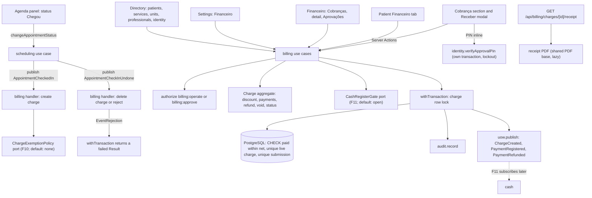

# Technical Specification: F09. Billing and Payments

**Complexity:** complex

## 1. Technical Overview

**What.** A new `billing` module in the **rich** tier, as the architecture defines it (section 3). It has a pure `domain` layer with a `Charge` aggregate and a state machine, plus a repository port with a Prisma adapter. It covers:
- **Automatic charges.** When an appointment moves to "Chegou", a synchronous handler of `AppointmentCheckedIn` creates an "Em aberto" charge with the appointment's price snapshot. No charge is created when the price is 0 or when the `ChargeExemptionPolicy` port says the appointment is covered by a package (F10). Undoing the check-in within 30 minutes deletes the charge if it has no payments. If it has payments, the undo is refused.
- **Manual charges.** A charge for a patient with one item: a service (price from F03 in the unit's currency, editable) or a free description with an amount.
- **Discounts.** Percentage or fixed amount, computed on the gross amount. A reason is mandatory above 10%. Up to 20%, any billing user applies the discount. Above 20%, the charge stays "Aguardando aprovação de desconto" until a Manager or Administrator approves it, either inline with their personal approval PIN or later from the pending-approvals list. A rejection removes the discount.
- **Payments.**
  - One or more payment lines per submission, each with a method, an amount and installments (credit card only).
  - Partial payments are allowed; overpayment is refused.
  - An idempotency key is sent with every submission.
  - Each payment is attributed to the unit selected in the header, and it must use the same currency as the charge.
  - Managers can backdate a payment up to 7 days.
- **Refunds and voids.** A refund (estorno) is a negative movement dated today, total or partial, with a reason; the original payment is kept. A void (cancelamento) is allowed only when the charge has no active payments, also with a reason. Both are for Managers and Administrators only.
- **Receipt.** A PDF per charge, generated on demand in at most 3 seconds, in the organization's language, with a "not a fiscal document" footer.
- **Screens.**
  - The "Cobrança" section and the "Receber" modal in the agenda side panel.
  - The patient's "Financeiro" tab.
  - Financeiro > Cobranças, with filters and totals.
  - A charge detail page.
  - Financeiro > Aprovações.
  - Configurações > Financeiro (payment methods enabled per country).
  - The "PIN de aprovação" dialog in the user menu.

**Why.** Billing is the first module that writes money, and a bug here becomes a financial discrepancy. So the money invariants are enforced by the database as well as by the domain:
- A charge's paid amount can never exceed its net amount (CHECK on a counter maintained under a row lock).
- An appointment has at most one live charge (partial unique index).
- A payment submission is processed once (unique idempotency key).
- A charge with payments cannot be deleted (foreign key `RESTRICT`).
- No payment is ever deleted (grant).

F10, F11, F12, F13 and F14 read or extend these records. The extension points they need are therefore defined now, with inert defaults (ADR-007, ADR-022):
- `ChargeExemptionPolicy` for packages (F10).
- `CashRegisterGate` for the closed cash register (F11).
- The billing events that the cash register will subscribe to (F11).

**How it fits the codebase.** F09 follows the patterns of F01–F08 and F16:
- Use cases call `authorize`, then `parseInput`, then `withTransaction`, with `audit.record()` and `uow.publish()` in the same transaction.
- `Result` errors carry stable codes and message keys, and the module has catalogs in pt-BR, en and es (ADR-028).
- Money is integer minor units plus a currency through `Money` (ADR-029).
- Payment methods are the stable codes of the country profile, already translated in `common.paymentMethods` (F16).
- Ports use the `definePort` registry (ADR-022) and are wired in `src/composition.ts`.
- The PDF uses the shared base of ADR-024, loaded lazily as in F08.
- Server Actions go through `withRequestContext` and `toActionResult`. Client components are exported from `client.ts` (ADR-027).
- The UI follows "Ink and Paper" (ADR-020). Integration tests run on Testcontainers, and E2E journeys run on Playwright.

New in this feature:
- A domain-event handler can now reject the operation that published the event with a domain error. The transaction turns that rejection into a failed `Result` instead of a 500. This is how a paid charge blocks undoing the check-in.
- The identity module gains a personal approval PIN for Managers and Administrators.
- ADR-034 records these decisions. No new npm dependency is needed.

### Scope

**Included (whole feature; the PRD has no Core/Full split):**
- Automatic charge on check-in, with the package exemption port and deletion on undo within the window.
- Manual charges (service or free description).
- Discounts with the 10% reason rule and the 20% approval rule: inline PIN approval, the pending-approvals list, approve and reject.
- Payment methods configurable per country of the unit, with the country profile as the default.
- Multiple payment lines, partial payments, computed status, no overpayment, idempotency, installments, backdating, unit attribution.
- Void and refund with reasons, receipt PDF, agenda section, receive modal, patient tab, charges list with filters and totals, charge detail, approvals list.
- Integrated from cross-cutting concerns:
  - The permission matrix: `billing:operate` (Administrator, Manager, Front Desk) and `billing:approve` (Administrator, Manager) already exist and are used as they are. Professionals have no access (PRD F01 matrix: "—").
  - A 403 response and a `PERMISSION_DENIED` audit event for every denial, including URL manipulation.
  - An audit event inside the transaction for every mutation.
  - Domain events published inside the transaction.
  - Tenant scoping of every new table.
  - Interface text in the pt-BR, en and es catalogs. Money, dates and numbers go through the formatters.
  - The rule "a unit's country cannot change once it has charges" (PRD F16 error) through a new units port.
- Documentation:
  - PRD F09 clarified in both languages with the interview answers.
  - ADR-034 in both languages.
  - The module dependency graph (`identity → billing`, `services → billing`, `units → billing`, `patients → billing`, `professionals → billing`).
  - Design system patterns for the receive modal, the charge status stamps, the totals footer and the PIN approval fields, in both languages.

**Deferred / not included:**
- Package charges created by sales, and the real exemption policy: F10 calls the public API and registers the policy. F09 ships the API (`origin = PACKAGE`) and the inert default.
- The cash register gate and the cash movements: F11 registers the gate and subscribes to the payment events.
- Dashboards and reports (F12, F13), the timeline and anonymization (F14): they read the billing tables.
- Fiscal invoices (NF-e/NFS-e), card machines or payment gateways, and multi-item charges: not in the PRD (Section 7), or excluded by the interview.
- A receipt that covers several charges: the receipt is per charge (interview).

**Input contracts (Consumes):**
- F06, through the scheduling events `AppointmentCheckedIn` and `AppointmentCheckInUndone` (payload `AppointmentEventPayload`: appointment, patient, professional, service, unit, `priceMinor`, `currency`, actor). The 30-minute undo window is already enforced by scheduling (`UNDO_WINDOW_MINUTES`).
- F03, through `services.getServiceSummaries` and `listActiveServices`: the service's name and its price per currency, used as the default amount of a manual charge.
- F02, through `units.getUnit`, `getSelectedUnit` and `getUnitContact`: the payment unit, its country, currency and time zone, and the receipt address.
- F05, through `patients.getPatientSummaries` and `getPatientIdentity`: names (social name first) and the identity document on the receipt.
- F04, through the professionals public API: professional names for lists and filters.
- F01, through `identity`: `getOrganizationProfile` (name, tax ID, logo) for the receipt, user names, and the new `listApprovers` and `verifyApprovalPin`.
- F16: country profiles (`paymentMethods`, currency), `Money`, formatters and locales.

**Output contracts (Provides):**
- Charge and payment records in `charge`, `payment` and `charge_discount_request`. These hold:
  - the patient, the origin (`APPOINTMENT`, `MANUAL`, `PACKAGE`) with its reference, the service, the professional and the unit;
  - the gross, discount and net amounts, the paid counter and the status;
  - payments and refunds with method, amount, installments, received date, unit and user.
  
  F11, F12, F13 and F14 read them (architecture section 3).
- For F10:
  - `billing.createCharge(ctx, { origin: "PACKAGE", packageId, ... })` and `billing.getChargeStatus(ctx, chargeId)`;
  - the `ChargeExemptionPolicy` port (`billing.registerChargeExemptionPolicy`), whose default exempts nothing.
- For F11:
  - the `CashRegisterGate` port (`billing.registerCashRegisterGate`), whose default is always open;
  - the events below.
- Domain events published inside the transaction: `ChargeCreated`, `ChargeDeleted`, `ChargeDiscountRequested`, `ChargeDiscountApproved`, `ChargeDiscountRejected`, `ChargeVoided`, `PaymentRegistered` and `PaymentRefunded`. The payloads hold IDs, minor amounts, currency, method, unit, received instant and actor, never personal data. There are no subscribers yet.

### Traceability to the PRD

| PRD block (F09) | Where it is specified |
|---|---|
| Consumes | Scope → input contracts; Section 4 (`application/appointment-handlers.ts`, `infrastructure/directory.ts`) |
| Provides | Scope → output contracts; Section 5 (public module API); Section 6 (data model) |
| Capabilities | Section 3 (decisions), Section 5 (actions), Section 6 (constraints) |
| Experience | Section 4 (agenda section, receive modal, patient tab, charges, approvals); Section 5 (UI texts) |
| Error Handling | Section 5 (error codes and pt-BR messages); Section 3 (idempotency, approval, cash gate) |
| Acceptance criteria (Section 9, F09) | Section 7, acceptance tests |
| Cross-Feature Integration (F03, F06, F16 → F09; F09 → F10, F11, F12, F13, F14) | Section 7, cross-feature tests |

## 2. Architecture Impact

### Affected components

| Area | Path | Role |
|---|---|---|
| Module | `src/modules/billing/` | Domain (charge aggregate, discount math, status), application (use cases, handlers, ports), infrastructure (Prisma repository, directory, receipt PDF, default port implementations), UI, messages, public API |
| Event bus and transaction | `src/shared/events/event-bus.ts`, `src/shared/db/transaction.ts` | `EventRejection`: a handler rejects the publishing operation with a `DomainError`, and `withTransaction` returns it as a failed `Result` |
| Identity | `src/modules/identity/` (`application/approval-pin.ts`, `domain/approval-pin.ts`, `ports.ts`, `infrastructure/auth.ts`, `ui/approval-pin-dialog.tsx`, `index.ts`) | Personal approval PIN: set (with the current password), verify with lockout, list approvers |
| Units | `src/modules/units/application/ports.ts`, `units.ts`, `index.ts` | `UnitFinancialRecords` port: the country of a unit with charges or payments cannot change |
| Scheduling UI | `src/modules/scheduling/ui/appointment-panel.tsx`, `agenda-view.tsx` | A `chargeSection` slot (client component prop) rendered after check-in |
| Authorization | `src/shared/authz/permissions.ts` | No new actions; `billing:operate` and `billing:approve` get their callers |
| Navigation | `src/shared/ui/app-shell/navigation.ts`, user menu, shell catalog | "Financeiro" group (Cobranças, Aprovações), "Financeiro" in Settings, "PIN de aprovação" in the user menu |
| Patient page | `src/app/(app)/patients/[patientId]/page.tsx` | "Financeiro" tab for `billing:operate` |
| Routes | `src/app/(app)/financial/**`, `src/app/(app)/settings/billing/**`, `src/app/(app)/schedule/**`, `src/app/api/billing/charges/[chargeId]/receipt/route.ts` | Pages, Server Actions, receipt route |
| Composition | `src/composition.ts` | Catalog, `subscribeBillingEvents(eventBus)`, `registerBillingPorts()` (units port) |
| Tenancy | `src/shared/db/tenant.ts`, `tests/integration/helpers.ts` | Register and truncate the new tables |
| Database | `prisma/schema.prisma`, `prisma/migrations/0011_billing/` | Charges, payments, submissions, discount requests, number sequence, disabled methods; user PIN columns; CHECKs, partial unique indexes, grants |
| Documentation | `docs/prd.{en,pt-BR}.md`, `docs/architecture.{en,pt-BR}.md`, `docs/design-system.{en,pt-BR}.md` | PRD clarifications, ADR-034, module graph, billing patterns |

### Data flow



## 3. Technical Decisions

| Decision | Chosen Approach | Alternative Considered | Trade-off |
|---|---|---|---|
| Module tier | Rich, as the architecture says. The `Charge` aggregate holds the gross, discount and net amounts, the paid counter, the status, the pending discount and the active payments. Commands return `Result` and pending events. Status changes go through the domain only. `ChargeRepository` (port) loads with `FOR UPDATE` and saves with a version check | Simple tier | Balances, approvals and refunds are invariants worth unit testing without a database. |
| Charge status | `PENDING_APPROVAL` ("Aguardando aprovação de desconto"), `OPEN` ("Em aberto"), `PARTIALLY_PAID` ("Parcialmente pago"), `PAID` ("Pago"), `CANCELLED` ("Cancelado"). It is derived from the net amount, the paid amount and the discount state: a pending discount → `PENDING_APPROVAL`; paid 0 → `OPEN`; paid between 0 and net → `PARTIALLY_PAID`; paid = net → `PAID` (this includes net 0 after an approved 100% discount); `CANCELLED` only by a void. It is stored for queries and recomputed by the aggregate on every change | Status as an independent column moved by hand | Status always matches the money. A refund on a `PAID` charge moves it back to `PARTIALLY_PAID` or `OPEN`. |
| Automatic charge | A synchronous handler of `AppointmentCheckedIn`, inside the scheduling transaction (ADR-007). It skips when `priceMinor = 0` or when `ChargeExemptionPolicy.isExempt(uow, payload)` says so. It creates an `APPOINTMENT` charge with the appointment's service, professional, unit, price snapshot and currency, attributed to the actor of the check-in. The partial unique index on `(organization_id, appointment_id)` for live charges makes a second check-in (after an undo) create a new charge, never a duplicate | Create the charge lazily when "Receber" is clicked | PRD: the charge exists from the check-in. It commits or rolls back with the status change. |
| Undo check-in with payments (interview) | The handler of `AppointmentCheckInUndone` locks the charge. Without active payments, it deletes the charge (hard delete; nothing references it, and the content goes to the audit event and the `ChargeDeleted` event). With any payment row, it throws `EventRejection(BILLING_CHECK_IN_UNDO_HAS_PAYMENTS)`, and the undo fails with "Esta cobrança já tem pagamento. Estorne os pagamentos antes de desfazer a chegada." Discount requests are deleted with the charge (cascade). Payments reference the charge with `ON DELETE RESTRICT`, so the database also refuses the deletion | Keep the charge, or mark it "Cancelado" | No orphan payments on an appointment that is back to "Confirmado", and no list full of cancelled charges from mistaken clicks. |
| Handler rejection (ADR-034) | `EventRejection extends Error` carries a `DomainError`. `withTransaction` catches it in the same place as its `RollbackSignal` and returns `fail(error)`. Handlers may throw only this class for expected failures; anything else is still a 500 | A scheduling port that asks billing before undoing | The check happens under the same row lock that payments use, so there is no race between "Receber" and "Desfazer chegada", and scheduling does not learn about charges. |
| Manual charges (interview) | One item per charge: either `serviceId` (the default amount is the service's price in the unit's currency, editable) or a free `description` (1–200 characters) with an amount. The patient is required, the professional is optional, and the unit is the selected unit (it sets the currency). Gross amount > 0 | Several items with quantities | F10–F13 report by service and professional per charge, and a discount never needs to be split. |
| Discount math (interview) | Kind `PERCENT` (value in basis points, 0.01% to 100%) or `AMOUNT` (minor units, 1 to gross). `discount_minor = floor(gross × bp / 10,000)` for a percentage, so rounding never gives more discount. The thresholds use the effective discount with integer arithmetic: reason required when `discount × 100 > gross × 10`; approval required when `discount × 100 > gross × 20`. `net = gross − discount` | Rounding half-up | Integer-only and testable. A fixed amount of 20.01% of the gross needs approval, like a 20.01% percentage. |
| Discount editing (interview) | Allowed only while the charge has no payment rows (`OPEN`, or `PENDING_APPROVAL`). Lowering it to 20% or less (or removing it) withdraws a pending request and applies the change at once. Raising it above 20% creates a new request. Any discount applied by a user with `billing:approve` is approved immediately (method `ROLE`) | Editable with payments | Payments never depend on a discount that may change. |
| Approval (interview) | Above 20%, the receive modal (and the discount dialog) offers two paths. 1) **Inline**: the user chooses a Manager or Administrator from `identity.listApprovers` (active, `billing:approve` role, with a PIN set), and the approver types their PIN. `identity.verifyApprovalPin` runs in its own transaction first (so failed attempts are counted even when the billing change fails). Then the billing transaction records the request as `APPROVED` with method `PIN`, `decided_by` the approver and `requested_by` the user. 2) **Later**: "Enviar para aprovação" records a `PENDING` request, and the charge becomes `PENDING_APPROVAL`. Managers decide in Financeiro > Aprovações: approve (method `LIST`), or reject with a reason | Email and password of the approver | Interview: a personal PIN is fast at the front desk and is never the login password. |
| Approval PIN (interview) | Each Manager or Administrator sets their own 6-digit PIN in "PIN de aprovação" in the user menu. Setting it requires the current password. Weak PINs (one repeated digit, ascending or descending sequences) are refused. The PIN is stored as an argon2 hash on `app_user` (same parameters as passwords). Verification: 5 wrong PINs lock that approver's PIN for 15 minutes; a success resets the counter. Every set, failure, lock and success is audited (`UPDATE` of the user, `PERMISSION_DENIED` with `reason: "APPROVAL_PIN_INVALID"`). The PIN is cleared when the user is deactivated or loses the role | PIN set by an administrator | Each approver owns their PIN. The PIN is never seen by others. |
| Rejection (interview) | A rejection needs a reason (3–500 characters). It sets the request to `REJECTED`, removes the discount (net = gross) and moves the charge back to `OPEN`, ready to receive payments. The front desk can propose another discount. The request history stays in `charge_discount_request` and in the audit | A "rejected" status that blocks payments | Payments are never stuck after a decision. |
| Payment methods (interview) | Stable codes from the country profile (`BR`: CASH, PIX, DEBIT_CARD, CREDIT_CARD, TRANSFER, OTHER), labelled by `common.paymentMethods`. An organization disables codes per country in Configurações > Financeiro. They are stored as rows in `disabled_payment_method`; with no rows, everything is enabled. At least one method per country stays enabled. Disabling a method does not touch past payments. The receive modal lists the methods enabled for the country of the payment unit | Free-text methods | Reports (F12, F13) group by stable codes in every language. |
| Payment submission and idempotency | The receive modal generates a `submissionKey` (UUID) when it opens and sends it with "Confirmar recebimento". `payment_submission` has `PRIMARY KEY (organization_id, id)`. The use case inserts it first, inside the charge transaction. If the key already exists (found before the insert, or through a unique violation under concurrency), it returns the payments recorded under that key, without any change. A new modal opening produces a new key | Deduplicate by amount and time | PRD: a resubmission within 60 seconds returns the payment already recorded. Any later resubmission of the same key returns it too, which is stricter. |
| No overpayment | The use case locks the charge (`SELECT … FOR UPDATE`), checks that the submission total is at most the balance (`BILLING_PAYMENT_EXCEEDS_BALANCE` with the entered amount and the balance, formatted) and increments `charge.paid_minor`. `CHECK (paid_minor BETWEEN 0 AND net_minor)` guarantees it under any bug | Check only in the application | Two front desk users receiving the same charge at the same time cannot both pass. |
| Unit and currency (interview) | Each payment is attributed to the selected unit (`units.getSelectedUnit`). Without a selection, the modal asks for the unit and pre-fills the charge's unit. The payment unit's currency must equal the charge's currency, otherwise the payment is refused with `BILLING_CURRENCY_MISMATCH`: "A unidade selecionada usa outra moeda (USD). Selecione uma unidade em BRL para receber esta cobrança." Payments store their currency, and a CHECK ties it to the charge (through a composite foreign key) | Convert currencies | No sum across currencies (ADR-029). |
| Payment date | `received_at` defaults to now. Users with `billing:approve` may choose a date and time from 7 days before "today" in the payment unit's time zone up to now. Anyone else sending a different date gets `BILLING_BACKDATE_FORBIDDEN`. `recorded_at` always stores the real instant | Date only | Cash (F11) and reports can use the received instant. The audit keeps the real instant. |
| Installments | `installments` 1–12, required for `CREDIT_CARD`, null for other methods, for information only | Installments for every method | As in the PRD. |
| Refund (interview) | `billing:approve`, a reason of 3–500 characters, and an amount from 1 to the refundable rest of the payment (default: all of it). It creates a `payment` row with `kind = REFUND`, a negative `amount_minor`, the same method, `received_at = now` (today), the unit selected at that moment, and `refunded_payment_id` pointing to the original. It increments the original's `refunded_minor`, under `CHECK (refunded_minor <= amount_minor)`, and decreases the charge's `paid_minor`. The original row never changes otherwise, and its state is shown as "Estornado" or "Estornado parcialmente" | Total refunds only, in the original unit | The cash register (F11) of the unit where the money leaves sees the outflow. |
| Void | `billing:approve` and a reason of 3–500 characters. Refused with "Estorne os pagamentos antes de cancelar esta cobrança." while `paid_minor > 0`. A charge whose payments were all refunded can be voided. A void withdraws a pending discount request. A voided charge accepts nothing else | Void with an automatic refund | As in the PRD. Money moves only through explicit refunds. |
| Cash register gate | `CashRegisterGate.assertOpen(uow, { unitId, receivedAt })` is declared by billing. It is called for payments and refunds before any write, and returns `BILLING_CASH_REGISTER_CLOSED` with the unit name. The default implementation always allows; F11 registers the real one | Add it in F11 | The PRD message and the flow exist now. F11 only plugs in. |
| Package exemption | `ChargeExemptionPolicy.isExempt(uow, { appointmentId, patientId, serviceId })` returns `Promise<boolean>` and never throws for "not exempt" (Liskov, architecture 11). The default returns false | Billing reads packages | No cycle (architecture section 3). |
| Charge number | A per-organization yearly sequence: `charge_number_sequence (organization_id, year)` incremented with `INSERT … ON CONFLICT DO UPDATE … RETURNING`. The number is formatted as `2026-000123` and shown on lists and receipts. Deleted charges leave gaps (it is not a fiscal number) | A global sequence | Short, human-readable, and concurrency-safe. |
| Receipt (interview) | One receipt per charge, generated on demand, never stored. `GET /api/billing/charges/[chargeId]/receipt` checks `billing:operate` and renders a PDF on the shared base (ADR-024). The layout file is loaded lazily, as in F08. Contents: the organization's name, tax ID and logo; the payment unit's address; the receipt number (charge number); the patient's display name and identity document; the item; gross, discount and net; each active payment (method, installments, date, unit) and each refund; the amount received and the balance; and the footer "Este recibo não é um documento fiscal." Language: the organization's default locale; amounts in the charge's currency. Target ≤ 3 s, asserted by a test | Receipt per payment, or stored in Documents | Interview. The receipt always reflects the current state. |
| Agenda integration | The scheduling panel accepts a `chargeSection` client component prop. The schedule route passes billing's `ChargeSection` through a small client wrapper in `src/app/(app)/schedule/`, so scheduling never imports billing. `ChargeSection` loads its own data (`getAppointmentChargeAction`) when the appointment is `CHECKED_IN`, `IN_PROGRESS` or `COMPLETED` and the user can `billing:operate`. It shows the status, net amount and balance, "Receber" and "Recibo", or "Sem cobrança" when there is none | A scheduling port for charge data | Billing depends on scheduling (events), so the dependency cannot go the other way. The app layer composes both. |
| Unit country lock | Units declares `UnitFinancialRecords.hasAnyInUnit(organizationId, unitId)`, default false. Billing registers an implementation that checks charges and payments in the unit. `updateUnit` refuses a country change with the existing `UNITS_COUNTRY_LOCKED` when either scheduling or billing has records | Billing calls units | PRD F16 error: "…que já tem agendamentos, cobranças ou caixas." The ports.ts comment already plans it. |
| Domain events | `BILLING_EVENTS` (past tense) published with `uow.publish` by every use case and handler. The payload holds `chargeId`, `paymentId`, `patientId`, `unitId`, `amountMinor`, `currency`, `method`, `receivedAt` and `actorUserId` | Outbox messages | F11 needs synchronous consistency (a payment and its cash movement commit together). |

### Assumptions

These were decided during this spec rather than by the PRD, and can be overridden:
- **Charge status labels.** pt-BR "Aguardando aprovação de desconto", "Em aberto", "Parcialmente pago", "Pago", "Cancelado", written as text stamps (design system: states as text).
- **Professionals.** They have no access to billing, following the PRD F01 matrix. The agenda section is hidden for them.
- **Payment methods settings.** They use `setup:manage` (Administrator and Manager), like the other settings pages.
- **PIN length.** Exactly 6 digits. The PIN is cleared when the user is deactivated or changes to a role without `billing:approve`.
- **Approvers list.** Active users with role Administrator or Manager and a PIN set, ordered by name. When none has a PIN, the inline path shows "Nenhum gestor com PIN cadastrado. Envie para aprovação." and only "Enviar para aprovação" remains.
- **Pending approvals.** No email. The "Aprovações" navigation entry shows the pending count as text ("Aprovações (3)").
- **Charges list.**
  - The default period is today, in the selected unit's time zone, for the selected unit. Filters: period (up to 1 year), unit, status, professional, payment method.
  - The period refers to the charge's creation date. The payment-method filter keeps charges with at least one payment in that method.
  - 50 rows per page with "Carregar mais".
  - The footer shows gross, discount, net, received and balance totals over the whole filtered set, one line per currency.
- **Patient tab.** Open charges (`PENDING_APPROVAL`, `OPEN`, `PARTIALLY_PAID`) come first, with the total due per currency, followed by the history, newest first, with the payments under each charge.
- **Charge detail.** `/financial/charges/[chargeId]` shows the summary, discount history, payments and refunds, and the actions allowed for the user (Receber, Desconto, Recibo, Estornar, Cancelar cobrança).
- **Manual charge entry points.** "Nova cobrança" on Financeiro > Cobranças (the primary button there) and on the patient's Financeiro tab.
- **Messages not given by the PRD.** The pt-BR texts for PIN, rejection, currency, backdating, refund limits and settings were written in the PRD's tone (Section 5) and can be reviewed.
- **Agenda event payload.** `priceMinor` and `currency` in the check-in event are the appointment's snapshot (F06). The charge never reads the current service price for appointments.

### Open points
- **PRD update.** The interview answers (approval PIN, discount rules on the gross and locked after payments, rejection behavior, per-country method enabling, undo blocked with payments, receipt per charge, currency rule, partial refunds in the selected unit, one item per charge) clarify PRD F09. The PRD is updated in both languages in the first stage of the plan.

## 4. Component Overview

### Frontend

| File Path | New/Modified | Purpose | Key Responsibilities |
|---|---|---|---|
| `src/app/(app)/schedule/page.tsx`, `agenda-client.tsx` | Modified/New | Agenda composition | Passes billing's `ChargeSection` to `AgendaView` through a client wrapper; loads `canOperateBilling` |
| `src/app/(app)/schedule/billing-actions.ts` | New | Server Actions | `getAppointmentChargeAction`, `getReceiveOptionsAction`, `receivePaymentAction` |
| `src/modules/scheduling/ui/appointment-panel.tsx`, `agenda-view.tsx` | Modified | Slot | Render the optional `chargeSection` component with `{ appointmentId, status }` after check-in |
| `src/app/(app)/patients/[patientId]/page.tsx`, `financial/actions.ts` | Modified/New | Patient tab | "Financeiro" tab for `billing:operate`; actions for list, manual charge and receiving |
| `src/app/(app)/financial/charges/page.tsx`, `actions.ts` | New | Charges list | Filters in the URL, table, totals, "Nova cobrança" |
| `src/app/(app)/financial/charges/[chargeId]/page.tsx` | New | Charge detail | Summary, history, actions |
| `src/app/(app)/financial/approvals/page.tsx`, `actions.ts` | New | Approvals | Pending list; approve and reject (`billing:approve`) |
| `src/app/(app)/settings/billing/page.tsx`, `actions.ts` | New | Settings | Payment methods per country used by the organization's units (`setup:manage`) |
| `src/app/api/billing/charges/[chargeId]/receipt/route.ts` | New | Receipt | `GET`; authorizes and streams the PDF inline |
| `src/modules/billing/ui/charge-section.tsx` | New | Agenda section | Status stamp, net and balance, "Receber", "Recibo", "Sem cobrança" |
| `src/modules/billing/ui/receive-dialog.tsx` | New | Receive modal | Summary (item, gross), discount fields, payment lines (method, amount, installments), unit when none is selected, date for managers, live balance, "Confirmar recebimento", toast "Pagamento registrado" with "Imprimir recibo" |
| `src/modules/billing/ui/discount-fields.tsx`, `approval-fields.tsx` | New | Discount and approval | Percent/amount toggle, value, reason (required above 10%), the "needs approval" notice; approver select + PIN, or "Enviar para aprovação" |
| `src/modules/billing/ui/payment-lines.ts` | New | Modal state | Pure functions for lines, totals and remaining balance with `Money` |
| `src/modules/billing/ui/charges-table.tsx`, `charges-filters.tsx`, `charges-totals.tsx` | New | List | Number, date, patient, item, professional, unit, net, received, balance, status stamp; filters; totals per currency |
| `src/modules/billing/ui/charge-detail.tsx`, `refund-dialog.tsx`, `void-dialog.tsx`, `discount-dialog.tsx` | New | Detail and actions | Payments with refund state; dialogs with mandatory reasons and amount limits |
| `src/modules/billing/ui/new-charge-dialog.tsx` | New | Manual charge | Patient (when not fixed), service or description, amount (pre-filled from the service), professional |
| `src/modules/billing/ui/approvals-table.tsx` | New | Approvals | Charge, patient, gross, requested discount and percent, reason, requester, date; "Aprovar", "Rejeitar" with a reason |
| `src/modules/billing/ui/billing-tab.tsx` | New | Patient tab | Open charges with the total due, history, "Nova cobrança" |
| `src/modules/billing/ui/payment-methods-panel.tsx` | New | Settings | A table per country with a checkbox per method |
| `src/modules/billing/ui/charge-status.tsx` | New | Stamp | Status as text with the semantic tone |
| `src/modules/identity/ui/approval-pin-dialog.tsx` | New | User menu | Current password, new PIN, confirmation; "PIN de aprovação salvo" |
| `src/shared/ui/app-shell/navigation.ts`, user menu, `src/shared/i18n/messages/*.json` (shell) | Modified | Navigation | "Financeiro" group with "Cobranças" (`billing:operate`) and "Aprovações" (`billing:approve`); "Financeiro" under Settings; "PIN de aprovação" in the user menu for `billing:approve`; a `wallet` icon |

### Backend

| File Path | New/Modified | Purpose | Key Responsibilities |
|---|---|---|---|
| `src/modules/billing/domain/limits.ts` | New | Constants | 10% reason, 20% approval, 12 installments, 7-day backdating, 3–500-character reasons, 200-character description, 3-second receipt target, 50 per page, 1-year period (PRD references) |
| `src/modules/billing/domain/discount.ts` | New | Discount math | `discountMinor(gross, kind, value)`, `needsReason`, `needsApproval` with integer arithmetic |
| `src/modules/billing/domain/charge.ts` | New | Aggregate | `create`, `applyDiscount`, `approveDiscount`, `rejectDiscount`, `registerPayments`, `refund`, `void`, `canDeleteOnUndo`, derived status, pending events |
| `src/modules/billing/domain/status.ts`, `errors.ts`, `events.ts` | New | Domain support | Status derivation and labels; error factories with message keys; `BILLING_EVENTS` and payload types |
| `src/modules/billing/application/ports.ts` | New | Ports | `ChargeRepository`, `ChargeExemptionPolicy`, `CashRegisterGate`, `BillingDirectory`, `ReceiptRenderer`, `ApprovalVerifier`, clock |
| `src/modules/billing/application/schemas.ts`, `policies.ts` | New | Validation and access | Zod schemas; `authorize` wrappers; denial audit |
| `src/modules/billing/application/appointment-handlers.ts` | New | Event handlers | `onAppointmentCheckedIn`, `onAppointmentCheckInUndone`; `subscribeBillingEvents(bus)` |
| `src/modules/billing/application/charges.ts` | New | Use cases | `createCharge` (manual and package origins), `getChargeStatus` |
| `src/modules/billing/application/discounts.ts` | New | Use cases | `setDiscount` (with optional inline approval), `approveDiscount`, `rejectDiscount`, `listPendingApprovals` |
| `src/modules/billing/application/payments.ts` | New | Use cases | `receivePayment` (optional discount + lines, idempotency, currency, date, gate), `refundPayment`, `voidCharge` |
| `src/modules/billing/application/queries.ts` | New | Reads | `getAppointmentCharge`, `getCharge`, `listCharges` (filters, cursor, totals), `listPatientCharges`, `getReceiveOptions` |
| `src/modules/billing/application/payment-methods.ts` | New | Use cases | `listPaymentMethodSettings`, `setPaymentMethodEnabled`, `enabledMethodsFor(country)` |
| `src/modules/billing/application/receipt.ts` | New | Use case | `renderReceipt` (authorize, assemble, render with a 10-second timeout) |
| `src/modules/billing/infrastructure/prisma-charge-repository.ts` | New | Repository | Load with `FOR UPDATE`, save charge, payments, requests, submissions; number sequence |
| `src/modules/billing/infrastructure/directory.ts` | New | Directory | Public APIs of patients, services, units, professionals, identity |
| `src/modules/billing/infrastructure/receipt-pdf.tsx`, `receipt-renderer.ts` | New | PDF | Receipt layout on `PdfDocument`; lazy import |
| `src/modules/billing/infrastructure/no-exemptions.ts`, `open-cash-register.ts`, `unit-financial-records.ts` | New | Port implementations | Defaults for F10 and F11; the units port implementation |
| `src/modules/billing/messages/{pt-BR,en,es}.json`, `catalog.ts` | New | Catalogs | Every error, label and toast in three languages |
| `src/modules/billing/index.ts`, `client.ts` | New | Public API | `billing` use cases bound to deps, `createBilling(adjust)` for tests, port registration, events, catalog, server UI; client components |
| `src/shared/events/event-bus.ts`, `src/shared/db/transaction.ts` | Modified | Rejection | `EventRejection` class; caught by `withTransaction` |
| `src/modules/identity/domain/approval-pin.ts` | New | PIN rules | Format and weak-PIN check; lockout arithmetic (5 attempts, 15 minutes) |
| `src/modules/identity/application/approval-pin.ts` | New | Use cases | `setApprovalPin` (current password), `verifyApprovalPin`, `listApprovers`; PIN cleared on deactivation or role change |
| `src/modules/identity/application/ports.ts`, `infrastructure/auth.ts` | Modified | Credential check | `AuthGateway.verifyPassword(userId, password)` and argon2 hashing for the PIN |
| `src/modules/identity/application/users.ts` | Modified | Users | Clear the PIN on deactivation and on a role change without `billing:approve` |
| `src/modules/units/application/ports.ts`, `units.ts`, `index.ts` | Modified | Country lock | `UnitFinancialRecords` port and `registerUnitFinancialRecords` |
| `src/composition.ts`, `src/shared/db/tenant.ts`, `tests/integration/helpers.ts` | Modified | Wiring and tenancy | Catalog, subscriptions, ports; new tables registered and truncated |
| `src/scripts/seed-demo.ts` | Modified | Demo data | Charges in every status, a pending discount, a refund, PINs for the demo manager |

### Database

| Migration File | Tables Affected | Operation | Notes |
|---|---|---|---|
| `prisma/migrations/0011_billing/migration.sql` | `charge`, `payment`, `payment_submission`, `charge_discount_request`, `charge_number_sequence`, `disabled_payment_method`, `app_user` | CREATE, ALTER, GRANT | Generated by Prisma, plus hand-written CHECKs, partial unique indexes, composite foreign keys and grants (no `DELETE` on payments, submissions or requests) |

## 5. API Contracts

All actions return the F01 `ActionResult` envelope, with errors translated by `toActionResult(result, ctx.locale, "billing")`. The receipt route returns a PDF or a JSON error with its HTTP status.

Permissions:
- `billing:operate` (Administrator, Manager, Front Desk): read charges, create manual charges, apply discounts up to 20% (or request more), receive payments, print receipts.
- `billing:approve` (Administrator, Manager): approve and reject discounts, apply discounts above 20% directly, void, refund, backdate, set an approval PIN.
- `setup:manage`: payment methods settings.
- A denial records `PERMISSION_DENIED` and returns `AUTHZ_FORBIDDEN` (403).

### Error codes

| Code | HTTP Status | pt-BR message |
|---|---|---|
| `BILLING_CHARGE_NOT_FOUND` | 404 | "Cobrança não encontrada." |
| `BILLING_CHARGE_STALE` | 409 | "Esta cobrança foi alterada por outra pessoa. Recarregue para ver a versão mais recente." |
| `BILLING_CHARGE_CANCELLED` | 409 | "Esta cobrança está cancelada." |
| `BILLING_CHARGE_ALREADY_PAID` | 409 | "Esta cobrança já está paga." |
| `BILLING_PAYMENT_EXCEEDS_BALANCE` | 409 | "O valor informado ({amount}) é maior que o saldo em aberto ({balance})." |
| `BILLING_DISCOUNT_PENDING_APPROVAL` | 409 | "Esta cobrança está aguardando aprovação de desconto e ainda não pode receber pagamentos." |
| `BILLING_DISCOUNT_NEEDS_APPROVAL` | 409 | "Descontos acima de 20% precisam da aprovação de um gestor." (the modal then shows the approval fields) |
| `BILLING_DISCOUNT_REASON_REQUIRED` | 400 | "Informe o motivo do desconto (obrigatório acima de 10%)." |
| `BILLING_DISCOUNT_INVALID` | 400 | "O desconto deve ser maior que zero e não pode passar do valor da cobrança." |
| `BILLING_DISCOUNT_LOCKED` | 409 | "O desconto não pode ser alterado depois que a cobrança recebeu pagamentos." |
| `BILLING_NO_PENDING_DISCOUNT` | 409 | "Esta cobrança não tem desconto aguardando aprovação." |
| `BILLING_APPROVER_INVALID` | 400 | "Escolha um gestor ou administrador ativo com PIN cadastrado." |
| `APPROVAL_PIN_INVALID` (identity) | 403 | "PIN incorreto." |
| `APPROVAL_PIN_LOCKED` (identity) | 429 | "PIN bloqueado por 15 minutos após 5 tentativas incorretas." |
| `APPROVAL_PIN_WEAK` (identity) | 400 | "Escolha um PIN de 6 dígitos que não seja uma sequência nem números repetidos." |
| `AUTH_INVALID_CREDENTIALS` (identity, existing) | 401 | Current password wrong when setting the PIN |
| `BILLING_CHARGE_HAS_PAYMENTS` | 409 | "Estorne os pagamentos antes de cancelar esta cobrança." |
| `BILLING_CHECK_IN_UNDO_HAS_PAYMENTS` | 409 | "Esta cobrança já tem pagamento. Estorne os pagamentos antes de desfazer a chegada." |
| `BILLING_REASON_REQUIRED` | 400 | "Informe o motivo (mínimo de 3 caracteres)." |
| `BILLING_AMOUNT_INVALID` | 400 | "Informe um valor maior que zero." |
| `BILLING_PAYMENT_METHOD_INVALID` | 400 | "Escolha uma forma de pagamento ativa." |
| `BILLING_INSTALLMENTS_INVALID` | 400 | "Informe de 1 a 12 parcelas para cartão de crédito." |
| `BILLING_BACKDATE_FORBIDDEN` | 403 | "Somente gestores podem registrar pagamentos com outra data." |
| `BILLING_PAYMENT_DATE_INVALID` | 400 | "A data do pagamento deve estar entre {min} e agora." |
| `BILLING_UNIT_REQUIRED` | 400 | "Selecione a unidade onde o pagamento foi recebido." |
| `BILLING_CURRENCY_MISMATCH` | 409 | "A unidade selecionada usa outra moeda ({currency}). Selecione uma unidade em {chargeCurrency} para receber esta cobrança." |
| `BILLING_PAYMENT_NOT_FOUND` | 404 | "Pagamento não encontrado." |
| `BILLING_REFUND_EXCEEDS` | 409 | "O valor do estorno ({amount}) é maior que o valor ainda estornável deste pagamento ({available})." |
| `BILLING_NOT_REFUNDABLE` | 409 | "Este pagamento já foi estornado." |
| `BILLING_CASH_REGISTER_CLOSED` | 409 | "O caixa da unidade {unit} de hoje já foi fechado. Solicite a reabertura a um gestor." |
| `BILLING_SERVICE_INVALID` | 400 | "Escolha um serviço ativo." |
| `BILLING_PATIENT_INVALID` | 400 | "Escolha um paciente ativo." |
| `BILLING_PAYMENT_METHODS_EMPTY` | 409 | "Mantenha ao menos uma forma de pagamento ativa para {country}." |
| `BILLING_RECEIPT_FAILED` | 503 | "Não foi possível gerar o recibo. Tente novamente." |
| `VALIDATION_FAILED`, `AUTHZ_FORBIDDEN`, `AUTH_UNAUTHENTICATED` | — | As in F01 |

Other texts in the catalogs:
- Section and modal: "Cobrança", "Receber", "Recibo", "Sem cobrança", "Confirmar recebimento", "Adicionar forma de pagamento", "Saldo restante", "Desconto", "Percentual", "Valor", "Motivo do desconto", "Parcelas", "Data do pagamento", "Unidade do recebimento".
- Approval: "Aprovar agora com PIN", "Gestor", "PIN", "Enviar para aprovação", "Nenhum gestor com PIN cadastrado. Envie para aprovação.".
- Toasts: "Pagamento registrado" with the action "Imprimir recibo"; "Desconto enviado para aprovação", "Desconto aprovado", "Desconto rejeitado", "Cobrança criada", "Cobrança cancelada", "Estorno registrado", "Formas de pagamento salvas", "PIN de aprovação salvo".
- Lists: "Cobranças", "Aprovações", "Nova cobrança", "Total em aberto", "Bruto", "Desconto", "Líquido", "Recebido", "Saldo", "Estornado", "Estornado parcialmente", "Carregar mais"; empty states "Nenhuma cobrança no período.", "Nenhum desconto aguardando aprovação.", "Nenhuma cobrança para este paciente."
- Receipt: "Recibo", "Nº", "Paciente", "Item", "Pagamentos", "Estornos", "Total recebido", "Saldo", "Este recibo não é um documento fiscal."

### Action: Receive payment (`receivePaymentAction`)
- **Authentication:** session; `billing:operate`. A discount above 20% needs `billing:approve` or a valid approver PIN. A date other than now needs `billing:approve`.

| Field | Type | Required | Validation | Description |
|---|---|---|---|---|
| `chargeId` | uuid | Yes | — | Charge |
| `version` | integer | Yes | ≥ 1 | Optimistic lock |
| `submissionKey` | uuid | Yes | — | Idempotency key generated when the modal opens |
| `unitId` | uuid | Yes | Active unit, same currency as the charge | Payment unit (the selected unit) |
| `discount` | object or null | No | `{ kind: "PERCENT" \| "AMOUNT", value: int, reason?: string }` | Applied before the payments when it differs from the current one |
| `approval` | object | No | `{ approverUserId: uuid, pin: "^[0-9]{6}$" }` | Inline approval of a discount above 20% |
| `receivedAt` | ISO datetime | No | Within 7 days before today, not in the future | Managers only |
| `payments` | array | Yes | 1–6 lines | Payment lines |
| `payments[].method` | string | Yes | Enabled code for the unit's country | Method |
| `payments[].amountMinor` | integer | Yes | > 0; sum ≤ balance after the discount | Amount |
| `payments[].installments` | integer | Conditional | 1–12 for `CREDIT_CARD`, absent otherwise | Installments |

```json
{
  "chargeId": "01928f9e-7a31-7c2e-9d10-4b6a1c0e2f11",
  "version": 1,
  "submissionKey": "0b3f0c64-5f7e-4d0a-9a51-2a8e1f3c9d77",
  "unitId": "01928f9e-6b00-7000-8000-00000000a001",
  "discount": { "kind": "PERCENT", "value": 1500, "reason": "Paciente antigo" },
  "payments": [
    { "method": "PIX", "amountMinor": 10000 },
    { "method": "CREDIT_CARD", "amountMinor": 15500, "installments": 3 }
  ]
}
```

| Field | Type | Description |
|---|---|---|
| `charge` | `ChargeView` | Charge after the change (status, gross, discount, net, paid, balance, currency, version) |
| `payments` | `PaymentView[]` | Payments recorded by this submission (or by the earlier submission with the same key) |
| `replayed` | boolean | True when the key had already been processed |
| `receiptUrl` | string | `/api/billing/charges/{id}/receipt` |

```json
{
  "ok": true,
  "value": {
    "charge": {
      "id": "01928f9e-7a31-7c2e-9d10-4b6a1c0e2f11", "number": "2026-000123", "status": "PAID",
      "grossMinor": 30000, "discountMinor": 4500, "netMinor": 25500, "paidMinor": 25500,
      "balanceMinor": 0, "currency": "BRL", "version": 3
    },
    "payments": [
      { "id": "01928fa0-…", "method": "PIX", "amountMinor": 10000, "installments": null, "unitId": "01928f9e-…a001", "receivedAt": "2026-10-08T13:05:00Z" },
      { "id": "01928fa0-…", "method": "CREDIT_CARD", "amountMinor": 15500, "installments": 3, "unitId": "01928f9e-…a001", "receivedAt": "2026-10-08T13:05:00Z" }
    ],
    "replayed": false,
    "receiptUrl": "/api/billing/charges/01928f9e-7a31-7c2e-9d10-4b6a1c0e2f11/receipt"
  }
}
```

Behavior, in one transaction:
1. Look up the submission key; if it exists, return its payments with `replayed: true`.
2. Lock the charge and check the version.
3. Apply the discount. This may return `BILLING_DISCOUNT_NEEDS_APPROVAL` when there is no PIN and no `billing:approve`, or it may record an approved request.
4. Check the status. A pending discount gives `BILLING_DISCOUNT_PENDING_APPROVAL`.
5. Check the unit's currency, the methods and installments, the date and the cash gate.
6. Insert the submission and the payments, then update the counter and the status.
7. Record the audit event and publish `PaymentRegistered` once per line.

The PIN is verified before the transaction, by `identity.verifyApprovalPin`.

Errors: `BILLING_CHARGE_NOT_FOUND`, `BILLING_CHARGE_STALE`, `BILLING_CHARGE_CANCELLED`, `BILLING_CHARGE_ALREADY_PAID`, `BILLING_PAYMENT_EXCEEDS_BALANCE`, `BILLING_DISCOUNT_*`, `APPROVAL_PIN_*`, `BILLING_APPROVER_INVALID`, `BILLING_PAYMENT_METHOD_INVALID`, `BILLING_INSTALLMENTS_INVALID`, `BILLING_BACKDATE_FORBIDDEN`, `BILLING_PAYMENT_DATE_INVALID`, `BILLING_UNIT_REQUIRED`, `BILLING_CURRENCY_MISMATCH`, `BILLING_CASH_REGISTER_CLOSED`, `AUTHZ_FORBIDDEN`.

### Action: Set discount (`setDiscountAction`)
- **Authentication:** `billing:operate`.

```json
{ "chargeId": "01928f9e-…", "version": 2, "discount": { "kind": "AMOUNT", "value": 9000, "reason": "Cortesia" }, "submitForApproval": true }
```

`discount: null` removes it. Above 20%, the request needs `approval` (PIN), `submitForApproval: true` (the charge becomes `PENDING_APPROVAL`), or the `billing:approve` role. Otherwise the action returns `BILLING_DISCOUNT_NEEDS_APPROVAL`. Response: `{ charge: ChargeView, request: { id, status, method } | null }`. Errors: as in the discount part of "Receive payment", plus `BILLING_DISCOUNT_LOCKED`.

### Actions: Approve and reject (`approveDiscountAction`, `rejectDiscountAction`)
- **Authentication:** `billing:approve`.

```json
{ "chargeId": "01928f9e-…", "requestId": "01928fa2-…", "version": 3 }
{ "chargeId": "01928f9e-…", "requestId": "01928fa2-…", "version": 3, "reason": "Desconto acima da política da clínica" }
```

Response: `{ charge: ChargeView }`. Errors: `BILLING_NO_PENDING_DISCOUNT`, `BILLING_CHARGE_STALE`, `BILLING_REASON_REQUIRED`, `AUTHZ_FORBIDDEN`.

### Action: Create manual charge (`createChargeAction`)
- **Authentication:** `billing:operate`.

| Field | Type | Required | Validation | Description |
|---|---|---|---|---|
| `patientId` | uuid | Yes | Active, visible patient | Patient |
| `unitId` | uuid | Yes | Active unit | Sets the currency |
| `serviceId` | uuid | One of | Active service | Service item |
| `description` | string | One of | 1–200 characters | Free item |
| `grossMinor` | integer | Yes | > 0 | Amount (pre-filled from the service price in the unit's currency) |
| `professionalId` | uuid | No | Active professional | Optional attribution |

```json
{ "patientId": "01928f…", "unitId": "01928f…a001", "description": "Venda de protetor solar", "grossMinor": 8990 }
```

Response: `{ charge: ChargeView }` with `origin: "MANUAL"` and `status: "OPEN"`. Errors: `BILLING_PATIENT_INVALID`, `BILLING_SERVICE_INVALID`, `BILLING_AMOUNT_INVALID`, `VALIDATION_FAILED`, `AUTHZ_FORBIDDEN`.

### Actions: Refund and void (`refundPaymentAction`, `voidChargeAction`)
- **Authentication:** `billing:approve`.

```json
{ "chargeId": "01928f…", "paymentId": "01928fa0-…", "version": 4, "amountMinor": 5000, "reason": "Paciente desistiu do procedimento", "unitId": "01928f…a001" }
{ "chargeId": "01928f…", "version": 5, "reason": "Cobrança lançada em duplicidade" }
```

The refund response is `{ charge: ChargeView, refund: PaymentView }`, where the refund has a negative `amountMinor` and `receivedAt` = now. The void response is `{ charge: ChargeView }` with `status: "CANCELLED"`. Errors: `BILLING_PAYMENT_NOT_FOUND`, `BILLING_REFUND_EXCEEDS`, `BILLING_NOT_REFUNDABLE`, `BILLING_CURRENCY_MISMATCH`, `BILLING_CASH_REGISTER_CLOSED`, `BILLING_CHARGE_HAS_PAYMENTS`, `BILLING_REASON_REQUIRED`, `BILLING_CHARGE_STALE`, `AUTHZ_FORBIDDEN`.

### Reads
- `getAppointmentChargeAction(appointmentId)` returns `ChargeView | null`, and `getReceiveOptionsAction(chargeId)` returns `{ charge, unit: { id, name, currency, country } | null, units, methods: string[], approvers: { id, name }[], canApprove, canBackdate, minReceivedAt }`.
- `listChargesAction(filters, cursor)` returns `{ items: ChargeRow[], nextCursor, totals: { currency, grossMinor, discountMinor, netMinor, paidMinor, balanceMinor }[] }`. Filters: `from`, `to` (calendar dates), `unitId`, `status[]`, `professionalId`, `method`.
- `listPatientChargesAction(patientId)` returns `{ open: ChargeRow[], dueByCurrency: { currency, balanceMinor }[], history: ChargeWithPayments[] }`.
- `getCharge(ctx, chargeId)` returns the detail with payments, refunds and discount requests.
- `listPendingApprovals(ctx)` returns the pending requests, oldest first.

### Route: GET `/api/billing/charges/[chargeId]/receipt`
- **Authentication:** session; `billing:operate`.
- **Response:** `200` with `Content-Type: application/pdf` and `Content-Disposition: inline; filename="recibo-2026-000123.pdf"`. Errors return JSON: `404 BILLING_CHARGE_NOT_FOUND`, `403 AUTHZ_FORBIDDEN`, `503 BILLING_RECEIPT_FAILED`.

### Settings actions
- `setPaymentMethodEnabledAction({ country: "BR", method: "OTHER", enabled: false })` needs `setup:manage`. Errors: `BILLING_PAYMENT_METHOD_INVALID` (not in the country profile) and `BILLING_PAYMENT_METHODS_EMPTY`.
- `setApprovalPinAction({ currentPassword, pin, confirmation })` (identity) needs `billing:approve` (own user only). Errors: `AUTH_INVALID_CREDENTIALS`, `APPROVAL_PIN_WEAK`, `VALIDATION_FAILED`.

### Public module API (Provides)

`src/modules/billing/index.ts` exports:
- `billing`, with the use cases above bound to their dependencies, including `createCharge` (origins `MANUAL` and `PACKAGE`, the latter with `packageId`) and `getChargeStatus` for F10;
- `registerChargeExemptionPolicy` and `registerCashRegisterGate` (each accepts `null` to restore the default);
- `subscribeBillingEvents(bus)` and `registerBillingPorts()` (the units port);
- `createBilling(adjust)` for tests;
- `BILLING_EVENTS` and the payload types;
- `billingCatalog`;
- the server UI.

`client.ts` exports the client components (`ChargeSection`, `ReceiveDialog`, dialogs). F11–F14 read `charge` and `payment` directly (architecture section 3).

Identity adds `identity.verifyApprovalPin(organizationId, approverUserId, pin)` (its own transaction), `identity.listApprovers(ctx)` and `identity.setApprovalPin(ctx, input)`.

## 6. Data Model

Every table has `organization_id uuid NOT NULL` with a foreign key to `organization`, indexes that start with it, and is registered in `forTenant`. IDs are UUIDv7, generated by the application (`newId()`). Money columns are `bigint` minor units with a `char(3)` currency (ADR-029).

### Table: `charge`

| Column | Type | Nullable | Default | Description |
|---|---|---|---|---|
| `id` | `uuid` | No | - | Primary key |
| `organization_id` | `uuid` | No | - | Tenant |
| `number` | `varchar(12)` | No | - | `2026-000123` |
| `patient_id` | `uuid` | No | - | FK `patient` |
| `origin` | `varchar(12)` | No | - | `APPOINTMENT`, `MANUAL`, `PACKAGE` |
| `appointment_id` | `uuid` | Yes | - | FK `appointment` (origin `APPOINTMENT`) |
| `package_id` | `uuid` | Yes | - | Sold package (origin `PACKAGE`; the FK is added by F10) |
| `service_id` | `uuid` | Yes | - | FK `service` |
| `description` | `varchar(200)` | Yes | - | Free item |
| `professional_id` | `uuid` | Yes | - | FK `professional` |
| `unit_id` | `uuid` | No | - | FK `unit` (appointment unit, or the unit chosen for manual charges) |
| `currency` | `char(3)` | No | - | Currency of every amount |
| `gross_minor` | `bigint` | No | - | Price snapshot or entered amount |
| `discount_kind` | `varchar(8)` | Yes | - | `PERCENT`, `AMOUNT` |
| `discount_value` | `integer` | Yes | - | Basis points or minor units |
| `discount_minor` | `bigint` | No | `0` | Effective discount (approved, or 0 while pending) |
| `discount_reason` | `varchar(500)` | Yes | - | Mandatory above 10% |
| `net_minor` | `bigint` | No | - | `gross − discount` |
| `paid_minor` | `bigint` | No | `0` | Payments minus refunds |
| `status` | `varchar(20)` | No | - | `PENDING_APPROVAL`, `OPEN`, `PARTIALLY_PAID`, `PAID`, `CANCELLED` |
| `cancelled_at` | `timestamptz` | Yes | - | Void instant |
| `cancelled_by_id` | `uuid` | Yes | - | FK `app_user` |
| `cancel_reason` | `varchar(500)` | Yes | - | Void reason |
| `created_by_id` | `uuid` | No | - | FK `app_user` |
| `version` | `integer` | No | `1` | Optimistic lock |
| `created_at`, `updated_at` | `timestamptz` | No | `now()` | Timestamps |

**Indexes and constraints:**

| Name | Definition | Purpose |
|---|---|---|
| `uq_charge_number` | `UNIQUE (organization_id, number)` | Human number |
| `uq_charge_live_appointment` | `UNIQUE (organization_id, appointment_id) WHERE appointment_id IS NOT NULL AND status <> 'CANCELLED'` | One live charge per appointment |
| `uq_charge_currency` | `UNIQUE (organization_id, id, currency)` | Target of the payment composite FK |
| `ix_charge_list` | `(organization_id, created_at DESC, id DESC)` | List and cursor |
| `ix_charge_unit_status` | `(organization_id, unit_id, status, created_at)` | Filters |
| `ix_charge_patient` | `(organization_id, patient_id, created_at DESC)` | Patient tab |
| `ix_charge_pending` | `(organization_id, created_at) WHERE status = 'PENDING_APPROVAL'` | Approvals list and count |
| `ck_charge_amounts` | `CHECK (gross_minor > 0 AND discount_minor BETWEEN 0 AND gross_minor AND net_minor = gross_minor - discount_minor AND paid_minor BETWEEN 0 AND net_minor)` | No overpayment, coherent amounts |
| `ck_charge_origin` | `CHECK ((origin = 'APPOINTMENT') = (appointment_id IS NOT NULL) AND (origin = 'PACKAGE') = (package_id IS NOT NULL))` | Origin reference |
| `ck_charge_item` | `CHECK (service_id IS NOT NULL OR description IS NOT NULL)` | One item |
| `ck_charge_status` | `CHECK (status IN (...))` and `CHECK ((status = 'CANCELLED') = (cancelled_at IS NOT NULL) AND (cancelled_at IS NULL) = (cancel_reason IS NULL))` | Valid status; a void has a reason |
| `ck_charge_discount` | `CHECK ((discount_kind IS NULL) = (discount_value IS NULL))` | Coherent discount |

### Table: `payment`

| Column | Type | Nullable | Default | Description |
|---|---|---|---|---|
| `id` | `uuid` | No | - | Primary key |
| `organization_id` | `uuid` | No | - | Tenant |
| `charge_id` | `uuid` | No | - | Composite FK `(organization_id, charge_id, currency)` → `charge`, `ON DELETE RESTRICT` |
| `kind` | `varchar(8)` | No | - | `PAYMENT`, `REFUND` |
| `refunded_payment_id` | `uuid` | Yes | - | FK `payment` (refunds) |
| `submission_id` | `uuid` | Yes | - | `(organization_id, submission_id)` FK `payment_submission` (payments) |
| `method` | `varchar(20)` | No | - | Country profile code |
| `installments` | `smallint` | Yes | - | 1–12, credit card only |
| `amount_minor` | `bigint` | No | - | Positive for payments, negative for refunds |
| `refunded_minor` | `bigint` | No | `0` | Refunded part of a payment |
| `currency` | `char(3)` | No | - | Equals the charge's currency |
| `unit_id` | `uuid` | No | - | FK `unit`; where the money was received or returned |
| `received_at` | `timestamptz` | No | - | Payment date (backdating for managers); now for refunds |
| `recorded_at` | `timestamptz` | No | `now()` | Real instant |
| `user_id` | `uuid` | No | - | FK `app_user`; who recorded it |
| `reason` | `varchar(500)` | Yes | - | Refund reason |

**Indexes and constraints:** `ix_payment_charge (organization_id, charge_id, received_at)`; `ix_payment_unit_received (organization_id, unit_id, received_at)` (cash register and reports); `ix_payment_method (organization_id, method, charge_id)`. CHECKs:
- `kind` values.
- `(kind = 'PAYMENT' AND amount_minor > 0 AND refunded_payment_id IS NULL AND submission_id IS NOT NULL AND reason IS NULL) OR (kind = 'REFUND' AND amount_minor < 0 AND refunded_payment_id IS NOT NULL AND reason IS NOT NULL AND refunded_minor = 0)`.
- `refunded_minor BETWEEN 0 AND amount_minor` for payments.
- `(method = 'CREDIT_CARD' AND kind = 'PAYMENT') = (installments IS NOT NULL)` and `installments BETWEEN 1 AND 12`.

### Table: `payment_submission`

| Column | Type | Nullable | Default | Description |
|---|---|---|---|---|
| `organization_id` | `uuid` | No | - | Tenant (part of the primary key) |
| `id` | `uuid` | No | - | The client's `submissionKey` (primary key with the organization) |
| `charge_id` | `uuid` | No | - | FK `charge` |
| `user_id` | `uuid` | No | - | Submitter |
| `created_at` | `timestamptz` | No | `now()` | Instant |

### Table: `charge_discount_request`

| Column | Type | Nullable | Default | Description |
|---|---|---|---|---|
| `id` | `uuid` | No | - | Primary key |
| `organization_id` | `uuid` | No | - | Tenant |
| `charge_id` | `uuid` | No | - | FK `charge`, `ON DELETE CASCADE` (charge deleted on undo) |
| `kind`, `value` | `varchar(8)`, `integer` | No | - | Requested discount |
| `discount_minor` | `bigint` | No | - | Requested amount |
| `reason` | `varchar(500)` | Yes | - | Discount reason |
| `status` | `varchar(10)` | No | - | `PENDING`, `APPROVED`, `REJECTED`, `WITHDRAWN` |
| `method` | `varchar(8)` | Yes | - | `ROLE`, `PIN`, `LIST` (approved) |
| `requested_by_id` | `uuid` | No | - | FK `app_user` |
| `requested_at` | `timestamptz` | No | `now()` | Request instant |
| `decided_by_id` | `uuid` | Yes | - | FK `app_user` |
| `decided_at` | `timestamptz` | Yes | - | Decision instant |
| `rejection_reason` | `varchar(500)` | Yes | - | Mandatory when `REJECTED` |

Index `uq_discount_request_pending UNIQUE (organization_id, charge_id) WHERE status = 'PENDING'`. CHECKs on `status`, `method`, and the decision columns (decided rows have an actor and an instant; rejected rows have a reason). Requests are created only for discounts above 20%. Smaller discounts are recorded on the charge and in the audit.

### Table: `charge_number_sequence`

`(organization_id uuid, year smallint, last_value integer NOT NULL)`, primary key `(organization_id, year)`, `CHECK (last_value > 0)`.

### Table: `disabled_payment_method`

`(organization_id uuid, country char(2), method varchar(20), disabled_by_id uuid, disabled_at timestamptz)`, primary key `(organization_id, country, method)`. Enabling a method deletes its row (the runtime role may `DELETE` here).

### Changes to `app_user`

| Column | Type | Nullable | Default | Description |
|---|---|---|---|---|
| `approval_pin_hash` | `varchar(255)` | Yes | - | argon2 hash of the PIN |
| `approval_pin_set_at` | `timestamptz` | Yes | - | Last change |
| `approval_pin_failed_count` | `smallint` | No | `0` | Consecutive failures |
| `approval_pin_locked_until` | `timestamptz` | Yes | - | Lockout end |

### Migration excerpt (hand-written parts)

```sql
-- hand-written: PRD F09 — one live charge per appointment, even under concurrent check-ins.
CREATE UNIQUE INDEX "uq_charge_live_appointment" ON "charge" ("organization_id", "appointment_id")
  WHERE "appointment_id" IS NOT NULL AND "status" <> 'CANCELLED';

-- hand-written: PRD F09 — overpayment is impossible whatever the application does.
ALTER TABLE "charge" ADD CONSTRAINT "ck_charge_amounts" CHECK (
  "gross_minor" > 0 AND "discount_minor" BETWEEN 0 AND "gross_minor"
  AND "net_minor" = "gross_minor" - "discount_minor"
  AND "paid_minor" BETWEEN 0 AND "net_minor");

-- hand-written: a payment always has the currency of its charge (ADR-029).
ALTER TABLE "charge" ADD CONSTRAINT "uq_charge_currency" UNIQUE ("organization_id", "id", "currency");
ALTER TABLE "payment" ADD CONSTRAINT "fk_payment_charge_currency"
  FOREIGN KEY ("organization_id", "charge_id", "currency")
  REFERENCES "charge" ("organization_id", "id", "currency") ON DELETE RESTRICT;

-- hand-written: one pending discount request per charge.
CREATE UNIQUE INDEX "uq_discount_request_pending" ON "charge_discount_request" ("organization_id", "charge_id")
  WHERE "status" = 'PENDING';

-- hand-written: payments, submissions and decisions are never deleted; a charge may be deleted
-- only by the check-in undo, and the RESTRICT foreign key refuses it once a payment exists.
REVOKE DELETE ON "payment", "payment_submission" FROM gcli_app;
```

## 7. Testing Strategy

### Test files

| Test File | Test Type | Target | Coverage Goal |
|---|---|---|---|
| `src/modules/billing/domain/discount.test.ts` | Unit | Discount math and thresholds | All branches, boundaries at 10% and 20% |
| `src/modules/billing/domain/charge.test.ts` | Unit | Aggregate commands and derived status | Every transition and error |
| `src/modules/billing/ui/payment-lines.test.ts` | Unit | Modal lines and remaining balance | Totals, overpayment flag |
| `src/modules/identity/domain/approval-pin.test.ts` | Unit | PIN format, weak PINs, lockout arithmetic | All branches |
| `src/shared/events/event-bus.test.ts` | Unit | `EventRejection` | Rejection propagates |
| `tests/integration/billing/support.ts` | Helper | A clinic with units (BRL and USD), a front desk user, a manager with a PIN, a professional, patients, services, and appointments checked in | — |
| `tests/integration/billing/schema.test.ts` | Integration | Migration | CHECKs, partial unique indexes, composite FK, grants |
| `tests/integration/billing/automatic-charges.test.ts` | Integration | Check-in and undo handlers, exemption port | Every rule |
| `tests/integration/billing/discounts.test.ts` | Integration | Discounts, approvals, PIN | Every rule |
| `tests/integration/billing/payments.test.ts` | Integration | Payments, idempotency, concurrency, currency, date, gate, refunds, voids | Every rule |
| `tests/integration/billing/queries.test.ts` | Integration | Lists, filters, totals, patient tab, tenancy | Every filter |
| `tests/integration/billing/receipt.test.ts` | Integration | Receipt content and time | Content, ≤ 3 s |
| `tests/integration/shared/transaction.test.ts` | Integration | `EventRejection` rolls back and returns the error | — |
| `tests/e2e/f09-billing-and-payments.spec.ts` | E2E | Journeys | 5 journeys |

### Unit tests

| Test Function | Description | Assertions |
|---|---|---|
| `F09: a percentage discount rounds down to the cent` | 15% of R$ 333,33 (`33333 × 1500 / 10000 = 4999.95`) | `discount_minor = 4999`, net `28334` |
| `F09: the reason is required only above 10% and approval only above 20%` | 10.00%, 10.01%, 20.00%, 20.01% as percent and as amount | false/true pairs |
| `F09: a discount cannot exceed the gross amount or be zero` | 0, gross + 1 | `BILLING_DISCOUNT_INVALID` |
| `F09: status follows paid and net amounts` | 0, partial, full, net 0, pending | `OPEN`, `PARTIALLY_PAID`, `PAID`, `PAID`, `PENDING_APPROVAL` |
| `F09: payments are refused while a discount is pending` | Pending charge | `BILLING_DISCOUNT_PENDING_APPROVAL` |
| `F09: a payment above the balance is refused with both amounts` | Balance 200, payment 250 | Error parameters 25000 and 20000 |
| `F09: a refund moves a paid charge back to partially paid` | Paid 300, refund 100 | `PARTIALLY_PAID`, original `refunded_minor` 100 |
| `F09: void needs no active payments and a reason` | With payments; with all refunded | `BILLING_CHARGE_HAS_PAYMENTS`; `CANCELLED` |
| `F09: the discount is locked after a payment` | Partially paid | `BILLING_DISCOUNT_LOCKED` |
| `F09: rejecting a discount removes it and reopens the charge` | Pending 30% | net = gross, `OPEN` |
| `F09: the payment modal computes the remaining balance live` | Lines 100 + 50 on 200 | Remaining 50; 250 flagged as over |
| `F09: weak approval PINs are refused` | `111111`, `123456`, `654321`, `12345a` | Refused; `402719` accepted |
| `F09: the PIN locks after 5 failures for 15 minutes` | 5 failures, then a success at +14 and +15 minutes | Locked; then allowed |

### Acceptance tests (PRD Section 9, F09)

| Test Function | File | Assertions |
|---|---|---|
| `F09: checking in an appointment with a price and no package creates one open charge with the price snapshot` | `automatic-charges.test.ts` | One `charge` `OPEN` with `gross_minor` = snapshot (not the current service price after a change); none for price 0; none when the exemption stub returns true |
| `F09: undoing a check-in within 30 minutes removes the charge only if it has no payments` | `automatic-charges.test.ts` | Without payments → charge deleted, `ChargeDeleted` audited; with a payment → `BILLING_CHECK_IN_UNDO_HAS_PAYMENTS`, the appointment stays `CHECKED_IN` and the charge is kept |
| `F09: front desk applies a 20% discount; above 20% the charge waits for approval and cannot receive payments` | `discounts.test.ts` | 20% → applied, `OPEN`; 25% with `submitForApproval` → `PENDING_APPROVAL`, payment refused; after approval → payment accepted |
| `F09: a discount above 10% cannot be saved without a reason` | `discounts.test.ts` | 10.01% without reason → `BILLING_DISCOUNT_REASON_REQUIRED`; 10% without reason → ok |
| `F09: multiple payments update the status to partially paid and then paid; a payment above the balance is rejected` | `payments.test.ts` | Status sequence; `BILLING_PAYMENT_EXCEEDS_BALANCE` with the pt-BR message "O valor informado (R$ 250,00) é maior que o saldo em aberto (R$ 200,00)." |
| `F09: resubmitting the same payment within 60 seconds does not create a duplicate` | `payments.test.ts` | Same key twice (sequential and concurrent) → one set of payments, second result `replayed: true`, `paid_minor` once |
| `F09: front desk cannot void or refund; a manager can, only with a reason; a refund is a negative movement dated today and keeps the original` | `payments.test.ts` | Front Desk → 403 and `PERMISSION_DENIED`; Manager without reason → `BILLING_REASON_REQUIRED`; refund row negative, `received_at` today, original unchanged except `refunded_minor` |
| `F09: a charge with active payments cannot be voided` | `payments.test.ts` | "Estorne os pagamentos antes de cancelar esta cobrança." |
| `F09: the receipt PDF has organization data, patient, item, amounts, methods and date, generated in 3 seconds or less` | `receipt.test.ts` | Renderer input fields; `%PDF` bytes; time ≤ 3,000 ms |
| `F09: a payment is attributed to the unit selected when it is recorded` | `payments.test.ts` | Charge from unit A, payment with unit B selected → `payment.unit_id` = B |

### Other integration tests

| Test Function | File | Assertions |
|---|---|---|
| `F09: two concurrent payments cannot exceed the balance` | `payments.test.ts` | Two parallel submissions of 150 on 200 → one succeeds, one `BILLING_PAYMENT_EXCEEDS_BALANCE` |
| `F09: the database refuses paid above net and two live charges for one appointment` | `schema.test.ts` | CHECK and unique violations |
| `F09: a charge with payments cannot be deleted and payments cannot be deleted` | `schema.test.ts` | FK RESTRICT; `DELETE` permission denied |
| `F09: a payment in a unit with another currency is refused` | `payments.test.ts` | `BILLING_CURRENCY_MISMATCH` with both currencies |
| `F09: only managers can backdate, up to 7 days` | `payments.test.ts` | Front Desk → `BILLING_BACKDATE_FORBIDDEN`; Manager 8 days → `BILLING_PAYMENT_DATE_INVALID`; 7 days → ok in the unit's time zone |
| `F09: credit card needs 1 to 12 installments; other methods none` | `payments.test.ts` | Validation errors |
| `F09: disabled payment methods are refused and at least one stays enabled` | `payments.test.ts` | `BILLING_PAYMENT_METHOD_INVALID`; `BILLING_PAYMENT_METHODS_EMPTY`; past payments keep their method |
| `F09: a closed cash register blocks payments and refunds through the gate` | `payments.test.ts` | Stub gate → `BILLING_CASH_REGISTER_CLOSED` with the unit name; default gate allows |
| `F09: inline approval with a manager PIN approves the discount and records both users` | `discounts.test.ts` | Request `APPROVED`, `method = PIN`, `requested_by` desk, `decided_by` manager |
| `F09: a wrong PIN is counted even though the discount is not saved, and locks after 5 failures` | `discounts.test.ts` | `APPROVAL_PIN_INVALID` ×5 → `APPROVAL_PIN_LOCKED`; `PERMISSION_DENIED` audited; charge unchanged |
| `F09: setting a PIN needs the current password and is cleared on deactivation` | `discounts.test.ts` | `AUTH_INVALID_CREDENTIALS`; hash null after deactivation |
| `F09: a manager's own discount above 20% is approved at once` | `discounts.test.ts` | `method = ROLE`, `OPEN` |
| `F09: lowering a pending discount to 20% or less withdraws the request` | `discounts.test.ts` | Request `WITHDRAWN`, discount applied |
| `F09: rejecting needs a reason and reopens the charge without discount` | `discounts.test.ts` | Errors and state |
| `F09: a partial refund in the selected unit and a second refund up to the rest` | `payments.test.ts` | Two refunds; a third → `BILLING_REFUND_EXCEEDS` |
| `F09: manual charges take the service price in the unit's currency and accept a free description` | `payments.test.ts` | Default amount; `MANUAL` origin; numbers sequential per year |
| `F09: a second check-in after an undo creates a new charge` | `automatic-charges.test.ts` | New charge with a new number |
| `F09: the charges list filters by period, unit, status, professional and method, with totals per currency` | `queries.test.ts` | Expected rows; totals over the filtered set, BRL and USD separated |
| `F09: the patient tab shows open charges first with the total due` | `queries.test.ts` | Order and totals |
| `F09: professionals cannot read billing` | `queries.test.ts` | 403 and `PERMISSION_DENIED` |
| `F09: billing records are isolated per organization` | `queries.test.ts` | Other organization's IDs → 404; lists empty |
| `F09: every mutation is audited and publishes its event` | `payments.test.ts` | Audit entries and recorded events for create, discount, approve, reject, payment, refund, void, delete |

### Cross-Feature Integration

| Test Function | File | Assertions |
|---|---|---|
| `F06 → F09: the check-in and the charge commit or roll back together` | `automatic-charges.test.ts` | A failing handler (stub repository) leaves the appointment `CONFIRMED` |
| `F03 → F09: manual charges use the current service price; appointment charges keep the snapshot` | `automatic-charges.test.ts` | Price changed after booking: appointment charge uses the snapshot; manual uses the new price |
| `F16 → F09: amounts are in the unit's currency, methods come from the unit's country, and the receipt uses the organization's language` | `receipt.test.ts` | USD unit lists its country's methods; `en` organization → English receipt labels and USD formatting |
| `F09 → F10: package-covered appointments create no charge through the exemption policy, and package charges can be created` | `automatic-charges.test.ts` | Registered stub policy → no charge; `createCharge({ origin: "PACKAGE" })` works |
| `F09 → F11: payments and refunds publish events with unit, method, amount and received date` | `payments.test.ts` | Subscribed test handler receives the payloads in the same transaction |
| `F09 → F16: a unit with charges cannot change its country` | `payments.test.ts` | `UNITS_COUNTRY_LOCKED` after a manual charge in a unit without appointments |
| `F09 → F12/F13/F14: charge and payment records expose patient, origin, service, professional, unit, amounts, status, method, date, unit and user` | `schema.test.ts` | Columns present and filled |

### E2E journeys

| Test Function | Steps | Assertions |
|---|---|---|
| `F09: front desk checks in, receives with two methods and prints the receipt` | Agenda → panel → "Chegou" → "Cobrança" section → "Receber" → PIX + Cartão de crédito 3x → "Confirmar recebimento" | Toast "Pagamento registrado"; "Imprimir recibo" opens a PDF; status "Pago" |
| `F09: an overpayment shows the PRD message and a double click records one payment` | Enter 250 on 200, then 200 with a double click | Message with both amounts; one payment in the detail |
| `F09: front desk requests a 30% discount and a manager approves it with the PIN` | Discount 30% with reason → "Aprovar agora com PIN" → manager + PIN | Discount applied; receive enabled |
| `F09: a discount sent for approval is approved from the list` | Front desk "Enviar para aprovação"; manager opens Aprovações → "Aprovar" | Charge "Em aberto" with discount; list empty |
| `F09: manager refunds a payment and voids the charge` | Charge detail → "Estornar" with reason → "Cancelar cobrança" with reason | Negative movement dated today; "Cancelado" |
