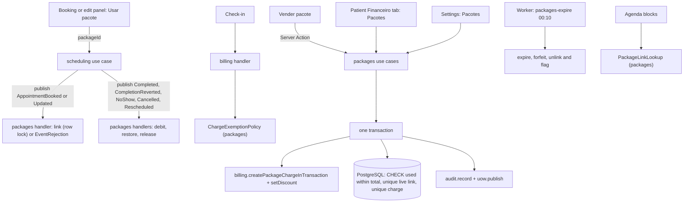

# Technical Specification: F10. Session Packages

**Complexity:** complex

## 1. Technical Overview

**What.** A new `packages` module in the **rich** tier, as the architecture defines it (section 3). Its pure `domain` layer holds the package aggregate (balance, validity, status) and the session ledger rules. It covers:
- **Templates.** Name, one service, 2–100 sessions, one total price per currency of the active units (0.01 to 99,999.99), validity of 30–730 days from the sale, and an active flag. The form shows the price per session and the discount compared with the service's regular price in each currency.
- **Sale.** The front desk picks a patient and a template. The unit selected in the header sets the currency and the unit of the charge. The price can be lowered: the charge is created with the template price as its gross amount, and the difference becomes a F09 discount on that charge. Above 10% the discount needs a reason; above 20% it needs a manager's PIN or goes to the approvals list. The package and its charge (origin "Pacote") are written in **one transaction**, so if the charge fails, no package is saved. After the sale, the F09 receive modal can open to register a payment now.
- **Linking.** When booking or editing an appointment for a patient who has an active package of the same service with balance, the booking panel offers "Usar pacote (6 de 10 sessões restantes)". Scheduling accepts an opaque `packageId` and repeats it in its event. The packages handler creates the link in the same transaction, or refuses with `EventRejection` (ADR-034) when the package is expired or has no free balance. Linked appointments create no charge on check-in, through the F09 `ChargeExemptionPolicy` port.
- **Ledger.**
  - Completing a linked appointment debits one session.
  - Reverting the completion restores the session.
  - Cancelling releases the link without a debit.
  - A no-show debits a session only when the organization setting is on; otherwise it releases the link.
  - Every movement is recorded.
- **Validity.**
  - A daily job (00:10 in the organization's time zone) expires packages: the remaining sessions are forfeited, the status becomes "Expirado", and linked appointments that are still open are unlinked and flagged for the front desk.
  - Managers and Administrators can extend an active package by up to 365 days in total, with a reason.
- **Cancellation.**
  - Managers and Administrators can cancel a package, with a reason. The balance becomes zero and future links are released after a confirmation.
  - The sale charge is voided in the same transaction when it has no payments.
  - When the charge has payments, the dialog leads to the charge detail, where the F09 refund flow applies.
- **Screens.**
  - Configurações > Pacotes: the templates and the no-show setting.
  - The "Pacotes" section of the patient's Financeiro tab: cards with progress, expiry, payment status and the linked appointments.
  - "Vender pacote".
  - The "Usar pacote" choice in the booking and edit panels.
  - The package mark "Sessão 4/10" or "Pacote expirado" on agenda blocks.
  - The "Pacote com saldo financeiro em aberto" notice on the patient page.

**Why.** A package is prepaid money turned into sessions. The balance must be exact under concurrent bookings, and a session must be debited exactly once per completed appointment, so the rules are enforced by the database as well as by the domain:
- **Sessions:** a CHECK keeps the used sessions within the total.
- **Appointments:** a partial unique index allows one live link per appointment.
- **Concurrent links:** every link takes the package row lock.
- **Sale charge:** a unique foreign key makes the charge belong to exactly one package.

All reactions to scheduling events run synchronously in the scheduling transaction (ADR-007), so a booking and its link, or a completion and its debit, commit or roll back together.

**How it fits the codebase.**
- **Patterns from F09:**
  - Use cases follow `authorize`, then `parseInput`, then `withTransaction`, with `audit.record()` and `uow.publish()` in the same transaction.
  - `Result` errors carry message keys, translated in three catalogs.
  - Money goes through `Money` (ADR-029).
  - Each port is a `definePort` with an inert default (ADR-022).
  - Handler rejections use `EventRejection` (ADR-034).
  - UI slots are composed by the app layer, so scheduling and packages never import each other's UI.
  - Integration tests use Testcontainers and the journeys use Playwright.
- **New in this feature:**
  - Billing gains a variant of package charge creation that runs inside the caller's transaction.
  - Scheduling gains an opaque `packageId` in its inputs and events, a `packageSlot` in its booking and edit panels, and a `PackageLinkLookup` port for the agenda mark.
  - ADR-035 records these decisions.

### Scope

**Included (whole feature; the PRD has no Core/Full split):**
- Templates with prices per currency.
- The sale with discount rules and the atomic charge.
- Linking, including series up to the balance.
- The debit, restore and release rules, and the no-show setting.
- Expiration with the flags, extension and cancellation.
- All the screens listed above.
- Integrated from cross-cutting concerns:
  - **Permissions** (existing actions only):
    - `setup:manage`: templates and the no-show setting.
    - `billing:operate`: sell, read and link packages.
    - `billing:approve`: extend and cancel.
    - Professionals have no access to packages, following the F01 matrix ("—").
  - **Denials:** a 403 response and a `PERMISSION_DENIED` audit event for every one.
  - **Mutations:** audited inside the same transaction.
  - **Tenancy:** tenant scoping on every new table.
  - **Interface text:** in the pt-BR, en and es catalogs, with dates and money through the formatters.
- **Documentation:**
  - PRD F10 clarified in both languages.
  - ADR-035 and the module dependency graph (`billing → packages`, `scheduling -. events .-> packages`, `services → packages`, `patients → packages`).
  - Design system patterns for the package cards, the "Usar pacote" choice and the agenda mark, in both languages.

**Deferred / not included:**
- **Elsewhere:**
  - Reports on packages (F13).
  - The timeline entries of packages (F14 reads the tables).
  - The cash register movements of package payments (F11 reacts to the F09 payment events as for any charge).
- **Not in the PRD:** packages with several services, packages shared between patients, and transfers of balance.

**Input contracts (Consumes):**
- F03, through `services`: active services, their name and their price per currency, for templates and the discount comparison.
- F05, through `patients.getPatientIdentity` and `getPatientSummaries`: the patient's display name (social name first) and identity document. This also applies the visibility policy.
- F06, through the scheduling events `AppointmentBooked`, `AppointmentUpdated`, `AppointmentRescheduled`, `AppointmentCancelled`, `AppointmentMarkedNoShow`, `AppointmentCompleted` and `AppointmentCompletionReverted`. Their payloads hold the appointment, patient, service, start, status and the new optional `packageId` and `packageLinkMode`.
- F09, through:
  - `billing.createPackageChargeInTransaction(uow, ctx, input)` and `setDiscount` inside that transaction;
  - `getChargeStatus` for the payment status;
  - `voidCharge` inside the cancellation transaction;
  - the `ChargeExemptionPolicy` port, implemented here.
- F02 and F16: the selected unit, its currency and time zone, and the formatters.

**Output contracts (Provides):**
- Package records for F13 and F14:
  - `patient_package`: patient, template, service, sessions, used sessions, sale and expiry dates, status, sale charge and unit;
  - `package_appointment`: the links;
  - `package_movement`: debits, restores, forfeits, extensions and cancellations.
- The `ChargeExemptionPolicy` implementation (billing) and the `PackageLinkLookup` implementation (scheduling).
- Domain events published inside the transaction: `PackageSold`, `PackageSessionDebited`, `PackageSessionRestored`, `PackageExpired`, `PackageExtended` and `PackageCancelled`. The payloads hold IDs and counts, never personal data.

### Traceability to the PRD

| PRD block (F10) | Where it is specified |
|---|---|
| Consumes | Scope → input contracts; Section 4 (`infrastructure/directory.ts`, `application/appointment-handlers.ts`) |
| Capabilities | Section 3 (decisions), Section 5 (actions), Section 6 (constraints) |
| Experience | Section 4 (settings, patient section, sale dialog, booking slot, agenda mark); Section 5 (UI texts) |
| Error Handling | Section 5 (error codes and pt-BR messages); Section 3 (rollback of the sale, rejections) |
| Acceptance criteria (Section 9, F10) | Section 7, acceptance tests |
| Cross-Feature Integration (F03, F05, F06, F09 → F10) | Section 7, cross-feature tests |

## 2. Architecture Impact

### Affected components

| Area | Path | Role |
|---|---|---|
| Module | `src/modules/packages/` | Domain (package aggregate, validity, balance), application (use cases, event handlers, expiration), infrastructure (repository, directory, port implementations), UI, messages, public API |
| Scheduling | `src/modules/scheduling/application/schemas.ts`, `book-appointment.ts`, `update-appointment.ts`, `series.ts`, `domain/events.ts`, `application/ports.ts`, `application/queries.ts`, `ui/booking-panel.tsx`, `ui/change-form.tsx`, `ui/appointment-block.tsx`, `index.ts` | Opaque `packageId` and `packageLinkMode` in inputs and payloads; the `packageSlot` in the booking and edit panels; the `PackageLinkLookup` port and the mark on blocks and in the panel |
| Billing | `src/modules/billing/application/charges.ts`, `discounts.ts`, `index.ts` | Package charge creation, discount and void inside a caller's transaction |
| Worker | `src/shared/jobs/queues.ts`, `src/worker/index.ts`, `src/worker/jobs/packages.ts` | `packages-expire` daily at 00:10, per organization in its time zone |
| Patient page | `src/app/(app)/patients/[patientId]/page.tsx` | "Pacotes" section in the Financeiro tab and the open-balance notice |
| Agenda | `src/app/(app)/schedule/page.tsx`, `package-slot.tsx` | The `packageSlot` composed by the app layer |
| Routes | `src/app/(app)/packages/actions.ts`, `src/app/(app)/settings/packages/**` | Server Actions and the settings page |
| Navigation | `src/shared/ui/app-shell/navigation.ts`, shell catalog | "Pacotes" under Settings |
| Composition | `src/composition.ts` | Catalog, event subscriptions, ports (exemption policy, link lookup) |
| Tenancy | `src/shared/db/tenant.ts`, `tests/integration/helpers.ts` | Register and truncate the new tables |
| Database | `prisma/schema.prisma`, `prisma/migrations/0013_packages/` | Templates, prices, packages, links, movements, settings; the foreign key from `charge.package_id`; CHECKs, partial unique indexes, grants |
| Documentation | `docs/prd.{en,pt-BR}.md`, `docs/architecture.{en,pt-BR}.md`, `docs/design-system.{en,pt-BR}.md`, build log | PRD clarifications, ADR-035, module graph, design patterns, build log |

### Data flow



## 3. Technical Decisions

| Decision | Chosen Approach | Alternative Considered | Trade-off |
|---|---|---|---|
| Module tier | Rich. The `PatientPackage` aggregate holds the total and used sessions, the expiry date, the extended days, the status and the open links count. Commands return `Result` and pending changes. The repository loads with `FOR UPDATE` | Simple tier | Balance and validity are invariants worth unit testing. |
| Linking (interview) | Scheduling accepts an optional opaque `packageId` when booking, editing and booking series, and repeats it in the payload of `AppointmentBooked` and `AppointmentUpdated` with `packageLinkMode` (`STRICT` for single appointments, `UP_TO_BALANCE` for series). Scheduling never reads packages. The packages handler locks the package, checks status, patient, service, expiry against the appointment date and free balance, and creates the link. In `STRICT` mode a failure throws `EventRejection` with the PRD message, so the booking does not happen | Two calls through the app layer; a scheduling column with a policy port | Atomic and cycle-free; reuses ADR-034. |
| Series (interview) | In `UP_TO_BALANCE` mode the occurrences are linked in date order until the free balance ends. The rest stay unlinked and will be charged at check-in. The series preview gets a line from a packages read: "O pacote cobre 6 das 10 sessões; as outras 4 serão cobradas à parte." | Refuse the whole series | A clinic can book the whole treatment at once. |
| Free balance | `free = total − used − openLinks`, where `openLinks` counts links with status `LINKED`. A link needs `free ≥ 1` under the package row lock. PRD message when it fails: "Este pacote possui 2 sessões restantes e 2 agendamentos futuros já vinculados." | Count only future appointments | Past appointments that are not completed still hold their session until they end. |
| Link lifecycle (interview) | `LINKED` → `DEBITED` on completion. `DEBITED` → `LINKED` on revert. `LINKED` → `RELEASED` on cancellation, or on a no-show while the setting is off. A no-show with the setting on is `DEBITED`. Rescheduling keeps the link, but it is refused with `PACKAGE_EXPIRES_BEFORE` when the new date is after the expiry. Editing to another service releases the link; the edit panel warns first. Undoing the check-in does not touch the link. Expiration sets `UNLINKED_EXPIRED` with the flag, and cancellation sets `UNLINKED_CANCELLED` | Keep the link until completion | The balance always reflects real commitments. |
| Debit and restore | The handler of `AppointmentCompleted` sets the link `DEBITED`, increments `used_sessions` and records a `DEBIT` movement. `AppointmentCompletionReverted` reverses it with a `RESTORE` movement. They are idempotent: a completion already debited does nothing. A CHECK keeps `used_sessions` between 0 and `total_sessions` | Debit at check-in | As in the PRD. |
| No-show setting | `package_settings (organization_id, debit_no_show)`, default false, edited in Configurações > Pacotes (`setup:manage`) | A field on the organization | The setting stays in its module. |
| Charge exemption | The `ChargeExemptionPolicy` implementation answers true when the appointment has a link in `LINKED` (or `DEBITED`) status | Read the appointment's package field | One source of truth: the link table. |
| Sale and price (interview) | `sellPackage` runs in one transaction. It locks nothing, creates the package and calls `billing.createPackageChargeInTransaction(uow, ctx, { origin: PACKAGE, packageId, grossMinor = template price in the unit currency, serviceId, professional none })`. When the typed price is lower, it calls the billing discount inside the same transaction with an `AMOUNT` discount and the reason or approval sent by the dialog. A typed price above the template price is refused (`PACKAGE_PRICE_ABOVE_TEMPLATE`). Any failure rolls the whole sale back with "Não foi possível registrar a venda do pacote. Nenhuma alteração foi salva." (the specific discount errors are shown as they are) | Free price without discount rules | PRD: "discount rules of F09 apply"; one charge per sale. |
| Billing in a transaction | Billing exposes `createPackageChargeInTransaction` and `setDiscountInTransaction` that take the caller's `UnitOfWork` and run the same domain, audit and events. The PIN, when present, is verified before the transaction, as in F09 | Nested transactions | Prisma has no nested transactions; the rollback must cover both. |
| Currency (interview) | `package_template_price (template_id, currency, amount_minor)`, one row per currency of the active units, like the F03 prices. A sale uses the selected unit's currency; when the template has no price in it, the sale is refused (`PACKAGE_NO_PRICE_FOR_CURRENCY`). A package can be used in any unit, because sessions are not money | One currency per template | Same model as services. |
| Validity | `sold_on` is the sale date in the selected unit's time zone. `expires_on = sold_on + validity_days − 1 + extended_days`, and the package is valid through the end of `expires_on`. A link needs the appointment's local date ≤ `expires_on`. Expired message: "Este pacote expirou em 15/08/2026." | Expire on the instant of sale + N days | Calendar days, as clinics count them. |
| Expiration | `packages-expire` runs daily at 00:10 for each organization in its time zone. It runs on packages with `status = ACTIVE AND expires_on < today`. Each package is handled under its row lock: status `EXPIRED`, a `FORFEIT` movement with `total − used`, and links in `LINKED` move to `UNLINKED_EXPIRED` with `flagged = true`. Each run is audited as `SYSTEM` | Expire lazily on read | The PRD wants the status and the flags visible the next morning. |
| Flag | `package_appointment.flagged` (true for expired or cancelled packages). The agenda shows "Pacote expirado" on the block and in the panel, through `PackageLinkLookup`. The flag disappears when the appointment is checked in (the charge is then normal) or cancelled | A notification table | The front desk sees it where it works. |
| Extension (interview) | `billing:approve`, a reason of 3–500 characters, days 1–365, and `extended_days + days ≤ 365` (`PACKAGE_EXTENSION_LIMIT`). Only `ACTIVE` packages can be extended. Each extension is recorded as an `EXTEND` movement | Per-extension limit; reactivate expired | Expired sessions stay forfeited, as audited. |
| Cancellation (interview) | `billing:approve` and a reason. When open links exist, the first call returns `PACKAGE_HAS_LINKED_APPOINTMENTS` with the count ("Existem 3 agendamentos vinculados. Eles serão desvinculados e passarão a gerar cobrança avulsa."), and the dialog confirms with `confirmUnlink: true`. In one transaction: status `CANCELLED`, a `CANCEL` movement with the balance, links set to `UNLINKED_CANCELLED`, and the sale charge voided through billing when it has no payments. When it has payments, the response says so and the dialog links to `/financial/charges/{id}` for the refund | Never touch the charge | No orphan receivable for a cancelled package. |
| Agenda mark | Scheduling declares `PackageLinkLookup.linkStates(organizationId, appointmentIds)`, which returns `Map<appointmentId, { session: number; total: number; flagged: boolean }>`. The default knows no links. `session` is the projected number: debited sessions keep their order of debit; open links follow by start time. The mark is a text stamp "Sessão 4/10" with a package icon, or "Pacote expirado" | Join packages in scheduling queries | Same pattern as F07's `ClinicalNoteLookup`. |
| Booking slot | `BookingPanel` and `ChangeForm` accept a `packageSlot` client component prop with `{ patientId, serviceId, date, value, onChange }`. The page composes packages' `PackageChoice`, which reads `eligiblePackagesAction` and offers "Usar pacote (6 de 10 sessões restantes)" (selected by default when exactly one package fits) or "Não usar pacote" | Scheduling reads packages | Same composition as the F09 charge section. |
| Open balance notice | The patient page shows a warning alert "Pacote com saldo financeiro em aberto" when any active package's charge is not `PAID` | A patients port | The app layer already composes the patient page. |

### Assumptions

These were decided during this spec rather than by the PRD, and can be overridden:
- **Templates.**
  - Names have 1–80 characters and are unique per organization, ignoring case.
  - A template can be deactivated but not deleted, and sold packages keep their snapshot of name, service, sessions and price.
  - A template needs an active service.
- **Permissions.** Front Desk sells and links. Manager and Administrator also extend and cancel. Templates and the setting need `setup:manage`.
- **Sale unit.** The sale uses the unit selected in the header, which sets the currency and receives the charge. Without a selected unit, the dialog asks for one.
- **Package number.** Packages are shown by template name and sale date. No separate number is created; the charge number identifies the sale.
- **Patient section.** The cards show:
  - name, service, sessions used and total with a progress bar, expiry date and status ("Ativo", "Expirado", "Cancelado");
  - the payment status from F09 ("Pago", "Parcialmente pago", "Em aberto", "Aguardando aprovação de desconto");
  - the linked appointments with date, professional and status.
  
  Active packages come first.
- **After the sale.** The dialog offers "Receber agora", which opens the F09 receive modal for the new charge, and "Fechar".
- **Session numbers.** The number on the agenda counts debited and open links in date order. When a link is released, later numbers move up.
- **Messages not given by the PRD.** The pt-BR texts for extension limits, price, currency, service and template validation were written in the PRD's tone and can be reviewed.

### Open points
- **PRD update.** The interview answers clarify PRD F10 in both languages in the first stage:
  - link mechanics;
  - series up to the balance;
  - the link lifecycle;
  - the price difference as a discount;
  - prices per currency;
  - the extension limit;
  - the charge on cancellation.

## 4. Component Overview

### Frontend

| File Path | New/Modified | Purpose | Key Responsibilities |
|---|---|---|---|
| `src/app/(app)/settings/packages/page.tsx`, `actions.ts` | New | Settings | Templates table and form; the no-show setting (`setup:manage`) |
| `src/app/(app)/packages/actions.ts`, `package-actions.ts` | New | Server Actions | Sell, eligible packages, patient packages, extend, cancel, series coverage; the actions object passed to the module's UI |
| `src/app/(app)/patients/[patientId]/page.tsx` | Modified | Patient page | "Pacotes" section in the Financeiro tab; the open-balance notice |
| `src/app/(app)/schedule/page.tsx`, `package-slot.tsx` | Modified/New | Agenda | Composes `PackageChoice` into the booking and edit panels |
| `src/modules/packages/ui/templates-panel.tsx`, `template-form.tsx` | New | Settings | Name, service, sessions, validity, a price per currency with the per-session price and the discount versus the service price, active |
| `src/modules/packages/ui/no-show-setting.tsx` | New | Settings | "Falta debita sessão do pacote" switch |
| `src/modules/packages/ui/packages-section.tsx`, `package-card.tsx` | New | Patient | Cards with progress bar, status and payment stamps, linked appointments; "Vender pacote", "Prorrogar", "Cancelar pacote" |
| `src/modules/packages/ui/sell-dialog.tsx` | New | Sale | Template select, unit (when none is selected), price (pre-filled), discount reason and approval fields when needed (reuses billing's approval UI through props), "Vender pacote", then "Receber agora" |
| `src/modules/packages/ui/extend-dialog.tsx`, `cancel-dialog.tsx` | New | Manager actions | Days and reason; reason and the unlink confirmation |
| `src/modules/packages/ui/package-choice.tsx` | New | Booking slot | Radio list "Usar pacote (6 de 10 sessões restantes)" or "Não usar pacote"; the series coverage note |
| `src/modules/scheduling/ui/booking-panel.tsx`, `change-form.tsx`, `agenda-view.tsx`, `appointment-panel.tsx`, `appointment-block.tsx` | Modified | Scheduling UI | `packageSlot` prop and `packageId` in the inputs; the package stamp on blocks and in the panel |
| `src/shared/ui/app-shell/navigation.ts`, shell catalog | Modified | Navigation | "Pacotes" under Settings with a `package` icon |

### Backend

| File Path | New/Modified | Purpose | Key Responsibilities |
|---|---|---|---|
| `src/modules/packages/domain/limits.ts` | New | Constants | 2–100 sessions, 1–9,999,999 minor units, 30–730 days, 365 extension days, 3–500-character reasons, 80-character names (PRD references) |
| `src/modules/packages/domain/package.ts` | New | Aggregate | `sell`, `link`, `debit`, `restore`, `release`, `expire`, `extend`, `cancel`, free balance, validity; pending changes |
| `src/modules/packages/domain/validity.ts`, `errors.ts`, `events.ts` | New | Domain support | Expiry date arithmetic; error factories; `PACKAGES_EVENTS` |
| `src/modules/packages/application/ports.ts`, `schemas.ts`, `support.ts` | New | Application support | Repository, directory, billing gateway, clock; Zod schemas; the locked mutation helper |
| `src/modules/packages/application/templates.ts` | New | Use cases | List, create, update, set active, prices per currency |
| `src/modules/packages/application/sales.ts` | New | Use case | `sellPackage` with the charge in the same transaction |
| `src/modules/packages/application/appointment-handlers.ts` | New | Event handlers | Link on booked or updated, release on cancelled, no-show and service change, debit on completed, restore on reverted, expiry check on rescheduled |
| `src/modules/packages/application/lifecycle.ts` | New | Use cases | `extendPackage`, `cancelPackage`, `expirePackages` (worker) |
| `src/modules/packages/application/queries.ts` | New | Reads | Patient packages with payment status and links, eligible packages, series coverage, settings |
| `src/modules/packages/application/settings.ts` | New | Use case | `setNoShowDebit` |
| `src/modules/packages/infrastructure/prisma-package-repository.ts`, `directory.ts`, `exemption-policy.ts`, `link-lookup.ts`, `billing-gateway.ts` | New | Adapters | Prisma with `FOR UPDATE`; patients, services, units; the two port implementations; billing calls inside the transaction |
| `src/modules/packages/messages/{pt-BR,en,es}.json`, `catalog.ts`, `index.ts`, `client.ts` | New | Catalogs and API | Texts; `packages` use cases, `createPackages(adjust)`, subscriptions and ports; client components |
| `src/modules/scheduling/application/schemas.ts`, `book-appointment.ts`, `update-appointment.ts`, `series.ts`, `domain/events.ts`, `application/ports.ts`, `application/queries.ts`, `index.ts` | Modified | Scheduling | `packageId` and `packageLinkMode` pass-through; `PackageLinkLookup` port with the `noPackageLinks` default; package marks in agenda items and details |
| `src/modules/billing/application/charges.ts`, `discounts.ts`, `payments.ts`, `index.ts` | Modified | Billing | `createPackageChargeInTransaction`, `setDiscountInTransaction` and `voidChargeInTransaction` |
| `src/shared/jobs/queues.ts`, `src/worker/index.ts`, `src/worker/jobs/packages.ts` | Modified/New | Worker | Queue `packages-expire` scheduled at 00:10 for each organization zone (the job runs every 15 minutes and expires organizations whose local time passed 00:10 and that were not yet run that day) |
| `src/composition.ts`, `src/shared/db/tenant.ts`, `tests/integration/helpers.ts` | Modified | Wiring | Catalog, subscriptions, ports, tenancy, truncation |
| `src/scripts/seed-demo.ts` | Modified | Demo | Two templates, a sold package with links and a debited session, an unpaid package |

### Database

| Migration File | Tables Affected | Operation | Notes |
|---|---|---|---|
| `prisma/migrations/0013_packages/migration.sql` | `package_template`, `package_template_price`, `patient_package`, `package_appointment`, `package_movement`, `package_settings`, `package_expiration_run`, `charge` | CREATE, ALTER, GRANT | Hand-written CHECKs, partial unique indexes, `charge.package_id` foreign key; no `DELETE` on packages, links or movements. Relations declared in `schema.prisma` so the CI drift check passes |

## 5. API Contracts

All actions return the F01 `ActionResult` envelope with errors translated by `toActionResult(result, ctx.locale, "packages")`.

### Error codes

| Code | HTTP Status | pt-BR message |
|---|---|---|
| `PACKAGE_TEMPLATE_INVALID` | 400 | Field messages: "Informe de 2 a 100 sessões.", "Informe um preço entre R$ 0,01 e R$ 99.999,99.", "Informe uma validade de 30 a 730 dias." |
| `PACKAGE_TEMPLATE_NAME_TAKEN` | 409 | "Já existe um modelo de pacote com este nome." |
| `PACKAGE_TEMPLATE_NOT_FOUND` | 404 | "Modelo de pacote não encontrado ou inativo." |
| `PACKAGE_SERVICE_INVALID` | 400 | "Escolha um serviço ativo." |
| `PACKAGE_NO_PRICE_FOR_CURRENCY` | 409 | "Este modelo não tem preço em {currency}. Cadastre o preço antes de vender nesta unidade." |
| `PACKAGE_PRICE_ABOVE_TEMPLATE` | 400 | "O preço da venda não pode ser maior que o preço do modelo." |
| `PACKAGE_SALE_FAILED` | 503 | "Não foi possível registrar a venda do pacote. Nenhuma alteração foi salva." |
| `PACKAGE_NOT_FOUND` | 404 | "Pacote não encontrado." |
| `PACKAGE_BALANCE_EXHAUSTED` | 409 | "Este pacote possui {remaining} sessões restantes e {linked} agendamentos futuros já vinculados." |
| `PACKAGE_EXPIRED` | 409 | "Este pacote expirou em {date}." |
| `PACKAGE_EXPIRES_BEFORE` | 409 | "Este pacote vale até {date}. Escolha uma data dentro da validade ou não use o pacote." |
| `PACKAGE_NOT_ACTIVE` | 409 | "Este pacote não está ativo." |
| `PACKAGE_WRONG_PATIENT_OR_SERVICE` | 409 | "Este pacote é de outro paciente ou de outro serviço." |
| `PACKAGE_HAS_LINKED_APPOINTMENTS` | 409 | "Existem {count} agendamentos vinculados. Eles serão desvinculados e passarão a gerar cobrança avulsa." |
| `PACKAGE_EXTENSION_LIMIT` | 409 | "A validade pode ser prorrogada em até 365 dias no total. Restam {days} dias." |
| `PACKAGE_REASON_REQUIRED` | 400 | "Informe o motivo (mínimo de 3 caracteres)." |
| `PACKAGE_STALE` | 409 | "Este pacote foi alterado por outra pessoa. Recarregue para ver a versão mais recente." |
| Billing discount errors | — | Shown as F09 defines them (reason above 10%, approval above 20%, PIN) |
| `VALIDATION_FAILED`, `AUTHZ_FORBIDDEN` | — | As in F01 |

Other texts in the catalogs: "Pacotes", "Modelos de pacote", "Novo modelo", "Sessões", "Validade (dias)", "Preço por sessão", "Desconto sobre o preço avulso", "Falta debita sessão do pacote", "Vender pacote", "Receber agora", "Usar pacote ({remaining} de {total} sessões restantes)", "Não usar pacote", "Sessão {session}/{total}", "Pacote expirado", "Pacote com saldo financeiro em aberto", "Prorrogar validade", "Cancelar pacote", "Válido até {date}", "Ativo", "Expirado", "Cancelado", "O pacote cobre {covered} das {count} sessões; as outras {rest} serão cobradas à parte.", toasts "Pacote vendido", "Validade prorrogada", "Pacote cancelado", "Modelo salvo".

### Action: Sell package (`sellPackageAction`)
- **Authentication:** `billing:operate`. Approvals follow F09.

| Field | Type | Required | Validation | Description |
|---|---|---|---|---|
| `patientId` | uuid | Yes | Visible, active patient | Buyer |
| `templateId` | uuid | Yes | Active template | Template |
| `unitId` | uuid | Yes | Active unit with a template price in its currency | Unit of the sale and the charge |
| `priceMinor` | integer | Yes | 1 to the template price | Price agreed |
| `discountReason` | string | Conditional | Above 10% below the template price | F09 rule |
| `approval` | object | Conditional | `{ approverUserId, pin }` above 20% | F09 inline approval |
| `submitForApproval` | boolean | No | — | Leaves the charge "Aguardando aprovação de desconto" |

```json
{
  "patientId": "01928f9e-…",
  "templateId": "01928fb0-…",
  "unitId": "01928f9e-…a001",
  "priceMinor": 135000,
  "discountReason": "Fechamento de tratamento completo"
}
```

```json
{
  "ok": true,
  "value": {
    "package": {
      "id": "01928fb5-…", "name": "Fisioterapia 10 sessões", "serviceName": "Fisioterapia",
      "totalSessions": 10, "usedSessions": 0, "freeSessions": 10, "soldOn": "2026-10-09",
      "expiresOn": "2027-04-06", "status": "ACTIVE",
      "charge": { "id": "01928fb6-…", "number": "2026-000140", "status": "OPEN", "netMinor": 135000, "currency": "BRL" }
    }
  }
}
```

Errors: `PACKAGE_TEMPLATE_NOT_FOUND`, `PACKAGE_NO_PRICE_FOR_CURRENCY`, `PACKAGE_PRICE_ABOVE_TEMPLATE`, F09 discount and PIN errors, `PACKAGE_SALE_FAILED`, `AUTHZ_FORBIDDEN`.

### Scheduling inputs (modified)
- `bookAppointment`, `bookSeries` and `updateAppointment` accept `packageId?: uuid | null`. In `updateAppointment`, `null` removes the link, a uuid links the appointment, and omitting the field keeps the current link.
- Payloads of `AppointmentBooked` and `AppointmentUpdated` gain `packageId: string | null | undefined` and `packageLinkMode: "STRICT" | "UP_TO_BALANCE"`.
- Rejections reach the booking panel as the packages error with its message (for example `PACKAGE_BALANCE_EXHAUSTED`).

### Reads
- `eligiblePackagesAction({ patientId, serviceId, date })` returns `{ id, name, freeSessions, totalSessions, expiresOn }[]`: active packages of that patient and service, valid on that date, with a free balance.
- `seriesCoverageAction({ packageId, count })` returns `{ covered, rest }`.
- `patientPackagesAction({ patientId })` returns cards: the package, its payment status from F09, and its links with appointment date, professional, status and session number.

### Actions: Extend and cancel
```json
{ "packageId": "01928fb5-…", "version": 3, "days": 60, "reason": "Paciente afastado por cirurgia" }
{ "packageId": "01928fb5-…", "version": 4, "reason": "Paciente mudou de cidade", "confirmUnlink": true }
```
The extend response returns the package with its new `expiresOn`. The cancel response is `{ package, chargeVoided: boolean, chargeId }`. Errors: `PACKAGE_EXTENSION_LIMIT`, `PACKAGE_NOT_ACTIVE`, `PACKAGE_HAS_LINKED_APPOINTMENTS`, `PACKAGE_REASON_REQUIRED`, `PACKAGE_STALE`, `AUTHZ_FORBIDDEN`.

### Settings
- `saveTemplateAction({ templateId?, name, serviceId, sessions, validityDays, prices: [{ currency, amountMinor }], active })` needs `setup:manage`.
- `setNoShowDebitAction({ enabled })` needs `setup:manage`.

### Public module API (Provides)
`src/modules/packages/index.ts` exports:
- `packages`, the use cases bound to their dependencies;
- `createPackages(adjust)`;
- `subscribePackagesEvents(bus)` and `registerPackagesPorts()`, which register the billing exemption policy and the scheduling link lookup;
- `expirePackages` for the worker;
- `PACKAGES_EVENTS`;
- the catalog and the server UI.

`client.ts` exports `PackageChoice`, `PackagesSection` and the dialogs.

## 6. Data Model

Every table has `organization_id uuid NOT NULL` (tenant), indexes starting with it, and UUIDv7 IDs from `newId()`. Relations are declared in `schema.prisma` (the F09 drift lesson).

### Table: `package_template`
| Column | Type | Nullable | Default | Description |
|---|---|---|---|---|
| `id` | `uuid` | No | - | Primary key |
| `organization_id` | `uuid` | No | - | Tenant |
| `name` | `varchar(80)` | No | - | Unique per organization, case-insensitive |
| `service_id` | `uuid` | No | - | FK `service` |
| `sessions` | `smallint` | No | - | 2–100 |
| `validity_days` | `smallint` | No | - | 30–730 |
| `active` | `boolean` | No | `true` | Offered for sale |
| `version` | `integer` | No | `1` | Optimistic lock |
| `created_at`, `updated_at` | `timestamptz` | No | `now()` | Timestamps |

`ck_package_template_sessions CHECK (sessions BETWEEN 2 AND 100)`, `ck_package_template_validity CHECK (validity_days BETWEEN 30 AND 730)`, `uq_package_template_name UNIQUE (organization_id, lower(name))`.

### Table: `package_template_price`
`(organization_id, template_id, currency char(3), amount_minor bigint)`, primary key `(template_id, currency)`, `CHECK (amount_minor BETWEEN 1 AND 9999999)`.

### Table: `patient_package`
| Column | Type | Nullable | Default | Description |
|---|---|---|---|---|
| `id` | `uuid` | No | - | Primary key |
| `organization_id` | `uuid` | No | - | Tenant |
| `patient_id` | `uuid` | No | - | FK `patient` |
| `template_id` | `uuid` | No | - | FK `package_template` |
| `name` | `varchar(80)` | No | - | Snapshot |
| `service_id` | `uuid` | No | - | FK `service` (snapshot) |
| `total_sessions` | `smallint` | No | - | Snapshot |
| `used_sessions` | `smallint` | No | `0` | Debited sessions |
| `forfeited_sessions` | `smallint` | No | `0` | Lost at expiry or cancellation |
| `unit_id` | `uuid` | No | - | Unit of the sale |
| `currency` | `char(3)` | No | - | Currency of the sale |
| `price_minor` | `bigint` | No | - | Agreed price |
| `sold_on` | `date` | No | - | Sale date (unit zone) |
| `validity_days` | `smallint` | No | - | Snapshot |
| `extended_days` | `smallint` | No | `0` | Sum of extensions, ≤ 365 |
| `expires_on` | `date` | No | - | `sold_on + validity_days − 1 + extended_days` |
| `status` | `varchar(10)` | No | `'ACTIVE'` | `ACTIVE`, `EXPIRED`, `CANCELLED` |
| `charge_id` | `uuid` | No | - | FK `charge`, unique |
| `sold_by_id` | `uuid` | No | - | FK `app_user` |
| `closed_at`, `closed_by_id`, `close_reason` | — | Yes | - | Expiry or cancellation |
| `version` | `integer` | No | `1` | Optimistic lock |
| `created_at`, `updated_at` | `timestamptz` | No | `now()` | Timestamps |

Constraints:
- `CHECK (used_sessions + forfeited_sessions BETWEEN 0 AND total_sessions)`;
- `CHECK (extended_days BETWEEN 0 AND 365)`;
- `CHECK (expires_on = sold_on + validity_days - 1 + extended_days)`;
- status values;
- `UNIQUE (charge_id)`.

Indexes:
- `ix_patient_package_patient (organization_id, patient_id, status)`;
- `ix_patient_package_expiry (organization_id, expires_on) WHERE status = 'ACTIVE'`.

### Table: `package_appointment`
| Column | Type | Nullable | Default | Description |
|---|---|---|---|---|
| `id` | `uuid` | No | - | Primary key |
| `organization_id` | `uuid` | No | - | Tenant |
| `package_id` | `uuid` | No | - | FK `patient_package` |
| `appointment_id` | `uuid` | No | - | FK `appointment` |
| `status` | `varchar(20)` | No | - | `LINKED`, `DEBITED`, `RELEASED`, `UNLINKED_EXPIRED`, `UNLINKED_CANCELLED` |
| `flagged` | `boolean` | No | `false` | Shown to the front desk |
| `linked_at` | `timestamptz` | No | `now()` | Link instant |
| `debited_at`, `closed_at` | `timestamptz` | Yes | - | Debit and release instants |

Indexes and constraints:
- `uq_package_appointment_live UNIQUE (organization_id, appointment_id) WHERE status IN ('LINKED', 'DEBITED')`;
- `ix_package_appointment_package (organization_id, package_id, status)`;
- `CHECK` on status;
- `CHECK ((status = 'DEBITED') = (debited_at IS NOT NULL))`.

### Table: `package_movement`
`(id, organization_id, package_id, appointment_id NULL, kind varchar(10) CHECK IN ('SALE','DEBIT','RESTORE','FORFEIT','EXTEND','CANCEL'), sessions smallint, days smallint NULL, reason varchar(500) NULL, actor_user_id uuid NULL, occurred_at timestamptz)`. Index `(organization_id, package_id, occurred_at)`. There is no `UPDATE` or `DELETE` grant; the table is append-only.

### Table: `package_settings`
`(organization_id PRIMARY KEY, debit_no_show boolean NOT NULL DEFAULT false, updated_at, updated_by_id)`.

### Table: `package_expiration_run`
`(organization_id, run_on date, ran_at)` with primary key `(organization_id, run_on)`. It makes the worker idempotent per organization and day.

### Changes to `charge`
`ALTER TABLE charge ADD CONSTRAINT fk_charge_package FOREIGN KEY (package_id) REFERENCES patient_package(id) ON DELETE RESTRICT`. The relation is declared in `schema.prisma`.

### Migration excerpt (hand-written parts)
```sql
-- PRD F10: a package never debits more sessions than it holds, whatever the application does.
ALTER TABLE "patient_package" ADD CONSTRAINT "ck_patient_package_sessions"
  CHECK ("used_sessions" >= 0 AND "forfeited_sessions" >= 0
         AND "used_sessions" + "forfeited_sessions" <= "total_sessions");
-- One live link per appointment, even under concurrent edits.
CREATE UNIQUE INDEX "uq_package_appointment_live" ON "package_appointment" ("organization_id", "appointment_id")
  WHERE "status" IN ('LINKED', 'DEBITED');
-- The ledger is append-only; packages and links are never deleted.
REVOKE UPDATE, DELETE ON "package_movement" FROM gcli_app;
REVOKE DELETE ON "patient_package", "package_appointment", "package_template" FROM gcli_app;
```

## 7. Testing Strategy

### Test files
| Test File | Test Type | Target | Coverage Goal |
|---|---|---|---|
| `src/modules/packages/domain/package.test.ts` | Unit | Aggregate commands, free balance, transitions | All branches |
| `src/modules/packages/domain/validity.test.ts` | Unit | Expiry arithmetic and extension limit | Boundaries |
| `tests/integration/packages/support.ts` | Helper | The billing world plus templates and a sold package | — |
| `tests/integration/packages/templates.test.ts` | Integration | Templates, prices, settings | Every rule |
| `tests/integration/packages/sales.test.ts` | Integration | Sale, discount, rollback | Every rule |
| `tests/integration/packages/links.test.ts` | Integration | Booking, series, edits, debit, restore, release, no-show | Every rule |
| `tests/integration/packages/lifecycle.test.ts` | Integration | Expiration job, extension, cancellation | Every rule |
| `tests/integration/packages/schema.test.ts` | Integration | CHECKs, unique indexes, grants | Every constraint |
| `tests/e2e/f10-session-packages.spec.ts` | E2E | Journeys | 4 journeys |

### Unit tests
| Test Function | Assertions |
|---|---|
| `F10: free balance counts used and open links` | 10 total, 3 used, 2 linked → 5 free; linking at 0 free → `PACKAGE_BALANCE_EXHAUSTED` with remaining and linked |
| `F10: a link after the expiry date is refused` | Date after `expires_on` → `PACKAGE_EXPIRES_BEFORE`; expired package → `PACKAGE_EXPIRED` |
| `F10: debit and restore are idempotent` | Double debit keeps used; restore without debit does nothing |
| `F10: expiry date counts calendar days and extensions` | 2026-10-09 + 180 days → 2027-04-06; +60 → 2027-06-05 |
| `F10: extensions add up to 365 days at most` | 300 then 66 → `PACKAGE_EXTENSION_LIMIT` with 65 remaining |
| `F10: expiring forfeits the remaining sessions` | 10 total, 4 used → forfeited 6, status `EXPIRED` |

### Acceptance tests (PRD Section 9, F10)
| Test Function | File | Assertions |
|---|---|---|
| `F10: a package template requires 2–100 sessions, a price of 0.01–99,999.99 and a validity of 30–730 days` | `templates.test.ts` | Each boundary accepted, each outside value refused with its field message |
| `F10: selling a package creates exactly one charge with origin package; if the charge fails, no package is saved` | `sales.test.ts` | One `charge` with `origin = PACKAGE` and `package_id`; a failing billing gateway (via `createPackages(adjust)`) → `PACKAGE_SALE_FAILED`, zero packages, zero charges |
| `F10: booking for a patient with an active package of the same service offers linking, and a linked appointment does not generate a charge on check-in` | `links.test.ts` | `eligiblePackages` lists it; booking with `packageId` creates the link; check-in → no charge |
| `F10: completing a linked appointment debits one session; reverting restores it; cancelling does not debit` | `links.test.ts` | used 1 → 0; cancellation releases the link and used stays 0 |
| `F10: a no-show debits a session only when the organization setting is enabled` | `links.test.ts` | Setting off → released, used 0; on → debited, used 1 |
| `F10: linking is blocked when future linked appointments already equal the remaining balance` | `links.test.ts` | Third booking on a 2-free package → `PACKAGE_BALANCE_EXHAUSTED` with the PRD message; no appointment created |
| `F10: at expiration the package becomes expired, remaining sessions are forfeited, and future linked appointments are unlinked and flagged` | `lifecycle.test.ts` | Status, forfeited, links `UNLINKED_EXPIRED` and `flagged`; their check-in creates a charge |
| `F10: a manager can extend validity by up to 365 days with a reason; front desk cannot` | `lifecycle.test.ts` | Manager ok; Front Desk 403 and `PERMISSION_DENIED`; no reason → `PACKAGE_REASON_REQUIRED` |

### Other integration tests
| Test Function | File |
|---|---|
| `F10: a lower price becomes a discount on the package charge with the F09 thresholds` | `sales.test.ts` |
| `F10: a price above the template and a currency without price are refused` | `sales.test.ts` |
| `F10: a series links occurrences up to the free balance and charges the rest` | `links.test.ts` |
| `F10: rescheduling past the expiry is refused; editing to another service releases the link` | `links.test.ts` |
| `F10: two concurrent bookings on the last free session link only one` | `links.test.ts` |
| `F10: cancelling a package with links needs confirmation, unlinks them and voids an unpaid charge` | `lifecycle.test.ts` |
| `F10: cancelling a package with a paid charge keeps the charge for the refund flow` | `lifecycle.test.ts` |
| `F10: the expiration job runs once per organization and day` | `lifecycle.test.ts` |
| `F10: the database refuses debits beyond the total and two live links for one appointment` | `schema.test.ts` |
| `F10: professionals cannot read or sell packages` | `sales.test.ts` |
| `F10: packages are isolated per organization` | `sales.test.ts` |

### Cross-Feature Integration
| Test Function | File |
|---|---|
| `F03 → F10: only active services appear in package templates` | `templates.test.ts` |
| `F05 → F10: the patient's social name appears in package sales` | `sales.test.ts` |
| `F06 → F10: appointments linked to a package do not generate charges in F09, and completing them debits the package balance` | `links.test.ts` |
| `F09 → F10: selling a package creates a charge in F09, and the package card shows the payment status from F09` | `sales.test.ts` |

### E2E journeys
| Test Function | Steps |
|---|---|
| `F10: administrator creates a template and front desk sells it with a payment` | Settings → Pacotes → new template; patient → Financeiro → "Vender pacote" → "Receber agora" → card "Pago" |
| `F10: front desk books with the package and the agenda shows the session` | Booking panel offers "Usar pacote (10 de 10 sessões restantes)"; the block shows "Sessão 1/10"; check-in creates no charge |
| `F10: completing a linked appointment debits the card` | Move to Concluído; card shows 1/10 used |
| `F10: manager cancels a package with a linked appointment` | Confirmation text; the appointment loses its mark |
