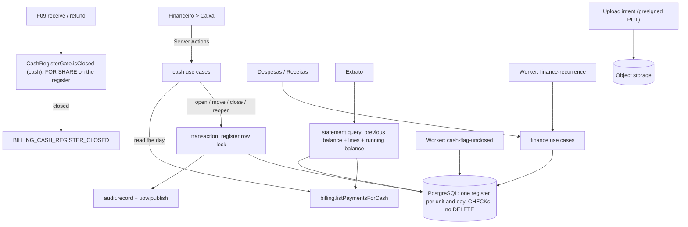

# Technical Specification: F11. Cash Register and Expenses

**Complexity:** complex

## 1. Technical Overview

**What.** A new `cash` module in the **rich** tier, as the architecture defines it (section 3). Its pure `domain` layer holds the cash register aggregate (opening, expected cash, closing, reopening) and the financial entry rules (expenses and manual revenues, payment and reversal, monthly series). It covers:
- **Daily cash register.**
  - One register per unit per day, where the day is the calendar date in the unit's time zone (ADR-019).
  - Opening: the opening balance is suggested from the counted cash of the unit's last closed register. The front desk can change it, with a reason of at least 10 characters.
  - Opening a date that already has a register opens the existing one instead of creating a duplicate.
  - The front desk opens only today's register. Managers and Administrators can also open a past date, to fix a forgotten day. A future date is always refused.
- **Automatic entries.**
  - The payments and refunds that F09 registered in the unit on that day are read through a billing query and grouped by method. Nothing is copied.
  - Only the "Dinheiro" method (`CASH`) affects the expected physical cash.
  - A payment received while the day has no register is accepted. It appears when the register is opened.
- **Manual movements.**
  - Type (entrada or saída), amount, description, category and an optional receipt (PDF, JPG or PNG up to 10 MB).
  - A movement is never edited or deleted. "Estornar" (with a reason of at least 10 characters) marks it as reversed: it leaves the expected cash and stays visible, struck through.
- **Closing.**
  - Expected cash = opening + cash payments − cash refunds + manual entries − manual withdrawals. Reversed movements do not count.
  - The user types the counted cash. A difference other than zero needs a justification of at least 10 characters.
  - The closing stores a snapshot of the totals per method and makes the register read-only.
  - While a register is closed, F09 refuses payments and refunds in that unit for that day with the PRD message. This uses the `CashRegisterGate` port, implemented here.
- **Reopening.** Managers and Administrators only, with a reason. The first closing, the reopening and the new closing all stay in the register history.
- **Unclosed flag.** A worker job (after 00:05 in each unit's time zone) flags open registers of earlier days as "Não fechado". The front desk can still close them, and the flag stays in the history.
- **Expenses and manual revenues** (one table, two kinds):
  - Fields: description, category, unit or "Geral", currency, amount, due date, status ("A pagar"/"Pago", "A receber"/"Recebido"), payment date, payment method and an optional attachment.
  - A monthly recurrence creates the next 12 occurrences at once. A worker job keeps 12 future occurrences until a manager ends the series.
  - Overdue unpaid entries are highlighted.
  - Only pending entries can be deleted (soft delete, Manager and Administrator). A paid entry can only have its payment reversed, with a reason, and the history is kept.
- **Statement.**
  - Per unit (one unit, "Geral" or all) and period (at most 366 days), in one currency.
  - It lists:
    - patient payments and refunds from F09;
    - received manual revenues;
    - paid expenses;
    - manual cash movements, except transfers.
  - It starts from the "Saldo anterior" (everything before the period) and shows a running balance, totals per category and the result of the period.
- **Categories.**
  - Configurable per organization, of kind `EXPENSE` or `REVENUE`, with the PRD defaults.
  - A system category "Transferência" covers moving cash in or out of the drawer (bank deposit, change float). It counts in the expected cash and never appears in the statement.
- **Screens:**
  - Financeiro > Caixa.
  - Financeiro > Despesas and Financeiro > Receitas.
  - Financeiro > Extrato.
  - The "Categorias financeiras" section in Configurações > Financeiro.

**Why.** The cash register is the daily reconciliation between the money the system recorded and the money in the drawer, so it must never drift from the F09 records and must freeze once closed. That is why:
- **Payments are read, not copied.** There is one source of truth.
- **The database enforces the rules too.** A unique index allows one register per unit and day. A CHECK requires a justification when the difference is not zero. Movements and closings are never deleted.
- **Closing and payments are serialized.** Closing takes the register row lock. The gate takes a shared lock on the same row inside the payment transaction, so a payment cannot slip in while a register is being closed.

**How it fits the codebase.**
- **Patterns from F09 and F10:**
  - Use cases follow `authorize`, then `parseInput`, then `withTransaction`, with `audit.record()` and `uow.publish()` in the same transaction.
  - `Result` errors carry message keys, translated in three catalogs.
  - Money goes through `Money` (ADR-029).
  - Each port is a `definePort` with an inert default (ADR-022).
  - Jobs run on the pg-boss worker per organization or unit time zone, like `packages-expire`.
  - Direct uploads use presigned URLs, like the F08 documents.
  - Integration tests use Testcontainers and the journeys use Playwright.
- **New in this feature:**
  - Three permission actions.
  - A billing read for payments per unit and period.
  - A change of the `CashRegisterGate` contract to a boolean question.
  - ADR-036.

### Scope

**Included (Core + Full Scope additions, chosen in the interview):**
- **Core:** the daily cash register with automatic listing of payments, manual entries and withdrawals, closing with counted cash and the difference justification, reopening and the unclosed flag.
- **Full:**
  - expenses with due date and payment status (simple accounts payable);
  - manual revenues;
  - monthly recurrence;
  - the statement per period;
  - configurable categories.
- **Integrated from cross-cutting concerns:**
  - **Permissions** (new actions in the F01 matrix):
    - `cash:operate` (Administrator, Manager, Front Desk): open today's register, record and reverse movements, close.
    - `cash:reopen` (Administrator, Manager): reopen and open a past date.
    - `finance:manage` (Administrator, Manager): expenses, revenues, recurrence, the statement and the categories.
    - Professionals have no access.
  - **Denials:** a 403 response and a `PERMISSION_DENIED` audit event for every one.
  - **Mutations:** audited inside the same transaction.
  - **Tenancy:** tenant scoping on every new table.
  - **Personal data:** never in logs or event payloads. The statement shows the patient's display name only to users with `finance:manage`.
  - **Interface text:** in the pt-BR, en and es catalogs, with dates and money through the formatters, and the currency from the unit's country profile (F16).
- **Documentation:**
  - PRD F11 clarified in both languages.
  - ADR-036, and the module graph lines `billing --> cash`, `units --> cash` and `billing -. events .-> cash` removed (the cash register reads, it does not subscribe).
  - Design system section 5.16 (Cash register and expenses), in both languages.

**Deferred / not included:**
- **Elsewhere:**
  - Dashboard KPIs (F12 reads these tables).
  - Financial reports and exports (F13).
- **Not in the PRD:**
  - Bank accounts and reconciliation.
  - Recurrence other than monthly.
  - Installment expenses.
  - Cash registers per user or per shift.
  - Exporting the statement to a file.

**Input contracts (Consumes):**
- **F02 units:** through `units.listUnits` and `unitSettings`, the active units, their name, currency and time zone. The unit list sets which registers exist and the currency of each one.
- **F09 payments:** through a new `billing.listPaymentsForCash(ctx, { unitIds, from, to, currency })`, a list of payment and refund rows. Each row has `id`, `kind`, `method`, `amountMinor`, `currency`, `unitId`, `receivedAt`, `chargeId`, `chargeNumber`, `patientId` and `userId`, sorted by `receivedAt`. Patient names come from `patients.getPatientSummaries`.
- **F09 payment methods:** the payment method codes and labels from the country profile (`CASH` is "Dinheiro").
- **F01 and F16:** the user and role context, the formatters and the organization time zone (for "Geral" entries).

**Output contracts (Provides):**
- **Records for F12:**
  - `cash_register` and `cash_register_closing`: unit, business date, opening, expected cash, counted cash, difference and justification, totals per method, who closed, and the reopenings.
  - `financial_entry`: kind, unit or general, category, currency, amount, due date, payment date, status and method.
  - `cash_movement`: manual movements with category.
- **Port for billing:** the `CashRegisterGate` implementation (closed day → F09 refuses the payment).
- **Port for units:** a `UnitFinancialRecords` composite, so a unit with registers or entries cannot change its country.
- **Domain events**, published inside the transaction, with IDs and amounts only:
  - `CashRegisterOpened`, `CashRegisterClosed`, `CashRegisterReopened`;
  - `CashMovementRecorded`, `CashMovementReversed`;
  - `FinancialEntryCreated`, `FinancialEntryPaid`, `FinancialEntryPaymentReversed`, `FinancialEntryDeleted`.

### Traceability to the PRD

| PRD block (F11) | Where it is specified |
|---|---|
| Consumes | Scope → input contracts; Section 4 (`infrastructure/billing-gateway.ts`, `infrastructure/directory.ts`) |
| Provides | Scope → output contracts; Section 6 (tables) |
| Core Scope | Scope → included (Core); Sections 3, 5 and 6 (register, movements, closing) |
| Full Scope additions | Scope → included (Full); Sections 3, 5 and 6 (entries, series, statement) |
| Capabilities | Section 3 (decisions), Section 5 (actions), Section 6 (constraints) |
| Experience | Section 4 (Caixa, Despesas, Receitas, Extrato, settings); Section 5 (UI texts) |
| Error Handling | Section 5 (error codes and pt-BR messages) |
| Acceptance criteria (Section 9, F11) | Section 7, acceptance tests |
| Cross-Feature Integration (F02, F09, F16 → F11; F11 → F12) | Section 7, cross-feature tests |

## 2. Architecture Impact

### Affected components

| Area | Path | Role |
|---|---|---|
| Module | `src/modules/cash/` | Domain (register aggregate, expected cash, closing rules, entries, series dates, statement balance), application (use cases, queries, jobs), infrastructure (repositories, billing gateway, directory, storage, port implementations), UI, messages, public API |
| Billing | `src/modules/billing/application/ports.ts`, `payments.ts`, `queries.ts`, `infrastructure/open-cash-register.ts`, `index.ts` | `CashRegisterGate.isClosed` (boolean) with billing building its own error; `listPaymentsForCash`; `hasUnitFinancialRecords` exposed for the composite |
| Authorization | `src/shared/authz/permissions.ts`, `permissions.test.ts` | `cash:operate`, `cash:reopen`, `finance:manage` |
| Worker | `src/shared/jobs/queues.ts`, `src/worker/index.ts`, `src/worker/jobs/cash.ts` | `cash-flag-unclosed` (every 15 min, acts after 00:05 local per unit), `finance-recurrence` (daily), `finance-uploads-cleanup` (daily) |
| Routes | `src/app/(app)/financial/cash/**`, `financial/expenses/**`, `financial/revenues/**`, `financial/statement/**`, `src/app/(app)/financial/cash-actions.ts`, `finance-actions.ts`, `src/app/api/finance/attachments/**` | Pages, Server Actions, upload intents and downloads |
| Settings | `src/app/(app)/settings/billing/page.tsx` | "Categorias financeiras" section |
| Navigation | `src/shared/ui/app-shell/navigation.ts`, `app-sidebar.tsx`, shell catalog | Caixa, Despesas, Receitas, Extrato under Financeiro |
| Composition | `src/composition.ts` | Catalog, ports (gate, unit records composite) |
| Tenancy | `src/shared/db/tenant.ts`, `tests/integration/helpers.ts` | Register and truncate the new tables |
| Database | `prisma/schema.prisma`, `prisma/migrations/0014_cash/` | Categories, registers, closings, reopenings, movements, attachments, entries, entry payments, series; CHECKs, unique and partial unique indexes, grants |
| Documentation | `docs/prd.{en,pt-BR}.md`, `docs/architecture.{en,pt-BR}.md`, `docs/design-system.{en,pt-BR}.md`, build log | PRD clarifications, ADR-036, module graph, design section 5.16, build log |

### Data flow



## 3. Technical Decisions

| Decision | Chosen Approach | Alternative Considered | Trade-off |
|---|---|---|---|
| Module tier | Rich. `CashRegister` aggregate (status, opening, closings, reopenings, movements count) and `FinancialEntry` aggregate (status, live payment, series). Commands return `Result` and pending changes. Repositories load with `FOR UPDATE` | Simple tier | Expected cash, the difference rule, read-only after closing and the payment reversal are invariants worth unit testing |
| Automatic entries (interview) | Read through `billing.listPaymentsForCash` for the unit and the UTC window of the business date in the unit's time zone (`zonedTimeToUtc` of 00:00 and the next 00:00, ADR-030). Grouped by method into `{ method, received, refunded, net }`. On closing, the grouping is stored as a JSON snapshot on the closing | Copy on `PaymentRegistered` | One source of truth. The snapshot keeps the closing auditable even though payments are never deleted |
| Payment without a register (interview) | Accepted. Only a `CLOSED` register blocks. The payment appears when the register is opened | Auto-open; refuse | The front desk is never blocked in the morning rush. The PRD only blocks closed days |
| Gate contract | `CashRegisterGate.isClosed(uow, { organizationId, unitId, at }) → Promise<boolean>`. Billing turns `true` into its `BILLING_CASH_REGISTER_CLOSED` error with the unit name (the PRD message lives in billing). The cash implementation computes the business date of `at` in the unit time zone and runs `SELECT status … FOR SHARE` on the register | Keep `assertOpen` returning a cash error | The message belongs to the operation that fails. The shared lock serializes with closing (`FOR UPDATE`) without serializing payments among themselves. Lock order is always charge, then register, and closing never locks charges, so there is no deadlock cycle |
| Opening balance (interview) | Suggested = `counted_minor` of the latest closing of the unit's most recent closed register with an earlier date (0 when none). The user can change it. A different value needs `opening_reason` (10–500 characters), and both the suggested and the typed values are stored | Fixed; free | A wrong opening is visible in the history, not only in the audit |
| Duplicate opening | `INSERT … ON CONFLICT (organization_id, unit_id, business_date) DO NOTHING`, then load. When the register already existed, the action returns it with `alreadyOpen: true` and the page shows it. This is not an error | Error | PRD: "opens the existing register instead of creating a duplicate" |
| Which dates can be opened (interview) | `cash:operate`: only today in the unit time zone. `cash:reopen` (Manager and Administrator): today or a past date up to 366 days back. A future date is always refused (`CASH_DATE_NOT_ALLOWED`). An unclosed register of a past day can be closed by anyone with `cash:operate` | Anyone, any day | Corrections of the past go through a manager |
| Expected cash | `opening + Σ CASH payments − Σ CASH refunds + Σ IN movements − Σ OUT movements`, where reversed movements are excluded and transfers are included (they move physical cash). Computed in the domain from the billing rows and the movements | Store running totals | It cannot drift, and a pure function is easy to test |
| Closing | Under the register row lock: status must be `OPEN`; `difference = counted − expected`; when `difference ≠ 0` the justification must have 10–500 characters (`CASH_DIFFERENCE_NEEDS_JUSTIFICATION` with the formatted amount). The closing row is inserted with `sequence = previous + 1`, expected, counted, difference, justification, method snapshot, user and time. Status becomes `CLOSED` and the unclosed flag is kept | Update fields on the register | Each closing is an immutable history row |
| Reopening (PRD) | `cash:reopen` and a reason (10–500 characters). Under the lock: status must be `CLOSED`. A `cash_register_reopening` row points to the closing it reopens; status becomes `OPEN` | Delete the closing | Both closings remain, as the PRD requires |
| Movement correction (interview) | Never edited or deleted. `reverseMovement` needs an open register and a reason (10–500 characters), and sets `reversed_at`, `reversed_by_id` and `reversal_reason` once. The list shows the line struck through with "Estornada" | Edit or delete while open | An append-only history of the drawer |
| Closed register | Manual movements and reversals on a `CLOSED` register return `CASH_REGISTER_CLOSED` ("Este caixa está fechado. Solicite a reabertura a um gestor.") | — | PRD |
| Unclosed flag | `cash-flag-unclosed` runs every 15 minutes. For each active unit whose local time is past 00:05, it sets `flagged_unclosed = true, flagged_at = now()` on `OPEN` registers with `business_date < local today`. Idempotent. Audited as `SYSTEM` | A notification table | The flag shows where the front desk works: a warning banner on Caixa ("O caixa de 08/10/2026 não foi fechado.") and a "Não fechado" stamp in the history |
| Categories (interview) | `financial_category` with `kind` `EXPENSE`, `REVENUE` or `TRANSFER`, a name (1–60 characters, unique per organization and kind, ignoring case), `active` and `system`. Defaults are created on the first read of an organization (idempotent upsert): EXPENSE "Aluguel", "Salários", "Materiais", "Utilidades", "Marketing", "Impostos", "Serviços de terceiros", "Outros"; REVENUE "Aluguel de sala", "Venda de produtos", "Outros"; TRANSFER "Transferência" (system, cannot be renamed or deactivated). Cash OUT movements use EXPENSE or TRANSFER categories; IN movements use REVENUE or TRANSFER ones | Free text | Uniform totals in the statement; transfers are recognizable |
| Statement scope (interview) | Lines: F09 payments (+) and refunds (−) of the chosen units (`PATIENT`); received revenues (`REVENUE`); paid expenses (`EXPENSE`); cash movements that are not reversed and not in a TRANSFER category (`CASH_IN`, `CASH_OUT`). Dates: local date of `received_at` in the unit time zone; `paid_on` for entries; the register's `business_date` for movements | PRD only (no movements) | Supplies bought with drawer cash appear once, as cash movements |
| Statement balance (interview) | A "Saldo anterior" line sums the same sources before the start date, from the first record of the organization. The running balance starts from it. Totals per category and per source, plus the result of the period (closing balance − previous balance) | Start at zero | The user asked for the balance carried over |
| Statement filters | Unit filter: one unit, "Geral" (entries without a unit) or "Todas" (all units plus "Geral"). Period: 1–366 days (`FINANCE_PERIOD_TOO_LONG`). Currency: required when the chosen units use more than one currency (`FINANCE_CURRENCY_REQUIRED`), otherwise implied. Lines of another currency are never mixed (ADR-029) | Convert currencies | No exchange rates in the product |
| Entries (interview) | One `financial_entry` table with `kind` `EXPENSE` or `REVENUE`. Unit or `NULL` ("Geral"). Currency: the unit's currency, or for "Geral" a currency among the active units, defaulting to the organization country's currency. Status `PENDING` or `PAID`, plus `deleted_at` for deleted pending entries. The payment is a `financial_entry_payment` row (paid on, method, amount = entry amount, user); a reversal sets `reversed_at`, `reversed_by_id` and `reversal_reason`, and the entry goes back to `PENDING`. A partial unique index allows one live payment per entry | Status columns only | The history of payments and reversals stays queryable |
| Entry edits and deletion | Only `PENDING` entries can be edited (description, category, unit, currency, amount, due date, attachment) or deleted (`finance:manage`; soft delete with `deleted_at` and `deleted_by_id`; the PRD restricts deletion to Manager and Administrator, and so does `finance:manage`). A paid entry returns `FINANCE_ENTRY_PAID` ("Despesas pagas não podem ser excluídas. Estorne o pagamento informando o motivo.") | Hard delete | No hard deletes; history kept |
| Recurrence (interview) | `financial_entry_series` stores the template fields, `day_of_month` (from the first due date) and `active`. Creating a monthly entry creates the series and 12 occurrences (months 0–11). In months shorter than the day, the due date is the last day of that month. `finance-recurrence` runs daily and, for each active series, adds occurrences until 12 have `due_date ≥ today` (idempotent through a unique index on `(series_id, occurrence_index)`). "Encerrar recorrência" sets `active = false` and soft deletes the future `PENDING` occurrences. Editing an occurrence offers "Só esta" or "Esta e as seguintes a pagar" (the latter also updates the series template) | Only 12, no renewal | Recurring costs like rent never run out silently |
| Overdue | Derived: `status = PENDING AND due_date < today`, with today in the unit's time zone (the organization's for "Geral"). The list shows the row with a destructive stamp "Vencida" and the date in red text, plus the word, never color alone | A stored flag | Always current |
| Attachments | `financial_attachment` with `object_key`, file name, content type (`application/pdf`, `image/jpeg`, `image/png`), size ≤ 10 MB and status `PENDING` or `ATTACHED`. A presigned PUT through `POST /api/finance/attachments/intents`; the movement or entry action attaches it. Download goes through `GET /api/finance/attachments/{id}` (authorized, a redirect to a short-lived presigned GET). `finance-uploads-cleanup` deletes `PENDING` objects older than 24 hours | Store files in the database | The same path as F08 |
| Unit country change | Billing exposes `hasUnitFinancialRecords`. Cash registers a `UnitFinancialRecords` composite that answers true when billing or cash has records for the unit, replacing billing's registration | Two registrations | The units port accepts one implementation |
| Currency of a register | Fixed at opening from the unit's currency. Movements use it. When the unit changes country (only possible without records), the next register takes the new currency | Read the unit's currency each time | The record stays coherent |

### Assumptions

These were decided during this spec rather than by the PRD, and can be overridden:
- **Amount limits** (`domain/limits.ts`, with PRD references):
  - Movements and entries: 0.01 to 9,999,999.99 (1–999,999,999 minor units).
  - Opening balance and counted cash: 0 to 9,999,999.99.
  - Descriptions: 3–200 characters.
  - Reasons and justifications: 10–500 characters.
- **Methods.** Expense and revenue payment methods come from the country profile's methods active for the organization (F09 settings); the cash register uses only the `CASH` code.
- **Unit selection.** Caixa uses the unit selected in the header and a date picker (default today in the unit time zone). Without a selected unit, the page asks for one. "Geral" exists only for entries and the statement.
- **Register screen.** In order:
  - The status stamp ("Aberto", "Fechado", "Não fechado").
  - Summary cards per method: received, refunded, net. The "Dinheiro" card also shows the expected cash.
  - The movements table, merged and ordered by time: payment lines are read-only, with the charge number linked to its detail; manual lines have the reverse action.
  - The history of closings and reopenings.
  - "Nova movimentação" is a secondary button. "Fechar caixa" is the primary button. "Reabrir caixa" (managers) appears only on closed registers.
- **Closing modal.** It shows the expected cash, the counted cash field, the difference as text with a sign ("Sobra de R$ 15,00" in success tone, "Falta de R$ 15,00" in destructive tone, or "Sem diferença"), the justification when needed, and "Confirmar fechamento".
- **Entries screens.** Despesas and Receitas share one component:
  - Filters: period (by due date, default the current month), category, unit and status.
  - A table with due date, description, category, unit, amount, status and actions: "Marcar como pago" (or "Marcar como recebido"), "Editar", "Excluir" and "Estornar pagamento".
  - "Nova despesa" or "Nova receita" with the "Repetir todo mês" switch.
- **Statement screen.** Filters (unit, period, currency), a table (date, source, description, category, inflow, outflow, balance) with the "Saldo anterior" first row, totals per category, and the final result.
- **Patient names.** The statement shows the patient's display name on payment lines, because the users have `finance:manage`. The Caixa screen shows the charge number and the patient display name, like the F09 charges list.
- **Messages not given by the PRD** were written in the PRD's tone and can be reviewed.

### Open points
- **PRD update.** The first stage records the interview answers in PRD F11, in both languages:
  - payments read, not copied, and accepted without a register;
  - the opening reason;
  - who opens past dates;
  - movement reversal;
  - categories with transfers;
  - movements in the statement;
  - the previous balance;
  - the currency rules;
  - the renewal of recurrences.

## 4. Component Overview

### Frontend

| File Path | New/Modified | Purpose | Key Responsibilities |
|---|---|---|---|
| `src/app/(app)/financial/cash/page.tsx` | New | Caixa | Selected unit and date; open form when there is no register; the register view; the unclosed banner (`cash:operate`) |
| `src/app/(app)/financial/expenses/page.tsx`, `revenues/page.tsx` | New | Entries | The entries list for each kind (`finance:manage`) |
| `src/app/(app)/financial/statement/page.tsx` | New | Extrato | Filters in the URL; the statement table (`finance:manage`) |
| `src/app/(app)/financial/cash-actions.ts`, `finance-actions.ts` | New | Server Actions | Open, record and reverse a movement, close, reopen, read the day; create, edit, delete, pay, reverse an entry, end a series, statement, categories; the actions objects passed to the module UI |
| `src/app/(app)/settings/billing/page.tsx` | Modified | Settings | "Categorias financeiras" section (`finance:manage`) |
| `src/app/api/finance/attachments/intents/route.ts`, `[attachmentId]/route.ts` | New | Uploads | Presigned PUT intent; authorized download redirect |
| `src/modules/cash/ui/cash-register-view.tsx` | New | Caixa | Stamp, summary cards per method, movements table with reversed lines, history, actions |
| `src/modules/cash/ui/open-register-form.tsx` | New | Caixa | Suggested opening balance, the reason when changed, "Abrir caixa" |
| `src/modules/cash/ui/movement-dialog.tsx`, `reverse-dialog.tsx` | New | Caixa | Type, amount, description, category, receipt upload; reversal reason |
| `src/modules/cash/ui/close-dialog.tsx`, `reopen-dialog.tsx` | New | Caixa | Expected, counted, difference text and tone, justification, "Confirmar fechamento"; reopening reason |
| `src/modules/cash/ui/entries-view.tsx`, `entry-form.tsx`, `pay-entry-dialog.tsx` | New | Entries | Filters, table with overdue stamp, actions; form with unit or "Geral", currency, recurrence switch, attachment; payment date and method; reversal reason; "Só esta" or "Esta e as seguintes" |
| `src/modules/cash/ui/statement-view.tsx` | New | Extrato | Filters, previous balance row, running balance, totals per category, result |
| `src/modules/cash/ui/categories-panel.tsx` | New | Settings | Categories per kind: add, rename, deactivate (system ones locked) |
| `src/modules/cash/ui/attachment-field.tsx` | New | Shared UI | Upload with type and size checks, progress, remove |
| `src/shared/ui/app-shell/navigation.ts`, `app-sidebar.tsx`, shell catalog | Modified | Navigation | Caixa (`cash:operate`), Despesas, Receitas, Extrato (`finance:manage`) under Financeiro |

### Backend

| File Path | New/Modified | Purpose | Key Responsibilities |
|---|---|---|---|
| `src/modules/cash/domain/limits.ts` | New | Constants | Amount, text and period limits with PRD references (10-character justification, 10 MB, 366 days, 12 occurrences, 00:05) |
| `src/modules/cash/domain/cash-register.ts` | New | Aggregate | `open`, `recordMovement`, `reverseMovement`, `close`, `reopen`, `flagUnclosed`; read-only when closed; pending changes |
| `src/modules/cash/domain/expected-cash.ts` | New | Pure function | Totals per method and the expected cash from payment rows and movements |
| `src/modules/cash/domain/financial-entry.ts` | New | Aggregate | `create`, `edit`, `pay`, `reversePayment`, `delete`, overdue |
| `src/modules/cash/domain/recurrence.ts` | New | Pure function | Monthly due dates with the last-day clamp; occurrences to add |
| `src/modules/cash/domain/statement.ts` | New | Pure function | Previous balance, ordering, running balance, totals per category and source |
| `src/modules/cash/domain/errors.ts`, `events.ts` | New | Domain support | Error factories; `CASH_EVENTS` |
| `src/modules/cash/application/ports.ts`, `schemas.ts`, `support.ts`, `views.ts` | New | Application support | Repositories, directory, billing gateway, storage, clock; Zod schemas; the locked mutation helper; view types |
| `src/modules/cash/application/registers.ts` | New | Use cases | `openRegister`, `recordMovement`, `reverseMovement`, `closeRegister`, `reopenRegister` |
| `src/modules/cash/application/entries.ts` | New | Use cases | `createEntry` (with series), `updateEntry`, `deleteEntry`, `payEntry`, `reverseEntryPayment`, `endSeries` |
| `src/modules/cash/application/categories.ts` | New | Use cases | `listCategories` (seeds the defaults), `saveCategory`, `setCategoryActive` |
| `src/modules/cash/application/queries.ts` | New | Reads | `getRegisterDay` (register or the suggestion, totals, movements, history), `listEntries`, `getStatement` |
| `src/modules/cash/application/jobs.ts` | New | System use cases | `flagUnclosedRegisters`, `extendRecurrences`, `cleanupUploads` with a `SystemContext` |
| `src/modules/cash/application/attachments.ts` | New | Use cases | `createUploadIntent`, `getAttachmentDownload` |
| `src/modules/cash/infrastructure/prisma-register-repository.ts`, `prisma-entry-repository.ts` | New | Adapters | Prisma with `FOR UPDATE`; insert-or-load opening |
| `src/modules/cash/infrastructure/billing-gateway.ts`, `directory.ts`, `attachment-storage.ts` | New | Adapters | `billing.listPaymentsForCash`; units, patients, payment methods; object storage |
| `src/modules/cash/infrastructure/register-gate.ts`, `unit-records.ts` | New | Port implementations | `CashRegisterGate.isClosed` with `FOR SHARE`; the `UnitFinancialRecords` composite |
| `src/modules/cash/messages/{pt-BR,en,es}.json`, `catalog.ts`, `index.ts`, `client.ts` | New | Catalogs and API | Texts; `cash` use cases, `createCash(adjust)`, `registerCashPorts`; client components |
| `src/modules/billing/application/ports.ts`, `payments.ts`, `queries.ts`, `infrastructure/open-cash-register.ts`, `index.ts` | Modified | Billing | `isClosed` contract (the default answers false); `listPaymentsForCash`; `hasUnitFinancialRecords` |
| `src/shared/authz/permissions.ts`, `permissions.test.ts` | Modified | Authorization | The three new actions |
| `src/shared/jobs/queues.ts`, `src/worker/index.ts`, `src/worker/jobs/cash.ts` | Modified/New | Worker | `cash-flag-unclosed` (`*/15 * * * *`), `finance-recurrence` (daily 03:00 UTC), `finance-uploads-cleanup` (daily) |
| `src/composition.ts`, `src/shared/db/tenant.ts`, `tests/integration/helpers.ts` | Modified | Wiring | Catalog, ports, tenancy, truncation |
| `src/scripts/seed-demo.ts` | Modified | Demo | Yesterday's closed register with a difference, today's open register with movements, expenses (one overdue, one recurring rent), a revenue |

### Database

| Migration File | Tables Affected | Operation | Notes |
|---|---|---|---|
| `prisma/migrations/0014_cash/migration.sql` | `financial_category`, `cash_register`, `cash_register_closing`, `cash_register_reopening`, `cash_movement`, `financial_attachment`, `financial_entry`, `financial_entry_payment`, `financial_entry_series` | CREATE, GRANT/REVOKE | Hand-written CHECKs, unique and partial unique indexes; no `DELETE` on any of them; no `UPDATE` on closings and reopenings. Every foreign key is declared in `schema.prisma` (with `onUpdate: NoAction` for hand-written ones) so the CI drift check passes |

## 5. API Contracts

All actions return the F01 `ActionResult` envelope with errors translated by `toActionResult(result, ctx.locale, "cash")`.

### Error codes

| Code | HTTP | pt-BR message |
|---|---|---|
| `CASH_DIFFERENCE_NEEDS_JUSTIFICATION` | 400 | Informe a justificativa para a diferença de {amount}. |
| `CASH_REGISTER_CLOSED` | 409 | Este caixa está fechado. Solicite a reabertura a um gestor. |
| `CASH_REGISTER_NOT_OPEN` | 409 | O caixa deste dia ainda não foi aberto. |
| `CASH_REGISTER_ALREADY_OPEN` | 409 | Este caixa já está aberto. |
| `CASH_DATE_NOT_ALLOWED` | 400 | Só é possível abrir o caixa de hoje. Caixas de dias anteriores são abertos por um gestor. |
| `CASH_FUTURE_DATE` | 400 | Não é possível abrir o caixa de uma data futura. |
| `CASH_OPENING_REASON_REQUIRED` | 400 | Informe o motivo da alteração do saldo de abertura (mínimo de 10 caracteres). |
| `CASH_MOVEMENT_ALREADY_REVERSED` | 409 | Esta movimentação já foi estornada. |
| `CASH_CATEGORY_NOT_ALLOWED` | 400 | Escolha uma categoria de {kind} ativa. |
| `FINANCE_ENTRY_PAID` | 409 | Despesas pagas não podem ser alteradas ou excluídas. Estorne o pagamento informando o motivo. |
| `FINANCE_ENTRY_NOT_PAID` | 409 | Este lançamento não está pago. |
| `FINANCE_CURRENCY_NOT_AVAILABLE` | 400 | A moeda {currency} não é usada por nenhuma unidade ativa. |
| `FINANCE_PERIOD_TOO_LONG` | 400 | O período do extrato pode ter no máximo 366 dias. |
| `FINANCE_CURRENCY_REQUIRED` | 400 | As unidades escolhidas usam moedas diferentes. Escolha a moeda do extrato. |
| `FINANCE_CATEGORY_NAME_TAKEN` | 409 | Já existe uma categoria com este nome. |
| `FINANCE_CATEGORY_SYSTEM` | 409 | A categoria Transferência não pode ser alterada. |
| `FINANCE_ATTACHMENT_INVALID` | 400 | Envie um arquivo PDF, JPG ou PNG de até 10 MB. |
| `FINANCE_SERIES_ENDED` | 409 | Esta recorrência já foi encerrada. |
| `BILLING_CASH_REGISTER_CLOSED` (billing, existing) | 409 | O caixa da unidade {unit} de hoje já foi fechado. Solicite a reabertura a um gestor. |

### Action: Open register (`openRegisterAction`)

Request:
```json
{ "unitId": "6f0c…", "businessDate": "2026-10-09", "openingMinor": 20000, "openingReason": null }
```
Response (`ok: true`), also when the register already existed (`alreadyOpen: true`):
```json
{
  "register": { "id": "a1b2…", "unitId": "6f0c…", "businessDate": "2026-10-09", "currency": "BRL",
                "status": "OPEN", "openingMinor": 20000, "suggestedOpeningMinor": 20000, "flaggedUnclosed": false },
  "alreadyOpen": false
}
```
Errors: `CASH_DATE_NOT_ALLOWED`, `CASH_FUTURE_DATE`, `CASH_OPENING_REASON_REQUIRED`, `AUTHZ_FORBIDDEN`.

### Action: Record movement (`recordMovementAction`)

Request:
```json
{ "registerId": "a1b2…", "direction": "OUT", "amountMinor": 4590, "description": "Compra de material de limpeza",
  "categoryId": "c9…", "attachmentId": null }
```
Response: `{ "movement": { "id": "m1…", "direction": "OUT", "amountMinor": 4590, "createdAt": "2026-10-09T14:03:00Z" } }`. Errors: `CASH_REGISTER_CLOSED`, `CASH_CATEGORY_NOT_ALLOWED`, `FINANCE_ATTACHMENT_INVALID`, validation.

### Action: Reverse movement (`reverseMovementAction`)

`{ "movementId": "m1…", "reason": "Valor digitado errado" }` → `{ "reversed": true }`. Errors: `CASH_REGISTER_CLOSED`, `CASH_MOVEMENT_ALREADY_REVERSED`.

### Action: Close register (`closeRegisterAction`)

Request:
```json
{ "registerId": "a1b2…", "countedMinor": 41500, "justification": "Troco dado a mais para um paciente" }
```
Response:
```json
{ "closing": { "sequence": 1, "expectedMinor": 43000, "countedMinor": 41500, "differenceMinor": -1500,
               "byMethod": [ { "method": "CASH", "receivedMinor": 25000, "refundedMinor": 2000, "netMinor": 23000 },
                             { "method": "PIX", "receivedMinor": 30000, "refundedMinor": 0, "netMinor": 30000 } ] } }
```
Errors: `CASH_REGISTER_CLOSED`, `CASH_DIFFERENCE_NEEDS_JUSTIFICATION` (params: `amount` formatted in the unit currency, for example "R$ 15,00").

### Action: Reopen register (`reopenRegisterAction`)

`{ "registerId": "a1b2…", "reason": "Pagamento lançado na unidade errada" }` → `{ "register": { "status": "OPEN" } }`. Errors: `CASH_REGISTER_ALREADY_OPEN`, `AUTHZ_FORBIDDEN` (Front Desk).

### Read: Register day (`getRegisterDayAction`)

`{ "unitId": "6f0c…", "businessDate": "2026-10-09" }` →
```json
{
  "register": null,
  "suggestedOpeningMinor": 20000,
  "currency": "BRL",
  "pendingUnclosed": [ { "registerId": "z9…", "businessDate": "2026-10-08" } ],
  "byMethod": [ { "method": "PIX", "receivedMinor": 30000, "refundedMinor": 0, "netMinor": 30000 } ],
  "lines": [ { "source": "PAYMENT", "at": "2026-10-09T12:10:00Z", "method": "PIX", "amountMinor": 30000,
               "chargeId": "ch…", "chargeNumber": "2026-000123", "patientName": "Maria S. Oliveira" } ],
  "history": []
}
```
When a register exists, `register` carries the expected cash, the closings (with `flaggedUnclosed` and the user names) and the reopenings, and `lines` include the manual movements with `reversed`.

### Actions: Entries

- `createEntryAction`:
  ```json
  { "kind": "EXPENSE", "description": "Aluguel da sala 3", "categoryId": "c1…", "unitId": null, "currency": "BRL",
    "amountMinor": 350000, "dueDate": "2026-10-10", "repeatMonthly": true, "attachmentId": null,
    "paid": null }
  ```
  `paid` is optional `{ "paidOn": "2026-10-09", "method": "PIX" }` to create it already paid. → `{ "entry": { "id": "e1…", "status": "PENDING" }, "seriesId": "s1…", "occurrences": 12 }`.
- `updateEntryAction`: `{ "entryId", "scope": "ONE" | "FOLLOWING", …fields }`.
- `deleteEntryAction`: `{ "entryId", "scope": "ONE" | "FOLLOWING" }`.
- `payEntryAction`: `{ "entryId", "paidOn", "method" }`.
- `reverseEntryPaymentAction`: `{ "entryId", "reason" }`.
- `endSeriesAction`: `{ "seriesId" }` → `{ "removed": 9 }`.
- `listEntriesAction`: `{ "kind", "from", "to", "categoryId?", "unit": "ALL" | "GENERAL" | uuid, "status?": "PENDING" | "PAID" | "OVERDUE" }` → rows with `overdue: boolean`.

Errors: `FINANCE_ENTRY_PAID`, `FINANCE_ENTRY_NOT_PAID`, `FINANCE_CURRENCY_NOT_AVAILABLE`, `FINANCE_SERIES_ENDED`, `CASH_CATEGORY_NOT_ALLOWED`, `FINANCE_ATTACHMENT_INVALID`.

### Read: Statement (`getStatementAction`)

Request: `{ "unit": "6f0c…", "from": "2026-09-01", "to": "2026-09-30", "currency": "BRL" }`. Response:
```json
{
  "currency": "BRL",
  "previousBalanceMinor": 1250000,
  "lines": [
    { "date": "2026-09-01", "source": "PATIENT", "description": "Cobrança 2026-000101 · Maria S. Oliveira",
      "category": null, "inMinor": 25000, "outMinor": 0, "balanceMinor": 1275000 },
    { "date": "2026-09-05", "source": "EXPENSE", "description": "Aluguel da sala 3", "category": "Aluguel",
      "inMinor": 0, "outMinor": 350000, "balanceMinor": 925000 }
  ],
  "totalsByCategory": [ { "source": "EXPENSE", "category": "Aluguel", "totalMinor": -350000 } ],
  "totalsBySource": { "PATIENT": 25000, "REVENUE": 0, "EXPENSE": -350000, "CASH_IN": 0, "CASH_OUT": 0 },
  "resultMinor": -325000,
  "closingBalanceMinor": 925000
}
```
Errors: `FINANCE_PERIOD_TOO_LONG`, `FINANCE_CURRENCY_REQUIRED`.

### Settings: Categories

`saveCategoryAction { id?, kind, name }`, `setCategoryActiveAction { id, active }`. Errors: `FINANCE_CATEGORY_NAME_TAKEN`, `FINANCE_CATEGORY_SYSTEM`.

### Uploads

- `POST /api/finance/attachments/intents` with `{ fileName, contentType, size }` → `{ attachmentId, uploadUrl, headers }` (presigned PUT, 10 minutes). Refuses invalid types and sizes with `FINANCE_ATTACHMENT_INVALID`. Needs `cash:operate` or `finance:manage`.
- `GET /api/finance/attachments/{id}` → 302 to a presigned GET (5 minutes). Authorized by the same actions; 404 for other tenants.

### Public module API (Provides)

- `cash` (use cases above), `createCash(adjust)`, `registerCashPorts()`, `cashCatalog`, `CASH_EVENTS` and the event payload types.
- `client.ts`: `CashRegisterView`, `OpenRegisterForm`, `EntriesView`, `StatementView`, `CategoriesPanel` and the `CashActions` and `FinanceActions` types.
- Billing additions: `billing.listPaymentsForCash(ctx, input)`, `billing.hasUnitFinancialRecords(organizationId, unitId)`, and the `CashRegisterGate` type with `isClosed`.

## 6. Data Model

Every table has `organization_id uuid NOT NULL` with a foreign key to `organization` and is registered in `TENANT_MODELS`. Money is `bigint` minor units with a `char(3)` currency. Timestamps are `timestamptz`; business dates are `date`.

### Table: `financial_category`

| Column | Type | Constraints |
|---|---|---|
| `id` | uuid | PK |
| `kind` | varchar(8) | CHECK in (`EXPENSE`, `REVENUE`, `TRANSFER`) |
| `name` | varchar(60) | NOT NULL |
| `system` | boolean | default false |
| `active` | boolean | default true |
| `created_at` | timestamptz | default now() |

Indexes: `uq_financial_category_name` unique on `(organization_id, kind, lower(name))`; `uq_financial_category_system` unique on `(organization_id, kind)` WHERE `system`.

### Table: `cash_register`

| Column | Type | Constraints |
|---|---|---|
| `id` | uuid | PK |
| `unit_id` | uuid | FK `unit` |
| `business_date` | date | NOT NULL |
| `currency` | char(3) | NOT NULL |
| `opening_minor` | bigint | CHECK `>= 0` |
| `suggested_opening_minor` | bigint | CHECK `>= 0` |
| `opening_reason` | varchar(500) | CHECK: NOT NULL with ≥ 10 characters when `opening_minor <> suggested_opening_minor` |
| `status` | varchar(6) | CHECK in (`OPEN`, `CLOSED`) |
| `flagged_unclosed` | boolean | default false |
| `flagged_at` | timestamptz | null |
| `opened_by_id` | uuid | FK `app_user` |
| `opened_at` | timestamptz | default now() |
| `version` | int | default 1 |

Indexes: `uq_cash_register_unit_day` unique on `(organization_id, unit_id, business_date)`; `ix_cash_register_open` on `(organization_id, status, business_date)`.

### Table: `cash_register_closing`

| Column | Type | Constraints |
|---|---|---|
| `id` | uuid | PK |
| `register_id` | uuid | FK `cash_register` |
| `sequence` | smallint | CHECK `>= 1`; unique `(register_id, sequence)` |
| `expected_minor` | bigint | NOT NULL |
| `counted_minor` | bigint | CHECK `>= 0` |
| `difference_minor` | bigint | CHECK `= counted_minor − expected_minor` |
| `justification` | varchar(500) | CHECK: `difference_minor = 0 OR length(trim(justification)) >= 10` |
| `by_method` | jsonb | NOT NULL (snapshot `[{method, receivedMinor, refundedMinor, netMinor}]`) |
| `movements_in_minor`, `movements_out_minor` | bigint | snapshot |
| `was_flagged_unclosed` | boolean | NOT NULL |
| `closed_by_id` | uuid | FK `app_user` |
| `closed_at` | timestamptz | default now() |

`REVOKE UPDATE, DELETE`.

### Table: `cash_register_reopening`

`id`, `register_id` (FK), `closing_id` (FK, unique), `reason` varchar(500) CHECK ≥ 10 characters, `reopened_by_id` (FK `app_user`), `reopened_at`. `REVOKE UPDATE, DELETE`.

### Table: `cash_movement`

| Column | Type | Constraints |
|---|---|---|
| `id` | uuid | PK |
| `register_id` | uuid | FK `cash_register` |
| `direction` | varchar(3) | CHECK in (`IN`, `OUT`) |
| `amount_minor` | bigint | CHECK `> 0` |
| `currency` | char(3) | NOT NULL |
| `description` | varchar(200) | CHECK length ≥ 3 |
| `category_id` | uuid | FK `financial_category` |
| `attachment_id` | uuid | FK `financial_attachment`, unique, null |
| `created_by_id` | uuid | FK `app_user` |
| `created_at` | timestamptz | default now() |
| `reversed_at`, `reversed_by_id`, `reversal_reason` | | all null or all set (CHECK); reason ≥ 10 characters |

Index `ix_cash_movement_register` on `(organization_id, register_id, created_at)`. `REVOKE DELETE`.

### Table: `financial_attachment`

`id`, `object_key` varchar(300) unique, `file_name` varchar(200), `content_type` CHECK in (`application/pdf`, `image/jpeg`, `image/png`), `size_bytes` int CHECK `1..10485760`, `status` CHECK in (`PENDING`, `ATTACHED`), `uploaded_by_id` (FK), `created_at`. Index on `(status, created_at)` for the cleanup. `REVOKE DELETE` from the application role, except the cleanup of `PENDING` rows through a `SECURITY DEFINER` function `cash_delete_pending_attachment(id)`.

### Table: `financial_entry_series`

`id`, `kind`, `description`, `category_id` (FK), `unit_id` (FK, null), `currency`, `amount_minor`, `day_of_month` smallint CHECK `1..31`, `active` boolean, `ended_at`, `ended_by_id` (FK, null), `created_by_id`, `created_at`. `REVOKE DELETE`.

### Table: `financial_entry`

| Column | Type | Constraints |
|---|---|---|
| `id` | uuid | PK |
| `kind` | varchar(7) | CHECK in (`EXPENSE`, `REVENUE`) |
| `description` | varchar(200) | CHECK length ≥ 3 |
| `category_id` | uuid | FK `financial_category` |
| `unit_id` | uuid | FK `unit`, null = "Geral" |
| `currency` | char(3) | NOT NULL |
| `amount_minor` | bigint | CHECK `1..999999999` |
| `due_date` | date | NOT NULL |
| `status` | varchar(7) | CHECK in (`PENDING`, `PAID`) |
| `series_id` | uuid | FK `financial_entry_series`, null |
| `occurrence_index` | smallint | null; unique `(series_id, occurrence_index)` |
| `attachment_id` | uuid | FK `financial_attachment`, unique, null |
| `deleted_at`, `deleted_by_id` | | null; CHECK `deleted_at IS NULL OR status = 'PENDING'` |
| `created_by_id`, `created_at`, `updated_at`, `version` | | |

Indexes: `ix_financial_entry_due` on `(organization_id, kind, due_date)` WHERE `deleted_at IS NULL`; `ix_financial_entry_unit` on `(organization_id, unit_id, status)`. `REVOKE DELETE`.

### Table: `financial_entry_payment`

`id`, `entry_id` (FK), `paid_on` date, `method` varchar(20), `amount_minor` bigint CHECK `> 0`, `currency`, `recorded_by_id` (FK), `recorded_at`, `reversed_at`, `reversed_by_id`, `reversal_reason` (all null or all set; reason ≥ 10 characters). Partial unique index `uq_financial_entry_payment_live` on `(entry_id)` WHERE `reversed_at IS NULL`. Index on `(organization_id, paid_on)` for the statement. `REVOKE DELETE`.

### Changes to existing objects

- `UnitFinancialRecords`: registered by cash as a composite of billing's check and its own.
- No column changes in billing tables.

### Migration excerpt (hand-written parts)

- The unique and partial unique indexes listed above, including `lower(name)`.
- The CHECK constraints: the justification rule, the difference arithmetic, the all-or-nothing reversal fields, the deleted-only-when-pending rule, and the opening reason.
- `REVOKE UPDATE, DELETE ON cash_register_closing, cash_register_reopening FROM gcli_app;`
- `REVOKE DELETE ON cash_register, cash_movement, financial_entry, financial_entry_payment, financial_entry_series, financial_category, financial_attachment FROM gcli_app;`
- The `SECURITY DEFINER` cleanup function for pending attachments, owned by `gcli_owner`, with `EXECUTE` granted to `gcli_app`.

## 7. Testing Strategy

### Test files

| File | Kind |
|---|---|
| `src/modules/cash/domain/cash-register.test.ts`, `expected-cash.test.ts`, `financial-entry.test.ts`, `recurrence.test.ts`, `statement.test.ts` | Unit (Vitest) |
| `tests/integration/cash/support.ts` | Helpers: open, pay through billing, move, close |
| `tests/integration/cash/registers.test.ts` | Opening, uniqueness, suggestion, dates, closing, reopening, gate |
| `tests/integration/cash/movements.test.ts` | Movements, reversals, closed register, attachments |
| `tests/integration/cash/entries.test.ts` | Entries, payment, reversal, deletion, recurrence, overdue |
| `tests/integration/cash/statement.test.ts` | Statement lines, previous balance, running balance, filters, currency |
| `tests/integration/cash/jobs.test.ts` | Unclosed flag, recurrence extension, upload cleanup |
| `tests/integration/cash/schema.test.ts` | Database constraints and grants |
| `tests/e2e/f11-cash-register-and-expenses.spec.ts` | Playwright journeys |

### Unit tests

- `F11: expected cash is opening + cash payments − cash refunds + entries − withdrawals`
- `F11: reversed movements do not count and transfers do`
- `F11: a closed register refuses movements and reversals`
- `F11: a difference needs a justification of at least 10 characters`
- `F11: reopening keeps the previous closing`
- `F11: monthly due dates clamp to the last day of short months`
- `F11: the statement running balance starts from the previous balance`
- `F11: a paid entry cannot be edited or deleted`

### Acceptance tests (PRD Section 9, F11)

| PRD criterion | Test |
|---|---|
| One register per unit per day; opening defaults to the previous day's counted cash | `F11: only one cash register exists per unit and day, and opening again returns it`; `F11: the opening balance defaults to the last counted cash of the unit` |
| Payments and refunds of the day appear grouped by method | `F11: payments and refunds of the unit on that day appear grouped by method` |
| Expected cash formula | `F11: expected cash is opening + cash payments − cash refunds + manual entries − manual withdrawals` |
| Non-zero difference needs ≥ 10 characters | `F11: closing with a non-zero difference requires a justification of at least 10 characters` |
| A closed register refuses manual entries and payments (F09 message) | `F11: a closed register rejects new manual entries`; `F11: a closed register makes F09 refuse payments and refunds in that unit and day` |
| Only Manager/Administrator reopen, with reason; both closings in history | `F11: only managers reopen, with a reason, and both closings remain in history` |
| Recurrence creates 12; overdue highlighted | `F11: a monthly expense generates 12 occurrences`; `F11: overdue unpaid expenses are flagged as overdue` |
| Statement with correct running balance up to 366 days | `F11: the statement lists payments, revenues, paid expenses and cash movements with a correct running balance`; `F11: a statement period above 366 days is refused` |

### Other integration tests

- `F11: front desk cannot open a past date and a manager can; nobody opens a future date`
- `F11: a payment received before the register is opened appears when it opens`
- `F11: a closing and a concurrent payment serialize on the register lock`
- `F11: unclosed registers of earlier days are flagged after 00:05 in the unit time zone`
- `F11: the recurrence job keeps 12 future occurrences until the series ends`
- `F11: ending a series removes the future pending occurrences only`
- `F11: reversing a paid expense keeps the payment history`
- `F11: only pending entries can be deleted, by managers`
- `F11: transfers count in the expected cash and stay out of the statement`
- `F11: the statement refuses mixed currencies without a currency choice`
- `F11: professionals are denied and every denial is audited`
- `F11: every mutation writes an audit event in the same transaction`
- `F11: tenants never see each other's registers and entries`
- `F11: the database refuses a second register, a closing without justification, and deletes`

### Cross-Feature Integration

| PRD criterion | Test |
|---|---|
| F02: the unit list determines the available registers | `F11: registers exist only for active units, in the unit currency and time zone` |
| F09: payments and refunds appear automatically and only the cash method affects expected cash | `F11: F09 payments appear in the register and only Dinheiro changes the expected cash` |
| F09: registering a payment on a closed day shows the closed-register message | `F09: a payment in a unit whose register is closed shows the closed-register message` (billing suite, now with the real gate) |
| F16: the country profile drives the register currency | `F11: a register uses its unit's currency and the statement totals per currency` |
| F11 → F12 | Provided records are covered by the schema tests; F12 will add its own |
| F02: a unit with financial records cannot change its country | `F11: a unit with cash records cannot change its country` |

### E2E journeys

1. `F11: front desk opens the register, receives a cash payment, records a withdrawal and closes with a justified difference`
2. `F11: a closed register blocks a new payment with the F09 message and a manager reopens it`
3. `F11: a manager creates a monthly expense, marks one as paid and sees it in the statement`
