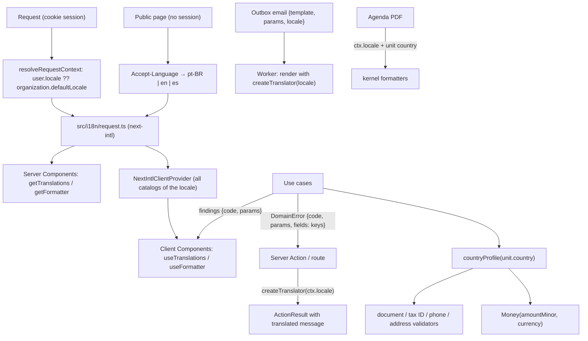

# Technical Specification: F16. Internationalization and Country Profiles

**Complexity:** complex

## 1. Technical Overview

**What.** A cross-cutting feature that makes every surface of GCli work in three languages and in eight countries:
- **Languages.** All interface text moves from code into message catalogs in pt-BR (the source), English and Spanish, loaded with **next-intl** without locale routing. Each user picks a language; the organization has a default. Use cases stop returning text: errors, validation messages and conflict findings carry message keys and parameters, and the text is produced at the boundary (Server Actions, routes, emails, PDFs) in the requester's language.
- **Formatting.** Dates, times, numbers and money follow the user's language combined with the country of the unit in context (pt-BR, es-MX, en-US...).
- **Country profiles.** A typed registry in the shared kernel describes Brazil, Portugal, Spain, Mexico, Argentina, Chile, Colombia and the United States. Each profile defines currency, tax ID, identity documents, address fields, phone code, councils, payment methods and time zones.
- **Units and money.**
  - Each unit has a country.
  - Money is stored as integer minor units plus a currency code.
  - Services have one price per currency.
  - Appointments snapshot price and currency.
- **Generic personal data.**
  - Identity documents become type plus number.
  - Phones are stored in E.164 (validated with `libphonenumber-js`).
  - Addresses use generic columns with labels and rules per country.
  - Professionals get one council registration per country.
- **Daylight saving time.** Calendar conversions become correct across changes. The offset-based cross-unit check of ADR-021 is replaced by a per-date check.

**Why.** F07, F08 and F09 add many more screens, emails, PDFs and money flows. Doing the extraction now keeps the rework from growing with every feature (PRD Section 8: F16 runs before F07, F08 and F09). The country model has to exist before billing (F09) writes money, because adding a currency column to charges and payments later would mean migrating financial records.

**How it fits the codebase.**
- **Kept:** the modular monolith, `Result` and `DomainError` with stable codes and `params`, Zod schemas shared by forms and use cases, `withRequestContext`, ports with `definePort`, and Testcontainers and Playwright tests.
- **What changes:**
  - **Text:** each module's `messages.ts` gives way to JSON catalogs per language, exposed through the module's public entry point.
  - **Locale:** `RequestContext` gains the user's locale.
  - **Money:** the kernel's `Money` gains a currency.
  - **Personal data:** CPF, CEP and Brazilian phone handling become country-driven.

### Scope

**Included (Core Scope, by decision of the interview):**
- **Languages:**
  - `pt-BR`, `en` and `es` (Latin American neutral Spanish) for every screen, message, validation error, email and PDF of F01 to F06.
  - Each user's preference, set in the user menu, with the organization default.
  - Before sign-in, the language follows the browser's `Accept-Language`.
- **Formatting:** locale formatting of dates, times, numbers and money, on the server (kernel helpers) and in the browser (next-intl formatter).
- **Country profiles** for the eight countries of the PRD table: currency and minor units, tax ID with validation and format, identity document types with validation and masks, address fields and postal code pattern, phone country code, council types, default payment methods, time zones, formatting region, legal-validation flag.
- **Organization and units:**
  - The organization gets a headquarters country, a default language and a tax ID (replacing CNPJ).
  - Each unit gets a country, a currency, a tax ID and a generic address.
  - A unit's country cannot change once the unit has appointments (later also charges and cash registers).
- **Money:**
  - Every amount is stored as `amount_minor` (bigint) plus `currency` (char(3)).
  - Service prices move to `service_price` (one per currency), with price history per currency; booking snapshots the price in the unit's currency.
  - `Money` refuses arithmetic across currencies, and a `MoneyTotals` helper groups sums by currency (used by F12 and F13).
- **Patients:** an identity document (country, type, normalized number), validated per type and unique per type within the organization; the same for the guardian. Phones are E.164; addresses are generic, with the country.
- **Professionals:**
  - identity document as type plus number;
  - E.164 phone;
  - council registrations, at most one per country; a working interval in a unit needs a registration in that unit's country unless the professional's council type is "NONE".
- **Patient search:** finds documents of any type; masking of the CPF keeps its last 5 digits (F05), other documents keep their last 4 characters.
- **Calendar:** wall-clock conversions correct across daylight saving changes (gap and overlap rules defined below); the F04 cross-unit overlap check compares concrete dates.
- **Legal warning:** units in countries whose legal rules are not validated (all except Brazil) show the Administrator banner of the PRD.
- **Documentation:**
  - PRD already updated;
  - ADR-028, ADR-029 and ADR-030 in both languages (ADR-030 supersedes ADR-021);
  - CLAUDE.md conventions;
  - the design system content section (languages, glossary, per-locale number rules) in both languages.
- **Integrated from cross-cutting concerns:**
  - **Authorization:** language preference is self-service; organization language and country need `organization:update`; unit country needs `setup:manage`.
  - **Auditing:** every changed setting, price and registration.
  - **Tenant scoping:** of the new tables.
  - **Lint:** a rule that rejects literal UI strings in JSX.

**Deferred (Full Scope additions):**
- Postal code lookup outside Brazil (the CEP lookup stays Brazil-only).
- Default document templates per language (F08).

**Not included:**
- Currency conversion.
- Countries beyond the eight profiles.
- Legal validation outside Brazil (PRD Section 7).
- Payment methods in use: F16 only provides each profile's default list, and F09 consumes it.

**Input contracts (Consumes):**
- F01: organization settings and user accounts, extended with language and headquarters country.
- F02: units, extended with country, currency, tax ID and generic address.
- F03: services, with prices moving to one row per currency.
- F04: professionals, with documents and council registrations per country.
- F05: patients, with document, phone and address per country.
- F06: agenda screens and messages, translated; price snapshot with currency.

**Output contracts (Provides):**
- `@/shared/i18n`:
  - supported locales;
  - `resolveLocale` and `formatLocale` (language plus country region);
  - a server translator `createTranslator(locale)` usable outside React (use case boundary, worker, PDF);
  - kernel formatters `formatDate`, `formatTime`, `formatDateTime`, `formatNumber` and `formatMoney`;
  - shared catalogs (common words, validation messages).
- `@/shared/kernel/countries`: `countryProfile(code)` with the full profile; `COUNTRY_CODES`, `CURRENCIES`.
- Validators and formatters for documents, tax IDs, phones and addresses.
- `Money` with currency, and `MoneyTotals`.
- Each module's public entry point exports its catalogs (`<module>Catalog`), so the root layout can build the message bundle.
- For F09 to F13: payment method defaults per country, per-currency totals, and money columns with currency as the established pattern.

### Traceability to the PRD

| PRD block (F16) | Where it is specified |
|---|---|
| Consumes / Provides | Scope; Section 5 (public APIs) |
| Core Scope | Scope → Included |
| Full Scope additions | Scope → Deferred |
| Capabilities | Sections 3, 5 and 6 (languages, formatting, profiles, money, documents, addresses, councils, time zones, totals, legal flag) |
| Experience | Section 4 (screens), Section 5 (actions) |
| Error Handling | Section 5 (error codes and catalog keys) |
| Acceptance criteria (Section 9, F16) | Section 7, acceptance tests |
| Cross-Feature Integration (F16 with F01–F06, F08–F13) | Section 7, cross-feature tests |

## 2. Architecture Impact

### Affected components

| Area | Path | Role |
|---|---|---|
| i18n core | `src/shared/i18n/` | Locales, resolution, server translator, kernel formatters, shared catalogs, catalog completeness test |
| next-intl config | `src/i18n/request.ts`, `next.config.ts` | Per-request locale and messages (no locale routing) |
| Country profiles | `src/shared/kernel/countries/` | Eight typed profiles and lookups |
| Personal data kernel | `src/shared/kernel/documents.ts`, `tax-id.ts`, `phone.ts`, `address.ts`, `money.ts`, `zoned-time.ts` | Validators, formatters, `Money` with currency, DST-correct conversions |
| Shared UI | `src/shared/ui/forms/*`, `src/shared/ui/app-shell/*`, `src/shared/ui/i18n/*` | Document, phone, address and money inputs by country; translated shell; language switcher; key-aware form errors |
| Request context | `src/shared/context/types.ts`, `src/modules/identity/application/session.ts` | `locale` in `RequestContext` |
| Action envelope | `src/shared/kernel/action-result.ts`, `src/shared/kernel/errors.ts`, `src/shared/kernel/validation.ts` | Message keys in errors; translation at the boundary |
| Modules | `src/modules/{identity,units,services,professionals,patients,scheduling}/` | Catalogs replace `messages.ts`; country-driven fields; money with currency |
| Emails and PDF | `src/shared/email/templates.ts`, `src/worker/jobs/email-send.ts`, `src/modules/scheduling/infrastructure/agenda-pdf-document.tsx` | Rendered in the recipient's or requester's locale |
| Routes | `src/app/**` | Translated pages; `<html lang>`; client message provider |
| Database | `prisma/schema.prisma`, `prisma/migrations/0008_internationalization/` | Locale, country, currency, generic documents, phones and addresses, `service_price`, `professional_registration` |
| Lint | `eslint.config.mjs` | `i18next/no-literal-string` for JSX in modules and routes |
| Documentation | `docs/architecture.{en,pt-BR}.md`, `docs/design-system.{en,pt-BR}.md`, `CLAUDE.md` | ADR-028–030, content rules, conventions |

### Data flow



## 3. Technical Decisions

| Decision | Chosen Approach | Alternative Considered | Trade-off |
|---|---|---|---|
| i18n library | **next-intl** v4 in the "without i18n routing" setup: `src/i18n/request.ts` returns the locale and messages per request; Server Components use `getTranslations` and `getFormatter`, Client Components use `useTranslations` and `useFormatter` under `NextIntlClientProvider` (interview) | Own catalogs and `t()`, or i18next | The de facto App Router library, with ICU messages, typed keys and support for RSC and Server Actions. One more dependency. |
| Locale source | Signed-in users: `user.locale ?? organization.defaultLocale`, resolved with the session into `RequestContext.locale`. Public pages: best match of `Accept-Language` among the three, else `pt-BR`. URLs do not change (ADR-015 stays) | Locale prefix in the URL | Internal app with sign-in: the preference follows the person on any device. |
| Catalog layout | One catalog per module and language: `src/modules/<module>/messages/{pt-BR,en,es}.json`, under the module's namespace (`patients.*`); shared namespaces in `src/shared/i18n/messages/` (`common.*`, `validation.*`, `shell.*`, `countries.*`). Each module index exports `<module>Catalog`; the root layout merges the catalogs of the active locale (interview) | One file per language | Module ownership and no merge conflicts. The full bundle (~1,000 messages per locale) is small enough to send to the client once. |
| Text out of use cases | `DomainError.fields` values and Zod messages become **message keys** (`patients.validation.fullNameTwoWords`); `params` keep their role. `toActionResult(result, t)` translates with `createTranslator(ctx.locale)` at the boundary. Conflict findings travel as `{code, severity, params}` and the browser translates them | Translating inside use cases | Use cases stay language-free and testable; one key per text in all languages. |
| Validation in forms | The same Zod schemas carry keys; `Field` translates `error` with `useTranslations()` when the value looks like a key. Server field errors arrive as keys too | Separate client schemas | One schema for form and server, as before. |
| Parameters with dates and amounts | Use cases pass raw values for times and money (ISO instants, `{amountMinor, currency}`) and the application layer formats them with `ctx.locale` and the unit's time zone through the kernel formatters before building params. The domain stays pure | Formatting in the domain (as today, 24-hour pt text) | en-US needs 12-hour times; the domain must not know locales. |
| Formatting locale | `formatLocale(language, country)`: language plus the unit's country when the language is spoken there (es + ES/MX/AR/CL/CO, pt + BR/PT, en + US), else the language's default region (en-US, es-ES, pt-BR) | Language only | Matches PRD F16 ("es-MX shows 1,234.56"). |
| Translations | Produced together with the extraction, following a glossary in the design system (agendamento → appointment / cita, encaixe → overbooking / sobrecupo, prontuário → clinical record / historia clínica...). Neutral Latin American Spanish (ustedes). Native-speaker review is a launch prerequisite outside Brazil (interview) | Empty catalogs for a translator | The app works in the three languages now; the review is tracked, not skipped. |
| Missing keys | A unit test loads every catalog and fails if any key differs between languages, if an ICU message does not parse, or if placeholders differ between languages. `eslint-plugin-i18next` (`no-literal-string`, `mode: "jsx-only"`) rejects literal text in JSX under `src/modules/*/ui` and `src/app` | Manual review | The PRD makes a missing translation a build failure. |
| Country registry | Typed constants in `src/shared/kernel/countries/` (one file per country plus an index). Each profile has the fields listed in Section 6. Labels are catalog keys, not text | Database table | Rules are code (validators, masks); a new country is one reviewed file. Changing a profile is a deploy. |
| Money | `amount_minor bigint` plus `currency char(3)` on every money column (interview). `Money` carries `{amountMinor, currency}`, refuses `add` across currencies, parses and formats per locale and currency minor units (CLP 0, others 2). `MoneyTotals` keeps one sum per currency | Currency derived from the unit | Every amount is self-describing (history, exports, moves between units). |
| Service prices | Table `service_price (service_id, currency, amount_minor)`, primary key `(service_id, currency)`; `service_price_change` gains `currency`. Currencies in use are the distinct currencies of active units; the service form shows one field per currency in use, all required | One price plus conversion | No exchange rates (PRD). Activating a unit in a new currency lists services without a price. |
| Identity documents | Columns `document_country char(2)`, `document_type varchar(16)`, `document_number varchar(32)` (normalized: upper case, no punctuation) on patients and professionals; `guardian_document_type` and `guardian_document_number` on patients. Partial unique index `(organization_id, document_type, document_number)`. Validators per type in `src/shared/kernel/documents.ts` (interview) | Document table with many per person | The PRD asks for one document; search and uniqueness stay simple. |
| Phones | E.164 strings (`varchar(16)`) validated and formatted with **libphonenumber-js** (min metadata); input with a country selector defaulting to the unit's country; Brazilian mobile rule (DDD + 9) kept for +55 mobiles. `phone_digits` keeps the national significant numbers for the "last 8 digits" search (interview) | Own rules | Precise mobile/landline detection and formatting for the eight countries; ~80 KB. |
| Addresses | Generic columns `address_country`, `postal_code`, `street`, `number`, `complement`, `district`, `city`, `region` (renamed from `cep` and `state`, widened). Per-country field list, labels, required flags and postal code pattern come from the profile; the Brazilian CEP lookup stays for BR | One column per country format | One schema and form component for all countries. |
| Council registrations | Table `professional_registration (professional_id, country, council_type, number, region)`, at most one per country; replaces `council_type`, `council_number`, `council_state`, `council_other_name`. A working interval in a unit needs a registration in that unit's country unless the professional has council type `NONE`. Documents (F08) will use the registration of the encounter's country (interview) | One registration | A doctor with CRM and Ordem dos Médicos needs both. |
| Unit country immutability | `units` asks the scheduling port `hasAnyInUnit(organizationId, unitId)` (new method) before changing the country; F09 and F11 will add their checks to the same rule | Allow change | Changing it would mix currencies in history. |
| Daylight saving time | All "local date + local time → instant" conversions go through `zonedTimeToUtc` (Intl, two-pass); `localMinuteToUtc` no longer adds minutes to UTC midnight. Gap rule: a non-existent local time (spring forward) moves forward by the gap (02:30 → 03:30). Overlap rule: an ambiguous local time (fall back) takes the earlier instant. The F04 cross-unit check compares the intervals as real instants on each date of the schedule's first 53 weeks. **ADR-030** supersedes ADR-021 (interview) | Temporal polyfill or date-fns-tz | No dependency. The calendar only needs conversions Intl already does correctly; tests pin real 2026–2027 transitions. |
| Organization time zone | The organization time zone list follows the headquarters country; unit zones follow the unit's country. `BRAZIL_TIME_ZONES` becomes the BR profile's list | One global list | PRD: time zones per country. |
| Emails | The outbox payload adds `locale` and `timeZone`; the worker renders templates with `createTranslator(locale)` and kernel formatters. Invitations use the inviter's choice of language for the invitee (default: organization default); password reset uses the user's locale | Render at enqueue time | Templates stay in one place and the stored payload stays small (it is redacted after sending). |
| Default lists | Default rows created by the system (cancellation reasons, referral sources, service categories) are created in the organization's default language at first use; afterwards they are clinic data and are not translated | Translating stored rows | PRD: data typed by the clinic is not translated. |
| Legal flag | `legalRulesValidated: boolean` in each profile (true only for BR); the units page and the unit form show the PRD banner for units whose country is not validated | Hiding foreign countries | PRD: Brazilian rules apply, with a warning. |

### Assumptions

These were decided during this spec rather than by the PRD, and can be overridden:
- **Supported locales.** The three locales are `pt-BR`, `en` and `es`. Language names are shown in their own language: "Português (Brasil)", "English", "Español".
- **Language preference.**
  - Stored in `app_user.locale`; `null` means "use the organization default".
  - Changing it re-renders the current page with `router.refresh()`.
- **Pre-login language.**
  - The login page shows a small "Idioma" selector that sets a `gcli_locale` cookie.
  - The cookie takes precedence over `Accept-Language` until sign-in, and the user's preference wins after sign-in.
- **Organization country.**
  - Existing organizations, units, patients and professionals migrate as Brazil, BRL and pt-BR.
  - Existing phones become `+55…` and existing CPFs become documents of type `CPF` (country BR).
- **Profile details (V1).**

  | Country | Formatting region | Default time zone | Tax ID check | Postal code pattern | Region field |
  |---|---|---|---|---|---|
  | BR | pt-BR | America/Sao_Paulo | CNPJ mod-11 (alphanumeric from 2026) | `^\d{8}$` | UF list |
  | PT | pt-PT | Europe/Lisbon | NIF mod-11 | `^\d{4}-?\d{3}$` | distrito (free text) |
  | ES | es-ES | Europe/Madrid | NIF/CIF letter or digit check | `^\d{5}$` | provincia list |
  | MX | es-MX | America/Mexico_City | RFC format (12–13 chars) | `^\d{5}$` | estado list |
  | AR | es-AR | America/Argentina/Buenos_Aires | CUIT mod-11 | `^([A-Z]\d{4}[A-Z]{3}\|\d{4})$` | provincia list |
  | CL | es-CL | America/Santiago | RUT mod-11 with K | `^\d{7}$` (optional) | región list |
  | CO | es-CO | America/Bogota | NIT mod-11 (weights) | `^\d{6}$` (optional) | departamento list |
  | US | en-US | America/New_York | EIN `^\d{2}-?\d{7}$` | `^\d{5}(-\d{4})?$` | state list |

- **Identity document types.**
  - Types: `CPF`, `NIF_PT`, `DNI_ES`, `NIE_ES`, `CURP`, `DNI_AR`, `CUIT_AR`, `RUT_CL`, `CC_CO`, `CE_CO`, `US_DL` (driver's license or state ID, free format up to 20 characters, no check).
  - The SSN is never collected.
  - Patients from another country choose "Outro país" plus the country and a type of that country.
- **Professional documents.** The same types as patients. The US professional identity is the NPI, a council registration (10 digits, Luhn check with prefix 80840), not an identity document.
- **Council types.**
  - BR keeps the current list.
  - PT and ES use their orders and colleges (Section 6), with a region field (ES: colegio provincial) where relevant.
  - MX: `CEDULA` (7–8 digits).
  - AR: `MATRICULA_NACIONAL` and `MATRICULA_PROVINCIAL` (region required for provincial).
  - CL: `SIS` (registry number).
  - CO: `RETHUS`.
  - US: `STATE_LICENSE` (state required) and `NPI`; US professionals may hold both, stored as one registration with the NPI in its own column (`npi`).
- **Masking for Front Desk.** In search results, the CPF is shown as "***.***.247-25"; other documents show "•••" plus their last 4 characters.
- **Patient search.** A term of digits or of letters and digits containing at least one digit and at least 5 characters searches `document_number` (normalized, any type) and the phone digits. Names keep the trigram search.
- **Money input.** It accepts the locale's separators (pt-BR and es: "1.234,56"; en: "1,234.56"); the minor units follow the currency (CLP: no decimals).
- **Spanish.** The Spanish catalog uses neutral Latin American forms (ustedes, computadora...). Spain units get the same text; formats use es-ES.
- **Not translated.** Proper names and clinic data are never translated: services, units, rooms, reasons, notes, and patient and professional names.
- **Email footer and subject lines** are catalog messages too.
- **Seeds.** The `seed:demo` script (branch `chore/seed-demo-data`) is updated after F16 merges to create one unit in Portugal (EUR) and one service price per currency.

## 4. Component Overview

### Frontend

| File Path | New/Modified | Purpose | Key Responsibilities |
|---|---|---|---|
| `src/app/layout.tsx` | Modified | Root layout | `<html lang={locale}>`; wraps children with `NextIntlClientProvider` (locale, merged messages, time zone of the selected unit or organization) |
| `src/app/(public)/**` | Modified | Public pages | Translated texts; login page language selector (cookie) |
| `src/app/(app)/**` (every `page.tsx`, `actions.ts`, `layout.tsx`) | Modified | App pages and actions | `getTranslations` for titles and metadata; actions translate results with `createTranslator(ctx.locale)` |
| `src/shared/ui/app-shell/user-menu.tsx` | Modified | User menu | "Idioma" radio group; calls `setUserLocaleAction`; `router.refresh()` |
| `src/shared/ui/app-shell/{navigation.ts,app-sidebar.tsx,app-header.tsx,page-header.tsx,under-construction.tsx}` | Modified | Shell | Navigation labels as keys; translated shell texts |
| `src/shared/ui/i18n/language-select.tsx` | New | Language picker | Shared by the user menu and the login page |
| `src/shared/ui/i18n/legal-banner.tsx` | New | Legal warning | PRD text for units whose country is not legally validated |
| `src/shared/ui/forms/field.tsx` | Modified | Field | Translates error keys |
| `src/shared/ui/forms/document-input.tsx` | New (replaces `cpf-input.tsx`) | Identity document | Country and type selects (defaults from the unit's country), mask and validation per type |
| `src/shared/ui/forms/tax-id-input.tsx` | New | Tax ID | Mask and validation of the country's tax ID |
| `src/shared/ui/forms/phone-input.tsx` | Modified | Phone | Country code select plus national number; E.164 value; `libphonenumber-js` formatting |
| `src/shared/ui/forms/address-fields.tsx` | Modified | Address | Fields, labels, required flags and postal pattern of the country; CEP lookup only for BR; region select where the profile has a list |
| `src/shared/ui/forms/money-input.tsx` | Modified | Money | Currency symbol and separators of the locale; minor units of the currency |
| `src/modules/*/ui/**` | Modified | Module screens | Every literal moves to the module catalog; dates, numbers and money through `useFormatter` and kernel formatters |
| `src/modules/identity/ui/organization.tsx` | Modified | Organization settings | "País da sede", "Idioma padrão", tax ID by country, time zones of the country |
| `src/modules/identity/ui/users.tsx` | Modified | Users | Invitation dialog gets "Idioma do convite" (default: organization default) |
| `src/modules/units/ui/unit-form.tsx`, `rooms-panel.tsx`, units list page | Modified | Units | "País" first; currency read-only; tax ID, address and time zones per country; legal banner |
| `src/modules/services/ui/service-form.tsx`, `services-table.tsx`, `price-history.tsx` | Modified | Services | One price field per currency in use; table shows prices per currency; history per currency |
| `src/modules/professionals/ui/professional-form.tsx` | Modified | Professionals | Document by type; phone by country; registrations table (one per country) |
| `src/modules/professionals/ui/schedule-editor.tsx` | Modified | Working hours | Cross-unit conflicts computed per date; message when a unit's country lacks a registration |
| `src/modules/patients/ui/patient-form.tsx`, `patients-table.tsx`, `global-patient-search.tsx`, `patient-header.tsx`, `duplicate-dialog.tsx` | Modified | Patients | Document, guardian document, phone and address by country; masking rules; translated texts |
| `src/modules/scheduling/ui/**` | Modified | Agenda | Findings translated in the browser from `{code, params}`; prices with currency; week and month names from the formatter |

### Backend

| File Path | New/Modified | Purpose | Key Responsibilities |
|---|---|---|---|
| `src/shared/i18n/locales.ts` | New | Locales | `SUPPORTED_LOCALES`, `DEFAULT_LOCALE`, `isLocale`, `negotiateLocale(acceptLanguage)` |
| `src/shared/i18n/format.ts` | New | Formatting | `formatLocale(language, country)`, `formatDate`, `formatTime`, `formatDateTime` (with time zone), `formatNumber`, `formatMoney(money, locale)` |
| `src/shared/i18n/translator.ts` | New | Server translator | `createTranslator(locale)` over the merged catalogs (next-intl `createTranslator`); used by actions, routes, worker and PDF |
| `src/shared/i18n/catalogs.ts` | New | Bundle | Merges shared and module catalogs per locale (modules register through `registerCatalog`, called by the composition root) |
| `src/shared/i18n/messages/{pt-BR,en,es}.json` | New | Shared catalogs | `common`, `validation`, `shell`, `countries` (names, document and council labels), `email` |
| `src/shared/i18n/catalogs.test.ts` | New | Completeness | Same keys in every language, ICU parses, same placeholders |
| `src/i18n/request.ts` | New | next-intl config | Locale from `getRequestContext()` or cookie and `Accept-Language`; messages from `catalogs.ts`; default time zone |
| `next.config.ts` | Modified | Plugin | `createNextIntlPlugin("./src/i18n/request.ts")` |
| `src/shared/kernel/countries/{index.ts,br.ts,pt.ts,es.ts,mx.ts,ar.ts,cl.ts,co.ts,us.ts,types.ts}` | New | Country profiles | Profile type and data; `countryProfile`, `COUNTRY_CODES`, `CURRENCIES`, `currencyOf(country)`, `minorUnits(currency)` |
| `src/shared/kernel/documents.ts` | New | Identity documents | `DOCUMENT_TYPES`; `normalizeDocument`, `validateDocument(type, value)`, `formatDocument`, `maskDocument` |
| `src/shared/kernel/tax-id.ts` | New (absorbs `cnpj.ts`) | Tax IDs | Validation and format per country |
| `src/shared/kernel/cpf.ts`, `cnpj.ts` | Modified | Brazil | Kept as the BR validators used by `documents.ts` and `tax-id.ts` |
| `src/shared/kernel/phone.ts` | Modified | Phones | `PhoneNumber.parse(input, defaultCountry)` → E.164 via `libphonenumber-js`; `format(locale)`; `nationalDigits()`; `isMobile()` |
| `src/shared/kernel/address.ts` | Modified | Addresses | Generic schema built from the country profile; `formatAddress(address)` per country order |
| `src/shared/kernel/money.ts` | Modified | Money | `Money.of(amountMinor, currency)`, `parse(text, currency, locale)`, `add` (same currency only), `MoneyTotals` |
| `src/shared/kernel/zoned-time.ts` | Modified | DST | `zonedTimeToUtc` with gap and overlap rules; `localMinuteToUtc` through it; `utcToZonedParts` unchanged |
| `src/shared/kernel/time-zones.ts` | Modified | Zones | Zone lists move to the profiles; `timeZoneLabel` stays |
| `src/shared/kernel/errors.ts`, `action-result.ts`, `validation.ts` | Modified | Errors | Field values are keys; `toActionResult(result, translator)`; `parseInput` returns Zod message keys |
| `src/shared/context/types.ts`, `src/modules/identity/application/session.ts` | Modified | Context | `locale` and `organizationCountry` in `RequestContext` |
| `src/modules/identity/application/organization.ts`, `users.ts`, `invitations.ts` | Modified | Settings | `defaultLocale`, `country`, tax ID; `setUserLocale`; invitation locale; outbox payload with locale |
| `src/shared/email/templates.ts`, `src/worker/jobs/email-send.ts` | Modified | Emails | Templates take `{locale, timeZone}` and use the translator |
| `src/modules/units/application/*` | Modified | Units | Country, currency, tax ID, generic address; country immutability through the port; new currency warning |
| `src/modules/units/application/ports.ts` | Modified | Port | `hasAnyInUnit(organizationId, unitId)` |
| `src/modules/services/application/*` | Modified | Services | Prices per currency (`service_price`); history per currency; `currenciesInUse`; provided reads return `prices` |
| `src/modules/professionals/application/*`, `domain/working-hours.ts` | Modified | Professionals | Document, phone, registrations per country; cross-unit check per date; registration required per unit country |
| `src/modules/patients/application/*`, `domain/search-term.ts`, `domain/masking.ts` | Modified | Patients | Document, guardian document, phone, address by country; search and masking per type |
| `src/modules/scheduling/application/*`, `domain/conflicts/rules.ts` | Modified | Scheduling | Price snapshot per currency; findings with raw params formatted in the application layer; translated PDF |
| `src/modules/*/messages.ts` | Removed | Old catalogs | Replaced by `src/modules/*/messages/{pt-BR,en,es}.json` and key constants |
| `src/modules/*/index.ts` | Modified | Public APIs | Export `<module>Catalog` |
| `src/composition.ts` | Modified | Wiring | Registers module catalogs |
| `eslint.config.mjs`, `package.json` | Modified | Tooling | `next-intl`, `libphonenumber-js`, `eslint-plugin-i18next` |

### Database

| Migration File | Tables Affected | Operation | Notes |
|---|---|---|---|
| `prisma/migrations/0008_internationalization/migration.sql` | `organization`, `app_user`, `invitation`, `unit`, `service`, `service_price` (new), `service_price_change`, `appointment`, `professional`, `professional_registration` (new), `patient` | ALTER, CREATE, data migration | Data copied before old columns are dropped (Brazil defaults); CHECKs for locales, countries, currencies and document types; new indexes |

## 5. API Contracts

All actions return the F01 `ActionResult` envelope, with `message` translated into the requester's locale and `fields` values translated as well.

### Error codes (new or changed)

| Code | HTTP Status | Catalog key (pt-BR source text) |
|---|---|---|
| `DOCUMENT_INVALID` | 400 | `validation.documentInvalid` — "{type} inválido." |
| `PATIENTS_DOCUMENT_TAKEN` (replaces `PATIENTS_CPF_TAKEN`) | 409 | `patients.errors.documentTaken` — "Este {type} já está cadastrado para {name}." |
| `TAX_ID_INVALID` | 400 | `validation.taxIdInvalid` — "{type} inválido." |
| `PHONE_INVALID` | 400 | `validation.phoneInvalid` — "Informe um telefone válido." / `validation.mobileInvalid` — "Informe um celular válido." |
| `POSTAL_CODE_INVALID` | 400 | `validation.postalCodeInvalid` — "Código postal inválido." |
| `UNITS_COUNTRY_LOCKED` | 409 | `units.errors.countryLocked` — "Não é possível alterar o país de uma unidade que já tem agendamentos, cobranças ou caixas." |
| `SERVICES_PRICE_REQUIRED` | 400 | `services.validation.priceRequired` — "Informe o preço em {currency}." |
| `SCHEDULING_NO_PRICE_FOR_CURRENCY` | 409 | `scheduling.errors.noPriceForCurrency` — "Este serviço não tem preço em {currency}. Defina o preço no catálogo antes de agendar nesta unidade." |
| `PROFESSIONALS_REGISTRATION_REQUIRED` | 400 | `professionals.errors.registrationRequired` — "Cadastre o registro profissional em {country} antes de definir horários na unidade {unit}." |
| `PROFESSIONALS_REGISTRATION_DUPLICATE` | 400 | `professionals.validation.oneRegistrationPerCountry` — "Use um registro por país." |
| `MONEY_CURRENCY_MISMATCH` | 500 (bug) | Not user-facing: thrown by `Money.add` across currencies |
| `LOCALE_INVALID` | 400 | `validation.localeInvalid` — "Escolha um idioma da lista." |
| Existing codes | — | Same codes; their texts move to the catalogs under `<module>.errors.<code>` |

Other catalog texts (not errors):
- `units.legalBanner`: "As regras legais deste país ainda não foram validadas. O sistema aplica as regras brasileiras."
- `units.newCurrencyWarning`: "{count} serviços ativos não têm preço em {currency}: {names}."
- `shell.language`: "Idioma"
- `common.languages.*`: the three language names

### Action: Set user language
- **Action:** `setUserLocaleAction` → `identity.setUserLocale`
- **Permission:** signed-in user, self only
- **Request:** `{ "locale": "es" }` (one of the three)
- **Response:** `{ "ok": true, "data": { "locale": "es" } }`
- **Audit:** `UPDATE` on `user`, field `locale`.

### Action: Update organization (changed)
New fields:

| Field | Type | Required | Validation | Description |
|---|---|---|---|---|
| `country` | `string` | Yes | one of the 8 codes | Headquarters country |
| `defaultLocale` | `string` | Yes | `pt-BR`, `en`, `es` | Default language |
| `taxId` | `string` | No | country tax ID check | Replaces `cnpj` |
| `timeZone` | `string` | Yes | a zone of the country | As before, restricted |

```json
{ "legalName": "Clínica Demo Serviços Médicos Ltda", "tradeName": "Clínica Demo", "country": "BR", "defaultLocale": "pt-BR", "taxId": "12.ABC.345/01DE-35", "timeZone": "America/Sao_Paulo", "slotGranularityMinutes": 15, "version": 3 }
```

### Actions: Units (changed)

| Field | Type | Required | Validation | Description |
|---|---|---|---|---|
| `country` | `string` | Yes (create) | 8 codes; immutable once the unit has appointments | Unit country |
| `taxId` | `string` | No | country tax ID check | Replaces `cnpj` |
| `timeZone` | `string` | Yes | a zone of the country | Unit zone |
| `address` | `object` | No | profile schema (`postalCode`, `street`, `number`, `complement`, `district`, `city`, `region`) | Generic address |
| `phone` | `string` | No | E.164 for the country | Unit phone |

Response of create and update includes `currency` (derived, read-only) and `servicesWithoutPrice: [{ id, name }]` when the unit's currency is new for the organization.

```json
{ "ok": true, "data": { "unitId": "0192c0cc-3333-7eee-8fff-2a2b3c3d4e4f", "currency": "EUR", "servicesWithoutPrice": [ { "id": "0192d0aa-1111-7aaa-8bbb-0c0d0e0f1a1b", "name": "Consulta dermatológica" } ] } }
```

### Actions: Services (changed)
`createService` and `updateService` replace `priceCents` with `prices`:

```json
{ "name": "Consulta dermatológica", "categoryId": "0192…", "durationMinutes": 30, "prices": [ { "currency": "BRL", "amountMinor": 25000 }, { "currency": "EUR", "amountMinor": 6000 } ], "color": "blue", "requiresRoom": false, "allowedRoomIds": [], "confirmPriceChange": true }
```

Every currency in use must be present (`SERVICES_PRICE_REQUIRED` with field `prices.<currency>`). History rows record the currency. `services.listActiveServices` and `services.getServiceSummaries` return `prices: [{ currency, amountMinor }]` instead of `priceCents`.

### Actions: Professionals (changed)

| Field | Type | Required | Validation | Description |
|---|---|---|---|---|
| `document` | `object` | No | `{ country, type, number }`, type of the country, check digits | Replaces `cpf` |
| `phone` | `string` | No | E.164 | Phone |
| `registrations` | `array` | No | at most one per country; `{ country, councilType, number, region, npi }` validated by the profile | Replaces the council fields |
| `councilType` `"NONE"` | — | — | kept as a flag `hasNoCouncil` | Professionals without a council |

`saveSchedule` returns `PROFESSIONALS_REGISTRATION_REQUIRED` when an interval is in a unit whose country has no registration (unless `hasNoCouncil`). Cross-unit conflicts are reported per weekday as before, computed on concrete dates.

### Actions: Patients (changed)

| Field | Type | Required | Validation | Description |
|---|---|---|---|---|
| `document` | `object` | No | `{ country, type, number }` | Replaces `cpf` |
| `mobilePhone` | `string` | Yes | E.164, mobile for countries that distinguish it | Default country from the selected unit |
| `secondaryPhone` | `string` | No | E.164 | |
| `address` | `object` | No | profile schema of `address.country` | Generic address |
| `guardian.document` | `object` | No | as `document` | Replaces `guardian.cpf` |

```json
{ "mode": "full", "fullName": "María Fernanda López", "birthDate": "1991-05-20", "document": { "country": "ES", "type": "DNI_ES", "number": "12345678Z" }, "mobilePhone": "+34612345678", "address": { "country": "ES", "postalCode": "28013", "street": "Calle Mayor", "number": "10", "city": "Madrid", "region": "M" } }
```

Duplicate document: `PATIENTS_DOCUMENT_TAKEN` with params `{ type: "DNI", name: "María F. López" }` and `fields.document` plus `existingPatientId`. Search results return `document: { type, display }`, where `display` is masked for Front Desk.

### Scheduling (changed)
- **Booking:** the price snapshot comes from `service_price` for the unit's currency. The responses return `price: { amountMinor, currency }` instead of `priceCents`.
- **Findings:** returned as `{ code, severity, params }`. `params` contain formatted values (times in the unit zone and the requester's locale, names). The browser renders `t("scheduling.findings.<code>", params)`.
- **Errors:** `SCHEDULING_CONFLICTS` and `SCHEDULING_SERIES_CONFLICTS` keep `details`, but without a pre-rendered `message` per finding.

### Public module APIs (Provides)

| Function | Consumers | Returns |
|---|---|---|
| `countryProfile(code)` (`@/shared/kernel/countries`) | All modules | Profile (Section 6) |
| `createTranslator(locale)` (`@/shared/i18n/translator`) | Actions, routes, worker, PDF | `t(key, params)` |
| `formatMoney`, `formatDate`, `formatTime`, `formatDateTime`, `formatNumber`, `formatLocale` (`@/shared/i18n/format`) | Server and application code | Strings |
| `Money`, `MoneyTotals` (`@/shared/kernel/money`) | F06, F09–F13 | Money with currency and per-currency sums |
| `validateDocument`, `formatDocument`, `maskDocument` (`@/shared/kernel/documents`) | F05, F04, F14 | Validation and display |
| `<module>Catalog` (each module index) | Root layout, translator | `{ "pt-BR": {...}, en: {...}, es: {...} }` |
| `units.hasAnyInUnit` port method | `units` | Implemented by scheduling |

## 6. Data Model

### Country profile (code, `src/shared/kernel/countries/types.ts`)

| Field | Type | Example (BR) |
|---|---|---|
| `code` | `"BR" \| "PT" \| "ES" \| "MX" \| "AR" \| "CL" \| "CO" \| "US"` | `"BR"` |
| `currency` | ISO 4217 | `"BRL"` |
| `formattingRegion` | BCP 47 | `"pt-BR"` |
| `phoneCode` | string | `"55"` |
| `timeZones` | IANA list; `defaultTimeZone` | Brazilian zones; `"America/Sao_Paulo"` |
| `taxId` | `{ type, labelKey, normalize, validate, format }` | CNPJ |
| `identityDocuments` | `{ type, labelKey, normalize, validate, format, mask }[]` | `[CPF]` |
| `address` | `{ fields: [{ name, labelKey, required }], postalCode: { pattern, labelKey, lookup? }, regions?: { code, name }[] }` | CEP with ViaCEP lookup; UF list |
| `councils` | `{ type, labelKey, regionRequired, regions?, numberPattern? }[]` | CRM… |
| `paymentMethods` | keys | `["CASH","PIX","DEBIT_CARD","CREDIT_CARD","TRANSFER","OTHER"]` |
| `legalRulesValidated` | boolean | `true` (false for the other seven) |

### Table changes

**`organization`**

| Column | Type | Nullable | Default | Description |
|---|---|---|---|---|
| `country` | `char(2)` | No | `'BR'` | Headquarters country |
| `default_locale` | `varchar(5)` | No | `'pt-BR'` | Default language |
| `tax_id` | `varchar(20)` | Yes | — | Renamed from `cnpj`, normalized |

**`app_user`**: `locale varchar(5)` (nullable; null = organization default). **`invitation`**: `locale varchar(5) NOT NULL DEFAULT 'pt-BR'`.

**`unit`**

| Column | Type | Nullable | Default | Description |
|---|---|---|---|---|
| `country` | `char(2)` | No | `'BR'` (migration only) | Unit country |
| `currency` | `char(3)` | No | `'BRL'` (migration only) | Derived from the country, stored for queries |
| `tax_id` | `varchar(20)` | Yes | — | Renamed from `cnpj` |
| `postal_code` | `varchar(10)` | Yes | — | Renamed from `cep` |
| `region` | `varchar(64)` | Yes | — | Renamed from `state` |
| `phone` | `varchar(16)` | Yes | — | E.164 (data migrated with `+55`) |

**`service_price`** (new)

| Column | Type | Nullable | Default | Description |
|---|---|---|---|---|
| `service_id` | `uuid` | No | — | FK `service(id)` |
| `organization_id` | `uuid` | No | — | Tenant |
| `currency` | `char(3)` | No | — | ISO 4217 |
| `amount_minor` | `bigint` | No | — | ≥ 0, ≤ 9,999,999 in major units |
| `updated_at` | `timestamptz` | No | `now()` | |

Primary key `(service_id, currency)`; index `(organization_id, currency)`. `service.price_cents` is dropped after the data copy. **`service_price_change`**: `currency char(3)`, `previous_amount_minor bigint`, `amount_minor bigint` (renamed from `*_price_cents`).

**`appointment`**: `price_minor bigint` (renamed from `price_cents`), `currency char(3) NOT NULL` (data: `'BRL'`). CHECK `ck_appointment_price` becomes `price_minor >= 0`.

**`professional`**: `document_country char(2)`, `document_type varchar(16)`, `document_number varchar(32)` (from `cpf`), `phone varchar(16)` (E.164), `has_no_council boolean NOT NULL DEFAULT false` (from `council_type = 'NONE'`); council columns dropped after the copy.

**`professional_registration`** (new)

| Column | Type | Nullable | Default | Description |
|---|---|---|---|---|
| `id` | `uuid` | No | — | Primary key |
| `organization_id` | `uuid` | No | — | Tenant |
| `professional_id` | `uuid` | No | — | FK `professional(id)` |
| `country` | `char(2)` | No | — | Registration country |
| `council_type` | `varchar(24)` | No | — | Type of the country |
| `council_other_name` | `varchar(40)` | Yes | — | For `OTHER` |
| `number` | `varchar(20)` | Yes | — | Registration number |
| `region` | `varchar(8)` | Yes | — | State, province or college |
| `npi` | `char(10)` | Yes | — | US only |

Unique `(professional_id, country)`; unique `(organization_id, country, council_type, number, region)` where `number IS NOT NULL` (replaces the F04 registration index).

**`patient`**: `document_country`, `document_type`, `document_number` (from `cpf`); `guardian_document_type`, `guardian_document_number` (from `guardian_cpf`); `mobile_phone` and `secondary_phone` widened to `varchar(16)` E.164; `phone_digits` keeps national significant numbers; `address_country char(2)`, `postal_code` (from `cep`), `region` (from `state`).

### Indexes and constraints

| Name | Type | Definition | Purpose |
|---|---|---|---|
| `uq_patient_org_document` | UNIQUE (partial) | `(organization_id, document_type, document_number) WHERE document_number IS NOT NULL` | Replaces `uq_patient_org_cpf` |
| `uq_professional_org_document` | UNIQUE (partial) | same on `professional` | Replaces the F04 CPF index |
| `ix_patient_document_number` | btree | `(organization_id, document_number)` | Search by document of any type |
| `ck_*_locale` | CHECK | `IN ('pt-BR','en','es')` | Valid locales |
| `ck_*_country` | CHECK | `IN ('BR','PT','ES','MX','AR','CL','CO','US')` | Valid countries |
| `ck_*_currency` | CHECK | `IN ('BRL','EUR','MXN','ARS','CLP','COP','USD')` | Valid currencies |
| `ck_*_document` | CHECK | `(document_type IS NULL) = (document_number IS NULL)` | Consistent pairs |
| `ck_*_phone` | CHECK | `phone ~ '^\+[1-9][0-9]{6,14}$'` | E.164 |

### Migration excerpt (data part)

```sql
-- Units and money default to Brazil: every existing record was created under the Brazilian rules.
ALTER TABLE unit ADD COLUMN country char(2) NOT NULL DEFAULT 'BR', ADD COLUMN currency char(3) NOT NULL DEFAULT 'BRL';
ALTER TABLE unit RENAME COLUMN cnpj TO tax_id;  ALTER TABLE unit RENAME COLUMN cep TO postal_code;  ALTER TABLE unit RENAME COLUMN state TO region;
UPDATE unit SET phone = '+55' || phone WHERE phone IS NOT NULL;

INSERT INTO service_price (service_id, organization_id, currency, amount_minor, updated_at)
SELECT id, organization_id, 'BRL', price_cents, updated_at FROM service;
ALTER TABLE service DROP COLUMN price_cents;

UPDATE patient SET document_country = 'BR', document_type = 'CPF', document_number = cpf WHERE cpf IS NOT NULL;
UPDATE patient SET mobile_phone = '+55' || mobile_phone, secondary_phone = '+55' || secondary_phone;

INSERT INTO professional_registration (id, organization_id, professional_id, country, council_type, council_other_name, number, region)
SELECT gen_random_uuid(), organization_id, id, 'BR', council_type, council_other_name, council_number, council_state
FROM professional WHERE council_type <> 'NONE';
```

The migration runs in one transaction; the integration suite migrates a populated F01–F06 database and checks the copied values.

## 7. Testing Strategy

### Test files

| Test File | Test Type | Target | Coverage Goal |
|---|---|---|---|
| `src/shared/i18n/catalogs.test.ts` | Unit | Catalog completeness and ICU | 100% of catalogs |
| `src/shared/i18n/format.test.ts` | Unit | Formatting locales | 100% |
| `src/shared/i18n/locales.test.ts` | Unit | Negotiation | 100% |
| `src/shared/kernel/countries/countries.test.ts` | Unit | Profiles | Every profile |
| `src/shared/kernel/documents.test.ts` | Unit | Document validators | Every type |
| `src/shared/kernel/tax-id.test.ts` | Unit | Tax IDs | Every country |
| `src/shared/kernel/phone.test.ts` | Unit | Phones | 8 countries |
| `src/shared/kernel/money.test.ts` | Unit | Money with currency | 100% |
| `src/shared/kernel/zoned-time.test.ts` | Unit | DST | Real transitions |
| `src/modules/professionals/domain/working-hours.test.ts` | Unit | Cross-unit check per date | DST cases |
| `tests/integration/i18n/locale.test.ts` | Integration | Locale resolution, preference, emails | Language criteria |
| `tests/integration/i18n/countries.test.ts` | Integration | Units, money, documents, registrations | Country criteria |
| `tests/integration/i18n/migration.test.ts` | Integration | Data migration | Copied values |
| `tests/integration/**` (existing) | Integration | F01–F06 | Updated to keys and new contracts |
| `tests/e2e/f16-internationalization.spec.ts` | E2E | Language switch and a Portugal unit | Critical journeys |

### Unit tests

| Test Function | Description | Assertions |
|---|---|---|
| `F16: every catalog has the same keys, valid ICU and the same placeholders in the three languages` | Completeness | No missing or extra key; every message parses; placeholder sets equal |
| `F16: the formatting locale combines language and unit country` | `formatLocale` | es+MX → es-MX; en+BR → en-US; pt+PT → pt-PT; es+US → es-ES |
| `F16: money is formatted per locale and currency minor units` | `formatMoney` | pt-BR BRL "R$ 1.234,56"; en-US USD "$1,234.56"; es-MX MXN "$1,234.56"; es-CL CLP "$1.235" |
| `F16: money refuses to add different currencies and totals group by currency` | `Money`, `MoneyTotals` | BRL + EUR throws; totals {BRL: …, EUR: …} |
| `F16: identity documents are validated per type` | `validateDocument` | Valid and invalid samples for CPF, NIF_PT, DNI_ES, NIE_ES, CURP, DNI_AR, CUIT_AR, RUT_CL (with K), CC_CO, CE_CO |
| `F16: tax IDs are validated per country` | `tax-id` | CNPJ (numeric and alphanumeric), NIF/NIPC, NIF/CIF, RFC, CUIT, RUT, NIT, EIN |
| `F16: phones are parsed to E.164 with the unit's default country` | `PhoneNumber` | "(11) 98888-7777"/BR → +5511988887777 mobile; "612 34 56 78"/ES → +34612345678; invalid rejected |
| `F16: wall-clock times are converted correctly across daylight saving changes` | `zonedTimeToUtc` | Madrid 2026-03-29 02:30 → 03:30 (gap); 2026-10-25 02:30 → earlier instant (overlap); New York, Santiago, Lisbon transitions; Brazil unchanged |
| `F16: a 09:00 slot stays at 09:00 local time on both sides of a change` | `localMinuteToUtc`, `rangeAt` | Madrid Friday before and Monday after 2026-03-29 |
| `F16: cross-unit working hours are compared on concrete dates` | `findCrossUnitConflict` | São Paulo and Lisbon overlap only during part of the year → reported with the first date |
| `F16: patient search terms recognize documents of any type` | `classifySearchTerm` | "12345678Z" → document; "529.982.247-25" → document or phone; "Mar" → name |
| `F16: documents are masked for Front Desk per type` | `maskDocument` | CPF "***.***.247-25"; DNI "•••678Z" |

### Acceptance tests (PRD Section 9, F16)

| Test Function | PRD criterion | Assertions |
|---|---|---|
| `F16: each user can switch language and every message is translated` | Language switch; no hard-coded text | `setUserLocale` to `en` and `es`; an action error returns the English/Spanish text; catalogs test and lint pass in CI |
| `F16: new users and invitations use the organization default; public pages follow the browser` | Defaults | Organization default `es` → invitation email in Spanish; `Accept-Language: en-US` → login in English; unknown → pt-BR |
| `F16: dates, times, numbers and money follow the language and the unit country` | Formatting | Agenda times, booking price and PDF dates for pt-BR/BR, en/US and es/MX |
| `F16: a unit's country defines its settings and cannot change after it has appointments` | Unit country | Creating a PT unit sets EUR, zones Europe/Lisbon…; after one appointment, changing the country returns `UNITS_COUNTRY_LOCKED` |
| `F16: documents are validated per type, unique per type and masked for front desk` | Documents | Invalid DNI → `DOCUMENT_INVALID`; same DNI twice → `PATIENTS_DOCUMENT_TAKEN`; same number under another type allowed; masked search results |
| `F16: every amount is stored in minor units with its currency` | Money storage | Booking in a CL unit stores `price_minor` without decimals and `currency = 'CLP'` |
| `F16: booking snapshots the price in the unit currency and needs a price in it` | Price per currency | EUR price used in a PT unit; removing it blocks booking with `SCHEDULING_NO_PRICE_FOR_CURRENCY`; creating a unit in a new currency lists services without price |
| `F16: money totals are grouped by currency and CSV separators follow the language` | Totals and CSV | `MoneyTotals` over BRL and EUR; CSV writer helper (shared, used by F13) produces `;`/`,` for pt-BR and es and `,`/`.` for en with a currency column |
| `F16: calendar logic is correct across daylight saving changes` | DST | Professional in Madrid works 09:00–13:00 Mon–Fri; appointments on the Friday before and the Monday after 2026-03-29 both show 09:00 local; recurrence across the change keeps 09:00 |
| `F16: units outside Brazil apply Brazilian legal rules and warn the administrator` | Legal | PT unit: profile `legalRulesValidated = false`; units page data includes the banner flag; consent and retention rules unchanged |

### Cross-Feature Integration

| Test Function | PRD criterion | Assertions |
|---|---|---|
| `F16→F01/F06/F08/F09/F13: the chosen language applies to emails, agenda, documents, receipts and reports` | Language everywhere | Password reset email in the user's locale; agenda PDF in the requester's locale; finding codes translated in three languages (F08, F09 and F13 consume the translator when built) |
| `F16→F02/F03/F04/F05/F09/F11/F12/F13: the unit country profile drives forms, prices, councils, patient data, payments and totals` | Country profile everywhere | Unit form schema for each country; service requires a price per currency in use; schedule in a PT unit needs a PT registration; patient address schema by country; `countryProfile(...).paymentMethods` per country |
| `F16: the 0008 migration keeps every F01–F06 record valid as Brazil` | Migration | CPF → document CPF; phones +55; prices → `service_price` BRL; council → registration BR; appointment `currency = 'BRL'` |

### E2E journeys

| Test Function | Journey |
|---|---|
| `F16: a user switches to English and Spanish and sees the agenda translated` | Sign in → user menu "Idioma" → English → agenda header "Schedule", toolbar "Today", stamp "SCHEDULED" → Español → "Agenda", "Hoy", "AGENDADO" in Spanish → back to Português |
| `F16: an administrator creates a unit in Portugal and books in euros` | Settings → Unidades → Nova unidade → País Portugal → zones Europe/Lisbon, currency EUR, legal banner → service price in EUR required → book in the PT unit → price shown as "60,00 €" |
