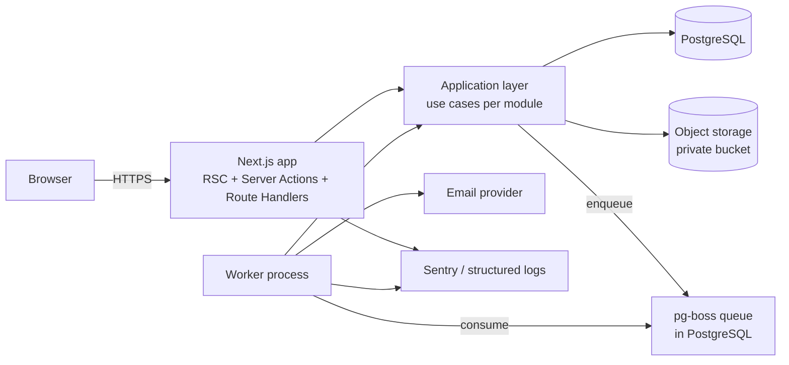
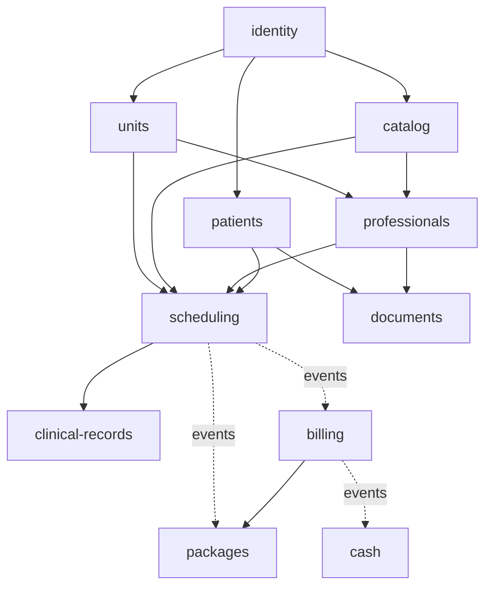

# GCli — Architecture and Engineering Guidelines

This document defines **how** GCli is built. The [PRD](prd.en.md) defines **what** is built and the targets it must meet. When they conflict, the PRD wins on behavior and this document wins on implementation. Every significant decision is recorded as an ADR in [Section 12](#12-architecture-decision-records).

## 1. Architectural drivers

The requirements below come from the PRD and shape every decision in this document.

| Driver | Source in PRD | Consequence for the architecture |
|---|---|---|
| Single company in V1, SaaS-ready | Executive Summary, F01 | Every business row carries `organizationId`; tenant scoping is automatic, not manual |
| Modular growth without rewrites | Briefing §4.3 | Modular monolith with enforced module boundaries |
| Clinical confidentiality and LGPD | F01, F07, F14, F15 | Centralized authorization, append-only audit log, private file storage |
| No double booking under concurrency | F06 | Database-level exclusion constraints, not only application checks |
| Financial correctness | F09, F10, F11 | Integer money, transactions, idempotency keys, no hard deletes |
| Scale: 5 units, 50 professionals, 30 concurrent users, 500 appointments/day, 100k patients | Section 1 | A single well-indexed Postgres is enough; no distributed systems needed |
| p95 targets: search ≤ 1 s, dashboard ≤ 3 s, audit ≤ 3 s | F05, F12, F15 | Trigram indexes, aggregate queries with short-lived cache, keyset pagination |
| Long-running work (LGPD export, expirations, recurring expenses) | F10, F11, F14 | Background job queue with a separate worker process |

**Non-goals:** microservices, event sourcing, Kubernetes, GraphQL, multi-region. None of them is justified at this scale, and each would add operational cost without meeting any requirement above.

## 2. Architecture overview

GCli is a **modular monolith**: one deployable Next.js application plus one worker process built from the same codebase and sharing one PostgreSQL database.



- **Web process**: renders pages (React Server Components), handles Server Actions and Route Handlers, and calls use cases. It holds no business rules.
- **Worker process**: runs background jobs (emails, LGPD exports, package expiration, recurring expenses, unclosed-cash flags) using the same use cases.
- **PostgreSQL**: the single source of truth, including the job queue (pg-boss), so no Redis is needed.
- **Object storage**: S3-compatible private bucket for attachments and generated documents, reached only through presigned URLs.

## 3. Module map

Each module owns its tables, its rules, and its public API. Modules are named after business capabilities, not technical layers.

| Module | PRD features | Tier | Owns |
|---|---|---|---|
| `identity` | F01 | Rich | Organization, users, roles, sessions, invitations |
| `audit` | F01 (recording), F15 (viewer) | Simple | Audit events |
| `units` | F02 | Simple | Units, rooms, business hours, closures |
| `catalog` | F03 | Simple | Services, categories, price history |
| `professionals` | F04 | Simple | Professionals, enabled services, working hours, time-offs |
| `patients` | F05 | Simple | Patients, guardians, consent records, tags |
| `scheduling` | F06 | Rich | Appointments, status history, recurrence series |
| `clinical-records` | F07 | Rich | Clinical notes, versions, addenda, clinical attachments |
| `documents` | F08 | Simple | Patient documents, templates, PDF generation |
| `billing` | F09 | Rich | Charges, payments, refunds, discount approvals, receipts |
| `packages` | F10 | Rich | Package templates, sold packages, session ledger |
| `cash` | F11 | Rich | Cash registers, manual entries, expenses, statements |
| `analytics` | F12, F13 | Read-only | Dashboard KPIs and reports (queries only) |
| `privacy` | F14 | Rich | Patient timeline, LGPD requests, exports, anonymization |

**Two module tiers, on purpose:**
- **Rich modules** have real invariants (conflicts, state machines, balances, locks). They get a pure `domain` layer, repositories as ports, and unit tests on the domain.
- **Simple modules** are mostly CRUD with validation. They call Prisma directly from the application layer. Adding domain entities and repositories there would be ceremony with no benefit.

A simple module is promoted to rich when it gains invariants that are hard to test through the database.

### Module dependencies



- A solid arrow means "calls the public API of". A dotted arrow means "reacts to domain events published by".
- `analytics`, `privacy`, and `audit` read across modules through dedicated read queries. They never write to other modules' tables.
- **No cycles.** The PRD requires billing to skip charges for package-covered appointments, but billing must not depend on packages. This is solved with dependency inversion: `billing` declares a `ChargeExemptionPolicy` port, and `packages` implements it. When the packages module is absent, the default policy exempts nothing (see ADR-007).

## 4. Code structure and layering

```
src/
  app/                        Next.js routes: pages, layouts, Server Actions, Route Handlers (thin)
  modules/
    scheduling/
      domain/                 Entities, value objects, domain services, domain events, domain errors
                              Pure TypeScript: no Prisma, no Next.js, no I/O
      application/            Use cases (commands and queries), ports (interfaces), Zod input schemas, DTOs
      infrastructure/         Prisma repositories, adapters implementing ports
      ui/                     React components specific to this module
      index.ts                Public API: the only file other modules may import
    patients/
      application/            Simple module: use cases call Prisma directly
      ui/
      index.ts
  shared/
    kernel/                   Result type, DomainError base, Money, DateTimeRange, typed IDs
    db/                       Prisma client, tenant-scoped client factory, transaction helper
    authz/                    Permission matrix and policy functions
    audit/                    Audit writer used inside transactions
    events/                   In-process event bus and outbox
    jobs/                     pg-boss setup and job registry
    storage/                  Object storage adapter, presigned URL helpers
    config/                   Environment variables validated with Zod at startup
    logging/                  Structured logger with request ID
    ui/                       Design system components (shadcn/ui based; rules in docs/design-system.en.md)
  worker/                     Worker entry point: registers job handlers
prisma/
  schema.prisma
  migrations/                 Includes raw SQL for constraints Prisma cannot express
tests/
  integration/                Real PostgreSQL (Testcontainers)
  e2e/                        Playwright
```

**Dependency rules (enforced by lint, see ADR-002):**
1. `domain` imports nothing outside `domain` and `shared/kernel`.
2. `application` imports `domain` and ports; it never imports `infrastructure`.
3. `infrastructure` implements ports declared in `application`.
4. `app/` (routes) calls use cases only. It never calls Prisma or contains business rules.
5. A module imports another module **only** through its `index.ts`.

**Request flow for a command**, using "check in an appointment" as the example:

```
Server Action (app/)
  → parse input with Zod schema
  → getSession() → build RequestContext { user, organizationId, requestId }
  → CheckInAppointment use case (scheduling/application)
      → authz.assert(ctx, 'appointment:check-in', appointment)
      → within transaction:
          → repository loads Appointment (domain entity)
          → appointment.checkIn(now)          ← state machine enforces valid transition
          → repository saves (optimistic version check)
          → audit.record(...)
          → events.publish(AppointmentCheckedIn)  ← billing handler creates the charge in the same transaction
  → Result<Ok, DomainError> mapped to UI message
```

## 5. Cross-cutting concerns

### 5.1 Tenant isolation
- Every business table has a non-null `organizationId` with an index that starts with it.
- The Prisma client used by application code is always created with `forTenant(organizationId)`. This is a Prisma Client extension that injects `organizationId` into every `where`, `create`, and `upsert`.
- The unscoped client is exported only to `shared/db`, migrations, and the worker bootstrap. A lint rule forbids importing it anywhere else.
- An integration test suite creates two organizations and asserts that every use case returns zero rows from the other organization.
- PostgreSQL Row-Level Security is postponed to the SaaS phase (ADR-003).

### 5.2 Authorization
- The PRD's permission matrix (F01) lives as code in `shared/authz/permissions.ts`, mapping `role → action[]`, for example `'clinical-note:read'` or `'charge:void'`.
- **Resource-level rules** are policy functions next to the module, for example `canReadClinicalNote(ctx, patientId)` checks that the professional has at least one appointment with the patient.
- Every use case starts with an authorization check. UI hiding is a convenience, never the protection.
- Every denial is written to the audit log as `permission-denied`.

### 5.3 Audit log
- The audit log is an append-only `audit_event` table, written by `audit.record()` **inside the same transaction** as the change, so there is never a change without its audit entry.
- Before/after values are computed by the use case for the fields it changed. Clinical text is stored as "changed" plus character counts, never as a diff.
- The application's database role has `INSERT` and `SELECT` on `audit_event`, but no `UPDATE` or `DELETE`.
- The table is partitioned by month; partitions older than 5 years are detached and archived.

### 5.4 Domain events
- Events are named in the past tense: `AppointmentCheckedIn`, `AppointmentCompleted`, `AppointmentCancelled`, `PaymentRegistered`, `PaymentRefunded`, `PackageSold`.
- **Synchronous in-process handlers** run inside the publisher's transaction when consistency is required. Examples: a charge is created on check-in; a package session is debited on completion. If a handler fails, the whole operation rolls back, which the PRD requires (F10: "the sale is rolled back entirely").
- **Asynchronous side effects** (emails, PDF pre-generation) go through a **transactional outbox**: the event row is written in the same transaction, and the worker delivers it. There are no lost or phantom emails.

### 5.5 Background jobs
pg-boss runs on the same PostgreSQL database (ADR-008).

| Job | Trigger | Feature |
|---|---|---|
| Send invitation / password reset email | Outbox | F01 |
| Convert HEIC to JPG, generate thumbnails | Upload completed | F07, F08 |
| Expire packages, unlink future appointments | Daily at 00:10 (organization time zone) | F10 |
| Generate recurring expense occurrences | Monthly on the 1st | F11 |
| Flag unclosed cash registers | Daily at 00:05 | F11 |
| Build LGPD export ZIP | On request | F14 |
| Delete expired export files (older than 7 days) | Daily | F14 |

Jobs are idempotent: each job can run twice without duplicating effects, using unique keys and state checks.

### 5.6 Files
- Files go to a private S3-compatible bucket: Cloudflare R2 in production, SeaweedFS locally (ADR-017).
- **Uploads**: the server validates type and size, then issues a presigned PUT URL. The browser uploads directly, and the server confirms by checking object metadata before creating the record.
- **Downloads**: presigned GET URLs valid for 5 minutes, issued only after authorization. Clinical files are audited on every access.
- Object keys never contain personal data: `org/{orgId}/{module}/{uuid}`.

### 5.7 Validation and errors
- Zod schemas in `application/` validate every external input. The same schema drives the form (react-hook-form) and the server.
- Use cases return `Result<T, DomainError>` for **expected** failures (conflict, insufficient balance, locked note). Exceptions are reserved for **unexpected** failures (database down, bug).
- Every `DomainError` has a stable `code` (for example `SCHEDULING_ROOM_CONFLICT`) and a pt-BR message. The PRD's error messages are the source of these messages.
- Unexpected errors show a generic message, are logged with the request ID, and are reported to Sentry.

### 5.8 Money, dates, and time zones
- Money is stored as **integer cents** (`Int`, or `BigInt` for aggregates) and handled through a `Money` value object. Floating-point numbers are never used for money.
- Timestamps are stored as `timestamptz` in UTC. Calendar logic (working hours, business hours, "today") uses the organization's time zone, America/Sao_Paulo by default.
- Durations and ranges are handled by a `DateTimeRange` value object that has overlap logic, unit tests, and 5-minute granularity rules.

## 6. Data design

- **Primary keys**: UUIDv7 (time-ordered, index-friendly, safe to expose in URLs).
- **Standard columns** on business tables: `id`, `organizationId`, `createdAt`, `createdById`, `updatedAt`, `updatedById`, and `version` for optimistic locking on concurrently edited records (patients, clinical notes, appointments).
- **No hard deletes** for referenced records. Records are deactivated (`active = false`) or archived with a reason, as the PRD requires.
- **Constraints enforce invariants the application also checks** (defense in depth). These are written in raw SQL in migrations:
  - **No double booking**: a PostgreSQL exclusion constraint with `btree_gist` on `(professionalId, tstzrange(startsAt, endsAt))` where status is active and `isOverbooking = false`, and another on `(roomId, tstzrange(...))` for rooms. This guarantees the PRD rule that two simultaneous saves produce exactly one appointment (F06).
  - **Idempotent payments**: a unique index on `(organizationId, idempotencyKey)`.
  - **One cash register per unit per day**: a unique index on `(unitId, date)`.
  - **Unique CPF per organization**: a partial unique index where CPF is not null.
- **Price snapshots**: appointments and charges copy the price at the moment of booking. Only new records read the price catalog.

## 7. Security

| Area | Decision |
|---|---|
| Passwords | Argon2id (`@node-rs/argon2`); minimum 10 characters; lockout after 5 failures for 15 minutes (F01) |
| Sessions | Database-backed sessions with opaque tokens in `HttpOnly; Secure; SameSite=Lax` cookies; 60 min idle, 12 h absolute; revocable immediately (ADR-004) |
| CSRF | Server Actions' built-in origin check; Route Handlers that mutate state require the same-origin check |
| Rate limiting | Login, password reset, and invitation endpoints limited per IP and per email (Postgres-backed counter) |
| Headers | Strict CSP with nonces, HSTS, `X-Content-Type-Options`, `Referrer-Policy`, `frame-ancestors 'none'` |
| Secrets | Only environment variables, validated with Zod at startup; the application refuses to boot on missing or invalid config; never committed |
| Personal data in logs | Forbidden. The logger redacts known fields (`cpf`, `email`, `phone`, `name`, `content`); logs carry IDs only |
| Data at rest | Managed Postgres and object storage with provider encryption; TLS everywhere |
| Dependencies | Dependabot plus `npm audit` in CI; lockfile committed |
| Clinical data | Accessible only through the authorization policies in 5.2; every read is audited |
| LGPD | Consent records, export, and anonymization as defined in F05 and F14; clinical records are retained for 20 years (Law 13.787/2018) |

## 8. Performance and scalability

The PRD's load (500 appointments/day, 30 concurrent users) is small for PostgreSQL. The risk is not volume but **unindexed queries** and **N+1 access patterns**.

| Target (PRD) | Approach |
|---|---|
| Patient search ≤ 1 s with 100k records (F05) | `pg_trgm` + `unaccent` GIN index on normalized name; B-tree indexes on CPF digits and phone suffix |
| Dashboard ≤ 3 s for 30 days (F12) | SQL aggregate queries (no ORM loops), cached for 5 minutes per filter combination; materialized views only if measurements show a need |
| Audit viewer ≤ 3 s with 1M rows (F15) | Monthly partitions, composite indexes on `(organizationId, occurredAt)` and `(entityType, entityId)`, keyset pagination |
| Agenda freshness ≤ 30 s (F06) | Client polling every 30 s via TanStack Query on a lightweight endpoint returning appointments changed since the last `updatedAt` |
| CSV export of 50k rows ≤ 10 s (F13) | Streamed responses using database cursors, never loading all rows into memory |

**Rules:**
- Every list is paginated: offset pagination for user-facing tables of up to 50 rows, keyset pagination for large or append-only data.
- Every new query on a large table ships with its index in the same migration.
- `EXPLAIN ANALYZE` is attached to the pull request for any query on `appointment`, `charge`, `payment`, `patient`, or `audit_event` that is not a primary-key lookup.

**Scaling path:** the web process is stateless and scales horizontally. Scaling beyond V1 happens in this order: add web instances → add read replicas for `analytics` → partition large tables. Each step is taken only when a measurement shows the need.

## 9. Observability and operations

- **Logs**: structured JSON (`pino`) with `requestId`, `organizationId`, `userId`, `module`, and `useCase`; no personal data.
- **Errors**: Sentry in the web and worker processes, with source maps; personal data is scrubbed before sending.
- **Health**: `/api/health` checks the database and storage; the worker reports a heartbeat through pg-boss.
- **Metrics that matter**: p95 latency per route, job failures, queue depth, and login failures (possible attack).
- **Backups**: managed PostgreSQL with daily snapshots and point-in-time recovery, retained 30 days. A restore test is run every quarter. Object storage has versioning enabled.
- **Migrations**: `prisma migrate deploy` runs in the release step, never at application startup. Destructive changes follow expand → migrate → contract across two releases.

## 10. Testing strategy

| Level | Tool | What it covers | Target |
|---|---|---|---|
| Unit | Vitest | Domain layer of rich modules: state machines, conflict rules, `Money`, `DateTimeRange`, balance calculations | ≥ 90% line coverage in `domain/` |
| Integration | Vitest + Testcontainers (real PostgreSQL) | Use cases end-to-end with the database: exclusion constraints, tenant isolation, authorization matrix, transactions and rollbacks, event handlers | Every acceptance criterion in PRD Section 9 that involves data rules |
| End-to-end | Playwright | Critical journeys: log in → book → check in → receive payment → close cash register; professional writes a clinical note; front desk cannot open a note | 1 test per critical journey, run on every PR |

**Rules:**
- The PRD's acceptance criteria are the test list. Every criterion maps to at least one test, and test names reference the feature ID (`F06: room conflict is always blocked`).
- Tests never mock the database for data rules. Mocks are allowed only for external services (email, storage).
- A bug fix starts with a failing test that reproduces it.

## 11. Engineering guidelines

### 11.1 SOLID, applied pragmatically
- **Single Responsibility**: one use case per business operation (`CheckInAppointment`, `RegisterPayment`), not generic "services" with 30 methods.
- **Open/Closed**: extension points exist only where the PRD shows variation, such as conflict rules (Strategy) and document template variables (registry of resolvers).
- **Liskov**: implementations of a port must honor its contract, including errors. For example, every `ChargeExemptionPolicy` returns a result and never throws for "not exempt".
- **Interface Segregation**: ports are small and consumer-specific (`AppointmentReader`, not `AppointmentRepository` with 20 methods that everyone depends on).
- **Dependency Inversion**: used at module boundaries and for external services (storage, email, clock). **It is not used for Prisma in simple modules** (see Section 3).

### 11.2 Design patterns in use
Use a pattern only when it solves a problem present in the PRD. This list covers the patterns that meet that bar.

| Pattern | Where | Why |
|---|---|---|
| State machine | Appointment status (F06), charge status (F09), clinical note lifecycle (F07) | Makes invalid transitions impossible and testable |
| Strategy | Scheduling conflict rules (F06) | Each rule (professional, room, working hours, closure) is isolated, testable, and reports whether it can be overridden |
| Domain events + Observer | Check-in → charge, completion → package debit, payment → cash register | Decouples modules without cycles |
| Transactional outbox | Emails and async side effects | No lost messages and no messages for rolled-back changes |
| Repository (port) | Rich modules only | Keeps the domain testable without the database |
| Value object | `Money`, `DateTimeRange`, `Cpf`, `PhoneNumber` | Validation and behavior in one place, immutable |
| Specification | Patient duplicate detection (F05), availability search (F06) | Composable rules reused by validation and search |
| Template method / builder | PDF generation for documents, receipts, and reports (F08, F09, F13) | Shared header, footer, and pagination with variable body |
| Result type | All use cases | Expected failures are explicit in signatures |

Patterns that are **deliberately not used**: generic repository over Prisma, abstract factory for entities, service locator or DI container (plain constructor and function injection is enough), CQRS with separate databases, and event sourcing.

### 11.3 Clean code conventions
- **Language**: code, identifiers, commits, and technical docs are in English. User-facing text is in pt-BR, centralized per module in `messages.ts`.
- **TypeScript**: `strict: true`, `noUncheckedIndexedAccess: true`; no `any` (use `unknown` and narrow); no non-null assertions (`!`) outside tests.
- **Naming**: use cases are verbs (`RescheduleAppointment`), events are past tense (`AppointmentRescheduled`), booleans read as questions (`isOverbooking`, `hasBalance`), and domain vocabulary follows the PRD (patient, appointment, charge, package, cash register).
- **Functions**: small and at a single level of abstraction; at most 3 positional parameters, and an options object beyond that.
- **Comments**: explain *why* (a business rule, a law, a PRD reference such as `// PRD F07: locked 24h after creation`), never *what*.
- **No magic numbers**: business limits (20% discount approval, 24 h lock, 52 occurrences) live in named constants per module, referencing the PRD.
- **Files**: at most around 300 lines; split by responsibility, not by type.
- **Formatting and lint**: Prettier + ESLint (typescript-eslint strict, `no-restricted-imports` rules for module boundaries, ADR-018), enforced in CI and pre-commit (lint-staged).

### 11.4 Workflow
- **Branches**: `main` is always deployable; use short-lived branches `feat/F06-recurrence`, `fix/...`, `docs/...`.
- **Commits**: Conventional Commits (`feat(scheduling): block room conflicts [F06]`).
- **Pull requests**: CI must pass lint, typecheck, unit, integration, and E2E tests, plus `prisma migrate diff` to detect schema drift. The PR description links the feature ID and lists the acceptance criteria covered.
- **Definition of done** for a feature: its acceptance criteria are covered by tests, audit events are emitted for its mutations, authorization is checked for each action, pt-BR messages come from the PRD, its screens pass the design system checklist (`docs/design-system.en.md`, section 11), and the architecture document is updated if a decision changed.

## 12. Architecture Decision Records

Each ADR is final until superseded by a new ADR. To change a decision, add a new ADR that references the old one; do not edit the old ADR.

**ADR-001 — Modular monolith on Next.js (App Router) with TypeScript**
- *Decision:* A single Next.js application for UI and backend (Server Actions and Route Handlers), organized into business modules, plus a worker process from the same codebase.
- *Why:* This meets the modularity requirement and the V1 scale with one deployable unit and one language end to end.
- *Trade-off:* Module boundaries depend on discipline and lint rules rather than network boundaries. A module can be extracted into a service later if a real need appears.

**ADR-002 — Enforced module boundaries**
- *Decision:* `eslint-plugin-boundaries` enforces the layering rules and the "import only through `index.ts`" rule. CI fails on violations.
- *Why:* A monolith stays modular only if boundaries are checked automatically.

**ADR-003 — Tenant isolation through a scoped Prisma client; RLS deferred**
- *Decision:* All application queries go through `forTenant(organizationId)`, and cross-organization tests run in CI. PostgreSQL Row-Level Security is postponed to the SaaS phase.
- *Why:* V1 has one organization, so the risk is low. RLS with connection pooling requires per-transaction session variables, which adds complexity now. The scoped client keeps the migration to RLS straightforward.

**ADR-004 — Authentication: Better Auth with database sessions and Argon2id**
- *Decision:* Better Auth with the Prisma adapter, email and password, database sessions, and password hashing overridden to Argon2id. Invitation and lockout flows are built on top of it.
- *Why:* It meets the F01 requirements (immediate revocation, idle and absolute expiry, lockout) without writing session cryptography by hand.
- *Alternative:* A small custom session module (sessions table and opaque token) if the library blocks a PRD requirement.

**ADR-005 — Centralized authorization as code**
- *Decision:* A permission matrix plus resource policies in `shared/authz`, checked at the start of every use case.
- *Why:* This covers the PRD's four fixed roles and the clinical confidentiality rules with a single place to audit.

**ADR-006 — PostgreSQL + Prisma, with raw SQL for advanced constraints**
- *Decision:* Prisma for schema, migrations, and queries. Exclusion constraints, partial indexes, trigram indexes, and partitioning are added in raw SQL migrations.
- *Why:* Prisma provides type safety and productivity. PostgreSQL features guarantee invariants that application code alone cannot, especially under concurrency.

**ADR-007 — In-process domain events with a transactional outbox**
- *Decision:* Synchronous handlers inside the transaction for consistency-critical reactions; an outbox processed by the worker for asynchronous side effects. Cross-module reactions that would create cycles use dependency inversion (for example, `ChargeExemptionPolicy`).
- *Why:* This keeps modules decoupled while preserving the atomicity the PRD requires, without a message broker.

**ADR-008 — pg-boss for background jobs**
- *Decision:* The job queue runs in PostgreSQL with pg-boss, and a separate worker process consumes it.
- *Why:* No extra infrastructure (Redis) is needed; jobs can be enqueued in the same transaction as the business change.

**ADR-009 — S3-compatible private object storage with presigned URLs**
- *Decision:* Cloudflare R2 in production and MinIO locally. Direct browser upload through presigned PUT; downloads through 5-minute presigned GET after authorization.
- *Why:* File traffic stays out of the app server, access is controlled, and the storage provider can be swapped.

**ADR-010 — Money as integer cents; UTC timestamps; organization time zone for calendar logic**
- *Decision:* See Section 5.8.
- *Why:* This avoids rounding errors in financial totals and daylight-saving and time zone bugs in the agenda.

**ADR-011 — UI stack: React Server Components, Tailwind CSS, shadcn/ui, react-hook-form + Zod, TanStack Query for polling**
- *Decision:* Server Components by default; Client Components only for interactive surfaces (agenda, editors, forms).
- *Why:* This gives fast first loads on low-end devices and one validation schema shared by client and server.

**ADR-012 — Hosting: containers for web and worker, managed PostgreSQL**
- *Decision:* One Docker image deployed as two services (web and worker) on a container platform (Railway, Render, or Fly.io), with managed PostgreSQL that has point-in-time recovery, and Cloudflare R2 for storage.
- *Why:* The worker needs a long-running process, which rules out a serverless-only deployment. Managed services keep operations minimal.
- *Status:* The final provider is chosen before the first deploy and recorded as a new ADR.

**ADR-013 — Testing with a real database**
- *Decision:* Integration tests run against PostgreSQL in Testcontainers; the database is never mocked for data rules.
- *Why:* The most important invariants (no double booking, tenant isolation, financial consistency) live partly in the database and can only be tested there.

**ADR-014 — Better Auth used only through its server API (refines ADR-004)**
- *Decision:* The Better Auth HTTP handler (`/api/auth/[...all]`) is not mounted. Sign-in, invitation acceptance, and password reset run through our use cases, which call `auth.api.*`. Idle expiry uses Better Auth's sliding session (60 min); the 12-hour absolute limit is an additional session field checked by the request context; the session cookie cache is disabled. Lockout, invitations, and auditing live in the `identity` module.
- *Why:* No public endpoint can bypass lockout, invite-only sign-up, or auditing, and revocation is immediate.
- *Trade-off:* The Better Auth client SDK is not used; the UI relies on Server Actions.

**ADR-015 — English URL paths**
- *Decision:* Routes use English paths (`/login`, `/schedule`, `/settings/users`); only user-facing text is pt-BR.
- *Why:* One naming system for routes, folders under `src/app/`, and code.

**ADR-016 — Session expiry: fixed 12-hour session plus lastActiveAt (refines ADR-014)**
- *Decision:* Better Auth sessions last a fixed 12 hours with sliding refresh disabled. The request context enforces the 60-minute idle timeout through a `lastActiveAt` session column, written at most once per minute.
- *Why:* Better Auth refreshes the session cookie only inside Server Actions, not during page navigation, so a 60-minute sliding session would sign out users who are active but only navigating.

**ADR-017 — SeaweedFS for local S3 storage (refines ADR-009)**
- *Decision:* Local development and integration tests use the SeaweedFS S3 API instead of MinIO. Production still targets Cloudflare R2.
- *Why:* MinIO no longer publishes container images (Docker Hub and quay.io refuse the pull). The application only speaks the S3 protocol, so the local tool is interchangeable.

**ADR-018 — Module boundaries with ESLint no-restricted-imports (refines ADR-002)**
- *Decision:* Boundaries are enforced with the core ESLint rule `no-restricted-imports`, configured per layer in `eslint.config.mjs`, instead of `eslint-plugin-boundaries`.
- *Why:* The plugin's version 7 policy API changed substantially. The core rule expresses the same restrictions (public entry points only, pure domain, no database access from routes, unscoped client limited to infrastructure) with a stable, well-documented configuration.

**ADR-019 — Time zone per unit (refines ADR-010)**
- *Decision:* Each unit has its own IANA time zone, defaulting to the organization's time zone when the unit is created. Calendar logic (business hours, closures, working hours, the agenda, "today" for the daily cash register) uses the unit's time zone; the organization's time zone is only the default.
- *Why:* A clinic with units in different states (for example São Paulo and Manaus) has different local clocks; one organization-wide zone would shift opening hours and daily closings in one of them.

**ADR-020 — Design system "Ink and Paper" (complements ADR-011)**
- *Decision:* The interface follows the design system in [design-system.en.md](design-system.en.md): warm paper surfaces, ink-blue primary color, terracotta reserved for "now" and "late", written status stamps, tables with fine rules instead of card grids, Source Serif 4 for headings and Source Sans 3 for the interface (self-hosted), radii of at most 8 px, a single floating shadow, and WCAG 2.2 AA. Its tokens keep the shadcn/ui variable names, so components pick them up from `src/app/globals.css` without changes. Screens use semantic tokens, never hard-coded colors (the F03 service palette is the only exception).
- *Why:* The users work under time pressure on dense screens (agenda, cash register, records). A documented, measurable visual language keeps new screens consistent, readable and accessible, and defining it before the agenda (F06) avoids reworking the heaviest screens later.

**ADR-021 — Comparing working hours across unit time zones (refines ADR-019)**
- *Decision:* Working-hour intervals are stored in the unit's local time (minutes from midnight), as business hours are. To check that a professional's intervals in different units do not overlap on the same weekday (F04), each interval is converted to minutes of the week in UTC with the unit's UTC offset on the schedule's start date, then compared. Brazil has had no daylight saving time since 2019, so these offsets are constant; the conversion lives in one helper (`professionals/domain/time-zone-offsets.ts`).
- *Why:* A professional who works in São Paulo in the morning and in Manaus in the afternoon must be checked against real time, not against two local clocks. A database exclusion constraint on local minutes would reject valid schedules, so the rule is a pure domain function, and concurrent edits are serialized by the professional's row version.
- *Trade-off:* If daylight saving time returns, offsets will depend on the date and the helper must compare per date instead of per schedule.

## 13. Evolution to SaaS

The V1 design keeps these steps additive, with no rewrites:
1. Enable PostgreSQL Row-Level Security using `organizationId` (ADR-003 superseded).
2. Add self-service organization signup, subscription billing, and plan limits (a new `tenancy` module).
3. Restrict users to specific units (the PRD lists this as out of scope for V1; the authorization policies already receive the resource's unit).
4. Add read replicas for `analytics` if dashboard load grows.
