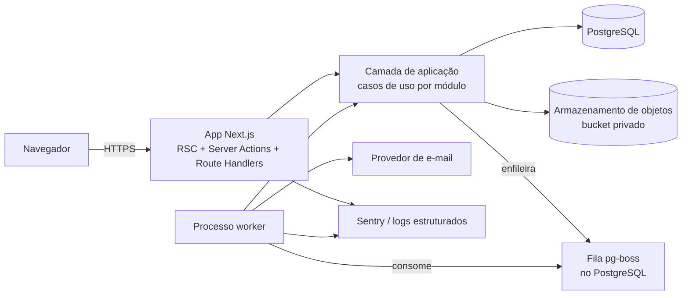
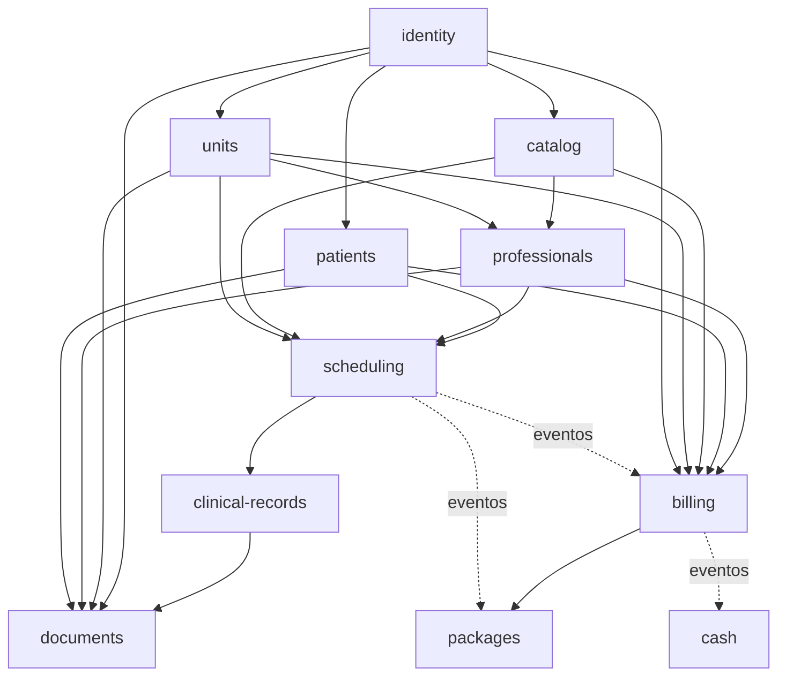

# GCli — Arquitetura e Diretrizes de Engenharia

Este documento define **como** o GCli é construído. O [PRD](prd.pt-BR.md) define **o que** é construído e as metas que precisa atingir. Em caso de conflito, o PRD prevalece sobre comportamento e este documento prevalece sobre implementação. Toda decisão relevante é registrada como ADR na [Seção 12](#12-registros-de-decisão-de-arquitetura-adrs).

## 1. Direcionadores arquiteturais

Os requisitos abaixo vêm do PRD e orientam todas as decisões deste documento.

| Direcionador | Origem no PRD | Consequência para a arquitetura |
|---|---|---|
| Uma única empresa na V1, pronto para SaaS | Resumo Executivo, F01 | Toda linha de negócio carrega `organizationId`; o isolamento por organização é automático, não manual |
| Crescimento modular sem reescrita | Briefing §4.3 | Monólito modular com fronteiras entre módulos verificadas automaticamente |
| Confidencialidade clínica e LGPD | F01, F07, F14, F15 | Autorização centralizada, log de auditoria somente-inserção, armazenamento privado de arquivos |
| Nenhum agendamento duplo sob concorrência | F06 | Restrições de exclusão no banco, não apenas verificações na aplicação |
| Correção financeira | F09, F10, F11 | Dinheiro em inteiros, transações, chaves de idempotência, nenhuma exclusão definitiva |
| Escala: 5 unidades, 50 profissionais, 30 usuários simultâneos, 500 atendimentos/dia, 100 mil pacientes | Seção 1 | Um único Postgres bem indexado é suficiente; não há necessidade de sistemas distribuídos |
| Metas p95: busca ≤ 1 s, painel ≤ 3 s, auditoria ≤ 3 s | F05, F12, F15 | Índices trigram, consultas agregadas com cache de curta duração, paginação por keyset |
| Trabalho demorado (exportação LGPD, expirações, despesas recorrentes) | F10, F11, F14 | Fila de tarefas em segundo plano com um processo worker separado |

**Fora dos objetivos:** microsserviços, event sourcing, Kubernetes, GraphQL, multirregião. Nenhum deles se justifica nesta escala, e cada um adicionaria custo operacional sem atender a nenhum requisito acima.

## 2. Visão geral da arquitetura

O GCli é um **monólito modular**: uma aplicação Next.js implantável e um processo worker, construídos a partir do mesmo código e compartilhando um único banco PostgreSQL.



- **Processo web**: renderiza páginas (React Server Components), trata Server Actions e Route Handlers, e chama casos de uso. Não contém regras de negócio.
- **Processo worker**: executa tarefas em segundo plano (e-mails, exportações LGPD, expiração de pacotes, despesas recorrentes, sinalização de caixas não fechados) usando os mesmos casos de uso.
- **PostgreSQL**: a única fonte de verdade, incluindo a fila de tarefas (pg-boss), então não é preciso Redis.
- **Armazenamento de objetos**: bucket privado compatível com S3 para anexos e documentos gerados, acessado apenas por URLs pré-assinadas.

## 3. Mapa de módulos

Cada módulo é dono de suas tabelas, suas regras e sua API pública. Os módulos são nomeados por capacidade de negócio, não por camada técnica.

| Módulo | Funcionalidades do PRD | Tipo | Responsável por |
|---|---|---|---|
| `identity` | F01 | Rico | Organização, usuários, perfis, sessões, convites |
| `audit` | F01 (registro), F15 (visualizador) | Simples | Eventos de auditoria |
| `units` | F02 | Simples | Unidades, salas, horário de funcionamento, fechamentos |
| `catalog` | F03 | Simples | Serviços, categorias, histórico de preços |
| `professionals` | F04 | Simples | Profissionais, serviços habilitados, horários de trabalho, folgas |
| `patients` | F05 | Simples | Pacientes, responsáveis, registros de consentimento, etiquetas |
| `scheduling` | F06 | Rico | Agendamentos, histórico de status, séries recorrentes |
| `clinical-records` | F07 | Rico | Notas clínicas, versões, adendos, anexos clínicos |
| `documents` | F08 | Simples | Documentos do paciente, modelos, geração de PDF |
| `billing` | F09 | Rico | Cobranças, pagamentos, estornos, aprovações de desconto, recibos |
| `packages` | F10 | Rico | Modelos de pacote, pacotes vendidos, extrato de sessões |
| `cash` | F11 | Rico | Caixas, lançamentos manuais, despesas, extratos |
| `analytics` | F12, F13 | Somente leitura | Indicadores do painel e relatórios (apenas consultas) |
| `privacy` | F14 | Rico | Linha do tempo do paciente, solicitações LGPD, exportações, anonimização |

**Dois tipos de módulo, de propósito:**
- **Módulos ricos** têm invariantes reais (conflitos, máquinas de estado, saldos, travas). Eles têm uma camada `domain` pura, repositórios como portas e testes unitários no domínio.
- **Módulos simples** são basicamente CRUD com validação. Eles chamam o Prisma diretamente da camada de aplicação. Adicionar entidades de domínio e repositórios ali seria cerimônia sem benefício.

Um módulo simples passa a ser rico quando ganha invariantes difíceis de testar pelo banco de dados.

### Dependências entre módulos



- Uma seta sólida significa "chama a API pública de". Uma seta pontilhada significa "reage a eventos de domínio publicados por".
- `analytics`, `privacy` e `audit` leem dados de vários módulos por consultas de leitura dedicadas. Eles nunca escrevem nas tabelas de outros módulos.
- **Sem ciclos.** O PRD exige que a cobrança não seja gerada para agendamentos cobertos por pacote, mas `billing` não pode depender de `packages`. A solução é inversão de dependência: `billing` declara uma porta `ChargeExemptionPolicy`, e `packages` a implementa. Quando o módulo de pacotes não existe, a política padrão não isenta nada (ver ADR-007).

## 4. Estrutura de código e camadas

```
src/
  app/                        Rotas Next.js: páginas, layouts, Server Actions, Route Handlers (finos)
  modules/
    scheduling/
      domain/                 Entidades, objetos de valor, serviços de domínio, eventos de domínio, erros de domínio
                              TypeScript puro: sem Prisma, sem Next.js, sem I/O
      application/            Casos de uso (comandos e consultas), portas (interfaces), schemas Zod de entrada, DTOs
      infrastructure/         Repositórios Prisma, adaptadores que implementam as portas
      ui/                     Componentes React específicos deste módulo
      index.ts                API pública: o único arquivo que outros módulos podem importar
    patients/
      application/            Módulo simples: casos de uso chamam o Prisma diretamente
      ui/
      index.ts
  shared/
    kernel/                   Tipo Result, base DomainError, Money, DateTimeRange, IDs tipados
    db/                       Cliente Prisma, fábrica de cliente com escopo de organização, helper de transação
    authz/                    Matriz de permissões e funções de política
    audit/                    Gravador de auditoria usado dentro das transações
    events/                   Barramento de eventos em processo e outbox
    jobs/                     Configuração do pg-boss e registro de tarefas
    storage/                  Adaptador de armazenamento de objetos, helpers de URL pré-assinada
    config/                   Variáveis de ambiente validadas com Zod na inicialização
    logging/                  Logger estruturado com ID de requisição
    ui/                       Componentes do design system (baseados em shadcn/ui; regras em docs/design-system.pt-BR.md)
  worker/                     Ponto de entrada do worker: registra os handlers de tarefas
prisma/
  schema.prisma
  migrations/                 Inclui SQL puro para restrições que o Prisma não expressa
tests/
  integration/                PostgreSQL real (Testcontainers)
  e2e/                        Playwright
```

**Regras de dependência (verificadas por lint, ver ADR-002):**
1. `domain` não importa nada fora de `domain` e `shared/kernel`.
2. `application` importa `domain` e portas; nunca importa `infrastructure`.
3. `infrastructure` implementa as portas declaradas em `application`.
4. `app/` (rotas) chama apenas casos de uso. Nunca chama o Prisma nem contém regras de negócio.
5. Um módulo importa outro **somente** pelo seu `index.ts`.

**Fluxo de uma requisição de comando**, usando "registrar a chegada de um paciente" como exemplo:

```
Server Action (app/)
  → valida a entrada com o schema Zod
  → getSession() → monta RequestContext { user, organizationId, requestId }
  → caso de uso CheckInAppointment (scheduling/application)
      → authz.assert(ctx, 'appointment:check-in', appointment)
      → dentro de uma transação:
          → o repositório carrega Appointment (entidade de domínio)
          → appointment.checkIn(now)          ← a máquina de estados garante uma transição válida
          → o repositório salva (verificação de versão otimista)
          → audit.record(...)
          → events.publish(AppointmentCheckedIn)  ← o handler de billing cria a cobrança na mesma transação
  → Result<Ok, DomainError> convertido em mensagem para a interface
```

## 5. Aspectos transversais

### 5.1 Isolamento por organização
- Toda tabela de negócio tem um `organizationId` não nulo, com um índice que começa por ele.
- O cliente Prisma usado pelo código de aplicação é sempre criado com `forTenant(organizationId)`. É uma extensão do Prisma Client que injeta `organizationId` em todo `where`, `create` e `upsert`.
- O cliente sem escopo é exportado apenas para `shared/db`, migrações e a inicialização do worker. Uma regra de lint proíbe importá-lo em qualquer outro lugar.
- Uma suíte de testes de integração cria duas organizações e verifica que todo caso de uso retorna zero registros da outra organização.
- O Row-Level Security do PostgreSQL fica para a fase SaaS (ADR-003).

### 5.2 Autorização
- A matriz de permissões do PRD (F01) existe como código em `shared/authz/permissions.ts`, mapeando `perfil → ação[]`, por exemplo `'clinical-note:read'` ou `'charge:void'`.
- **Regras por recurso** são funções de política junto ao módulo. Por exemplo, `canReadClinicalNote(ctx, patientId)` verifica se o profissional tem pelo menos um agendamento com o paciente.
- Todo caso de uso começa com uma verificação de autorização. Ocultar na interface é conveniência, nunca proteção.
- Toda negação é gravada no log de auditoria como `permission-denied`.

### 5.3 Log de auditoria
- O log de auditoria é uma tabela `audit_event` somente-inserção, gravada por `audit.record()` **dentro da mesma transação** da alteração. Assim, nunca existe uma alteração sem seu registro de auditoria.
- Os valores antes/depois são calculados pelo caso de uso para os campos que ele alterou. Texto clínico é registrado como "alterado" com contagem de caracteres, nunca como diff.
- O usuário de banco da aplicação tem `INSERT` e `SELECT` em `audit_event`, mas não `UPDATE` nem `DELETE`.
- A tabela é particionada por mês; partições com mais de 5 anos são desanexadas e arquivadas.

### 5.4 Eventos de domínio
- Os eventos têm nomes no passado: `AppointmentCheckedIn`, `AppointmentCompleted`, `AppointmentCancelled`, `PaymentRegistered`, `PaymentRefunded`, `PackageSold`.
- **Handlers síncronos em processo** rodam dentro da transação de quem publica quando a consistência é obrigatória. Exemplos: a cobrança é criada no check-in; a sessão do pacote é debitada na conclusão. Se um handler falhar, a operação inteira é desfeita, como o PRD exige (F10: "a venda é totalmente revertida").
- **Efeitos colaterais assíncronos** (e-mails, pré-geração de PDF) passam por um **outbox transacional**: a linha do evento é gravada na mesma transação, e o worker a entrega. Não há e-mails perdidos nem enviados para alterações que foram desfeitas.

### 5.5 Tarefas em segundo plano
O pg-boss roda no mesmo banco PostgreSQL (ADR-008).

| Tarefa | Gatilho | Funcionalidade |
|---|---|---|
| Enviar e-mail de convite / redefinição de senha | Outbox | F01 |
| Converter HEIC em JPG, gerar miniaturas | Upload concluído | F07, F08 |
| Expirar pacotes, desvincular agendamentos futuros | Diariamente às 00:10 (fuso da organização) | F10 |
| Gerar ocorrências de despesas recorrentes | Mensalmente, no dia 1º | F11 |
| Sinalizar caixas não fechados | Diariamente às 00:05 | F11 |
| Gerar o ZIP de exportação LGPD | Sob solicitação | F14 |
| Apagar arquivos de exportação expirados (mais de 7 dias) | Diariamente | F14 |

As tarefas são idempotentes: cada uma pode rodar duas vezes sem duplicar efeitos, usando chaves únicas e verificação de estado.

### 5.6 Arquivos
- Os arquivos vão para um bucket privado compatível com S3: Cloudflare R2 em produção, SeaweedFS localmente (ADR-017).
- **Uploads**: o servidor valida tipo e tamanho e emite uma URL PUT pré-assinada. O navegador envia o arquivo diretamente, e o servidor confirma verificando os metadados do objeto antes de criar o registro.
- **Downloads**: URLs GET pré-assinadas válidas por 5 minutos, emitidas somente após a autorização. Arquivos clínicos são auditados a cada acesso.
- As chaves dos objetos nunca contêm dados pessoais: `org/{orgId}/{module}/{uuid}`.

### 5.7 Validação e erros
- Schemas Zod em `application/` validam toda entrada externa. O mesmo schema alimenta o formulário (react-hook-form) e o servidor.
- Os casos de uso retornam `Result<T, DomainError>` para falhas **esperadas** (conflito, saldo insuficiente, nota travada). Exceções ficam reservadas para falhas **inesperadas** (banco fora do ar, bug).
- Todo `DomainError` tem um `code` estável (por exemplo `SCHEDULING_ROOM_CONFLICT`) e chaves de mensagem com parâmetros, nunca texto. A fronteira as traduz para o idioma de quem pediu, a partir dos catálogos dos módulos (ADR-028); o catálogo pt-BR segue as mensagens de erro do PRD.
- Erros inesperados mostram uma mensagem genérica, são registrados com o ID da requisição e reportados ao Sentry.

### 5.8 Dinheiro, datas e fusos horários
- Dinheiro é armazenado em **unidades menores inteiras mais o código da moeda** (`amount_minor` como `BigInt`, `currency` como `char(3)`) e manipulado pelo objeto de valor `Money`, que recusa aritmética entre moedas (ADR-029). Números de ponto flutuante nunca são usados para dinheiro.
- Datas/horas são armazenadas como `timestamptz` em UTC. A lógica de calendário (horário de trabalho, horário de funcionamento, "hoje") usa o fuso horário da unidade; o fuso da organização é só o padrão para unidades novas (ADR-019). As conversões de hora local para UTC são corretas nas mudanças de horário de verão (ADR-030).
- Durações e intervalos são tratados pelo objeto de valor `DateTimeRange`, que tem lógica de sobreposição, testes unitários e as regras de granularidade de 5 minutos.

## 6. Modelagem de dados

- **Chaves primárias**: UUIDv7 (ordenado no tempo, bom para índices, seguro para expor em URLs).
- **Colunas padrão** nas tabelas de negócio: `id`, `organizationId`, `createdAt`, `createdById`, `updatedAt`, `updatedById`, e `version` para trava otimista em registros editados de forma concorrente (pacientes, notas clínicas, agendamentos).
- **Nenhuma exclusão definitiva** de registros referenciados. Os registros são desativados (`active = false`) ou arquivados com motivo, como o PRD exige.
- **Restrições garantem no banco as invariantes que a aplicação também verifica** (defesa em profundidade). Elas são escritas em SQL puro nas migrações:
  - **Nenhum agendamento duplo**: uma restrição de exclusão do PostgreSQL com `btree_gist` em `(professionalId, tstzrange(startsAt, endsAt))` quando o status está ativo e `isOverbooking = false`, e outra em `(roomId, tstzrange(...))` para salas. Isso garante a regra do PRD de que dois salvamentos simultâneos geram exatamente um agendamento (F06).
  - **Pagamentos idempotentes**: índice único em `(organizationId, idempotencyKey)`.
  - **Um caixa por unidade por dia**: índice único em `(unitId, date)`.
  - **CPF único por organização**: índice único parcial quando o CPF não é nulo.
- **Preço congelado**: agendamentos e cobranças copiam o preço no momento do agendamento. Só registros novos leem o catálogo de preços.

## 7. Segurança

| Área | Decisão |
|---|---|
| Senhas | Argon2id (`@node-rs/argon2`); mínimo de 10 caracteres; bloqueio de 15 minutos após 5 falhas (F01) |
| Sessões | Sessões guardadas no banco, com tokens opacos em cookies `HttpOnly; Secure; SameSite=Lax`; 60 min de inatividade, 12 h absolutas; revogáveis imediatamente (ADR-004) |
| CSRF | Verificação de origem nativa das Server Actions; Route Handlers que alteram estado exigem a verificação de mesma origem |
| Limite de requisições | Endpoints de login, redefinição de senha e convite limitados por IP e por e-mail (contador no Postgres) |
| Cabeçalhos | CSP estrita com nonces, HSTS, `X-Content-Type-Options`, `Referrer-Policy`, `frame-ancestors 'none'` |
| Segredos | Apenas variáveis de ambiente, validadas com Zod na inicialização; a aplicação não sobe com configuração ausente ou inválida; nunca commitados |
| Dados pessoais em logs | Proibido. O logger oculta campos conhecidos (`cpf`, `email`, `phone`, `name`, `content`); os logs carregam apenas IDs |
| Dados em repouso | Postgres gerenciado e armazenamento de objetos com criptografia do provedor; TLS em todas as conexões |
| Dependências | Dependabot e `npm audit` no CI; lockfile commitado |
| Dados clínicos | Acessíveis apenas pelas políticas de autorização da seção 5.2; toda leitura é auditada |
| LGPD | Registros de consentimento, exportação e anonimização conforme F05 e F14; registros clínicos retidos por 20 anos (Lei 13.787/2018) |

## 8. Performance e escalabilidade

A carga do PRD (500 atendimentos/dia, 30 usuários simultâneos) é pequena para o PostgreSQL. O risco não é o volume, mas **consultas sem índice** e **padrões de acesso N+1**.

| Meta (PRD) | Abordagem |
|---|---|
| Busca de paciente ≤ 1 s com 100 mil registros (F05) | Índice GIN com `pg_trgm` + `unaccent` no nome normalizado; índices B-tree nos dígitos do CPF e no final do telefone |
| Painel ≤ 3 s para 30 dias (F12) | Consultas agregadas em SQL (sem loops no ORM), com cache de 5 minutos por combinação de filtros; views materializadas apenas se as medições mostrarem necessidade |
| Visualizador de auditoria ≤ 3 s com 1 milhão de linhas (F15) | Partições mensais, índices compostos em `(organizationId, occurredAt)` e `(entityType, entityId)`, paginação por keyset |
| Agenda atualizada em ≤ 30 s (F06) | Polling do cliente a cada 30 s via TanStack Query, num endpoint leve que retorna os agendamentos alterados desde o último `updatedAt` |
| Exportação CSV de 50 mil linhas ≤ 10 s (F13) | Respostas em streaming com cursores do banco, sem carregar todas as linhas na memória |

**Regras:**
- Toda lista é paginada: paginação por offset nas tabelas da interface com até 50 linhas, paginação por keyset para dados grandes ou somente-inserção.
- Toda consulta nova em tabela grande vem com seu índice na mesma migração.
- O resultado de `EXPLAIN ANALYZE` acompanha o pull request de qualquer consulta em `appointment`, `charge`, `payment`, `patient` ou `audit_event` que não seja busca por chave primária.

**Caminho de escala:** o processo web não guarda estado e escala horizontalmente. Além da V1, a escala segue esta ordem: mais instâncias web → réplicas de leitura para `analytics` → particionamento de tabelas grandes. Cada passo só é dado quando uma medição mostra a necessidade.

## 9. Observabilidade e operação

- **Logs**: JSON estruturado (`pino`) com `requestId`, `organizationId`, `userId`, `module` e `useCase`; sem dados pessoais.
- **Erros**: Sentry nos processos web e worker, com source maps; dados pessoais são removidos antes do envio.
- **Saúde**: `/api/health` verifica o banco e o armazenamento; o worker reporta um heartbeat pelo pg-boss.
- **Métricas que importam**: latência p95 por rota, falhas de tarefas, tamanho da fila e falhas de login (possível ataque).
- **Backups**: PostgreSQL gerenciado com snapshots diários e recuperação para um ponto no tempo, retidos por 30 dias. Um teste de restauração é feito a cada trimestre. O armazenamento de objetos tem versionamento ativado.
- **Migrações**: `prisma migrate deploy` roda na etapa de release, nunca na inicialização da aplicação. Mudanças destrutivas seguem expandir → migrar → contrair, em duas releases.

## 10. Estratégia de testes

| Nível | Ferramenta | O que cobre | Meta |
|---|---|---|---|
| Unitário | Vitest | Camada de domínio dos módulos ricos: máquinas de estado, regras de conflito, `Money`, `DateTimeRange`, cálculos de saldo | ≥ 90% de cobertura de linhas em `domain/` |
| Integração | Vitest + Testcontainers (PostgreSQL real) | Casos de uso de ponta a ponta com o banco: restrições de exclusão, isolamento por organização, matriz de autorização, transações e rollbacks, handlers de eventos | Todo critério de aceitação da Seção 9 do PRD que envolva regras de dados |
| Ponta a ponta | Playwright | Jornadas críticas: login → agendar → registrar chegada → receber pagamento → fechar caixa; profissional escreve nota clínica; recepção não consegue abrir uma nota | 1 teste por jornada crítica, rodando em todo PR |

**Regras:**
- Os critérios de aceitação do PRD são a lista de testes. Cada critério corresponde a pelo menos um teste, e o nome do teste referencia o ID da funcionalidade (`F06: room conflict is always blocked`).
- Os testes nunca simulam o banco de dados para regras de dados. Mocks são permitidos apenas para serviços externos (e-mail, armazenamento).
- A correção de um bug começa com um teste que falha e reproduz o problema.

## 11. Diretrizes de engenharia

### 11.1 SOLID, aplicado com pragmatismo
- **Responsabilidade Única**: um caso de uso por operação de negócio (`CheckInAppointment`, `RegisterPayment`), e não "services" genéricos com 30 métodos.
- **Aberto/Fechado**: pontos de extensão existem apenas onde o PRD mostra variação, como as regras de conflito (Strategy) e as variáveis de modelos de documento (registro de resolvedores).
- **Substituição de Liskov**: implementações de uma porta precisam respeitar seu contrato, inclusive os erros. Por exemplo, toda `ChargeExemptionPolicy` retorna um resultado e nunca lança exceção para "não isento".
- **Segregação de Interfaces**: as portas são pequenas e específicas para quem as consome (`AppointmentReader`, e não um `AppointmentRepository` com 20 métodos do qual todos dependem).
- **Inversão de Dependência**: usada nas fronteiras entre módulos e para serviços externos (armazenamento, e-mail, relógio). **Não é usada para o Prisma nos módulos simples** (ver Seção 3).

### 11.2 Design patterns em uso
Um padrão só é usado quando resolve um problema presente no PRD. Esta lista cobre os padrões que atendem a esse critério.

| Padrão | Onde | Por quê |
|---|---|---|
| Máquina de estados | Status do agendamento (F06), status da cobrança (F09), ciclo da nota clínica (F07) | Torna transições inválidas impossíveis e testáveis |
| Strategy | Regras de conflito da agenda (F06) | Cada regra (profissional, sala, horário de trabalho, fechamento) fica isolada, testável, e informa se pode ser sobreposta |
| Eventos de domínio + Observer | Chegada → cobrança, conclusão → débito do pacote, pagamento → caixa | Desacopla os módulos sem criar ciclos |
| Outbox transacional | E-mails e efeitos assíncronos | Nenhuma mensagem perdida e nenhuma mensagem para alterações desfeitas |
| Repository (porta) | Apenas módulos ricos | Mantém o domínio testável sem o banco |
| Objeto de valor | `Money`, `DateTimeRange`, `Cpf`, `PhoneNumber` | Validação e comportamento num só lugar, imutáveis |
| Specification | Detecção de paciente duplicado (F05), busca de disponibilidade (F06) | Regras combináveis, reaproveitadas na validação e na busca |
| Template method / builder | Geração de PDF para documentos, recibos e relatórios (F08, F09, F13) | Cabeçalho, rodapé e paginação compartilhados, com corpo variável |
| Tipo Result | Todos os casos de uso | Falhas esperadas ficam explícitas nas assinaturas |

Padrões **deliberadamente não usados**: repositório genérico sobre o Prisma, abstract factory para entidades, service locator ou contêiner de injeção de dependência (injeção simples por construtor e por função é suficiente), CQRS com bancos separados e event sourcing.

### 11.3 Convenções de código limpo
- **Idioma**: código, identificadores, commits e documentação técnica em inglês. Textos para o usuário em pt-BR, centralizados por módulo em `messages.ts`.
- **TypeScript**: `strict: true`, `noUncheckedIndexedAccess: true`; sem `any` (use `unknown` e refine o tipo); sem asserções de não nulo (`!`) fora dos testes.
- **Nomes**: casos de uso são verbos (`RescheduleAppointment`), eventos estão no passado (`AppointmentRescheduled`), booleanos se leem como perguntas (`isOverbooking`, `hasBalance`), e o vocabulário de domínio segue o PRD (patient, appointment, charge, package, cash register).
- **Funções**: pequenas e num único nível de abstração; no máximo 3 parâmetros posicionais, e um objeto de opções a partir disso.
- **Comentários**: explicam o *porquê* (uma regra de negócio, uma lei, uma referência ao PRD como `// PRD F07: locked 24h after creation`), nunca o *quê*.
- **Sem números mágicos**: limites de negócio (aprovação de desconto em 20%, trava de 24 h, 52 ocorrências) ficam em constantes nomeadas por módulo, com referência ao PRD.
- **Arquivos**: no máximo cerca de 300 linhas; divididos por responsabilidade, não por tipo.
- **Formatação e lint**: Prettier + ESLint (typescript-eslint strict, regras `no-restricted-imports` para as fronteiras de módulo, ADR-018), aplicados no CI e no pre-commit (lint-staged).

### 11.4 Fluxo de trabalho
- **Branches**: `main` está sempre pronta para deploy; use branches curtas `feat/F06-recurrence`, `fix/...`, `docs/...`.
- **Commits**: Conventional Commits (`feat(scheduling): block room conflicts [F06]`).
- **Pull requests**: o CI precisa passar em lint, typecheck, testes unitários, de integração e ponta a ponta, além de `prisma migrate diff` para detectar divergência de schema. A descrição do PR cita o ID da funcionalidade e lista os critérios de aceitação cobertos.
- **Definição de pronto** de uma funcionalidade: seus critérios de aceitação estão cobertos por testes, suas alterações geram eventos de auditoria, a autorização é verificada em cada ação, as mensagens em pt-BR vêm do PRD, suas telas passam no checklist do design system (`docs/design-system.pt-BR.md`, seção 11), e este documento é atualizado se alguma decisão mudou.

## 12. Registros de Decisão de Arquitetura (ADRs)

Cada ADR vale até ser substituído por um novo ADR. Para mudar uma decisão, adicione um novo ADR que referencie o antigo; não edite o antigo.

**ADR-001 — Monólito modular em Next.js (App Router) com TypeScript**
- *Decisão:* Uma única aplicação Next.js para interface e backend (Server Actions e Route Handlers), organizada em módulos de negócio, mais um processo worker do mesmo código.
- *Por quê:* Atende ao requisito de modularidade e à escala da V1 com uma única unidade implantável e uma única linguagem de ponta a ponta.
- *Contrapartida:* As fronteiras entre módulos dependem de disciplina e de regras de lint, não de fronteiras de rede. Um módulo pode ser extraído como serviço no futuro se surgir uma necessidade real.

**ADR-002 — Fronteiras de módulo verificadas automaticamente**
- *Decisão:* `eslint-plugin-boundaries` aplica as regras de camadas e a regra "importar apenas pelo `index.ts`". O CI falha quando há violação.
- *Por quê:* Um monólito só continua modular se as fronteiras forem verificadas automaticamente.

**ADR-003 — Isolamento por organização com cliente Prisma com escopo; RLS adiado**
- *Decisão:* Todas as consultas da aplicação passam por `forTenant(organizationId)`, e testes entre organizações rodam no CI. O Row-Level Security do PostgreSQL fica para a fase SaaS.
- *Por quê:* A V1 tem uma única organização, então o risco é baixo. RLS com pool de conexões exige variáveis de sessão por transação, o que adiciona complexidade agora. O cliente com escopo deixa a migração para RLS simples.

**ADR-004 — Autenticação: Better Auth com sessões no banco e Argon2id**
- *Decisão:* Better Auth com o adaptador Prisma, e-mail e senha, sessões no banco e hash de senha trocado para Argon2id. Os fluxos de convite e bloqueio são construídos sobre ele.
- *Por quê:* Atende aos requisitos do F01 (revogação imediata, expiração por inatividade e absoluta, bloqueio) sem escrever criptografia de sessão manualmente.
- *Alternativa:* Um pequeno módulo de sessão próprio (tabela de sessões e token opaco), caso a biblioteca impeça algum requisito do PRD.

**ADR-005 — Autorização centralizada como código**
- *Decisão:* Matriz de permissões e políticas por recurso em `shared/authz`, verificadas no início de todo caso de uso.
- *Por quê:* Cobre os quatro perfis fixos do PRD e as regras de confidencialidade clínica num único lugar auditável.

**ADR-006 — PostgreSQL + Prisma, com SQL puro para restrições avançadas**
- *Decisão:* Prisma para schema, migrações e consultas. Restrições de exclusão, índices parciais, índices trigram e particionamento são adicionados em migrações com SQL puro.
- *Por quê:* O Prisma traz segurança de tipos e produtividade. Os recursos do PostgreSQL garantem invariantes que o código de aplicação sozinho não garante, principalmente sob concorrência.

**ADR-007 — Eventos de domínio em processo com outbox transacional**
- *Decisão:* Handlers síncronos dentro da transação para reações em que a consistência é crítica; um outbox processado pelo worker para efeitos assíncronos. Reações entre módulos que criariam ciclos usam inversão de dependência (por exemplo, `ChargeExemptionPolicy`).
- *Por quê:* Mantém os módulos desacoplados e preserva a atomicidade exigida pelo PRD, sem um message broker.

**ADR-008 — pg-boss para tarefas em segundo plano**
- *Decisão:* A fila de tarefas roda no PostgreSQL com pg-boss, e um processo worker separado a consome.
- *Por quê:* Não exige infraestrutura extra (Redis); as tarefas podem ser enfileiradas na mesma transação da alteração de negócio.

**ADR-009 — Armazenamento de objetos privado compatível com S3, com URLs pré-assinadas**
- *Decisão:* Cloudflare R2 em produção e MinIO localmente. Upload direto do navegador por PUT pré-assinado; downloads por GET pré-assinado de 5 minutos, após a autorização.
- *Por quê:* O tráfego de arquivos não passa pelo servidor da aplicação, o acesso é controlado e o provedor pode ser trocado.

**ADR-010 — Dinheiro em centavos inteiros; datas em UTC; fuso da organização para a lógica de calendário**
- *Decisão:* Ver Seção 5.8.
- *Por quê:* Evita erros de arredondamento nos totais financeiros e bugs de horário de verão e fuso horário na agenda.

**ADR-011 — Stack de interface: React Server Components, Tailwind CSS, shadcn/ui, react-hook-form + Zod, TanStack Query para polling**
- *Decisão:* Server Components por padrão; Client Components apenas nas superfícies interativas (agenda, editores, formulários).
- *Por quê:* Carregamento inicial rápido em dispositivos simples e um único schema de validação compartilhado entre cliente e servidor.

**ADR-012 — Hospedagem: contêineres para web e worker, PostgreSQL gerenciado**
- *Decisão:* Uma imagem Docker implantada como dois serviços (web e worker) numa plataforma de contêineres (Railway, Render ou Fly.io), com PostgreSQL gerenciado com recuperação para um ponto no tempo, e Cloudflare R2 para armazenamento.
- *Por quê:* O worker precisa de um processo de longa duração, o que descarta uma implantação somente serverless. Serviços gerenciados mantêm a operação mínima.
- *Situação:* O provedor final é escolhido antes do primeiro deploy e registrado como um novo ADR.

**ADR-013 — Testes com banco de dados real**
- *Decisão:* Os testes de integração rodam contra PostgreSQL em Testcontainers; o banco nunca é simulado para regras de dados.
- *Por quê:* As invariantes mais importantes (nenhum agendamento duplo, isolamento por organização, consistência financeira) vivem em parte no banco e só podem ser testadas nele.

**ADR-014 — Better Auth usado apenas pela API de servidor (refina o ADR-004)**
- *Decisão:* A rota HTTP do Better Auth (`/api/auth/[...all]`) não é exposta. Login, aceite de convite e redefinição de senha passam pelos nossos casos de uso, que chamam `auth.api.*`. A expiração por inatividade usa a sessão deslizante do Better Auth (60 min); o limite absoluto de 12 horas é um campo extra da sessão, verificado pelo contexto da requisição; o cache de sessão em cookie fica desligado. Bloqueio, convites e auditoria ficam no módulo `identity`.
- *Por quê:* Nenhum endpoint público consegue burlar o bloqueio, o cadastro só por convite ou a auditoria, e a revogação é imediata.
- *Contrapartida:* O SDK de cliente do Better Auth não é usado; a interface usa Server Actions.

**ADR-015 — URLs em inglês**
- *Decisão:* As rotas usam caminhos em inglês (`/login`, `/schedule`, `/settings/users`); só o texto exibido ao usuário é em pt-BR.
- *Por quê:* Um único padrão de nomes para rotas, pastas em `src/app/` e código.

**ADR-016 — Expiração de sessão: sessão fixa de 12 horas mais lastActiveAt (refina o ADR-014)**
- *Decisão:* As sessões do Better Auth duram 12 horas fixas, sem renovação deslizante. O contexto da requisição aplica o limite de 60 minutos de inatividade por meio da coluna `lastActiveAt` da sessão, gravada no máximo uma vez por minuto.
- *Por quê:* O Better Auth só renova o cookie de sessão dentro de Server Actions, não na navegação entre páginas. Uma sessão deslizante de 60 minutos desconectaria usuários ativos que estivessem apenas navegando.

**ADR-017 — SeaweedFS como armazenamento S3 local (refina o ADR-009)**
- *Decisão:* O desenvolvimento local e os testes de integração usam a API S3 do SeaweedFS no lugar do MinIO. Em produção, o alvo continua sendo o Cloudflare R2.
- *Por quê:* A MinIO deixou de publicar imagens de contêiner (Docker Hub e quay.io recusam o download). A aplicação usa apenas o protocolo S3, então a ferramenta local é intercambiável.

**ADR-018 — Fronteiras de módulo com o no-restricted-imports do ESLint (refina o ADR-002)**
- *Decisão:* As fronteiras são verificadas pela regra nativa `no-restricted-imports` do ESLint, configurada por camada em `eslint.config.mjs`, em vez do `eslint-plugin-boundaries`.
- *Por quê:* A API de políticas da versão 7 do plugin mudou bastante. A regra nativa expressa as mesmas restrições (só pontos de entrada públicos, domínio puro, nenhum acesso ao banco pelas rotas, cliente sem escopo restrito à infraestrutura) com uma configuração estável e bem documentada.

**ADR-019 — Fuso horário por unidade (refina o ADR-010)**
- *Decisão:* Cada unidade tem o próprio fuso horário IANA, que por padrão é o fuso da organização no momento da criação. A lógica de calendário (horário de funcionamento, fechamentos, horários de trabalho, agenda, o "hoje" do caixa diário) usa o fuso da unidade; o fuso da organização é só o padrão.
- *Por quê:* Uma clínica com unidades em estados diferentes (por exemplo São Paulo e Manaus) tem relógios locais diferentes; um único fuso para a organização deslocaria o horário de funcionamento e o fechamento diário de uma delas.

**ADR-020 — Design system "Tinta e Papel" (complementa o ADR-011)**
- *Decisão:* A interface segue o design system descrito em [design-system.pt-BR.md](design-system.pt-BR.md): superfícies em papel quente, azul-tinta como cor primária, terracota reservada para "agora" e "atrasado", carimbos de estado escritos, tabelas com linhas finas no lugar de grades de cards, Source Serif 4 nos títulos e Source Sans 3 na interface (servidas pelo próprio sistema), raios de no máximo 8 px, uma única sombra para camadas flutuantes e WCAG 2.2 AA. Os tokens mantêm os nomes de variável do shadcn/ui, então os componentes os recebem pelo `src/app/globals.css` sem mudanças. As telas usam tokens semânticos, nunca cores fixas (a paleta de serviços da F03 é a única exceção).
- *Por quê:* Os usuários trabalham sob pressão de tempo em telas densas (agenda, caixa, prontuário). Uma linguagem visual documentada e mensurável mantém as telas novas consistentes, legíveis e acessíveis, e defini-la antes da agenda (F06) evita retrabalho nas telas mais pesadas.

**ADR-021 — Comparação de horários de atendimento entre fusos das unidades (refina o ADR-019; substituído pelo ADR-030)**
- *Decisão:* Os intervalos de atendimento são guardados no horário local da unidade (minutos desde a meia-noite), como o horário de funcionamento. Para verificar que os intervalos de um profissional em unidades diferentes não se sobrepõem no mesmo dia da semana (F04), cada intervalo é convertido em minutos da semana em UTC com o deslocamento UTC da unidade na data de início da vigência e só então comparado. O Brasil não tem horário de verão desde 2019, então esses deslocamentos são constantes; a conversão fica em um único auxiliar (`professionals/domain/time-zone-offsets.ts`).
- *Por quê:* Um profissional que atende em São Paulo de manhã e em Manaus à tarde precisa ser verificado pelo horário real, não por dois relógios locais. Uma restrição de exclusão no banco sobre minutos locais rejeitaria horários válidos, por isso a regra é uma função pura de domínio, e edições concorrentes são serializadas pela versão da linha do profissional.
- *Trade-off:* Se o horário de verão voltar, os deslocamentos passam a depender da data e o auxiliar precisa comparar por data, e não por vigência.

**ADR-022 — Registro de portas entre módulos por processo (refina o ADR-007)**
- *Decisão:* As implementações de portas que um módulo registra em outro (por exemplo `ProfessionalLinks` no identity, `ServiceProfessionals` no services e as portas de agendamentos que a F06 vai registrar) são guardadas por `definePort()` em `src/shared/ports/registry.ts`, que as mantém em `globalThis`. Os módulos deixam de guardá-las em variáveis de módulo.
- *Por quê:* O Next.js carrega um módulo mais de uma vez no mesmo processo (o bundle de instrumentação e cada bundle de rota têm sua própria cópia). Um registro feito pela raiz de composição em uma cópia ficava invisível para as outras, e o servidor web continuava com os padrões inertes. O barramento de eventos já ficava em `globalThis` pelo mesmo motivo.
- *Trade-off:* Os registros são estado global do processo; testes que substituem uma porta precisam restaurá-la (`register(null)` volta ao padrão).

**ADR-023 — Uploads pequenos passam pelo servidor da aplicação (refina o ADR-009)**
- *Decisão:* Arquivos de até 10 MB que a equipe anexa a um cadastro (o termo de privacidade assinado da F05) são enviados a um Route Handler, que verifica a sessão, a permissão, o tamanho e o tipo pelos bytes iniciais, e grava o objeto no bucket privado em `org/{orgId}/{module}/{uuid}`. O handler devolve um token de upload que o caso de uso consome no mesmo fluxo; uploads não usados são apagados por uma tarefa diária depois de 24 horas. Os downloads continuam com as URLs assinadas de 5 minutos do ADR-009.
- *Por quê:* A CSP estrita só permite `connect-src 'self'`, e o bucket não tem configuração de CORS, então um PUT assinado direto do navegador exigiria mudar as duas coisas. Para arquivos pequenos, a passagem pelo servidor custa pouco, e o servidor vê os bytes reais antes de gravá-los.
- *Trade-off:* Arquivos grandes (anexos clínicos da F07, documentos da F08) pesariam no processo web. Essas features podem adotar uploads diretos com URL assinada, incluindo a origem do armazenamento em `connect-src` e uma regra de CORS no bucket, registrados em um novo ADR.

**ADR-024 — Geração de PDF compartilhada com @react-pdf/renderer (complementa a seção 11.2)**
- *Decisão:* PDFs são gerados no servidor, sob demanda, com `@react-pdf/renderer`, por uma base compartilhada em `src/shared/pdf/` (fontes registradas, modelo de página com cabeçalho, rodapé e numeração, e renderização para buffer). A agenda diária da F06 é o primeiro documento; os documentos da F08, os recibos da F09 e os relatórios da F13 reutilizam a base. As fontes são arquivos TTF estáticos da Source Sans 3 e da Source Serif 4 (OFL) mantidos no repositório, porque a biblioteca não lê os woff2 variáveis servidos ao navegador.
- *Por quê:* Layout declarativo em React com quebra de página automática, rodando em Node puro, sem navegador. Mantém o padrão template method da seção 11.2 (cabeçalho e rodapé compartilhados, corpo variável).
- *Trade-off:* O motor de layout não é CSS; documentos complexos precisam ser escritos com as primitivas dele. Um navegador headless foi descartado porque colocaria o Chromium na imagem Docker e pesaria no processo web.

**ADR-025 — Cliente da agenda: polling com TanStack Query e dnd-kit (refina o ADR-011)**
- *Decisão:* A página da agenda é um Server Component que envolve um Client Component. O cliente lê os agendamentos de `GET /api/schedule/appointments` com TanStack Query, buscando de novo a cada 30 segundos com `since` (a hora do servidor da resposta anterior) para receber só as linhas alteradas, e invalidando logo após as ações do próprio usuário. Reagendar e redimensionar arrastando usam `@dnd-kit/core` com sensores de ponteiro e toque. O movimento pelo teclado é tratado pela própria grade da agenda (Espaço pega, as setas movem um horário ou uma coluna, Espaço solta, Esc cancela, e cada passo é anunciado), porque o sensor de teclado do dnd-kit rola a página em vez de mover o bloco quando a página pode rolar. O formulário "Reagendar" continua como alternativa sem arrasto.
- *Por quê:* O PRD exige que as mudanças de outros usuários apareçam em até 30 segundos sem perder o painel, a seleção ou o arrasto, que um `router.refresh()` completo reiniciaria. Rotas GET podem ser canceladas e rodam em paralelo, enquanto Server Actions rodam uma por vez por cliente. O dnd-kit traz o arrasto por ponteiro e toque sem sensores escritos à mão; o caminho pelo teclado e o formulário atendem ao WCAG 2.5.7.
- *Trade-off:* Duas dependências novas no cliente e uma pequena API JSON ao lado das Server Actions; as mutações continuam passando pelas Server Actions.

**ADR-026 — Conflitos e ciclo de vida dos agendamentos (refina a seção 6)**
- *Decisão:* Duas exclusion constraints impedem o agendamento duplo: por profissional, sobre `tstzrange(starts_at, ends_at, '[)')`, quando o status ocupa o horário e o agendamento não é encaixe; e por sala, quando há sala e o status ocupa o horário. Todo status, exceto `CANCELLED` e `NO_SHOW`, ocupa o horário. A aplicação verifica as mesmas regras antes (uma estratégia por regra, cada uma dizendo se bloqueia, se aceita encaixe ou se aceita exceção de Gerente/Administrador com justificativa), para dar uma mensagem específica; uma violação da constraint (SQLSTATE 23P01) vira "Este horário acabou de ser ocupado...". O ciclo também permite `Concluído → Em atendimento`: pelo profissional do agendamento em até 30 minutos, ou por Gerente/Administrador a qualquer momento, com justificativa (PRD F06 atualizado), publicando `AppointmentCompletionReverted` para a F10. Os helpers de fuso do ADR-021 passam para `src/shared/kernel/zoned-time.ts`, para que o domínio de agendamento possa usá-los.
- *Por quê:* O banco garante que dois salvamentos simultâneos geram exatamente um agendamento; o domínio espelha as regras para as mensagens, as prévias, as séries e a busca de horários livres. Uma falta libera o horário para outro paciente. A reversão corrige cliques errados e dá à F10 o evento de que ela precisa para devolver a sessão do pacote.
- *Trade-off:* Um agendamento comum que se sobrepõe a um encaixe existente não é pego pela constraint, só pela verificação da aplicação; dois salvamentos assim em corrida poderiam passar, o que é tolerado porque o profissional já aceitou o encaixe naquele horário.

**ADR-027 — Pontos de entrada de cliente para a UI dos módulos (refina o ADR-018)**
- *Decisão:* Um módulo pode expor `src/modules/<nome>/client.ts`, que reexporta só componentes de UI e tipos seguros para o cliente. Client Components de outro módulo importam de `@/modules/<nome>/client`; o código de servidor continua usando `@/modules/<nome>`. A regra de fronteira do ESLint permite `@/modules/*/client` ao lado de `@/modules/*/next`. O primeiro é `@/modules/patients/client`, usado pelo painel de agendamento da F06 para embutir o cadastro rápido de paciente.
- *Por quê:* O `index.ts` de um módulo monta seus casos de uso e sua infraestrutura (banco, Argon2, armazenamento). Importá-lo de um Client Component leva esse código de servidor para o bundle do navegador, e o build de produção falha.
- *Trade-off:* Dois pontos de entrada por módulo que tenha UI de cliente compartilhada; o ponto de entrada de cliente nunca pode reexportar código de servidor.

**ADR-028 — Internacionalização com next-intl e catálogos de mensagens (refina o ADR-015)**
- *Decisão:* Todo texto da interface fica em catálogos de mensagens em três idiomas (`pt-BR` como origem, `en`, `es`), carregados com o next-intl na configuração "sem roteamento por idioma": o `src/i18n/request.ts` resolve o idioma a cada requisição e as URLs não mudam. Cada módulo é dono de `src/modules/<módulo>/messages/{pt-BR,en,es}.json` no seu namespace e exporta `<módulo>Catalog` pelo ponto de entrada; os namespaces compartilhados (`common`, `validation`, `shell`, `countries`, `email`) ficam em `src/shared/i18n/messages/`. O idioma de um usuário autenticado é `user.locale ?? organization.defaultLocale`, levado em `RequestContext.locale`; as páginas públicas seguem o cookie `gcli_locale`, depois o `Accept-Language`, depois `pt-BR`. Os casos de uso nunca produzem texto: `DomainError.fields`, mensagens do Zod e achados de conflito levam chaves de mensagem e parâmetros, e a fronteira (Server Action, rota, worker, PDF) os traduz com `createTranslator(locale)`. Um teste unitário quebra o build quando uma chave, uma mensagem ICU ou um parâmetro difere entre idiomas, e o `eslint-plugin-i18next` rejeita texto literal em JSX.
- *Por quê:* As F07 a F13 acrescentam muitas telas, e-mails e PDFs; extrair o texto agora evita que o retrabalho cresça a cada feature. Manter o texto fora dos casos de uso os mantém testáveis e sem idioma, e uma chave por texto dá um único lugar para revisar cada tradução.
- *Trade-off:* Uma dependência a mais, e o pacote completo de um idioma (cerca de 1.000 mensagens) é enviado ao cliente uma vez. As traduções além do pt-BR precisam de revisão por falantes nativos antes do lançamento fora do Brasil.

**ADR-029 — Perfis de país, dinheiro com moeda e dados pessoais genéricos (refina o ADR-010)**
- *Decisão:* Um registro tipado em `src/shared/kernel/countries/` descreve os oito países suportados (BR, PT, ES, MX, AR, CL, CO, US): moeda, identificador fiscal, documentos de identidade, campos de endereço, código de telefone, conselhos, formas de pagamento, fusos horários, região de formatação e um indicador de que as regras legais foram validadas (só o Brasil). Cada unidade tem um país; a moeda é derivada e armazenada. O dinheiro é armazenado como `amount_minor` (bigint) mais `currency` (char 3), o `Money` recusa aritmética entre moedas e os totais são agrupados por moeda (`MoneyTotals`). Os preços de serviço ficam em `service_price`, um por moeda; o agendamento registra o preço na moeda da unidade. Documentos de identidade são um tipo mais um número normalizado, validados pelo perfil; telefones são E.164 (libphonenumber-js); endereços usam colunas genéricas; e profissionais têm um registro de conselho por país. O país de uma unidade não pode mudar depois que ela tem agendamentos.
- *Por quê:* O modelo de países precisa existir antes de o faturamento (F09) gravar dinheiro, porque acrescentar moeda a cobranças e pagamentos depois significaria migrar registros financeiros. As regras são código (validadores, máscaras), então um país novo é um arquivo revisado.
- *Trade-off:* Sem conversão de moeda e sem países além dos oito; mudar um perfil é um deploy. As regras legais fora do Brasil não são validadas (PRD seção 7), então essas unidades mostram um aviso ao Administrador.

**ADR-030 — Calendário correto com horário de verão (substitui o ADR-021)**
- *Decisão:* Toda conversão de data e hora locais para instante passa por `zonedTimeToUtc`, em `src/shared/kernel/zoned-time.ts`, construída sobre o `Intl`. Uma hora local que não existe (adiantamento) avança pelo tamanho da lacuna (02:30 vira 03:30); uma hora local ambígua (atraso) usa o instante mais cedo. Os intervalos de atendimento continuam guardados em minutos locais da unidade. A verificação de sobreposição entre unidades da F04 compara os intervalos como instantes reais em cada data das primeiras 53 semanas da vigência, em vez de usar um deslocamento por vigência.
- *Por quê:* Unidades em Portugal, Espanha, Chile ou Estados Unidos mudam de deslocamento durante o ano, então um deslocamento fixo deslocaria ou sobreporia intervalos em parte dele. As conversões que o `Intl` oferece bastam; nenhuma biblioteca de datas é necessária.
- *Trade-off:* A verificação faz mais trabalho (uma conversão por intervalo e data), pequeno para o horizonte de 53 semanas. Os testes fixam transições reais de 2026 e 2027.

**ADR-031 — Upload direto pré-assinado para anexos clínicos (refina o ADR-009 e o ADR-023)**
- *Decisão:* Os anexos clínicos (até 20 MB, até 10 por nota) vão do navegador direto ao bucket privado por uma URL PUT pré-assinada que assina o tipo e o tamanho. O servidor emite a URL após a autorização, e uma etapa de confirmação lê os metadados do objeto e seus primeiros bytes (magic bytes) antes de criar o registro; se não bater, o objeto é apagado. O navegador acessa o bucket pela variável opcional `S3_PUBLIC_ENDPOINT` (padrão `S3_ENDPOINT`), que entra em `connect-src` e `img-src` na CSP, e o bucket tem uma regra CORS que permite `PUT` e `GET` a partir de `APP_URL`.
- *Por quê:* O ADR-023 limitou o upload pelo servidor a 10 MB e citou a F07 como a funcionalidade que poderia adotar o upload direto. Arquivos de 20 MB sobrecarregariam o processo web, e o navegador consegue mostrar o progresso por arquivo.
- *Operação:* a regra CORS é aplicada uma vez por ambiente com `npm run setup:storage-cors` (produção: Cloudflare R2, por `npm run setup:storage-cors:prod`, que lê o `.env.prod` e mostra antes o bucket de destino; `--dry-run` só imprime a regra, sem aplicar). O SeaweedFS local recebe a regra por `-s3.allowedOrigins` no `docker-compose.yml`.
- *Trade-off:* Mais peças (CSP, CORS, endpoint público, uma tabela de intenções e um job de limpeza de envios não confirmados). O tamanho assinado e a checagem de magic bytes mantêm o servidor no controle do que é armazenado.

**ADR-032 — Notas clínicas em HTML sanitizado com trava no banco (complementa o ADR-005 e a seção 6)**
- *Decisão:* Notas e adendos são armazenados como HTML sanitizado no servidor contra uma lista estrita de tags (`p`, `br`, `strong`, `em`, `h2`, `h3`, `ul`, `ol`, `li`, sem atributos), mais um texto simples derivado usado para limites, prévias e exportações. A nota guarda `locks_at = created_at + 24 h`; um trigger `BEFORE UPDATE` recusa mudanças de conteúdo depois desse instante. A edição de uma nota finalizada usa um rascunho de edição visível só ao autor; publicá-lo guarda o conteúdo substituído como versão. Um job finaliza os rascunhos que expiram.
- *Por quê:* O PRD diz que a nota travada fica travada para sempre, o que o banco deve garantir mesmo que a aplicação tenha um bug. Uma versão por edição real, e não por salvamento automático, mantém o histórico útil.
- *Trade-off:* A sanitização acontece em toda gravação e leitura, e o trigger compara com o início da transação, então um salvamento que começa milissegundos antes do travamento pode ser confirmado.

**ADR-033 — Documentos do paciente: ajudantes de arquivo compartilhados, contador de cota e quadros de pré-visualização (complementa ADR-009, ADR-023, ADR-024 e ADR-031)**
- *Decisão:* O módulo `documents` reaproveita o fluxo de envio direto do ADR-031. O código que as duas funcionalidades usam vai para `src/shared`: detecção do tipo do arquivo pelos primeiros bytes (agora com DOCX, reconhecido pelas entradas do diretório central do ZIP e recusado quando traz macros), conversão de HEIC, o sanitizador de HTML do ADR-032 e o editor Tiptap. A cota de 50 GB conta apenas os arquivos da F08 e fica numa linha por organização, atualizada sob trava de linha na mesma transação do documento, de modo que dois envios que terminam juntos não passam ambos do limite. O indicador clínico de um documento é protegido por um gatilho que recusa desligá-lo. Os corpos dos modelos reaproveitam o subconjunto de HTML sanitizado com marcadores em texto (`{{paciente.nome}}`, `{{campo:dias}}`) resolvidos por um registro de resolvedores, e um conversor pequeno transforma esse subconjunto em elementos de PDF para a base compartilhada do ADR-024. A CSP ganha a origem do armazenamento em `frame-src`, para o modal de pré-visualização mostrar um PDF a partir de uma URL pré-assinada.
- *Por quê:* F07 e F08 precisam das mesmas peças de envio, conversão e edição; cópias se afastariam uma da outra. Uma linha contadora é mais barata e segura do que somar tamanhos a cada requisição. A regra do indicador protege dados de saúde de um clique de administrador, seja qual for o comportamento da aplicação.
- *Contrapartida:* `frame-src` permite que a origem do armazenamento seja exibida em quadro pela aplicação, limitado a URLs assinadas de vida curta. PDFs gerados são contados, mas nunca bloqueados pela cota. DOCX só tem download, sem pré-visualização.

**ADR-034 — Cobrança: recusa por handler, PIN de aprovação e regras de dinheiro garantidas pelo banco (complementa ADR-007, ADR-022 e ADR-029)**
- *Decisão:* Handlers síncronos de eventos podem recusar a operação que publicou o evento lançando `EventRejection`, que carrega um `DomainError`; `withTransaction` desfaz tudo e o devolve como um `Result` de falha. A cobrança usa isso para que uma cobrança paga bloqueie desfazer a chegada, sob o mesmo bloqueio de linha que os pagamentos usam. A aprovação em linha de descontos grandes usa um PIN pessoal de 6 dígitos guardado como hash argon2 no usuário, com bloqueio após 5 falhas; a verificação roda em transação própria para que as tentativas erradas sejam contadas mesmo quando a alteração da cobrança falha. As regras de dinheiro também são garantidas pelo banco: um CHECK mantém o valor pago dentro do líquido, um índice único parcial permite uma cobrança viva por agendamento, uma chave estrangeira composta liga o pagamento à moeda da cobrança, a chave de idempotência é chave primária e pagamentos nunca são apagados. A cobrança declara as portas `ChargeExemptionPolicy` (F10) e `CashRegisterGate` (F11) com padrões inertes, e o módulo de unidades ganha a porta `UnitFinancialRecords` para que uma unidade com cobranças não mude de país.
- *Por quê:* Um erro na cobrança vira divergência financeira, então as invariantes devem valer qualquer que seja a aplicação. Um handler que recusa evita uma porta do agendamento que pergunta à cobrança antes de desfazer, e mantém o agendamento sem conhecer cobranças. Um PIN é rápido na recepção e nunca é a senha de login.
- *Contrapartida:* Um handler que lança `EventRejection` interrompe a operação inteira, então só deve ser usado para recusas de negócio esperadas. PINs são mais fracos que senhas, o que o bloqueio, a regra de PIN fraco e a auditoria compensam.

## 13. Evolução para SaaS

O desenho da V1 mantém estes passos como acréscimos, sem reescrita:
1. Ativar o Row-Level Security do PostgreSQL usando `organizationId` (substitui o ADR-003).
2. Adicionar cadastro self-service de organizações, cobrança de assinatura e limites por plano (um novo módulo `tenancy`).
3. Restringir usuários a unidades específicas (o PRD coloca isso fora do escopo da V1; as políticas de autorização já recebem a unidade do recurso).
4. Adicionar réplicas de leitura para `analytics` se a carga do painel crescer.
