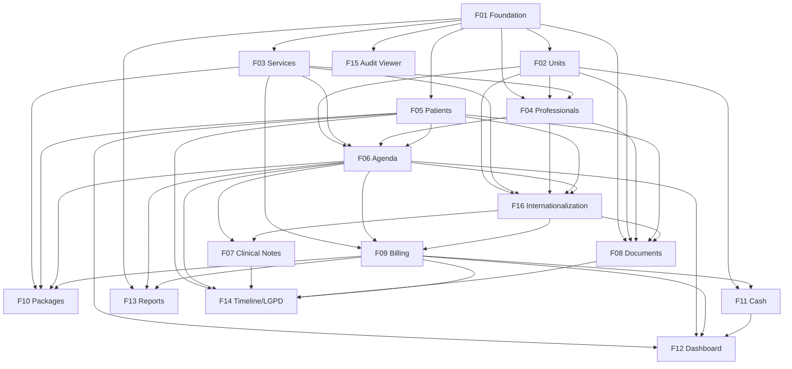

# GCli — Clinic Management Platform

## 1. Executive Summary

GCli is a responsive web platform that centralizes the daily operation of a healthcare clinic in a single environment: patient records, multi-professional scheduling across units and rooms, clinical encounter notes, patient documents, session packages, billing, cash control, and management indicators. It is specialty-agnostic — services, durations, prices, professionals, rooms, and document templates are configured by each clinic rather than hard-coded for one type of practice (medical, dental, physiotherapy, psychology, aesthetics, nutrition, etc.).

The first version serves a single clinic company operating up to 5 units, 50 professionals, 30 concurrent users, around 500 appointments per day, and up to 100,000 patient records. Although it is deployed for one company, every record is scoped to an organization from day one, so the product can evolve into a multi-tenant SaaS without data migration. Access is controlled by four fixed roles (Administrator, Manager, Front Desk, Professional), with clinical content visible only to professionals, and every sensitive operation recorded in an audit log to support LGPD (Brazil's General Data Protection Law) compliance.

The core value is replacing the scattered combination of spreadsheets, paper agendas, messaging apps, and disconnected tools with one source of truth: the front desk books and checks in patients, the professional records the encounter, the charge is generated automatically from the appointment, payments flow into the daily cash register of each unit, and the owner sees occupancy, no-shows, revenue, and receivables on a dashboard and in exportable reports. The interface is available in Brazilian Portuguese, English and Spanish, each unit follows the conventions of its country (currency, documents, address) starting with Brazil, Portugal, Spain, Mexico, Argentina, Chile, Colombia and the United States (F16), and the stack is Next.js with Prisma. Legal rules are validated for Brazil only in V1.

## 2. Problem and Opportunity

### The Problem

**Fragmented patient information**
- Patient data lives in spreadsheets, paper charts, WhatsApp conversations, and email attachments; staff commonly spend 3–5 minutes per call locating a patient's history.
- Duplicate patient records (same person registered twice with name variations) break the continuity of the clinical history.
- Exams and signed consent terms are stored on personal devices or paper folders, with no controlled access and a real risk of loss.
- There is no reliable record of patient consent for data processing, exposing the clinic under LGPD.

**Error-prone scheduling across professionals, units, and rooms**
- Double bookings of the same professional or room happen when agendas are kept in separate calendars or paper books.
- Services have different durations, but generic calendars use fixed slots, leaving idle gaps or overruns of 10–20 minutes.
- Recurring treatments (e.g., 10 weekly physiotherapy sessions) must be booked one by one, taking 5–10 minutes per patient series.
- Cancellations and no-shows are not tracked systematically, so clinics typically lose 10–20% of booked capacity without knowing who or why.

**Loose financial control**
- Charges are calculated manually from memory or price lists; discounts are granted without approval or trace.
- Partial payments and pending balances are tracked on paper, generating unrecovered receivables.
- Prepaid session packages are controlled on paper cards or spreadsheets, causing disputes about remaining sessions.
- Daily cash closing takes 30+ minutes and differences between counted cash and expected cash go unexplained.

**No management visibility**
- The owner has no consolidated view of occupancy, cancellations, revenue, and receivables per unit or professional.
- Monthly reports are assembled manually in spreadsheets, taking hours and arriving too late to act on.
- Decisions about hiring, opening hours, or pricing are made without data.

**Weak access control and traceability**
- Shared logins or open spreadsheets let any staff member read clinical notes and financial data.
- There is no record of who changed an appointment, voided a payment, or read a patient's chart.

### The Opportunity

- **Fragmented patient information → Single patient record with timeline:** one registry with duplicate detection by CPF and name + birth date, consent tracking, documents stored with the patient, and a chronological timeline consolidating appointments, clinical notes, documents, and payments.
- **Error-prone scheduling → Conflict-aware multi-resource agenda:** appointments validated against professional working hours, time-offs, room occupancy, and service duration; recurring series booked in one action; every status change (confirmation, cancellation, no-show) recorded with reason, feeding cancellation and no-show indicators.
- **Loose financial control → Charges generated from appointments:** the charge is created automatically with the service price snapshot, discounts above a threshold require manager approval, partial payments are supported, packages have a tracked session balance, and a daily cash register per unit reconciles expected versus counted cash.
- **No management visibility → Dashboard and reports:** KPIs filtered by period, unit, and professional (occupancy, no-show rate, revenue, receivables, net result) and five standard reports exportable to CSV and PDF.
- **Weak access control → Role-based access and audit log:** four fixed roles with a clear permission matrix, clinical content restricted to professionals, and an immutable audit log of creations, edits, deletions, and clinical record reads.

The differentiator is configurability without complexity: the same product serves a single-specialty office and a multi-specialty clinic with several units, because services, rooms, professionals, and document templates are data, not code — while keeping a data model ready for multi-tenant SaaS.

## 3. Target Audience

### Primary Users

**Clinic Owner / Administrator**
- Often a healthcare professional who also manages the business; needs a fast, reliable view of revenue, occupancy, and receivables across units.
- Configures the organization: units, rooms, services, prices, users, and document templates.
- Is accountable for LGPD compliance and needs to know who accessed or changed sensitive data.

**Operations / Financial Manager**
- Runs the day-to-day operation across units: reviews agendas, approves discounts, reopens cash registers, handles refunds.
- Produces monthly reports on production per professional, cancellations, and receivables.
- Needs to act on exceptions (high no-show rate, unpaid charges) without digging through spreadsheets.

**Front Desk / Receptionist**
- Handles phone calls and walk-ins all day; must find a patient and book an appointment in under a minute while the patient waits.
- Confirms appointments, checks patients in, registers payments, and closes the daily cash register of their unit.
- Must not have access to clinical notes, but needs complete administrative data about the patient.

**Healthcare Professional**
- Doctors, dentists, physiotherapists, psychologists, nutritionists, aestheticians, etc., working in one or more units with specific working hours.
- Needs to see their own agenda, open the patient's history before the encounter, and write the clinical note quickly between appointments.
- Issues documents such as medical certificates, attendance declarations, and simple prescriptions.

### Behavioral Profile

- Uses the system under time pressure, frequently with a patient in front of them; tolerates few clicks and no slow screens.
- Moderate digital literacy: comfortable with WhatsApp, web browsers, and spreadsheets, but not with complex enterprise software.
- Uses desktops at the front desk, and notebooks, tablets, or phones in consulting rooms and on the move.
- Expects the conventions of their country and language (in Brazil: Portuguese interface, CPF validation, DD/MM/YYYY dates, BRL currency, PIX as a payment method).

## 4. Objectives

### Product Objectives

1. **Centralize** all patient, scheduling, clinical, and financial information of the clinic in a single system, eliminating parallel spreadsheets and paper agendas.
2. **Speed up** front-desk operations — finding patients, booking appointments, checking in, and receiving payments.
3. **Reduce** revenue leakage from untracked charges, unapproved discounts, unpaid balances, and no-shows.
4. **Provide** managers with timely, reliable indicators per unit and professional for decision-making.
5. **Protect** patient data through role-based access, clinical confidentiality, consent records, and full traceability.

### Success Metrics

| Objective | Metric | Measurement condition |
|-----------|--------|-----------------------|
| Centralize | 100% of appointments and payments registered in GCli | Measured 30 days after go-live, comparing system records with the unit's appointment book and bank statements |
| Centralize | 0 active spreadsheets used for agenda or package control | Confirmed by the clinic owner 60 days after go-live |
| Speed up | Median time to book a single appointment for an existing patient ≤ 60 seconds | Measured from opening the booking form to saving, over 200 bookings in the first month |
| Speed up | Patient search returns results in ≤ 1 second (p95) | With 100,000 patient records in the database |
| Speed up | Daily cash closing per unit completed in ≤ 10 minutes | Median over 20 business days |
| Reduce leakage | ≥ 98% of completed appointments have a linked charge or package session debit | Measured weekly by the receivables report |
| Reduce leakage | 100% of discounts above 20% have manager approval recorded | Audited monthly through the audit log |
| Reduce leakage | Receivables older than 30 days reduced by 30% | Comparing month 3 against month 1 after go-live |
| Provide indicators | Dashboard loads in ≤ 3 seconds (p95) | For a 30-day period with ~15,000 appointments, all units selected |
| Provide indicators | Monthly management report produced in ≤ 5 minutes | Time from opening Reports to exported PDF/CSV |
| Protect | 100% of clinical note reads and edits recorded in the audit log | Verified by sampling 50 accesses per month |
| Protect | 0 clinical-content accesses by Front Desk users | Verified by permission tests and audit log review |
| Protect | 100% of patients registered after go-live have a consent record | Measured monthly |

## 5. User Stories

### F01. Platform Foundation, Authentication and Access Control
- As an administrator, I want to set the organization's legal name, CNPJ, logo, and time zone so that documents and reports carry the correct identification.
- As an administrator, I want to create users with one of four roles and send them an invitation email so that each staff member has an individual login.
- As a user, I want to log in with email and password so that I can access only the functions my role allows.
- As a user, I want to reset my forgotten password through an emailed link so that I can regain access without calling the administrator.
- As an administrator, I want to deactivate a user immediately so that a former employee loses access at once.
- As an administrator, I want to link a user of the Administrator or Manager role to a professional profile so that a clinic owner who also treats patients can write clinical notes.
- As the system, I want to record every create, update, delete, and clinical read operation with author and timestamp so that the audit log is complete.

### F02. Units and Rooms
- As an administrator, I want to register each unit with address, phone, and business hours per weekday so that the agenda respects when each unit is open.
- As an administrator, I want to register rooms in each unit so that appointments can be assigned to a physical space.
- As a manager, I want to register unit closures (holidays, maintenance) so that no appointments are booked on those dates.
- As an administrator, I want to deactivate a room so that it stops being offered for new appointments without losing its history.

### F03. Service Catalog
- As an administrator, I want to register services with name, category, duration, price, and color so that bookings use the right time and price automatically.
- As an administrator, I want to mark whether a service requires a room so that the agenda enforces room allocation only when needed.
- As a manager, I want to change a service price so that new appointments use the new price while existing ones keep the original price.
- As an administrator, I want to deactivate a service so that it is no longer offered but remains in historical records.

### F04. Professionals and Working Hours
- As an administrator, I want to register a professional with specialty and council registration (e.g., CRM 123456/SP) so that this information appears in documents.
- As an administrator, I want to select which services each professional performs so that only qualified professionals can be booked for a service.
- As a manager, I want to define each professional's weekly working hours per unit, with multiple intervals per day, so that the agenda shows correct availability.
- As a manager or professional, I want to register time-offs (vacation, conferences, personal blocks) so that those periods are not bookable.
- As a manager, I want to see the list of future appointments before deactivating a professional so that I can reschedule them.

### F05. Patient Registry
- As a front desk user, I want to search patients by name, CPF, or phone with at least 3 characters so that I find the record while the patient is on the phone.
- As a front desk user, I want to register a new patient with required fields and CPF validation so that records are complete and consistent.
- As a front desk user, I want to be warned about a possible duplicate (same CPF, or same name and birth date) so that I do not create two records for the same person.
- As a front desk user, I want to register a legal guardian for patients under 18 so that the clinic knows who is responsible.
- As a front desk user, I want to record the patient's consent to the privacy terms with date and terms version so that the clinic complies with LGPD.
- As a front desk user, I want to add administrative observations and tags to a patient so that the team knows relevant non-clinical information (e.g., "prefers mornings").

### F06. Scheduling and Agenda
- As a front desk user, I want to see the day's agenda with one column per professional or per room so that I can find free slots at a glance.
- As a front desk user, I want to book an appointment by choosing patient, service, professional, unit, date, and time so that the duration and price are filled in from the service.
- As a front desk user, I want the system to block double booking of a professional or room so that conflicts never reach the patient.
- As a front desk user, I want to book a recurring series (e.g., every Tuesday and Thursday at 10:00 for 10 weeks) in one action so that treatment plans are scheduled quickly.
- As a front desk user, I want to change appointment status (confirmed, checked in, no-show, cancelled with reason) so that the agenda reflects reality.
- As a front desk user, I want to reschedule an appointment by dragging it or editing date and time so that the history of the change is kept.
- As a manager, I want to allow an overbooking ("encaixe") with explicit confirmation so that urgent cases can be fit in.
- As a professional, I want to see only my own agenda across all units so that I know where and when I work.
- As a professional, I want to mark an appointment as in progress and completed so that the front desk knows the room status.

### F07. Clinical Encounter Records
- As a professional, I want to write a clinical note linked to the appointment so that the patient's history is recorded per encounter.
- As a professional, I want my note draft to autosave so that I do not lose text if the browser closes.
- As a professional, I want to attach images and PDFs to the note so that exam results and photos are kept with the encounter.
- As a professional, I want to read previous notes of the patient before the encounter so that I know the history.
- As a professional, I want to add an addendum to a locked note so that I can complement information without altering the original record.
- As the system, I want to lock notes 24 hours after creation so that clinical records cannot be retroactively altered.

### F08. Patient Documents
- As a front desk user, I want to upload files (exams, ID copies, signed terms) to a patient's record with a category so that documents are stored in one place.
- As an administrator, I want to create document templates with variables (patient name, CPF, date, professional, unit address) so that recurring documents are standardized.
- As a professional, I want to generate a medical certificate or prescription from a template as a PDF so that I can print it for the patient.
- As a front desk user, I want to generate an attendance declaration so that the patient can justify absence from work.
- As a user, I want generated documents to be saved automatically in the patient's record so that they can be reprinted later.

### F09. Billing and Payments
- As the system, I want to create a charge automatically when an appointment is checked in so that no attendance goes uncharged.
- As a front desk user, I want to apply a discount (percentage or fixed amount) to a charge so that negotiated prices are recorded.
- As a manager, I want to approve discounts above 20% so that large discounts are controlled.
- As a front desk user, I want to register one or more payments on a charge with method (cash, PIX, debit, credit, transfer) so that partial payments are supported.
- As a front desk user, I want to print a payment receipt so that the patient has proof of payment.
- As a manager, I want to void a charge or refund a payment with a mandatory reason so that corrections are traceable.
- As a front desk user, I want to see all open charges of a patient so that I can collect pending balances when they arrive.

### F10. Session Packages
- As an administrator, I want to create package templates (service, number of sessions, total price, validity) so that the front desk sells standardized packages.
- As a front desk user, I want to sell a package to a patient and generate its charge so that prepaid treatments are recorded.
- As a front desk user, I want to link an appointment to an active package so that the session is debited from the balance instead of generating a new charge.
- As a front desk user, I want to see the remaining sessions and expiration date of each package so that I can inform the patient.
- As a manager, I want to extend a package's validity with a reason so that exceptional situations can be handled.

### F11. Cash Register and Expenses
- As a front desk user, I want to open the daily cash register of my unit with an opening balance so that cash movement is tracked.
- As a front desk user, I want to see all payments received in the unit today grouped by method so that I know the expected totals.
- As a front desk user, I want to register manual cash entries and withdrawals (e.g., buying supplies) so that all cash movement is recorded.
- As a front desk user, I want to close the cash register by informing the counted cash so that differences are identified and justified.
- As a manager, I want to register expenses with category, due date, and payment status so that the clinic's costs are known.
- As a manager, I want to reopen a closed cash register with a reason so that errors can be corrected.
- As a manager, I want a financial statement per unit and period so that I see all revenues and expenses.

### F12. Management Dashboard
- As an owner, I want to see appointments, occupancy, cancellations, and no-show rates for a period so that I understand how the agenda is being used.
- As an owner, I want to see received revenue, billed amount, receivables, expenses, and net result so that I know the financial health of the clinic.
- As a manager, I want to filter the dashboard by unit and professional so that I compare performance.
- As an owner, I want to compare the selected period with the previous one so that I see trends.

### F13. Reports and Export
- As a manager, I want an appointments report filtered by period, unit, professional, service, and status so that I can analyze the agenda.
- As a manager, I want a cancellations and no-shows report with reasons so that I can act on causes.
- As a manager, I want a revenue report by payment method, service, and professional so that I understand where money comes from.
- As a manager, I want a receivables aging report so that I prioritize collections.
- As a manager, I want a professional productivity report so that I evaluate each professional's production.
- As a manager, I want to export any report to CSV and PDF so that I can share it or process it in a spreadsheet.

### F14. Patient Timeline and LGPD Data Requests
- As a professional, I want to see a chronological timeline of the patient's appointments, clinical notes, and documents so that I understand the full history in one screen.
- As a front desk user, I want to see the patient's timeline without clinical content so that I can answer administrative questions.
- As an administrator, I want to export all data of a patient in a downloadable file so that I can answer an LGPD access request within the legal deadline.
- As an administrator, I want to anonymize a patient's personal data upon request, when legally allowed, so that the clinic complies with the right to erasure.

### F15. Audit Log Viewer
- As an administrator, I want to search the audit log by user, entity, action, and date range so that I can investigate who did what.
- As an administrator, I want to see the before and after values of an edit so that I understand exactly what changed.
- As an administrator, I want to export audit log results to CSV so that I can provide evidence in an audit or legal request.

### F16. Internationalization and Country Profiles
- As a user, I want to choose the interface language (Português (Brasil), English or Español) so that I work in the language I read best.
- As an administrator, I want to set the organization's default language and headquarters country so that new users and new units start with the right settings.
- As an administrator, I want to set each unit's country so that its currency, tax ID, address format, phone code, time zones, professional councils and payment methods follow that country.
- As a front desk user, I want to register patients with the identity document and address format of their country so that records are valid locally.
- As a manager, I want amounts shown in each unit's currency, and dashboard and report totals separated by currency, so that money in different currencies is never mixed.
- As a user, I want emails, PDFs and exports in my language, with the date and number formats I am used to.

## 6. Functionalities

### F01. Platform Foundation, Authentication and Access Control

**Provides:**
- Organization profile: legal name, trade name, CNPJ, logo, time zone (used by F08, F13)
- User accounts: name, email, role, active status (used by F04)
- Audit event records: actor, action, entity type, entity id, timestamp, IP address, before/after values (used by F15)

**Capabilities:**
- Application scaffolding: Next.js app with authenticated layout (sidebar navigation, header with user menu and unit selector), Prisma with PostgreSQL, and a global `organizationId` on every business table so that the data model supports multiple tenants later.
- Organization settings: legal name (required, max 150 chars), trade name, tax ID of the headquarters country (CNPJ in Brazil, validated check digits), logo (PNG/JPG/SVG, max 2 MB, displayed at max 200×80 px), time zone (default America/Sao_Paulo), agenda slot granularity (5, 10, 15, or 30 minutes; default 15), default language and headquarters country (F16; default pt-BR and Brazil). Currency is defined per unit (F16).
- Up to 100 active users per organization.
- Four fixed roles, one per user:

| Area | Administrator | Manager | Front Desk | Professional |
|------|---------------|---------|------------|--------------|
| Organization settings, users | Full | View users only | — | — |
| Units, rooms, services, templates | Full | Full | View | View |
| Professionals and working hours | Full | Full | View | Own time-offs only |
| Patients (administrative data) | Full | Full | Full | View patients with an appointment with them |
| Agenda | All | All | All | Own agenda; status in progress/completed |
| Clinical notes and clinical attachments | Only if linked to a professional profile | Only if linked to a professional profile | — | Create/read for patients with an appointment with them |
| Billing, packages, cash | Full | Full, including approvals, voids, refunds, reopening | Register charges, payments, packages, cash; no voids/refunds | — |
| Dashboard and reports | Full | Full | — | — |
| Audit log, LGPD export/anonymization | Full | — | — | — |

- A user with Administrator or Manager role may be linked to one professional profile (F04), which additionally grants all Professional permissions for their own agenda and patients.
- Authentication: email + password. Password minimum 10 characters with at least one letter and one digit, hashed with Argon2id. 5 consecutive failed attempts lock the account for 15 minutes.
- Sessions: HTTP-only secure cookie; expire after 60 minutes of inactivity and 12 hours absolute.
- Invitations: the administrator creates a user (name, email, role); the system emails an invitation link valid for 72 hours to set the password. Resending invalidates the previous link.
- Password reset: link valid for 60 minutes, single use; the response is identical whether the email exists or not.
- Deactivating a user terminates all their active sessions within 1 minute; the last active Administrator cannot be deactivated or demoted.
- Audit recording service: every create, update, and delete on business entities, every clinical note read, login success/failure, and permission-denied event is written to an append-only audit table with actor, action, entity, timestamp, IP, and changed fields (before/after). Audit records cannot be edited or deleted through the application and are retained for 5 years.
- Server-side authorization on every API route and server action; hiding UI elements is not considered protection.

**Experience:**
- Login page: email, password, "Esqueci minha senha" link. On success, redirects to the Agenda (Front Desk, Professional) or Dashboard (Administrator, Manager).
- Invitation flow: user opens the link → sees name and email pre-filled (read-only) → sets password with a strength indicator and confirmation → is logged in.
- Users screen (Administrator): table with name, email, role, linked professional, status, last login; actions: invite, edit role, resend invitation, deactivate/reactivate. Search by name or email.
- Organization settings screen: form with the fields above; logo preview; save shows toast "Configurações salvas".
- Navigation menu shows only modules the role can access; direct access to a forbidden URL shows a 403 page "Você não tem permissão para acessar esta página" with a link back to the home screen.

**Error Handling:**
- Wrong credentials: "E-mail ou senha inválidos." (generic, never reveals which field is wrong).
- Account locked: "Conta bloqueada temporariamente por excesso de tentativas. Tente novamente em 15 minutos."
- Expired or used invitation/reset link: "Este link expirou ou já foi utilizado. Solicite um novo." with a button to request a new reset link.
- Session expired during an operation: unsaved form data is kept in the browser, user is redirected to login with "Sua sessão expirou. Entre novamente para continuar." and returned to the same page after login.
- Attempt to deactivate the last Administrator: "É necessário manter pelo menos um administrador ativo."

### F02. Units and Rooms

**Provides:**
- Units (name, business hours per weekday, closures) and rooms (name, unit, active status) (used by F04, F06)
- Unit name, address, and phone (used by F08)
- Unit list for per-unit cash registers (used by F11)

**Capabilities:**
- Up to 20 units per organization; up to 30 rooms per unit.
- Unit fields: country (required; defines currency, tax ID, address fields and time zones — F16), name (required, unique, max 80 chars), tax ID of the country (optional, validated; CNPJ in Brazil), address (fields of the country — in Brazil CEP, street, number, complement, district, city, state, with CEP auto-filled via a public CEP lookup when available, editable manually), time zone (among the country's zones), phone, email, active flag.
- Business hours: per weekday, open/closed plus up to 2 intervals (e.g., 07:00–12:00, 13:00–20:00), with 5-minute granularity.
- Closures: date or date range with reason (e.g., "Feriado municipal"); up to 100 future closures per unit.
- Room fields: name (required, unique within the unit, max 50 chars), description, active flag.
- Units and rooms are never hard-deleted once referenced by an appointment; they are deactivated. Deactivated items do not appear in booking forms but remain in history, filters, and reports.

**Experience:**
- Units list: cards with name, city, number of active rooms, status. "Nova unidade" opens a form with tabs: Dados, Horário de funcionamento, Salas, Fechamentos.
- Business hours tab: 7 rows (Seg–Dom) with toggle "Aberto" and time pickers; "Copiar para todos os dias úteis" button.
- Rooms tab: inline list with add/edit/deactivate.
- Closures tab: list of upcoming closures; adding one shows how many existing appointments fall in that range.
- The header unit selector (from F01 layout) lists active units; the selection is remembered per user and pre-filters Agenda, Cash, and Dashboard.

**Error Handling:**
- Deactivating a room with future appointments: "Esta sala possui 12 agendamentos futuros. Reatribua-os antes de desativar." with a link to the filtered agenda list.
- Adding a closure that overlaps existing appointments: warning "Existem 8 agendamentos neste período. Eles não serão cancelados automaticamente." requiring confirmation; the closure is saved and the appointments are listed for handling.
- Duplicate unit or room name: inline error "Já existe uma unidade/sala com este nome."
- Reducing business hours so that existing future appointments fall outside them: save is allowed with a warning listing the affected appointment count.

### F03. Service Catalog

**Provides:**
- Services: name, category, default duration, current price, color, requires-room flag, allowed rooms, active status (used by F04, F06, F09, F10)

**Capabilities:**
- Up to 500 services per organization; up to 50 categories.
- Fields: name (required, unique, max 100 chars), category (required, e.g., "Consultas", "Procedimentos", "Terapias"), description (max 500 chars), duration (required, 5–480 minutes in multiples of 5), price per currency used by the organization's active units (required for each, 0 to 99,999.99 in the currency; zero allowed for free returns — F16), color (from a palette of 16), requires room (yes/no), allowed rooms (optional subset; empty = any active room), active flag.
- Price history: every price change is stored with effective date and author; appointments snapshot the price at booking time, so changes never alter existing appointments or charges.
- Services referenced by appointments cannot be deleted, only deactivated.

**Experience:**
- Services list grouped by category, with columns name, duration, price, number of enabled professionals, status; search by name; filter by category and status.
- Service form in a side panel; one price field per currency in use, each with its currency mask (F16); after changing the price, the confirmation reads "O novo preço valerá para novos agendamentos. Agendamentos existentes mantêm o preço original."
- Price history is visible in a "Histórico de preços" tab.

**Error Handling:**
- Duplicate name: "Já existe um serviço com este nome."
- Invalid duration: "A duração deve ser entre 5 e 480 minutos, em múltiplos de 5."
- Deactivating a service with future appointments: the service is deactivated for new bookings and a warning shows "12 agendamentos futuros deste serviço foram mantidos."

### F04. Professionals and Working Hours

**Consumes:**
- F01: user accounts (name, email, role, active status) for optional linking
- F02: units and rooms, units' business hours
- F03: services (name, active status) for enablement

**Provides:**
- Professionals with enabled services, weekly working hours per unit, time-offs, active status (used by F06)
- Professional name, specialty, council type, council number and state (used by F08)

**Capabilities:**
- Up to 100 active professionals per organization.
- Fields: full name (required), display name, specialty (free text, e.g., "Fisioterapia ortopédica"), council type (per country of the units where the professional works — in Brazil CRM, CRO, CREFITO, CRP, CRN, COREN, CRBM, CRF, other/none; see F16), council number and state or region (required when type ≠ none), identity document (types of the country, F16), phone, email, agenda color, linked user (optional; must be an active user with Professional role, or Administrator/Manager as described in F01; one user per professional), active flag.
- Enabled services: multi-select of active services; a professional can only be booked for enabled services.
- Working hours: per unit and weekday, up to 4 intervals per day, 5-minute granularity; a professional may work in multiple units but intervals cannot overlap across units on the same day. Working hours outside the unit's business hours are rejected.
- Validity period: working-hour sets have a start date (and optional end date), allowing a future schedule change without affecting past or current weeks.
- Time-offs: date/time range with type (vacation, conference, personal, other) and optional note; up to 1 year ahead. Professionals can create/delete their own time-offs; managers can manage all.
- Deactivation is blocked while the professional has future appointments not cancelled.

**Experience:**
- Professionals list with photo placeholder/initials, name, specialty, units, number of services, status.
- Professional form with tabs: Dados, Serviços (checkbox list grouped by category with "Selecionar todos da categoria"), Horários (weekly grid per unit, with "Copiar semana" and validity dates), Ausências (list + "Nova ausência").
- The weekly grid visually highlights intervals outside the unit's business hours in red before saving.
- Creating a time-off that overlaps booked appointments shows the list of affected appointments with a link to reschedule each one.

**Error Handling:**
- Overlapping working hours across units: "Conflito de horário: este profissional já atende na unidade Centro às terças, 08:00–12:00."
- Working hours outside unit business hours: "O horário informado está fora do funcionamento da unidade (08:00–18:00)."
- Deactivation with future appointments: "Existem 23 agendamentos futuros. Reagende ou cancele antes de desativar." with a link to the filtered list.
- Removing an enabled service that has future appointments with this professional: the removal is allowed for new bookings, and a warning lists the count of kept appointments.
- Linking a user already linked to another professional: "Este usuário já está vinculado a outro profissional."

### F05. Patient Registry

**Provides:**
- Patient identity and contact: full name, social name, CPF, birth date, phone, email, address, guardian (used by F06, F08, F10)
- Complete patient record including consent records, observations, tags, and creation date (used by F12, F14)

**Capabilities:**
- Up to 100,000 active patients with search p95 ≤ 1 second.
- Fields: full name (required, max 150 chars), social name (optional; displayed instead of full name in agenda and screens when filled), birth date (required), sex (female, male, other, not informed), identity document (optional; type and number of the patient's country — CPF in Brazil — check digits validated, unique per type within the organization, F16), RG or secondary document, mobile phone (required, international format with the unit's country code by default; Brazilian numbers with DDD), secondary phone, email, address (fields of the country; CEP lookup in Brazil as in F02), occupation, referral source (configurable list, e.g., Instagram, Google, indicação), administrative observations (max 2,000 chars), tags (up to 10 per patient, from a configurable list).
- Guardian: required for patients under 18 at registration — guardian name, identity document, relationship, phone.
- Duplicate detection: on save, the system checks exact CPF match (blocks) and same normalized name + birth date (warns, allows proceeding with confirmation).
- Consent: record of acceptance of the clinic's privacy terms — terms version, date/time, method (signed on paper and uploaded, verbal confirmed by staff, digital), and staff user. The clinic's terms text is maintained by the Administrator with versioning; a new version flags patients as "consentimento pendente" until renewed.
- Search: by name (accent- and case-insensitive, partial), CPF (with or without mask), or phone (last 8+ digits); minimum 3 characters; results show 20 per page with name, age, CPF (masked except last 5 digits for Front Desk), phone, last appointment date.
- Patient deactivation (e.g., deceased, moved) hides the patient from booking searches but keeps records.

**Experience:**
- Global patient search field in the header, available on every screen (keyboard shortcut "/").
- Patient page with header (name, age, phone, tags, consent status badge) and tabs: Dados, Agendamentos, Documentos, Financeiro, Linha do tempo (tabs filled by the features that provide them; Clinical tab only for authorized roles).
- Quick registration form (used from the booking modal): full name, birth date, mobile phone — rest optional, with a banner "Cadastro incompleto" until CPF and consent are filled.
- Full form with sections; CEP auto-fills address; CPF formats as typed.
- Duplicate warning modal shows the candidate existing record(s) side by side with "Abrir cadastro existente" and "Criar mesmo assim" (the latter only for name + birth date matches).
- Consent section: "Registrar consentimento" button opens a modal with the terms version, method selector, and optional file upload of the signed term.

**Error Handling:**
- CPF already registered: "Este CPF já está cadastrado para Maria S. Oliveira." with a link to the record; save is blocked.
- Invalid CPF: inline "CPF inválido."
- Minor without guardian: "Pacientes menores de 18 anos precisam de um responsável cadastrado."
- Concurrent edit (another user saved the record after this form was opened): "Este cadastro foi alterado por João às 14:32. Revise as alterações antes de salvar." showing the differing fields; no silent overwrite.
- Deactivating a patient with future appointments: "O paciente possui 3 agendamentos futuros. Cancele-os antes de inativar."

### F06. Scheduling and Agenda

**Consumes:**
- F02: units with business hours and closures; rooms with active status
- F03: services with default duration, current price, requires-room flag, allowed rooms
- F04: professionals with enabled services, working hours per unit, time-offs
- F05: patient identity and contact (full name, social name, phone, birth date)

**Provides:**
- Appointment records: patient, professional, service, unit, room, start/end date-time, duration, status and status history, price snapshot, cancellation reason and origin, recurrence series, created-by (used by F07, F09, F10, F12, F13, F14)

**Core Scope:**
- Single appointment booking with conflict validation, status lifecycle, rescheduling with history, day/week/list views, filters, overbooking with confirmation.

**Full Scope additions:**
- Recurring series booking and series editing, drag-and-drop rescheduling and resizing, room-based day view, printable daily agenda per professional.

**Capabilities:**
- Appointment fields: patient (required), service (required), professional (required, must have the service enabled), unit (required), room (required if the service requires a room; restricted to allowed rooms), date and start time (granularity from F01 settings), duration (default from service, editable 5–480 min in multiples of 5), price snapshot (from service at booking), notes for the front desk (max 500 chars).
- Status lifecycle: Agendado → Confirmado → Chegou (checked in) → Em atendimento → Concluído; terminal alternatives: Faltou (no-show) and Cancelado. Allowed backward transitions: Confirmado → Agendado, Chegou → Confirmado (undo within 30 minutes), Concluído → Em atendimento (by the appointment's professional within 30 minutes, or by a Manager/Administrator at any time with a justification). Every transition records user and timestamp.
- Cancellation requires origin (patient, clinic, professional) and reason from a configurable list plus optional text. No-show can be set only after the appointment's start time.
- Conflict rules, validated server-side at save:
  - Professional double booking: blocked; can be overridden as "Encaixe" by Front Desk, Manager, or Administrator with explicit confirmation; overbooked appointments display an "Encaixe" badge.
  - Room double booking: always blocked.
  - Outside professional working hours, during a time-off, outside unit business hours, or on a unit closure: blocked for Front Desk; Manager/Administrator may override with a mandatory justification.
  - Patient with another appointment overlapping the same time: warning only.
- Rescheduling keeps the same appointment record, stores previous date/time/professional/room in history, and resets status to Agendado.
- Recurrence: frequency weekly or every 2 weeks, on 1–6 selected weekdays, ending after N occurrences (max 52) or on a date (max 12 months ahead). Before saving, each occurrence is validated; conflicting occurrences are listed and the user can skip them or pick an alternative time per occurrence. Editing or cancelling offers "Somente este", "Este e os seguintes", or "Todos os futuros".
- Views: Day (columns per professional, up to 20 visible with horizontal scroll, or per room), Week (single professional or single room), List (table with pagination of 50). Filters: unit (required context), professionals, services, statuses.
- Availability search: "Próximo horário livre" finds the next 10 available slots for a given service (and optionally professional) within 60 days.
- Concurrency: changes by other users appear in open agendas within 30 seconds (polling) and immediately after the user's own action.
- Professionals see only their own appointments across all units.

**Experience:**
- Default screen for Front Desk: Day view of the selected unit for today, current time line highlighted, appointments colored by service color with status icon, patient name (social name if present), service, and room.
- Clicking an empty slot opens the booking modal pre-filled with professional, date, and time; clicking an appointment opens a side panel with details, status buttons, "Reagendar", "Cancelar", links to patient record and (for authorized roles) the clinical note.
- Booking modal flow: patient search (with "Novo paciente" quick registration inline) → service → professional (filtered by service) → room (filtered, auto-selected if only one available) → date/time → optional recurrence → save. The end time and price are shown as the service is chosen.
- Conflicts are displayed inline in the modal before saving (red: blocked; yellow: overridable, with "Confirmar encaixe"/"Justificar exceção").
- Status changes are one click from the side panel; cancellation opens a small form with origin and reason.
- Drag-and-drop (Full Scope) moves an appointment; dropping triggers validation and a confirmation "Reagendar para qui, 14:30 com Dra. Ana?".
- Toasts confirm actions: "Agendamento criado", "Status alterado para Chegou".

**Error Handling:**
- Professional conflict: "Dra. Ana já possui atendimento das 14:00 às 14:50. Deseja registrar como encaixe?"
- Room conflict: "A Sala 2 está ocupada das 14:00 às 15:00. Escolha outra sala ou horário." (no override).
- Concurrent booking of the same slot (two users saving within milliseconds): the database constraint rejects the second save and shows "Este horário acabou de ser ocupado por outro agendamento. Atualize a agenda e escolha outro horário."
- Recurring series with conflicts: "4 de 20 sessões possuem conflito." with a per-occurrence list offering "Pular" or "Escolher outro horário"; nothing is saved until the user resolves or skips all conflicts.
- Attempt to set no-show before the start time: "Só é possível marcar falta após o horário de início do agendamento."

### F07. Clinical Encounter Records

**Consumes:**
- F06: appointment records (patient, professional, service, unit, start date-time, status)

**Provides:**
- Clinical notes with author, appointment, creation and lock timestamps, addenda, and clinical attachments (used by F14)

**Capabilities:**
- One clinical note per appointment, created by the appointment's professional (or a user linked to that professional profile) when status is Chegou, Em atendimento, or Concluído. Standalone notes (without appointment) are allowed for patients with at least one past appointment with the professional, labeled "Registro avulso".
- Rich text editor (bold, italic, lists, headings), max 50,000 characters.
- Autosave of drafts every 10 seconds and on blur; draft visible only to its author.
- Finalize ("Finalizar registro") makes the note visible to other authorized professionals. The author can edit the finalized note for 24 hours after its creation; after that it is locked permanently. Every edit within the 24 hours stores a version (previous content kept). A draft that was never finalized is finalized automatically when the 24 hours end (marked "Finalizado automaticamente"), so the encounter record is never left hidden or editable.
- Addenda: after locking, the author or another authorized professional can add addenda (max 10,000 chars each) with their own author and timestamp; addenda are immutable.
- Clinical attachments: PDF, JPG, PNG, HEIC (converted to JPG), max 20 MB per file, max 10 files per note, added only while the note is editable (files that arrive later go to the patient's documents, F08); stored in private object storage, served through short-lived signed URLs (5 minutes).
- Clinical alerts: each patient can have a short clinical alert text (max 500 chars, e.g., "Alergia a dipirona") edited by authorized professionals, with history, shown in the record header and never outside clinical screens.
- Access: only Professionals with at least one appointment with the patient (and Administrator/Manager users linked to such a professional). Every read of a note is written to the audit log (F01).
- Notes and attachments are never deleted; an attachment added in error can be marked "Anexado por engano" within 24 hours, which hides it from default view but keeps it in the record.

**Experience:**
- From the agenda side panel or the patient page, "Abrir prontuário" opens a split screen: left column with the patient header (name, age, allergies/alerts tag if any) and the list of previous notes (date, professional, service, first 150 characters); right column with the current note editor.
- Status indicator above the editor: "Rascunho salvo às 14:32" / "Finalizado — editável até 29/09 14:10" / "Bloqueado".
- Attachments area with drag-and-drop, upload progress per file, and thumbnails.
- When the professional sets the appointment to Concluído without a finalized note, a reminder shows "Você ainda não finalizou o registro deste atendimento." (not blocking).
- Locked notes show "Adicionar adendo" button; addenda appear below the original text with author and timestamp.

**Error Handling:**
- Autosave failure (network): banner "Não foi possível salvar o rascunho. Suas alterações estão guardadas neste navegador e serão enviadas quando a conexão voltar." with local storage backup and automatic retry every 15 seconds.
- Attempt to edit after 24 hours: editor becomes read-only with "Este registro foi bloqueado em 29/09 às 14:10. Utilize um adendo para complementar."
- Attachment above 20 MB or unsupported format: "Arquivo não suportado. Envie PDF, JPG, PNG ou HEIC de até 20 MB."
- Unauthorized access attempt (e.g., Front Desk URL manipulation): 403 page and a permission-denied audit event.
- Concurrent editing of the same note in two tabs: the second save shows "Este registro foi alterado em outra janela. Recarregue para ver a versão mais recente." without overwriting.

### F08. Patient Documents

**Consumes:**
- F01: organization profile (legal name, trade name, CNPJ, logo)
- F02: unit name, address, and phone
- F04: professional name, specialty, council type, council number and state
- F05: patient identity (full name, social name, CPF, birth date, address)

**Provides:**
- Patient document records: type (uploaded or generated), category, title, date, author, file reference, clinical flag (used by F14)

**Core Scope:**
- Upload, categorize, view, and download files in the patient's record.

**Full Scope additions:**
- Document templates with variables and PDF generation saved to the patient's record.

**Capabilities:**
- Uploads: PDF, JPG, PNG, HEIC, DOCX; max 20 MB per file; up to 20 files per upload action; organization storage quota 50 GB with an alert at 80%. The quota counts only this feature's files (uploaded and generated documents), blocks only their uploads (generated PDFs are counted but never blocked), and does not count F05 consent files or F07 attachments. At 80% a notice shows in the upload dialog and the usage shows in the Documents settings; each time usage reaches 80%, the administrators receive one email.
- Categories (configurable, default: Exame, Termo assinado, Documento pessoal, Laudo externo, Outro); each category has a "clínico" flag — clinical categories are visible only to authorized professionals (same rule as F07). Exame and Laudo externo are clinical by default; Front Desk can upload to a clinical category but cannot see, open, edit or archive the document afterwards. A document's clinical flag can be turned on but never off: turning a category's flag on makes its existing documents clinical, turning it off affects only new uploads, and moving a clinical document to another category keeps it clinical.
- Templates: up to 50; fields: name, type (Atestado, Declaração de comparecimento, Receituário, Encaminhamento, Outro), clinical flag (clinical templates can be generated only by professionals with clinical access to the patient, and the signing professional is always the user's own profile; non-clinical templates accept any active professional), rich text body with variables inserted from a menu: `{{paciente.nome}}`, `{{paciente.cpf}}`, `{{paciente.data_nascimento}}`, `{{profissional.nome}}`, `{{profissional.registro}}` (e.g., "CRM 123456/SP"), `{{profissional.especialidade}}`, `{{unidade.nome}}`, `{{unidade.endereco}}`, `{{clinica.nome}}`, `{{clinica.cnpj}}`, `{{data_hoje}}`, `{{data_extenso}}`, plus free-text fields filled at generation time (e.g., `{{campo:dias_afastamento}}`).
- 3 seeded templates: Atestado, Declaração de comparecimento, Receituário simples.
- Generated PDF: A4, header with organization logo and name, footer with unit address and phone, signature line with professional name and registration; generated in ≤ 5 seconds; saved automatically as a patient document (category "Documento emitido").
- Documents cannot be hard-deleted; they can be archived with reason (Manager/Administrator), which hides them from the default list, and restored by the same roles. The title and category of an uploaded document can be corrected by the uploader or a Manager/Administrator; generated documents cannot be edited.

**Experience:**
- Patient page, "Documentos" tab: list with date, title, category, author, size; filters by category and type; preview in a modal (PDF and images) and download.
- "Enviar arquivos" opens a drop zone with per-file category selection and progress bars.
- "Emitir documento" opens: select template → select professional (pre-filled with the logged professional) and unit (pre-filled with current unit) → fill free-text fields → live preview → "Gerar PDF" → PDF opens in a new tab for printing and appears in the list.

**Error Handling:**
- File too large or unsupported: "O arquivo exame.zip não é suportado. Envie PDF, imagens ou DOCX de até 20 MB."
- Upload interrupted: the failed file shows "Falha no envio" with "Tentar novamente"; successfully uploaded files of the same batch are kept.
- Storage quota exceeded: "O espaço de armazenamento da clínica está esgotado (50 GB). Contate o administrador." — upload blocked.
- Template with a variable that has no value (e.g., patient without CPF): preview highlights the empty variable and asks "O CPF do paciente não está cadastrado. Deseja gerar mesmo assim?".
- PDF generation failure: "Não foi possível gerar o documento. Tente novamente." — no partial document is saved.

### F09. Billing and Payments

**Consumes:**
- F03: service current price (for manual charges not tied to an appointment)
- F06: appointment records (patient, professional, service, unit, status, price snapshot)

**Provides:**
- Charge and payment records: patient, appointment or package origin, service, professional, unit, gross amount, discount, net amount, status, payments and refunds with method, amount, date, unit, and user (used by F11, F12, F13, F14)
- Charge creation and payment status for package sales, plus suppression of per-appointment charges for package-covered appointments (used by F10)

**Capabilities:**
- Automatic charge: created in status "Em aberto" when an appointment changes to Chegou, with the appointment's price snapshot. Not created for appointments with price R$ 0.00 or covered by a package (F10). If the appointment returns to Confirmado within the undo window, the charge is removed if it has no payments.
- Manual charge: for a patient and service (price from service, editable) or free description, e.g., sale of a product or a fee.
- Discount: percentage or fixed amount; discounts up to 20% can be applied by Front Desk; above 20% require approval by a Manager/Administrator (inline approval by entering their credentials, or later approval from a pending-approvals list). The discount reason is mandatory above 10%.
- Payment methods (configurable list per unit country; default from the country profile in F16, e.g., Brazil: Dinheiro, PIX, Cartão de débito, Cartão de crédito, Transferência, Outro); amounts are in the unit's currency; credit card records the number of installments (1–12) for information only.
- Multiple payments per charge (partial payments); status calculated: Em aberto, Parcialmente pago, Pago, Cancelado. Overpayment is not allowed.
- Payment date defaults to now; backdating up to 7 days allowed for Manager/Administrator.
- Void (cancel) a charge: Manager/Administrator, only if it has no active payments, mandatory reason.
- Refund (estorno) of a payment: Manager/Administrator, mandatory reason; creates a negative movement dated today (the original payment is kept).
- Receipt: PDF with organization data, patient, services, amounts, payment methods, and date; generated in ≤ 3 seconds. Not a fiscal document.
- Each payment is attributed to the unit where it was received (current unit selector), which may differ from the appointment's unit.
- Clarifications (F09 specification):
  - Inline approval uses a personal 6-digit approval PIN that each Manager/Administrator sets in the user menu (confirming the current password). Five wrong PINs lock that PIN for 15 minutes. The alternative is "Enviar para aprovação", which puts the charge in the pending-approvals list.
  - The discount is computed on the gross amount (a percentage is rounded down to the cent). It can be changed only while the charge has no payments. A rejection needs a reason, removes the discount and returns the charge to "Em aberto".
  - Payment methods keep the stable codes of the country profile; the Administrator or Manager can enable or disable them per country, and at least one stays enabled.
  - A payment must be recorded in a unit whose currency is the charge's currency. A refund can be partial or total, is recorded in the selected unit and keeps the method of the original payment.
  - Undoing a check-in is refused while the charge has payments ("Esta cobrança já tem pagamento. Estorne os pagamentos antes de desfazer a chegada."). A charge with no payments is deleted.
  - A charge has one item (a service or a free description). The receipt is one PDF per charge, generated on demand.

**Experience:**
- In the agenda side panel, after check-in, a "Cobrança" section shows the amount and a "Receber" button.
- Receive modal: charge summary (service, price, discount field), then one or more payment lines (method + amount), remaining balance calculated live, "Confirmar recebimento" → toast "Pagamento registrado" and option "Imprimir recibo".
- Patient page "Financeiro" tab: open charges highlighted at the top with total due, then history of charges and payments.
- Financial > Cobranças screen: list with filters (period, unit, status, professional, payment method), totals at the bottom.
- Pending approvals list for Managers with approve/reject buttons.

**Error Handling:**
- Payment greater than the remaining balance: "O valor informado (R$ 250,00) é maior que o saldo em aberto (R$ 200,00)."
- Discount above 20% without approval: charge stays "Aguardando aprovação de desconto" and cannot receive payments until approved or the discount is reduced.
- Double submission (double click / retry): payments carry an idempotency key; a repeated submission within 60 seconds returns the already registered payment instead of creating another.
- Attempt to void a charge with payments: "Estorne os pagamentos antes de cancelar esta cobrança."
- Registering a payment in a unit whose cash register for the day is closed (enforced once F11 is in place): "O caixa da unidade Centro de hoje já foi fechado. Solicite a reabertura a um gestor."

### F10. Session Packages

**Consumes:**
- F03: services (name, active status, current price for comparison)
- F05: patient identity (full name, CPF)
- F06: appointment records (patient, service, status) for session linking and debiting
- F09: charge creation and payment status for package sales, per-appointment charge suppression

**Capabilities:**
- Package templates: name, service (one service per package), number of sessions (2–100), total price (R$ 0.01–R$ 99,999.99), validity in days from sale (30–730), active flag. The per-session price and the discount versus the service's regular price are shown.
- Sale: patient + template; price editable (discount rules of F09 apply); generates a single charge in F09 with origin "Pacote", payable in multiple payments. Sale date starts the validity period.
- A patient may hold multiple active packages, including for the same service.
- Linking: when booking or editing an appointment whose patient has an active package with balance for the same service, the booking modal offers "Usar pacote (6 de 10 sessões restantes)". Linked appointments do not generate per-appointment charges.
- Debit rules: 1 session is debited when the linked appointment becomes Concluído. No-show debit is configurable per organization (default: does not debit). Cancelling or rescheduling does not debit. Reverting Concluído restores the session.
- A package cannot be linked to more future appointments than its remaining balance.
- Expiration: at the end of validity, remaining sessions are forfeited and the package status becomes "Expirado"; linked future appointments are unlinked and flagged for the front desk. Manager/Administrator can extend validity (up to +365 days) with reason.
- Package cancellation: Manager/Administrator, with reason; remaining balance is zeroed; any refund is registered through F09's refund flow.
- Unpaid packages can be used; the patient's header shows "Pacote com saldo financeiro em aberto".

**Experience:**
- Settings > Pacotes: list and form of templates.
- Patient page, "Pacotes" section in the Financeiro tab: cards per package with service, sessions used/total (progress bar), expiration date, payment status, and the list of linked appointments with their status.
- "Vender pacote" button: select template → adjust price → confirm → the receive modal (F09) opens optionally to register payment now.
- In the agenda, package-linked appointments show a package icon with "Sessão 4/10".

**Error Handling:**
- Trying to link beyond the balance: "Este pacote possui 2 sessões restantes e 2 agendamentos futuros já vinculados."
- Linking to an expired package: "Este pacote expirou em 15/08/2026." — not allowed.
- Charge generation failure during sale: the sale is rolled back entirely and shows "Não foi possível registrar a venda do pacote. Nenhuma alteração foi salva."
- Cancelling a package with future linked appointments: "Existem 3 agendamentos vinculados. Eles serão desvinculados e passarão a gerar cobrança avulsa." requiring confirmation.

### F11. Cash Register and Expenses

**Consumes:**
- F02: unit list
- F09: payment and refund records (amount, method, date, unit, user)

**Provides:**
- Cash register closings (unit, date, expected and counted amounts, difference) and expense and manual revenue entries (unit, category, amount, due date, payment date, status) (used by F12)

**Core Scope:**
- Daily cash register per unit with automatic listing of payments, manual entries and withdrawals, and closing with counted cash and difference justification.

**Full Scope additions:**
- Expenses with due date and payment status (simple accounts payable), recurring monthly expenses, financial statement per period.

**Capabilities:**
- One cash register per unit per day; opening balance (defaults to the previous day's counted cash).
- Automatic entries: all payments and refunds registered in the unit on that date, grouped by method; only "Dinheiro" affects the expected physical cash.
- Manual cash entries: type (entrada/saída), amount, description (required), category, optional receipt attachment (PDF/JPG/PNG up to 10 MB).
- Closing: user informs counted cash; expected cash = opening + cash payments − cash refunds + manual entries − manual withdrawals; any difference ≠ R$ 0.00 requires a justification (min 10 chars). Closed registers are read-only.
- Reopening: Manager/Administrator only, with reason; the reopening and the new closing are both kept in history.
- Registers not closed by 23:59 are flagged "Não fechado" on the next day for the unit.
- Expenses: description, category (configurable, default: Aluguel, Salários, Materiais, Utilidades, Marketing, Impostos, Serviços de terceiros, Outros), unit (or "Geral"), amount, due date, status (a pagar / pago), payment date, payment method, attachment (max 10 MB). Recurring monthly expenses generate the next 12 occurrences.
- Manual revenue entries (non-patient revenue, e.g., room rental) with the same fields as expenses.
- Statement: per unit and period (max 366 days), listing patient payments (F09), manual revenues, and paid expenses with running balance; totals per category.

**Experience:**
- Financeiro > Caixa: selected unit and date; if not open, "Abrir caixa" with opening balance. Open register shows summary cards per method, list of movements, "Nova movimentação", and "Fechar caixa".
- Closing modal shows expected cash, counted cash field, difference in green/red, justification field when needed, "Confirmar fechamento".
- Financeiro > Despesas: list with filters by period, category, unit, status; overdue expenses highlighted in red; "Marcar como pago" action.
- Financeiro > Extrato: table with running balance and totals, filterable by unit and period.

**Error Handling:**
- Closing with a difference and no justification: "Informe a justificativa para a diferença de R$ 15,00."
- Manual entry on a closed register: "Este caixa está fechado. Solicite a reabertura a um gestor."
- Opening a register for a date that already has one: opens the existing register instead of creating a duplicate.
- Deleting an expense: only allowed while "a pagar" and by Manager/Administrator; paid expenses can only be reversed with reason, keeping history.

### F12. Management Dashboard

**Consumes:**
- F05: patient creation dates (new patients count)
- F06: appointment records with status, professional, service, unit, duration, and cancellation data
- F09: charge and payment records (billed, received, open amounts)
- F11: expense entries and manual revenue entries

**Core Scope:**
- KPI cards and filters for period, unit, and professional.

**Full Scope additions:**
- Charts, comparison with the previous period, and drill-down from a KPI to the underlying list.

**Capabilities:**
- Access: Administrator and Manager.
- Filters: period (Hoje, Últimos 7 dias, Últimos 30 dias, Mês atual, Mês anterior, Personalizado up to 366 days), unit (all or one), professional (all or one).
- KPIs (with formulas shown in a tooltip):
  - Agendamentos (total in period, excluding cancelled), Concluídos.
  - Taxa de ocupação = booked minutes of non-cancelled appointments ÷ available minutes from professionals' working hours minus time-offs.
  - Taxa de cancelamento = cancelled ÷ total booked; Taxa de faltas = no-shows ÷ (completed + no-shows).
  - Novos pacientes (registered in period).
  - Faturado (net amount of non-cancelled charges), Recebido (payments minus refunds), A receber (open balances created in period), Ticket médio = received ÷ completed appointments.
  - Despesas pagas, Resultado = Recebido + manual revenues − despesas pagas (only when professional filter = all).
- Charts (Full Scope): daily received revenue (line), appointments by status (stacked bar per day), top 5 services by revenue (bar), revenue per professional (bar).
- Comparison (Full Scope): each KPI shows variation versus the previous equivalent period (e.g., "+12%").
- Performance: ≤ 3 seconds p95 for 30 days and all units; data freshness ≤ 5 minutes (cached aggregates acceptable).

**Experience:**
- Top bar with filters; KPI cards in two rows (Operação, Financeiro); charts below.
- Clicking a KPI (Full Scope) opens the related report (F13) or list pre-filtered with the same filters.
- Empty state: "Sem dados para o período selecionado."
- Last update timestamp shown: "Atualizado às 14:35".

### F13. Reports and Export

**Consumes:**
- F01: organization profile (trade name, logo) for PDF headers
- F06: appointment records with status, cancellation origin and reason, professional, service, unit, duration
- F09: charge and payment records with method, service, professional, unit, status, and dates

**Core Scope:**
- Five reports with filters and CSV export.

**Full Scope additions:**
- PDF export with organization header, summary totals, and page numbering.

**Capabilities:**
- Access: Administrator and Manager.
- Reports:
  1. **Agendamentos**: date, time, patient, service, professional, unit, room, status, price. Filters: period, unit, professional, service, status.
  2. **Cancelamentos e faltas**: date, patient, phone, service, professional, type (cancelled/no-show), origin, reason, cancellation lead time (hours before the appointment); summary by reason and by professional.
  3. **Receitas**: payments and refunds in the period by method, service, professional, and unit, with subtotals per grouping selected by the user.
  4. **Contas a receber**: open charges with patient, phone, origin, amount, open balance, days overdue, aging buckets 0–30, 31–60, 61–90, 90+ days.
  5. **Produtividade por profissional**: per professional — appointments completed, no-shows, cancellations, hours attended, billed amount, received amount, average ticket.
- Maximum period: 366 days. On-screen pagination of 50 rows with totals row.
- CSV: UTF-8 with BOM; separators follow the user's language (pt-BR and es: semicolon and decimal comma, Excel-compatible; en: comma and decimal point), with a currency column for money; max 50,000 rows.
- PDF: A4 landscape, header with logo, report name, filters applied, generation date and user; footer with page "x de y"; max 5,000 rows (above that, the user is advised to export CSV).
- Generation: ≤ 10 seconds for 50,000 rows CSV.
- Exports are recorded in the audit log (F01) with report name and filters.

**Experience:**
- Relatórios screen: cards for the 5 reports; opening one shows filters, "Gerar" button, table result, and "Exportar CSV" / "Exportar PDF" buttons.
- Filters are remembered per user and report during the session.
- Long exports show a progress indicator and download automatically when ready.

### F14. Patient Timeline and LGPD Data Requests

**Consumes:**
- F05: complete patient record including consent records, observations, tags, and creation date
- F06: appointment records with status history
- F07: clinical notes with author, timestamps, addenda, and clinical attachments
- F08: patient document records with clinical flag
- F09: charge and payment records of the patient

**Core Scope:**
- Chronological patient timeline with role-based filtering of clinical items.

**Full Scope additions:**
- LGPD data export and anonymization workflow.

**Capabilities:**
- Timeline events: patient registered, consent recorded, appointments (with status changes), clinical notes (finalized, addenda), documents uploaded/generated, charges and payments.
- Role filtering: Front Desk sees administrative events only (appointments, non-clinical documents, charges, payments, consent); Professionals see administrative + clinical events; financial events are hidden from Professionals.
- Filters by event type and period; loads 50 events per page (infinite scroll); p95 ≤ 2 seconds.
- LGPD data export (Administrator): generates a ZIP with a JSON file of all patient data, a human-readable PDF summary, and all documents and attachments; available for download for 7 days through a link on the request screen; generation ≤ 5 minutes for a patient with up to 500 files. Each export is logged with requester and reason.
- Anonymization (Administrator): replaces name, social name, CPF, RG, phones, email, address, and guardian data with irreversible placeholders ("Paciente anonimizado #A1B2C3"), deletes non-clinical uploaded documents, and keeps appointment and financial records with the anonymized identity for statistics and accounting. If the patient has any clinical note or clinical document, anonymization is blocked because Brazilian law requires clinical records to be kept for at least 20 years (Law 13.787/2018); the request is registered as "Solicitação registrada — retenção legal".
- Data request register: every LGPD request (access, correction, anonymization) is recorded with date, requester, type, status, and completion date; requests pending for more than 15 days are highlighted.

**Experience:**
- Patient page "Linha do tempo" tab: vertical timeline with icons per event type, date, author, and summary; clinical items expand to show the full note (read is audited).
- Administrator menu "LGPD > Solicitações": list of requests and "Nova solicitação" (select patient, type, description).
- Anonymization requires a two-step confirmation: a warning explaining irreversibility, then typing the patient's full name to confirm.

**Error Handling:**
- Export generation failure: request status becomes "Falha na geração" with "Tentar novamente"; no partial file is offered.
- Anonymization blocked due to clinical records: "Este paciente possui registros clínicos, que devem ser mantidos por no mínimo 20 anos (Lei 13.787/2018). A solicitação foi registrada e os dados não clínicos podem ser corrigidos, mas não anonimizados."
- Anonymization blocked due to future appointments or open charges: "Cancele os agendamentos futuros e regularize as cobranças em aberto antes de anonimizar."
- Name confirmation mismatch: "O nome digitado não confere." — operation not executed.

### F15. Audit Log Viewer

**Consumes:**
- F01: audit event records (actor, action, entity type, entity id, timestamp, IP address, before/after values)

**Capabilities:**
- Access: Administrator only.
- Filters: period (max 366 days per query), user, action (create, update, delete, read clinical record, login, login failure, permission denied, export), entity type (patient, appointment, clinical note, charge, payment, cash register, user, settings, etc.), entity id (e.g., opened from a patient's page "Ver auditoria").
- Result table: date/time, user, action, entity, summary; paginated 100 per page; p95 ≤ 3 seconds for 1 million records.
- Detail view: field-level diff (before → after) for updates; sensitive clinical text is not shown in the diff — only "conteúdo clínico alterado" with character counts.
- CSV export up to 100,000 rows (same CSV format as F13); the export itself is audited.

**Experience:**
- Configurações > Auditoria: filter bar on top, results table, clicking a row opens a side panel with details and diff.
- Shortcut links "Ver auditoria" on patient, appointment, charge, and user pages open the viewer pre-filtered by that entity.

### F16. Internationalization and Country Profiles

**Consumes:**
- F01: organization settings and user accounts (default language, user language preference)
- F02: units (country per unit)
- F03: services (price per currency)
- F04: professionals (council registration per country)
- F05: patients (identity document, address and phone per country)
- F06: agenda screens and messages (translated)

**Provides:**
- Language per user (pt-BR, en, es), with the organization default, for every screen, message, email, PDF and export (used by all features)
- Country profile per unit: currency, organization and unit tax ID, identity document types and validation, address fields, phone country code, professional council types, default payment methods, available time zones (used by F02, F03, F04, F05, F08, F09, F10, F11, F12, F13, F14)
- Locale formatting of dates, times, numbers and money (used by all features)

**Core Scope:**
- Three interface languages with a per-user preference and an organization default; locale formatting; country per unit; the eight country profiles below (currency, tax ID, identity documents, address, phone, councils, payment methods, time zones); service prices per currency; per-currency totals in the dashboard and reports; daylight-saving-correct calendar logic.

**Full Scope additions:**
- Postal code lookup for countries other than Brazil (where a public service exists); default document templates (F08) per language.

**Capabilities:**
- Languages: Português (Brasil) `pt-BR` (default), English `en`, Español `es`. Every label, message, email, PDF and export text exists in the three languages. The pt-BR texts in this PRD are the source; English and Spanish are translations kept in the same message catalogs. A missing translation fails the build. Data typed by the clinic (service names, cancellation reasons, notes, templates) is shown as typed and is not translated.
- Language choice: each user picks a language in the user menu; new users and invitation emails use the organization default (set by the Administrator in organization settings, default pt-BR). Pages before sign-in (login, password reset, invitation) follow the browser language when it is one of the three, else pt-BR. Emails use the recipient's language.
- Locale formatting: dates, times and numbers follow the user's language combined with the country of the unit in context (e.g., pt-BR, es-MX, es-AR, en-US); when the language is not spoken in that country, the language's default region is used (en → en-US, es → es-ES, pt → pt-BR).
- Organization country: the headquarters country defines the organization tax ID type (CNPJ in Brazil) and is the default country for new units.
- Unit country: chosen when the unit is created, among the eight profiles; it defines the unit's currency, tax ID, address fields, phone code, time zones, council types and payment methods. The country cannot be changed once the unit has appointments, charges or cash registers.
- Money: every amount carries its currency (ISO 4217) and is stored in integer minor units (CLP has no decimals). Charges, payments, packages, cash registers and expenses use the currency of their unit. Services have one price per currency used by the organization's active units; booking snapshots the price in the unit's currency.
- Country profiles in V1:

| Country | Currency | Patient identity documents | Organization/unit tax ID | Postal code | Phone | Councils | Default payment methods |
|---|---|---|---|---|---|---|---|
| Brazil (BR) | BRL | CPF | CNPJ | CEP (with lookup) | +55 | CRM, CRO, CREFITO, CRP, CRN, COREN, CRBM, CRF | Dinheiro, PIX, Cartão de débito, Cartão de crédito, Transferência |
| Portugal (PT) | EUR | NIF | NIF/NIPC | 0000-000 | +351 | Ordem dos Médicos, Médicos Dentistas, Fisioterapeutas, Psicólogos, Nutricionistas, Enfermeiros | Numerário, Multibanco, MB WAY, Cartão, Transferência |
| Spain (ES) | EUR | DNI, NIE | NIF | 5 digits | +34 | Colegio de Médicos, Dentistas, Fisioterapeutas, Psicólogos, Dietistas-Nutricionistas, Enfermería | Efectivo, Tarjeta, Bizum, Transferencia |
| Mexico (MX) | MXN | CURP | RFC | 5 digits | +52 | Cédula profesional | Efectivo, Tarjeta, Transferencia (SPEI) |
| Argentina (AR) | ARS | DNI | CUIT | CPA or 4 digits | +54 | Matrícula nacional, Matrícula provincial | Efectivo, Tarjeta, Transferencia, Mercado Pago |
| Chile (CL) | CLP | RUT | RUT | 7 digits (optional) | +56 | Registro Nacional de Prestadores (Superintendencia de Salud) | Efectivo, Tarjeta, Transferencia |
| Colombia (CO) | COP | Cédula de ciudadanía, Cédula de extranjería | NIT | 6 digits (optional) | +57 | ReTHUS | Efectivo, Tarjeta, Transferencia, PSE, Nequi |
| United States (US) | USD | None required (optional driver's license or state ID; SSN is never collected) | EIN | ZIP (5 or 9 digits) | +1 | State license (state + number), NPI | Cash, Card, Check, Transfer |

- Identity documents: each patient document has a type and a number; check digits are validated where the document has them (CPF, NIF, DNI/NIE, CURP, CUIT, RUT, NIT, NPI). A document is unique per type within the organization. The document is optional, as the CPF is today; Front Desk sees documents masked in search results: the CPF except its last 5 digits (F05), other documents except their last 4 characters. Guardians use the same document types.
- Address: fields follow the country (e.g., Brazil: CEP, street, number, complement, district, city, state; United States: street, apartment, city, state, ZIP; Chile: street, comuna, región). Phones are stored in international format; the default country code is the unit's.
- Professionals: council types and registration format follow the countries of the units where the professional works.
- Time zones: each unit's time zone is chosen among its country's zones. Calendar logic (working hours, business hours, agenda, recurrence, "today") is correct across daylight saving time changes (Portugal, Spain, Chile, United States and parts of Mexico observe it).
- Dashboard and reports: money figures are shown per currency (e.g., "R$ 12.400,00 · € 3.150,00") and are never summed across currencies; counts and rates are not affected. Filtering by a unit or country shows a single currency. CSV exports use the separators of the user's language (pt-BR and es: semicolon and decimal comma; en: comma and decimal point) and include a currency column.
- Legal rules: only the Brazilian rules (LGPD, 20-year clinical record retention, 15-day data request deadline, privacy terms) have legal validity in V1. Units in other countries apply the Brazilian rules, and the Administrator sees a warning until each country's rules are validated with legal counsel.

**Experience:**
- User menu: "Idioma" with Português (Brasil), English and Español; the change applies immediately, without signing out.
- Organization settings: "Idioma padrão" and "País da sede"; the tax ID field follows the country.
- Unit form: "País" is the first field; tax ID, address fields and time zones adapt to it; the currency is shown read-only.
- Service form: one price field per currency in use, each with its currency mask.
- Patient form: "Documento" with the types of the country (defaulting to the unit's country, with "Outro país" for foreign patients) and an address form that adapts to the country.
- Money fields and values show the unit's currency symbol; dashboard money cards list one line per currency.
- Units outside Brazil show an administrator banner: "As regras legais deste país ainda não foram validadas. O sistema aplica as regras brasileiras."

**Error Handling:**
- Invalid identity document: "{Tipo} inválido." (e.g., "CPF inválido.", "NIF inválido.").
- Document already registered: "Este {tipo} já está cadastrado para Maria S. Oliveira." with a link to the record.
- Changing the country of a unit with records: "Não é possível alterar o país de uma unidade que já tem agendamentos, cobranças ou caixas."
- Booking a service without a price in the unit's currency: "Este serviço não tem preço em {moeda}. Defina o preço no catálogo antes de agendar nesta unidade."
- Activating a unit in a currency where active services have no price: a warning lists the services without a price in that currency.

## 7. Out of Scope

**Patient communication and self-service**
- WhatsApp, SMS, or email reminders and confirmations sent to patients.
- Online booking by patients, patient portal, or patient mobile app.
- Confirmation links sent to patients.

**Clinical features**
- Configurable anamnesis/evolution forms per specialty (V1 uses free-text notes).
- Digital signature of documents (ICP-Brasil) and electronic prescriptions integrated with pharmacies.
- Odontogram, body charts, image annotation, and specialty-specific clinical tools.
- Telemedicine / video consultation.
- Integration with lab systems or imaging equipment (DICOM/PACS).

**Financial and fiscal**
- Health insurance (convênios) billing, TISS/TUSS standards, and claim management.
- Online payment collection (payment links, card gateway, automatic PIX reconciliation, boleto).
- Invoice issuance (NFS-e) and any fiscal document.
- Professional commission/revenue sharing (repasse) calculations.
- Bank reconciliation with bank statements (OFX) and integrations with accounting systems.
- Currency conversion and consolidated totals across currencies (money is shown per currency, F16).

**Operations**
- Inventory and supplies control.
- Waitlist management.
- Payroll and HR functions.
- Marketing campaigns and CRM features.

**Platform**
- Multi-tenant self-service onboarding, subscription billing, and plan management (the data model is prepared, but not the SaaS operation).
- Configurable roles and per-action permission editing (V1 uses 4 fixed roles).
- Restricting users to specific units (all users see all units in V1).
- Two-factor authentication and single sign-on (SSO).
- Native mobile apps and offline mode (the responsive web app is the only client).
- Interface languages other than Brazilian Portuguese, English and Spanish.
- Country profiles beyond Brazil, Portugal, Spain, Mexico, Argentina, Chile, Colombia and the United States.
- Legal validation of countries other than Brazil (privacy law, clinical record retention, health data rules such as HIPAA); those units apply the Brazilian rules in V1.
- Public API for third-party integrations.
- Import of legacy data from other systems (may be handled as a one-off service outside the product).

## 8. Dependency Graph

| # | Feature | Priority | Dependencies |
|---|---------|----------|--------------|
| F01 | Platform Foundation, Authentication and Access Control | 1 | None |
| F02 | Units and Rooms | 1 | F01 |
| F03 | Service Catalog | 1 | F01 |
| F04 | Professionals and Working Hours | 1 | F01, F02, F03 |
| F05 | Patient Registry | 1 | F01 |
| F06 | Scheduling and Agenda | 1 | F02, F03, F04, F05 |
| F07 | Clinical Encounter Records | 1 | F06, F16 |
| F08 | Patient Documents | 2 | F01, F02, F04, F05, F16 |
| F09 | Billing and Payments | 1 | F03, F06, F16 |
| F10 | Session Packages | 2 | F03, F05, F06, F09 |
| F11 | Cash Register and Expenses | 2 | F02, F09 |
| F12 | Management Dashboard | 2 | F05, F06, F09, F11 |
| F13 | Reports and Export | 2 | F01, F06, F09 |
| F14 | Patient Timeline and LGPD Data Requests | 2 | F05, F06, F07, F08, F09 |
| F15 | Audit Log Viewer | 2 | F01 |
| F16 | Internationalization and Country Profiles | 1 | F01, F02, F03, F04, F05, F06 |

### Foundation Features
These features set up shared project infrastructure. In a greenfield project they must be implemented sequentially before or alongside any feature that depends on them:
- **F01 Platform Foundation, Authentication and Access Control** — scaffolds the Next.js application, authenticated layout and navigation, Prisma/PostgreSQL setup with organization scoping on all tables, authentication and session handling, role-based authorization middleware, and the append-only audit recording service used implicitly by every feature.

### Execution Waves
Features within the same wave can be built in parallel. A wave starts only after every feature in earlier waves is complete.

**Note:** Foundation features (see "Foundation Features" above) cannot run in parallel in a greenfield project even if they appear together in a wave — they share scaffolding files and must be implemented sequentially until the base is in place.

- **Wave 1**: F01
- **Wave 2**: F02, F03, F05, F15
- **Wave 3**: F04
- **Wave 4**: F06
- **Wave 5**: F16
- **Wave 6**: F07, F08, F09
- **Wave 7**: F10, F11, F13, F14
- **Wave 8**: F12

### Priority levels
- **1** = Essential — product does not work without it
- **2** = Important — significant value addition
- **3** = Desirable — incremental improvement

## 9. Acceptance Criteria

### F01. Platform Foundation, Authentication and Access Control
- [ ] Administrator can save organization settings with valid CNPJ and a logo up to 2 MB; an invalid CNPJ is rejected with an inline error.
- [ ] Invited user receives an email link that sets the password and logs in; the link fails after 72 hours or after first use.
- [ ] Password with fewer than 10 characters or without a letter and a digit is rejected.
- [ ] Login with wrong credentials shows the generic message "E-mail ou senha inválidos." regardless of whether the email exists.
- [ ] After 5 consecutive failed logins, the account is locked for 15 minutes, even with the correct password.
- [ ] Password reset link expires after 60 minutes and cannot be reused.
- [ ] Session ends after 60 minutes of inactivity; unsaved form data is restored after re-login.
- [ ] Deactivated user is logged out of all sessions within 1 minute and cannot log in again.
- [ ] The last active Administrator cannot be deactivated or demoted.
- [ ] Each role accessing each module matches the permission matrix; a forbidden API call returns 403 even when called directly (not only hidden in the UI).
- [ ] Every create, update, delete, clinical read, login, login failure, and permission-denied event produces an audit record with actor, action, entity, timestamp, and IP.
- [ ] Audit records cannot be updated or deleted through any application endpoint.
- [ ] Every business table record carries the organization identifier, and queries never return records from another organization.

### F02. Units and Rooms
- [ ] Administrator can create a unit with business hours per weekday (up to 2 intervals) and rooms.
- [ ] Unit and room names must be unique (rooms unique within the unit); duplicates are rejected.
- [ ] A room with future appointments cannot be deactivated; the message shows the count of appointments.
- [ ] Adding a closure over existing appointments warns with the count and saves after confirmation without cancelling appointments.
- [ ] Deactivated units and rooms disappear from booking forms but remain visible in history and filters.
- [ ] The system rejects creation of a 21st unit or a 31st room in a unit.

### F03. Service Catalog
- [ ] Service is saved only with duration between 5 and 480 in multiples of 5 and price between R$ 0.00 and R$ 99,999.99.
- [ ] Changing a service price creates a price history entry and does not change the price of existing appointments or charges.
- [ ] Deactivated service is not offered in booking forms and remains in historical appointments.
- [ ] Services with "requires room" enforce room selection in booking; services without it allow no room.

### F04. Professionals and Working Hours
- [ ] Professional with council type other than "none" cannot be saved without council number and state.
- [ ] Working hours overlapping the same professional's hours in another unit on the same weekday are rejected.
- [ ] Working hours outside the unit's business hours are rejected with the unit's hours in the message.
- [ ] A future-dated working-hour set does not change availability before its start date.
- [ ] Professional can create and delete their own time-offs but not others'.
- [ ] Deactivation is blocked while future non-cancelled appointments exist.
- [ ] A user cannot be linked to two professionals.

### F05. Patient Registry
- [ ] Patient cannot be saved without full name, birth date, and mobile phone.
- [ ] Invalid CPF is rejected; an existing CPF blocks save and links to the existing record.
- [ ] Same normalized name and birth date as an existing patient shows a duplicate warning and allows "Criar mesmo assim".
- [ ] Patient under 18 cannot be saved without a guardian.
- [ ] Search by partial name (accent-insensitive), CPF with or without mask, or last 8 phone digits returns the patient in ≤ 1 second (p95) with 100,000 records.
- [ ] Front Desk sees CPF masked except the last 5 digits in search results.
- [ ] Consent record stores terms version, date/time, method, and user; publishing a new terms version marks existing patients as "consentimento pendente".
- [ ] Concurrent edit is detected and the second save does not silently overwrite the first.
- [ ] Social name, when filled, is displayed instead of the full name in agenda and patient screens.

### F06. Scheduling and Agenda
- [ ] Booking fills duration and price from the selected service and lists only professionals enabled for that service.
- [ ] Booking the same professional in an overlapping time is blocked unless confirmed as "Encaixe", which shows a badge on the agenda.
- [ ] Booking a room already occupied in an overlapping time is always blocked.
- [ ] Booking outside professional working hours, during time-off, outside unit hours, or on a closure is blocked for Front Desk and allowed for Manager/Administrator only with justification.
- [ ] Two simultaneous saves for the same professional slot result in exactly one appointment; the other user sees the "horário acabou de ser ocupado" message.
- [ ] Status transitions follow the defined lifecycle and each one records user and timestamp; no-show cannot be set before the start time.
- [ ] Cancellation cannot be saved without origin and reason.
- [ ] Rescheduling keeps the same appointment, stores the previous date/time/professional/room in history, and resets status to Agendado.
- [ ] A recurring series of up to 52 occurrences is created in one action; conflicting occurrences are listed and must be skipped or re-timed before saving.
- [ ] Cancelling "Este e os seguintes" in a series cancels only the selected and later occurrences.
- [ ] "Próximo horário livre" returns up to 10 slots respecting all conflict rules within 60 days.
- [ ] A Professional user sees only their own appointments.
- [ ] A change made by one user appears in another user's open agenda within 30 seconds.

### F07. Clinical Encounter Records
- [ ] Professional can create a note only for an appointment with status Chegou, Em atendimento, or Concluído where they are the professional.
- [ ] Draft autosaves every 10 seconds; closing the browser and reopening shows the latest draft.
- [ ] After a network failure, the draft is kept locally and sent automatically when the connection returns.
- [ ] Finalized note is editable by its author until 24 hours after creation; after that the editor is read-only and only addenda are allowed.
- [ ] Each edit within 24 hours stores a previous version.
- [ ] Attachments over 20 MB, unsupported formats, or an 11th file are rejected with the specific message.
- [ ] Front Desk users, and Professionals without any appointment with the patient, receive 403 on note and clinical attachment URLs, and a permission-denied audit event is recorded.
- [ ] Every note read produces an audit event.
- [ ] Attachment URLs expire 5 minutes after being issued.

### F08. Patient Documents
- [ ] User can upload up to 20 files per action, each up to 20 MB, in PDF, JPG, PNG, HEIC, or DOCX, with a category.
- [ ] A failed file in a batch does not remove the successfully uploaded ones and offers retry.
- [ ] Documents in clinical categories are not visible to Front Desk users.
- [ ] Upload is blocked when the organization's 50 GB quota is reached; an alert appears at 80%.
- [ ] Generating a document from a template replaces all variables with patient, professional, unit, and organization data, and saves the PDF in the patient's documents in ≤ 5 seconds.
- [ ] Missing variable values are highlighted in the preview and require confirmation.
- [ ] Clinical templates cannot be generated by Front Desk users.
- [ ] Archived documents are hidden from the default list and remain accessible via "Mostrar arquivados".

### F09. Billing and Payments
- [ ] Checking in an appointment with price > R$ 0.00 not linked to a package creates one "Em aberto" charge with the price snapshot.
- [ ] Undoing a check-in within 30 minutes removes the charge only if it has no payments.
- [ ] Discount up to 20% is applied by Front Desk; above 20% the charge stays "Aguardando aprovação de desconto" and cannot receive payments until approved.
- [ ] Discount above 10% cannot be saved without a reason.
- [ ] Multiple payments on one charge update the status to Parcialmente pago and then Pago; a payment greater than the balance is rejected.
- [ ] Resubmitting the same payment within 60 seconds does not create a duplicate.
- [ ] Front Desk cannot void charges or refund payments; Manager can, only with a reason; a refund creates a negative movement dated today and keeps the original payment.
- [ ] A charge with active payments cannot be voided.
- [ ] Receipt PDF includes organization data, patient, items, amounts, methods, and date, generated in ≤ 3 seconds.
- [ ] Payment is attributed to the unit selected at the moment of registration.

### F10. Session Packages
- [ ] Package template requires 2–100 sessions, price R$ 0.01–R$ 99,999.99, and validity 30–730 days.
- [ ] Selling a package creates exactly one charge with origin "Pacote"; if charge creation fails, no package is saved.
- [ ] Booking for a patient with an active package of the same service offers linking, and a linked appointment does not generate a charge on check-in.
- [ ] Completing a linked appointment debits 1 session; reverting completion restores it; cancelling does not debit.
- [ ] No-show debits a session only when the organization setting is enabled.
- [ ] Linking is blocked when future linked appointments already equal the remaining balance.
- [ ] At expiration the package becomes "Expirado", remaining sessions are forfeited, and future linked appointments are unlinked and flagged.
- [ ] Manager can extend validity by up to 365 days with a reason; Front Desk cannot.

### F11. Cash Register and Expenses
- [ ] Only one cash register exists per unit per day; opening balance defaults to the previous day's counted cash.
- [ ] All payments and refunds registered in the unit that day appear automatically, grouped by method.
- [ ] Expected cash is calculated as opening + cash payments − cash refunds + manual entries − manual withdrawals.
- [ ] Closing with a non-zero difference requires a justification of at least 10 characters.
- [ ] A closed register rejects new manual entries and new payments in that unit for that day (F09 shows the closed-register message).
- [ ] Only Manager/Administrator can reopen, with reason; both closings remain in history.
- [ ] A recurring monthly expense generates 12 occurrences; overdue unpaid expenses are highlighted.
- [ ] Statement shows payments, manual revenues, and paid expenses with a correct running balance for a period up to 366 days.

### F12. Management Dashboard
- [ ] Only Administrator and Manager can access the dashboard.
- [ ] KPIs match the formulas defined in F12 for a controlled test dataset (occupancy, cancellation rate, no-show rate, billed, received, receivables, average ticket, result).
- [ ] Filters by period, unit, and professional change all KPIs consistently; "Resultado" is hidden when a professional is selected.
- [ ] Dashboard loads in ≤ 3 seconds (p95) for 30 days and all units with ~15,000 appointments.
- [ ] Empty period shows "Sem dados para o período selecionado."
- [ ] Comparison with the previous period shows the correct percentage variation (Full Scope).

### F13. Reports and Export
- [ ] Each of the 5 reports returns data consistent with the filters and shows totals.
- [ ] Periods longer than 366 days are rejected.
- [ ] CSV opens correctly in Excel in the user's language (UTF-8 BOM; pt-BR and es: semicolon separator and decimal comma; en: comma separator and decimal point) and supports up to 50,000 rows generated in ≤ 10 seconds.
- [ ] PDF includes logo, report name, filters, generation date/user, and page numbering; above 5,000 rows the user is advised to export CSV.
- [ ] Receivables aging buckets classify charges correctly by days overdue.
- [ ] Every export creates an audit event with report name and filters.
- [ ] Front Desk and Professional users receive 403 on report endpoints.

### F14. Patient Timeline and LGPD Data Requests
- [ ] Timeline lists all event types in chronological order with 50 events per page, loading in ≤ 2 seconds (p95).
- [ ] Front Desk does not see clinical events; Professionals do not see financial events.
- [ ] Expanding a clinical note in the timeline creates an audit read event.
- [ ] LGPD export produces a ZIP with JSON, PDF summary, and all files within 5 minutes for up to 500 files, available for 7 days.
- [ ] Anonymization replaces all personal identifiers irreversibly and keeps appointment and financial records under the anonymized identity.
- [ ] Anonymization is blocked for patients with clinical notes or clinical documents, and the request is registered as "retenção legal".
- [ ] Anonymization is blocked while future appointments or open charges exist.
- [ ] Anonymization is not executed when the typed name does not match.
- [ ] LGPD requests pending for more than 15 days are highlighted.

### F15. Audit Log Viewer
- [ ] Only Administrator can access the audit log.
- [ ] Filters by period, user, action, entity type, and entity id return correct results in ≤ 3 seconds (p95) with 1 million records.
- [ ] Update events show field-level before/after values; clinical text changes show only "conteúdo clínico alterado" with character counts.
- [ ] CSV export of up to 100,000 rows works and is itself audited.
- [ ] "Ver auditoria" link on a patient page opens the viewer filtered by that patient.

### F16. Internationalization and Country Profiles
- [ ] Each user can switch among pt-BR, English and Spanish; every screen, message, email and PDF of the implemented features appears in the chosen language, and no interface text is hard-coded (every key exists in the three catalogs; a missing key fails the build).
- [ ] New users and invitation emails use the organization's default language; the login page follows the browser language among the three, else pt-BR.
- [ ] Dates, times, numbers and money follow the user's language and the unit's country (e.g., pt-BR "06/10/2026 14:30, R$ 1.234,56"; en-US "10/06/2026 2:30 PM, $1,234.56"; es-MX "06/10/2026 14:30, $1,234.56").
- [ ] A unit's country defines its currency, tax ID, address fields, phone code, time zones, council types and payment methods; the country cannot be changed once the unit has appointments, charges or cash registers.
- [ ] Patient and guardian documents are validated per type (CPF, NIF, DNI, NIE, CURP, CUIT, RUT, cédula, NIT) and are unique per type within the organization; Front Desk sees them masked (CPF except the last 5 digits, other documents except the last 4 characters).
- [ ] Every amount is stored in integer minor units with its currency (CLP without decimals); charges, payments, packages, cash registers and expenses always use their unit's currency.
- [ ] Booking in a unit snapshots the service price in that unit's currency; a service without a price in that currency cannot be booked there.
- [ ] Dashboard and report money totals are shown per currency and never summed across currencies; CSV exports use the separators of the user's language and include a currency column.
- [ ] Calendar logic is correct across daylight saving time changes (e.g., Europe/Madrid, America/Santiago, America/New_York): a 09:00 working interval and a 09:00 appointment stay at 09:00 local time on both sides of the change.
- [ ] Units outside Brazil apply the Brazilian legal rules and show the administrator warning.

### Cross-Feature Integration
- [ ] Active user accounts from F01 are available for linking in the professional form (F04), and deactivated users are not listed.
- [ ] Organization profile from F01 (name, CNPJ, logo) appears in generated documents (F08) and in PDF report headers (F13).
- [ ] Audit events recorded by F01 are searchable in the audit log viewer (F15) with before/after values.
- [ ] Units and rooms from F02 appear in the working-hours grid (F04) and in the booking form (F06); unit business hours and closures from F02 block bookings in F06.
- [ ] Unit name, address, and phone from F02 are substituted into document templates (F08).
- [ ] The unit list from F02 determines the available cash registers in F11.
- [ ] Only active services from F03 appear in professional enablement (F04), booking (F06), manual charges (F09), and package templates (F10); a service price change in F03 affects only new appointments in F06.
- [ ] Professional working hours and time-offs from F04 define bookable slots in F06, and a professional without the service enabled cannot be selected for it.
- [ ] Professional name and council registration from F04 are substituted into generated documents (F08).
- [ ] Patient identity from F05 appears in the booking modal (F06), in generated documents (F08), and in package sales (F10); social name takes precedence where filled.
- [ ] New patient counts in the dashboard (F12) match patients created in F05 in the selected period.
- [ ] The patient timeline (F14) shows consent records and registration events from F05.
- [ ] Clinical notes (F07) can only be created from appointments (F06) with valid status and show the appointment's date, service, and professional.
- [ ] Checking in an appointment in F06 creates a charge in F09 with the appointment's price snapshot, professional, service, and unit.
- [ ] Appointments linked to a package (F10) do not generate charges in F09, and completing them in F06 debits the package balance.
- [ ] Selling a package in F10 creates a charge in F09, and the package card shows the payment status from F09.
- [ ] Payments and refunds registered in F09 appear automatically in the unit's cash register in F11 and affect expected cash only for the cash method.
- [ ] Dashboard KPIs in F12 match the corresponding totals from appointments (F06), charges and payments (F09), and expenses (F11) for the same filters.
- [ ] Report totals in F13 match the underlying appointment (F06) and charge/payment (F09) records for the same filters.
- [ ] The patient timeline (F14) shows appointments from F06, clinical notes from F07, documents from F08, and charges/payments from F09, with role-based filtering applied.
- [ ] LGPD export (F14) contains the patient's data from F05, F06, F07, F08, and F09.
- [ ] The language chosen in F16 applies to F01 emails and screens, the F06 agenda, F08 documents, F09 receipts and F13 reports and exports.
- [ ] The unit's country profile (F16) drives the F02 unit form, F03 prices per currency, F04 council types, F05 patient document, address and phone, F09 payment methods and currency, F11 cash register currency, and per-currency totals in F12 and F13.
