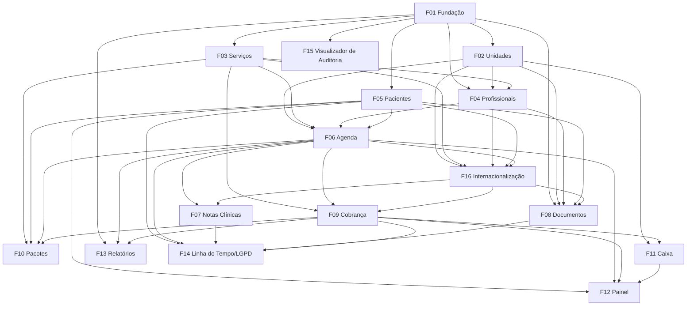

# GCli — Plataforma de Gestão para Clínicas

## 1. Resumo Executivo

O GCli é uma plataforma web responsiva que centraliza a operação diária de uma clínica em um único ambiente: cadastro de pacientes, agenda multiprofissional entre unidades e salas, registro de atendimento clínico, documentos do paciente, pacotes de sessões, cobrança, controle de caixa e indicadores de gestão. É agnóstico quanto à especialidade — serviços, durações, preços, profissionais, salas e modelos de documentos são configurados por cada clínica, em vez de fixados para um único tipo de prática (médica, odontológica, fisioterapia, psicologia, estética, nutrição, etc.).

A primeira versão atende a uma única empresa (clínica) operando até 5 unidades, 50 profissionais, 30 usuários simultâneos, cerca de 500 atendimentos por dia e até 100 mil registros de pacientes. Embora implantado para uma única empresa, todo registro já é vinculado a uma organização desde o início, de modo que o produto possa evoluir para um SaaS multi-tenant sem migração de dados. O acesso é controlado por quatro perfis fixos (Administrador, Gestor, Recepção, Profissional), com o conteúdo clínico visível apenas para profissionais, e toda operação sensível é registrada em um log de auditoria para apoiar a conformidade com a LGPD (Lei Geral de Proteção de Dados).

O valor central é substituir a combinação dispersa de planilhas, agendas de papel, aplicativos de mensagem e ferramentas desconectadas por uma única fonte de verdade: a recepção agenda e recebe pacientes, o profissional registra o atendimento, a cobrança é gerada automaticamente a partir do agendamento, os pagamentos alimentam o caixa diário de cada unidade, e o proprietário vê ocupação, faltas, faturamento e recebíveis em um painel e em relatórios exportáveis. A interface está disponível em português do Brasil, inglês e espanhol, cada unidade segue as convenções do seu país (moeda, documentos, endereço), começando por Brasil, Portugal, Espanha, México, Argentina, Chile, Colômbia e Estados Unidos (F16), e a stack é Next.js com Prisma. Na V1, as regras legais são validadas só para o Brasil.

## 2. Problema e Oportunidade

### O Problema

**Informação de pacientes fragmentada**
- Os dados dos pacientes vivem em planilhas, prontuários de papel, conversas de WhatsApp e anexos de e-mail; é comum a equipe gastar de 3 a 5 minutos por ligação para localizar o histórico de um paciente.
- Cadastros duplicados de pacientes (a mesma pessoa cadastrada duas vezes com variações do nome) quebram a continuidade do histórico clínico.
- Exames e termos de consentimento assinados ficam armazenados em dispositivos pessoais ou pastas de papel, sem acesso controlado e com risco real de perda.
- Não existe um registro confiável do consentimento do paciente para o tratamento de dados, expondo a clínica à luz da LGPD.

**Agendamento sujeito a erros entre profissionais, unidades e salas**
- Duplo agendamento do mesmo profissional ou sala acontece quando as agendas são mantidas em calendários separados ou cadernos de papel.
- Os serviços têm durações diferentes, mas calendários genéricos usam slots fixos, deixando lacunas ociosas ou estouros de 10 a 20 minutos.
- Tratamentos recorrentes (ex.: 10 sessões semanais de fisioterapia) precisam ser agendados um a um, levando de 5 a 10 minutos por série de paciente.
- Cancelamentos e faltas não são rastreados sistematicamente, então as clínicas costumam perder de 10% a 20% da capacidade agendada sem saber quem ou por quê.

**Controle financeiro frouxo**
- As cobranças são calculadas manualmente de memória ou com listas de preço; descontos são concedidos sem aprovação ou rastro.
- Pagamentos parciais e saldos pendentes são controlados no papel, gerando recebíveis não recuperados.
- Pacotes de sessões pré-pagos são controlados em cartões de papel ou planilhas, gerando disputas sobre sessões restantes.
- O fechamento de caixa diário leva mais de 30 minutos e as diferenças entre o caixa contado e o esperado ficam sem explicação.

**Nenhuma visibilidade de gestão**
- O proprietário não tem uma visão consolidada de ocupação, cancelamentos, faturamento e recebíveis por unidade ou profissional.
- Relatórios mensais são montados manualmente em planilhas, levando horas e chegando tarde demais para agir.
- Decisões sobre contratação, horário de funcionamento ou preços são tomadas sem dados.

**Controle de acesso e rastreabilidade fracos**
- Logins compartilhados ou planilhas abertas permitem que qualquer funcionário leia anotações clínicas e dados financeiros.
- Não existe registro de quem alterou um agendamento, anulou um pagamento ou leu o prontuário de um paciente.

### A Oportunidade

- **Informação de pacientes fragmentada → Cadastro único de paciente com linha do tempo:** um cadastro com detecção de duplicidade por CPF e nome + data de nascimento, registro de consentimento, documentos armazenados junto ao paciente e uma linha do tempo cronológica que consolida agendamentos, notas clínicas, documentos e pagamentos.
- **Agendamento sujeito a erros → Agenda multi-recurso com verificação de conflito:** agendamentos validados contra horário de trabalho do profissional, folgas, ocupação de sala e duração do serviço; séries recorrentes agendadas em uma única ação; toda mudança de status (confirmação, cancelamento, falta) registrada com motivo, alimentando indicadores de cancelamento e falta.
- **Controle financeiro frouxo → Cobranças geradas a partir dos agendamentos:** a cobrança é criada automaticamente com o preço do serviço no momento do agendamento, descontos acima de um limite exigem aprovação do gestor, pagamentos parciais são suportados, pacotes têm saldo de sessões rastreado, e um caixa diário por unidade concilia o valor esperado com o valor contado.
- **Nenhuma visibilidade de gestão → Painel e relatórios:** indicadores filtráveis por período, unidade e profissional (ocupação, taxa de falta, faturamento, recebíveis, resultado líquido) e cinco relatórios padrão exportáveis em CSV e PDF.
- **Controle de acesso fraco → Acesso baseado em perfil e log de auditoria:** quatro perfis fixos com uma matriz de permissões clara, conteúdo clínico restrito a profissionais, e um log de auditoria imutável de criações, edições, exclusões e leituras de registro clínico.

O diferencial é a configurabilidade sem complexidade: o mesmo produto atende tanto um consultório de especialidade única quanto uma clínica multiespecialidade com várias unidades, porque serviços, salas, profissionais e modelos de documentos são dados, não código — mantendo, ao mesmo tempo, um modelo de dados pronto para SaaS multi-tenant.

## 3. Público-Alvo

### Usuários Primários

**Proprietário / Administrador da clínica**
- Frequentemente um profissional de saúde que também administra o negócio; precisa de uma visão rápida e confiável de faturamento, ocupação e recebíveis entre unidades.
- Configura a organização: unidades, salas, serviços, preços, usuários e modelos de documentos.
- É responsável pela conformidade com a LGPD e precisa saber quem acessou ou alterou dados sensíveis.

**Gestor de Operações / Financeiro**
- Conduz a operação do dia a dia entre unidades: revisa agendas, aprova descontos, reabre caixas, trata estornos.
- Produz relatórios mensais de produção por profissional, cancelamentos e recebíveis.
- Precisa agir sobre exceções (alta taxa de falta, cobranças não pagas) sem vasculhar planilhas.

**Recepção**
- Atende ligações e pacientes presenciais o dia inteiro; precisa encontrar um paciente e agendar uma consulta em menos de um minuto enquanto o paciente espera.
- Confirma agendamentos, dá entrada nos pacientes (check-in), registra pagamentos e fecha o caixa diário da sua unidade.
- Não deve ter acesso a anotações clínicas, mas precisa de dados administrativos completos sobre o paciente.

**Profissional de saúde**
- Médicos, dentistas, fisioterapeutas, psicólogos, nutricionistas, esteticistas, etc., atuando em uma ou mais unidades com horários de trabalho específicos.
- Precisa ver sua própria agenda, abrir o histórico do paciente antes do atendimento e escrever a nota clínica rapidamente entre uma consulta e outra.
- Emite documentos como atestados médicos, declarações de comparecimento e receituários simples.

### Perfil Comportamental

- Usa o sistema sob pressão de tempo, frequentemente com um paciente à frente; tolera poucos cliques e nenhuma tela lenta.
- Letramento digital moderado: confortável com WhatsApp, navegadores web e planilhas, mas não com software corporativo complexo.
- Usa desktops na recepção, e notebooks, tablets ou celulares nas salas de atendimento e em trânsito.
- Espera as convenções do seu país e idioma (no Brasil: interface em português, validação de CPF, datas no formato DD/MM/AAAA, moeda em reais (BRL), PIX como forma de pagamento).

## 4. Objetivos

### Objetivos do Produto

1. **Centralizar** todas as informações de pacientes, agenda, clínica e finanças da clínica em um único sistema, eliminando planilhas paralelas e agendas de papel.
2. **Agilizar** as operações de recepção — encontrar pacientes, agendar consultas, dar entrada (check-in) e receber pagamentos.
3. **Reduzir** a perda de receita causada por cobranças não rastreadas, descontos sem aprovação, saldos não pagos e faltas.
4. **Fornecer** aos gestores indicadores confiáveis e no tempo certo, por unidade e profissional, para a tomada de decisão.
5. **Proteger** os dados dos pacientes por meio de acesso baseado em perfil, confidencialidade clínica, registro de consentimento e rastreabilidade completa.

### Métricas de Sucesso

| Objetivo | Métrica | Condição de medição |
|-----------|--------|-----------------------|
| Centralizar | 100% dos agendamentos e pagamentos registrados no GCli | Medido 30 dias após o go-live, comparando os registros do sistema com o caderno de agendamentos da unidade e os extratos bancários |
| Centralizar | 0 planilhas ativas usadas para controle de agenda ou pacote | Confirmado pelo proprietário da clínica 60 dias após o go-live |
| Agilizar | Tempo mediano para agendar uma consulta avulsa de paciente existente ≤ 60 segundos | Medido da abertura do formulário de agendamento até o salvamento, em 200 agendamentos no primeiro mês |
| Agilizar | Busca de paciente retorna resultados em ≤ 1 segundo (p95) | Com 100.000 registros de pacientes no banco de dados |
| Agilizar | Fechamento de caixa diário por unidade concluído em ≤ 10 minutos | Mediana ao longo de 20 dias úteis |
| Reduzir perdas | ≥ 98% dos atendimentos concluídos têm uma cobrança ou débito de sessão de pacote vinculado | Medido semanalmente pelo relatório de recebíveis |
| Reduzir perdas | 100% dos descontos acima de 20% têm aprovação do gestor registrada | Auditado mensalmente por meio do log de auditoria |
| Reduzir perdas | Recebíveis com mais de 30 dias reduzidos em 30% | Comparando o mês 3 com o mês 1 após o go-live |
| Fornecer indicadores | Painel carrega em ≤ 3 segundos (p95) | Para um período de 30 dias com ~15.000 agendamentos, todas as unidades selecionadas |
| Fornecer indicadores | Relatório gerencial mensal produzido em ≤ 5 minutos | Tempo desde a abertura de Relatórios até a exportação em PDF/CSV |
| Proteger | 100% das leituras e edições de nota clínica registradas no log de auditoria | Verificado por amostragem de 50 acessos por mês |
| Proteger | 0 acessos a conteúdo clínico por usuários de Recepção | Verificado por testes de permissão e revisão do log de auditoria |
| Proteger | 100% dos pacientes cadastrados após o go-live têm um registro de consentimento | Medido mensalmente |

## 5. Histórias de Usuário

### F01. Fundação da Plataforma, Autenticação e Controle de Acesso
- Como administrador, quero definir a razão social, CNPJ, logotipo e fuso horário da organização para que documentos e relatórios tragam a identificação correta.
- Como administrador, quero criar usuários com um dos quatro perfis e enviar um e-mail de convite para que cada funcionário tenha um login individual.
- Como usuário, quero fazer login com e-mail e senha para acessar apenas as funções que meu perfil permite.
- Como usuário, quero redefinir minha senha esquecida por um link enviado por e-mail para recuperar o acesso sem ligar para o administrador.
- Como administrador, quero desativar um usuário imediatamente para que um ex-funcionário perca o acesso de imediato.
- Como administrador, quero vincular um usuário do perfil Administrador ou Gestor a um cadastro de profissional para que um proprietário que também atende pacientes possa escrever notas clínicas.
- Como sistema, quero registrar toda operação de criação, atualização, exclusão e leitura clínica com autor e data/hora para que o log de auditoria seja completo.

### F02. Unidades e Salas
- Como administrador, quero cadastrar cada unidade com endereço, telefone e horário de funcionamento por dia da semana para que a agenda respeite quando cada unidade está aberta.
- Como administrador, quero cadastrar salas em cada unidade para que os agendamentos possam ser vinculados a um espaço físico.
- Como gestor, quero registrar fechamentos da unidade (feriados, manutenção) para que nenhum agendamento seja marcado nessas datas.
- Como administrador, quero desativar uma sala para que ela deixe de ser oferecida em novos agendamentos sem perder seu histórico.

### F03. Catálogo de Serviços
- Como administrador, quero cadastrar serviços com nome, categoria, duração e preço para que os agendamentos usem o tempo e o preço corretos automaticamente.
- Como administrador, quero marcar se um serviço exige uma sala para que a agenda só exija a alocação de sala quando necessário.
- Como gestor, quero alterar o preço de um serviço para que novos agendamentos usem o novo preço enquanto os existentes mantêm o preço original.
- Como administrador, quero desativar um serviço para que ele deixe de ser oferecido, mas permaneça nos registros históricos.

### F04. Profissionais e Horários de Trabalho
- Como administrador, quero cadastrar um profissional com especialidade e registro no conselho (ex.: CRM 123456/SP) para que essa informação apareça nos documentos.
- Como administrador, quero selecionar quais serviços cada profissional realiza para que apenas profissionais habilitados possam ser agendados para um serviço.
- Como gestor, quero definir o horário de trabalho semanal de cada profissional por unidade, com múltiplos intervalos por dia, para que a agenda mostre a disponibilidade correta.
- Como gestor ou profissional, quero registrar folgas (férias, congressos, bloqueios pessoais) para que esses períodos não sejam agendáveis.
- Como gestor, quero ver a lista de agendamentos futuros antes de desativar um profissional para que eu possa reagendá-los.

### F05. Cadastro de Pacientes
- Como usuário de recepção, quero buscar pacientes por nome, CPF ou telefone com pelo menos 3 caracteres para encontrar o cadastro enquanto o paciente está ao telefone.
- Como usuário de recepção, quero cadastrar um novo paciente com campos obrigatórios e validação de CPF para que os registros sejam completos e consistentes.
- Como usuário de recepção, quero ser avisado sobre uma possível duplicidade (mesmo CPF, ou mesmo nome e data de nascimento) para não criar dois cadastros para a mesma pessoa.
- Como usuário de recepção, quero registrar um responsável legal para pacientes menores de 18 anos para que a clínica saiba quem é o responsável.
- Como usuário de recepção, quero registrar o consentimento do paciente com os termos de privacidade, com data e versão dos termos, para que a clínica cumpra a LGPD.
- Como usuário de recepção, quero adicionar observações administrativas e etiquetas a um paciente para que a equipe saiba de informações não clínicas relevantes (ex.: "prefere manhãs").

### F06. Agendamento e Agenda
- Como usuário de recepção, quero ver a agenda do dia com uma coluna por profissional ou por sala para encontrar horários livres rapidamente.
- Como usuário de recepção, quero agendar uma consulta escolhendo paciente, serviço, profissional, unidade, data e horário para que a duração e o preço sejam preenchidos a partir do serviço.
- Como usuário de recepção, quero que o sistema bloqueie o duplo agendamento de um profissional ou sala para que conflitos nunca cheguem ao paciente.
- Como usuário de recepção, quero agendar uma série recorrente (ex.: toda terça e quinta às 10h por 10 semanas) em uma única ação para que planos de tratamento sejam agendados rapidamente.
- Como usuário de recepção, quero alterar o status do agendamento (confirmado, chegou, faltou, cancelado com motivo) para que a agenda reflita a realidade.
- Como usuário de recepção, quero reagendar uma consulta arrastando-a ou editando data e horário para que o histórico da alteração seja mantido.
- Como gestor, quero permitir um encaixe com confirmação explícita para que casos urgentes possam ser encaixados.
- Como profissional, quero ver apenas minha própria agenda em todas as unidades para saber onde e quando trabalho.
- Como profissional, quero marcar um agendamento como em atendimento e concluído para que a recepção saiba a situação da sala.

### F07. Registro do Atendimento Clínico
- Como profissional, quero escrever uma nota clínica vinculada ao agendamento para que o histórico do paciente seja registrado por atendimento.
- Como profissional, quero que meu rascunho de nota seja salvo automaticamente para não perder o texto se o navegador fechar.
- Como profissional, quero anexar imagens e PDFs à nota para que resultados de exames e fotos fiquem junto do atendimento.
- Como profissional, quero ler notas anteriores do paciente antes do atendimento para saber o histórico.
- Como profissional, quero adicionar um adendo a uma nota travada para complementar informações sem alterar o registro original.
- Como sistema, quero travar as notas 24 horas após a criação para que os registros clínicos não possam ser alterados retroativamente.

### F08. Documentos do Paciente
- Como usuário de recepção, quero anexar arquivos (exames, cópias de documentos, termos assinados) ao cadastro de um paciente com uma categoria para que os documentos fiquem em um só lugar.
- Como administrador, quero criar modelos de documentos com variáveis (nome do paciente, CPF, data, profissional, endereço da unidade) para que documentos recorrentes sejam padronizados.
- Como profissional, quero gerar um atestado médico ou receituário a partir de um modelo em PDF para poder imprimi-lo para o paciente.
- Como usuário de recepção, quero gerar uma declaração de comparecimento para que o paciente possa justificar a ausência no trabalho.
- Como usuário, quero que documentos gerados sejam salvos automaticamente no cadastro do paciente para que possam ser reimpressos depois.

### F09. Cobrança e Pagamentos
- Como sistema, quero criar uma cobrança automaticamente quando um agendamento tiver o check-in registrado para que nenhum atendimento fique sem cobrança.
- Como usuário de recepção, quero aplicar um desconto (percentual ou valor fixo) a uma cobrança para que preços negociados sejam registrados.
- Como gestor, quero aprovar descontos acima de 20% para que grandes descontos sejam controlados.
- Como usuário de recepção, quero registrar um ou mais pagamentos em uma cobrança com forma (dinheiro, PIX, débito, crédito, transferência) para que pagamentos parciais sejam suportados.
- Como usuário de recepção, quero imprimir um recibo de pagamento para que o paciente tenha comprovante do pagamento.
- Como gestor, quero anular uma cobrança ou estornar um pagamento com motivo obrigatório para que correções sejam rastreáveis.
- Como usuário de recepção, quero ver todas as cobranças em aberto de um paciente para poder cobrar saldos pendentes quando ele chegar.

### F10. Pacotes de Sessões
- Como administrador, quero criar modelos de pacote (serviço, número de sessões, preço total, validade) para que a recepção venda pacotes padronizados.
- Como usuário de recepção, quero vender um pacote a um paciente e gerar sua cobrança para que tratamentos pré-pagos sejam registrados.
- Como usuário de recepção, quero vincular um agendamento a um pacote ativo para que a sessão seja debitada do saldo em vez de gerar uma nova cobrança.
- Como usuário de recepção, quero ver as sessões restantes e a data de validade de cada pacote para poder informar o paciente.
- Como gestor, quero estender a validade de um pacote com um motivo para que situações excepcionais possam ser tratadas.

### F11. Caixa e Despesas
- Como usuário de recepção, quero abrir o caixa diário da minha unidade com um saldo inicial para que a movimentação de caixa seja rastreada.
- Como usuário de recepção, quero ver todos os pagamentos recebidos na unidade hoje agrupados por forma para saber os totais esperados.
- Como usuário de recepção, quero registrar entradas e retiradas manuais de caixa (ex.: compra de material) para que toda a movimentação de caixa seja registrada.
- Como usuário de recepção, quero fechar o caixa informando o valor contado para que diferenças sejam identificadas e justificadas.
- Como gestor, quero registrar despesas com categoria, vencimento e status de pagamento para que os custos da clínica sejam conhecidos.
- Como gestor, quero reabrir um caixa fechado com um motivo para que erros possam ser corrigidos.
- Como gestor, quero um extrato financeiro por unidade e período para ver todas as receitas e despesas.

### F12. Painel de Gestão
- Como proprietário, quero ver agendamentos, ocupação, cancelamentos e taxas de falta de um período para entender como a agenda está sendo usada.
- Como proprietário, quero ver faturamento recebido, valor faturado, recebíveis, despesas e resultado líquido para saber a saúde financeira da clínica.
- Como gestor, quero filtrar o painel por unidade e profissional para comparar desempenho.
- Como proprietário, quero comparar o período selecionado com o anterior para ver tendências.

### F13. Relatórios e Exportação
- Como gestor, quero um relatório de agendamentos filtrado por período, unidade, profissional, serviço e status para analisar a agenda.
- Como gestor, quero um relatório de cancelamentos e faltas com motivos para agir sobre as causas.
- Como gestor, quero um relatório de faturamento por forma de pagamento, serviço e profissional para entender de onde vem o dinheiro.
- Como gestor, quero um relatório de recebíveis por idade para priorizar cobranças.
- Como gestor, quero um relatório de produtividade por profissional para avaliar a produção de cada um.
- Como gestor, quero exportar qualquer relatório em CSV e PDF para poder compartilhá-lo ou processá-lo em uma planilha.

### F14. Linha do Tempo do Paciente e Solicitações LGPD
- Como profissional, quero ver uma linha do tempo cronológica dos agendamentos, notas clínicas e documentos do paciente para entender todo o histórico em uma única tela.
- Como usuário de recepção, quero ver a linha do tempo do paciente sem conteúdo clínico para poder responder perguntas administrativas.
- Como administrador, quero exportar todos os dados de um paciente em um arquivo para download para poder responder a uma solicitação de acesso da LGPD dentro do prazo legal.
- Como administrador, quero anonimizar os dados pessoais de um paciente mediante solicitação, quando legalmente permitido, para que a clínica cumpra o direito ao esquecimento.

### F15. Visualizador do Log de Auditoria
- Como administrador, quero buscar no log de auditoria por usuário, entidade, ação e período para poder investigar quem fez o quê.
- Como administrador, quero ver os valores anteriores e novos de uma edição para entender exatamente o que mudou.
- Como administrador, quero exportar os resultados do log de auditoria em CSV para poder apresentar evidências em uma auditoria ou solicitação legal.

### F16. Internacionalização e Perfis de País
- Como usuário, quero escolher o idioma da interface (Português (Brasil), English ou Español) para trabalhar no idioma que leio melhor.
- Como administrador, quero definir o idioma padrão e o país da sede da organização para que novos usuários e novas unidades já comecem com as configurações certas.
- Como administrador, quero definir o país de cada unidade para que moeda, identificação fiscal, formato de endereço, código de telefone, fusos horários, conselhos profissionais e formas de pagamento sigam aquele país.
- Como recepção, quero cadastrar pacientes com o documento de identificação e o formato de endereço do país deles para que os cadastros sejam válidos no local.
- Como gestor, quero ver os valores na moeda de cada unidade, e os totais do painel e dos relatórios separados por moeda, para que dinheiro em moedas diferentes nunca se misture.
- Como usuário, quero e-mails, PDFs e exportações no meu idioma, com os formatos de data e número a que estou acostumado.

## 6. Funcionalidades

### F01. Fundação da Plataforma, Autenticação e Controle de Acesso

**Fornece:**
- Perfil da organização: razão social, nome fantasia, CNPJ, logotipo, fuso horário (usado por F08, F13)
- Contas de usuário: nome, e-mail, perfil, status ativo (usado por F04)
- Registros de eventos de auditoria: ator, ação, tipo de entidade, id da entidade, data/hora, endereço IP, valores antes/depois (usado por F15)

**Capacidades:**
- Estrutura base da aplicação: app Next.js com layout autenticado (menu lateral, cabeçalho com menu do usuário e seletor de unidade), Prisma com PostgreSQL, e um `organizationId` global em toda tabela de negócio para que o modelo de dados suporte múltiplos inquilinos no futuro.
- Configurações da organização: razão social (obrigatório, máx. 150 caracteres), nome fantasia, identificação fiscal do país da sede (CNPJ no Brasil, dígitos verificadores validados), logotipo (PNG/JPG/SVG, máx. 2 MB, exibido em no máximo 200×80 px), fuso horário (padrão America/Sao_Paulo), granularidade do slot da agenda (5, 10, 15 ou 30 minutos; padrão 15), idioma padrão e país da sede (F16; padrão pt-BR e Brasil). A moeda é definida por unidade (F16).
- Até 100 usuários ativos por organização.
- Quatro perfis fixos, um por usuário:

| Área | Administrador | Gestor | Recepção | Profissional |
|------|---------------|---------|------------|--------------|
| Configurações da organização, usuários | Total | Apenas visualizar usuários | — | — |
| Unidades, salas, serviços, modelos | Total | Total | Visualizar | Visualizar |
| Profissionais e horários de trabalho | Total | Total | Visualizar | Apenas suas próprias folgas |
| Pacientes (dados administrativos) | Total | Total | Total | Visualizar pacientes com agendamento com ele |
| Agenda | Todas | Todas | Todas | Própria agenda; status em atendimento/concluído |
| Notas clínicas e anexos clínicos | Apenas se vinculado a um cadastro de profissional | Apenas se vinculado a um cadastro de profissional | — | Criar/ler para pacientes com agendamento com ele |
| Cobrança, pacotes, caixa | Total | Total, incluindo aprovações, anulações, estornos, reabertura | Registrar cobranças, pagamentos, pacotes, caixa; sem anulações/estornos | — |
| Painel e relatórios | Total | Total | — | — |
| Log de auditoria, exportação/anonimização LGPD | Total | — | — | — |

- Um usuário com perfil Administrador ou Gestor pode ser vinculado a um cadastro de profissional (F04), o que adicionalmente concede todas as permissões de Profissional para sua própria agenda e pacientes.
- Autenticação: e-mail + senha. Senha com mínimo de 10 caracteres, com pelo menos uma letra e um dígito, com hash em Argon2id. 5 tentativas falhas consecutivas bloqueiam a conta por 15 minutos.
- Sessões: cookie seguro HTTP-only; expiram após 60 minutos de inatividade e 12 horas de duração absoluta.
- Convites: o administrador cria um usuário (nome, e-mail, perfil); o sistema envia por e-mail um link de convite válido por 72 horas para definir a senha. Reenviar invalida o link anterior.
- Redefinição de senha: link válido por 60 minutos, uso único; a resposta é idêntica independentemente de o e-mail existir ou não.
- Desativar um usuário encerra todas as suas sessões ativas em até 1 minuto; o último Administrador ativo não pode ser desativado ou rebaixado.
- Serviço de registro de auditoria: toda criação, atualização e exclusão em entidades de negócio, toda leitura de nota clínica, sucesso/falha de login e evento de permissão negada são gravados em uma tabela de auditoria somente-inserção, com ator, ação, entidade, data/hora, IP e campos alterados (antes/depois). Registros de auditoria não podem ser editados ou excluídos pela aplicação e são retidos por 5 anos.
- Autorização no servidor em toda rota de API e ação de servidor; ocultar elementos na interface não é considerado proteção.

**Experiência:**
- Tela de login: e-mail, senha, link "Esqueci minha senha". Em caso de sucesso, redireciona para a Agenda (Recepção, Profissional) ou o Painel (Administrador, Gestor).
- Fluxo de convite: o usuário abre o link → vê nome e e-mail pré-preenchidos (somente leitura) → define a senha com um indicador de força e confirmação → é autenticado.
- Tela de usuários (Administrador): tabela com nome, e-mail, perfil, profissional vinculado, status, último login; ações: convidar, editar perfil, reenviar convite, desativar/reativar. Busca por nome ou e-mail.
- Tela de configurações da organização: formulário com os campos acima; pré-visualização do logotipo; salvar exibe o aviso "Configurações salvas".
- O menu de navegação mostra apenas os módulos que o perfil pode acessar; o acesso direto a uma URL proibida mostra uma página 403 "Você não tem permissão para acessar esta página" com um link de volta à tela inicial.

**Tratamento de Erros:**
- Credenciais erradas: "E-mail ou senha inválidos." (genérico, nunca revela qual campo está errado).
- Conta bloqueada: "Conta bloqueada temporariamente por excesso de tentativas. Tente novamente em 15 minutos."
- Link de convite/redefinição expirado ou já usado: "Este link expirou ou já foi utilizado. Solicite um novo." com um botão para solicitar um novo link de redefinição.
- Sessão expirada durante uma operação: os dados do formulário não salvos são mantidos no navegador, o usuário é redirecionado para o login com "Sua sessão expirou. Entre novamente para continuar." e retorna à mesma página após o login.
- Tentativa de desativar o último Administrador: "É necessário manter pelo menos um administrador ativo."

### F02. Unidades e Salas

**Fornece:**
- Unidades (nome, horário de funcionamento por dia da semana, fechamentos) e salas (nome, unidade, status ativo) (usado por F04, F06)
- Nome, endereço e telefone da unidade (usado por F08)
- Lista de unidades para os caixas por unidade (usado por F11)

**Capacidades:**
- Até 20 unidades por organização; até 30 salas por unidade.
- Campos da unidade: país (obrigatório; define moeda, identificação fiscal, campos de endereço e fusos — F16), nome (obrigatório, único, máx. 80 caracteres), identificação fiscal do país (opcional, validada; CNPJ no Brasil), endereço (campos do país — no Brasil CEP, logradouro, número, complemento, bairro, cidade, UF, com o CEP preenchido automaticamente por uma consulta pública de CEP quando disponível, editável manualmente), fuso horário (entre os fusos do país), telefone, e-mail, indicador de ativo.
- Horário de funcionamento: por dia da semana, aberto/fechado mais até 2 intervalos (ex.: 07:00–12:00, 13:00–20:00), com granularidade de 5 minutos.
- Fechamentos: data ou intervalo de datas com motivo (ex.: "Feriado municipal"); até 100 fechamentos futuros por unidade.
- Campos da sala: nome (obrigatório, único dentro da unidade, máx. 50 caracteres), descrição, status ativo.
- Unidades e salas nunca são excluídas de forma definitiva uma vez referenciadas por um agendamento; elas são desativadas. Itens desativados não aparecem nos formulários de agendamento, mas permanecem no histórico, filtros e relatórios.

**Experiência:**
- Lista de unidades: cartões com nome, cidade, número de salas ativas, status. "Nova unidade" abre um formulário com abas: Dados, Horário de funcionamento, Salas, Fechamentos.
- Aba de horário de funcionamento: 7 linhas (Seg–Dom) com alternador "Aberto" e seletores de horário; botão "Copiar para todos os dias úteis".
- Aba de salas: lista embutida com adicionar/editar/desativar.
- Aba de fechamentos: lista de fechamentos futuros; adicionar um mostra quantos agendamentos existentes caem naquele período.
- O seletor de unidade no cabeçalho (do layout de F01) lista unidades ativas; a seleção é lembrada por usuário e pré-filtra Agenda, Caixa e Painel.

**Tratamento de Erros:**
- Desativar uma sala com agendamentos futuros: "Esta sala possui 12 agendamentos futuros. Reatribua-os antes de desativar." com um link para a lista filtrada da agenda.
- Adicionar um fechamento que sobrepõe agendamentos existentes: aviso "Existem 8 agendamentos neste período. Eles não serão cancelados automaticamente." exigindo confirmação; o fechamento é salvo e os agendamentos são listados para tratamento.
- Nome de unidade ou sala duplicado: erro em linha "Já existe uma unidade/sala com este nome."
- Reduzir o horário de funcionamento de modo que agendamentos futuros existentes fiquem fora dele: o salvamento é permitido com um aviso listando a quantidade de agendamentos afetados.

### F03. Catálogo de Serviços

**Fornece:**
- Serviços: nome, categoria, duração padrão, preço atual, cor, indicador de exige-sala, salas permitidas, status ativo (usado por F04, F06, F09, F10)

**Capacidades:**
- Até 500 serviços por organização; até 50 categorias.
- Campos: nome (obrigatório, único, máx. 100 caracteres), categoria (obrigatório, ex.: "Consultas", "Procedimentos", "Terapias"), descrição (máx. 500 caracteres), duração (obrigatório, 5–480 minutos em múltiplos de 5), preço por moeda usada pelas unidades ativas da organização (obrigatório para cada uma, de 0 a 99.999,99 na moeda; zero permitido para retornos gratuitos — F16), cor (de uma paleta de 16), exige sala (sim/não), salas permitidas (subconjunto opcional; vazio = qualquer sala ativa), status ativo.
- Histórico de preço: toda alteração de preço é armazenada com data efetiva e autor; agendamentos registram o preço no momento do agendamento, então alterações nunca modificam agendamentos ou cobranças já existentes.
- Serviços referenciados por agendamentos não podem ser excluídos, apenas desativados.

**Experiência:**
- Lista de serviços agrupada por categoria, com colunas nome, duração, preço, número de profissionais habilitados, status; busca por nome; filtro por categoria e status.
- Formulário de serviço em um painel lateral; um campo de preço por moeda em uso, cada um com a máscara da sua moeda (F16); após alterar o preço, a confirmação diz "O novo preço valerá para novos agendamentos. Agendamentos existentes mantêm o preço original."
- O histórico de preços fica visível em uma aba "Histórico de preços".

**Tratamento de Erros:**
- Nome duplicado: "Já existe um serviço com este nome."
- Duração inválida: "A duração deve ser entre 5 e 480 minutos, em múltiplos de 5."
- Desativar um serviço com agendamentos futuros: o serviço é desativado para novos agendamentos e um aviso mostra "12 agendamentos futuros deste serviço foram mantidos."

### F04. Profissionais e Horários de Trabalho

**Consome:**
- F01: contas de usuário (nome, e-mail, perfil, status ativo) para vinculação opcional
- F02: unidades e salas, horário de funcionamento das unidades
- F03: serviços (nome, status ativo) para habilitação

**Fornece:**
- Profissionais com serviços habilitados, horário de trabalho semanal por unidade, folgas, status ativo (usado por F06)
- Nome do profissional, especialidade, tipo de conselho, número e estado do conselho (usado por F08)

**Capacidades:**
- Até 100 profissionais ativos por organização.
- Campos: nome completo (obrigatório), nome de exibição, especialidade (texto livre, ex.: "Fisioterapia ortopédica"), tipo de conselho (por país das unidades onde o profissional atende — no Brasil CRM, CRO, CREFITO, CRP, CRN, COREN, CRBM, CRF, outro/nenhum; ver F16), número e estado ou região do conselho (obrigatório quando o tipo ≠ nenhum), documento de identificação (tipos do país, F16), telefone, e-mail, cor na agenda, usuário vinculado (opcional; deve ser um usuário ativo com perfil Profissional, ou Administrador/Gestor conforme descrito em F01; um usuário por profissional), status ativo.
- Serviços habilitados: seleção múltipla de serviços ativos; um profissional só pode ser agendado para serviços habilitados.
- Horário de trabalho: por unidade e dia da semana, até 4 intervalos por dia, granularidade de 5 minutos; um profissional pode trabalhar em várias unidades, mas os intervalos não podem se sobrepor entre unidades no mesmo dia. Horários fora do funcionamento da unidade são rejeitados.
- Período de validade: os conjuntos de horário de trabalho têm uma data de início (e fim opcional), permitindo uma mudança futura de horário sem afetar semanas passadas ou atuais.
- Folgas: intervalo de data/hora com tipo (férias, congresso, pessoal, outro) e observação opcional; até 1 ano à frente. Profissionais podem criar/excluir suas próprias folgas; gestores podem gerenciar todas.
- A desativação é bloqueada enquanto o profissional tiver agendamentos futuros não cancelados.

**Experiência:**
- Lista de profissionais com espaço para foto/iniciais, nome, especialidade, unidades, número de serviços, status.
- Formulário do profissional com abas: Dados, Serviços (lista de checkboxes agrupada por categoria com "Selecionar todos da categoria"), Horários (grade semanal por unidade, com "Copiar semana" e datas de validade), Ausências (lista + "Nova ausência").
- A grade semanal destaca visualmente em vermelho os intervalos fora do horário de funcionamento da unidade antes de salvar.
- Criar uma folga que se sobrepõe a agendamentos já marcados mostra a lista de agendamentos afetados com um link para reagendar cada um.

**Tratamento de Erros:**
- Horário de trabalho sobreposto entre unidades: "Conflito de horário: este profissional já atende na unidade Centro às terças, 08:00–12:00."
- Horário de trabalho fora do funcionamento da unidade: "O horário informado está fora do funcionamento da unidade (08:00–18:00)."
- Desativação com agendamentos futuros: "Existem 23 agendamentos futuros. Reagende ou cancele antes de desativar." com um link para a lista filtrada.
- Remover um serviço habilitado que tem agendamentos futuros com este profissional: a remoção é permitida para novos agendamentos, e um aviso lista a quantidade de agendamentos mantidos.
- Vincular um usuário já vinculado a outro profissional: "Este usuário já está vinculado a outro profissional."

### F05. Cadastro de Pacientes

**Fornece:**
- Identidade e contato do paciente: nome completo, nome social, CPF, data de nascimento, telefone, e-mail, endereço, responsável (usado por F06, F08, F10)
- Cadastro completo do paciente, incluindo registros de consentimento, observações, etiquetas e data de criação (usado por F12, F14)

**Capacidades:**
- Até 100.000 pacientes ativos com busca p95 ≤ 1 segundo.
- Campos: nome completo (obrigatório, máx. 150 caracteres), nome social (opcional; exibido no lugar do nome completo na agenda e nas telas quando preenchido), data de nascimento (obrigatório), sexo (feminino, masculino, outro, não informado), documento de identificação (opcional; tipo e número do país do paciente — CPF no Brasil — com dígitos verificadores validados, único por tipo dentro da organização, F16), RG ou documento secundário, celular (obrigatório, formato internacional com o código do país da unidade por padrão; números brasileiros com DDD), telefone secundário, e-mail, endereço (campos do país; consulta de CEP no Brasil como em F02), ocupação, origem de indicação (lista configurável, ex.: Instagram, Google, indicação), observações administrativas (máx. 2.000 caracteres), etiquetas (até 10 por paciente, de uma lista configurável).
- Responsável: obrigatório para pacientes menores de 18 anos no cadastro — nome do responsável, documento de identificação, parentesco, telefone.
- Detecção de duplicidade: ao salvar, o sistema verifica correspondência exata de CPF (bloqueia) e mesmo nome normalizado + data de nascimento (avisa, permite prosseguir com confirmação).
- Consentimento: registro de aceite dos termos de privacidade da clínica — versão dos termos, data/hora, método (assinado em papel e digitalizado, confirmado verbalmente pela equipe, digital), e usuário responsável. O texto dos termos da clínica é mantido pelo Administrador com versionamento; uma nova versão marca os pacientes como "consentimento pendente" até a renovação.
- Busca: por nome (insensível a acento e caixa, parcial), CPF (com ou sem máscara), ou telefone (últimos 8+ dígitos); mínimo de 3 caracteres; resultados mostram 20 por página com nome, idade, CPF (mascarado exceto os últimos 5 dígitos para Recepção), telefone, data do último agendamento.
- A desativação do paciente (ex.: falecido, mudou-se) oculta o paciente das buscas de agendamento, mas mantém os registros.

**Experiência:**
- Campo de busca global de paciente no cabeçalho, disponível em toda tela (atalho de teclado "/").
- Página do paciente com cabeçalho (nome, idade, telefone, etiquetas, selo de status de consentimento) e abas: Dados, Agendamentos, Documentos, Financeiro, Linha do tempo (abas preenchidas pelas funcionalidades que as fornecem; a aba Clínico apenas para perfis autorizados).
- Formulário de cadastro rápido (usado a partir do modal de agendamento): nome completo, data de nascimento, celular — o resto opcional, com um aviso "Cadastro incompleto" até que CPF e consentimento sejam preenchidos.
- Formulário completo com seções; o CEP preenche o endereço automaticamente; o CPF formata conforme digitado.
- Modal de aviso de duplicidade mostra o(s) cadastro(s) candidato(s) lado a lado com "Abrir cadastro existente" e "Criar mesmo assim" (este último apenas para correspondências de nome + data de nascimento).
- Seção de consentimento: botão "Registrar consentimento" abre um modal com a versão dos termos, seletor de método e upload opcional do termo assinado.

**Tratamento de Erros:**
- CPF já cadastrado: "Este CPF já está cadastrado para Maria S. Oliveira." com um link para o cadastro; o salvamento é bloqueado.
- CPF inválido: aviso em linha "CPF inválido."
- Menor sem responsável: "Pacientes menores de 18 anos precisam de um responsável cadastrado."
- Edição concorrente (outro usuário salvou o cadastro depois que este formulário foi aberto): "Este cadastro foi alterado por João às 14:32. Revise as alterações antes de salvar." mostrando os campos divergentes; sem sobrescrita silenciosa.
- Desativar um paciente com agendamentos futuros: "O paciente possui 3 agendamentos futuros. Cancele-os antes de inativar."

### F06. Agendamento e Agenda

**Consome:**
- F02: unidades com horário de funcionamento e fechamentos; salas com status ativo
- F03: serviços com duração padrão, preço atual, indicador de exige-sala, salas permitidas
- F04: profissionais com serviços habilitados, horário de trabalho por unidade, folgas
- F05: identidade e contato do paciente (nome completo, nome social, telefone, data de nascimento)

**Fornece:**
- Registros de agendamento: paciente, profissional, serviço, unidade, sala, data/hora de início/fim, status e histórico de status, preço no momento do agendamento, motivo e origem do cancelamento, série de recorrência, criado-por (usado por F07, F09, F10, F12, F13, F14)

**Escopo Essencial:**
- Agendamento único com validação de conflito, ciclo de status, reagendamento com histórico, visões de dia/semana/lista, filtros, encaixe com confirmação.

**Adições do Escopo Completo:**
- Agendamento de série recorrente e edição de série, reagendamento por arrastar-e-soltar e redimensionamento, visão de dia por sala, agenda diária imprimível por profissional.

**Capacidades:**
- Campos do agendamento: paciente (obrigatório), serviço (obrigatório), profissional (obrigatório, deve ter o serviço habilitado), unidade (obrigatório), sala (obrigatório se o serviço exigir sala; restrita às salas permitidas), data e horário de início (granularidade das configurações de F01), duração (padrão do serviço, editável 5–480 min em múltiplos de 5), preço no momento (do serviço no agendamento), observações para a recepção (máx. 500 caracteres).
- Ciclo de status: Agendado → Confirmado → Chegou → Em atendimento → Concluído; alternativas terminais: Faltou e Cancelado. Transições permitidas para trás: Confirmado → Agendado, Chegou → Confirmado (desfazer em até 30 minutos), Concluído → Em atendimento (pelo profissional do agendamento em até 30 minutos, ou por Gerente/Administrador a qualquer momento, com justificativa). Toda transição registra usuário e data/hora.
- O cancelamento exige origem (paciente, clínica, profissional) e motivo de uma lista configurável mais texto opcional. Falta só pode ser marcada após o horário de início do agendamento.
- Regras de conflito, validadas no servidor ao salvar:
  - Duplo agendamento de profissional: bloqueado; pode ser sobreposto como "Encaixe" por Recepção, Gestor ou Administrador com confirmação explícita; agendamentos com encaixe exibem um selo "Encaixe".
  - Duplo agendamento de sala: sempre bloqueado.
  - Fora do horário de trabalho do profissional, durante uma folga, fora do horário de funcionamento da unidade, ou em um fechamento da unidade: bloqueado para Recepção; Gestor/Administrador pode sobrepor com uma justificativa obrigatória.
  - Paciente com outro agendamento sobreposto ao mesmo horário: apenas aviso.
- Reagendar mantém o mesmo registro de agendamento, armazena a data/hora/profissional/sala anteriores no histórico e reinicia o status para Agendado.
- Recorrência: frequência semanal ou quinzenal, em 1–6 dias da semana selecionados, terminando após N ocorrências (máx. 52) ou em uma data (máx. 12 meses à frente). Antes de salvar, cada ocorrência é validada; ocorrências conflitantes são listadas e o usuário pode ignorá-las ou escolher um horário alternativo por ocorrência. Editar ou cancelar oferece "Somente este", "Este e os seguintes", ou "Todos os futuros".
- Visões: Dia (colunas por profissional, até 20 visíveis com rolagem horizontal, ou por sala), Semana (um único profissional ou sala), Lista (tabela com paginação de 50). Filtros: unidade (contexto obrigatório), profissionais, serviços, status.
- Busca de disponibilidade: "Próximo horário livre" encontra os próximos 10 horários disponíveis para um serviço (e opcionalmente profissional) dentro de 60 dias.
- Concorrência: alterações de outros usuários aparecem em agendas abertas em até 30 segundos (polling) e imediatamente após a ação do próprio usuário.
- Profissionais veem apenas seus próprios agendamentos em todas as unidades.

**Experiência:**
- Tela padrão para Recepção: visão de Dia da unidade selecionada para hoje, linha do horário atual destacada, agendamentos coloridos pela cor do serviço com ícone de status, nome do paciente (nome social se houver), serviço e sala.
- Clicar em um horário vazio abre o modal de agendamento pré-preenchido com profissional, data e horário; clicar em um agendamento abre um painel lateral com detalhes, botões de status, "Reagendar", "Cancelar", links para o cadastro do paciente e (para perfis autorizados) a nota clínica.
- Fluxo do modal de agendamento: busca de paciente (com "Novo paciente" para cadastro rápido embutido) → serviço → profissional (filtrado pelo serviço) → sala (filtrada, selecionada automaticamente se houver só uma disponível) → data/hora → recorrência opcional → salvar. O horário final e o preço são mostrados conforme o serviço é escolhido.
- Conflitos são exibidos em linha no modal antes de salvar (vermelho: bloqueado; amarelo: sobreponível, com "Confirmar encaixe"/"Justificar exceção").
- Mudanças de status são um clique a partir do painel lateral; o cancelamento abre um pequeno formulário com origem e motivo.
- Arrastar-e-soltar (Escopo Completo) move um agendamento; soltar dispara a validação e uma confirmação "Reagendar para qui, 14:30 com Dra. Ana?".
- Avisos confirmam ações: "Agendamento criado", "Status alterado para Chegou".

**Tratamento de Erros:**
- Conflito de profissional: "Dra. Ana já possui atendimento das 14:00 às 14:50. Deseja registrar como encaixe?"
- Conflito de sala: "A Sala 2 está ocupada das 14:00 às 15:00. Escolha outra sala ou horário." (sem opção de sobrepor).
- Agendamento concorrente do mesmo horário (dois usuários salvando com milissegundos de diferença): a restrição do banco de dados rejeita o segundo salvamento e mostra "Este horário acabou de ser ocupado por outro agendamento. Atualize a agenda e escolha outro horário."
- Série recorrente com conflitos: "4 de 20 sessões possuem conflito." com uma lista por ocorrência oferecendo "Pular" ou "Escolher outro horário"; nada é salvo até que o usuário resolva ou ignore todos os conflitos.
- Tentativa de marcar falta antes do horário de início: "Só é possível marcar falta após o horário de início do agendamento."

### F07. Registro do Atendimento Clínico

**Consome:**
- F06: registros de agendamento (paciente, profissional, serviço, data/hora de início, status)

**Fornece:**
- Notas clínicas com autor, agendamento, data/hora de criação e travamento, adendos e anexos clínicos (usado por F14)

**Capacidades:**
- Uma nota clínica por agendamento, criada pelo profissional do agendamento (ou um usuário vinculado a esse cadastro de profissional) quando o status é Chegou, Em atendimento ou Concluído. Notas avulsas (sem agendamento) são permitidas para pacientes com pelo menos um agendamento anterior com o profissional, rotuladas como "Registro avulso".
- Editor de texto rico (negrito, itálico, listas, títulos), máx. 50.000 caracteres.
- Rascunho salvo automaticamente a cada 10 segundos e ao perder o foco; o rascunho é visível apenas para o próprio autor.
- Finalizar ("Finalizar registro") torna a nota visível para outros profissionais autorizados. O autor pode editar a nota finalizada por 24 horas após sua criação; depois disso ela é travada permanentemente. Toda edição dentro das 24 horas armazena uma versão (o conteúdo anterior é mantido).
- Adendos: após o travamento, o autor ou outro profissional autorizado pode adicionar adendos (máx. 10.000 caracteres cada) com seu próprio autor e data/hora; adendos são imutáveis.
- Anexos clínicos: PDF, JPG, PNG, HEIC (convertido para JPG), máx. 20 MB por arquivo, máx. 10 arquivos por nota; armazenados em um repositório de objetos privado, servidos por URLs assinadas de curta duração (5 minutos).
- Acesso: apenas profissionais com pelo menos um agendamento com o paciente (e usuários Administrador/Gestor vinculados a tal profissional). Toda leitura de uma nota é gravada no log de auditoria (F01).
- Notas e anexos nunca são excluídos; um anexo adicionado por engano pode ser marcado como "Anexado por engano" dentro de 24 horas, o que o oculta da visão padrão, mas o mantém no registro.

**Experiência:**
- A partir do painel lateral da agenda ou da página do paciente, "Abrir prontuário" abre uma tela dividida: coluna esquerda com o cabeçalho do paciente (nome, idade, etiqueta de alergias/alertas se houver) e a lista de notas anteriores (data, profissional, serviço, primeiros 150 caracteres); coluna direita com o editor da nota atual.
- Indicador de status acima do editor: "Rascunho salvo às 14:32" / "Finalizado — editável até 29/09 14:10" / "Bloqueado".
- Área de anexos com arrastar-e-soltar, progresso de upload por arquivo e miniaturas.
- Quando o profissional muda o agendamento para Concluído sem uma nota finalizada, um lembrete aparece: "Você ainda não finalizou o registro deste atendimento." (não bloqueante).
- Notas travadas mostram o botão "Adicionar adendo"; adendos aparecem abaixo do texto original com autor e data/hora.

**Tratamento de Erros:**
- Falha no salvamento automático (rede): banner "Não foi possível salvar o rascunho. Suas alterações estão guardadas neste navegador e serão enviadas quando a conexão voltar." com backup local e nova tentativa automática a cada 15 segundos.
- Tentativa de editar após 24 horas: o editor fica somente-leitura com "Este registro foi bloqueado em 29/09 às 14:10. Utilize um adendo para complementar."
- Anexo acima de 20 MB ou formato não suportado: "Arquivo não suportado. Envie PDF, JPG, PNG ou HEIC de até 20 MB."
- Tentativa de acesso não autorizado (ex.: manipulação de URL pela Recepção): página 403 e um evento de auditoria de permissão negada.
- Edição concorrente da mesma nota em duas abas: o segundo salvamento mostra "Este registro foi alterado em outra janela. Recarregue para ver a versão mais recente." sem sobrescrever.

### F08. Documentos do Paciente

**Consome:**
- F01: perfil da organização (razão social, nome fantasia, CNPJ, logotipo)
- F02: nome, endereço e telefone da unidade
- F04: nome do profissional, especialidade, tipo de conselho, número e estado do conselho
- F05: identidade do paciente (nome completo, nome social, CPF, data de nascimento, endereço)

**Fornece:**
- Registros de documento do paciente: tipo (enviado ou gerado), categoria, título, data, autor, referência do arquivo, indicador clínico (usado por F14)

**Escopo Essencial:**
- Enviar, categorizar, visualizar e baixar arquivos no cadastro do paciente.

**Adições do Escopo Completo:**
- Modelos de documento com variáveis e geração de PDF salva no cadastro do paciente.

**Capacidades:**
- Envios: PDF, JPG, PNG, HEIC, DOCX; máx. 20 MB por arquivo; até 20 arquivos por ação de envio; cota de armazenamento da organização de 50 GB com alerta em 80%.
- Categorias (configuráveis, padrão: Exame, Termo assinado, Documento pessoal, Laudo externo, Outro); cada categoria tem um indicador "clínico" — categorias clínicas são visíveis apenas para profissionais autorizados (mesma regra de F07).
- Modelos: até 50; campos: nome, tipo (Atestado, Declaração de comparecimento, Receituário, Encaminhamento, Outro), indicador clínico (modelos clínicos só podem ser gerados por profissionais), corpo em texto rico com variáveis inseridas por um menu: `{{paciente.nome}}`, `{{paciente.cpf}}`, `{{paciente.data_nascimento}}`, `{{profissional.nome}}`, `{{profissional.registro}}` (ex.: "CRM 123456/SP"), `{{profissional.especialidade}}`, `{{unidade.nome}}`, `{{unidade.endereco}}`, `{{clinica.nome}}`, `{{clinica.cnpj}}`, `{{data_hoje}}`, `{{data_extenso}}`, além de campos de texto livre preenchidos no momento da geração (ex.: `{{campo:dias_afastamento}}`).
- 3 modelos pré-configurados: Atestado, Declaração de comparecimento, Receituário simples.
- PDF gerado: A4, cabeçalho com logotipo e nome da organização, rodapé com endereço e telefone da unidade, linha de assinatura com nome do profissional e registro; gerado em ≤ 5 segundos; salvo automaticamente como um documento do paciente (categoria "Documento emitido").
- Documentos não podem ser excluídos de forma definitiva; podem ser arquivados com motivo (Gestor/Administrador), o que os oculta da lista padrão.

**Experiência:**
- Página do paciente, aba "Documentos": lista com data, título, categoria, autor, tamanho; filtros por categoria e tipo; pré-visualização em um modal (PDF e imagens) e download.
- "Enviar arquivos" abre uma área de arrastar-e-soltar com seleção de categoria por arquivo e barras de progresso.
- "Emitir documento" abre: selecionar modelo → selecionar profissional (pré-preenchido com o profissional logado) e unidade (pré-preenchida com a unidade atual) → preencher campos de texto livre → pré-visualização em tempo real → "Gerar PDF" → o PDF abre em uma nova aba para impressão e aparece na lista.

**Tratamento de Erros:**
- Arquivo grande demais ou não suportado: "O arquivo exame.zip não é suportado. Envie PDF, imagens ou DOCX de até 20 MB."
- Envio interrompido: o arquivo que falhou mostra "Falha no envio" com "Tentar novamente"; arquivos enviados com sucesso no mesmo lote são mantidos.
- Cota de armazenamento esgotada: "O espaço de armazenamento da clínica está esgotado (50 GB). Contate o administrador." — envio bloqueado.
- Modelo com uma variável sem valor (ex.: paciente sem CPF): a pré-visualização destaca a variável vazia e pergunta "O CPF do paciente não está cadastrado. Deseja gerar mesmo assim?".
- Falha na geração do PDF: "Não foi possível gerar o documento. Tente novamente." — nenhum documento parcial é salvo.

### F09. Cobrança e Pagamentos

**Consome:**
- F03: preço atual do serviço (para cobranças manuais não vinculadas a um agendamento)
- F06: registros de agendamento (paciente, profissional, serviço, unidade, status, preço no momento do agendamento)

**Fornece:**
- Registros de cobrança e pagamento: paciente, origem (agendamento ou pacote), serviço, profissional, unidade, valor bruto, desconto, valor líquido, status, pagamentos e estornos com forma, valor, data, unidade e usuário (usado por F11, F12, F13, F14)
- Criação de cobrança e status de pagamento para vendas de pacote, além da supressão de cobrança por agendamento para atendimentos cobertos por pacote (usado por F10)

**Capacidades:**
- Cobrança automática: criada com status "Em aberto" quando um agendamento muda para Chegou, com o preço registrado no momento do agendamento. Não é criada para agendamentos com preço R$ 0,00 ou cobertos por um pacote (F10). Se o agendamento voltar para Confirmado dentro da janela de desfazer, a cobrança é removida caso não tenha pagamentos.
- Cobrança manual: para um paciente e serviço (preço a partir do serviço, editável) ou descrição livre, ex.: venda de um produto ou uma taxa.
- Desconto: percentual ou valor fixo; descontos de até 20% podem ser aplicados pela Recepção; acima de 20% exigem aprovação de um Gestor/Administrador (aprovação em linha inserindo suas credenciais, ou aprovação posterior a partir de uma lista de aprovações pendentes). O motivo do desconto é obrigatório acima de 10%.
- Formas de pagamento (lista configurável por país da unidade; padrão do perfil de país de F16, ex.: Brasil: Dinheiro, PIX, Cartão de débito, Cartão de crédito, Transferência, Outro); valores na moeda da unidade; cartão de crédito registra o número de parcelas (1–12) apenas para informação.
- Múltiplos pagamentos por cobrança (pagamentos parciais); status calculado: Em aberto, Parcialmente pago, Pago, Cancelado. Pagamento a maior não é permitido.
- A data do pagamento é hoje por padrão; retroagir até 7 dias é permitido para Gestor/Administrador.
- Anular (cancelar) uma cobrança: Gestor/Administrador, apenas se não tiver pagamentos ativos, motivo obrigatório.
- Estorno de um pagamento: Gestor/Administrador, motivo obrigatório; cria uma movimentação negativa com data de hoje (o pagamento original é mantido).
- Recibo: PDF com dados da organização, paciente, serviços, valores, formas de pagamento e data; gerado em ≤ 3 segundos. Não é um documento fiscal.
- Cada pagamento é atribuído à unidade onde foi recebido (seletor de unidade atual), que pode ser diferente da unidade do agendamento.

**Experiência:**
- No painel lateral da agenda, após o check-in, uma seção "Cobrança" mostra o valor e um botão "Receber".
- Modal de recebimento: resumo da cobrança (serviço, preço, campo de desconto), depois uma ou mais linhas de pagamento (forma + valor), saldo restante calculado ao vivo, "Confirmar recebimento" → aviso "Pagamento registrado" e opção "Imprimir recibo".
- Aba "Financeiro" da página do paciente: cobranças em aberto destacadas no topo com o total devido, depois o histórico de cobranças e pagamentos.
- Tela Financeiro > Cobranças: lista com filtros (período, unidade, status, profissional, forma de pagamento), totais no rodapé.
- Lista de aprovações pendentes para Gestores com botões de aprovar/rejeitar.

**Tratamento de Erros:**
- Pagamento maior que o saldo restante: "O valor informado (R$ 250,00) é maior que o saldo em aberto (R$ 200,00)."
- Desconto acima de 20% sem aprovação: a cobrança fica "Aguardando aprovação de desconto" e não pode receber pagamentos até ser aprovada ou o desconto ser reduzido.
- Envio duplicado (clique duplo / nova tentativa): pagamentos carregam uma chave de idempotência; uma nova submissão dentro de 60 segundos retorna o pagamento já registrado em vez de criar outro.
- Tentativa de anular uma cobrança com pagamentos: "Estorne os pagamentos antes de cancelar esta cobrança."
- Registrar um pagamento em uma unidade cujo caixa do dia já está fechado (aplicável quando F11 estiver em uso): "O caixa da unidade Centro de hoje já foi fechado. Solicite a reabertura a um gestor."

### F10. Pacotes de Sessões

**Consome:**
- F03: serviços (nome, status ativo, preço atual para comparação)
- F05: identidade do paciente (nome completo, CPF)
- F06: registros de agendamento (paciente, serviço, status) para vinculação e débito de sessão
- F09: criação de cobrança e status de pagamento para vendas de pacote, supressão de cobrança por agendamento

**Capacidades:**
- Modelos de pacote: nome, serviço (um serviço por pacote), número de sessões (2–100), preço total (R$ 0,01–R$ 99.999,99), validade em dias a partir da venda (30–730), status ativo. O preço por sessão e o desconto em relação ao preço normal do serviço são exibidos.
- Venda: paciente + modelo; preço editável (as regras de desconto de F09 se aplicam); gera uma única cobrança em F09 com origem "Pacote", pagável em múltiplos pagamentos. A data da venda inicia o período de validade.
- Um paciente pode ter vários pacotes ativos, inclusive para o mesmo serviço.
- Vinculação: ao agendar ou editar um agendamento cujo paciente tenha um pacote ativo com saldo para o mesmo serviço, o modal de agendamento oferece "Usar pacote (6 de 10 sessões restantes)". Agendamentos vinculados não geram cobranças por agendamento.
- Regras de débito: 1 sessão é debitada quando o agendamento vinculado muda para Concluído. O débito por falta é configurável por organização (padrão: não debita). Cancelar ou reagendar não debita. Reverter o status Concluído restaura a sessão.
- Um pacote não pode ser vinculado a mais agendamentos futuros do que seu saldo restante.
- Expiração: ao fim da validade, as sessões restantes são perdidas e o status do pacote passa a "Expirado"; agendamentos futuros vinculados são desvinculados e sinalizados para a recepção. Gestor/Administrador pode estender a validade (até +365 dias) com motivo.
- Cancelamento de pacote: Gestor/Administrador, com motivo; o saldo restante é zerado; qualquer estorno é registrado por meio do fluxo de estorno de F09.
- Pacotes não pagos podem ser usados; o cabeçalho do paciente mostra "Pacote com saldo financeiro em aberto".

**Experiência:**
- Configurações > Pacotes: lista e formulário de modelos.
- Página do paciente, seção "Pacotes" na aba Financeiro: cartões por pacote com serviço, sessões usadas/total (barra de progresso), data de expiração, status de pagamento, e a lista de agendamentos vinculados com seu status.
- Botão "Vender pacote": selecionar modelo → ajustar preço → confirmar → o modal de recebimento (F09) abre opcionalmente para registrar o pagamento agora.
- Na agenda, agendamentos vinculados a pacote mostram um ícone de pacote com "Sessão 4/10".

**Tratamento de Erros:**
- Tentar vincular além do saldo: "Este pacote possui 2 sessões restantes e 2 agendamentos futuros já vinculados."
- Vincular a um pacote expirado: "Este pacote expirou em 15/08/2026." — não permitido.
- Falha na geração da cobrança durante a venda: a venda é totalmente revertida e mostra "Não foi possível registrar a venda do pacote. Nenhuma alteração foi salva."
- Cancelar um pacote com agendamentos futuros vinculados: "Existem 3 agendamentos vinculados. Eles serão desvinculados e passarão a gerar cobrança avulsa." exigindo confirmação.

### F11. Caixa e Despesas

**Consome:**
- F02: lista de unidades
- F09: registros de pagamento e estorno (valor, forma, data, unidade, usuário)

**Fornece:**
- Fechamentos de caixa (unidade, data, valores esperado e contado, diferença) e lançamentos de despesa e receita manual (unidade, categoria, valor, vencimento, data de pagamento, status) (usado por F12)

**Escopo Essencial:**
- Caixa diário por unidade com listagem automática de pagamentos, lançamentos e retiradas manuais, e fechamento com valor contado e justificativa da diferença.

**Adições do Escopo Completo:**
- Despesas com vencimento e status de pagamento (contas a pagar simples), despesas mensais recorrentes, extrato financeiro por período.

**Capacidades:**
- Um caixa por unidade por dia; saldo inicial (padrão o valor contado do dia anterior).
- Lançamentos automáticos: todos os pagamentos e estornos registrados na unidade naquela data, agrupados por forma; apenas "Dinheiro" afeta o caixa físico esperado.
- Lançamentos manuais de caixa: tipo (entrada/saída), valor, descrição (obrigatório), categoria, anexo de comprovante opcional (PDF/JPG/PNG até 10 MB).
- Fechamento: o usuário informa o valor contado; caixa esperado = inicial + pagamentos em dinheiro − estornos em dinheiro + lançamentos manuais − retiradas manuais; qualquer diferença ≠ R$ 0,00 exige uma justificativa (mín. 10 caracteres). Caixas fechados ficam somente-leitura.
- Reabertura: apenas Gestor/Administrador, com motivo; a reabertura e o novo fechamento ficam ambos no histórico.
- Caixas não fechados até 23h59 são sinalizados como "Não fechado" no dia seguinte para a unidade.
- Despesas: descrição, categoria (configurável, padrão: Aluguel, Salários, Materiais, Utilidades, Marketing, Impostos, Serviços de terceiros, Outros), unidade (ou "Geral"), valor, vencimento, status (a pagar / pago), data de pagamento, forma de pagamento, anexo (máx. 10 MB). Despesas mensais recorrentes geram as próximas 12 ocorrências.
- Lançamentos de receita manual (receita não vinda de paciente, ex.: aluguel de sala) com os mesmos campos das despesas.
- Extrato: por unidade e período (máx. 366 dias), listando pagamentos de pacientes (F09), receitas manuais, e despesas pagas com saldo corrente; totais por categoria.

**Experiência:**
- Financeiro > Caixa: unidade e data selecionadas; se não estiver aberto, "Abrir caixa" com saldo inicial. Caixa aberto mostra cartões de resumo por forma, lista de movimentações, "Nova movimentação", e "Fechar caixa".
- Modal de fechamento mostra o valor esperado, campo de valor contado, diferença em verde/vermelho, campo de justificativa quando necessário, "Confirmar fechamento".
- Financeiro > Despesas: lista com filtros por período, categoria, unidade, status; despesas vencidas destacadas em vermelho; ação "Marcar como pago".
- Financeiro > Extrato: tabela com saldo corrente e totais, filtrável por unidade e período.

**Tratamento de Erros:**
- Fechamento com diferença e sem justificativa: "Informe a justificativa para a diferença de R$ 15,00."
- Lançamento manual em um caixa fechado: "Este caixa está fechado. Solicite a reabertura a um gestor."
- Abrir um caixa para uma data que já tem um: abre o caixa existente em vez de criar um duplicado.
- Excluir uma despesa: permitido apenas enquanto "a pagar" e por Gestor/Administrador; despesas pagas só podem ser revertidas com motivo, mantendo o histórico.

### F12. Painel de Gestão

**Consome:**
- F05: datas de criação de paciente (contagem de novos pacientes)
- F06: registros de agendamento com status, profissional, serviço, unidade, duração e dados de cancelamento
- F09: registros de cobrança e pagamento (valores faturado, recebido, em aberto)
- F11: lançamentos de despesa e receita manual

**Escopo Essencial:**
- Cartões de indicadores e filtros por período, unidade e profissional.

**Adições do Escopo Completo:**
- Gráficos, comparação com o período anterior e detalhamento (drill-down) de um indicador para a lista subjacente.

**Capacidades:**
- Acesso: Administrador e Gestor.
- Filtros: período (Hoje, Últimos 7 dias, Últimos 30 dias, Mês atual, Mês anterior, Personalizado até 366 dias), unidade (todas ou uma), profissional (todos ou um).
- Indicadores (com fórmulas mostradas em um tooltip):
  - Agendamentos (total no período, excluindo cancelados), Concluídos.
  - Taxa de ocupação = minutos agendados de atendimentos não cancelados ÷ minutos disponíveis a partir do horário de trabalho dos profissionais menos as folgas.
  - Taxa de cancelamento = cancelados ÷ total agendado; Taxa de falta = faltas ÷ (concluídos + faltas).
  - Novos pacientes (cadastrados no período).
  - Faturado (valor líquido de cobranças não canceladas), Recebido (pagamentos menos estornos), A receber (saldos em aberto criados no período), Ticket médio = recebido ÷ atendimentos concluídos.
  - Despesas pagas, Resultado = Recebido + receitas manuais − despesas pagas (apenas quando o filtro de profissional = todos).
- Gráficos (Escopo Completo): faturamento recebido diário (linha), agendamentos por status (barra empilhada por dia), top 5 serviços por faturamento (barra), faturamento por profissional (barra).
- Comparação (Escopo Completo): cada indicador mostra a variação em relação ao período equivalente anterior (ex.: "+12%").
- Desempenho: ≤ 3 segundos p95 para 30 dias e todas as unidades; atualização dos dados ≤ 5 minutos (agregados em cache são aceitáveis).

**Experiência:**
- Barra superior com filtros; cartões de indicadores em duas linhas (Operação, Financeiro); gráficos abaixo.
- Clicar em um indicador (Escopo Completo) abre o relatório relacionado (F13) ou a lista pré-filtrada com os mesmos filtros.
- Estado vazio: "Sem dados para o período selecionado."
- Horário da última atualização mostrado: "Atualizado às 14:35".

### F13. Relatórios e Exportação

**Consome:**
- F01: perfil da organização (nome fantasia, logotipo) para cabeçalhos de PDF
- F06: registros de agendamento com status, origem e motivo de cancelamento, profissional, serviço, unidade, duração
- F09: registros de cobrança e pagamento com forma, serviço, profissional, unidade, status e datas

**Escopo Essencial:**
- Cinco relatórios com filtros e exportação em CSV.

**Adições do Escopo Completo:**
- Exportação em PDF com cabeçalho da organização, totais de resumo e numeração de páginas.

**Capacidades:**
- Acesso: Administrador e Gestor.
- Relatórios:
  1. **Agendamentos**: data, horário, paciente, serviço, profissional, unidade, sala, status, preço. Filtros: período, unidade, profissional, serviço, status.
  2. **Cancelamentos e faltas**: data, paciente, telefone, serviço, profissional, tipo (cancelado/falta), origem, motivo, antecedência do cancelamento (horas antes do agendamento); resumo por motivo e por profissional.
  3. **Faturamento**: pagamentos e estornos no período por forma, serviço, profissional e unidade, com subtotais por agrupamento escolhido pelo usuário.
  4. **Contas a receber**: cobranças em aberto com paciente, telefone, origem, valor, saldo em aberto, dias em atraso, faixas de atraso 0–30, 31–60, 61–90, 90+ dias.
  5. **Produtividade por profissional**: por profissional — atendimentos concluídos, faltas, cancelamentos, horas atendidas, valor faturado, valor recebido, ticket médio.
- Período máximo: 366 dias. Paginação em tela de 50 linhas com linha de totais.
- CSV: UTF-8 com BOM; separadores seguem o idioma do usuário (pt-BR e es: ponto e vírgula e vírgula decimal, compatível com Excel; en: vírgula e ponto decimal), com coluna de moeda para valores; máx. 50.000 linhas.
- PDF: A4 paisagem, cabeçalho com logotipo, nome do relatório, filtros aplicados, data de geração e usuário; rodapé com página "x de y"; máx. 5.000 linhas (acima disso, o usuário é orientado a exportar em CSV).
- Geração: ≤ 10 segundos para 50.000 linhas em CSV.
- Exportações são registradas no log de auditoria (F01) com o nome do relatório e os filtros.

**Experiência:**
- Tela Relatórios: cartões para os 5 relatórios; abrir um mostra filtros, botão "Gerar", tabela de resultado e botões "Exportar CSV" / "Exportar PDF".
- Os filtros são lembrados por usuário e relatório durante a sessão.
- Exportações longas mostram um indicador de progresso e baixam automaticamente quando prontas.

### F14. Linha do Tempo do Paciente e Solicitações LGPD

**Consome:**
- F05: cadastro completo do paciente, incluindo registros de consentimento, observações, etiquetas e data de criação
- F06: registros de agendamento com histórico de status
- F07: notas clínicas com autor, datas/horas, adendos e anexos clínicos
- F08: registros de documento do paciente com indicador clínico
- F09: registros de cobrança e pagamento do paciente

**Escopo Essencial:**
- Linha do tempo cronológica do paciente com filtragem de itens clínicos baseada em perfil.

**Adições do Escopo Completo:**
- Exportação de dados LGPD e fluxo de anonimização.

**Capacidades:**
- Eventos da linha do tempo: paciente cadastrado, consentimento registrado, agendamentos (com mudanças de status), notas clínicas (finalizadas, adendos), documentos enviados/gerados, cobranças e pagamentos.
- Filtragem por perfil: a Recepção vê apenas eventos administrativos (agendamentos, documentos não clínicos, cobranças, pagamentos, consentimento); Profissionais veem eventos administrativos + clínicos; eventos financeiros são ocultados de Profissionais.
- Filtros por tipo de evento e período; carrega 50 eventos por página (rolagem infinita); p95 ≤ 2 segundos.
- Exportação de dados LGPD (Administrador): gera um ZIP com um arquivo JSON de todos os dados do paciente, um resumo em PDF legível por humanos, e todos os documentos e anexos; disponível para download por 7 dias por meio de um link na tela de solicitações; geração ≤ 5 minutos para um paciente com até 500 arquivos. Toda exportação é registrada com solicitante e motivo.
- Anonimização (Administrador): substitui nome, nome social, CPF, RG, telefones, e-mail, endereço e dados do responsável por marcadores irreversíveis ("Paciente anonimizado #A1B2C3"), exclui documentos não clínicos enviados, e mantém os registros de agendamento e financeiros com a identidade anonimizada para fins de estatística e contabilidade. Se o paciente tiver qualquer nota clínica ou documento clínico, a anonimização é bloqueada porque a legislação brasileira exige a guarda de registros clínicos por no mínimo 20 anos (Lei 13.787/2018); a solicitação é registrada como "Solicitação registrada — retenção legal".
- Registro de solicitação LGPD: toda solicitação LGPD (acesso, correção, anonimização) é registrada com data, solicitante, tipo, status e data de conclusão; solicitações pendentes há mais de 15 dias são destacadas.

**Experiência:**
- Aba "Linha do tempo" da página do paciente: linha do tempo vertical com ícones por tipo de evento, data, autor e resumo; itens clínicos se expandem para mostrar a nota completa (a leitura é auditada).
- Menu do Administrador "LGPD > Solicitações": lista de solicitações e "Nova solicitação" (selecionar paciente, tipo, descrição).
- A anonimização exige uma confirmação em duas etapas: um aviso explicando a irreversibilidade, depois digitar o nome completo do paciente para confirmar.

**Tratamento de Erros:**
- Falha na geração da exportação: o status da solicitação passa a "Falha na geração" com "Tentar novamente"; nenhum arquivo parcial é oferecido.
- Anonimização bloqueada por registros clínicos: "Este paciente possui registros clínicos, que devem ser mantidos por no mínimo 20 anos (Lei 13.787/2018). A solicitação foi registrada e os dados não clínicos podem ser corrigidos, mas não anonimizados."
- Anonimização bloqueada por agendamentos futuros ou cobranças em aberto: "Cancele os agendamentos futuros e regularize as cobranças em aberto antes de anonimizar."
- Confirmação de nome não corresponde: "O nome digitado não confere." — a operação não é executada.

### F15. Visualizador do Log de Auditoria

**Consome:**
- F01: registros de eventos de auditoria (ator, ação, tipo de entidade, id da entidade, data/hora, endereço IP, valores antes/depois)

**Capacidades:**
- Acesso: apenas Administrador.
- Filtros: período (máx. 366 dias por consulta), usuário, ação (criação, atualização, exclusão, leitura de registro clínico, login, falha de login, permissão negada, exportação), tipo de entidade (paciente, agendamento, nota clínica, cobrança, pagamento, caixa, usuário, configurações, etc.), id da entidade (ex.: aberto a partir da página do paciente "Ver auditoria").
- Tabela de resultados: data/hora, usuário, ação, entidade, resumo; paginada em 100 por página; p95 ≤ 3 segundos para 1 milhão de registros.
- Visão de detalhe: diferença campo a campo (antes → depois) para atualizações; texto clínico sensível não é exibido na diferença — apenas "conteúdo clínico alterado" com contagem de caracteres.
- Exportação em CSV de até 100.000 linhas (mesmo formato de CSV de F13); a própria exportação é auditada.

**Experiência:**
- Configurações > Auditoria: barra de filtros no topo, tabela de resultados, clicar em uma linha abre um painel lateral com detalhes e a diferença.
- Links de atalho "Ver auditoria" nas páginas de paciente, agendamento, cobrança e usuário abrem o visualizador já filtrado por aquela entidade.

### F16. Internacionalização e Perfis de País

**Consome:**
- F01: configurações da organização e contas de usuário (idioma padrão, preferência de idioma do usuário)
- F02: unidades (país por unidade)
- F03: serviços (preço por moeda)
- F04: profissionais (registro em conselho por país)
- F05: pacientes (documento de identificação, endereço e telefone por país)
- F06: telas e mensagens da agenda (traduzidas)

**Fornece:**
- Idioma por usuário (pt-BR, en, es), com o padrão da organização, para todas as telas, mensagens, e-mails, PDFs e exportações (usado por todas as funcionalidades)
- Perfil de país por unidade: moeda, identificação fiscal da organização e da unidade, tipos de documento de identificação e validação, campos de endereço, código de país do telefone, tipos de conselho profissional, formas de pagamento padrão, fusos horários disponíveis (usado por F02, F03, F04, F05, F08, F09, F10, F11, F12, F13, F14)
- Formatação de datas, horas, números e valores conforme a localidade (usado por todas as funcionalidades)

**Escopo Essencial (Core):**
- Três idiomas de interface, com preferência por usuário e padrão da organização; formatação por localidade; país por unidade; os oito perfis de país abaixo (moeda, identificação fiscal, documentos de identificação, endereço, telefone, conselhos, formas de pagamento, fusos); preço de serviço por moeda; totais por moeda no painel e nos relatórios; lógica de calendário correta no horário de verão.

**Adições do Escopo Completo (Full):**
- Consulta de código postal para países além do Brasil (onde houver serviço público); modelos de documento padrão (F08) por idioma.

**Capacidades:**
- Idiomas: Português (Brasil) `pt-BR` (padrão), English `en`, Español `es`. Todo rótulo, mensagem, e-mail, PDF e texto de exportação existe nos três idiomas. Os textos em pt-BR deste PRD são a fonte; inglês e espanhol são traduções mantidas nos mesmos catálogos de mensagens. Uma tradução faltando faz o build falhar. Dados digitados pela clínica (nomes de serviços, motivos de cancelamento, observações, modelos) aparecem como foram digitados e não são traduzidos.
- Escolha do idioma: cada usuário escolhe o idioma no menu do usuário; novos usuários e e-mails de convite usam o padrão da organização (definido pelo Administrador nas configurações da organização, padrão pt-BR). As páginas antes do login (login, redefinição de senha, convite) seguem o idioma do navegador quando for um dos três; senão, pt-BR. E-mails usam o idioma do destinatário.
- Formatação por localidade: datas, horas e números seguem o idioma do usuário combinado com o país da unidade em contexto (ex.: pt-BR, es-MX, es-AR, en-US); quando o idioma não é falado naquele país, usa-se a região padrão do idioma (en → en-US, es → es-ES, pt → pt-BR).
- País da organização: o país da sede define o tipo de identificação fiscal da organização (CNPJ no Brasil) e é o país padrão de novas unidades.
- País da unidade: escolhido na criação da unidade, entre os oito perfis; define moeda, identificação fiscal, campos de endereço, código de telefone, fusos, tipos de conselho e formas de pagamento da unidade. O país não pode ser alterado depois que a unidade tem agendamentos, cobranças ou caixas.
- Dinheiro: todo valor carrega sua moeda (ISO 4217) e é armazenado em unidades mínimas inteiras (CLP não tem casas decimais). Cobranças, pagamentos, pacotes, caixas e despesas usam a moeda da sua unidade. Serviços têm um preço por moeda usada pelas unidades ativas da organização; o agendamento registra o preço na moeda da unidade.
- Perfis de país na V1:

| País | Moeda | Documentos de identificação do paciente | Identificação fiscal da organização/unidade | Código postal | Telefone | Conselhos | Formas de pagamento padrão |
|---|---|---|---|---|---|---|---|
| Brasil (BR) | BRL | CPF | CNPJ | CEP (com consulta) | +55 | CRM, CRO, CREFITO, CRP, CRN, COREN, CRBM, CRF | Dinheiro, PIX, Cartão de débito, Cartão de crédito, Transferência |
| Portugal (PT) | EUR | NIF | NIF/NIPC | 0000-000 | +351 | Ordem dos Médicos, Médicos Dentistas, Fisioterapeutas, Psicólogos, Nutricionistas, Enfermeiros | Numerário, Multibanco, MB WAY, Cartão, Transferência |
| Espanha (ES) | EUR | DNI, NIE | NIF | 5 dígitos | +34 | Colegio de Médicos, Dentistas, Fisioterapeutas, Psicólogos, Dietistas-Nutricionistas, Enfermería | Efectivo, Tarjeta, Bizum, Transferencia |
| México (MX) | MXN | CURP | RFC | 5 dígitos | +52 | Cédula profesional | Efectivo, Tarjeta, Transferencia (SPEI) |
| Argentina (AR) | ARS | DNI | CUIT | CPA ou 4 dígitos | +54 | Matrícula nacional, Matrícula provincial | Efectivo, Tarjeta, Transferencia, Mercado Pago |
| Chile (CL) | CLP | RUT | RUT | 7 dígitos (opcional) | +56 | Registro Nacional de Prestadores (Superintendencia de Salud) | Efectivo, Tarjeta, Transferencia |
| Colômbia (CO) | COP | Cédula de ciudadanía, Cédula de extranjería | NIT | 6 dígitos (opcional) | +57 | ReTHUS | Efectivo, Tarjeta, Transferencia, PSE, Nequi |
| Estados Unidos (US) | USD | Nenhum obrigatório (carteira de motorista ou state ID opcional; o SSN nunca é coletado) | EIN | ZIP (5 ou 9 dígitos) | +1 | Licença estadual (estado + número), NPI | Cash, Card, Check, Transfer |

- Documentos de identificação: cada documento do paciente tem tipo e número; os dígitos verificadores são validados quando o documento os tem (CPF, NIF, DNI/NIE, CURP, CUIT, RUT, NIT, NPI). Um documento é único por tipo dentro da organização. O documento é opcional, como o CPF é hoje; a Recepção vê os documentos mascarados nos resultados de busca: o CPF exceto os 5 últimos dígitos (F05), os demais documentos exceto os 4 últimos caracteres. Responsáveis usam os mesmos tipos de documento.
- Endereço: os campos seguem o país (ex.: Brasil: CEP, logradouro, número, complemento, bairro, cidade, UF; Estados Unidos: street, apartment, city, state, ZIP; Chile: calle, comuna, región). Telefones são armazenados em formato internacional; o código de país padrão é o da unidade.
- Profissionais: os tipos de conselho e o formato do registro seguem os países das unidades onde o profissional atende.
- Fusos horários: o fuso de cada unidade é escolhido entre os fusos do seu país. A lógica de calendário (horários de atendimento, funcionamento, agenda, recorrência, "hoje") fica correta nas mudanças de horário de verão (Portugal, Espanha, Chile, Estados Unidos e partes do México adotam).
- Painel e relatórios: valores monetários aparecem por moeda (ex.: "R$ 12.400,00 · € 3.150,00") e nunca são somados entre moedas; contagens e taxas não são afetadas. Filtrar por uma unidade ou país mostra uma única moeda. As exportações CSV usam os separadores do idioma do usuário (pt-BR e es: ponto e vírgula e vírgula decimal; en: vírgula e ponto decimal) e incluem uma coluna de moeda.
- Regras legais: só as regras brasileiras (LGPD, guarda de prontuário por 20 anos, prazo de 15 dias para solicitações do titular, termos de privacidade) têm validade legal na V1. Unidades em outros países aplicam as regras brasileiras, e o Administrador vê um aviso até que as regras de cada país sejam validadas com assessoria jurídica.

**Experiência:**
- Menu do usuário: "Idioma" com Português (Brasil), English e Español; a troca vale na hora, sem sair do sistema.
- Configurações da organização: "Idioma padrão" e "País da sede"; o campo de identificação fiscal segue o país.
- Formulário de unidade: "País" é o primeiro campo; identificação fiscal, campos de endereço e fusos se adaptam a ele; a moeda aparece somente para leitura.
- Formulário de serviço: um campo de preço por moeda em uso, cada um com a máscara da sua moeda.
- Formulário de paciente: "Documento" com os tipos do país (padrão: o país da unidade, com "Outro país" para pacientes estrangeiros) e um endereço que se adapta ao país.
- Campos e valores monetários mostram o símbolo da moeda da unidade; os cartões de dinheiro do painel listam uma linha por moeda.
- Unidades fora do Brasil mostram ao administrador o aviso: "As regras legais deste país ainda não foram validadas. O sistema aplica as regras brasileiras."

**Tratamento de Erros:**
- Documento de identificação inválido: "{Tipo} inválido." (ex.: "CPF inválido.", "NIF inválido.").
- Documento já cadastrado: "Este {tipo} já está cadastrado para Maria S. Oliveira." com link para o cadastro.
- Alterar o país de uma unidade com registros: "Não é possível alterar o país de uma unidade que já tem agendamentos, cobranças ou caixas."
- Agendar um serviço sem preço na moeda da unidade: "Este serviço não tem preço em {moeda}. Defina o preço no catálogo antes de agendar nesta unidade."
- Ativar uma unidade numa moeda em que serviços ativos não têm preço: um aviso lista os serviços sem preço nessa moeda.

## 7. Fora do Escopo

**Comunicação e autoatendimento do paciente**
- Lembretes e confirmações enviados ao paciente por WhatsApp, SMS ou e-mail.
- Agendamento online pelo paciente, portal do paciente ou aplicativo móvel do paciente.
- Links de confirmação enviados a pacientes.

**Funcionalidades clínicas**
- Formulários de anamnese/evolução configuráveis por especialidade (a V1 usa notas em texto livre).
- Assinatura digital de documentos (ICP-Brasil) e receituário eletrônico integrado a farmácias.
- Odontograma, mapas corporais, anotação de imagens e ferramentas clínicas específicas por especialidade.
- Telemedicina / teleconsulta por vídeo.
- Integração com sistemas de laboratório ou equipamentos de imagem (DICOM/PACS).

**Financeiro e fiscal**
- Faturamento por convênio, padrões TISS/TUSS e gestão de glosas.
- Cobrança online (links de pagamento, gateway de cartão, conciliação automática de PIX, boleto).
- Emissão de nota fiscal (NFS-e) e qualquer documento fiscal.
- Cálculo de comissão/repasse de profissionais.
- Conciliação bancária com extratos (OFX) e integrações com sistemas contábeis.
- Conversão de moedas e totais consolidados entre moedas (os valores aparecem por moeda, F16).

**Operações**
- Controle de estoque e materiais.
- Gestão de lista de espera.
- Folha de pagamento e funções de RH.
- Campanhas de marketing e recursos de CRM.

**Plataforma**
- Onboarding self-service multi-tenant, cobrança de assinatura e gestão de planos (o modelo de dados está preparado, mas não a operação SaaS).
- Perfis configuráveis e edição de permissão por ação (a V1 usa 4 perfis fixos).
- Restringir usuários a unidades específicas (na V1 todos os usuários veem todas as unidades).
- Autenticação de dois fatores e single sign-on (SSO).
- Aplicativos móveis nativos e modo offline (o app web responsivo é o único cliente).
- Idiomas de interface além de português do Brasil, inglês e espanhol.
- Perfis de país além de Brasil, Portugal, Espanha, México, Argentina, Chile, Colômbia e Estados Unidos.
- Validação legal de países além do Brasil (lei de privacidade, guarda de prontuário, regras de dados de saúde como a HIPAA); essas unidades aplicam as regras brasileiras na V1.
- API pública para integrações de terceiros.
- Importação de dados legados de outros sistemas (pode ser tratada como um serviço avulso fora do produto).

## 8. Grafo de Dependências

| # | Funcionalidade | Prioridade | Dependências |
|---|---------|----------|--------------|
| F01 | Fundação da Plataforma, Autenticação e Controle de Acesso | 1 | Nenhuma |
| F02 | Unidades e Salas | 1 | F01 |
| F03 | Catálogo de Serviços | 1 | F01 |
| F04 | Profissionais e Horários de Trabalho | 1 | F01, F02, F03 |
| F05 | Cadastro de Pacientes | 1 | F01 |
| F06 | Agendamento e Agenda | 1 | F02, F03, F04, F05 |
| F07 | Registro do Atendimento Clínico | 1 | F06, F16 |
| F08 | Documentos do Paciente | 2 | F01, F02, F04, F05, F16 |
| F09 | Cobrança e Pagamentos | 1 | F03, F06, F16 |
| F10 | Pacotes de Sessões | 2 | F03, F05, F06, F09 |
| F11 | Caixa e Despesas | 2 | F02, F09 |
| F12 | Painel de Gestão | 2 | F05, F06, F09, F11 |
| F13 | Relatórios e Exportação | 2 | F01, F06, F09 |
| F14 | Linha do Tempo do Paciente e Solicitações LGPD | 2 | F05, F06, F07, F08, F09 |
| F15 | Visualizador do Log de Auditoria | 2 | F01 |
| F16 | Internacionalização e Perfis de País | 1 | F01, F02, F03, F04, F05, F06 |

### Funcionalidades de Fundação
Estas funcionalidades montam a infraestrutura compartilhada do projeto. Em um projeto novo (greenfield), elas precisam ser implementadas sequencialmente antes ou junto com qualquer funcionalidade que dependa delas:
- **F01 Fundação da Plataforma, Autenticação e Controle de Acesso** — monta a aplicação Next.js, o layout autenticado e a navegação, a configuração do Prisma/PostgreSQL com vinculação de organização em todas as tabelas, a autenticação e o gerenciamento de sessão, o middleware de autorização baseado em perfil, e o serviço de registro de auditoria somente-inserção usado implicitamente por toda funcionalidade.

### Ondas de Execução
Funcionalidades da mesma onda podem ser construídas em paralelo. Uma onda só começa depois que todas as funcionalidades das ondas anteriores estiverem completas.

**Nota:** Funcionalidades de fundação (ver "Funcionalidades de Fundação" acima) não podem ser executadas em paralelo entre si em um projeto novo (greenfield), mesmo que apareçam juntas em uma onda — elas compartilham arquivos de estrutura básica e precisam ser implementadas sequencialmente até que a base esteja pronta.

- **Onda 1**: F01
- **Onda 2**: F02, F03, F05, F15
- **Onda 3**: F04
- **Onda 4**: F06
- **Onda 5**: F16
- **Onda 6**: F07, F08, F09
- **Onda 7**: F10, F11, F13, F14
- **Onda 8**: F12

### Níveis de prioridade
- **1** = Essencial — o produto não funciona sem isso
- **2** = Importante — adição significativa de valor
- **3** = Desejável — melhoria incremental

## 9. Critérios de Aceitação

### F01. Fundação da Plataforma, Autenticação e Controle de Acesso
- [ ] O administrador pode salvar as configurações da organização com CNPJ válido e um logotipo de até 2 MB; um CNPJ inválido é rejeitado com um erro em linha.
- [ ] O usuário convidado recebe um link por e-mail que define a senha e faz login; o link falha após 72 horas ou após o primeiro uso.
- [ ] Uma senha com menos de 10 caracteres ou sem uma letra e um dígito é rejeitada.
- [ ] O login com credenciais erradas mostra a mensagem genérica "E-mail ou senha inválidos." independentemente de o e-mail existir.
- [ ] Após 5 falhas de login consecutivas, a conta é bloqueada por 15 minutos, mesmo com a senha correta.
- [ ] O link de redefinição de senha expira após 60 minutos e não pode ser reutilizado.
- [ ] A sessão termina após 60 minutos de inatividade; os dados do formulário não salvos são restaurados após um novo login.
- [ ] Um usuário desativado é desconectado de todas as sessões em até 1 minuto e não consegue fazer login novamente.
- [ ] O último Administrador ativo não pode ser desativado ou rebaixado.
- [ ] Cada perfil acessando cada módulo corresponde à matriz de permissões; uma chamada de API proibida retorna 403 mesmo quando chamada diretamente (não apenas oculta na interface).
- [ ] Todo evento de criação, atualização, exclusão, leitura clínica, login, falha de login e permissão negada gera um registro de auditoria com ator, ação, entidade, data/hora e IP.
- [ ] Registros de auditoria não podem ser atualizados ou excluídos por nenhum endpoint da aplicação.
- [ ] Todo registro de tabela de negócio carrega o identificador da organização, e as consultas nunca retornam registros de outra organização.

### F02. Unidades e Salas
- [ ] O administrador pode criar uma unidade com horário de funcionamento por dia da semana (até 2 intervalos) e salas.
- [ ] Nomes de unidade e sala devem ser únicos (salas únicas dentro da unidade); duplicatas são rejeitadas.
- [ ] Uma sala com agendamentos futuros não pode ser desativada; a mensagem mostra a quantidade de agendamentos.
- [ ] Adicionar um fechamento sobre agendamentos existentes avisa com a quantidade e salva após confirmação sem cancelar os agendamentos.
- [ ] Unidades e salas desativadas desaparecem dos formulários de agendamento, mas permanecem visíveis no histórico e nos filtros.
- [ ] O sistema rejeita a criação de uma 21ª unidade ou uma 31ª sala em uma unidade.

### F03. Catálogo de Serviços
- [ ] O serviço só é salvo com duração entre 5 e 480 em múltiplos de 5 e preço entre R$ 0,00 e R$ 99.999,99.
- [ ] Alterar o preço de um serviço cria um registro de histórico de preço e não altera o preço de agendamentos ou cobranças já existentes.
- [ ] Um serviço desativado não é oferecido nos formulários de agendamento e permanece nos agendamentos históricos.
- [ ] Serviços com "exige sala" obrigam a seleção de sala no agendamento; serviços sem essa marcação não permitem nenhuma sala.

### F04. Profissionais e Horários de Trabalho
- [ ] Um profissional com tipo de conselho diferente de "nenhum" não pode ser salvo sem o número e o estado do conselho.
- [ ] Horários de trabalho sobrepostos aos horários do mesmo profissional em outra unidade no mesmo dia da semana são rejeitados.
- [ ] Horários de trabalho fora do horário de funcionamento da unidade são rejeitados, com o horário da unidade na mensagem.
- [ ] Um conjunto de horário de trabalho com data futura não altera a disponibilidade antes de sua data de início.
- [ ] O profissional pode criar e excluir suas próprias folgas, mas não as de outros.
- [ ] A desativação é bloqueada enquanto existirem agendamentos futuros não cancelados.
- [ ] Um usuário não pode ser vinculado a dois profissionais.

### F05. Cadastro de Pacientes
- [ ] Um paciente não pode ser salvo sem nome completo, data de nascimento e celular.
- [ ] Um CPF inválido é rejeitado; um CPF já existente bloqueia o salvamento e leva ao cadastro existente.
- [ ] O mesmo nome normalizado e data de nascimento de um paciente existente mostra um aviso de duplicidade e permite "Criar mesmo assim".
- [ ] Um paciente menor de 18 anos não pode ser salvo sem um responsável.
- [ ] A busca por nome parcial (insensível a acento), CPF com ou sem máscara, ou os últimos 8 dígitos do telefone retorna o paciente em ≤ 1 segundo (p95) com 100.000 registros.
- [ ] A Recepção vê o CPF mascarado, exceto os últimos 5 dígitos, nos resultados de busca.
- [ ] O registro de consentimento armazena versão dos termos, data/hora, método e usuário; publicar uma nova versão dos termos marca os pacientes existentes como "consentimento pendente".
- [ ] Uma edição concorrente é detectada e o segundo salvamento não sobrescreve silenciosamente o primeiro.
- [ ] O nome social, quando preenchido, é exibido no lugar do nome completo na agenda e nas telas do paciente.

### F06. Agendamento e Agenda
- [ ] O agendamento preenche a duração e o preço a partir do serviço selecionado e lista apenas os profissionais habilitados para esse serviço.
- [ ] Agendar o mesmo profissional em um horário sobreposto é bloqueado a menos que confirmado como "Encaixe", o que mostra um selo na agenda.
- [ ] Agendar uma sala já ocupada em um horário sobreposto é sempre bloqueado.
- [ ] Agendar fora do horário de trabalho do profissional, durante uma folga, fora do horário de funcionamento da unidade ou em um fechamento é bloqueado para a Recepção e permitido para Gestor/Administrador apenas com justificativa.
- [ ] Dois salvamentos simultâneos para o mesmo horário de profissional resultam em exatamente um agendamento; o outro usuário vê a mensagem "horário acabou de ser ocupado".
- [ ] As transições de status seguem o ciclo definido e cada uma registra usuário e data/hora; falta não pode ser marcada antes do horário de início.
- [ ] O cancelamento não pode ser salvo sem origem e motivo.
- [ ] O reagendamento mantém o mesmo agendamento, armazena a data/hora/profissional/sala anteriores no histórico e reinicia o status para Agendado.
- [ ] Uma série recorrente de até 52 ocorrências é criada em uma única ação; ocorrências conflitantes são listadas e precisam ser ignoradas ou reagendadas antes de salvar.
- [ ] Cancelar "Este e os seguintes" em uma série cancela apenas a ocorrência selecionada e as posteriores.
- [ ] "Próximo horário livre" retorna até 10 horários respeitando todas as regras de conflito dentro de 60 dias.
- [ ] Um usuário Profissional vê apenas seus próprios agendamentos.
- [ ] Uma alteração feita por um usuário aparece na agenda aberta de outro usuário em até 30 segundos.

### F07. Registro do Atendimento Clínico
- [ ] O profissional só pode criar uma nota para um agendamento com status Chegou, Em atendimento ou Concluído no qual ele seja o profissional.
- [ ] O rascunho é salvo automaticamente a cada 10 segundos; fechar o navegador e reabrir mostra o último rascunho.
- [ ] Após uma falha de rede, o rascunho é mantido localmente e enviado automaticamente quando a conexão retorna.
- [ ] Uma nota finalizada é editável pelo autor até 24 horas após a criação; depois disso o editor fica somente-leitura e apenas adendos são permitidos.
- [ ] Cada edição dentro de 24 horas armazena uma versão anterior.
- [ ] Anexos acima de 20 MB, formatos não suportados, ou um 11º arquivo são rejeitados com a mensagem específica.
- [ ] Usuários de Recepção, e Profissionais sem nenhum agendamento com o paciente, recebem 403 nas URLs de nota e anexo clínico, e um evento de auditoria de permissão negada é registrado.
- [ ] Toda leitura de nota gera um evento de auditoria.
- [ ] As URLs de anexo expiram 5 minutos após serem geradas.

### F08. Documentos do Paciente
- [ ] O usuário pode enviar até 20 arquivos por ação, cada um de até 20 MB, em PDF, JPG, PNG, HEIC ou DOCX, com uma categoria.
- [ ] Um arquivo que falha em um lote não remove os enviados com sucesso e oferece nova tentativa.
- [ ] Documentos em categorias clínicas não ficam visíveis para usuários de Recepção.
- [ ] O envio é bloqueado quando a cota de 50 GB da organização é atingida; um alerta aparece em 80%.
- [ ] Gerar um documento a partir de um modelo substitui todas as variáveis com dados do paciente, profissional, unidade e organização, e salva o PDF nos documentos do paciente em ≤ 5 segundos.
- [ ] Valores de variável ausentes são destacados na pré-visualização e exigem confirmação.
- [ ] Modelos clínicos não podem ser gerados por usuários de Recepção.
- [ ] Documentos arquivados ficam ocultos da lista padrão e continuam acessíveis via "Mostrar arquivados".

### F09. Cobrança e Pagamentos
- [ ] Registrar o check-in de um agendamento com preço > R$ 0,00 não vinculado a um pacote cria uma cobrança "Em aberto" com o preço no momento do agendamento.
- [ ] Desfazer um check-in dentro de 30 minutos remove a cobrança apenas se ela não tiver pagamentos.
- [ ] Um desconto de até 20% é aplicado pela Recepção; acima de 20% a cobrança fica "Aguardando aprovação de desconto" e não pode receber pagamentos até ser aprovada.
- [ ] Um desconto acima de 10% não pode ser salvo sem um motivo.
- [ ] Múltiplos pagamentos em uma cobrança atualizam o status para Parcialmente pago e depois Pago; um pagamento maior que o saldo é rejeitado.
- [ ] Reenviar o mesmo pagamento dentro de 60 segundos não cria uma duplicata.
- [ ] A Recepção não pode anular cobranças ou estornar pagamentos; o Gestor pode, apenas com um motivo; um estorno cria uma movimentação negativa com data de hoje e mantém o pagamento original.
- [ ] Uma cobrança com pagamentos ativos não pode ser anulada.
- [ ] O recibo em PDF inclui dados da organização, paciente, itens, valores, formas e data, gerado em ≤ 3 segundos.
- [ ] O pagamento é atribuído à unidade selecionada no momento do registro.

### F10. Pacotes de Sessões
- [ ] Um modelo de pacote exige 2–100 sessões, preço de R$ 0,01–R$ 99.999,99, e validade de 30–730 dias.
- [ ] Vender um pacote cria exatamente uma cobrança com origem "Pacote"; se a criação da cobrança falhar, nenhum pacote é salvo.
- [ ] Agendar para um paciente com um pacote ativo do mesmo serviço oferece a vinculação, e um agendamento vinculado não gera cobrança no check-in.
- [ ] Concluir um agendamento vinculado debita 1 sessão; reverter a conclusão restaura a sessão; cancelar não debita.
- [ ] A falta debita uma sessão apenas quando a configuração da organização estiver habilitada.
- [ ] A vinculação é bloqueada quando os agendamentos futuros vinculados já igualam o saldo restante.
- [ ] Na expiração, o pacote passa a "Expirado", as sessões restantes são perdidas, e os agendamentos futuros vinculados são desvinculados e sinalizados.
- [ ] O Gestor pode estender a validade em até 365 dias com um motivo; a Recepção não pode.

### F11. Caixa e Despesas
- [ ] Existe apenas um caixa por unidade por dia; o saldo inicial é o valor contado do dia anterior por padrão.
- [ ] Todos os pagamentos e estornos registrados na unidade naquele dia aparecem automaticamente, agrupados por forma.
- [ ] O caixa esperado é calculado como inicial + pagamentos em dinheiro − estornos em dinheiro + lançamentos manuais − retiradas manuais.
- [ ] Fechar com diferença diferente de zero exige uma justificativa de pelo menos 10 caracteres.
- [ ] Um caixa fechado rejeita novos lançamentos manuais e novos pagamentos naquela unidade naquele dia (F09 mostra a mensagem de caixa fechado).
- [ ] Apenas Gestor/Administrador pode reabrir, com motivo; ambos os fechamentos permanecem no histórico.
- [ ] Uma despesa mensal recorrente gera 12 ocorrências; despesas não pagas vencidas são destacadas.
- [ ] O extrato mostra pagamentos, receitas manuais e despesas pagas com um saldo corrente correto para um período de até 366 dias.

### F12. Painel de Gestão
- [ ] Apenas Administrador e Gestor podem acessar o painel.
- [ ] Os indicadores correspondem às fórmulas definidas em F12 para um conjunto de dados de teste controlado (ocupação, taxa de cancelamento, taxa de falta, faturado, recebido, recebíveis, ticket médio, resultado).
- [ ] Filtros por período, unidade e profissional alteram todos os indicadores de forma consistente; "Resultado" fica oculto quando um profissional é selecionado.
- [ ] O painel carrega em ≤ 3 segundos (p95) para 30 dias e todas as unidades com ~15.000 agendamentos.
- [ ] Um período vazio mostra "Sem dados para o período selecionado."
- [ ] A comparação com o período anterior mostra a variação percentual correta (Escopo Completo).

### F13. Relatórios e Exportação
- [ ] Cada um dos 5 relatórios retorna dados consistentes com os filtros e mostra totais.
- [ ] Períodos maiores que 366 dias são rejeitados.
- [ ] O CSV abre corretamente no Excel no idioma do usuário (UTF-8 com BOM; pt-BR e es: separador ponto e vírgula e vírgula decimal; en: separador vírgula e ponto decimal) e suporta até 50.000 linhas geradas em ≤ 10 segundos.
- [ ] O PDF inclui logotipo, nome do relatório, filtros, data/usuário de geração e numeração de páginas; acima de 5.000 linhas o usuário é orientado a exportar em CSV.
- [ ] As faixas de atraso de recebíveis classificam corretamente as cobranças pelos dias em atraso.
- [ ] Toda exportação cria um evento de auditoria com o nome do relatório e os filtros.
- [ ] Usuários de Recepção e Profissional recebem 403 nos endpoints de relatório.

### F14. Linha do Tempo do Paciente e Solicitações LGPD
- [ ] A linha do tempo lista todos os tipos de evento em ordem cronológica com 50 eventos por página, carregando em ≤ 2 segundos (p95).
- [ ] A Recepção não vê eventos clínicos; Profissionais não veem eventos financeiros.
- [ ] Expandir uma nota clínica na linha do tempo gera um evento de auditoria de leitura.
- [ ] A exportação LGPD produz um ZIP com JSON, resumo em PDF e todos os arquivos dentro de 5 minutos para até 500 arquivos, disponível por 7 dias.
- [ ] A anonimização substitui todos os identificadores pessoais de forma irreversível e mantém os registros de agendamento e financeiros sob a identidade anonimizada.
- [ ] A anonimização é bloqueada para pacientes com notas clínicas ou documentos clínicos, e a solicitação é registrada como "retenção legal".
- [ ] A anonimização é bloqueada enquanto existirem agendamentos futuros ou cobranças em aberto.
- [ ] A anonimização não é executada quando o nome digitado não corresponde.
- [ ] Solicitações LGPD pendentes há mais de 15 dias são destacadas.

### F15. Visualizador do Log de Auditoria
- [ ] Apenas o Administrador pode acessar o log de auditoria.
- [ ] Filtros por período, usuário, ação, tipo de entidade e id da entidade retornam resultados corretos em ≤ 3 segundos (p95) com 1 milhão de registros.
- [ ] Eventos de atualização mostram valores antes/depois campo a campo; alterações de texto clínico mostram apenas "conteúdo clínico alterado" com contagem de caracteres.
- [ ] A exportação em CSV de até 100.000 linhas funciona e é ela própria auditada.
- [ ] O link "Ver auditoria" na página do paciente abre o visualizador filtrado por aquele paciente.

### F16. Internacionalização e Perfis de País
- [ ] Cada usuário consegue alternar entre pt-BR, inglês e espanhol; toda tela, mensagem, e-mail e PDF das funcionalidades implementadas aparece no idioma escolhido, e nenhum texto de interface fica fixo no código (toda chave existe nos três catálogos; uma chave faltando faz o build falhar).
- [ ] Novos usuários e e-mails de convite usam o idioma padrão da organização; a página de login segue o idioma do navegador entre os três; senão, pt-BR.
- [ ] Datas, horas, números e valores seguem o idioma do usuário e o país da unidade (ex.: pt-BR "06/10/2026 14:30, R$ 1.234,56"; en-US "10/06/2026 2:30 PM, $1,234.56"; es-MX "06/10/2026 14:30, $1,234.56").
- [ ] O país da unidade define moeda, identificação fiscal, campos de endereço, código de telefone, fusos, tipos de conselho e formas de pagamento; o país não pode ser alterado depois que a unidade tem agendamentos, cobranças ou caixas.
- [ ] Documentos de pacientes e responsáveis são validados por tipo (CPF, NIF, DNI, NIE, CURP, CUIT, RUT, cédula, NIT) e são únicos por tipo dentro da organização; a Recepção os vê mascarados (CPF exceto os 5 últimos dígitos, demais documentos exceto os 4 últimos caracteres).
- [ ] Todo valor é armazenado em unidades mínimas inteiras com sua moeda (CLP sem casas decimais); cobranças, pagamentos, pacotes, caixas e despesas sempre usam a moeda da sua unidade.
- [ ] Agendar numa unidade registra o preço do serviço na moeda dessa unidade; um serviço sem preço nessa moeda não pode ser agendado ali.
- [ ] Os totais monetários do painel e dos relatórios aparecem por moeda e nunca são somados entre moedas; as exportações CSV usam os separadores do idioma do usuário e incluem uma coluna de moeda.
- [ ] A lógica de calendário fica correta nas mudanças de horário de verão (ex.: Europe/Madrid, America/Santiago, America/New_York): um intervalo de atendimento e um agendamento às 09:00 continuam às 09:00 no horário local antes e depois da mudança.
- [ ] Unidades fora do Brasil aplicam as regras legais brasileiras e mostram o aviso ao administrador.

### Integração entre Funcionalidades
- [ ] Contas de usuário ativas de F01 estão disponíveis para vinculação no formulário de profissional (F04), e usuários desativados não são listados.
- [ ] O perfil da organização de F01 (nome, CNPJ, logotipo) aparece em documentos gerados (F08) e nos cabeçalhos de relatórios em PDF (F13).
- [ ] Eventos de auditoria registrados por F01 são pesquisáveis no visualizador do log de auditoria (F15) com valores antes/depois.
- [ ] Unidades e salas de F02 aparecem na grade de horários de trabalho (F04) e no formulário de agendamento (F06); o horário de funcionamento e os fechamentos da unidade de F02 bloqueiam agendamentos em F06.
- [ ] O nome, endereço e telefone da unidade de F02 são substituídos nos modelos de documento (F08).
- [ ] A lista de unidades de F02 determina os caixas disponíveis em F11.
- [ ] Apenas serviços ativos de F03 aparecem na habilitação de profissional (F04), no agendamento (F06), em cobranças manuais (F09) e em modelos de pacote (F10); uma alteração de preço em F03 afeta apenas novos agendamentos em F06.
- [ ] O horário de trabalho e as folgas do profissional de F04 definem os horários agendáveis em F06, e um profissional sem o serviço habilitado não pode ser selecionado para ele.
- [ ] O nome do profissional e o registro no conselho de F04 são substituídos nos documentos gerados (F08).
- [ ] A identidade do paciente de F05 aparece no modal de agendamento (F06), nos documentos gerados (F08), e nas vendas de pacote (F10); o nome social tem precedência quando preenchido.
- [ ] A contagem de novos pacientes no painel (F12) corresponde aos pacientes criados em F05 no período selecionado.
- [ ] A linha do tempo do paciente (F14) mostra registros de consentimento e eventos de cadastro de F05.
- [ ] Notas clínicas (F07) só podem ser criadas a partir de agendamentos (F06) com status válido e mostram a data, serviço e profissional do agendamento.
- [ ] Registrar o check-in de um agendamento em F06 cria uma cobrança em F09 com o preço no momento do agendamento, profissional, serviço e unidade.
- [ ] Agendamentos vinculados a um pacote (F10) não geram cobranças em F09, e concluí-los em F06 debita o saldo do pacote.
- [ ] Vender um pacote em F10 cria uma cobrança em F09, e o cartão do pacote mostra o status de pagamento de F09.
- [ ] Pagamentos e estornos registrados em F09 aparecem automaticamente no caixa da unidade em F11 e afetam o valor esperado apenas para a forma dinheiro.
- [ ] Os indicadores do painel em F12 correspondem aos totais das entidades subjacentes de agendamentos (F06), cobranças e pagamentos (F09) e despesas (F11) para os mesmos filtros.
- [ ] Os totais dos relatórios em F13 correspondem aos registros subjacentes de agendamento (F06) e cobrança/pagamento (F09) para os mesmos filtros.
- [ ] A linha do tempo do paciente (F14) mostra agendamentos de F06, notas clínicas de F07, documentos de F08 e cobranças/pagamentos de F09, com a filtragem baseada em perfil aplicada.
- [ ] A exportação LGPD (F14) contém os dados do paciente de F05, F06, F07, F08 e F09.
- [ ] O idioma escolhido em F16 vale para os e-mails e telas de F01, a agenda de F06, os documentos de F08, os recibos de F09 e os relatórios e exportações de F13.
- [ ] O perfil de país da unidade (F16) define o formulário de unidade de F02, os preços por moeda de F03, os tipos de conselho de F04, o documento, o endereço e o telefone do paciente em F05, as formas de pagamento e a moeda de F09, a moeda do caixa de F11 e os totais por moeda de F12 e F13.
